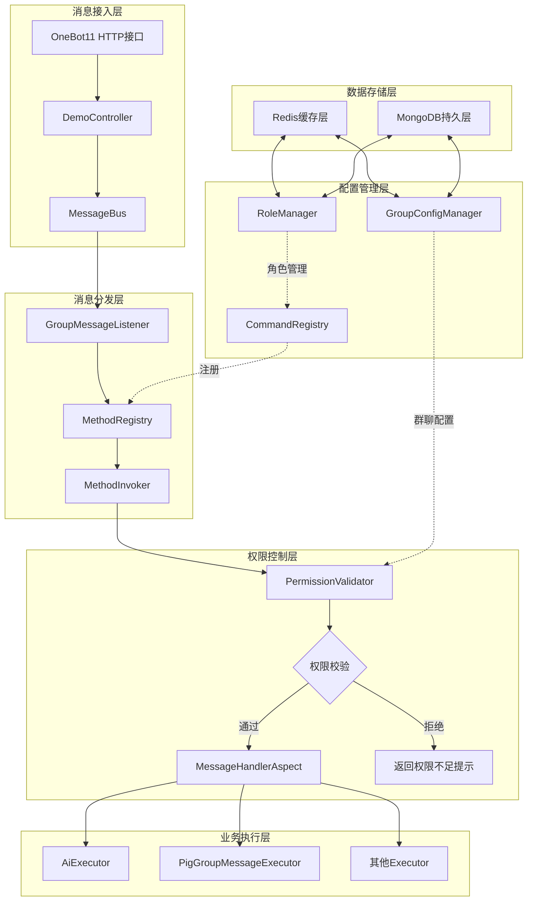
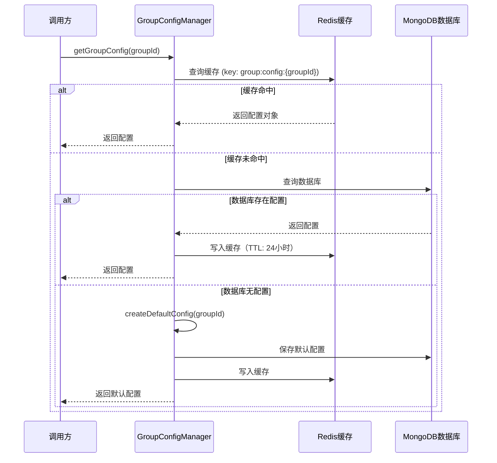
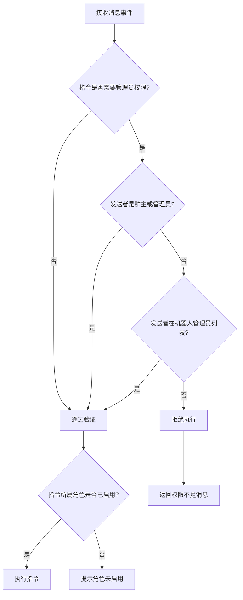
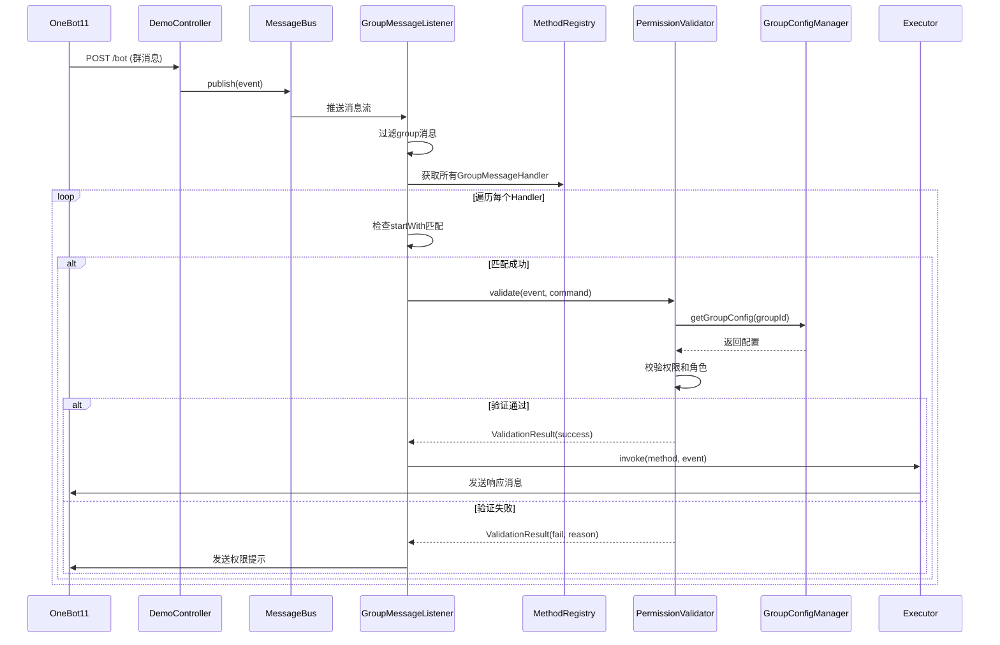
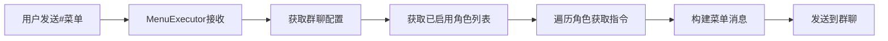
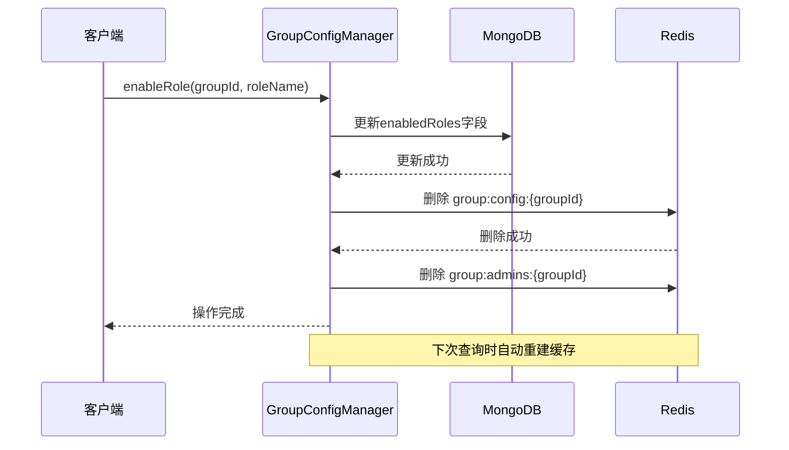
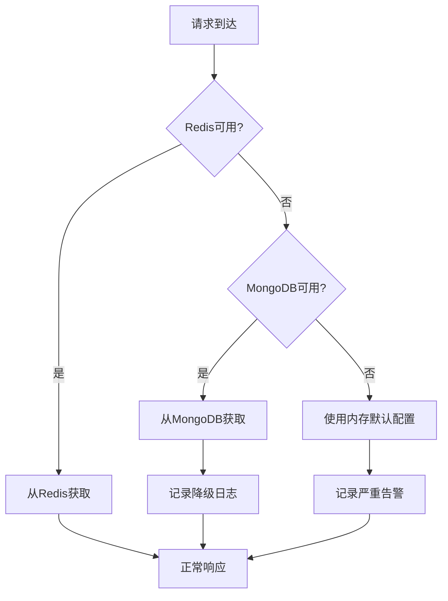
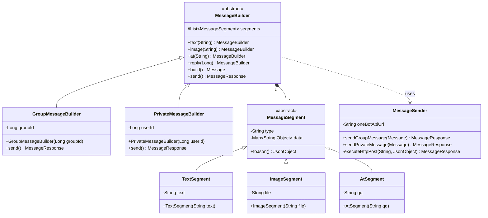

# Bot模块优化设计文档

## 1. 概述

### 1.1 背景

本项目基于OneBot11标准实现QQ群聊机器人框架，当前存在以下问题需要优化：

- GroupInfoUtil架构不清晰，Redis缓存策略未明确定义
- 缺少统一的指令菜单管理机制
- 缺少机器人角色管理体系
- 缺少群聊级别的权限配置机制
- 群聊管理员管理功能缺失

### 1.2 优化目标

- 构建清晰的群聊配置管理架构（GroupInfoUtil重构）
- 建立指令注册与发现机制
- 实现机器人角色与指令集映射体系
- 实现群聊级别的角色启用与权限控制
- 实现群聊管理员管理功能

### 1.3 OneBot11标准说明

消息协议遵循OneBot11标准（参考：https://llonebot.apifox.cn），当前聚焦群聊消息处理，核心字段包括：

| 字段 | 类型 | 说明 |
|------|------|------|
| post_type | String | 消息类型，值为"message" |
| message_type | String | 消息子类型，群聊为"group" |
| group_id | Long | 群号 |
| user_id | Long | 发送者QQ号 |
| sender.role | String | 发送者角色：owner/admin/member |
| message | String | 消息内容 |
| message_id | Long | 消息ID |

## 2. 核心概念定义

### 2.1 指令（Command）

指令是机器人可执行的最小功能单元，通过`@GroupMessageHandler`注解声明。

**指令属性**：

| 属性 | 说明 | 示例 |
|------|------|------|
| 指令名称 | 唯一标识符 | "chat", "publishModel" |
| 触发前缀 | 消息起始匹配字符 | "#chat", "渚" |
| 所属角色 | 该指令归属的机器人角色 | "AI助手", "娱乐机器人" |
| 执行条件 | SpEL表达式条件 | "#payload['level'] > 5" |
| 权限要求 | 是否需要管理员权限 | true/false |

### 2.2 机器人角色（Bot Role）

机器人角色是一组相关指令的集合，代表机器人的某一类功能特征。

**角色属性**：

| 属性 | 说明 |
|------|------|
| 角色名称 | 角色唯一标识 |
| 角色描述 | 角色功能说明 |
| 指令集合 | 该角色包含的所有指令名称列表 |
| 模型配置 | 该角色使用的AI模型配置（可选） |
| 启用状态 | 全局默认启用状态 |

### 2.3 群聊配置（Group Configuration）

每个群聊拥有独立的配置信息，控制该群可用的功能。

**配置属性**：

| 属性 | 说明 |
|------|------|
| 群号 | 群聊唯一标识 |
| 启用角色列表 | 该群已开启的机器人角色 |
| 管理员列表 | 该群机器人管理员的QQ号列表（String） |
| AI模型配置 | 群聊级别的模型配置 |
| 创建时间 | 配置首次创建时间 |
| 更新时间 | 配置最后更新时间 |

## 3. 数据模型设计

### 3.1 指令注册信息（CommandInfo）

扩展现有的`MethodInfo`，增加指令元数据。

| 字段 | 类型 | 说明 |
|------|------|------|
| commandName | String | 指令名称（自动提取自方法名或注解） |
| triggerPrefix | String | 触发前缀（从@GroupMessageHandler.startWith获取） |
| roleName | String | 所属角色名称 |
| requireAdmin | Boolean | 是否需要管理员权限 |
| description | String | 指令描述 |
| bean | Object | Spring Bean实例 |
| method | Method | 处理方法 |
| condition | String | SpEL条件表达式 |

### 3.2 机器人角色实体（BotRole）

存储于MongoDB，集合名称：`bot_roles`

| 字段 | 类型 | 说明 |
|------|------|------|
| _id | String | 角色唯一标识（使用雪花ID） |
| roleName | String | 角色名称（唯一索引） |
| description | String | 角色描述 |
| commandNames | List\<String\> | 指令名称列表 |
| modelConfig | ModelInfo | AI模型配置（可选） |
| isActive | Boolean | 全局启用状态 |
| createdTime | LocalDateTime | 创建时间 |
| updatedTime | LocalDateTime | 更新时间 |

### 3.3 群聊配置实体（GroupConfiguration）

存储于MongoDB，集合名称：`group_configurations`

| 字段 | 类型 | 说明 |
|------|------|------|
| _id | String | 配置ID（使用雪花ID） |
| groupId | String | 群号（唯一索引） |
| enabledRoles | List\<String\> | 已启用的角色名称列表 |
| admins | List\<String\> | 管理员QQ号列表 |
| modelConfig | ModelInfo | 群聊级别AI模型配置 |
| createdTime | LocalDateTime | 创建时间 |
| updatedTime | LocalDateTime | 更新时间 |

### 3.4 用户会话信息（UserSession）

存储于Redis，用于维护用户级别的会话状态。

| 字段 | 类型 | 说明 |
|------|------|------|
| userId | String | 用户QQ号 |
| groupId | String | 群号 |
| currentModel | String | 当前选择的模型 |
| sessionData | Map | 会话附加数据 |

## 4. 架构设计

### 4.1 整体架构图



### 4.2 核心组件职责

#### 4.2.1 CommandRegistry（指令注册中心）

**职责**：启动时扫描所有`@GroupMessageHandler`注解，构建指令信息目录。

**核心方法**：

| 方法名 | 参数 | 返回值 | 说明 |
|--------|------|--------|------|
| scanCommands | - | void | 扫描并注册所有指令 |
| getAllCommands | - | List\<CommandInfo\> | 获取所有已注册指令 |
| getCommandsByRole | String roleName | List\<CommandInfo\> | 获取指定角色的指令集 |
| getCommandByName | String commandName | CommandInfo | 根据指令名称查询 |

#### 4.2.2 RoleManager（角色管理器）

**职责**：管理机器人角色的CRUD操作及角色与指令的映射关系。

**核心方法**：

| 方法名 | 参数 | 返回值 | 说明 |
|--------|------|--------|------|
| createRole | BotRole role | BotRole | 创建新角色 |
| updateRole | BotRole role | BotRole | 更新角色信息 |
| getRoleByName | String roleName | BotRole | 查询角色 |
| getAllActiveRoles | - | List\<BotRole\> | 获取所有启用角色 |
| bindCommandsToRole | String roleName, List\<String\> commands | void | 绑定指令到角色 |

**数据流转策略**：

1. 启动时从MongoDB加载所有角色到Redis（key: `bot:roles`）
2. 角色变更时同步更新MongoDB和Redis
3. 查询优先从Redis获取，未命中则查询MongoDB并回填

#### 4.2.3 GroupConfigManager（群聊配置管理器）

**职责**：管理群聊级别的配置，这是本次重构的核心组件（替代原GroupInfoUtil）。

**核心方法**：

| 方法名 | 参数 | 返回值 | 说明 |
|--------|------|--------|------|
| getGroupConfig | String groupId | GroupConfiguration | 获取群聊配置 |
| createDefaultConfig | String groupId | GroupConfiguration | 创建默认配置 |
| enableRole | String groupId, String roleName | void | 为群聊启用角色 |
| disableRole | String groupId, String roleName | void | 禁用群聊角色 |
| addAdmin | String groupId, String userId | void | 添加管理员 |
| removeAdmin | String groupId, String userId | void | 移除管理员 |
| isAdmin | String groupId, String userId | Boolean | 判断是否为管理员 |
| updateModelConfig | String groupId, ModelInfo modelInfo | void | 更新模型配置 |

**缓存策略**（优化重点）：



**默认配置生成规则**：

1. 查询所有`isActive=true`的角色
2. 将这些角色添加到`enabledRoles`列表
3. 设置默认AI模型（从ModelsRepository获取第一个active模型）
4. 管理员列表初始化为空

#### 4.2.4 PermissionValidator（权限验证器）

**职责**：在指令执行前进行权限校验。

**验证流程**：



**核心方法**：

| 方法名 | 参数 | 返回值 | 说明 |
|--------|------|--------|------|
| validate | GroupMessageEvent event, CommandInfo command | ValidationResult | 执行完整验证 |
| checkAdminPermission | GroupMessageEvent event, String groupId | Boolean | 检查管理员权限 |
| checkRoleEnabled | String groupId, String roleName | Boolean | 检查角色是否启用 |

### 4.3 消息处理流程



## 5. 指令管理设计

### 5.1 指令菜单功能

提供指令菜单查询功能，用户可查看当前群聊可用的所有指令。

**指令示例**：`#菜单` 或 `#help`

**响应内容结构**：

| 角色名称 | 指令列表 | 说明 |
|----------|----------|------|
| AI助手 | #chat, #选择模型, #发布模型 | AI对话相关功能 |
| 娱乐机器人 | 渚 | 发送随机图片 |

**实现流程**：



### 5.2 角色管理指令

仅机器人管理员可执行。

| 指令格式 | 功能 | 示例 |
|----------|------|------|
| #启用角色 {角色名} | 为当前群聊启用指定角色 | #启用角色 AI助手 |
| #禁用角色 {角色名} | 禁用指定角色 | #禁用角色 娱乐机器人 |
| #角色列表 | 查看所有可用角色 | #角色列表 |
| #添加管理员 @{QQ号} | 添加机器人管理员 | #添加管理员 @123456 |
| #移除管理员 @{QQ号} | 移除机器人管理员 | #移除管理员 @123456 |

## 6. 数据存储策略

### 6.1 Redis缓存设计

| Key模式 | 数据类型 | 存储内容 | TTL | 用途 |
|---------|----------|----------|-----|------|
| group:config:{groupId} | Hash | GroupConfiguration对象 | 24小时 | 群聊配置缓存 |
| bot:roles | Hash | Map\<roleName, BotRole\> | 永久 | 所有角色缓存 |
| user:session:{groupId}:{userId} | Hash | UserSession对象 | 2小时 | 用户会话缓存 |
| group:admins:{groupId} | Set | 管理员QQ号集合 | 24小时 | 快速管理员查询 |

### 6.2 MongoDB集合设计

#### 6.2.1 bot_roles集合

索引设计：

| 索引字段 | 类型 | 说明 |
|----------|------|------|
| roleName | 唯一索引 | 加速角色名称查询 |
| isActive | 普通索引 | 筛选启用角色 |

#### 6.2.2 group_configurations集合

索引设计：

| 索引字段 | 类型 | 说明 |
|----------|------|------|
| groupId | 唯一索引 | 群号快速查询 |
| enabledRoles | 多键索引 | 支持按角色查询群聊 |

### 6.3 缓存一致性保证

**更新策略**：先更新MongoDB，再删除Redis缓存（Cache-Aside模式）

**示例**：启用角色流程



## 7. 迁移方案

### 7.1 现有代码改造

#### 7.1.1 GroupInfoUtil重构对照表

| 原方法 | 新方法 | 所属组件 |
|--------|--------|----------|
| getGroupInfo | getGroupConfig | GroupConfigManager |
| getGroupSenderInfo | getUserSession | SessionManager（新增） |
| checkModelPermission | checkRoleEnabled | PermissionValidator |
| publishModel | createRole | RoleManager |
| switchModel | updateUserModel | SessionManager |

#### 7.1.2 数据迁移

**GroupInfo迁移到GroupConfiguration**：

| 原字段 | 新字段 | 转换逻辑 |
|--------|--------|----------|
| groupId | groupId | 直接映射 |
| modelInfo.activeModels | - | 废弃，改用角色机制 |
| modelInfo.modelName | modelConfig.modelName | 映射到新结构 |
| - | enabledRoles | 新增，默认为所有active角色 |
| - | admins | 新增，初始化为空列表 |

### 7.2 向后兼容

保留`GroupInfoUtil`作为适配器，内部调用新组件，标记为`@Deprecated`，计划3个版本后移除。

## 8. 扩展性设计

### 8.1 多消息类型支持

当前设计聚焦群聊消息（`@GroupMessageHandler`），未来可无缝扩展：

- `@PrivateMessageHandler`：私聊消息处理
- `@NoticeHandler`：通知事件处理
- `@RequestHandler`：请求事件处理

扩展方式：复用`CommandRegistry`和`PermissionValidator`架构，仅需新增对应Listener和配置管理器。

### 8.2 插件化支持

**角色插件机制**：

1. 定义角色配置文件（YAML格式）
2. 启动时扫描`roles/`目录
3. 自动注册角色和绑定指令

**配置文件示例**：

```
角色名称: AI助手
描述: 提供智能对话功能
指令列表:
  - chat
  - publishModel
  - switchModel
模型配置:
  默认模型: gemini-pro
启用状态: true
```

### 8.3 权限体系扩展

预留权限等级字段，支持未来细粒度权限控制：

| 等级 | 说明 | 可执行操作 |
|------|------|------------|
| 0 | 普通用户 | 基础指令 |
| 1 | 机器人管理员 | 角色管理、配置修改 |
| 2 | 群管理员 | 群管+机器人管理员权限 |
| 3 | 群主 | 所有权限 |
| 99 | 系统管理员 | 跨群管理 |

## 9. 异常处理设计

### 9.1 异常分类

| 异常类型 | 处理策略 | 用户提示 |
|----------|----------|----------|
| 权限不足异常 | 记录日志，发送提示 | "权限不足，需要管理员权限" |
| 角色未启用异常 | 静默忽略 | 无提示 |
| 配置加载失败 | 使用默认配置，记录错误 | 无提示 |
| 指令参数错误 | 发送使用说明 | "参数错误，使用方式：..." |
| Redis连接失败 | 降级到MongoDB查询 | 无提示 |
| MongoDB连接失败 | 使用内存默认配置 | 系统告警 |

### 9.2 降级策略

**三级降级机制**：



## 10. 性能优化考虑

### 10.1 批量操作优化

**场景**：机器人加入新群时，批量初始化配置。

**优化方案**：使用MongoDB的bulkWrite批量写入，Redis使用pipeline减少网络往返。

### 10.2 缓存预热

**启动时预热策略**：

1. 加载所有角色到Redis（`bot:roles`）
2. 预加载活跃群聊配置（基于历史消息统计）
3. 异步加载，不阻塞启动流程

### 10.3 消息处理优化

**当前实现**：`GroupMessageListener`使用`boundedElastic`线程池异步处理。

**优化建议**：

- 对于耗时指令（如AI对话），使用独立线程池
- 设置消息处理超时时间，避免阻塞
- 实现消息队列持久化，防止消息丢失

## 11. 实施改造方案

### 11.1 改造阶段划分

整体改造分为四个阶段，采用渐进式重构策略，确保系统稳定性。

#### 阶段一：基础设施搭建（第1-2周）

**目标**：建立新的数据模型和存储层，不影响现有功能。

**实施步骤**：

| 步骤 | 任务 | 产出物 | 验证方式 |
|------|------|--------|----------|
| 1.1 | 创建MongoDB集合与索引 | bot_roles、group_configurations集合 | MongoDB Compass验证 |
| 1.2 | 创建实体类 | BotRole.java、GroupConfiguration.java | 单元测试 |
| 1.3 | 创建Repository接口 | BotRoleRepository、GroupConfigRepository | Repository测试 |
| 1.4 | 扩展Redis配置 | 新增RedisTemplate Bean | 连接测试 |
| 1.5 | 初始化默认角色数据 | 角色初始化脚本 | 数据库查询验证 |

**详细实施内容**：

**1.1 MongoDB集合初始化**

在`dbModel`模块创建初始化脚本，启动时自动执行：

```
表：初始化脚本内容

| 操作 | 说明 |
|------|------|
| 创建bot_roles集合 | 设置roleName唯一索引、isActive普通索引 |
| 创建group_configurations集合 | 设置groupId唯一索引、enabledRoles多键索引 |
| 插入默认角色 | AI助手角色（包含chat、publishModel、switchModel指令） |
| 插入默认角色 | 娱乐机器人角色（包含渚指令） |
```

**1.2 实体类设计**

在`dbModel/src/main/java/com/shuanglin/dao/bot/`新建包结构：

```
目录结构：
bot/
├── BotRole.java          // 机器人角色实体
├── BotRoleRepository.java
├── GroupConfiguration.java  // 群聊配置实体
└── GroupConfigurationRepository.java
```

实体字段对照设计文档第3节数据模型。

**1.3 Redis配置扩展**

在`RedisConfig.java`中新增Bean：

```
表：新增Redis Template

| Bean名称 | 数据类型 | 用途 |
|----------|----------|------|
| botRoleRedisTemplate | RedisTemplate<String, BotRole> | 角色缓存 |
| groupConfigRedisTemplate | RedisTemplate<String, GroupConfiguration> | 群聊配置缓存 |
| userSessionRedisTemplate | RedisTemplate<String, UserSession> | 用户会话缓存 |
```

**1.4 数据迁移准备**

创建数据迁移工具类`DataMigrationUtil.java`：

- 从现有GroupInfo数据提取信息
- 生成GroupConfiguration记录
- 验证数据完整性

#### 阶段二：核心组件开发（第3-4周）

**目标**：实现CommandRegistry、RoleManager、GroupConfigManager三大核心组件。

**实施步骤**：

| 步骤 | 任务 | 依赖 | 测试覆盖率要求 |
|------|------|------|----------------|
| 2.1 | 实现CommandInfo模型 | - | 100% |
| 2.2 | 开发CommandRegistry | 2.1 | 90% |
| 2.3 | 开发RoleManager | 阶段一完成 | 85% |
| 2.4 | 开发GroupConfigManager | 阶段一完成 | 90% |
| 2.5 | 开发PermissionValidator | 2.2, 2.4 | 95% |
| 2.6 | 开发SessionManager | 阶段一完成 | 80% |

**详细实施内容**：

**2.1 CommandInfo设计**

在`bot/src/main/java/com/shuanglin/framework/command/`创建：

```
表：CommandInfo核心属性

| 属性 | 数据来源 | 提取逻辑 |
|------|----------|----------|
| commandName | 方法名 | 驼峰转下划线（chatCommand -> chat） |
| triggerPrefix | @GroupMessageHandler.startWith | 直接读取注解值 |
| roleName | @BotCommand.role（新增注解） | 读取角色名称 |
| requireAdmin | @BotCommand.requireAdmin | 默认false |
| description | @BotCommand.description | 用于菜单展示 |
```

需新增`@BotCommand`注解配合`@GroupMessageHandler`使用：

```
注解定义：

属性：
- role: String（默认"default"）
- description: String（默认""）
- requireAdmin: boolean（默认false）
```

**2.2 CommandRegistry实现**

扩展现有`MethodRegistry.java`，新增指令维度的管理：

```
表：CommandRegistry核心方法

| 方法 | 实现逻辑 |
|------|----------|
| scanCommands() | 在scanGroupMessageHandlers基础上提取CommandInfo |
| getCommandByPrefix(String prefix) | 遍历commandInfoList匹配triggerPrefix |
| getCommandsByRole(String role) | 过滤roleName字段 |
| getAllCommandsGroupedByRole() | 按角色分组返回Map<String, List<CommandInfo>> |
```

**2.3 RoleManager实现**

在`bot/src/main/java/com/shuanglin/framework/role/`创建：

```
缓存策略实现流程：

1. 启动时初始化：
   - 从MongoDB加载所有BotRole
   - 写入Redis（key: bot:roles, type: Hash）
   - 每个角色的key为roleName

2. 查询流程：
   - getRoleByName: 先查Redis HGET bot:roles {roleName}
   - 未命中则查MongoDB并回填Redis
   - getAllActiveRoles: HGETALL bot:roles后过滤isActive=true

3. 更新流程：
   - 更新MongoDB（updateRole方法）
   - 删除Redis中对应key（HDEL bot:roles {roleName}）
   - 下次查询时自动回填
```

**2.4 GroupConfigManager实现**

这是替代GroupInfoUtil的核心组件，在`bot/src/main/java/com/shuanglin/framework/config/`创建：

```
表：核心方法实现策略

| 方法 | 缓存Key | 缓存未命中处理 | MongoDB操作 |
|------|---------|----------------|-------------|
| getGroupConfig | group:config:{groupId} | 查询MongoDB，若无则createDefaultConfig | findByGroupId |
| enableRole | - | 先删除缓存 | 更新enabledRoles数组，$addToSet |
| disableRole | - | 先删除缓存 | 更新enabledRoles数组，$pull |
| addAdmin | group:admins:{groupId} | 删除Set缓存 | 更新admins数组，$addToSet |
| isAdmin | group:admins:{groupId} | 从config提取admins构建Set | - |
```

默认配置生成逻辑（createDefaultConfig）：

```
流程：
1. 查询RoleManager.getAllActiveRoles()
2. 提取角色名称列表设置为enabledRoles
3. 从ModelsRepository获取第一个isActive=true的模型
4. 设置modelConfig.modelName
5. admins初始化为空列表
6. 保存到MongoDB
7. 写入Redis缓存（TTL: 24小时）
```

**2.5 PermissionValidator实现**

在`bot/src/main/java/com/shuanglin/framework/permission/`创建：

```
表：验证规则优先级

| 优先级 | 验证项 | 通过条件 | 失败处理 |
|--------|--------|----------|----------|
| 1 | 角色启用检查 | 指令所属角色在群聊enabledRoles中 | 静默忽略（不执行） |
| 2 | 管理员权限检查 | 若requireAdmin=true，检查权限 | 发送权限不足提示 |
| 3 | 条件表达式检查 | SpEL表达式求值为true | 静默忽略 |
```

管理员判定逻辑：

```
checkAdminPermission流程：

1. 检查sender.role是否为owner或admin
   - 是：返回true
   - 否：继续

2. 调用GroupConfigManager.isAdmin(groupId, userId)
   - 检查用户是否在机器人管理员列表
   
3. 返回判定结果
```

**2.6 SessionManager实现**

替代GroupInfoUtil中的用户会话管理部分：

```
表：SessionManager职责

| 方法 | 功能 | Redis Key |
|------|------|----------|
| getUserSession | 获取用户会话 | user:session:{groupId}:{userId} |
| updateUserModel | 更新用户选择的模型 | 同上 |
| clearSession | 清除会话 | DEL命令 |
```

#### 阶段三：消息处理流程改造（第5周）

**目标**：将新组件集成到消息处理链路，保持向后兼容。

**实施步骤**：

| 步骤 | 任务 | 改造位置 | 兼容性策略 |
|------|------|----------|------------|
| 3.1 | 改造GroupMessageListener | GroupMessageListener.java | 新增开关配置 |
| 3.2 | 改造MessageHandlerAspect | MessageHandlerAspect.java | 调用PermissionValidator |
| 3.3 | 改造现有Executor | AiExecutor.java、PigGroupMessageExecutor.java | 使用新Manager获取配置 |
| 3.4 | 创建GroupInfoUtil适配器 | GroupInfoUtil.java（标记@Deprecated） | 内部调用新组件 |

**详细实施内容**：

**3.1 GroupMessageListener改造**

```
改造对照表：

| 原逻辑 | 新逻辑 | 说明 |
|--------|--------|------|
| 遍历methodRegistry.getGroupMessageHandlers() | 遍历commandRegistry.getAllCommands() | 改用CommandInfo |
| 直接调用methodInvoker.invoke | 先调用permissionValidator.validate | 增加权限验证 |
| - | 验证通过后再调用methodInvoker | 条件执行 |
```

新增配置项（application.yaml）：

```
配置：
bot:
  framework:
    permission:
      enabled: true  # 是否启用权限验证（默认true）
    compatibility:
      legacy-mode: false  # 是否使用旧版GroupInfoUtil（默认false）
```

**3.2 MessageHandlerAspect改造**

在切面增加前置验证：

```
执行流程：

@Before切面：
1. 提取GroupMessageEvent参数
2. 从CommandRegistry查找当前方法对应的CommandInfo
3. 调用PermissionValidator.validate(event, commandInfo)
4. 若验证失败，抛出PermissionDeniedException
5. 在@AfterThrowing中捕获异常，发送提示消息
```

**3.3 Executor改造示例（AiExecutor）**

```
改造对照：

原代码：
SenderInfo senderInfo = groupInfoUtil.getGroupSenderInfo(group);
if (!groupInfoUtil.checkModelPermission(group, senderInfo.getModelInfo().getModelName())) {
    return;
}

新代码：
UserSession session = sessionManager.getUserSession(group.getGroupId(), group.getUserId());
GroupConfiguration config = groupConfigManager.getGroupConfig(group.getGroupId());
// 权限验证已在Aspect中完成，此处直接使用
```

同时为每个@GroupMessageHandler添加@BotCommand注解：

```
示例：

@BotCommand(
    role = "AI助手",
    description = "与AI进行对话",
    requireAdmin = false
)
@GroupMessageHandler(startWith = "#chat")
public void chat(GroupMessageEvent group) {
    // ...
}
```

**3.4 GroupInfoUtil适配器**

保留类但标记废弃，方法内部委托给新组件：

```
适配方法对照：

| 原方法 | 委托目标 |
|--------|----------|
| getGroupInfo(event) | groupConfigManager.getGroupConfig(event.getGroupId()) |
| getGroupSenderInfo(event) | sessionManager.getUserSession(...) |
| checkModelPermission(...) | permissionValidator.checkRoleEnabled(...) |
| publishModel(model) | roleManager.createRole(...) + 数据转换 |
| switchModel(...) | sessionManager.updateUserModel(...) |
```

类级别添加：
```
@Deprecated(since = "2.0", forRemoval = true)
@Component
public class GroupInfoUtil { ... }
```

#### 阶段四：新功能开发与测试（第6-7周）

**目标**：基于新架构开发指令菜单、角色管理等新功能。

**实施步骤**：

| 步骤 | 任务 | 新增文件 | 依赖组件 |
|------|------|----------|----------|
| 4.1 | 实现指令菜单功能 | MenuExecutor.java | CommandRegistry |
| 4.2 | 实现角色管理指令 | RoleManagementExecutor.java | RoleManager、GroupConfigManager |
| 4.3 | 实现管理员管理指令 | AdminManagementExecutor.java | GroupConfigManager |
| 4.4 | 编写集成测试 | BotFrameworkIntegrationTest.java | 所有组件 |
| 4.5 | 性能测试与优化 | - | - |

**详细实施内容**：

**4.1 MenuExecutor实现**

```
指令定义：

@BotCommand(role = "系统", description = "查看指令菜单")
@GroupMessageHandler(startWith = "#菜单")
public void showMenu(GroupMessageEvent event)

实现逻辑：
1. 获取群聊配置：groupConfigManager.getGroupConfig(groupId)
2. 提取enabledRoles列表
3. 遍历角色，从commandRegistry获取每个角色的指令
4. 构建格式化消息（表格或卡片形式）
5. 调用OneBot11 API发送
```

消息格式设计：

```
═══════ 指令菜单 ═══════

【AI助手】
  #chat - 与AI对话
  #选择模型 [模型名] - 切换AI模型
  #发布模型 [参数] - 发布新模型 🔒

【娱乐机器人】
  渚 - 发送随机图片

━━━━━━━━━━━━━━━━━━━
🔒 需要管理员权限
发送 #角色列表 查看所有可用角色
```

**4.2 RoleManagementExecutor实现**

```
表：角色管理指令集

| 指令 | 注解配置 | 实现逻辑 |
|------|----------|----------|
| #启用角色 {name} | requireAdmin=true | groupConfigManager.enableRole(groupId, name) |
| #禁用角色 {name} | requireAdmin=true | groupConfigManager.disableRole(groupId, name) |
| #角色列表 | requireAdmin=false | roleManager.getAllActiveRoles() |
| #角色详情 {name} | requireAdmin=false | roleManager.getRoleByName(name) + 指令列表 |
```

参数解析策略：

```
使用正则表达式提取：

String pattern = "#启用角色\\s+(.+)";
Matcher matcher = Pattern.compile(pattern).matcher(message);
if (matcher.find()) {
    String roleName = matcher.group(1).trim();
    // 执行启用逻辑
}
```

**4.3 AdminManagementExecutor实现**

```
表：管理员管理指令

| 指令 | 权限要求 | 实现逻辑 |
|------|----------|----------|
| #添加管理员 @{QQ} | 群主或现有管理员 | 提取QQ号，调用addAdmin |
| #移除管理员 @{QQ} | 仅群主 | 提取QQ号，调用removeAdmin |
| #管理员列表 | 所有人 | 获取admins列表并格式化 |
```

AT消息解析（OneBot11标准）：

```
OneBot11的@消息格式：
{
  "type": "at",
  "data": {
    "qq": "123456789"
  }
}

解析逻辑：
1. 将message字段按空格分割
2. 查找包含"[CQ:at,qq="的部分
3. 正则提取QQ号：\[CQ:at,qq=(\d+)\]
4. 或使用LLOneBot的message对象数组解析
```

**4.4 集成测试设计**

```
测试场景覆盖：

| 场景 | 前置条件 | 操作 | 预期结果 |
|------|----------|------|----------|
| 新群聊首次消息 | 数据库无该群配置 | 发送#chat消息 | 自动创建默认配置，正常响应 |
| 角色未启用 | 禁用娱乐机器人角色 | 发送"渚" | 无响应（静默） |
| 权限不足 | 普通成员 | 发送#发布模型 | 提示权限不足 |
| 管理员执行 | 添加用户为管理员 | 发送#发布模型 | 正常执行 |
| Redis故障降级 | 停止Redis服务 | 发送任意指令 | 从MongoDB读取，功能正常 |
| 缓存一致性 | - | 启用角色后立即查询 | 配置已更新 |
```

### 11.2 代码文件清单

#### 新增文件

```
表：新增Java类文件

| 模块 | 包路径 | 文件名 | 说明 |
|------|--------|--------|------|
| dbModel | com.shuanglin.dao.bot | BotRole.java | 角色实体 |
| dbModel | com.shuanglin.dao.bot | BotRoleRepository.java | 角色Repository |
| dbModel | com.shuanglin.dao.bot | GroupConfiguration.java | 群聊配置实体 |
| dbModel | com.shuanglin.dao.bot | GroupConfigurationRepository.java | 配置Repository |
| dbModel | com.shuanglin.dao.bot | UserSession.java | 用户会话实体 |
| bot | com.shuanglin.framework.command | CommandInfo.java | 指令信息模型 |
| bot | com.shuanglin.framework.command | CommandRegistry.java | 指令注册中心 |
| bot | com.shuanglin.framework.annotation | BotCommand.java | 指令注解 |
| bot | com.shuanglin.framework.role | RoleManager.java | 角色管理器 |
| bot | com.shuanglin.framework.config | GroupConfigManager.java | 群聊配置管理器 |
| bot | com.shuanglin.framework.permission | PermissionValidator.java | 权限验证器 |
| bot | com.shuanglin.framework.permission | ValidationResult.java | 验证结果模型 |
| bot | com.shuanglin.framework.permission | PermissionDeniedException.java | 权限异常 |
| bot | com.shuanglin.framework.session | SessionManager.java | 会话管理器 |
| bot | com.shuanglin.executor | MenuExecutor.java | 菜单功能执行器 |
| bot | com.shuanglin.executor | RoleManagementExecutor.java | 角色管理执行器 |
| bot | com.shuanglin.executor | AdminManagementExecutor.java | 管理员管理执行器 |
```

#### 修改文件

```
表：需要修改的现有文件

| 模块 | 文件路径 | 修改内容 | 向后兼容 |
|------|----------|----------|----------|
| bot | RedisConfig.java | 新增3个RedisTemplate Bean | 是 |
| bot | GroupMessageListener.java | 集成PermissionValidator | 是（配置开关） |
| bot | MessageHandlerAspect.java | 增加权限验证切面逻辑 | 是 |
| bot | AiExecutor.java | 使用新Manager替代GroupInfoUtil | 是（保留旧代码注释） |
| bot | PigGroupMessageExecutor.java | 添加@BotCommand注解 | 是 |
| bot | GroupInfoUtil.java | 标记@Deprecated，改为适配器模式 | 是 |
| bot | MethodRegistry.java | 扩展支持CommandRegistry | 是 |
```

### 11.3 数据迁移方案

#### 迁移时机

在阶段三完成后，执行一次性数据迁移。

#### 迁移步骤

```
表：数据迁移执行计划

| 步骤 | 操作 | 工具/方法 | 回滚方案 |
|------|------|-----------|----------|
| M1 | 备份现有Redis数据 | BGSAVE命令 | 使用RDB文件恢复 |
| M2 | 备份MongoDB数据 | mongodump | mongorestore |
| M3 | 创建初始角色数据 | RoleInitializer.java | 手动删除 |
| M4 | 转换GroupInfo到GroupConfiguration | DataMigrationUtil.java | 保留原数据 |
| M5 | 验证迁移数据完整性 | MigrationValidator.java | - |
| M6 | 清理旧Redis Key | 手动执行DEL命令 | 从备份恢复 |
```

#### 迁移脚本示例

```
DataMigrationUtil核心逻辑：

流程：
1. 查询所有Redis中的group_info_staff数据
2. 遍历每个GroupInfo：
   a. 提取groupId
   b. 提取modelInfo.activeModels，映射为enabledRoles
      - 规则：activeModels包含模型名 -> 启用对应角色
   c. admins设置为空列表
   d. 创建GroupConfiguration对象
   e. 保存到MongoDB
3. 记录迁移日志
4. 生成迁移报告（成功数、失败数、详细错误）
```

角色与模型映射规则：

```
表：模型到角色的映射

| 原modelInfo.activeModels值 | 映射为enabledRoles |
|----------------------------|--------------------|
| ["gemini-pro", "ollama"] | ["AI助手"] |
| ["pig-model"] | ["娱乐机器人"] |
| 空列表 | 所有active=true的角色 |
```

### 11.4 测试策略

#### 单元测试覆盖率目标

```
表：测试覆盖率要求

| 组件 | 行覆盖率 | 分支覆盖率 | 关键测试场景 |
|------|----------|------------|---------------|
| CommandRegistry | 90% | 85% | 注解解析、指令查找 |
| RoleManager | 85% | 80% | CRUD、缓存一致性 |
| GroupConfigManager | 90% | 85% | 缓存策略、默认配置生成 |
| PermissionValidator | 95% | 90% | 各类权限组合、边界条件 |
| SessionManager | 80% | 75% | 会话创建、更新、过期 |
```

#### 集成测试场景

```
表：核心集成测试用例

| 用例ID | 场景描述 | 验证点 |
|--------|----------|--------|
| IT-01 | 新群聊消息处理 | 自动创建配置、指令正常执行 |
| IT-02 | 权限验证流程 | 管理员指令拦截、提示正确 |
| IT-03 | 角色启用/禁用 | 配置更新、缓存失效、指令可用性变化 |
| IT-04 | 缓存穿透防护 | 大量并发查询不存在的群，数据库压力正常 |
| IT-05 | Redis故障降级 | 停止Redis后功能正常，恢复后自动重建缓存 |
| IT-06 | 菜单功能完整性 | 展示内容与实际可用指令一致 |
| IT-07 | 管理员管理 | 添加/移除操作、权限立即生效 |
```

#### 性能测试指标

```
表：性能基准要求

| 指标 | 目标值 | 测试方法 |
|------|--------|----------|
| 单条消息处理延迟 | <50ms（不含AI推理） | JMeter压测 |
| 配置查询QPS | >1000（Redis命中） | Redis Benchmark |
| 权限验证耗时 | <5ms | 单元测试计时 |
| 数据库查询延迟 | <20ms（缓存未命中） | MongoDB Profiler |
| 内存占用增长 | <100MB（运行24小时） | JVisualVM监控 |
```

### 11.5 风险控制

#### 技术风险

```
表：风险识别与应对

| 风险项 | 影响 | 概率 | 应对措施 |
|--------|------|------|----------|
| Redis故障导致服务不可用 | 高 | 低 | 实现三级降级机制 |
| 数据迁移失败导致配置丢失 | 高 | 中 | 完整备份+回滚方案 |
| 新权限逻辑误拦截正常消息 | 中 | 中 | 灰度发布+兼容模式开关 |
| 缓存穿透攻击 | 中 | 低 | 布隆过滤器+空值缓存 |
| 性能下降 | 中 | 低 | 性能测试+优化预案 |
```

#### 发布策略

```
灰度发布计划：

阶段1（10%流量）：
- 选择1-2个测试群
- 启用新框架（bot.framework.permission.enabled=true）
- 监控错误日志、性能指标
- 持续时间：3天

阶段2（50%流量）：
- 扩展到5-10个活跃群
- 开启详细日志记录
- 持续时间：1周

阶段3（100%流量）：
- 全量发布
- 关闭兼容模式（bot.framework.compatibility.legacy-mode=false）
- 公告废弃旧API
```

### 11.6 上线检查清单

```
表：上线前检查项

| 类别 | 检查项 | 负责人 | 状态 |
|------|--------|--------|------|
| 代码 | 所有单元测试通过 | 开发 | ☐ |
| 代码 | 集成测试通过 | 开发 | ☐ |
| 代码 | 代码审查完成 | 技术负责人 | ☐ |
| 配置 | application.yaml配置正确 | 运维 | ☐ |
| 配置 | Redis连接测试通过 | 运维 | ☐ |
| 配置 | MongoDB索引已创建 | 运维 | ☐ |
| 数据 | 数据备份完成 | 运维 | ☐ |
| 数据 | 迁移脚本验证通过 | 开发 | ☐ |
| 文档 | API文档更新 | 开发 | ☐ |
| 文档 | 运维文档更新 | 运维 | ☐ |
| 监控 | 日志采集配置 | 运维 | ☐ |
| 监控 | 告警规则设置 | 运维 | ☐ |
| 应急 | 回滚预案准备 | 全员 | ☐ |
```

## 12. OneBot11消息发送工具设计

### 12.1 设计目标

为Bot模块提供统一的消息发送工具，封装OneBot11协议的复杂性，通过链式调用简化消息构建过程。

**核心特性**：

- 链式调用API，提升代码可读性
- 类型安全的消息段封装
- 支持所有OneBot11标准消息类型
- 统一的错误处理机制
- 异步发送支持
- 消息发送日志记录

### 12.2 架构设计

#### 12.2.1 整体架构



#### 12.2.2 核心组件职责

**MessageBuilder（消息构建器）**

职责：提供链式API构建消息段列表

| 方法 | 参数 | 返回值 | 说明 |
|------|------|--------|------|
| text | String content | this | 添加文本消息段 |
| image | String filePathOrUrl | this | 添加图片消息段 |
| at | String qq | this | 添加@消息段 |
| atAll | - | this | 添加@全体成员 |
| reply | Long messageId | this | 添加回复消息段 |
| face | Integer faceId | this | 添加系统表情 |
| record | String filePathOrUrl | this | 添加语音消息段 |
| video | String filePathOrUrl | this | 添加视频消息段 |
| music | MusicType type, String id | this | 添加音乐卡片 |
| customMusic | MusicCard card | this | 添加自定义音乐卡片 |
| json | String jsonData | this | 添加JSON卡片 |
| build | - | Message | 构建最终消息对象 |
| send | - | MessageResponse | 构建并发送消息 |

**MessageSegment（消息段）**

职责：封装单个消息段的数据结构

基础结构：

| 字段 | 类型 | 说明 |
|------|------|------|
| type | String | 消息段类型（text/image/at/reply等） |
| data | Map<String, Object> | 消息段数据 |

**MessageSender（消息发送器）**

职责：负责实际的HTTP请求发送

| 方法 | 参数 | 返回值 | 说明 |
|------|------|--------|------|
| sendGroupMessage | Message message | MessageResponse | 发送群聊消息 |
| sendPrivateMessage | Message message | MessageResponse | 发送私聊消息 |
| sendGroupForwardMessage | ForwardMessage message | MessageResponse | 发送群聊合并转发 |

### 12.3 消息段类型封装

#### 12.3.1 消息段类型清单

基于OneBot11标准，封装以下消息段类型：

| 类名 | type值 | data字段 | 用途 |
|------|--------|---------|------|
| TextSegment | text | text: String | 纯文本消息 |
| ImageSegment | image | file: String | 图片（支持本地路径、URL、base64） |
| AtSegment | at | qq: String | @某人或@全体 |
| ReplySegment | reply | id: Long | 回复指定消息 |
| FaceSegment | face | id: Integer | QQ系统表情 |
| RecordSegment | record | file: String | 语音消息 |
| VideoSegment | video | file: String | 视频消息 |
| DiceSegment | dice | result: Integer | 骰子超级表情 |
| RpsSegment | rps | - | 猜拳超级表情 |
| MusicSegment | music | type/id/url/audio/title/image | 音乐卡片 |
| JsonSegment | json | data: String | JSON卡片消息 |
| NodeSegment | node | uin/name/content | 合并转发节点 |

#### 12.3.2 特殊消息段设计

**图片消息段（ImageSegment）**

支持三种文件来源：

| 来源类型 | file格式 | 示例 |
|---------|---------|------|
| 本地文件 | file://路径 | file://D:/image.jpg |
| 网络URL | http(s)://地址 | https://example.com/img.png |
| Base64编码 | base64://数据 | base64://iVBORw0KG... |

**音乐卡片（MusicSegment）**

支持两种模式：

| 模式 | 参数 | 说明 |
|------|------|------|
| 预定义平台 | type: qq/163, id: 歌曲ID | QQ音乐或网易云音乐 |
| 自定义卡片 | url/audio/title/image | 自定义音乐卡片内容 |

**合并转发节点（NodeSegment）**

用于构建合并转发消息：

| 字段 | 类型 | 说明 |
|------|------|------|
| uin | Long | 发送者QQ号 |
| name | String | 发送者显示名称 |
| content | List<MessageSegment> | 消息段列表 |

### 12.4 使用示例

#### 12.4.1 基础文本消息

```
场景：发送简单文本消息

构建方式：
MessageBuilder.forGroup(groupId)
    .text("Hello, World!")
    .send();

生成JSON：
{
    "group_id": 370450326,
    "message": [
        {
            "type": "text",
            "data": {
                "text": "Hello, World!"
            }
        }
    ]
}
```

#### 12.4.2 组合消息

```
场景：回复消息并@用户

构建方式：
MessageBuilder.forGroup(groupId)
    .reply(messageId)
    .at(userId)
    .text("你好！")
    .send();

生成JSON：
{
    "group_id": 370450326,
    "message": [
        {"type": "reply", "data": {"id": 1263753202}},
        {"type": "at", "data": {"qq": "123456"}},
        {"type": "text", "data": {"text": "你好！"}}
    ]
}
```

#### 12.4.3 富媒体消息

```
场景：发送文字+图片组合

构建方式：
MessageBuilder.forGroup(groupId)
    .text("看这张图片：")
    .image("https://example.com/image.png")
    .send();

场景：发送本地图片

MessageBuilder.forGroup(groupId)
    .image("file://D:/a.jpg")
    .send();

场景：发送Base64图片

String base64Data = ImageUtil.encodeToBase64(imageFile);
MessageBuilder.forGroup(groupId)
    .image("base64://" + base64Data)
    .send();
```

#### 12.4.4 特殊消息

```
场景：发送音乐卡片（QQ音乐）

MessageBuilder.forGroup(groupId)
    .music(MusicType.QQ, "461551476")
    .send();

场景：发送自定义音乐卡片

MusicCard card = MusicCard.builder()
    .url("https://music.qq.com")
    .audio("http://example.com/music.mp3")
    .title("歌曲名称")
    .image("https://example.com/cover.png")
    .build();

MessageBuilder.forGroup(groupId)
    .customMusic(card)
    .send();

场景：发送系统表情

MessageBuilder.forGroup(groupId)
    .face(365)  // 表情ID
    .send();

场景：@全体成员

MessageBuilder.forGroup(groupId)
    .atAll()
    .text("重要通知！")
    .send();
```

#### 12.4.5 合并转发消息

```
场景：发送合并转发消息

构建方式：
ForwardMessageBuilder.forGroup(groupId)
    .addNode("123456", "用户A", builder -> builder
        .text("第一条消息")
        .image("https://example.com/1.png")
    )
    .addNode("789012", "用户B", builder -> builder
        .text("第二条消息")
    )
    .send();

生成JSON：
{
    "group_id": 370450326,
    "messages": [
        {
            "type": "node",
            "data": {
                "uin": 123456,
                "name": "用户A",
                "content": [
                    {"type": "text", "data": {"text": "第一条消息"}},
                    {"type": "image", "data": {"file": "https://example.com/1.png"}}
                ]
            }
        },
        {
            "type": "node",
            "data": {
                "uin": 789012,
                "name": "用户B",
                "content": [
                    {"type": "text", "data": {"text": "第二条消息"}}
                ]
            }
        }
    ]
}
```

### 12.5 实现细节

#### 12.5.1 包结构设计

```
目录结构：
bot/src/main/java/com/shuanglin/framework/onebot/
├── builder/
│   ├── MessageBuilder.java              // 抽象消息构建器
│   ├── GroupMessageBuilder.java         // 群聊消息构建器
│   ├── PrivateMessageBuilder.java       // 私聊消息构建器
│   └── ForwardMessageBuilder.java       // 合并转发构建器
├── segment/
│   ├── MessageSegment.java              // 消息段抽象类
│   ├── TextSegment.java
│   ├── ImageSegment.java
│   ├── AtSegment.java
│   ├── ReplySegment.java
│   ├── FaceSegment.java
│   ├── RecordSegment.java
│   ├── VideoSegment.java
│   ├── DiceSegment.java
│   ├── RpsSegment.java
│   ├── MusicSegment.java
│   ├── JsonSegment.java
│   └── NodeSegment.java
├── model/
│   ├── Message.java                     // 消息对象
│   ├── MessageResponse.java             // 发送响应
│   ├── MusicCard.java                   // 音乐卡片数据
│   └── MusicType.java                   // 音乐平台枚举
├── sender/
│   ├── MessageSender.java               // 消息发送器接口
│   └── OneBotMessageSender.java         // OneBot实现
├── config/
│   └── OneBotConfiguration.java         // OneBot配置类
└── exception/
    ├── MessageBuildException.java       // 构建异常
    └── MessageSendException.java        // 发送异常
```

#### 12.5.2 配置管理

在`application.yaml`中配置OneBot API地址：

```
配置项：
onebot:
  api:
    base-url: http://127.0.0.1:3000  # OneBot HTTP API地址
    timeout: 5000                     # 请求超时时间（毫秒）
    retry:
      enabled: true                   # 是否启用重试
      max-attempts: 3                 # 最大重试次数
      delay: 1000                     # 重试间隔（毫秒）
  logging:
    enabled: true                     # 是否记录发送日志
    level: INFO                       # 日志级别
```

配置类设计：

| 类名 | 职责 | 配置前缀 |
|------|------|----------|
| OneBotApiProperties | API基础配置 | onebot.api |
| OneBotRetryProperties | 重试配置 | onebot.api.retry |
| OneBotLoggingProperties | 日志配置 | onebot.logging |

#### 12.5.3 MessageBuilder核心实现

**抽象构建器设计**：

```
核心字段：
- segments: List<MessageSegment>  // 消息段列表
- messageSender: MessageSender    // 消息发送器（注入）

核心方法实现逻辑：

text(String content):
  1. 创建TextSegment(content)
  2. 添加到segments列表
  3. 返回this（支持链式调用）

image(String file):
  1. 验证文件路径格式（file://、http(s)://、base64://）
  2. 创建ImageSegment(file)
  3. 添加到segments列表
  4. 返回this

at(String qq):
  1. 验证QQ号格式
  2. 创建AtSegment(qq)
  3. 添加到segments列表
  4. 返回this

atAll():
  1. 创建AtSegment("all")
  2. 添加到segments列表
  3. 返回this

build():
  1. 验证segments非空
  2. 创建Message对象
  3. 设置目标ID（groupId或userId）
  4. 设置消息段列表
  5. 返回Message对象

send():
  1. 调用build()构建消息
  2. 调用messageSender发送
  3. 返回MessageResponse
  4. 异常处理和日志记录
```

**GroupMessageBuilder特化实现**：

```
构造方法：
GroupMessageBuilder(Long groupId, MessageSender sender)
  - 保存groupId
  - 调用父类构造函数

send()方法重写：
  1. 调用build()构建Message
  2. 设置message.setGroupId(groupId)
  3. 调用messageSender.sendGroupMessage(message)
  4. 记录发送日志
  5. 返回响应结果

静态工厂方法：
static GroupMessageBuilder forGroup(Long groupId)
  - 从Spring容器获取MessageSender
  - 创建GroupMessageBuilder实例
  - 返回构建器
```

#### 12.5.4 MessageSegment实现模式

所有消息段类遵循统一模式：

```
抽象基类MessageSegment：

字段：
- type: String           // 消息段类型
- data: Map<String, Object>  // 数据字段

抽象方法：
+ validate(): void       // 数据验证

通用方法：
+ toJson(): JsonObject   // 转换为JSON
+ getType(): String
+ getData(): Map

实现类示例（TextSegment）：

构造方法：
TextSegment(String text)
  - this.type = "text"
  - this.data.put("text", text)

validate():
  - 检查text非空
  - 检查text长度限制

实现类示例（ImageSegment）：

构造方法：
ImageSegment(String file)
  - this.type = "image"
  - this.data.put("file", file)

validate():
  - 检查file非空
  - 验证文件路径格式
  - 如果是本地文件，检查文件存在性
```

#### 12.5.5 MessageSender实现

**接口定义**：

```
public interface MessageSender {
    MessageResponse sendGroupMessage(Message message);
    MessageResponse sendPrivateMessage(Message message);
    MessageResponse sendGroupForwardMessage(ForwardMessage message);
}
```

**OneBotMessageSender实现**：

```
核心依赖：
- oneBotApiProperties: OneBotApiProperties  // 配置
- restTemplate: RestTemplate                // HTTP客户端
- objectMapper: ObjectMapper                // JSON序列化

sendGroupMessage实现流程：

1. 构建请求体
   - 创建JsonObject
   - 设置group_id
   - 设置message数组（遍历segments转JSON）

2. 发送HTTP POST请求
   - URL: {baseUrl}/send_group_msg
   - Body: 请求体JSON
   - Headers: Content-Type=application/json

3. 解析响应
   - 反序列化为MessageResponse
   - 检查status字段
   - 提取message_id

4. 异常处理
   - 捕获HTTP异常
   - 封装为MessageSendException
   - 记录错误日志

5. 重试机制（如果启用）
   - 使用@Retryable注解
   - 配置重试次数和间隔
   - 只对网络异常重试

日志记录：
- 请求前：logger.debug("Sending group message to {}", groupId)
- 请求后：logger.info("Message sent successfully, messageId={}", messageId)
- 异常时：logger.error("Failed to send message", exception)
```

### 12.6 异常处理设计

#### 12.6.1 异常层次结构

```
OneBotException（基础异常）
├── MessageBuildException（构建异常）
│   ├── InvalidSegmentException（无效消息段）
│   └── EmptyMessageException（空消息）
└── MessageSendException（发送异常）
    ├── NetworkException（网络异常）
    ├── ApiErrorException（API错误）
    └── TimeoutException（超时异常）
```

#### 12.6.2 异常处理策略

| 异常类型 | 处理方式 | 是否重试 | 用户提示 |
|---------|---------|---------|----------|
| InvalidSegmentException | 抛出异常，阻止发送 | 否 | 提示消息格式错误 |
| EmptyMessageException | 抛出异常 | 否 | 提示消息内容为空 |
| NetworkException | 记录日志，重试 | 是（3次） | 提示网络错误 |
| ApiErrorException | 记录日志，不重试 | 否 | 提示API返回错误信息 |
| TimeoutException | 记录日志，重试 | 是（3次） | 提示请求超时 |

### 12.7 高级特性

#### 12.7.1 异步发送

支持异步发送消息，不阻塞主线程：

```
使用方式：

CompletableFuture<MessageResponse> future = MessageBuilder.forGroup(groupId)
    .text("异步消息")
    .sendAsync();

future.thenAccept(response -> {
    logger.info("Message sent: {}", response.getMessageId());
}).exceptionally(ex -> {
    logger.error("Send failed", ex);
    return null;
});

实现方式：
- 使用@Async注解
- 配置独立线程池（bot-message-sender）
- 线程池参数：核心线程10，最大线程50，队列1000
```

#### 12.7.2 消息模板

支持预定义消息模板，减少重复代码：

```
模板定义：

@Component
public class MessageTemplates {
    
    // 欢迎消息模板
    public MessageBuilder welcome(Long groupId, String userName) {
        return MessageBuilder.forGroup(groupId)
            .text("欢迎 ")
            .at(userName)
            .text(" 加入群聊！");
    }
    
    // 错误提示模板
    public MessageBuilder error(Long groupId, String errorMsg) {
        return MessageBuilder.forGroup(groupId)
            .text("❌ 错误：" + errorMsg);
    }
    
    // 权限不足模板
    public MessageBuilder permissionDenied(Long groupId, String userId) {
        return MessageBuilder.forGroup(groupId)
            .reply(messageId)
            .at(userId)
            .text("权限不足，需要管理员权限");
    }
}

使用方式：

@Autowired
private MessageTemplates templates;

templates.welcome(groupId, userName).send();
templates.error(groupId, "参数错误").send();
```

#### 12.7.3 消息拦截器

支持发送前后拦截，实现统一的日志、审计等功能：

```
拦截器接口：

public interface MessageInterceptor {
    // 发送前拦截
    boolean beforeSend(Message message);
    
    // 发送后拦截
    void afterSend(Message message, MessageResponse response);
    
    // 异常拦截
    void onError(Message message, Exception ex);
}

实现示例（日志拦截器）：

@Component
public class LoggingInterceptor implements MessageInterceptor {
    
    @Override
    public boolean beforeSend(Message message) {
        logger.info("Preparing to send message: {}", message);
        return true;  // 返回false可阻止发送
    }
    
    @Override
    public void afterSend(Message message, MessageResponse response) {
        logger.info("Message sent successfully, id={}", response.getMessageId());
    }
    
    @Override
    public void onError(Message message, Exception ex) {
        logger.error("Failed to send message", ex);
    }
}

实现示例（敏感词过滤拦截器）：

@Component
public class SensitiveWordInterceptor implements MessageInterceptor {
    
    @Autowired
    private SensitiveWordFilter filter;
    
    @Override
    public boolean beforeSend(Message message) {
        for (MessageSegment segment : message.getSegments()) {
            if (segment instanceof TextSegment) {
                String text = ((TextSegment) segment).getText();
                if (filter.contains(text)) {
                    logger.warn("Message contains sensitive words, blocked");
                    return false;  // 阻止发送
                }
            }
        }
        return true;
    }
}
```

### 12.8 与现有Executor集成

#### 12.8.1 重构现有代码

**改造前（AiExecutor.java）**：

```
原代码：
JsonObject data1 = new JsonObject();
data1.addProperty("text", answer);
JsonArray messages = new JsonArray();
JsonObject jsonObject1 = new JsonObject();
jsonObject1.addProperty("type", "text");
jsonObject1.add("data", data1);
messages.add(jsonObject1);
JsonObject body = new JsonObject();
body.add("message", messages);
body.addProperty("group_id", group.getGroupId());
HttpJsonUtil.post("http://127.0.0.1:3000/send_group_msg", body.toString());

问题：
- JSON构建繁琐易错
- 硬编码API地址
- 无异常处理
- 无日志记录
```

**改造后**：

```
新代码：
MessageBuilder.forGroup(group.getGroupId())
    .text(answer)
    .send();

优势：
- 代码简洁清晰
- 统一配置管理
- 自动异常处理
- 自动日志记录
- 支持链式调用
```

**复杂消息改造示例（PigGroupMessageExecutor.java）**：

```
改造前：
String images = getRandomImageAsBase64("C:\\project\\...");
JsonObject data1 = new JsonObject();
data1.addProperty("file", images);
JsonArray messages = new JsonArray();
JsonObject jsonObject1 = new JsonObject();
jsonObject1.addProperty("type", "image");
jsonObject1.add("data", data1);
messages.add(jsonObject1);
// ... 10行代码构建JSON

改造后：
String imageBase64 = getRandomImageAsBase64("C:\\project\\...");
MessageBuilder.forGroup(group.getGroupId())
    .image(imageBase64)
    .send();
```

#### 12.8.2 统一消息发送服务

创建统一的消息发送服务，供所有Executor使用：

```
服务类设计：

@Service
public class BotMessageService {
    
    @Autowired
    private MessageTemplates templates;
    
    // 发送文本消息
    public void sendText(Long groupId, String text) {
        MessageBuilder.forGroup(groupId)
            .text(text)
            .send();
    }
    
    // 发送回复消息
    public void sendReply(Long groupId, Long messageId, String text) {
        MessageBuilder.forGroup(groupId)
            .reply(messageId)
            .text(text)
            .send();
    }
    
    // 发送@消息
    public void sendAtMessage(Long groupId, String userId, String text) {
        MessageBuilder.forGroup(groupId)
            .at(userId)
            .text(text)
            .send();
    }
    
    // 发送权限不足提示
    public void sendPermissionDenied(Long groupId, String userId, Long messageId) {
        templates.permissionDenied(groupId, userId)
            .reply(messageId)
            .send();
    }
    
    // 发送AI回复
    public void sendAiResponse(Long groupId, Long replyToMessageId, String answer) {
        MessageBuilder.forGroup(groupId)
            .reply(replyToMessageId)
            .text(answer)
            .send();
    }
}

Executor中使用：

@Component
public class AiExecutor {
    
    @Autowired
    private BotMessageService messageService;
    
    @BotCommand(role = "AI助手", description = "与AI对话")
    @GroupMessageHandler(startWith = "#chat")
    public void chat(GroupMessageEvent event) {
        String answer = assistant.groupChat(...);
        messageService.sendAiResponse(
            event.getGroupId(), 
            event.getMessageId(), 
            answer
        );
    }
}
```

### 12.9 测试设计

#### 12.9.1 单元测试

```
测试类：MessageBuilderTest

测试用例清单：

| 用例名 | 测试目标 | 验证点 |
|--------|---------|--------|
| testTextSegment | 文本消息构建 | JSON格式正确 |
| testImageSegment | 图片消息构建 | 支持三种路径格式 |
| testAtSegment | @消息构建 | qq字段正确 |
| testAtAll | @全体构建 | qq="all" |
| testChainCall | 链式调用 | 多个消息段正确组合 |
| testEmptyMessage | 空消息异常 | 抛出EmptyMessageException |
| testInvalidImage | 无效图片路径 | 抛出InvalidSegmentException |

测试类：MessageSenderTest

测试用例清单：

| 用例名 | 测试目标 | 验证点 |
|--------|---------|--------|
| testSendSuccess | 成功发送 | 返回正确messageId |
| testSendFail | 发送失败 | 抛出MessageSendException |
| testRetry | 重试机制 | 网络异常时重试3次 |
| testTimeout | 超时处理 | 超时后抛出异常 |

Mock策略：
- 使用MockRestTemplate模拟HTTP请求
- 使用WireMock模拟OneBot API
- 使用@MockBean注入依赖
```

#### 12.9.2 集成测试

```
测试场景：

1. 端到端消息发送测试
   - 启动完整Spring容器
   - 配置真实OneBot地址（测试环境）
   - 发送实际消息
   - 验证消息到达

2. 异步发送测试
   - 验证异步发送不阻塞
   - 验证异步回调正常执行
   - 验证异步异常处理

3. 拦截器测试
   - 验证拦截器执行顺序
   - 验证拦截器可阻止发送
   - 验证拦截器异常处理

4. 与Executor集成测试
   - 验证AiExecutor使用新API
   - 验证消息正常发送
   - 验证日志正确记录
```

### 12.10 迁移计划

#### 12.10.1 迁移步骤

```
阶段1：开发新工具（第1周）
- 实现MessageBuilder体系
- 实现所有MessageSegment
- 实现MessageSender
- 完成单元测试

阶段2：集成到框架（第2周）
- 创建OneBotConfiguration配置类
- 创建BotMessageService服务
- 创建MessageTemplates模板类
- 完成集成测试

阶段3：重构现有代码（第3周）
- 重构AiExecutor使用新API
- 重构PigGroupMessageExecutor使用新API
- 重构其他Executor（如有）
- 删除旧的JSON构建代码

阶段4：新功能开发（第4周）
- MenuExecutor使用新API
- RoleManagementExecutor使用新API
- AdminManagementExecutor使用新API
```

#### 12.10.2 兼容性保证

在迁移期间保持兼容：

```
策略：
1. 新旧API共存
   - 保留HttpJsonUtil.post方法
   - 新代码使用MessageBuilder
   - 逐步迁移旧代码

2. 配置统一管理
   - OneBot API地址配置化
   - 支持动态切换

3. 灰度迁移
   - 优先迁移新功能
   - 再迁移现有功能
   - 最后删除旧代码
```