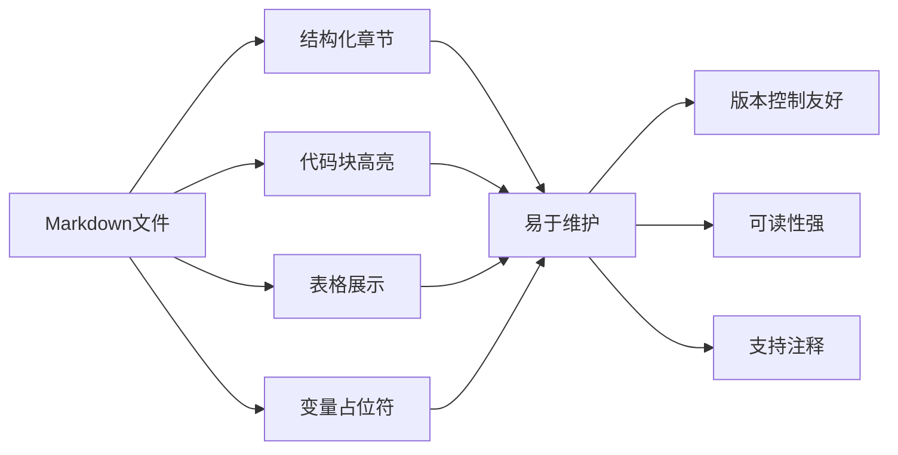
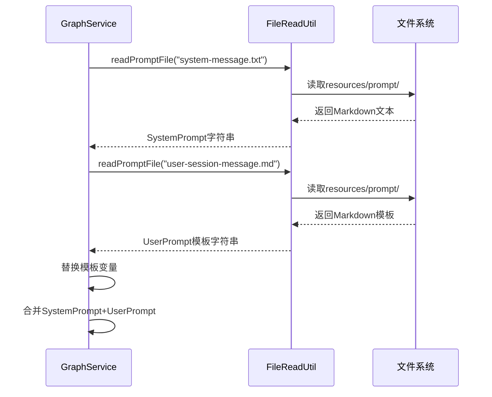
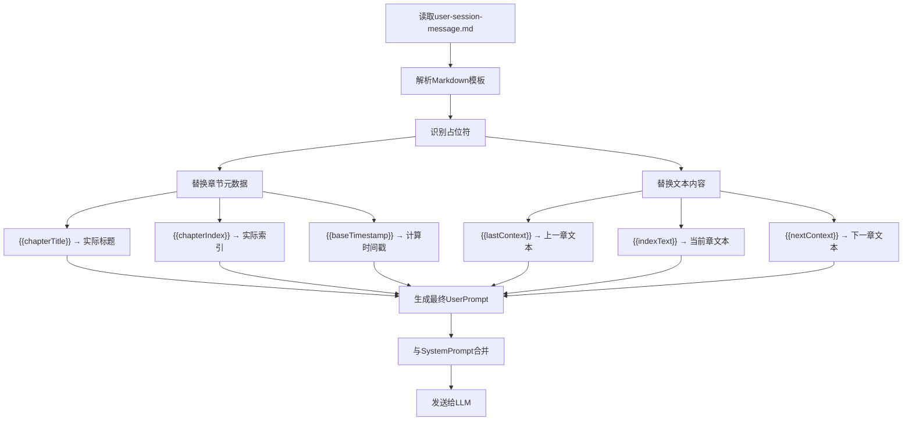
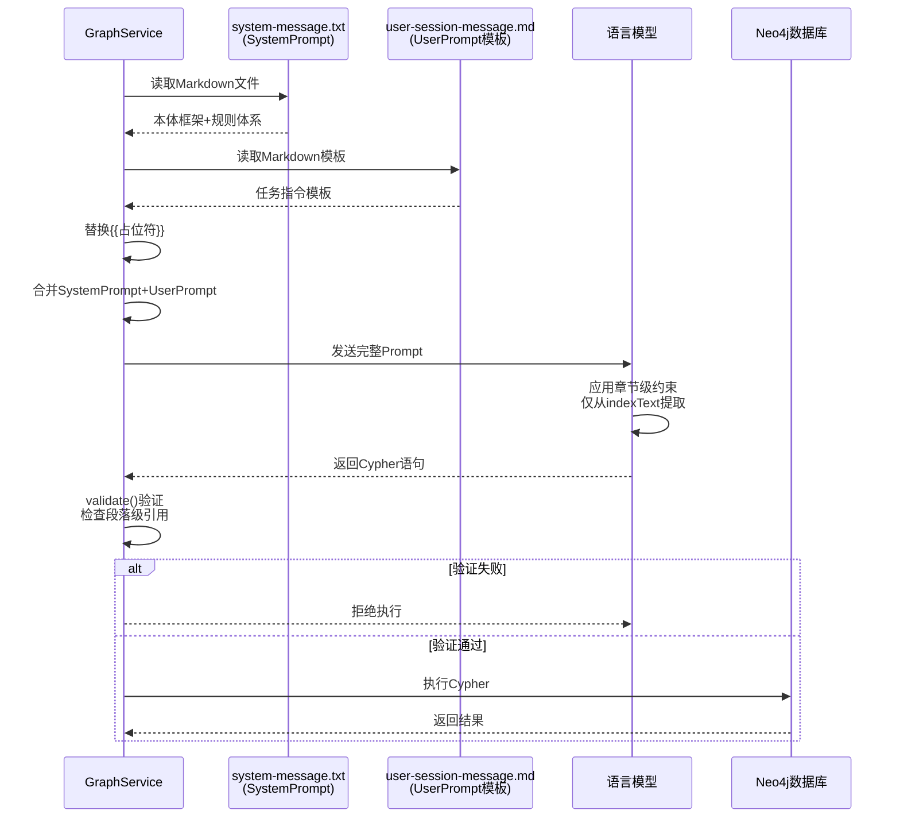

# 章节上下文升级改造设计

## 1. 概述

### 1.1 改造背景

当前知识图谱构建系统已实现章节级处理逻辑，但在文档、注释、验证规则和知识库中仍存在段落级上下文的遗留描述，导致概念层面与实现层面存在不一致性。

**核心问题：**
- 知识库文档（kgKnowlage.md）中使用"前文/上一段"、"当前行"等段落级术语
- GraphService.java 代码注释中存在"前一章节/完整内容"的模糊表述
- Prompt模板中混用章节级和段落级概念
- 验证规则中仍包含paragraphIndex的检查逻辑

### 1.2 改造目标

将所有上下文定义从段落级彻底改造为章节级，确保系统在概念、实现、文档三个层面的完全一致性：

| 上下文变量 | 标准定义 | 数据来源 |
|-----------|---------|---------|
| **lastContext** | 上一章完整内容 | 前一章节所有段落聚合 |
| **indexText** | 当前章完整内容 | 当前章节所有段落聚合 |
| **nextContext** | 下一章完整内容 | 后一章节所有段落聚合 |

### 1.3 适用模块

| 模块 | 角色 | 改造内容 |
|-----|------|---------|
| **ai** | 核心业务逻辑 | GraphService.java 注释、Prompt模板、验证逻辑 |
| **dbModel** | 数据模型 | 确认Entity属性定义无段落级字段 |
| **common** | 公共枚举 | 确认MongoDBConstant等枚举值术语一致性 |
| **file** | 知识库文件 | kgKnowlage.md 文档全面改造 |

## 2. 架构设计

### 2.1 上下文处理流程

``mermaid
graph TB
    A[EPUB文件] --> B[章节解析器]
    B --> C{遍历章节列表}
    
    C --> D[聚合上一章所有段落]
    C --> E[聚合当前章所有段落]
    C --> F[聚合下一章所有段落]
    
    D --> G[lastContext<br/>完整章节文本]
    E --> H[indexText<br/>完整章节文本]
    F --> I[nextContext<br/>完整章节文本]
    
    G --> J[构造Prompt上下文]
    H --> J
    I --> J
    
    J --> K[注入章节元数据<br/>chapterTitle/chapterIndex]
    K --> L[调用LLM生成Cypher]
    L --> M[验证输出格式]
    
    M --> N{是否包含<br/>段落级引用?}
    N -->|是| O[拒绝执行]
    N -->|否| P[写入Neo4j]
    
    style G fill:#e1f5ff
    style H fill:#fff4e1
    style I fill:#e1ffe1
    style O fill:#ffe1e1
```

### 2.2 上下文作用域定义

``mermaid
graph LR
    A[上一章] -->|完整文本| B[lastContext]
    C[当前章] -->|完整文本| D[indexText]
    E[下一章] -->|完整文本| F[nextContext]
    
    B --> G[作用1: 确认实体名称一致性]
    B --> H[作用2: 推断前置状态]
    B -.->|禁止| I[❌ 提取新实体/事件]
    
    D --> J[作用: 唯一信息提取源]
    D --> K[生成Entity节点]
    D --> L[生成Event节点]
    D --> M[生成State节点]
    
    F --> N[作用1: 消除代词歧义]
    F --> O[作用2: 理解上下文语境]
    F -.->|禁止| P[❌ 生成任何Cypher]
    
    style D fill:#fff4e1
    style I fill:#ffe1e1
    style P fill:#ffe1e1
```

### 2.3 信息提取边界约束

**核心原则：唯一信息源**

| 上下文 | 允许操作 | 禁止操作 | 验证方式 |
|-------|---------|---------|---------|
| lastContext | 查询已存在实体、推断前置状态 | 创建新实体、生成新事件 | WHERE子句引用 |
| indexText | 提取所有新信息、生成Cypher | 无 | 所有CREATE语句源头 |
| nextContext | 理解语义、消歧 | 生成任何节点或关系 | 仅用于注释说明 |

## 3. 数据模型

### 3.1 Event节点属性变更

**变更对比表：**

| 属性名 | 数据类型 | 必填 | 变更前 | 变更后 | 变更原因 |
|-------|---------|------|-------|-------|---------|
| uuid | String | ✅ | 保持 | 保持 | 全局唯一标识 |
| timestamp | DateTime | ✅ | 精确到分钟 | **精确到日期** | 章节级时间粒度 |
| eventType | String | ✅ | 保持 | 保持 | 事件类型枚举 |
| source | String | ✅ | "第X章 标题 - PY" | **"第X章 标题"** | 移除段落标记 |
| description | String | ✅ | 保持 | 保持 | 事件业务描述 |
| chapterIndex | Integer | ✅ | 保持 | 保持 | 章节索引 |
| **paragraphIndex** | Integer | ~~必填~~ | **存在** | **删除** | 不再使用段落级定位 |
| confidence | Float | ✅ | 保持 | 保持 | 置信度评分 |

**实体类调整建议（dbModel模块）：**

``mermaid
classDiagram
    class MessageEmbeddingEntity {
        - String uuid
        - DateTime timestamp
        - String eventType
        - String source
        - String description
        - Integer chapterIndex
        - Float confidence
    }
    
    note for MessageEmbeddingEntity "移除 paragraphIndex 字段\n调整 source 格式验证\n调整 timestamp 精度为日期级"
```

### 3.2 章节元数据结构

**ChapterContext 上下文传递对象：**

| 字段名 | 类型 | 说明 | 数据来源 |
|-------|------|------|---------|
| chapterTitle | String | 章节标题 | EPUB元数据 |
| chapterIndex | Integer | 章节索引（从1开始） | 遍历序号 |
| baseTimestamp | String | 基准时间戳 | 计算得出 |
| lastChapterText | String | 上一章完整文本 | aggregateParagraphs() |
| currentChapterText | String | 当前章完整文本 | aggregateParagraphs() |
| nextChapterText | String | 下一章完整文本 | aggregateParagraphs() |

### 3.3 时间戳生成策略变更

**变更前（段落级）：**
```
基准日期: 2025-01-01
公式: baseDate + (chapterIndex × 1天) + (paragraphIndex × 1分钟)
示例: 第5章第30段 → 2025-01-06T00:30:00
```

**变更后（章节级）：**
```
基准日期: 2025-01-01
公式: baseDate + (chapterIndex × 1天)
格式: YYYY-MM-DDT00:00:00
示例: 第5章 → 2025-01-06T00:00:00
```

## 4. 业务逻辑层设计

### 4.1 GraphService 核心方法改造

#### 4.1.1 graphPromptTemplate() 方法

**改造内容：Prompt模板文档字符串**

**变更对比：**

| 元素 | 改造前 | 改造后 |
|-----|--------|--------|
| lastContext标注 | "前一章节/完整内容" | "上一章完整内容" |
| indexText标注 | "当前章节/完整内容" | "当前章完整内容" |
| nextContext标注 | "下一章节/完整内容" | "下一章完整内容" |
| 约束说明 | "Event.paragraphIndex 设为 null" | **删除此约束说明** |
| source格式 | "第X章 标题 - PY" | "第X章 标题" |

**Prompt模板结构（自然语言描述）：**

``mermaid
graph TD
    A[Prompt模板] --> B[章节信息区]
    A --> C[文本内容区]
    A --> D[关键约束区]
    
    B --> B1[章节标题]
    B --> B2[章节索引]
    B --> B3[基准时间戳]
    
    C --> C1[lastContext区块<br/>标注: 上一章完整内容<br/>作用: 不提取新信息]
    C --> C2[indexText区块<br/>标注: 当前章完整内容<br/>作用: 唯一信息提取源]
    C --> C3[nextContext区块<br/>标注: 下一章完整内容<br/>作用: 不生成Cypher]
    
    D --> D1[timestamp格式约束]
    D --> D2[source格式约束]
    D --> D3[chapterIndex赋值约束]
    D --> D4[禁止使用paragraphIndex]
```

#### 4.1.2 validate() 方法逻辑调整

**验证规则变更：**

| 验证项 | 变更前逻辑 | 变更后逻辑 | 验证目的 |
|-------|-----------|-----------|---------|
| paragraphIndex存在性 | 检查是否为null | **检查是否存在此属性（应不存在）** | 确保无段落级引用 |
| source格式 | 允许包含" - P数字" | **禁止包含" - P"模式** | 强制章节级格式 |
| timestamp精度 | 不检查 | **警告非日期级时间戳** | 建议使用T00:00:00 |

**验证流程：**

``mermaid
graph TD
    A[接收Cypher语句] --> B{是否为空字符串?}
    B -->|是| C[返回验证失败]
    
    B -->|否| D{是否包含<br/>paragraphIndex关键字?}
    D -->|是| E[抛出异常:<br/>禁止使用段落级属性]
    
    D -->|否| F{source格式检查}
    F -->|包含 - P| G[抛出异常:<br/>source不应包含段落标记]
    
    F -->|正确格式| H{timestamp精度检查}
    H -->|非T00:00:00| I[记录警告日志:<br/>建议使用日期级时间戳]
    
    H -->|T00:00:00| J[验证通过]
    I --> J
    
    E --> C
    G --> C
    
    style E fill:#ffe1e1
    style G fill:#ffe1e1
```

#### 4.1.3 readStory() 方法确认

**无需改造，仅确认注释准确性：**

该方法已正确实现章节级聚合逻辑（通过aggregateParagraphs()），仅需确认注释中：
- 使用"章节"而非"段落"描述上下文
- 明确说明lastContext/indexText/nextContext均为完整章节文本

### 4.2 与SystemPrompt的协作机制

``mermaid
sequenceDiagram
    participant GP as GraphService<br/>(UserPrompt)
    participant KG as kgKnowlage.md<br/>(SystemPrompt)
    participant LLM as 语言模型
    participant Neo as Neo4j数据库
    
    GP->>LLM: 发送UserPrompt<br/>(章节上下文+任务指令)
    KG->>LLM: 提供SystemPrompt<br/>(本体框架+规则体系)
    
    LLM->>LLM: 合并Prompt<br/>应用章节级约束
    
    Note over LLM: 检查约束冲突<br/>确保仅从indexText提取
    
    LLM->>GP: 返回Cypher语句
    
    GP->>GP: validate()验证<br/>检查段落级引用
    
    alt 验证失败
        GP-->>LLM: 拒绝执行
    else 验证通过
        GP->>Neo: 执行Cypher
        Neo-->>GP: 返回结果
    end
```

## 5. 文档层改造设计

### 5.1 kgKnowlage.md 改造方案

#### 5.1.1 第6.3节改造（Cypher语句生成提示词）

**场景C章节重点改造（L805-872）：**

**改造表：**

| 行号范围 | 当前术语 | 目标术语 | 改造类型 |
|---------|---------|---------|---------|
| L805-820 | "前文/上一段" | "上一章完整内容" | 术语替换 |
| L805-820 | "当前行" | "当前章完整内容" | 术语替换 |
| L805-820 | "后文/下一段" | "下一章完整内容" | 术语替换 |
| L837-850 | 时间戳包含paragraphIndex | 时间戳仅包含chapterIndex | 示例更新 |
| L837-850 | "第X章 - PY" | "第X章 章节名" | 格式规范 |
| L855-872 | "段落索引" | **删除此概念** | 内容删除 |

**示例改造对比：**

| 示例元素 | 改造前 | 改造后 |
|---------|--------|--------|
| 上下文标注 | lastContext（前文） | lastContext（上一章完整内容） |
| 时间戳 | 2025-01-06T00:30:00<br/>paragraphIndex: 30 | 2025-01-06T00:00:00<br/>（移除paragraphIndex） |
| Event.source | "第5章 突破 - P30" | "第5章 突破" |
| 处理流程说明 | "从前文段落推断" | "从上一章内容推断" |

#### 5.1.2 第6.4节改造（生成约束与验证规则）

**新增验证规则：**

| 规则编号 | 规则名称 | 规则描述 | 验证方式 |
|---------|---------|---------|---------|
| V1 | 禁止paragraphIndex | Event节点不应包含paragraphIndex属性 | 关键字检测 |
| V2 | source格式规范 | source必须为"第X章 章节名"格式 | 正则表达式 |
| V3 | timestamp精度 | timestamp必须为日期级（T00:00:00） | 时间格式解析 |
| V4 | 上下文术语一致性 | 描述中禁用"段落"、"前文/后文" | 文本扫描 |

#### 5.1.3 第6.5节改造（领域实体设计规范）

**模板更新：**

- **模板1（角色创建）：** 移除paragraphIndex赋值语句
- **模板2（境界突破）：** 简化source为"第X章 章节名"
- **模板3（角色会面）：** 移除段落标记

### 5.2 CHAPTER_LEVEL_IMPLEMENTATION.md 改造

**新增版本标记：**

```
版本: v3.1-pure-chapter-context
更新日期: 2025-01-XX
变更摘要:
- 移除所有段落级上下文引用
- 统一章节级术语体系
- 简化时间戳生成策略（移除分钟级偏移）
- 删除paragraphIndex相关验证
```

## 6. Prompt模板规范

### 6.1 Prompt文件组织结构

**文件位置与命名：**

| 文件路径 | 文件名 | 类型 | 作用 |
|---------|--------|------|------|
| `ai/src/main/resources/prompt/` | `system-message.txt` | SystemPrompt | 知识图谱本体框架和规则 |
| `ai/src/main/resources/prompt/` | `user-session-message.md` | UserPrompt模板 | 章节处理任务指令 |
| `bot/src/main/resources/` | `prompt.md` | 对话Prompt | 机器人交互指令 |

**Markdown语法管理优势：**



### 6.2 UserPrompt标准模板（user-session-message.md）

**文件结构设计：**

```markdown
# 知识图谱章节处理任务

## 当前任务
请基于SystemPrompt中定义的强制性约束规则，处理以下输入：

## 章节信息

| 元数据项 | 值 |
|---------|----|
| 章节标题 | {{chapterTitle}} |
| 章节索引 | {{chapterIndex}} |
| 基准时间戳 | {{baseTimestamp}} |

## 文本内容

### 1. lastContext（上一章完整内容）

**作用说明：** 确认实体一致性、推断前置状态，**不提取新信息**

```text
{{lastContext}}
```

---

### 2. indexText（当前章完整内容）

**作用说明：** **唯一的信息提取来源**，所有Cypher必须基于此生成

```text
{{indexText}}
```

---

### 3. nextContext（下一章完整内容）

**作用说明：** 消除歧义、理解语境，**不生成Cypher**

```text
{{nextContext}}
```

## 关键约束

- [ ] Event.timestamp 格式：`datetime('{{baseTimestamp}}')`
- [ ] Event.source 格式：`第{{chapterIndex}}章 {{chapterTitle}}`
- [ ] Event.chapterIndex 设为 `{{chapterIndex}}`
- [ ] Event节点不包含paragraphIndex属性
- [ ] 所有新信息必须且只能从indexText提取

## 输出要求

请严格遵循SystemPrompt的约束规则，生成符合规范的Cypher语句。
```

**变量占位符约定：**

| 占位符 | 数据类型 | 说明 | 替换来源 |
|-------|---------|------|----------|
| `{{chapterTitle}}` | String | 章节标题 | EPUB元数据 |
| `{{chapterIndex}}` | Integer | 章节索引 | 遍历序号 |
| `{{baseTimestamp}}` | String | ISO 8601时间戳 | calculateTimestamp() |
| `{{lastContext}}` | String | 上一章文本 | aggregateParagraphs() |
| `{{indexText}}` | String | 当前章文本 | aggregateParagraphs() |
| `{{nextContext}}` | String | 下一章文本 | aggregateParagraphs() |

### 6.3 SystemPrompt引用机制（system-message.txt）

**文件内容组织：**

```markdown
# 知识图谱构建系统 - 本体框架与规则体系

版本：v3.1-pure-chapter-context

## 1. 元原则

### 1.1 因果性原则
任何状态的改变都必须由一个事件引起...

### 1.2 时间单向性原则
时间是绝对的、线性的、不可逆的...

## 2. 本体论框架

### 2.1 Event节点定义
...

### 2.2 Entity节点定义
...

### 2.3 State节点定义
...

## 3. 章节级上下文约束

### 3.1 信息提取边界
- **lastContext**：上一章完整内容，仅用于实体一致性确认和前置状态推断
- **indexText**：当前章完整内容，唯一的新信息提取源
- **nextContext**：下一章完整内容，仅用于消除歧义

### 3.2 禁止操作
- ❌ 从lastContext提取新实体或事件
- ❌ 从nextContext生成任何Cypher语句
- ❌ 使用paragraphIndex属性
- ❌ 在source中包含段落标记（如" - P15"）

## 4. Cypher生成规范
...
```

**文件加载方式：**



### 6.4 Prompt模板变量替换逻辑

**替换流程设计：**



**Java实现示例：**

| 步骤 | 操作描述 | 对应方法 |
|-----|---------|----------|
| 1 | 读取Markdown模板文件 | `FileReadUtil.readFile("user-session-message.md")` |
| 2 | 替换章节元数据占位符 | `template.replace("{{chapterTitle}}", chapterTitle)` |
| 3 | 替换文本内容占位符 | `template.replace("{{indexText}}", currentChapterText)` |
| 4 | 读取SystemPrompt | `FileReadUtil.readFile("system-message.txt")` |
| 5 | 合并Prompt | `systemPrompt + "\n\n" + userPrompt` |

### 6.5 Markdown语法元素应用

**表格展示章节信息：**

```markdown
| 元数据项 | 值 |
|---------|----|
| 章节标题 | {{chapterTitle}} |
| 章节索引 | {{chapterIndex}} |
```

**任务清单标记约束：**

```markdown
- [ ] Event.timestamp 格式：`datetime('{{baseTimestamp}}')`
- [ ] Event.source 格式：`第{{chapterIndex}}章 {{chapterTitle}}`
```

**代码块包裹文本内容：**

```markdown
### indexText（当前章完整内容）

```text
{{indexText}}
```
```

**强调关键约束：**

```markdown
**作用说明：** **唯一的信息提取来源**，所有Cypher必须基于此生成
```

### 6.6 SystemPrompt与UserPrompt协作机制



### 6.1 术语一致性验证

**验证矩阵：**

| 检查项 | 禁用术语 | 标准术语 | 检查范围 |
|-------|---------|---------|---------|
| 上下文描述 | "前文"、"后文" | "上一章"、"下一章" | 所有md文档 |
| 文本单位 | "当前行"、"段落" | "当前章"、"章节" | Prompt模板 |
| 时间标记 | "分钟级"、"T00:30" | "日期级"、"T00:00" | 时间戳示例 |
| 位置标识 | " - P15"、"段落索引" | （删除） | source格式 |

### 6.2 代码层验证

**单元测试用例设计：**

| 测试用例 | 输入 | 预期输出 | 验证目标 |
|---------|------|---------|---------|
| TC1 | Cypher包含"paragraphIndex: 30" | 验证失败，抛出异常 | 段落级属性检测 |
| TC2 | source="第3章 会面 - P15" | 验证失败，抛出异常 | source格式校验 |
| TC3 | timestamp="2025-01-06T00:30:00" | 验证通过，记录警告 | 时间精度提示 |
| TC4 | 标准章节级Cypher | 验证通过 | 正常流程 |

### 6.3 集成测试场景

**E2E测试流程：**

``mermaid
graph LR
    A[准备测试EPUB<br/>包含3章内容] --> B[调用readStory方法]
    B --> C[验证lastContext<br/>为第1章完整文本]
    C --> D[验证indexText<br/>为第2章完整文本]
    D --> E[验证nextContext<br/>为第3章完整文本]
    E --> F[检查生成的Cypher]
    F --> G{是否符合<br/>章节级规范?}
    G -->|是| H[测试通过]
    G -->|否| I[测试失败<br/>记录违规项]
```

## 7. 术语标准化规范

### 7.1 文档描述标准模板

**推荐表述：**

| 场景 | 标准表述 | 禁用表述 |
|-----|---------|---------|
| 上下文说明 | "lastContext提供上一章的完整内容" | ~~"lastContext提供前文段落"~~ |
| 信息提取 | "indexText是当前章的完整内容，也是唯一信息提取源" | ~~"indexText是当前处理的行"~~ |
| 辅助理解 | "nextContext包含下一章的完整内容，用于消除歧义" | ~~"nextContext是后续段落"~~ |
| 时间戳 | "基于章节索引生成日期级时间戳" | ~~"计算段落偏移的分钟级时间戳"~~ |

### 7.2 代码注释标准模板

**Java注释风格：**

```
推荐:
// 获取上一章完整文本
String lastChapterText = aggregateParagraphs(previousChapter);

// 构造当前章的完整内容作为唯一信息提取源
String indexText = aggregateParagraphs(currentChapter);

禁用:
// 获取前文上下文
String lastContext = getPreviousParagraphs(...);

// 获取当前行内容
String currentLine = getCurrentParagraph(...);
```

### 7.3 Prompt模板标准用语

**变量命名约定：**

**Markdown文件变量命名：**

| 变量类型 | 推荐命名（Markdown占位符） | 禁用命名 |
|---------|--------------------------|----------|
| 章节标题 | `{{chapterTitle}}` | ~~{{paragraphTitle}}~~, ~~{{sectionName}}~~ |
| 章节索引 | `{{chapterIndex}}` | ~~{{paragraphNumber}}~~, ~~{{lineNumber}}~~ |
| 上下文文本 | `{{lastContext}}` | ~~{{previousParagraph}}~~, ~~{{beforeText}}~~ |
| 当前文本 | `{{indexText}}` | ~~{{currentLine}}~~, ~~{{indexLine}}~~ |
| 后续文本 | `{{nextContext}}` | ~~{{afterParagraph}}~~, ~~{{followingText}}~~ |
| 时间戳 | `{{baseTimestamp}}` | ~~{{currentTime}}~~, ~~{{timestamp}}~~ |

**Java代码变量命名：**

| 变量类型 | 推荐命名 | 禁用命名 |
|---------|---------|---------|
| 章节标题 | chapterTitle | ~~paragraphTitle~~, ~~sectionName~~ |
| 章节索引 | chapterIndex | ~~paragraphNumber~~, ~~lineNumber~~ |
| 上下文文本 | lastChapterText | ~~previousParagraph~~, ~~beforeText~~ |
| 当前文本 | currentChapterText | ~~currentLine~~, ~~indexLine~~ |
| 后续文本 | nextChapterText | ~~afterParagraph~~, ~~followingText~~ |

**Markdown语法元素对照：**

| 元素类型 | Markdown语法 | 应用场景 | 示例 |
|---------|------------|--------|------|
| 表格 | `\| \| \|` | 章节元数据展示 | `\| 章节标题 \| {{chapterTitle}} \|` |
| 代码块 | ````text` | 文本内容包裹 | ````text\n{{indexText}}\n```` |
| 任务清单 | `- [ ]` | 约束条件标记 | `- [ ] Event.timestamp 格式约束` |
| 标题 | `##` | 章节结构分级 | `## 章节信息` |
| 分隔线 | `---` | 上下文内容分隔 | `---` |
| 加粗 | `**text**` | 关键信息强调 | `**唯一的信息提取来源**` |

## 8. 实施路线图

### 8.1 改造阶段划分

``mermaid
gantt
    title 章节上下文改造实施计划
    dateFormat YYYY-MM-DD
    section 文档改造阶段
    知识库文档术语替换          :doc1, 2025-01-15, 2d
    Prompt模板更新            :doc2, after doc1, 1d
    验证规则文档化            :doc3, after doc2, 1d
    
    section 代码改造阶段
    GraphService注释更新       :code1, after doc3, 1d
    validate方法逻辑调整       :code2, after code1, 1d
    dbModel实体类确认          :code3, after code1, 1d
    
    section 测试验证阶段
    单元测试编写              :test1, after code2, 2d
    集成测试执行              :test2, after test1, 1d
    文档一致性审查            :test3, after test2, 1d
    
    section 发布阶段
    版本标记更新              :release1, after test3, 1d
    正式发布                 :milestone, after release1, 0d
```

### 8.2 阶段交付物

| 阶段 | 交付物 | 验收标准 |
|-----|--------|---------|
| **文档改造** | kgKnowlage.md v3.1<br/>CHAPTER_LEVEL_IMPLEMENTATION.md | 所有段落级术语已清理<br/>示例时间戳为T00:00:00格式 |
| **代码改造** | GraphService.java<br/>MessageEmbeddingEntity.java | 注释无段落级表述<br/>validate方法包含新规则 |
| **测试验证** | 单元测试用例<br/>集成测试报告 | 所有TC通过<br/>E2E测试覆盖3章场景 |
| **发布** | 版本发布说明 | 版本号v3.1标记<br/>变更日志完整 |

### 8.3 风险控制

**潜在风险与缓解措施：**

| 风险项 | 影响程度 | 缓解措施 |
|-------|---------|---------|
| 遗漏段落级术语 | 中 | 使用全文搜索工具检测关键词 |
| 已有数据兼容性 | 低 | 仅影响新生成数据，旧数据保留 |
| 时间戳格式变更影响查询 | 低 | timestamp仍为DateTime类型，查询兼容 |
| 文档与代码不同步 | 高 | 实施检查清单强制验证 |

## 9. 实施检查清单

### 9.1 文档层检查项

**kgKnowlage.md:**
- [ ] 第6.3节"场景C"：所有"前文/后文"替换为"上一章/下一章"
- [ ] 第6.3节示例：时间戳改为T00:00:00格式
- [ ] 第6.3节示例：source移除" - P数字"后缀
- [ ] 第6.4节验证规则：新增段落级属性检测规则
- [ ] 第6.5节模板：所有模板移除paragraphIndex赋值
- [ ] 全文搜索："段落"、"前文"、"后文"关键词清理

**CHAPTER_LEVEL_IMPLEMENTATION.md:**
- [ ] 新增v3.1版本标记
- [ ] 更新时间戳生成公式说明
- [ ] 清理所有段落级示例

**Prompt模板文件:**
- [ ] user-session-message.md：使用Markdown语法组织结构
- [ ] user-session-message.md：使用`{{占位符}}`标记变量
- [ ] user-session-message.md：使用表格展示章节元数据
- [ ] user-session-message.md：使用代码块包裹文本内容
- [ ] user-session-message.md：使用任务清单标记约束项
- [ ] system-message.txt：使用Markdown标题组织本体框架
- [ ] system-message.txt：明确章节级上下文约束章节

### 9.2 代码层检查项

**GraphService.java:**
- [ ] 新增readPromptFile()方法：读取Markdown模板文件
- [ ] 新增replacePromptVariables()方法：替换`{{占位符}}`
- [ ] graphPromptTemplate()方法：改为从user-session-message.md读取
- [ ] graphPromptTemplate()方法：实现变量替换逻辑
- [ ] loadSystemPrompt()方法：从system-message.txt读取
- [ ] validate()方法：新增paragraphIndex关键字检测
- [ ] validate()方法：新增source格式校验（禁止" - P"）
- [ ] validate()方法：新增timestamp精度警告
- [ ] readStory()方法：确认注释使用"章节"而非"段落"

**dbModel模块:**
- [ ] MessageEmbeddingEntity.java：确认无paragraphIndex字段
- [ ] MessageEmbeddingEntity.java：确认source字段注释准确

**common模块:**
- [ ] MongoDBConstant枚举：确认常量命名无段落级概念

### 9.3 测试验证检查项

**单元测试:**
- [ ] TC1：paragraphIndex检测用例
- [ ] TC2：source格式校验用例
- [ ] TC3：timestamp精度警告用例
- [ ] TC4：标准Cypher验证通过用例

**集成测试:**
- [ ] 三章EPUB文件准备
- [ ] lastContext内容正确性验证
- [ ] indexText内容正确性验证
- [ ] nextContext内容正确性验证
- [ ] 生成Cypher格式符合性验证

**文档审查:**
- [ ] 所有md文件术语一致性检查
- [ ] 所有Java文件注释术语一致性检查
- [ ] Prompt模板变量命名规范性检查

## 10. 向后兼容性说明

### 10.1 数据层兼容性

**已存储数据：**
- Neo4j中已有Event节点保持不变
- 旧数据可能包含paragraphIndex属性，但不影响查询
- timestamp精度差异（分钟级 vs 日期级）不影响DateTime类型查询

**新数据写入：**
- 新生成的Event节点不包含paragraphIndex
- 新timestamp统一为日期级（T00:00:00）
- source格式统一为"第X章 章节名"

### 10.2 代码层兼容性

**不影响现有方法签名：**
- aggregateParagraphs()方法保留（用于聚合章节内段落）
- calculateTimestamp()方法无需修改（已是章节级）
- readStory()方法签名不变

**仅影响内部逻辑：**
- Prompt模板字符串内容变更
- validate()方法增加新规则
- 注释和文档描述更新

### 10.3 升级路径

**平滑升级方案：**

``mermaid
graph LR
    A[v3.0版本<br/>混用段落级术语] --> B[部署v3.1代码]
    B --> C[新数据使用章节级]
    C --> D[旧数据保持不变]
    D --> E[系统正常运行<br/>两种格式共存]
    
    E -.-> F[可选: 数据迁移<br/>统一旧数据格式]
    
    style F stroke-dasharray: 5 5
```

**无需强制迁移：**
- 旧Event节点可保留paragraphIndex属性（不影响功能）
- 查询时通过chapterIndex定位章节即可
- 如需统一，可后台批量更新source格式

    - 属性: `timestamp`: DateTime

5. **CURRENT_STATE:** Entity -[:CURRENT_STATE]-> State
    - 描述：表示这是该实体的当前活跃状态。一个实体在任一时刻只能有一个:CURRENT_STATE关系。

6. **HAS_HISTORICAL_STATE:** Entity -[:HAS_HISTORICAL_STATE]-> State
    - 描述：表示这是该实体的一个已失效的历史状态。

7. **REQUIRES_STATE:** Event -[:REQUIRES_STATE]-> State
    - 描述：表示事件的前置状态依赖。
    - 属性: `required_condition`: String - 具体的状态约束条件描述

8. **CREATES_STATE:** Event -[:CREATES_STATE]-> State
    - 描述：表示事件创建了新状态。
    - 属性: `timestamp`: DateTime

9. **NEXT_STATE:** State -[:NEXT_STATE]-> State
    - 描述：连接状态版本链，指向该状态的下一个版本。
    - 属性: `transition_event_uuid`: String - 触发转换的事件UUID

#### **6.3 Cypher语句生成提示词**

**提示词用途说明:**

本提示词用于指导AI系统根据知识图谱文档的内容,自动生成符合规范的Cypher语句。具体用途包括:

1. **章节内容理解与转换:** AI需要阅读前两章(元原则、本体论框架)和当前章节的内容描述,理解其中蕴含的事件、实体和状态关系,然后将这些概念性描述转换为可执行的Cypher语句。

2. **自动化建模:** 当用户提供新的章节内容或业务场景描述时,AI应:
    - 识别描述中的核心实体(如"论文"、"用户"、"订单"等)
    - 提取事件及其类型(生成、转换、终止、观测)
    - 分析状态变化和前置条件依赖
    - 自动生成完整的节点创建和关系建立语句

3. **保证一致性:** 确保所有生成的Cypher语句都严格遵循:
    - 第一章定义的因果性原则和时间单向性原则
    - 第二章定义的本体论框架(Event、Entity、State的结构)
    - 第三章定义的因果与约束规则
    - 第四章定义的时间规则
    - 第五章定义的系统边界与完整性规则

**系统角色定义:**
```
你是一个专业的知识图谱Cypher语句生成助手。你的任务是:

1. 理解输入内容:仔细阅读用户提供的章节内容或场景描述,识别其中的实体、事件和状态信息。

2. 映射到本体框架:将描述内容映射到本文档第一章和第二章定义的本体论框架:
   - 识别哪些是实体(Entity)及其类型
   - 识别哪些是事件(Event)及其交互类型(Generation/Transformation/Termination/Observation)
   - 识别状态(State)的变化和有效期

3. 生成规范Cypher:严格按照第六章定义的节点标签、关系类型和生成模板,输出完整的Cypher语句。

4. 验证与注释:为生成的每条语句添加清晰的注释,说明其对应的业务语义,并确保符合所有验证规则。
```

**核心要求:**

1. **严格遵守因果性原则:**
    - 每个状态变化必须由一个Event节点触发
    - 必须明确标记事件与实体的交互类型(GENERATES/TRANSFORMS/TERMINATES/OBSERVES)

2. **严格遵守时间单向性原则:**
    - 所有timestamp必须使用DateTime类型
    - Event的timestamp一旦设置不可修改
    - State的valid_from_timestamp和valid_to_timestamp必须形成合法的时间区间
    - **小说场景时间戳生成策略:**
        * 基准日期: 2025-01-01
        * 章节时间偏移: baseDate + (chapterIndex × 1天)
        * 段落时间偏移: 章节基准时间 + (paragraphIndex × 1分钟)
        * 示例: 第5章第30段 → 2025-01-06T00:30:00

3. **维护状态版本链:**
    - 当创建新状态时,必须:
      a. 将旧状态的valid_to_timestamp设置为当前事件的timestamp
      b. 创建新状态节点,其valid_from_timestamp为当前事件的timestamp
      c. 创建NEXT_STATE关系连接旧状态到新状态

4. **处理前置条件:**
    - 如果事件有状态依赖,必须创建REQUIRES_STATE关系
    - 需验证前置状态在事件时间点是否有效(valid_from <= event.timestamp < valid_to)

5. **信息提取边界约束(小说场景专用):**
    - **唯一信息来源:** 所有Entity、Event、State必须且只能从indexText(当前行)提取
    - **禁止从前文提取:** lastContext(前文)仅用于确认实体名称一致性、推断前置状态
    - **禁止从后文生成:** nextContext(后文)仅用于消除代词歧义、理解上下文语境
    - **空输出规则:** 如果indexText无可提取的新信息,必须返回空字符串

**生成模板示例:**

**场景1: 创建新实体及初始状态**
```cypher
// 1. 创建生成事件
CREATE (e:Event {
  uuid: randomUUID(),
  timestamp: datetime('2025-10-14T10:00:00'),
  eventType: 'Generation',
  source: '第1章 落魄天才 - P1',
  confidence: 1.0,
  description: '创建论文实体',
  chapterIndex: 1,
  paragraphIndex: 1
})

// 2. 创建实体
CREATE (entity:Entity {
  uuid: randomUUID(),
  entityType: 'Paper',
  createdAt: datetime('2025-10-14T10:00:00'),
  name: '知识图谱研究',
  firstMentionChapter: 1,
  firstMentionSource: '第1章 落魄天才 - P1'
})

// 3. 创建初始状态
CREATE (s:State {
  uuid: randomUUID(),
  valid_from_timestamp: datetime('2025-10-14T10:00:00'),
  valid_to_timestamp: null,
  stateType: 'status',
  stateValue: 'draft',
  version: 1
})

// 4. 建立关系
CREATE (e)-[:GENERATES {timestamp: datetime('2025-10-14T10:00:00')}]->(entity)
CREATE (e)-[:CREATES_STATE {timestamp: datetime('2025-10-14T10:00:00')}]->(s)
// 使用 CURRENT_STATE 关系来表示这是实体的当前活跃状态
CREATE (entity)-[:CURRENT_STATE]->(s)
```

// 场景2: 原子化的状态转换 (含前置条件检查)
// 外部传入参数: $entity_uuid, $event_timestamp, $source, $confidence, $new_status_properties (一个包含新状态所有业务属性的Map)

// 1. 查找满足前置条件的实体和它的当前状态
```cypher
MATCH (entity:Entity {uuid: $entity_uuid})-[rel:CURRENT_STATE]->(currentState:State)
WHERE currentState.status = 'draft' // 严格的前置条件检查

WITH entity, rel, currentState,
     // 2. 在WITH子句中准备好所有新节点和属性，确保事务性
     {
       uuid: randomUUID(),
       timestamp: datetime($event_timestamp),
       eventType: 'Transformation',
       source: $source,
       confidence: $confidence,
       description: '论文提交审核'
     } AS eventProps,
     {
       uuid: randomUUID(),
       valid_from_timestamp: datetime($event_timestamp),
       valid_to_timestamp: null
     } + $new_status_properties AS newStateProps // 将外部传入的业务属性合并进来

// 3. 创建新节点
CREATE (e:Event) SET e = eventProps
CREATE (newState:State) SET newState = newStateProps

// 4. 创建新关系
CREATE (e)-[:TRANSFORMS]->(entity)
CREATE (e)-[:REQUIRES_STATE {required_condition: 'status=draft'}]->(currentState)
CREATE (e)-[:CREATES_STATE]->(newState)
CREATE (currentState)-[:NEXT_STATE {transition_event_uuid: e.uuid}]->(newState)
CREATE (entity)-[:CURRENT_STATE]->(newState) // 创建指向新状态的CURRENT_STATE关系
CREATE (entity)-[:HAS_HISTORICAL_STATE]->(currentState) // 将旧状态标记为历史

// 5. 解除旧关系并更新旧状态
DELETE rel // 删除旧的CURRENT_STATE关系
SET currentState.valid_to_timestamp = datetime($event_timestamp)

RETURN e.uuid AS eventId, newState.uuid AS newStateId
```
**场景3: 查询实体历史状态**
```cypher
// 查询实体在特定时间点的状态
MATCH (entity:Entity {uuid: $entity_uuid})-[:HAS_STATE]->(s:State)
WHERE s.valid_from_timestamp <= datetime($query_time)
  AND (s.valid_to_timestamp IS NULL OR s.valid_to_timestamp > datetime($query_time))
RETURN s

// 查询实体的完整状态演化链
MATCH (entity:Entity {uuid: $entity_uuid})-[:HAS_STATE]->(s:State)
OPTIONAL MATCH path = (s)-[:NEXT_STATE*]->()
RETURN path
ORDER BY s.valid_from_timestamp
```

**场景4: 查询因果链**
```cypher
// 追溯某个状态的因果来源
MATCH (s:State {uuid: $state_uuid})<-[:CREATES_STATE]-(e:Event)
OPTIONAL MATCH (e)-[:REQUIRES_STATE]->(prereqState:State)
OPTIONAL MATCH (prereqState)<-[:CREATES_STATE]-(prereqEvent:Event)
RETURN e, prereqState, prereqEvent

// 查找事件的所有直接影响
MATCH (e:Event {uuid: $event_uuid})
OPTIONAL MATCH (e)-[r:GENERATES|TRANSFORMS|TERMINATES|OBSERVES]->(affected:Entity)
OPTIONAL MATCH (e)-[:CREATES_STATE]->(newState:State)
RETURN e, r, affected, newState
```

#### **6.4 生成约束与验证规则**

在生成Cypher语句前,必须验证:

**通用验证规则:**
1. **UUID唯一性:** 所有新创建的节点必须生成唯一UUID
2. **时间一致性:** Event.timestamp <= State.valid_from_timestamp
3. **状态链完整性:** 同一实体的状态不能有时间重叠
4. **前置条件满足:** 执行TRANSFORM/TERMINATE前必须验证前置状态存在且有效
5. **关系完整性:** 每个State必须关联到至少一个Entity和一个创建它的Event

**小说场景专用验证规则:**
6. **Event属性完整性:** Event节点必须包含chapterIndex、paragraphIndex、description、source属性
7. **Entity属性完整性:** Entity节点必须包含name、firstMentionChapter、firstMentionSource属性
8. **State属性规范:** State节点必须包含stateType和stateValue属性（中文值）
9. **时间戳格式验证:** timestamp必须使用datetime('{{baseTimestamp}}')格式，不可自定义
10. **信息来源验证:** 所有新节点必须来自indexText，不能来自lastContext或nextContext
11. **空输出验证:** 如果indexText无新信息，必须返回空字符串而非文字说明
12. **属性命名规范:** 所有属性键名和值（业务相关）必须使用中文

#### 6.5 领域实体设计规范 (Domain Entity Design Specification)

本节定义了在通用本体论框架基础上的**领域特定实体类型**。这些领域实体必须作为`:Entity`节点的**子类型**存在，通过多标签机制实现继承。

**核心原则:**
1. **双标签继承:** 所有领域实体必须同时拥有`:Entity`标签和其领域标签（如`:Character`）
2. **本体论兼容:** 领域实体的生命周期管理必须遵循第二章到第四章定义的Event-State机制
3. **属性分层:** 恒定属性存储在Entity节点，易变属性存储在State节点

##### 6.5.1 小说领域实体定义

**1. Character (角色实体)**
```cypher
// 节点标签: [:Entity:Character]
// 恒定属性:
- uuid: String - 全局唯一标识符
- name: String - 角色核心名称（首次出现的名字）
- 别名: List<String> - 所有别名、称号、化名（可选）
- entityType: String - 固定值 "Character"
- createdAt: DateTime - 实体创建时间
- firstMentionChapter: Integer - 首次出现章节
- firstMentionSource: String - 首次出现位置

// 易变属性(通过State节点管理):
- stateType: "境界状态" | "技能状态" | "关系状态" | "地理状态" | "持有状态"
- stateValue: String - 状态具体值
- 境界: String - 当前修炼境界（如"斗者"、"斗师"）
- 称号: String - 当前主要称号
- 状态描述: String - 身体状态、情绪状态等
```

**2. Location (地点实体)**
```cypher
// 节点标签: [:Entity:Location]
// 恒定属性:
- uuid: String
- name: String - 地点名称
- entityType: String - 固定值 "Location"
- createdAt: DateTime
- firstMentionChapter: Integer - 首次出现章节
- firstMentionSource: String - 首次出现位置

// 易变属性(通过State节点管理):
- stateType: "地理状态"
- stateValue: String - 地点描述
- 控制者: String - 当前控制该地点的势力或角色
- 地理特征: String - 描述性信息

// 特殊关系:
- (loc:Location)-[:CONTAINS]->(subloc:Location) // 空间包含关系
```

**3. Organization (组织实体)**
```cypher
// 节点标签: [:Entity:Organization]
// 恒定属性:
- uuid: String
- name: String - 组织名称
- type: String - 组织类型（"家族"、"宗门"、"帝国"等）
- entityType: String - 固定值 "Organization"
- createdAt: DateTime
- firstMentionChapter: Integer - 首次出现章节
- firstMentionSource: String - 首次出现位置

// 易变属性(通过State节点管理):
- stateType: "组织状态"
- stateValue: String - 状态描述
- 势力等级: String
- 领导者: String
```

**4. Item (物品实体)**
```cypher
// 节点标签: [:Entity:Item]
// 恒定属性:
- uuid: String
- name: String - 物品名称
- 类型: String - "武器"、"丹药"、"功法"等
- entityType: String - 固定值 "Item"
- createdAt: DateTime
- firstMentionChapter: Integer - 首次出现章节
- firstMentionSource: String - 首次出现位置

// 易变属性(通过State节点管理):
- stateType: "持有状态"
- stateValue: String - 状态描述
- 拥有者: String - 当前持有者
- 品质: String
```

**5. Skill (技能实体)**
```cypher
// 节点标签: [:Entity:Skill]
// 恒定属性:
- uuid: String
- name: String - 技能名称
- 类型: String - "功法"、"斗技"等
- 品阶: String - 天阶、地阶等（通常恒定）
- entityType: String - 固定值 "Skill"
- createdAt: DateTime
- firstMentionChapter: Integer - 首次出现章节
- firstMentionSource: String - 首次出现位置

// 易变属性(通过State节点管理):
- stateType: "技能状态"
- stateValue: String - 熔练度等
```

**6. StoryEvent (情节事件)**
```cypher
// 节点标签: [:Event:StoryEvent]
// 注意: StoryEvent是Event的特化，继承所有Event属性
// 额外属性:
- uuid: String - 全局唯一标识符
- timestamp: DateTime - 事件发生时间
- eventType: String - 可为 "Generation" | "Transformation" | "Observation" | "Termination"
- source: String - 数据来源(格式: "第X章 章节名 - PY")
- confidence: Float - 置信度
- description: String - 事件描述
- chapterIndex: Integer - 章节索引
- paragraphIndex: Integer - 段落索引
- 章节: String - 所属章节(可选)
- 情节重要度: Integer - 1-10评分(可选)
```

##### 6.5.2 领域关系类型扩展

在通用关系类型（GENERATES/TRANSFORMS等）基础上，补充以下**领域语义关系**：

**社交关系（在Character之间）:**
```cypher
- [:FRIEND_OF] - 朋友关系
- [:ENEMY_OF] - 敌对关系
- [:MASTER_OF] - 师父关系
- [:APPRENTICE_OF] - 徒弟关系
- [:FAMILY_OF] - 家族成员
```

**从属关系:**
```cypher
- [:BELONGS_TO] - 实体从属于组织/地点
  - (Character)-[:BELONGS_TO]->(Organization)
  - (Organization)-[:LOCATED_IN]->(Location)
- [:LEADER_OF] - 领导关系
  - (Character)-[:LEADER_OF]->(Organization)
```

**行为关系（通过Event中介）:**
```cypher
// 不推荐直接创建 (Character)-[:ATTACKS]->(Character)
// 应通过Event节点中介:
(e:Event:StoryEvent {eventType: "Combat"})
(c1:Character)-[:PARTICIPATED_IN {role: "attacker"}]->(e)
(c2:Character)-[:PARTICIPATED_IN {role: "defender"}]->(e)
```

**持有关系（通过State管理）:**
```cypher
// 物品的拥有关系应通过State节点记录
// 错误方式: (c:Character)-[:POSSESSES]->(i:Item)
// 正确方式:
(i:Item)-[:CURRENT_STATE]->(s:State {拥有者: "萧炎", valid_from: ...})
```

##### 6.5.3 领域实体创建模板

**模板1: 创建角色及初始状态**
```cypher
// 1. 创建生成事件
CREATE (e:Event:StoryEvent {
  uuid: randomUUID(),
  timestamp: datetime('2025-10-15T10:00:00'),
  eventType: 'Generation',
  source: '第一章 落魄天才 - P1',
  confidence: 1.0,
  description: '角色首次登场',
  chapterIndex: 1,
  paragraphIndex: 1,
  章节: '第一章'
})

// 2. 创建角色实体（双标签）
CREATE (c:Entity:Character {
  uuid: randomUUID(),
  entityType: 'Character',
  name: '萧炎',
  别名: ['岩枭'],
  createdAt: datetime('2025-10-15T10:00:00'),
  firstMentionChapter: 1,
  firstMentionSource: '第一章 落魄天才 - P1'
})

// 3. 创建初始状态
CREATE (s:State {
  uuid: randomUUID(),
  valid_from_timestamp: datetime('2025-10-15T10:00:00'),
  valid_to_timestamp: null,
  stateType: '境界状态',
  stateValue: '斗之气三段',
  境界: '斗之气三段',
  称号: '废物',
  状态描述: '健康'
})

// 4. 建立关系
CREATE (e)-[:GENERATES]->(c)
CREATE (e)-[:CREATES_STATE]->(s)
CREATE (c)-[:CURRENT_STATE]->(s)
```

**模板2: 角色境界突破（状态转换）**
``cypher
// 使用6.3章节场景2的原子化模板，传入参数：
// $entity_uuid: 萧炎的uuid
// $event_timestamp: 突破时间
// $new_status_properties: {境界: "斗者", 称号: "天才", 状态描述: "精力充沛"}

MATCH (entity:Entity:Character {uuid: $entity_uuid})-[rel:CURRENT_STATE]->(currentState:State)
WHERE currentState.境界 = '斗之气三段' // 前置条件

WITH entity, rel, currentState,
{
uuid: randomUUID(),
timestamp: datetime($event_timestamp),
eventType: 'Transformation',
source: '第五章 突破 - P30',
confidence: 1.0,
description: '境界突破',
chapterIndex: 5,
paragraphIndex: 30,
章节: '第五章'
} AS eventProps,
{
uuid: randomUUID(),
valid_from_timestamp: datetime($event_timestamp),
valid_to_timestamp: null,
stateType: '境界状态',
stateValue: '斗者',
境界: '斗者',
称号: '天才',
状态描述: '精力充沛'
} AS newStateProps

CREATE (e:Event:StoryEvent) SET e = eventProps
CREATE (newState:State) SET newState = newStateProps
CREATE (e)-[:TRANSFORMS]->(entity)
CREATE (e)-[:REQUIRES_STATE {required_condition: '境界=斗之气三段'}]->(currentState)
CREATE (e)-[:CREATES_STATE]->(newState)
CREATE (currentState)-[:NEXT_STATE {transition_event_uuid: e.uuid}]->(newState)
CREATE (entity)-[:CURRENT_STATE]->(newState)
CREATE (entity)-[:HAS_HISTORICAL_STATE]->(currentState)
DELETE rel
SET currentState.valid_to_timestamp = datetime($event_timestamp)

RETURN e.uuid AS eventId, newState.uuid AS newStateId
```

**模板3: 角色会面（事件中介关系）**
``cypher
// 1. 使用MERGE确保实体存在（幂等性）
MERGE (c1:Entity:Character {name: "萧炎"})
MERGE (c2:Entity:Character {name: "纳兰嫣然"})

// 2. 创建会面事件
CREATE (e:Event:StoryEvent {
  uuid: randomUUID(),
  timestamp: datetime('2025-10-15T14:00:00'),
  eventType: 'Observation',
  source: '第三章 会面 - P15',
  confidence: 1.0,
  description: '萧炎与纳兰嫣然会面',
  chapterIndex: 3,
  paragraphIndex: 15,
  章节: '第三章'
})

// 3. 建立参与关系
CREATE (c1)-[:PARTICIPATED_IN {role: "主角"}]->(e)
CREATE (c2)-[:PARTICIPATED_IN {role: "访客"}]->(e)

// 4. 观测双方当前状态（不改变）
MATCH (c1)-[:CURRENT_STATE]->(s1:State)
MATCH (c2)-[:CURRENT_STATE]->(s2:State)
CREATE (e)-[:OBSERVES]->(c1)
CREATE (e)-[:OBSERVES]->(c2)
```

##### 6.5.4 领域特定验证规则

在6.4节通用验证规则基础上，补充以下领域规则：

**实体层验证:**
1. **角色命名唯一性:** 同一个`name`的`:Character`实体在图中必须唯一（通过MERGE保证）
2. **地点包含非循环性:** `:CONTAINS`关系不能形成环路
3. **组织从属唯一性:** 一个角色在同一时间只能`:BELONGS_TO`一个组织（通过State管理）

**状态层验证:**
4. **境界演化单向性:** 角色的`境界`属性变化必须符合预定义的境界体系顺序（可选）
5. **stateType枚举约束:** State.stateType必须为以下枚举值之一：
    - "境界状态" - 用于角色修炼等级
    - "技能状态" - 用于技能掌握情况
    - "关系状态" - 用于角色间关系
    - "地理状态" - 用于位置信息
    - "持有状态" - 用于物品拥有
    - "组织状态" - 用于组织信息
6. **状态值必须中文:** State.stateValue必须为中文字符串，不允许纯英文或数字

**事件层验证:**
7. **事件参与者完整性:** 所有`:StoryEvent`必须至少有一个`:PARTICIPATED_IN`关系或直接的GENERATES/TRANSFORMS/OBSERVES/TERMINATES关系
8. **source格式验证:** Event.source必须符合格式"第X章 章节名 - PY"（X和Y为数字）
9. **chapterIndex与paragraphIndex范围:** 必须为正整数，且chapterIndex >= 1, paragraphIndex >= 1
10. **timestamp与chapterIndex一致性:** Event.timestamp的日期部分必须等于 (baseDate + chapterIndex天)

**关系层验证:**
11. **禁止直接持有关系:** 不允许直接创建 (Character)-[:POSSESSES]->(Item)，必须通过Item的State节点记录拥有者
12. **行为关系中介化:** 不允许直接创建 (Character)-[:ATTACKS]->(Character)，必须通过Event节点中介

**输出格式验证:**
13. **禁止非空非代码输出:** 输出必须为空字符串或符合规范的Cypher语句，不允许返回任何解释性文字
14. **禁止代码块:** 不允许使用``cypher```包裹Cypher语句，必须直接输出Cypher文本

##### 6.5.5 统一代码版本声明与Prompt协作机制

**版本号:** v3.0-novel-enhanced  
**最后更新:** 2025-10-16  
**更新内容:** 增强小说场景专用属性、三元组上下文处理、信息提取边界约束、时间戳生成策略

**Prompt协作架构说明:**

本知识图谱构建系统采用**双Prompt协作架构**，System Prompt和User Prompt各司其职，共同约束LLM的输出：

1. **System Prompt (kgKnowlage.md 全文)**
    - **作用:** 作为LLM的系统级约束和知识库，定义整个知识图谱的本体论框架、规则体系和技术规范
    - **内容范围:**
        * 第一章：元原则（因果性、时间单向性）
        * 第二章：本体论框架（Event、Entity、State核心定义）
        * 第三章：因果与约束规则
        * 第四章：时间规则
        * 第五章：系统边界与完整性规则
        * 第六章：Cypher语句生成规范（包括本节的领域实体设计）
    - **传递方式:** 通过LLM的system message传递，作为全局上下文约束
    - **生命周期:** 在整个会话期间保持不变，为所有任务提供统一的理论基础

2. **User Prompt (GraphService.graphPromptTemplate())**
    - **作用:** 作为任务级指令，针对具体的小说章节分析任务提供操作指南
    - **内容范围:**
        * 任务上下文说明（previousChaptersContent、currentChapterContent）
        * 核心任务定义（增量更新知识图谱）
        * 信息提取类别（引用System Prompt第6.5节的领域实体定义）
        * 生成要求和验证规则（应用System Prompt的通用规则到具体场景）
        * 示例工作流程（展示如何将理论应用到实践）
    - **传递方式:** 与章节内容一起作为user message传递
    - **生命周期:** 每次任务调用时传递，可根据具体任务需求调整

3. **协作关系示意图:**
```
┌─────────────────────────────────────────────────────────────┐
│                       LLM Processing                        │
├─────────────────────────────────────────────────────────────┤
│                                                             │
│  ┌────────────────────────┐     ┌──────────────────────┐   │
│  │   System Prompt        │     │   User Prompt        │   │
│  │  (kgKnowlage.md)       │────▶│  (graphPromptTemplate│   │
│  │                        │     │   + 章节内容)         │   │
│  │  - 本体论框架          │  约束 │                      │   │
│  │  - 通用规则体系        │     │  - 任务上下文         │   │
│  │  - 领域实体设计规范    │  引用 │  - 具体操作指南      │   │
│  │  - Cypher生成模板      │     │  - 示例演示          │   │
│  └────────────────────────┘     └──────────────────────┘   │
│                    │                      │                 │
│                    └──────────┬───────────┘                 │
│                               ▼                             │
│                    ┌─────────────────────┐                 │
│                    │  Generated Cypher   │                 │
│                    │  (符合两者约束)      │                 │
│                    └─────────────────────┘                 │
└─────────────────────────────────────────────────────────────┘
```

4. **引用机制:**
    - User Prompt中明确声明："必须严格遵循 System Prompt (kgKnowlage.md) 第6.5节定义的领域实体设计规范"
    - User Prompt不重复System Prompt的完整内容，而是通过引用方式指向具体章节
    - 对于关键概念（如双标签、Event-State机制），User Prompt提供简化说明和实例

5. **一致性保证:**
    - **单一数据源原则:** 领域实体的结构定义、属性规范、关系类型等核心设计**只在System Prompt（本节）中定义**
    - **User Prompt职责:** 仅说明如何使用这些定义，提供任务上下文和示例
    - **修改规则:** 任何领域实体设计的修改，必须且只需修改System Prompt第6.5节，User Prompt会自动通过引用获得最新规范

**适用范围:**  
本规范同时适用于：
- `kgKnowlage.md` (System Prompt) - **权威定义源**
- `GraphService.java` 中的 `graphPromptTemplate()` (User Prompt) - **引用和应用**

**强制要求:**
1. System Prompt是领域知识的**唯一权威来源**，User Prompt通过引用使用
2. User Prompt中不得重复定义System Prompt已有的规范，避免版本不一致
3. 修改领域实体设计时，只需修改System Prompt第6.5节，确保单一数据源
4. User Prompt应明确标注版本号和引用的System Prompt章节

#### 6.6 数据库级约束建议 (Optional but Recommended)

为了保证数据模型的绝对完整性，建议在Neo4j数据库中预先创建以下约束。这将防止任何（包括AI生成的）不合规的Cypher语句被执行。

```cypher
// 1. 保证所有核心元素的UUID是唯一的
CREATE CONSTRAINT entity_uuid_unique IF NOT EXISTS FOR (n:Entity) REQUIRE n.uuid IS UNIQUE;
CREATE CONSTRAINT event_uuid_unique IF NOT EXISTS FOR (n:Event) REQUIRE n.uuid IS UNIQUE;
CREATE CONSTRAINT state_uuid_unique IF NOT EXISTS FOR (n:State) REQUIRE n.uuid IS UNIQUE;

// 2. 保证领域实体的name唯一性
CREATE CONSTRAINT character_name_unique IF NOT EXISTS FOR (n:Character) REQUIRE n.name IS UNIQUE;
CREATE CONSTRAINT location_name_unique IF NOT EXISTS FOR (n:Location) REQUIRE n.name IS UNIQUE;
CREATE CONSTRAINT organization_name_unique IF NOT EXISTS FOR (n:Organization) REQUIRE n.name IS UNIQUE;

// 3. 保证一个实体在任何时候只能有一个 CURRENT_STATE
// (在Neo4j企业版中，可以通过关系属性唯一性约束实现。在社区版中，这需要应用层逻辑保证，
// 但我们的原子化Cypher模板已经强制了这一点。)
// CREATE CONSTRAINT one_current_state IF NOT EXISTS FOR ()-[r:CURRENT_STATE]-() REQUIRE r.unique_per_entity IS UNIQUE; 
// (注意: Neo4j目前不直接支持这种关系约束，但提及这个逻辑意图是有价值的)
```

#### **6.6 事务性与防御性Cypher模式**

生成的Cypher语句应天然地具备健壮性和原子性:

1. 单查询事务: 任何一个逻辑单元（如一次状态转换）都必须合并到一个单一的、多步骤的Cypher查询中。这确保了整个操作要么完全成功，要么完全失败，不会留下中间状态。（如优化后的场景2模板所示）。
2. 审慎使用 MERGE: MERGE 主要用于根据外部唯一键来创建或匹配Entity节点。对于每次操作都应是全新的Event和State节点，应始终使用CREATE，这样意图更明确，性能也更好。
3. 使用 WHERE 强制执行前置条件: 始终在 MATCH 子句后紧跟 WHERE 子句来验证前置条件。如果条件不满足，查询将不会返回任何行，从而自然地中止了后续的所有写操作。
4. 空值检查: 在访问属性或遍历可选关系之前，特别是跟在 OPTIONAL MATCH 之后，应检查变量是否存在。
```cypher
// 在遍历可选关系后检查是否存在
OPTIONAL MATCH (a)-[:SOME_REL]->(b)
WITH a, b
WHERE b IS NOT NULL
// 在这里可以安全地使用 b 的属性
...
```

**提示词使用指南:**

**场景A: 当用户提供新章节内容时**

AI应执行以下步骤:

1. **内容解析阶段:**
    - 仔细阅读章节内容,提取关键信息
    - 识别章节中描述的所有实体对象(名词)
    - 识别章节中描述的所有动作或事件(动词)
    - 识别状态描述和时间信息

2. **本体映射阶段:**
    - 将识别的实体映射为Entity节点,确定entityType
    - 将识别的动作映射为Event节点,确定eventType(Generation/Transformation/Termination/Observation)
    - 将状态描述映射为State节点,确定状态属性和有效期
    - 分析事件之间的因果依赖关系(基于第一章因果性原则)

3. **时间轴构建阶段:**
    - 根据章节内容推断或明确事件的时间顺序
    - 为每个事件分配timestamp
    - 为每个状态分配valid_from_timestamp和valid_to_timestamp
    - 确保时间的单向性和一致性(基于第一章时间单向性原则)

4. **Cypher生成阶段:**
    - 按照6.1和6.2的规范创建节点和关系
    - 使用6.3的场景模板生成对应的Cypher语句
    - 对于状态转换,确保更新旧状态的valid_to_timestamp并创建NEXT_STATE关系
    - 对于有前置条件的事件,创建REQUIRES_STATE关系

5. **验证阶段:**
    - 检查是否满足6.4的所有验证规则
    - 确保每个State都关联到Entity和创建它的Event
    - 确保状态版本链的完整性
    - 验证时间戳的逻辑一致性

6. **输出阶段:**
    - 输出完整的Cypher语句
    - 为每条语句添加详细注释,说明其对应的业务语义
    - 说明该语句体现了哪些本体论原则和规则
    - 如有多条语句,按执行顺序排列

**场景B: 当用户直接提供事件描述时**

AI应:
1. 识别事件类型(Generation/Transformation/Termination/Observation)
2. 提取涉及的实体及其类型
3. 分析状态变化和前置条件
4. 按照上述模板生成完整的Cypher语句
5. 添加必要的注释说明每步操作的语义
6. 验证生成的语句是否符合本体论框架的所有约束

**场景C: 小说段落分析（三元组上下文处理）**

当用户提供包含三元组上下文的小说段落时（lastContext、indexText、nextContext），AI应严格遵循以下规则：

**信息提取边界约束：**

1. **唯一信息源原则：**
    - **所有新的Entity、Event、State必须且只能从indexText（当前行）提取**
    - 禁止从lastContext（前文/上一段）提取任何新实体或事件
    - 禁止从nextContext（后文/下一段）生成任何Cypher语句

2. **上下文作用域限定：**

   **lastContext（前文）的唯一作用：**
    - 确认实体名称一致性（避免同一角色不同别名被识别为多个实体）
    - 推断前置状态（用于WHERE子句验证状态转换的前置条件）
    - 示例：如果lastContext提到"萧炎苦修三年，始终停留在三段斗之气"，仅用于推断当前状态为"三段斗之气"，不从中提取新信息

   **nextContext（后文）的唯一作用：**
    - 消除代词歧义（如"他"指代哪个角色）
    - 理解上下文语境（辅助判断事件类型和语义）
    - 示例：如果nextContext提到"云岚宗弟子们露出震惊之色"，仅用于理解当前事件的重要性，不生成关于"云岚宗弟子"的实体

3. **空输出规则：**
    - 如果indexText没有明确的新实体、事件或状态信息，**必须返回空字符串**
    - 禁止返回"无法生成"、"无信息"等文字说明
    - 示例：indexText为"天色渐暗。"时，应返回空字符串

4. **时间戳注入规则：**
    - 所有Event.timestamp必须使用提供的{{baseTimestamp}}
    - 禁止自定义或修改时间戳
    - timestamp格式必须为ISO 8601标准：datetime('YYYY-MM-DDTHH:MM:SS')
    - baseTimestamp由系统根据chapterIndex和paragraphIndex自动计算

**处理示例：**

输入上下文：
```
lastContext（前文）："萧炎苦修三年，始终停留在三段斗之气。"
indexText（当前行）："萧炎终于突破至四段斗之气。"
nextContext（后文）："云岚宗弟子们露出震惊之色。"
baseTimestamp: 2025-01-06T00:30:00
chapterIndex: 5
paragraphIndex: 30
```

正确的处理流程：
1. **从lastContext推断前置状态：** "三段斗之气"
2. **从indexText提取信息：**
    - Entity: 角色"萧炎"（已存在）
    - Event: Transformation（突破事件）
    - State: 境界状态"四段斗之气"（新状态）
3. **nextContext的作用：** 确认事件重要性，但不生成关于"云岚宗弟子"的任何节点
4. **生成Cypher：** 参考模板2（状态转换场景），使用baseTimestamp=2025-01-06T00:30:00

错误示例（禁止）：
- ❌ 从lastContext生成"萧炎苦修三年"的事件
- ❌ 从nextContext生成"云岚宗弟子"的实体
- ❌ 自定义timestamp为当前系统时间
- ❌ 返回"无新信息可提取"的文字说明

正确示例：
- ✅ 仅从indexText提取"萧炎突破至四段斗之气"
- ✅ 使用lastContext确认前置状态为"三段斗之气"
- ✅ 使用nextContext理解突破的重要性（可提升confidence值）
- ✅ 使用提供的baseTimestamp生成Event.timestamp
- ✅ 如果indexText无新信息，返回空字符串

**示例工作流程:**

假设用户提供章节内容:
"第三章描述了论文审核流程:作者提交论文后,论文进入待审核状态。审核专家评审通过后,论文状态变更为已批准。"

AI的处理流程:
```
步骤1: 识别实体
- 论文(Paper)
- 作者(Author) 
- 审核专家(Reviewer)

步骤2: 识别事件
- "提交论文" → Generation事件(创建论文实体)
- "评审通过" → Transformation事件(状态转换)

步骤3: 识别状态
- "待审核" → status='pending_review'
- "已批准" → status='approved'

步骤4: 分析因果链
- 提交事件生成论文实体及初始状态
- 评审通过事件依赖于"待审核"状态,转换为"已批准"状态

步骤5: 生成Cypher(参考场景1和场景2模板)
[输出具体的CREATE和MATCH语句]

步骤6: 添加注释和验证说明
```
# 上下文定义章节化改造设计

## 1. 概述

### 1.1 背景
当前知识图谱构建系统已实现章节级处理,但在文档、注释、验证规则和知识库中仍存在段落级上下文的遗留描述,需要进行统一清理和标准化。

### 1.2 目标
将所有上下文定义从段落级彻底改造为章节级,确保系统在概念、实现、文档三个层面的一致性:

- **lastContext**: 明确定义为上一章的完整内容
- **indexText**: 明确定义为当前章的完整内容
- **nextContext**: 明确定义为下一章的完整内容

### 1.3 适用范围
- GraphService.java 的代码注释和文档
- kgKnowlage.md 知识库文档
- CHAPTER_LEVEL_IMPLEMENTATION.md 实现文档
- 所有相关的Prompt模板和验证规则

## 2. 当前问题分析

### 2.1 遗留的段落级描述

| 位置 | 当前描述 | 问题 |
|-----|---------|-----|
| kgKnowlage.md L805-835 | "lastContext(前文/上一段)" | 仍使用"段"的概念 |
| kgKnowlage.md L837-872 | "禁止从lastContext(前文/上一段)提取" | 混用段落级术语 |
| GraphService.java 注释 | "前一章节/完整内容" | 表述不够直接 |
| 验证示例 | baseTimestamp包含paragraphIndex计算 | 时间戳生成逻辑与段落相关 |

### 2.2 概念一致性缺陷

**当前混乱状态:**
```
文档层: "前文/上一段" ❌
代码层: aggregateParagraphs() 聚合章节 ✅
验证层: paragraphIndex设为null ⚠️
```

**目标统一状态:**
```
文档层: "上一章" ✅
代码层: aggregateParagraphs() 聚合章节 ✅
验证层: 移除所有paragraphIndex引用 ✅
```

## 3. 架构设计

### 3.1 上下文处理流程

```
graph TB
    A[EPUB文件] --> B[章节解析]
    B --> C{遍历章节}
    
    C --> D[获取上一章内容]
    C --> E[获取当前章内容]
    C --> F[获取下一章内容]
    
    D --> G[lastContext<br/>完整章节文本]
    E --> H[indexText<br/>完整章节文本]
    F --> I[nextContext<br/>完整章节文本]
    
    G --> J[构造Prompt变量]
    H --> J
    I --> J
    
    J --> K[添加章节元数据]
    K --> L[生成Cypher]
    
    style G fill:#e1f5ff
    style H fill:#fff4e1
    style I fill:#e1ffe1
```

### 3.2 上下文作用域定义

| 上下文变量 | 来源 | 作用 | 是否提取新信息 |
|-----------|------|------|---------------|
| **lastContext** | 上一章完整内容 | 实体一致性确认、前置状态推断 | ❌ 否 |
| **indexText** | 当前章完整内容 | **唯一信息提取源** | ✅ 是 |
| **nextContext** | 下一章完整内容 | 消除歧义、理解语境 | ❌ 否 |

### 3.3 时间戳生成策略

**章节级时间戳公式:**
```
baseTimestamp = baseDate + (chapterIndex × 1天)
格式: YYYY-MM-DDT00:00:00
示例: 第5章 → 2025-01-05T00:00:00
```

**移除段落级计算:**
```
❌ 旧公式: baseDate + chapterIndex×1天 + paragraphIndex×1分钟
✅ 新公式: baseDate + chapterIndex×1天
```

## 4. 改造方案

### 4.1 知识库文档改造 (kgKnowlage.md)

#### 4.1.1 上下文定义章节 (L805-835)

**改造前:**
- lastContext(前文/上一段)
- indexText(当前行)
- nextContext(后文/下一段)

**改造后:**
- lastContext(上一章完整内容)
- indexText(当前章完整内容)
- nextContext(下一章完整内容)

#### 4.1.2 处理示例章节 (L837-872)

**改造内容:**

| 示例元素 | 改造前 | 改造后 |
|---------|--------|--------|
| 上下文标注 | "前文" | "上一章" |
| 时间戳示例 | 包含paragraphIndex | 仅包含chapterIndex |
| 验证规则 | 检查段落标记 | 移除段落相关检查 |

#### 4.1.3 移除段落级概念

**需清理的术语:**
- "当前行" → "当前章节"
- "前文/后文" → "上一章/下一章"
- "段落索引" → 完全移除
- "P30" 类段落标记 → 仅保留章节标识

### 4.2 GraphService.java 改造

#### 4.2.1 Prompt模板文档注释

**改造前:**
```
lastContext（前一章节/完整内容）
indexText（当前章节/完整内容）
nextContext（下一章节/完整内容）
```

**改造后:**
```
lastContext（上一章完整内容）
indexText（当前章完整内容）
nextContext（下一章完整内容）
```

#### 4.2.2 关键约束说明

**移除段落相关约束:**
```
❌ Event.paragraphIndex 设为 null
✅ Event节点不包含paragraphIndex属性
```

**简化source格式:**
```
❌ Event.source 格式：第{{chapterIndex}}章 {{chapterTitle}} - PX
✅ Event.source 格式：第{{chapterIndex}}章 {{chapterTitle}}
```

#### 4.2.3 验证方法改造

**validate() 方法调整:**

改造前逻辑:
```
- 检查paragraphIndex是否为null
- 检查source是否包含" - P"
```

改造后逻辑:
```
- 检查是否存在paragraphIndex属性(应不存在)
- 检查source格式是否为"第X章 章节名"
```

### 4.3 实现文档改造 (CHAPTER_LEVEL_IMPLEMENTATION.md)

#### 4.3.1 版本说明更新

**新增版本标记:**
```
v3.1-pure-chapter-context
- 移除所有段落级上下文引用
- 统一章节级术语
- 简化时间戳生成策略
```

#### 4.3.2 示例更新

**时间戳示例:**
```
改造前:
baseTimestamp: 2025-01-06T00:30:00
paragraphIndex: 30

改造后:
baseTimestamp: 2025-01-06T00:00:00
(移除paragraphIndex)
```

## 5. 数据模型

### 5.1 Event节点属性定义

| 属性名 | 类型 | 必填 | 说明 | 变化 |
|-------|------|------|------|------|
| uuid | String | ✅ | 唯一标识 | 无 |
| timestamp | DateTime | ✅ | 事件时间戳(章节级) | 精度从分钟改为日期 |
| eventType | String | ✅ | 事件类型 | 无 |
| source | String | ✅ | 来源(章节标识) | 移除段落标记 |
| description | String | ✅ | 事件描述 | 无 |
| chapterIndex | Integer | ✅ | 章节索引 | 无 |
| ~~paragraphIndex~~ | ~~Integer~~ | ❌ | ~~段落索引~~ | **删除** |
| confidence | Float | ✅ | 置信度 | 无 |

### 5.2 章节元数据结构

```
classDiagram
    class ChapterContext {
        +String chapterTitle
        +Integer chapterIndex
        +String baseTimestamp
        +String lastChapterText
        +String currentChapterText
        +String nextChapterText
    }
    
    class EventNode {
        +String uuid
        +DateTime timestamp
        +String eventType
        +String source
        +String description
        +Integer chapterIndex
        +Float confidence
    }
    
    ChapterContext --> EventNode: 生成
```

## 6. Prompt模板规范

### 6.1 UserPrompt标准模板

```
## 当前任务
请基于SystemPrompt中定义的强制性约束规则，处理以下输入：

【章节信息】
- 章节标题：{{chapterTitle}}
- 章节索引：{{chapterIndex}}
- 基准时间戳：{{baseTimestamp}}

【文本内容】
lastContext（上一章完整内容）：
{{lastContext}}

作用：确认实体一致性、推断前置状态，**不提取新信息**

---

indexText（当前章完整内容）：
{{indexText}}

作用：**唯一的信息提取来源**，所有Cypher必须基于此生成

---

nextContext（下一章完整内容）：
{{nextContext}}

作用：消除歧义、理解语境，**不生成Cypher**

【关键约束】
- Event.timestamp 格式：datetime('{{baseTimestamp}}')
- Event.source 格式：第{{chapterIndex}}章 {{chapterTitle}}
- Event.chapterIndex 设为 {{chapterIndex}}
- Event节点不包含paragraphIndex属性

请严格遵循SystemPrompt的约束规则，生成符合规范的Cypher语句。
```

### 6.2 SystemPrompt协作机制

```
sequenceDiagram
    participant U as UserPrompt
    participant S as SystemPrompt
    participant L as LLM
    participant N as Neo4j
    
    U->>L: 提供章节上下文<br/>(lastContext/indexText/nextContext)
    S->>L: 定义本体框架<br/>(Entity/Event/State规范)
    
    L->>L: 合并Prompt<br/>应用约束规则
    
    L->>N: 生成Cypher<br/>(仅从indexText提取)
    
    Note over L,N: Event.source = "第X章 章节名"<br/>Event.timestamp = "YYYY-MM-DDT00:00:00"
```

## 7. 验证规则

### 7.1 Prompt验证

| 验证项 | 规则 | 错误示例 | 正确示例 |
|-------|------|---------|---------|
| 上下文术语 | 禁用"段落"、"前文/后文" | "前文内容" | "上一章内容" |
| 时间戳精度 | 必须为日期级 | T00:30:00 | T00:00:00 |
| source格式 | 禁止包含段落标记 | "第3章 - P15" | "第3章 会面" |
| 属性完整性 | 禁止包含paragraphIndex | paragraphIndex: 15 | (不存在此属性) |

### 7.2 Cypher验证

**验证逻辑流程:**

```
graph TD
    A[接收Cypher] --> B{是否为空?}
    B -->|是| C[返回false]
    
    B -->|否| D{是否包含paragraphIndex?}
    D -->|是| E[报错:禁止使用paragraphIndex]
    
    D -->|否| F{timestamp格式正确?}
    F -->|否| G[警告:时间戳格式应为日期级]
    
    F -->|是| H{source格式正确?}
    H -->|否| I[警告:移除段落标记]
    
    H -->|是| J[验证通过]
    
    E --> C
    G --> J
    I --> J
```

## 8. 改造影响分析

### 8.1 代码变更范围

| 文件 | 变更类型 | 影响程度 |
|-----|---------|---------|
| GraphService.java | 注释和文档更新 | 低 |
| kgKnowlage.md | 术语替换、示例更新 | 中 |
| CHAPTER_LEVEL_IMPLEMENTATION.md | 文档重构 | 中 |
| validate()方法 | 验证逻辑调整 | 低 |

### 8.2 向后兼容性

**不影响已有数据:**
- 已存储的Event节点保持不变
- 仅影响新生成的Cypher语句

**代码执行逻辑不变:**
- aggregateParagraphs()方法保留(用于聚合章节内段落)
- calculateTimestamp()方法已是章节级

### 8.3 测试验证

**需验证的场景:**

1. **上下文提取正确性**
    - lastContext正确获取上一章内容
    - indexText正确获取当前章内容
    - nextContext正确获取下一章内容

2. **Prompt变量替换**
    - {{lastContext}}替换为上一章文本
    - {{indexText}}替换为当前章文本
    - {{nextContext}}替换为下一章文本

3. **Cypher生成验证**
    - Event.source不包含段落标记
    - Event节点不包含paragraphIndex属性
    - timestamp为日期级精度(T00:00:00)

## 9. 术语对照表

### 9.1 禁用术语 vs 标准术语

| 禁用术语 | 标准术语 | 适用范围 |
|---------|---------|---------|
| 前文/后文 | 上一章/下一章 | 所有文档 |
| 当前行 | 当前章 | Prompt模板 |
| 段落索引 | (不使用) | Event属性 |
| P15、P30 | (移除) | source格式 |
| 上一段/下一段 | 上一章/下一章 | 上下文说明 |
| 分钟级时间戳 | 日期级时间戳 | timestamp生成 |

### 9.2 标准表述模板

**文档描述:**
```
✅ "lastContext提供上一章的完整内容"
❌ "lastContext提供前文段落"

✅ "indexText是当前章的完整内容"
❌ "indexText是当前处理的行"

✅ "nextContext包含下一章的完整内容"
❌ "nextContext是后续段落"
```

**代码注释:**
```java
// ✅ 获取上一章完整文本
String lastChapterText = aggregateParagraphs(...);

// ❌ 获取前文上下文
String lastContext = getPreviousParagraphs(...);
```

## 10. 实施检查清单

### 10.1 文档层改造

- [ ] kgKnowlage.md: 替换所有"段落"术语为"章节"
- [ ] kgKnowlage.md: 更新上下文作用域说明(L805-835)
- [ ] kgKnowlage.md: 更新处理示例(L837-872)
- [ ] CHAPTER_LEVEL_IMPLEMENTATION.md: 更新版本说明
- [ ] CHAPTER_LEVEL_IMPLEMENTATION.md: 清理段落级示例

### 10.2 代码层改造

- [ ] GraphService.graphPromptTemplate(): 更新注释
- [ ] GraphService.graphPromptTemplate(): 简化约束说明
- [ ] GraphService.validate(): 调整验证逻辑
- [ ] GraphService.readStory(): 确认注释准确性

### 10.3 测试验证

- [ ] 单元测试: 验证上下文提取正确性
- [ ] 集成测试: 验证Prompt变量替换
- [ ] E2E测试: 验证生成的Cypher格式
- [ ] 文档审查: 确认术语一致性
