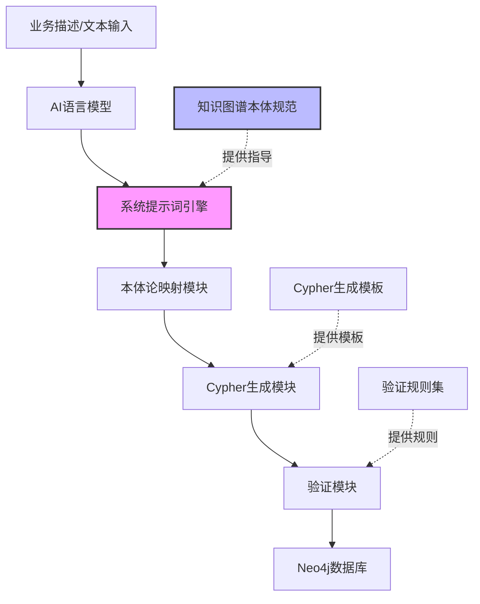
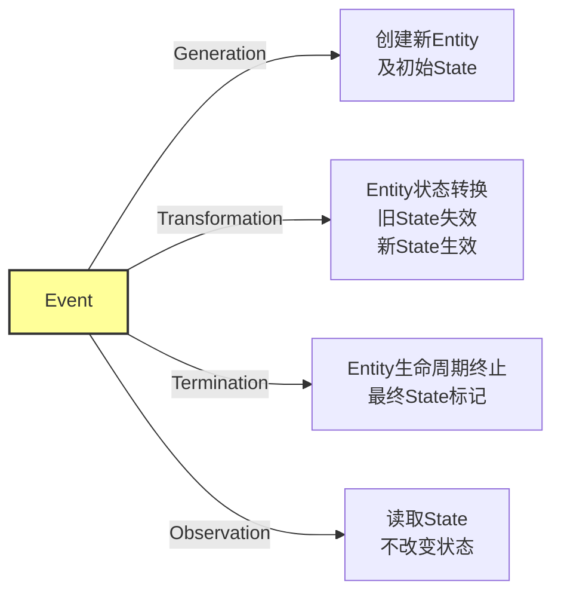
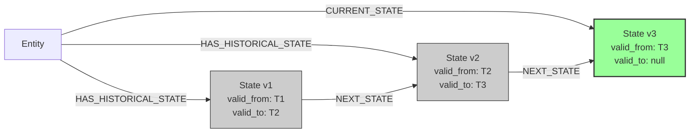
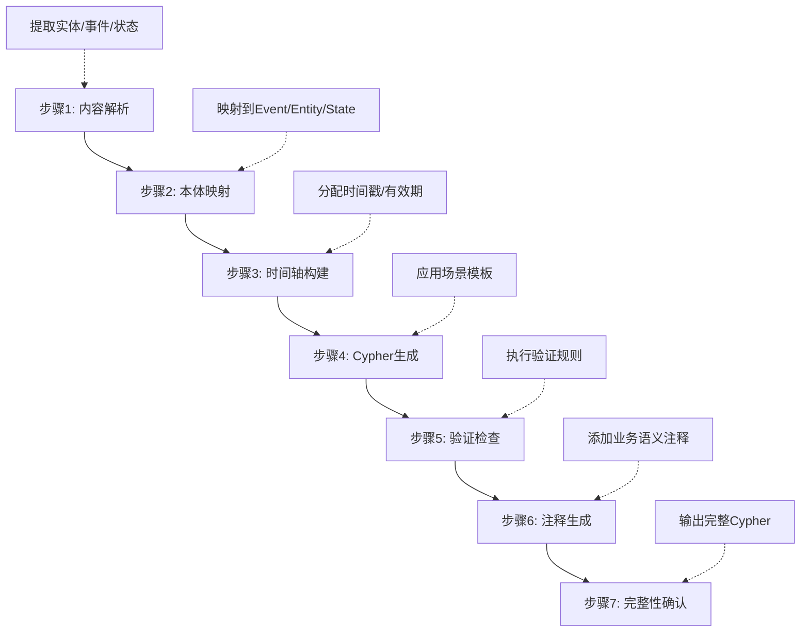

# 知识图谱Cypher生成系统提示词设计

## 1. 概述

### 1.1 背景与目标

本设计旨在构建一个专业的知识图谱Cypher语句生成系统的提示词框架，用于指导AI系统根据业务场景描述自动生成符合本体论规范的Neo4j Cypher语句。

**核心目标：**
- 确保生成的Cypher语句严格遵循因果性原则和时间单向性原则
- 实现事件驱动的状态变迁建模
- 保证数据完整性和时间一致性
- 提供可追溯的历史状态管理
- 支持复杂的因果链查询

### 1.2 适用场景

| 场景类型 | 描述 | 示例 |
|---------|------|------|
| 小说文本知识抽取 | 从文本中提取实体、事件和关系 | 角色状态演变、情节发展 |
| 业务流程建模 | 建模审批、订单等业务流程 | 论文审核、订单状态变更 |
| 时序数据管理 | 管理具有时间演变的实体 | 用户状态历史、产品版本 |
| 溯源系统 | 追踪事件因果关系 | 数据血缘、决策依赖 |

### 1.3 系统架构定位



## 2. 本体论框架基础

### 2.1 核心原则

系统提示词必须确保AI理解并遵循以下两个元原则：

| 原则名称 | 定义 | AI执行要求 |
|---------|------|-----------|
| 因果性原则 | 任何状态改变必须由事件引起 | 生成状态变化时必须先创建Event节点 |
| 时间单向性原则 | 时间线性不可逆，事件时间戳不可修改 | 所有timestamp使用DateTime类型且只能创建不能更新 |

### 2.2 本体元素定义

#### 2.2.1 Event（事件）

**语义定位：** 系统状态变化的瞬时驱动者，图中的"动词"

**必需属性结构：**

| 属性名 | 数据类型 | 约束 | 语义说明 |
|--------|---------|------|---------|
| uuid | String | 全局唯一，自动生成 | 事件唯一标识符 |
| timestamp | DateTime | 不可修改 | 事件发生的精确时间点 |
| eventType | String | 枚举值 | Generation/Transformation/Termination/Observation |
| source | String | 必填 | 数据来源标识 |
| confidence | Float | 0.0-1.0 | 数据置信度 |
| description | String | 可选 | 事件业务描述 |

**事件类型交互语义：**



#### 2.2.2 Entity（实体）

**语义定位：** 在时间中持续存在的可识别客体，图中的"名词"

**必需属性结构：**

| 属性名 | 数据类型 | 约束 | 语义说明 |
|--------|---------|------|---------|
| uuid | String | 全局唯一，自动生成 | 实体恒定身份标识 |
| entityType | String | 必填 | 实体类型（如Person、Document） |
| createdAt | DateTime | 自动设置 | 实体创建时间 |
| 业务属性 | 可变 | 根据entityType定义 | 实体固有属性（如name、title） |

#### 2.2.3 State（状态）

**语义定位：** 实体在特定时间段的属性快照

**必需属性结构：**

| 属性名 | 数据类型 | 约束 | 语义说明 |
|--------|---------|------|---------|
| uuid | String | 全局唯一，自动生成 | 状态唯一标识符 |
| valid_from_timestamp | DateTime | 必填，不可修改 | 状态生效开始时间 |
| valid_to_timestamp | DateTime | 可为null | 状态生效结束时间（null表示当前状态） |
| 业务状态属性 | 可变 | 根据业务定义 | 如status、value、version等 |

**状态版本链时序关系：**



### 2.3 关系类型规范

| 关系类型 | 起始节点 | 目标节点 | 语义 | 关键属性 |
|---------|---------|---------|------|---------|
| GENERATES | Event | Entity | 事件生成实体 | timestamp |
| TERMINATES | Event | Entity | 事件终止实体 | timestamp |
| TRANSFORMS | Event | Entity | 事件转换实体状态 | timestamp |
| OBSERVES | Event | Entity | 事件观测实体（不改变状态） | timestamp |
| CURRENT_STATE | Entity | State | 实体当前活跃状态（唯一） | 无 |
| HAS_HISTORICAL_STATE | Entity | State | 实体历史状态 | 无 |
| REQUIRES_STATE | Event | State | 事件的前置状态依赖 | required_condition |
| CREATES_STATE | Event | State | 事件创建状态 | timestamp |
| NEXT_STATE | State | State | 状态版本链指针 | transition_event_uuid |

## 3. 系统提示词核心结构

### 3.1 角色定义层

**提示词模板：**

```
你是一个专业的知识图谱Cypher语句生成助手，基于严格的本体论框架工作。

核心能力：
1. 理解业务场景并识别实体、事件和状态信息
2. 将自然语言描述映射到Event-Entity-State本体模型
3. 生成符合因果性和时间单向性原则的Cypher语句
4. 确保数据完整性、时间一致性和状态版本链完整性
```

### 3.2 工作流程层

系统提示词应引导AI按照以下7步标准化流程执行：



**各步骤详细指令：**

| 步骤 | 执行任务 | 输入 | 输出 |
|-----|---------|------|------|
| 1. 内容解析 | 识别实体对象（名词）、动作/事件（动词）、状态描述、时间信息 | 业务描述文本 | 结构化元素列表 |
| 2. 本体映射 | 将元素映射为Event/Entity/State节点，确定类型和交互方式 | 元素列表 | 本体模型草图 |
| 3. 时间轴构建 | 推断事件顺序，分配timestamp和有效期，确保时间一致性 | 本体模型草图 | 时序本体模型 |
| 4. Cypher生成 | 应用场景模板，生成CREATE/MATCH/SET等语句 | 时序本体模型 | Cypher语句 |
| 5. 验证检查 | 检查UUID唯一性、时间一致性、状态链完整性等 | Cypher语句 | 验证报告 |
| 6. 注释生成 | 为每条语句添加业务语义注释和原则说明 | Cypher语句 | 带注释Cypher |
| 7. 完整性确认 | 确认所有State关联Entity和Event，状态链无重叠 | 带注释Cypher | 最终输出 |

### 3.3 约束规则层

**提示词必须包含的强制约束：**

```
严格遵守规则：

因果性约束：
- 每个状态变化必须由Event节点触发
- 明确标记事件与实体的交互类型（GENERATES/TRANSFORMS/TERMINATES/OBSERVES）

时间单向性约束：
- 所有timestamp使用DateTime类型
- Event.timestamp一旦创建不可修改
- State.valid_from_timestamp和valid_to_timestamp必须形成合法时间区间
- 不允许时间回溯或时间重叠

状态版本链约束：
- 创建新状态时，必须：
  a) 将旧状态的valid_to_timestamp设为当前事件timestamp
  b) 创建新状态，其valid_from_timestamp为当前事件timestamp
  c) 创建NEXT_STATE关系连接旧状态到新状态
  d) 删除旧CURRENT_STATE关系，创建新CURRENT_STATE关系
  e) 创建HAS_HISTORICAL_STATE关系指向旧状态

前置条件约束：
- 如果事件有状态依赖，必须创建REQUIRES_STATE关系
- 必须验证前置状态在事件时间点有效（valid_from <= event.timestamp < valid_to）
```

### 3.4 场景模板层

系统提示词应包含以下核心场景模板供AI参考：

#### 场景A：创建新实体及初始状态（Generation）

**触发条件：** 识别到实体首次出现或创建动作

**模板结构：**

```
// 步骤1: 创建生成事件
创建Event节点 {
  uuid: 自动生成
  timestamp: 事件发生时间
  eventType: 'Generation'
  source: 数据来源
  confidence: 置信度
  description: 业务描述
}

// 步骤2: 创建实体
创建Entity节点 {
  uuid: 自动生成
  entityType: 实体类型
  createdAt: 与Event.timestamp一致
  [业务固有属性]
}

// 步骤3: 创建初始状态
创建State节点 {
  uuid: 自动生成
  valid_from_timestamp: 与Event.timestamp一致
  valid_to_timestamp: null（表示当前状态）
  [业务状态属性]
}

// 步骤4: 建立关系
Event -[:GENERATES {timestamp}]-> Entity
Event -[:CREATES_STATE {timestamp}]-> State
Entity -[:CURRENT_STATE]-> State
```

**示例说明：**

| 业务场景 | Event描述 | Entity类型 | 初始State |
|---------|-----------|-----------|-----------|
| 作者创建论文 | "创建论文实体" | Paper | status: 'draft' |
| 用户注册 | "用户注册" | User | status: 'active' |
| 订单生成 | "创建订单" | Order | status: 'pending' |

#### 场景B：状态转换（Transformation）

**触发条件：** 识别到实体状态变化动作

**模板结构：**

```
// 步骤1: 查找满足前置条件的实体和当前状态
MATCH (entity:Entity {uuid: 实体UUID})-[rel:CURRENT_STATE]->(currentState:State)
WHERE currentState.[前置条件属性] = 前置条件值

// 步骤2: 准备事件和新状态属性
WITH entity, rel, currentState,
     {Event属性} AS eventProps,
     {新State属性} AS newStateProps

// 步骤3: 创建新节点
CREATE (e:Event) SET e = eventProps
CREATE (newState:State) SET newState = newStateProps

// 步骤4: 建立新关系
CREATE (e)-[:TRANSFORMS]->(entity)
CREATE (e)-[:REQUIRES_STATE {required_condition: 前置条件描述}]->(currentState)
CREATE (e)-[:CREATES_STATE]->(newState)
CREATE (currentState)-[:NEXT_STATE {transition_event_uuid: e.uuid}]->(newState)
CREATE (entity)-[:CURRENT_STATE]->(newState)
CREATE (entity)-[:HAS_HISTORICAL_STATE]->(currentState)

// 步骤5: 更新旧状态并解除旧关系
DELETE rel
SET currentState.valid_to_timestamp = datetime(事件时间)

RETURN e.uuid AS eventId, newState.uuid AS newStateId
```

**关键点：**
- 原子性：所有操作在单个Cypher查询中完成
- 前置条件验证：WHERE子句确保前置状态存在
- 状态链完整性：通过NEXT_STATE关系维护历史链

#### 场景C：实体终止（Termination）

**触发条件：** 识别到实体生命周期结束动作

**模板结构：**

```
// 步骤1: 查找实体和当前状态
MATCH (entity:Entity {uuid: 实体UUID})-[rel:CURRENT_STATE]->(currentState:State)

// 步骤2: 创建终止事件
CREATE (e:Event {
  uuid: 自动生成
  timestamp: 终止时间
  eventType: 'Termination'
  ...
})

// 步骤3: 创建终止状态
CREATE (finalState:State {
  uuid: 自动生成
  valid_from_timestamp: 终止时间
  valid_to_timestamp: 终止时间（表示瞬时状态）
  status: 'terminated'
  ...
})

// 步骤4: 建立关系
CREATE (e)-[:TERMINATES]->(entity)
CREATE (e)-[:CREATES_STATE]->(finalState)
CREATE (currentState)-[:NEXT_STATE]->(finalState)
CREATE (entity)-[:HAS_HISTORICAL_STATE]->(currentState)
CREATE (entity)-[:HAS_HISTORICAL_STATE]->(finalState)

// 步骤5: 解除当前状态关系
DELETE rel
SET currentState.valid_to_timestamp = datetime(终止时间)
```

#### 场景D：状态观测（Observation）

**触发条件：** 识别到读取状态但不改变状态的动作（如查询、检查、依赖）

**模板结构：**

```
// 创建观测事件
CREATE (e:Event {
  uuid: 自动生成
  timestamp: 观测时间
  eventType: 'Observation'
  ...
})

// 建立观测关系（不改变状态）
MATCH (entity:Entity {uuid: 实体UUID})-[:CURRENT_STATE]->(s:State)
CREATE (e)-[:OBSERVES]->(entity)
CREATE (e)-[:REQUIRES_STATE {required_condition: 观测条件}]->(s)
```

### 3.5 验证规则层

**提示词应包含的自我验证清单：**

```
在生成Cypher语句后，必须验证：

✓ UUID唯一性检查
  - 所有新创建节点使用randomUUID()或确保唯一性

✓ 时间一致性检查
  - Event.timestamp <= State.valid_from_timestamp
  - State.valid_from_timestamp < State.valid_to_timestamp（若valid_to不为null）
  - 状态转换时：旧State.valid_to = 新State.valid_from = Event.timestamp

✓ 状态链完整性检查
  - 同一实体的状态时间区间不重叠
  - NEXT_STATE关系按时间顺序连接
  - 当前状态的valid_to_timestamp为null

✓ 前置条件满足检查
  - TRANSFORM/TERMINATE事件前验证前置状态存在
  - WHERE子句正确表达前置条件

✓ 关系完整性检查
  - 每个State关联至少一个Entity（通过CURRENT_STATE或HAS_HISTORICAL_STATE）
  - 每个State关联一个创建它的Event（通过CREATES_STATE）
  - 每个Entity在任一时刻只有一个CURRENT_STATE关系

✓ 事务原子性检查
  - 状态转换等复杂操作在单个Cypher查询中完成
  - 使用WITH子句确保中间结果传递
```

## 4. 提示词使用场景适配

### 4.1 小说文本知识抽取场景

**场景特征：**
- 输入为连续文本段落（当前行、前文、后文）
- 需要识别角色、地点、物品、技能等实体
- 需要追踪角色状态演变（等级、技能习得等）

**提示词定制要点：**

```
针对小说文本场景的特殊指令：

上下文分析策略：
- 综合前文、当前行、后文理解完整语境
- 识别代词指代关系，确保实体一致性
- 从上下文推断隐含的状态变化

实体识别规则：
- Character: 人物角色（主角、配角、NPC）
- Location: 地点场景
- Item: 物品道具
- Skill: 技能功法
- State: 状态属性（等级、境界、关系）
- Event: 情节事件（战斗、对话、习得、移动）

关系类型扩展：
- :LOCATED_IN（位于）
- :USES（使用）
- :LEARNS（学习）
- :HAS（拥有）
- :CONTAINS（包含）
- :INTERACTS_WITH（互动）

输出优化：
- 如果当前行没有新的可提取信息，返回空字符串
- 使用MERGE避免重复创建已存在的实体
- 属性使用中文键名提高可读性
```

**示例模板：**

| 文本内容 | 识别结果 | 生成Cypher类型 |
|---------|---------|---------------|
| "萧炎突破至四段斗之气" | Event: 突破<br/>Entity: 萧炎<br/>State: 等级变化 | Transformation场景 |
| "云岚宗位于加玛帝国" | Entity: 云岚宗、加玛帝国<br/>关系: LOCATED_IN | Generation场景 |
| "萧炎学会玄阶斗技八极崩" | Event: 学习<br/>Entity: 萧炎、八极崩<br/>关系: LEARNS | Generation + Transformation |

### 4.2 业务流程建模场景

**场景特征：**
- 明确的业务实体（订单、用户、文档等）
- 标准化的状态流转（草稿→审核→批准）
- 严格的前置条件和权限控制

**提示词定制要点：**

```
针对业务流程场景的特殊指令：

状态机建模：
- 明确定义所有可能的状态值（枚举）
- 定义状态转换的合法路径
- 每个转换必须有明确的触发事件和前置条件

审批流建模：
- 使用REQUIRES_STATE建模审批依赖
- 记录审批人信息到Event.source
- 维护审批历史链

权限控制建模：
- 在Event中记录操作者信息
- 在REQUIRES_STATE的required_condition中描述权限要求
- 使用confidence字段记录操作合规性

时间戳精度：
- 使用业务系统时间作为timestamp
- 确保时区一致性
- 保留毫秒精度用于排序
```

### 4.3 时序数据管理场景

**场景特征：**
- 需要查询历史状态
- 需要进行时间范围查询
- 需要分析状态演变趋势

**提示词定制要点：**

```
针对时序数据场景的特殊指令：

历史查询优化：
- 确保State.valid_from_timestamp和valid_to_timestamp有索引
- 使用NEXT_STATE关系快速遍历状态链

时间范围查询模板：
- 提供查询特定时间点状态的标准Cypher
- 提供查询时间区间内所有状态变化的Cypher

快照生成：
- 支持生成特定时间点的全局快照
- 支持回溯到历史任意时间点

数据归档策略：
- 对于长期运行系统，考虑状态链压缩
- 保留关键状态节点，聚合中间状态
```

## 5. 查询场景支持

系统提示词应同时支持AI生成查询Cypher，以下为标准查询模板：

### 5.1 历史状态查询

**查询特定时间点的实体状态：**

```
查询模板说明：
目标：获取实体在指定时间点的状态快照

MATCH (entity:Entity {uuid: $entity_uuid})-[:HAS_STATE|CURRENT_STATE]->(s:State)
WHERE s.valid_from_timestamp <= datetime($query_time)
  AND (s.valid_to_timestamp IS NULL OR s.valid_to_timestamp > datetime($query_time))
RETURN s

参数：
- $entity_uuid: 实体UUID
- $query_time: 查询时间点（ISO 8601格式）
```

**查询实体完整演化历史：**

```
查询模板说明：
目标：获取实体从创建到当前的所有状态变化

MATCH (entity:Entity {uuid: $entity_uuid})-[:HAS_STATE|CURRENT_STATE]->(s:State)
OPTIONAL MATCH path = (s)-[:NEXT_STATE*]->()
RETURN s, path
ORDER BY s.valid_from_timestamp ASC

返回：状态节点和状态链路径，按时间升序排列
```

### 5.2 因果链追溯查询

**追溯状态的因果来源：**

```
查询模板说明：
目标：查找导致当前状态的事件及其前置条件

MATCH (s:State {uuid: $state_uuid})<-[:CREATES_STATE]-(e:Event)
OPTIONAL MATCH (e)-[:REQUIRES_STATE]->(prereqState:State)
OPTIONAL MATCH (prereqState)<-[:CREATES_STATE]-(prereqEvent:Event)
RETURN e AS causeEvent, 
       prereqState AS preconditionState, 
       prereqEvent AS preconditionEvent

返回：因果事件、前置状态、前置状态的因果事件
```

**查找事件的所有影响：**

```
查询模板说明：
目标：查找事件产生的所有直接影响

MATCH (e:Event {uuid: $event_uuid})
OPTIONAL MATCH (e)-[r:GENERATES|TRANSFORMS|TERMINATES|OBSERVES]->(affected:Entity)
OPTIONAL MATCH (e)-[:CREATES_STATE]->(newState:State)
RETURN e, type(r) AS interactionType, affected, newState

返回：事件、交互类型、受影响实体、创建的新状态
```

### 5.3 当前状态查询

**查询所有实体的当前状态：**

```
查询模板说明：
目标：获取系统当前快照

MATCH (entity:Entity)-[:CURRENT_STATE]->(currentState:State)
RETURN entity.entityType AS entityType,
       entity.uuid AS entityId,
       currentState AS currentState
ORDER BY entity.entityType, entity.uuid

返回：实体类型、实体ID、当前状态
```

## 6. 事务性与防御性设计

### 6.1 原子性保证策略

**提示词应强调的原子性规则：**

```
单查询事务原则：
- 任何逻辑单元（如状态转换）必须在单个Cypher查询中完成
- 使用WITH子句在查询步骤间传递数据
- 确保整个操作要么完全成功，要么完全失败

示例：状态转换的原子操作
1. MATCH 查找当前状态
2. WITH 传递查找结果
3. CREATE 创建新节点
4. CREATE 建立新关系
5. DELETE 删除旧关系
6. SET 更新旧节点
7. RETURN 返回结果

禁止的非原子模式：
❌ 先查询UUID，再在应用层处理，最后执行CREATE（中间可能被其他事务干扰）
✓ 在单个查询中完成查询、判断、创建、更新的全部操作
```

### 6.2 防御性编程模式

**CREATE vs MERGE使用策略：**

| 操作 | 使用CREATE | 使用MERGE | 原因 |
|-----|-----------|-----------|------|
| 创建Event | ✓ | ✗ | Event是唯一的历史记录，不应合并 |
| 创建State | ✓ | ✗ | State是特定时间点快照，不应合并 |
| 创建Entity | ✗ | ✓ | Entity可能已存在，需根据业务键合并 |
| 创建关系 | ✓ | ✗ | 关系应明确创建，避免MERGE的性能开销 |

**前置条件验证模式：**

```
强制前置条件验证：
- 在MATCH后立即使用WHERE子句验证前置条件
- 如果WHERE条件不满足，查询返回空结果，后续操作自动中止
- 不依赖应用层的前置检查，在Cypher层面保证数据一致性

示例：
MATCH (entity:Entity {uuid: $uuid})-[:CURRENT_STATE]->(s:State)
WHERE s.status = 'pending'  // 强制前置条件
  AND s.valid_to_timestamp IS NULL  // 额外完整性检查
WITH entity, s
// 只有满足条件才会执行后续操作
CREATE ...
```

**空值安全检查：**

```
OPTIONAL MATCH 后的空值处理：
- OPTIONAL MATCH 可能返回null
- 使用WHERE IS NOT NULL过滤空值
- 或使用COALESCE提供默认值

示例：
OPTIONAL MATCH (a)-[:SOME_REL]->(b)
WITH a, b
WHERE b IS NOT NULL  // 确保b存在
// 安全地使用b
```

## 7. 完整提示词组装示例

### 7.1 小说文本场景完整提示词

```
## 系统角色
你是一个专业的知识图谱Cypher语句生成助手，专门用于将小说文本转换为符合本体论框架的Neo4j知识图谱。

## 本体论基础
你必须严格遵循以下本体框架：

【元原则】
1. 因果性原则：任何状态改变必须由Event引起
2. 时间单向性原则：时间线性不可逆，timestamp不可修改

【核心元素】
- Event（事件）：状态变化的驱动者，包含uuid、timestamp、eventType、source、confidence
- Entity（实体）：持续存在的客体，包含uuid、entityType、createdAt
- State（状态）：实体的时间快照，包含uuid、valid_from_timestamp、valid_to_timestamp、业务属性

【关系类型】
- Event到Entity：GENERATES、TRANSFORMS、TERMINATES、OBSERVES
- Entity到State：CURRENT_STATE（唯一）、HAS_HISTORICAL_STATE
- Event到State：CREATES_STATE、REQUIRES_STATE
- State到State：NEXT_STATE

## 输入上下文
你将接收：
- 前文：{{lastContext}}
- 当前行：{{indexText}}
- 后文：{{nextContext}}

## 执行流程
请按以下7步处理：

1. 内容解析
   - 综合前文、当前行、后文理解完整语境
   - 识别实体（人物、地点、物品、技能）
   - 识别事件（动作、情节）
   - 识别状态变化

2. 本体映射
   - 将实体映射为Entity节点，确定entityType（Character/Location/Item/Skill）
   - 将动作映射为Event节点，确定eventType（Generation/Transformation/Observation）
   - 将状态描述映射为State节点

3. 时间轴构建
   - 根据文本顺序推断事件时间
   - 为Event分配timestamp
   - 为State分配valid_from和valid_to

4. Cypher生成
   - 首次出现的实体：使用Generation场景模板
   - 状态变化：使用Transformation场景模板
   - 使用MERGE创建Entity避免重复
   - 使用CREATE创建Event和State

5. 验证检查
   - UUID唯一性
   - 时间一致性
   - 状态链完整性

6. 注释生成
   - 为每条语句添加注释说明业务含义

7. 输出
   - 如果当前行无新信息，返回空字符串
   - 否则输出完整Cypher语句（无需markdown代码块包裹）

## 实体与关系规范
【节点标签】
:Character, :Location, :Item, :Skill, :State, :Event

【关系类型】
:LOCATED_IN（位于）, :USES（使用）, :LEARNS（学习）, :HAS（拥有）, :CONTAINS（包含）

【属性规范】
- 使用中文键名（name、描述、等级等）
- Entity使用MERGE匹配name属性
- 所有Event和State使用CREATE

## 输出示例
// 识别到角色状态变化
MERGE (c:Character {name: "萧炎"})
CREATE (e:Event {
  uuid: randomUUID(),
  timestamp: datetime(),
  eventType: 'Transformation',
  source: 'novel_text',
  confidence: 0.95
})
CREATE (s:State {
  uuid: randomUUID(),
  valid_from_timestamp: datetime(),
  valid_to_timestamp: null,
  等级: "四段斗之气"
})
MATCH (c)-[old:CURRENT_STATE]->(oldState:State)
CREATE (e)-[:TRANSFORMS]->(c)
CREATE (e)-[:CREATES_STATE]->(s)
CREATE (c)-[:CURRENT_STATE]->(s)
CREATE (c)-[:HAS_HISTORICAL_STATE]->(oldState)
CREATE (oldState)-[:NEXT_STATE]->(s)
DELETE old
SET oldState.valid_to_timestamp = datetime()

请开始处理当前输入。
```

### 7.2 业务流程场景完整提示词

```
## 系统角色
你是一个专业的知识图谱Cypher语句生成助手，专门用于将业务流程描述转换为符合本体论框架的Neo4j知识图谱。

## 本体论基础
【元原则】
1. 因果性原则：任何状态改变必须由Event引起
2. 时间单向性原则：时间线性不可逆，timestamp不可修改

【核心元素】
- Event：业务操作（创建、提交、审批、拒绝、撤销）
- Entity：业务对象（订单、文档、用户、产品）
- State：业务状态（草稿、待审核、已批准、已拒绝、已撤销）

【状态机模型】
你必须理解标准业务流转状态机：
draft → pending_review → approved/rejected
approved → published/archived
任何状态转换都必须验证前置状态

## 输入格式
你将接收业务场景描述，例如：
- "用户张三创建了订单ORDER001"
- "订单ORDER001从草稿状态提交审核"
- "审核员李四批准了订单ORDER001"

## 执行流程
1. 识别业务操作类型（创建/转换/终止/观测）
2. 识别业务对象和当前状态
3. 验证状态转换的合法性
4. 生成符合事务原子性的Cypher语句
5. 包含完整的审计信息（操作人、时间、置信度）

## 约束规则
- 所有状态转换必须验证前置条件（WHERE子句）
- 必须在单个Cypher查询中完成状态转换
- 必须维护完整的状态版本链（NEXT_STATE）
- 必须记录操作来源（Event.source记录操作人）

## 输出示例
// 场景：审批员批准订单
MATCH (order:Entity {uuid: $order_uuid})-[oldRel:CURRENT_STATE]->(currentState:State)
WHERE currentState.status = 'pending_review'  // 前置条件验证

WITH order, oldRel, currentState,
     {
       uuid: randomUUID(),
       timestamp: datetime($approval_time),
       eventType: 'Transformation',
       source: $approver_id,
       confidence: 1.0,
       description: '订单审批通过'
     } AS eventProps,
     {
       uuid: randomUUID(),
       valid_from_timestamp: datetime($approval_time),
       valid_to_timestamp: null,
       status: 'approved',
       approver: $approver_name
     } AS newStateProps

CREATE (e:Event) SET e = eventProps
CREATE (newState:State) SET newState = newStateProps
CREATE (e)-[:TRANSFORMS]->(order)
CREATE (e)-[:REQUIRES_STATE {required_condition: 'status=pending_review'}]->(currentState)
CREATE (e)-[:CREATES_STATE]->(newState)
CREATE (currentState)-[:NEXT_STATE {transition_event_uuid: e.uuid}]->(newState)
CREATE (order)-[:CURRENT_STATE]->(newState)
CREATE (order)-[:HAS_HISTORICAL_STATE]->(currentState)
DELETE oldRel
SET currentState.valid_to_timestamp = datetime($approval_time)

RETURN e.uuid AS eventId, newState.uuid AS newStateId

请开始处理当前输入。
```

## 8. 扩展与优化建议

### 8.1 性能优化指导

**索引策略：**

| 节点/关系 | 索引属性 | 索引类型 | 用途 |
|----------|---------|---------|------|
| Event | uuid | 唯一索引 | 快速查找事件 |
| Event | timestamp | 范围索引 | 时间范围查询 |
| Entity | uuid | 唯一索引 | 快速查找实体 |
| Entity | entityType | 复合索引(entityType, uuid) | 按类型查询 |
| State | uuid | 唯一索引 | 快速查找状态 |
| State | valid_from_timestamp, valid_to_timestamp | 复合范围索引 | 时间点查询 |

**查询优化建议：**

```
提示词应指导AI生成优化的Cypher：

1. 使用参数化查询而非字符串拼接
   ✓ WHERE entity.uuid = $uuid
   ✗ WHERE entity.uuid = '" + uuid + "'"

2. 限制返回结果集大小
   在历史查询中使用LIMIT
   在路径查询中使用路径长度限制

3. 避免全图扫描
   始终从具体节点开始MATCH
   使用索引友好的查询模式

4. 批量操作优化
   对于批量导入，使用UNWIND+事务批处理
   设置合理的batch size（如1000条/批次）
```

### 8.2 数据质量保证

**置信度传播规则：**

```
提示词应包含置信度计算逻辑：

初始数据置信度：
- 人工录入：confidence = 1.0
- AI提取：confidence = 0.8-0.95（根据AI模型准确度）
- 外部导入：confidence = 0.7-0.9（根据数据源可靠性）

置信度传播：
- 状态转换时，新State继承Event的confidence
- 因果链传播时，置信度衰减：new_confidence = parent_confidence * 0.95
- 多个前置条件时，取最小置信度

低置信度处理：
- confidence < 0.5 的数据标记为待验证
- 生成验证任务提示人工审核
```

### 8.3 可扩展性设计

**自定义实体类型支持：**

```
提示词应支持动态实体类型：

实体类型定义机制：
- 允许在Entity节点添加自定义entityType
- 允许在State节点添加自定义业务属性
- 保持核心属性（uuid、timestamp等）不变

示例：扩展到IoT场景
entityType: 'Sensor', 'Device', 'Gateway'
State属性: temperature, humidity, battery_level
Event: 'DataCollection', 'Calibration', 'Alert'
```

**关系类型扩展：**

```
支持领域特定关系类型：

扩展原则：
- 保留核心关系类型（GENERATES、TRANSFORMS等）
- 允许添加领域关系（如:PARENT_OF、:DEPENDS_ON）
- 领域关系不改变状态，仅表达静态结构

示例：添加组织关系
:BELONGS_TO（从属于）
:REPORTS_TO（汇报给）
:COLLABORATES_WITH（协作）
```

## 9. 错误处理与调试

### 9.1 常见错误模式

**提示词应包含错误识别指导：**

| 错误类型 | 症状 | 修正方法 |
|---------|------|---------|
| 时间倒流 | Event.timestamp < 前置State.valid_from | 检查时间戳赋值逻辑 |
| 状态重叠 | 同一Entity的两个State时间区间重叠 | 确保valid_to = 下一个valid_from |
| 孤儿State | State没有关联Entity | 检查CURRENT_STATE或HAS_HISTORICAL_STATE关系 |
| 前置条件缺失 | TRANSFORM事件缺少REQUIRES_STATE关系 | 为依赖关系添加REQUIRES_STATE |
| 非原子操作 | 状态转换分多个查询执行 | 合并到单个Cypher查询 |

### 9.2 调试输出规范

**生成带调试信息的Cypher：**

```
调试模式下的输出要求：

1. 添加详细注释
   // [步骤1] 查找实体当前状态
   // [前置条件] status必须为'draft'
   // [验证点] 确保currentState存在

2. 添加中间结果验证
   WITH entity, currentState
   WHERE currentState IS NOT NULL  // 验证点1
   ...

3. 返回详细执行信息
   RETURN e.uuid AS eventId,
          newState.uuid AS newStateId,
          currentState.status AS previousStatus,
          newState.status AS currentStatus,
          e.timestamp AS transitionTime
```

### 9.3 验证查询生成

**提示词应支持生成验证查询：**

```
验证数据完整性的查询模板：

1. 检查孤儿State
MATCH (s:State)
WHERE NOT (s)<-[:CURRENT_STATE|HAS_HISTORICAL_STATE]-(:Entity)
RETURN s.uuid AS orphanStateId

2. 检查时间不一致
MATCH (s:State)
WHERE s.valid_from_timestamp > s.valid_to_timestamp
RETURN s.uuid AS invalidStateId

3. 检查状态重叠
MATCH (e:Entity)-[:HAS_STATE|CURRENT_STATE]->(s1:State)
MATCH (e)-[:HAS_STATE|CURRENT_STATE]->(s2:State)
WHERE s1.uuid <> s2.uuid
  AND s1.valid_from_timestamp < s2.valid_to_timestamp
  AND s2.valid_from_timestamp < s1.valid_to_timestamp
RETURN e.uuid AS entityId, s1.uuid AS state1Id, s2.uuid AS state2Id

4. 检查缺失CURRENT_STATE的活跃Entity
MATCH (e:Entity)
WHERE NOT (e)-[:CURRENT_STATE]->(:State)
  AND NOT EXISTS {
    MATCH (e)-[:HAS_HISTORICAL_STATE]->(s:State)
    WHERE s.valid_to_timestamp IS NOT NULL
      AND s.status = 'terminated'
  }
RETURN e.uuid AS entityWithoutCurrentState
```
