# 小说文本知识图谱构建系统增强设计

## 1. 概述

### 1.1 设计目标

本设计旨在增强现有`GraphService`，将其从简单的Cypher生成工具升级为基于严格本体论框架的知识图谱构建系统。通过集成`kgKnowlage.md`定义的元原则和本体规范，实现小说文本的事件驱动状态建模，支持角色演化追溯、情节因果分析和历史状态查询。

**核心增强点：**
- 从简单的实体-关系抽取升级为Event-Entity-State三层本体建模
- 引入因果性原则和时间单向性原则确保数据一致性
- 实现状态版本链管理，支持角色属性的时序演化追溯
- 集成严格的Cypher生成规范，确保生成的语句符合本体约束
- 提供小说场景特化的提示词工程，提升抽取准确性

### 1.2 业务价值

| 价值维度 | 具体收益 |
|---------|---------|
| 知识精度 | 通过本体约束保证知识图谱的逻辑一致性和时序完整性 |
| 查询能力 | 支持"角色在第X章的状态"、"技能习得路径"等复杂时序查询 |
| 可追溯性 | 完整记录角色状态演变的因果链，支持情节分析 |
| 扩展性 | 标准化的本体框架易于扩展至其他文本类型（历史、传记等） |
| 数据质量 | 防御性编程和验证规则减少数据冲突和时间矛盾 |

### 1.3 架构定位

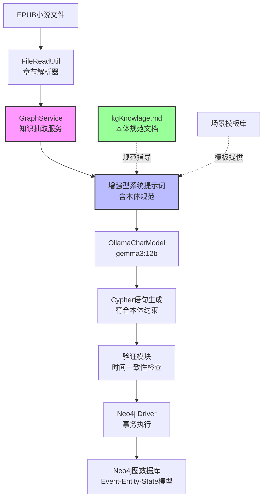

**系统层次：**
1. **数据源层**：EPUB文件读取与章节段落解析
2. **知识抽取层**：GraphService + 增强提示词 + AI模型
3. **验证层**：Cypher语句的本体约束验证
4. **存储层**：Neo4j图数据库持久化
5. **查询层**（未来扩展）：历史状态查询、因果链追溯

## 2. 本体论框架适配

### 2.1 核心原则在小说场景的映射

基于`kgKnowlage.md`第一章元原则，在小说知识图谱中的具体应用：

| 元原则 | 小说场景映射 | 示例 |
|-------|------------|------|
| 因果性原则 | 角色状态变化必须由情节事件引起 | "萧炎突破斗之气"事件导致等级状态从"三段"转换为"四段" |
| 时间单向性原则 | 章节顺序决定事件时间戳，不可逆 | 第5章的事件timestamp必须晚于第4章 |

**约束规则：**
- 任何角色的境界提升、技能习得、关系变化都必须有对应的Event节点
- 事件的timestamp基于章节索引和段落索引递增生成
- 禁止直接修改State节点，状态变化通过创建新State + 标记旧State失效实现

### 2.2 本体元素定义

#### 2.2.1 Event（情节事件）

**小说场景特化定义：**

| 属性名 | 数据类型 | 约束 | 小说场景说明 |
|--------|---------|------|-------------|
| uuid | String | 自动生成 | 事件唯一标识符 |
| timestamp | DateTime | 章节序号+段落序号 | 如"2025-01-01T05:30:00"（第5章第30段） |
| eventType | String | 枚举值 | Generation（初次登场）、Transformation（状态变化）、Observation（描述） |
| source | String | 章节标题+段落索引 | 如"第五章 初入云岚宗 - P30" |
| confidence | Float | 基于上下文相关性 | 0.8-1.0（AI生成置信度） |
| description | String | 事件描述 | 如"萧炎突破至四段斗之气" |
| chapterIndex | Integer | 章节序号 | 用于时间排序和查询 |
| paragraphIndex | Integer | 段落序号 | 同一章节内的细粒度时间 |

**事件类型扩展：**

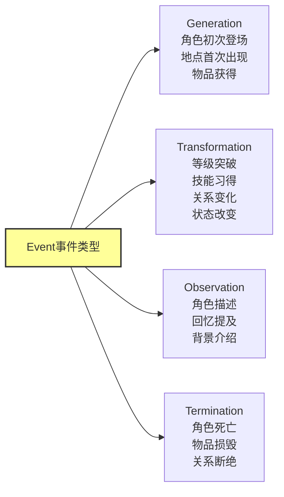

#### 2.2.2 Entity（实体）

**小说实体类型扩展：**

| entityType | 描述 | 核心属性示例 |
|-----------|------|-------------|
| Character | 角色人物 | name（姓名）、faction（阵营）、race（种族） |
| Location | 地点场景 | name（地名）、type（类型：宗派/城市/秘境） |
| Item | 物品道具 | name（名称）、grade（品阶）、type（类型：丹药/武器/功法） |
| Skill | 技能功法 | name（名称）、level（阶位）、element（属性） |
| Organization | 组织势力 | name（名称）、type（宗派/家族/商会） |

**Entity节点属性规范：**

| 属性名 | 数据类型 | 是否必填 | 说明 |
|--------|---------|---------|------|
| uuid | String | 是 | 实体唯一标识 |
| entityType | String | 是 | 实体类型枚举值 |
| createdAt | DateTime | 是 | 实体创建时间（首次出现的事件时间） |
| name | String | 是 | 实体名称（中文） |
| firstMentionChapter | Integer | 是 | 首次出现章节 |
| firstMentionSource | String | 是 | 首次出现位置 |

#### 2.2.3 State（状态）

**小说状态类型定义：**

| 状态类别 | 描述 | 属性示例 |
|---------|------|---------|
| 境界状态 | 修炼等级 | level（等级名称）、stage（段位）、realm（境界） |
| 技能状态 | 掌握的技能 | skillName（技能名）、proficiency（熟练度） |
| 关系状态 | 人物间关系 | relationType（关系类型）、targetCharacter（目标角色）、intimacy（亲密度） |
| 地理状态 | 所在位置 | currentLocation（当前位置）、travelReason（移动原因） |
| 持有状态 | 拥有物品 | itemName（物品名）、quantity（数量）、condition（状态） |

**State节点属性规范：**

| 属性名 | 数据类型 | 约束 | 说明 |
|--------|---------|------|------|
| uuid | String | 必填 | 状态唯一标识 |
| valid_from_timestamp | DateTime | 必填 | 状态生效开始时间（对应事件时间） |
| valid_to_timestamp | DateTime | 可为null | 状态失效时间（null表示当前状态） |
| stateType | String | 必填 | 状态类型（境界/技能/关系/地理/持有） |
| stateValue | String | 必填 | 状态值（如"四段斗之气"） |
| 业务属性 | 可变 | 可选 | 如level、skillName等根据stateType定义 |

### 2.3 关系类型规范

#### 2.3.1 核心本体关系（强制遵循）

| 关系类型 | 起始节点 | 目标节点 | 语义 | 关键属性 |
|---------|---------|---------|------|---------|
| GENERATES | Event | Entity | 事件生成实体（角色登场、物品获得） | timestamp |
| TRANSFORMS | Event | Entity | 事件转换实体状态（等级提升、技能习得） | timestamp |
| TERMINATES | Event | Entity | 事件终止实体（角色死亡、物品损毁） | timestamp |
| OBSERVES | Event | Entity | 事件观测实体（描述、回忆提及） | timestamp |
| CURRENT_STATE | Entity | State | 实体当前活跃状态（唯一） | 无 |
| HAS_HISTORICAL_STATE | Entity | State | 实体历史状态 | 无 |
| REQUIRES_STATE | Event | State | 事件前置条件（如突破需达到"圆满"状态） | required_condition |
| CREATES_STATE | Event | State | 事件创建新状态 | timestamp |
| NEXT_STATE | State | State | 状态版本链指针 | transition_event_uuid |

#### 2.3.2 小说领域关系（业务扩展）

| 关系类型 | 起始节点 | 目标节点 | 语义 | 关键属性 |
|---------|---------|---------|------|---------|
| LOCATED_IN | Character/Item | Location | 位于某地 | timestamp（记录时间点） |
| BELONGS_TO | Character | Organization | 归属组织 | role（角色：弟子/长老/宗主） |
| MASTERS | Character | Skill | 掌握技能 | proficiency（熟练度） |
| POSSESSES | Character | Item | 拥有物品 | quantity（数量） |
| ALLY_OF | Character | Character | 盟友关系 | intimacy（亲密度） |
| ENEMY_OF | Character | Character | 敌对关系 | hostility（敌意等级） |
| TEACHER_OF | Character | Character | 师徒关系 | since（建立时间） |
| LEADS | Character | Organization | 领导组织 | title（头衔） |

**关系使用策略：**
- 核心本体关系（GENERATES/TRANSFORMS等）：由系统强制生成，确保本体一致性
- 领域关系（LOCATED_IN/MASTERS等）：由AI从文本抽取，可能需要人工校验

### 2.4 状态版本链设计

**小说场景的状态演化示例：**

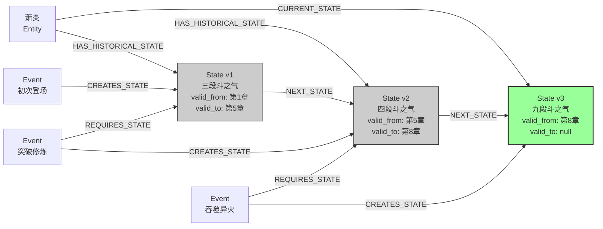

**版本链规则：**
1. 同一实体的所有State节点通过NEXT_STATE形成单向链表
2. 链表按valid_from_timestamp升序排列
3. 只有链尾节点的valid_to_timestamp为null且拥有CURRENT_STATE关系
4. 状态转换时必须原子化执行：更新旧State的valid_to → 创建新State → 建立NEXT_STATE → 转移CURRENT_STATE

## 3. GraphService增强架构

### 3.1 系统组件结构

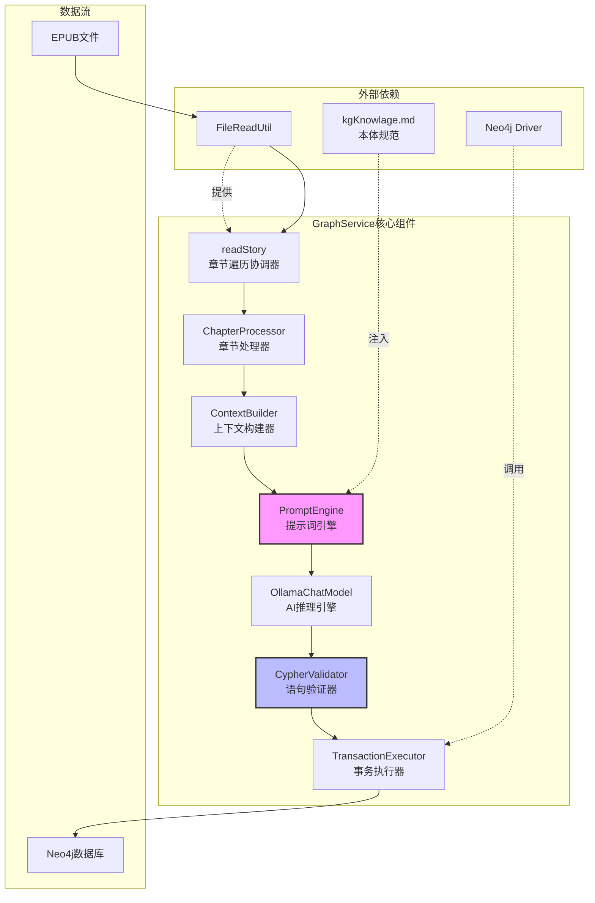

### 3.2 核心组件职责

| 组件名称 | 职责描述 | 输入 | 输出 |
|---------|---------|------|------|
| ChapterProcessor | 章节级别协调，维护章节索引和时间戳基准 | ParseResult（章节标题+段落列表） | 章节处理完成信号 |
| ContextBuilder | 构建滑动窗口上下文（前文+当前行+后文） | 段落索引、段落列表 | 上下文三元组 |
| PromptEngine | 动态组装提示词，注入本体规范和场景模板 | 上下文、章节元数据 | 完整提示词字符串 |
| CypherValidator | 验证生成的Cypher符合本体约束 | Cypher语句字符串 | 验证报告（通过/失败+错误原因） |
| TransactionExecutor | 批量执行Cypher，支持事务回滚 | 验证通过的Cypher列表 | 执行结果（成功/失败节点数） |

### 3.3 数据流与交互

**处理流程：**

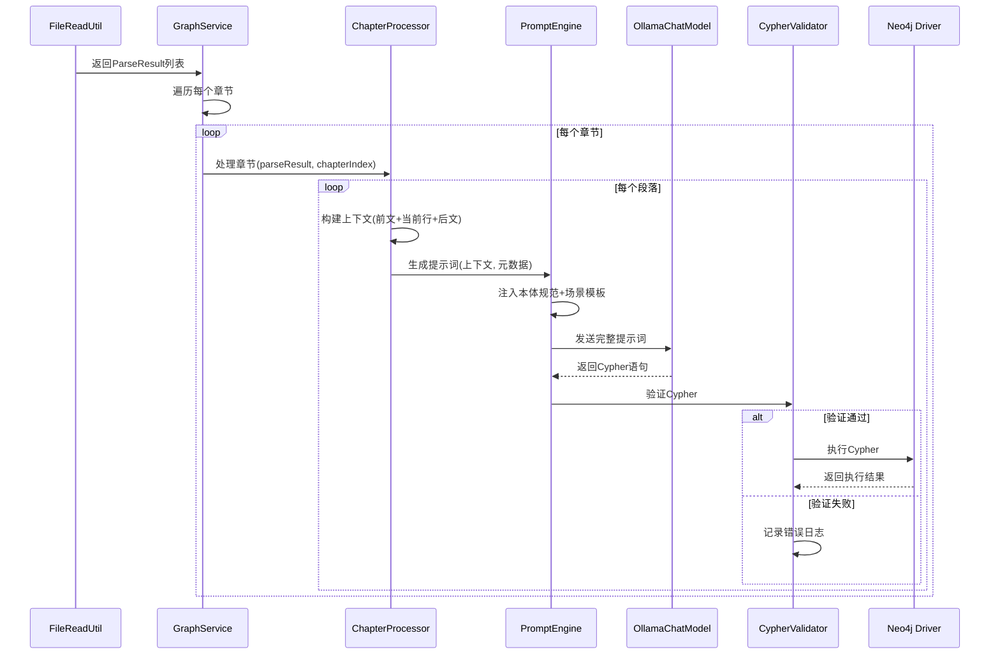

### 3.4 时间戳生成策略

**基于章节和段落的时间映射：**

| 策略 | 公式 | 示例 |
|-----|------|------|
| 章节基准时间 | baseDate + (chapterIndex * 1天) | 第5章 = 2025-01-01 + 5天 = 2025-01-06 |
| 段落偏移时间 | 章节基准时间 + (paragraphIndex * 1分钟) | 第30段 = 2025-01-06 00:00 + 30分钟 = 2025-01-06 00:30:00 |
| Event.timestamp | 段落偏移时间 | 某事件在第5章第30段发生 → timestamp = 2025-01-06T00:30:00 |

**优势：**
- 保证时间戳的全局唯一性和单调递增
- 支持按章节范围查询（如"第3-7章的所有事件"）
- 可通过timestamp反推章节位置（timestamp.day = chapterIndex + 1）

### 3.5 批处理与容错机制

**批处理策略：**
- 每个段落的Cypher独立验证和执行
- 单个段落失败不影响后续段落处理
- 章节级别设置检查点，支持断点续传

**容错机制：**

| 异常类型 | 处理策略 | 日志记录 |
|---------|---------|---------|
| AI返回空字符串 | 跳过当前段落，继续下一个 | INFO级别：段落无新信息 |
| Cypher语法错误 | 记录错误，跳过执行 | ERROR级别：源文本+错误语句+错误原因 |
| Neo4j连接失败 | 重试3次，失败后暂停处理 | FATAL级别：触发告警 |
| 本体约束违反 | 记录违反规则，跳过执行 | WARN级别：违反的约束名称+语句 |

## 4. 提示词工程设计

### 4.1 提示词分层结构

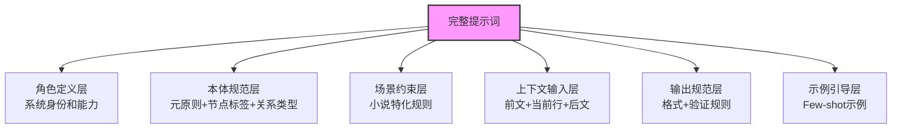

### 4.2 SystemPrompt完整文本

**SystemPrompt性质：** 强制性约束规范，非建议性指导

**存储位置：** `ai/src/main/resources/prompt/graph-system-prompt.txt`

**完整内容：**

```
==========================================================
知识图谱Cypher生成系统规范
版本：v1.0 | 基于事件驱动本体论框架
==========================================================

一、强制性约束规则（MANDATORY RULES）

【RULE-1 本体元素强制约束】

1.1 Event（事件）节点必须包含以下属性：
   - uuid: String (必须使用randomUUID()生成)
   - timestamp: DateTime (必须使用datetime('{{baseTimestamp}}')生成)
   - eventType: String (只能为: 'Generation' | 'Transformation' | 'Observation' | 'Termination')
   - source: String (格式: '第X章 章节名 - PY')
   - confidence: Float (范围: 0.0-1.0)
   - description: String (事件业务描述)
   - chapterIndex: Integer (章节索引，从1开始）
   - paragraphIndex: Integer (段落索引，从1开始）

1.2 Entity（实体）节点必须包含以下属性：
   - uuid: String (必须使用randomUUID()生成)
   - entityType: String (只能为: 'Character' | 'Location' | 'Item' | 'Skill' | 'Organization')
   - createdAt: DateTime (必须使用datetime('创建时间')生成)
   - name: String (实体名称，必须为中文）
   - firstMentionChapter: Integer (首次出现章节)
   - firstMentionSource: String (首次出现位置)

1.3 State（状态）节点必须包含以下属性：
   - uuid: String (必须使用randomUUID()生成)
   - valid_from_timestamp: DateTime (必须等于创建它的Event.timestamp)
   - valid_to_timestamp: DateTime | null (当前活跃状态必须为null)
   - stateType: String (只能为: 境界状态 | 技能状态 | 关系状态 | 地理状态 | 持有状态)
   - stateValue: String (状态具体值，必须为中文）

【RULE-2 关系类型强制约束】

2.1 Event到Entity的关系（必须使用且只能使用以下类型）：
   - GENERATES: Event创建新Entity（角色登场、获得物品、进入新地点）
   - TRANSFORMS: Event转换Entity状态（境界突破、技能习得、关系变化）
   - TERMINATES: Event终止Entity生命周期（角色死亡、物品损毁）
   - OBSERVES: Event观测Entity但不改变状态（描述外貌、回忆往事）

2.2 Entity到State的关系（必须使用）：
   - CURRENT_STATE: 指向当前活跃状态（每个Entity同一时刻只能有一个）
   - HAS_HISTORICAL_STATE: 指向已失效的历史状态

2.3 Event到State的关系：
   - CREATES_STATE: Event创建新State（必须包含timestamp属性）
   - REQUIRES_STATE: Event依赖的前置状态（必须包含required_condition属性）

2.4 State到State的关系：
   - NEXT_STATE: 连接状态版本链（必须包含transition_event_uuid属性）

【RULE-3 因果性原则强制约束】

3.1 状态变化必须由Event触发：
   - 禁止直接创建State节点而无对应的Event
   - 每个State必须有且仅有一个Event通过CREATES_STATE关系指向它

3.2 状态转换的原子性约束（适用于Transformation事件）：
   必须按以下顺序执行所有步骤，缺一不可：
   
   a) MATCH查找: 查找Entity和当前State
      MATCH (entity:Entity {name: '实体名', entityType: '类型'})
            -[oldRel:CURRENT_STATE]->(oldState:State)
      WHERE oldState.stateType = '状态类型' AND oldState.valid_to_timestamp IS NULL
   
   b) WITH传递: 传递查询结果
      WITH entity, oldRel, oldState
   
   c) CREATE Event: 创建Transformation事件节点
      CREATE (e:Event {
        uuid: randomUUID(),
        timestamp: datetime('{{baseTimestamp}}'),
        eventType: 'Transformation',
        source: '第X章 章节名 - PY',
        confidence: 0.0-1.0,
        description: '事件描述',
        chapterIndex: X,
        paragraphIndex: Y
      })
   
   d) CREATE State: 创建新状态节点
      CREATE (newState:State {
        uuid: randomUUID(),
        valid_from_timestamp: datetime('{{baseTimestamp}}'),
        valid_to_timestamp: null,
        stateType: '状态类型',
        stateValue: '新状态值'
      })
   
   e) 建立关系: 按顺序创建以下关系
      CREATE (e)-[:TRANSFORMS]->(entity)
      CREATE (e)-[:REQUIRES_STATE {required_condition: '条件描述'}]->(oldState)
      CREATE (e)-[:CREATES_STATE {timestamp: datetime('{{baseTimestamp}}')}]->(newState)
      CREATE (oldState)-[:NEXT_STATE {transition_event_uuid: e.uuid}]->(newState)
      CREATE (entity)-[:CURRENT_STATE]->(newState)
      CREATE (entity)-[:HAS_HISTORICAL_STATE]->(oldState)
   
   f) 清理旧关系: 删除旧的CURRENT_STATE关系
      DELETE oldRel
   
   g) 更新旧状态: 设置失效时间
      SET oldState.valid_to_timestamp = datetime('{{baseTimestamp}}')

【RULE-4 时间单向性原则强制约束】

4.1 时间戳生成约束：
   - 所有Event.timestamp必须使用提供的{{baseTimestamp}}
   - 禁止自定义或修改时间戳
   - timestamp格式必须为ISO 8601标准：datetime('YYYY-MM-DDTHH:MM:SS')

4.2 状态时间一致性约束：
   - State.valid_from_timestamp 必须等于创建它的Event.timestamp
   - 状态转换时：oldState.valid_to_timestamp = newState.valid_from_timestamp = Event.timestamp

4.3 时间不可逆约束：
   - 禁止修改已创建的Event.timestamp
   - 禁止修改已创建的State.valid_from_timestamp
   - 所有修正必须通过创建新Event实现

【RULE-5 信息提取边界强制约束】

5.1 唯一信息来源约束：
   - 所有Entity、Event、State必须且只能从indexText（当前行）提取
   - 禁止从lastContext（前文）提取新实体或事件
   - 禁止从nextContext（后文）生成任何Cypher语句

5.2 上下文作用域约束：
   - lastContext仅用于：
     * 确认实体名称一致性（避免同一角色不同别名）
     * 推断前置状态（用于WHERE子句验证）
   - nextContext仅用于：
     * 消除代词歧义（如“他”指代哪个角色）
     * 理解上下文语境（辅助判断事件类型）

【RULE-6 Cypher语法强制约束】

6.1 Entity创建约束：
   - 必须使用MERGE避免重复（匹配name和entityType）
   - 标准格式：
     MERGE (e:Entity {name: '实体名称', entityType: '类型'})
     ON CREATE SET 
       e.uuid = randomUUID(),
       e.createdAt = datetime('时间'),
       e.firstMentionChapter = X,
       e.firstMentionSource = '位置'

6.2 Event和State创建约束：
   - 必须使用CREATE确保唯一性
   - 禁止使用MERGE创建Event或State（会导致历史记录丢失）

6.3 属性命名约束：
   - 所有属性键名必须使用中文（如：name、描述、等级、状态值）
   - uuid必须使用randomUUID()函数
   - timestamp相关必须使用datetime('时间字符串')函数

6.4 输出格式约束：
   - 只输出Cypher语句，禁止添加任何解释文字
   - 禁止使用markdown代码块包裹（如```cypher```）
   - 如果indexText无可提取的新信息，必须返回空字符串
   - 禁止返回“无法生成”、“无信息”等文字说明


二、本体框架介绍（ONTOLOGY INTRODUCTION）

2.1 事件驱动模型原理

   本系统采用事件驱动的知识建模方式：
   
   - Event（事件）是状态变化的驱动力
     记录“什么时候发生了什么”
     例：“第5章第30段，萧炎突破至四段斗之气”
   
   - Entity（实体）是持续存在的对象
     记录“是谁/是什么”
     例：角色“萧炎”、地点“云岚宗”、技能“八极崩”
   
   - State（状态）是实体在特定时间点的属性快照
     记录“当时是什么状态”
     例：萧炎在第5章的境界状态为“四段斗之气”

2.2 状态版本链原理

   实体的历史状态通过NEXT_STATE关系形成单向链表：
   
   State_v1(三段) -[:NEXT_STATE]-> State_v2(四段) -[:NEXT_STATE]-> State_v3(五段)
   
   这使得可以：
   - 查询实体在任意时间点的状态（如“第3章时萧炎是什么境界”）
   - 追溯状态变化的完整历史（如“萧炎的境界提升路径”）
   - 分析状态演化的因果链（如“突破需要哪些前置条件”）

2.3 小说场景事件类型应用

   - Generation（生成）：角色初次登场、获得物品、进入新地点
   - Transformation（转换）：境界突破、技能习得、关系变化、位置移动
   - Observation（观测）：描述外貌、回忆往事、介绍背景
   - Termination（终止）：角色死亡、物品损毁、组织覆灭


三、标准场景实例（STANDARD EXAMPLES）

【实例1：角色初次登场 - Generation场景】

输入上下文：
- lastContext（前文）：“萧家位于乌坦城。”
- indexText（当前行）：“少年名叫萧炎，乃是萧家族长之子。”
- nextContext（后文）：“萧炎今年十五岁。”
- baseTimestamp: 2025-01-01T00:01:00
- chapterIndex: 1, paragraphIndex: 1

分析过程：
1. lastContext确认“萧家”已存在，但不从中提取新信息
2. indexText提取关键信息：
   - Entity: 角色“萧炎”(首次出现)
   - Event: Generation(登场事件)
   - State: 身份状态“萧家族长之子”
3. nextContext不生成Cypher（虽然提到年龄，但不在indexText中）

符合规范的Cypher输出：
CREATE (e:Event {
  uuid: randomUUID(),
  timestamp: datetime('2025-01-01T00:01:00'),
  eventType: 'Generation',
  source: '第1章 落魄天才 - P1',
  confidence: 1.0,
  description: '萧炎初次登场',
  chapterIndex: 1,
  paragraphIndex: 1
})
MERGE (c:Entity {name: '萧炎', entityType: 'Character'})
ON CREATE SET 
  c.uuid = randomUUID(),
  c.createdAt = datetime('2025-01-01T00:01:00'),
  c.firstMentionChapter = 1,
  c.firstMentionSource = '第1章 落魄天才 - P1'
CREATE (s:State {
  uuid: randomUUID(),
  valid_from_timestamp: datetime('2025-01-01T00:01:00'),
  valid_to_timestamp: null,
  stateType: '身份状态',
  stateValue: '萧家族长之子'
})
CREATE (e)-[:GENERATES {timestamp: datetime('2025-01-01T00:01:00')}]->(c)
CREATE (e)-[:CREATES_STATE {timestamp: datetime('2025-01-01T00:01:00')}]->(s)
CREATE (c)-[:CURRENT_STATE]->(s)

【实例2：状态转换 - Transformation场景】

输入上下文：
- lastContext（前文）：“萧炎苦修三年，始终停留在三段斗之气。”
- indexText（当前行）：“萧炎终于突破至四段斗之气。”
- nextContext（后文）：“云岚宗弟子们露出震惊之色。”
- baseTimestamp: 2025-01-05T00:30:00
- chapterIndex: 5, paragraphIndex: 30

分析过程：
1. lastContext确认前置状态为“三段斗之气”，但不从中提取新信息
2. indexText提取关键信息：
   - Entity: 角色“萧炎”(已存在)
   - Event: Transformation(突破事件)
   - State: 境界状态“四段斗之气”(新状态)
3. nextContext不生成Cypher（“云岚宗弟子”不在indexText中）

符合规范的Cypher输出：
MATCH (c:Entity {name: '萧炎', entityType: 'Character'})-[oldRel:CURRENT_STATE]->(oldState:State)
WHERE oldState.stateType = '境界状态' AND oldState.valid_to_timestamp IS NULL
WITH c, oldRel, oldState
CREATE (e:Event {
  uuid: randomUUID(),
  timestamp: datetime('2025-01-05T00:30:00'),
  eventType: 'Transformation',
  source: '第5章 突破 - P30',
  confidence: 0.95,
  description: '萧炎突破至四段斗之气',
  chapterIndex: 5,
  paragraphIndex: 30
})
CREATE (newState:State {
  uuid: randomUUID(),
  valid_from_timestamp: datetime('2025-01-05T00:30:00'),
  valid_to_timestamp: null,
  stateType: '境界状态',
  stateValue: '四段斗之气'
})
CREATE (e)-[:TRANSFORMS]->(c)
CREATE (e)-[:REQUIRES_STATE {required_condition: 'stateValue=三段斗之气'}]->(oldState)
CREATE (e)-[:CREATES_STATE {timestamp: datetime('2025-01-05T00:30:00')}]->(newState)
CREATE (oldState)-[:NEXT_STATE {transition_event_uuid: e.uuid}]->(newState)
CREATE (c)-[:CURRENT_STATE]->(newState)
CREATE (c)-[:HAS_HISTORICAL_STATE]->(oldState)
DELETE oldRel
SET oldState.valid_to_timestamp = datetime('2025-01-05T00:30:00')

【实例3：空输出场景】

输入上下文：
- lastContext（前文）：“萧炎走在路上。”
- indexText（当前行）：“天色渐暗。”
- nextContext（后文）：“他加快了脚步。”

分析过程：
1. indexText中无实体、事件或状态信息
2. 虽然nextContext提到“他”，但不从后文生成Cypher

符合规范的Cypher输出：
(空字符串)

==========================================================
以上为完整的系统规范。
请严格遵守所有RULE约束，确保生成的Cypher符合本体论框架。
==========================================================
```

**SystemPrompt完整结构：**

```
==========================================================
知识图谱Cypher生成系统规范
版本：v1.0 | 基于事件驱动本体论框架
==========================================================

一、强制性约束规则（MANDATORY RULES）

【RULE-1 本体元素强制约束】

1.1 Event（事件）节点必须包含以下属性：
   - uuid: String (使用randomUUID()生成)
   - timestamp: DateTime (使用datetime('{{baseTimestamp}}')生成)
   - eventType: String (只能为: 'Generation' | 'Transformation' | 'Observation' | 'Termination')
   - source: String (格式: '第X章 章节名 - PY')
   - confidence: Float (0.0-1.0)
   - description: String (事件描述)
   - chapterIndex: Integer (章节索引)
   - paragraphIndex: Integer (段落索引)

1.2 Entity（实体）节点必须包含以下属性：
   - uuid: String (使用randomUUID()生成)
   - entityType: String (只能为: 'Character' | 'Location' | 'Item' | 'Skill' | 'Organization')
   - createdAt: DateTime (使用datetime()生成)
   - name: String (实体名称)
   - firstMentionChapter: Integer (首次出现章节)
   - firstMentionSource: String (首次出现位置)

1.3 State（状态）节点必须包含以下属性：
   - uuid: String (使用randomUUID()生成)
   - valid_from_timestamp: DateTime (必须等于创建它的Event.timestamp)
   - valid_to_timestamp: DateTime | null (当前状态必须为null)
   - stateType: String (境界状态 | 技能状态 | 关系状态 | 地理状态 | 持有状态)
   - stateValue: String (状态值)

【RULE-2 关系类型强制约束】

2.1 Event到Entity的关系（必须使用且只能使用以下类型）：
   - GENERATES: Event创建新Entity
   - TRANSFORMS: Event转换Entity状态
   - TERMINATES: Event终止Entity生命周期
   - OBSERVES: Event观测Entity但不改变状态

2.2 Entity到State的关系（必须使用）：
   - CURRENT_STATE: 指向当前活跃状态（每个Entity同一时刻只能有一个）
   - HAS_HISTORICAL_STATE: 指向历史状态

2.3 Event到State的关系：
   - CREATES_STATE: Event创建新State（必须包含timestamp属性）
   - REQUIRES_STATE: Event依赖的前置状态（必须包含required_condition属性）

2.4 State到State的关系：
   - NEXT_STATE: 连接状态版本链（必须包含transition_event_uuid属性）

【RULE-3 因果性原则强制约束】

3.1 状态变化必须由Event触发：
   - 禁止直接创建State而无对应的Event
   - 每个State必须有且仅有一个Event通过CREATES_STATE关系指向它

3.2 状态转换的原子性约束（Transformation事件）：
   - 必须执行以下步骤，缺一不可：
     a) 查找Entity和当前State（通过CURRENT_STATE关系）
     b) 创建Event节点
     c) 创建新State节点
     d) 创建 Event-[:TRANSFORMS]->Entity
     e) 创建 Event-[:REQUIRES_STATE]->oldState
     f) 创建 Event-[:CREATES_STATE]->newState
     g) 创建 oldState-[:NEXT_STATE]->newState
     h) 创建 Entity-[:CURRENT_STATE]->newState
     i) 创建 Entity-[:HAS_HISTORICAL_STATE]->oldState
     j) 删除 旧的Entity-[:CURRENT_STATE]->oldState关系
     k) 更新 oldState.valid_to_timestamp = Event.timestamp

【RULE-4 时间单向性原则强制约束】

4.1 时间戳生成约束：
   - 所有Event.timestamp必须使用提供的{{baseTimestamp}}
   - 禁止自定义或修改时间戳

4.2 状态时间一致性约束：
   - State.valid_from_timestamp 必须 = 创建它的Event.timestamp
   - 状态转换时：oldState.valid_to_timestamp = newState.valid_from_timestamp = Event.timestamp

4.3 时间不可逆约束：
   - 禁止修改已创建的Event.timestamp
   - 禁止修改已创建的State.valid_from_timestamp

【RULE-5 信息提取边界强制约束】

5.1 唯一信息来源约束：
   - 所有Entity、Event、State必须且只能从indexText（当前行）提取
   - 禁止从lastContext（前文）提取新实体或事件
   - 禁止从nextContext（后文）生成任何Cypher

5.2 上下文作用域约束：
   - lastContext仅用于：确认实体名称一致性、推断前置状态
   - nextContext仅用于：消除代词歧义、理解上下文语境

【RULE-6 Cypher语法强制约束】

6.1 Entity创建约束：
   - 必须使用MERGE避免重复（匹配name和entityType）
   - 格式：MERGE (e:Entity {name: '名称', entityType: '类型'})

6.2 Event和State创建约束：
   - 必须使用CREATE确保唯一性
   - 禁止使用MERGE创建Event或State

6.3 属性命名约束：
   - 所有属性键名必须使用中文（如：name、描述、等级）
   - uuid必须使用randomUUID()函数
   - timestamp必须使用datetime('{{baseTimestamp}}')函数

6.4 输出格式约束：
   - 只输出Cypher语句，禁止添加任何解释文字
   - 禁止使用markdown代码块包裹（如```cypher```）
   - 如果indexText无新信息，必须返回空字符串


二、本体框架介绍（ONTOLOGY INTRODUCTION）


二、本体框架介绍（ONTOLOGY INTRODUCTION）

2.1 事件驱动模型原理：
   本系统采用事件驱动的知识建模方式：
   - Event（事件）是状态变化的驱动力
   - Entity（实体）是持续存在的对象
   - State（状态）是实体在特定时间点的属性快照

2.2 状态版本链原理：
   实体的历史状态通过NEXT_STATE关系形成单向链表，
   可以查询任意时间点的状态和追溯完整历史。


三、标准场景实例（STANDARD EXAMPLES）

详细实例请参考后续示例层...

==========================================================
以上为完整的系统规范，请严格遵守所有RULE约束。
==========================================================
```

**SystemPrompt设计要点：**

1. **强制性：** 使用“必须”、“禁止”、“只能”等强制性语言
2. **结构化：** 编号分级（RULE-1, RULE-2...），清晰层次
3. **完整性：** 覆盖所有必须遵守的约束，无模糊地带
4. **可验证性：** 每个约束都可以通过代码检查
5. **分离关注：** Rule（约束）、Introduction（解释）、Examples（示例）三部分分离

### 4.3 UserPrompt结构设计

UserPrompt用于提供当前任务的上下文数据，并引用SystemPrompt中的规范。

**UserPrompt模板：**

```
## 当前任务
请基于SystemPrompt中定义的强制性约束规则，处理以下输入：

【章节信息】
- 章节标题：{{chapterTitle}}
- 章节索引：{{chapterIndex}}
- 段落索引：{{paragraphIndex}}

【文本内容】
lastContext（前文/上一段）：{{lastContext}}
  作用：确认实体一致性、推断前置状态，不提取新信息

indexText（当前行/待分析）：{{indexText}}
  作用：**唯一的信息提取来源**，所有Cypher必须基于此生成

nextContext（后文/下一段）：{{nextContext}}
  作用：消除歧义、理解语境，不生成Cypher

【时间戳基准】
当前事件timestamp必须使用：{{baseTimestamp}}

请严格遵循SystemPrompt中的RULE-1至RULE-6，生成符合规范的Cypher语句。
```

### 4.4 场景示例层设计

示例层用于展示符合SystemPrompt约束的标准输出，帮助AI理解如何正确应用规则。

**示例结构：**

| 示例类型 | 场景描述 | 关键规则 |
|---------|---------|----------|
| Generation场景 | 角色初次登场 | RULE-1, RULE-2.1, RULE-3.1, RULE-5.1 |
| Transformation场景 | 状态转换 | RULE-3.2, RULE-4.2, RULE-6.2 |
| 空输出场景 | 无新信息 | RULE-5.1, RULE-6.4 |

**示例内容要求：**
- 包含完整的输入上下文（lastContext, indexText, nextContext）
- 明确标注哪些信息从哪里提取
- 展示符合所有相关RULE的Cypher输出
- 添加分析过程说明为什么这样生成

### 4.5 完整Prompt流程

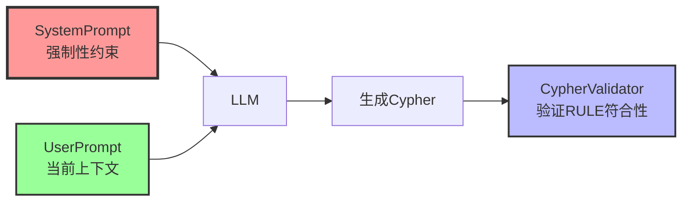

**关键原则：**
- SystemPrompt = Rule(约束) + Introduction(介绍) + Examples(实例)
- UserPrompt = 当前任务数据 + 对SystemPrompt的引用
- 两者合并后一并传给LLM
- CypherValidator验证生成结果是否符合RULE

### 4.6 输出规范层

**动态变量注入：**

```
## 输入上下文
【章节信息】
- 章节标题：{{chapterTitle}}
- 章节索引：{{chapterIndex}}
- 段落索引：{{paragraphIndex}}

【文本内容】
- 前文（上一段）：{{lastContext}}
- 当前行（待分析）：{{indexText}}
- 后文（下一段）：{{nextContext}}

【时间戳基准】
- 当前事件timestamp应为：{{baseTimestamp}}（基于章节索引和段落索引计算）
```

### 4.6 输出规范层

**提示词内容：**

```
## 输出要求

【Cypher生成规则】
1. 只输出Neo4j Cypher语句，不添加任何解释或markdown代码块
2. 如果当前行没有新的可提取信息，返回空字符串
3. 使用MERGE创建Entity避免重复（匹配name和entityType）
4. 使用CREATE创建Event和State（确保唯一性）
5. 所有属性键名使用中文（name、描述、等级等）
6. 所有uuid使用randomUUID()函数生成
7. 所有timestamp使用datetime('{{baseTimestamp}}')函数
8. 严格遵循状态转换的原子化模式（见示例）

【验证自检】
生成Cypher前请自检：
✓ 是否为每个State创建了对应的Event？
✓ 状态转换是否更新了旧State的valid_to_timestamp？
✓ 是否创建了NEXT_STATE关系？
✓ 是否正确转移了CURRENT_STATE关系？
✓ timestamp是否使用了提供的baseTimestamp？
```

### 4.7 示例引导层（Few-shot）

**提示词内容：**

```
## 场景示例

【示例1：角色初次登场（Generation场景）】
输入：
- 当前行："少年名叫萧炎，乃是萧家族长之子。"
- 前文："萧家位于乌坦城。"
- 后文："萧炎今年十五岁。"

输出：
// 创建登场事件
CREATE (e:Event {
  uuid: randomUUID(),
  timestamp: datetime('2025-01-01T00:01:00'),
  eventType: 'Generation',
  source: '第1章 落魄天才 - P1',
  confidence: 1.0,
  description: '萧炎初次登场',
  chapterIndex: 1,
  paragraphIndex: 1
})
// 创建角色实体（使用MERGE避免重复）
MERGE (c:Entity {name: '萧炎', entityType: 'Character'})
ON CREATE SET 
  c.uuid = randomUUID(),
  c.createdAt = datetime('2025-01-01T00:01:00'),
  c.firstMentionChapter = 1,
  c.firstMentionSource = '第1章 落魄天才 - P1'
// 创建初始状态
CREATE (s:State {
  uuid: randomUUID(),
  valid_from_timestamp: datetime('2025-01-01T00:01:00'),
  valid_to_timestamp: null,
  stateType: '身份状态',
  stateValue: '萧家族长之子'
})
// 建立关系
CREATE (e)-[:GENERATES {timestamp: datetime('2025-01-01T00:01:00')}]->(c)
CREATE (e)-[:CREATES_STATE {timestamp: datetime('2025-01-01T00:01:00')}]->(s)
CREATE (c)-[:CURRENT_STATE]->(s)

【示例2：状态转换（Transformation场景）】
输入：
- 当前行："萧炎终于突破至四段斗之气。"
- 前文："萧炎苦修三年，始终停留在三段斗之气。"
- 后文："云岚宗弟子们露出震惊之色。"
- 假设已知萧炎当前状态为"三段斗之气"

输出：
// 查找实体和当前状态
MATCH (c:Entity {name: '萧炎', entityType: 'Character'})-[oldRel:CURRENT_STATE]->(oldState:State)
WHERE oldState.stateType = '境界状态' AND oldState.valid_to_timestamp IS NULL

WITH c, oldRel, oldState

// 创建突破事件
CREATE (e:Event {
  uuid: randomUUID(),
  timestamp: datetime('2025-01-05T00:30:00'),
  eventType: 'Transformation',
  source: '第5章 突破 - P30',
  confidence: 0.95,
  description: '萧炎突破至四段斗之气',
  chapterIndex: 5,
  paragraphIndex: 30
})

// 创建新状态
CREATE (newState:State {
  uuid: randomUUID(),
  valid_from_timestamp: datetime('2025-01-05T00:30:00'),
  valid_to_timestamp: null,
  stateType: '境界状态',
  stateValue: '四段斗之气'
})

// 建立关系
CREATE (e)-[:TRANSFORMS]->(c)
CREATE (e)-[:REQUIRES_STATE {required_condition: 'stateValue=三段斗之气'}]->(oldState)
CREATE (e)-[:CREATES_STATE {timestamp: datetime('2025-01-05T00:30:00')}]->(newState)
CREATE (oldState)-[:NEXT_STATE {transition_event_uuid: e.uuid}]->(newState)
CREATE (c)-[:CURRENT_STATE]->(newState)
CREATE (c)-[:HAS_HISTORICAL_STATE]->(oldState)

// 更新旧状态并解除旧关系
DELETE oldRel
SET oldState.valid_to_timestamp = datetime('2025-01-05T00:30:00')

【示例3：空输出场景】
输入：
- 当前行："天色渐暗。"
- 前文："萧炎走在路上。"
- 后文："他加快了脚步。"

输出：
（返回空字符串，因为无新的实体或状态信息）
```

### 4.8 完整提示词模板

**最终组装的提示词结构：**

```
## 系统角色
{角色定义内容}

## 本体论基础
{本体规范内容}

## 小说场景约束
{场景约束内容}

## 输入上下文
{动态注入章节信息和文本内容}

## 输出要求
{输出规范内容}

## 场景示例
{Few-shot示例}

请开始处理当前输入，严格遵循上述规范生成Cypher语句。
```

## 5. Cypher验证模块设计

### 5.1 验证规则清单

| 规则类别 | 验证项 | 检查逻辑 | 失败处理 |
|---------|-------|---------|---------|
| 语法检查 | Cypher语法正确性 | 正则匹配关键字、括号配对 | 记录错误，跳过执行 |
| 本体约束 | Event必须包含必需属性 | 检查uuid、timestamp、eventType等 | 记录约束违反，跳过执行 |
| 时间一致性 | timestamp格式和顺序 | 验证datetime格式，对比前一事件时间 | 记录时间冲突，跳过执行 |
| 关系完整性 | State必须关联Entity和Event | 检查是否有CURRENT_STATE/CREATES_STATE | 记录缺失关系，跳过执行 |
| 状态链约束 | 转换时必须有NEXT_STATE | 检查Transformation事件的关系完整性 | 记录链断裂，跳过执行 |

### 5.2 验证流程

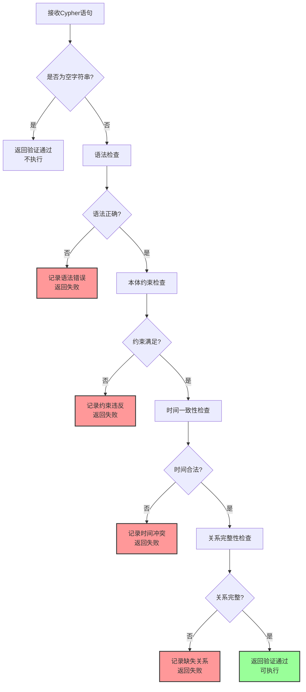

### 5.3 验证规则示例

**时间一致性检查：**
- 验证timestamp格式为ISO 8601标准（如"2025-01-05T00:30:00"）
- 验证当前事件timestamp ≥ 上一个已执行事件的timestamp
- 验证State的valid_from_timestamp = 创建它的Event.timestamp
- 验证状态转换时：oldState.valid_to = newState.valid_from = Event.timestamp

**本体约束检查：**
- Event节点必须包含：uuid、timestamp、eventType、source、confidence
- Entity节点必须包含：uuid、entityType、createdAt、name
- State节点必须包含：uuid、valid_from_timestamp、stateType、stateValue
- eventType必须为枚举值：Generation、Transformation、Observation、Termination

**关系完整性检查：**
- 每个CREATES_STATE关系必须对应一个Event和一个State
- 每个Entity必须至少有一个CURRENT_STATE关系
- Transformation事件必须包含：TRANSFORMS、REQUIRES_STATE、CREATES_STATE、NEXT_STATE关系

## 6. 查询场景设计

### 6.1 核心查询需求

| 查询场景 | 业务价值 | 输入参数 | 输出结果 |
|---------|---------|---------|---------|
| 角色状态历史查询 | 查看角色在某章节的状态 | 角色名、章节索引 | 该章节时角色的所有状态 |
| 技能习得路径查询 | 分析角色技能成长轨迹 | 角色名 | 技能状态的时序列表 |
| 因果链追溯 | 分析某状态的形成原因 | 状态UUID | 导致该状态的事件链 |
| 关系演化查询 | 查看两角色关系变化 | 角色A、角色B | 关系状态的时间线 |
| 章节事件汇总 | 生成章节梗概 | 章节索引 | 该章节所有事件摘要 |

### 6.2 查询语句模板

**查询1：角色在特定章节的状态**

**语义描述：**
获取角色在指定章节结束时的所有状态快照

**Cypher模板：**

```
输入参数：
- characterName: 角色名称（如"萧炎"）
- chapterIndex: 章节索引（如5，表示第5章）

MATCH (c:Entity {name: $characterName, entityType: 'Character'})
      -[:HAS_HISTORICAL_STATE|CURRENT_STATE]->(s:State)
WHERE s.valid_from_timestamp <= datetime('2025-01-' + ($chapterIndex + 1) + 'T23:59:59')
  AND (s.valid_to_timestamp IS NULL 
       OR s.valid_to_timestamp > datetime('2025-01-' + ($chapterIndex + 1) + 'T23:59:59'))
RETURN s.stateType AS 状态类型, 
       s.stateValue AS 状态值,
       s.valid_from_timestamp AS 生效时间
ORDER BY s.stateType

返回示例：
| 状态类型 | 状态值 | 生效时间 |
|---------|--------|---------|
| 境界状态 | 四段斗之气 | 2025-01-05T00:30:00 |
| 技能状态 | 八极崩-初学 | 2025-01-05T12:15:00 |
| 地理状态 | 云岚宗 | 2025-01-05T08:00:00 |
```

**查询2：角色技能习得路径**

**语义描述：**
按时间顺序展示角色掌握技能的完整历史

**Cypher模板：**

```
输入参数：
- characterName: 角色名称

MATCH (c:Entity {name: $characterName, entityType: 'Character'})
      -[:HAS_HISTORICAL_STATE|CURRENT_STATE]->(s:State)
WHERE s.stateType = '技能状态'
OPTIONAL MATCH (s)<-[:CREATES_STATE]-(e:Event)
RETURN s.stateValue AS 技能名称,
       e.timestamp AS 习得时间,
       e.source AS 习得章节,
       e.description AS 事件描述
ORDER BY e.timestamp ASC

返回示例：
| 技能名称 | 习得时间 | 习得章节 | 事件描述 |
|---------|---------|---------|---------|
| 八极崩-初学 | 2025-01-05T12:15:00 | 第5章 初入云岚宗 - P72 | 萧炎从药老处学得八极崩 |
| 焰分噬浪尺 | 2025-01-08T14:30:00 | 第8章 修炼 - P45 | 萧炎创造焰分噬浪尺 |
```

**查询3：状态因果链追溯**

**语义描述：**
追溯某状态的形成过程，包括所有前置条件和触发事件

**Cypher模板：**

```
输入参数：
- stateUUID: 目标状态的UUID

MATCH path = (s:State {uuid: $stateUUID})<-[:CREATES_STATE]-(e:Event)
              -[:REQUIRES_STATE]->(prereqState:State)
OPTIONAL MATCH (prereqState)<-[:CREATES_STATE]-(prereqEvent:Event)
RETURN e.description AS 触发事件,
       e.timestamp AS 发生时间,
       prereqState.stateValue AS 前置条件状态,
       prereqEvent.description AS 前置条件来源事件

返回示例：
| 触发事件 | 发生时间 | 前置条件状态 | 前置条件来源事件 |
|---------|---------|-------------|----------------|
| 萧炎突破至四段斗之气 | 2025-01-05T00:30:00 | 三段斗之气 | 萧炎初次登场 |
```

## 7. 数据库层设计

### 7.1 模块职责划分

**架构原则：**

本系统采用**三层模块架构**，职责清晰分离，符合领域驱动设计（DDD）原则：

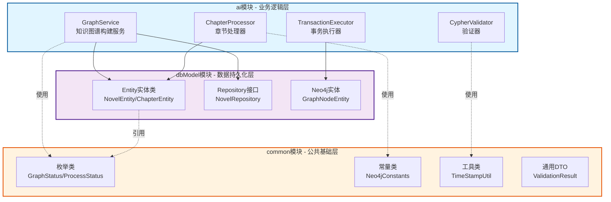

**职责清单：**

| 模块 | 职责范围 | 技术栈 | 对外接口 |
|-----|---------|-------|----------|
| **common** | 枚举、常量、工具类、通用DTO | Java基础库、Lombok | 枚举类、工具类 |
| **dbModel** | 实体类（Entity）、Repository接口、数据访问对象 | Spring Data MongoDB、Lombok | Repository接口 |
| **ai** | 业务逻辑、AI推理、事务管理、Cypher生成验证 | Langchain4j、Neo4j Driver | Service层 |

**依赖关系：**
- ai模块 → 依赖 dbModel模块 + common模块
- dbModel模块 → 依赖 common模块
- common模块 → 无依赖（基础模块）

### 7.2 common模块设计

#### 7.2.1 枚举类定义

**枚举1：GraphStatus（知识图谱构建状态）**

**包路径：** com.shuanglin.enums.GraphStatus

**定义：**

| 枚举值 | 说明 | 使用场景 |
|-------|------|----------|
| PENDING | 待处理 | 新导入的小说，等待开始构建 |
| PROCESSING | 处理中 | 正在进行章节解析和Cypher生成 |
| PAUSED | 已暂停 | 手动暂停或遇到错误后暂停 |
| COMPLETED | 已完成 | 所有章节处理完成 |
| FAILED | 失败 | 构建过程中发生不可恢复错误 |

---

**枚举2：ProcessStatus（段落处理状态）**

**包路径：** com.shuanglin.enums.ProcessStatus

**定义：**

| 枚举值 | 说明 | 使用场景 |
|-------|------|----------|
| SUCCESS | 成功 | Cypher生成并执行成功 |
| VALIDATION_FAILED | 验证失败 | Cypher不符合本体约束 |
| EXECUTION_FAILED | 执行失败 | Neo4j执行Cypher失败 |
| SKIPPED | 跳过 | indexText无新信息，返回空字符串 |
| EMPTY_RESULT | 空结果 | AI返回空字符串（正常情况） |

---

**枚举3：EntityType（实体类型）**

**包路径：** com.shuanglin.enums.EntityType

**定义：**

| 枚举值 | 说明 | 对应Neo4j标签 |
|-------|------|---------------|
| CHARACTER | 角色 | [:Entity:Character] |
| LOCATION | 地点 | [:Entity:Location] |
| ITEM | 物品 | [:Entity:Item] |
| SKILL | 技能 | [:Entity:Skill] |
| ORGANIZATION | 组织 | [:Entity:Organization] |

#### 7.2.2 常量类定义

**常量类1：Neo4jConstants（Neo4j相关常量）**

**包路径：** com.shuanglin.constants.Neo4jConstants

**定义：**

| 常量名 | 类型 | 值 | 说明 |
|-------|------|----|----- |
| NODE_LABEL_EVENT | String | "Event" | 事件节点标签 |
| NODE_LABEL_ENTITY | String | "Entity" | 实体节点标签 |
| NODE_LABEL_STATE | String | "State" | 状态节点标签 |
| REL_GENERATES | String | "GENERATES" | 生成关系 |
| REL_TRANSFORMS | String | "TRANSFORMS" | 转换关系 |
| REL_CURRENT_STATE | String | "CURRENT_STATE" | 当前状态关系 |
| REL_NEXT_STATE | String | "NEXT_STATE" | 状态版本链关系 |

---

**常量类2：TimeConstants（时间相关常量）**

**包路径：** com.shuanglin.constants.TimeConstants

**定义：**

| 常量名 | 类型 | 值 | 说明 |
|-------|------|----|----- |
| BASE_DATE | String | "2025-01-01" | 时间戳基准日期 |
| CHAPTER_OFFSET_DAYS | int | 1 | 每章偏移天数 |
| PARAGRAPH_OFFSET_MINUTES | int | 1 | 每段偏移分钟数 |
| DATETIME_FORMAT | String | "yyyy-MM-dd'T'HH:mm:ss" | ISO 8601格式 |

#### 7.2.3 工具类定义

**工具类1：TimeStampUtil（时间戳生成工具）**

**包路径：** com.shuanglin.utils.TimeStampUtil

**方法定义：**

| 方法签名 | 说明 | 输入参数 | 返回值 |
|---------|------|---------|--------|
| generateBaseTimestamp(int chapterIndex, int paragraphIndex) | 生成事件基准时间戳 | 章节索引、段落索引 | String（ISO 8601格式） |
| parseTimestamp(String timestamp) | 解析时间戳为LocalDateTime | 时间戳字符串 | LocalDateTime |
| getChapterFromTimestamp(String timestamp) | 从时间戳反推章节索引 | 时间戳字符串 | Integer |

**实现逻辑：**
```
生成规则：
  baseDate = "2025-01-01"
  chapterDate = baseDate + (chapterIndex * 1天)
  paragraphTime = chapterDate + (paragraphIndex * 1分钟)
  
示例：
  第5章第30段 → 2025-01-06T00:30:00
  (2025-01-01 + 5天 + 30分钟)
```

---

**工具类2：CypherTemplateUtil（Cypher模板工具）**

**包路径：** com.shuanglin.utils.CypherTemplateUtil

**方法定义：**

| 方法签名 | 说明 | 输入参数 | 返回值 |
|---------|------|---------|--------|
| extractNodeType(String cypher) | 提取Cypher中的节点类型 | Cypher语句 | Set<String> |
| extractRelationType(String cypher) | 提取Cypher中的关系类型 | Cypher语句 | Set<String> |
| validateSyntax(String cypher) | 基础语法校验 | Cypher语句 | boolean |

### 7.3 dbModel模块设计

#### 7.3.0 现有项目结构分析

**已有实体类（保持不变）：**

| 包名 | 实体类 | 用途 | MongoDB集合 |
|-----|---------|------|------------|
| com.shuanglin.dao.Articles | ArticlesEntity | 文章存储 | Articles_store |
| com.shuanglin.dao.message | MessageStoreEntity | 消息存储 | message_store |
| com.shuanglin.dao.milvus | MessageEmbeddingEntity | 消息向量存储 | Milvus向量库 |
| com.shuanglin.dao.model | Model | AI模型配置 | model |

**已有Repository（保持不变）：**

| Repository | 继承 | 特点 |
|-----------|------|------|
| ArticlesEntityRepository | MongoRepository<ArticlesEntity, String> | 标准CRUD |
| MessageStoreEntityRepository | MongoRepository<MessageStoreEntity, String> | 标准CRUD |
| ModelsRepository | MongoRepository<Model, String> | 自定义查询方法 |

**编码规范总结（基于现有代码）：**

```java
// 1. 实体类注解风格（参考MessageStoreEntity）
@Document("collection_name")  // 指定MongoDB集合名
@Data                          // Lombok生成getter/setter
@Builder                       // 生成构建者模式
@AllArgsConstructor           // 生成全参数构造函数
@NoArgsConstructor            // 生成无参数构造函数
public class XxxEntity {
    private String id;         // MongoDB自动生成的_id
    // 其他字段...
}

// 2. Repository接口风格（参考ArticlesEntityRepository）
@Repository
public interface XxxRepository extends MongoRepository<XxxEntity, String> {
    // 自定义查询方法（可选）
}

// 3. Model实体特殊处理（参考Model.java）
@SuperBuilder  // 支持继承的Builder模式
public class Model implements Serializable {
    // 实现Serializable接口
}
```

**新增内容设计原则：**
1. 在`com.shuanglin.dao.neo4j`包下添加知识图谱相关实体
2. 严格遵循现有的注解风格（@Document, @Data, @Builder等）
3. MongoDB集合命名加前缀`kg_`避免冲突（如`kg_novel_metadata`）
4. Repository命名遵循`XxxRepository`规范

#### 7.3.1 实体类设计规范

**通用设计原则：**

| 原则 | 说明 | 示例 |
|-----|------|------|
| 注解驱动 | 使用Lombok简化代码 | @Data、@Builder、@Document |
| 文档映射 | 使用@Document指定MongoDB集合名 | @Document("novel_metadata") |
| 序列化 | 实现Serializable接口 | implements Serializable |
| 时间字段 | 使用LocalDateTime类型 | private LocalDateTime createdAt; |
| 命名规范 | 实体类以Entity结尾 | NovelEntity、ChapterEntity |
| 索引设计 | 使用@Indexed或@CompoundIndex | @Indexed(unique = true) |

**包结构规划（基于现有项目结构扩展）：**

```
com.shuanglin.dao
├── Articles/       # 已有：文章相关实体
│   ├── ArticlesEntity.java
│   └── ArticlesEntityRepository.java
├── message/        # 已有：消息相关实体
│   ├── MessageStoreEntity.java
│   └── MessageStoreEntityRepository.java
├── milvus/         # 已有：向量数据库相关实体
│   ├── MessageEmbeddingEntity.java
│   └── MessageEmbeddingMapper.java
├── model/          # 已有：模型配置相关实体
│   ├── Model.java
│   ├── ModelInfo.java
│   └── ModelsRepository.java
├── neo4j/          # 新增：Neo4j知识图谱相关实体
│   ├── novel/      # 小说元数据
│   │   ├── NovelEntity.java
│   │   ├── NovelRepository.java
│   │   ├── ChapterEntity.java
│   │   └── ChapterRepository.java
│   ├── log/        # 处理日志
│   │   ├── ProcessLogEntity.java
│   │   └── ProcessLogRepository.java
│   └── cache/      # 图节点缓存
│       ├── GraphNodeEntity.java
│       └── GraphNodeRepository.java
├── GroupInfo.java  # 已有：群组信息单例
└── SenderInfo.java # 已有：发送人信息单例
```

**设计原则：**
1. **保持现有结构不变**：不修改已有的Articles、message、milvus、model等包
2. **统一编码规范**：新增实体遵循现有的@Document、@Data、@Builder注解风格
3. **清晰的职责分离**：neo4j包专门存放知识图谱相关实体
4. **避免冲突**：新增实体使用独立的MongoDB集合名称

#### 7.3.2 核心实体类设计

**实体1：NovelEntity（小说元数据）**

**业务语义：** 存储小说的基本信息，用于管理多本小说的知识图谱构建任务

**包路径：** com.shuanglin.dao.neo4j.novel.NovelEntity

**参考现有实体：** 参考MessageStoreEntity、Model的编码风格

**属性定义：**

| 字段名 | 数据类型 | 约束 | 说明 |
|--------|---------|------|------|
| id | String | @Id | MongoDB自动生成的主键 |
| novelName | String | 非空、索引 | 小说名称 |
| author | String | 可选 | 作者名称 |
| filePath | String | 非空 | EPUB文件路径（绝对路径） |
| totalChapters | Integer | 非空 | 总章节数（由FileReadUtil解析） |
| processedChapters | Integer | 默认0 | 已处理章节数 |
| graphStatus | GraphStatus | 枚举 | 构建状态（PENDING/PROCESSING/COMPLETED/FAILED） |
| createdAt | LocalDateTime | 自动生成 | 创建时间 |
| updatedAt | LocalDateTime | 自动更新 | 更新时间 |
| lastProcessedChapterIndex | Integer | 可选 | 最后处理的章节索引（用于断点续传） |
| errorMessage | String | 可选 | 失败原因（graphStatus=FAILED时记录） |

**MongoDB集合配置：**
```java
@Document("kg_novel_metadata")  // 集合名称加kg_前缀避免与现有集合冲突
```

**索引设计：**
```
@Indexed(unique = true) on novelName  # 避免重复导入同一小说
@Indexed on graphStatus               # 支持按状态查询任务
```

---

**实体2：ChapterEntity（章节内容）**

**业务语义：** 存储章节的原始文本和段落分割结果，避免重复解析EPUB文件

**包路径：** com.shuanglin.dao.neo4j.novel.ChapterEntity

**参考现有实体：** 参考MessageStoreEntity的编码风格

**属性定义：**

| 字段名 | 数据类型 | 约束 | 说明 |
|--------|---------|------|------|
| id | String | @Id | MongoDB主键 |
| novelId | String | 非空、索引 | 关联的小说ID（外键） |
| chapterIndex | Integer | 非空、索引 | 章节索引（从1开始） |
| chapterTitle | String | 非空 | 章节标题 |
| paragraphs | List<String> | 非空 | 段落列表（由FileReadUtil解析） |
| totalParagraphs | Integer | 非空 | 总段落数 |
| processedParagraphs | Integer | 默认0 | 已处理段落数 |
| createdAt | LocalDateTime | 自动生成 | 创建时间 |

**MongoDB集合配置：**
```java
@Document("kg_chapter_content")  // 集合名称
```

**索引设计：**
```
@CompoundIndex(def = "{'novelId': 1, 'chapterIndex': 1}", unique = true)
# 确保同一小说的章节索引唯一，支持快速查询特定章节
```

---

**实体3：ProcessLogEntity（处理日志）**

**业务语义：** 记录每个段落的处理结果，用于错误追溯和质量分析

**包路径：** com.shuanglin.dao.neo4j.log.ProcessLogEntity

**参考现有实体：** 参考MessageStoreEntity的编码风格

**属性定义：**

| 字段名 | 数据类型 | 约束 | 说明 |
|--------|---------|------|------|
| id | String | @Id | MongoDB主键 |
| novelId | String | 非空、索引 | 小说ID |
| chapterIndex | Integer | 非空、索引 | 章节索引 |
| paragraphIndex | Integer | 非空 | 段落索引 |
| sourceText | String | 非空 | 原始段落文本（indexText） |
| generatedCypher | String | 可选 | AI生成的Cypher语句（空字符串表示无新信息） |
| processStatus | ProcessStatus | 枚举 | 执行状态（SUCCESS/VALIDATION_FAILED等） |
| validationErrors | String | 可选 | 验证错误信息（JSON格式） |
| executionErrors | String | 可选 | 执行错误信息 |
| processingTime | Long | 非空 | 处理耗时（毫秒） |
| timestamp | LocalDateTime | 自动生成 | 处理时间 |
| baseTimestamp | String | 非空 | 事件基准时间戳（传递给AI的时间戳） |

**MongoDB集合配置：**
```java
@Document("kg_process_log")  // 集合名称
```

**MongoDB集合配置：**
```java
@Document("kg_process_log")  // 集合名称
```

**索引设计：**
```
@CompoundIndex(def = "{'novelId': 1, 'chapterIndex': 1, 'paragraphIndex': 1}", unique = true)
@CompoundIndex(def = "{'processStatus': 1, 'timestamp': -1}")
# 第一个索引：确保唯一性
# 第二个索引：支持错误查询和统计
```

---

**实体4：GraphNodeEntity（图节点缓存）**

**业务语义：** 缓存Neo4j中已存在的节点信息，减少重复查询，提升性能

**包路径：** com.shuanglin.dao.neo4j.cache.GraphNodeEntity

**参考现有实体：** 参考MessageStoreEntity的编码风格

**属性定义：**

| 字段名 | 数据类型 | 约束 | 说明 |
|--------|---------|------|------|
| id | String | @Id | MongoDB主键 |
| nodeType | EntityType | 枚举、索引 | 节点类型（CHARACTER/LOCATION等） |
| nodeName | String | 非空、索引 | 节点名称（如"萧炎"） |
| nodeUuid | String | 非空、唯一索引 | Neo4j中的UUID |
| currentStateUuid | String | 可选 | 当前状态的UUID |
| firstMentionChapter | Integer | 非空 | 首次出现章节 |
| lastUpdatedChapter | Integer | 非空 | 最后更新章节 |
| createdAt | LocalDateTime | 自动生成 | 缓存创建时间 |
| updatedAt | LocalDateTime | 自动更新 | 缓存更新时间 |

**MongoDB集合配置：**
```java
@Document("kg_graph_node_cache")  // 集合名称
```

**MongoDB集合配置：**
```java
@Document("kg_graph_node_cache")  // 集合名称
```

**索引设计：**
```
@CompoundIndex(def = "{'nodeType': 1, 'nodeName': 1}", unique = true)
@Indexed(unique = true) on nodeUuid
# 支持快速判断实体是否已存在，避免重复创建
```

#### 7.3.3 Repository接口设计

**Repository设计原则：**

| 原则 | 说明 | 示例 |
|-----|------|------|
| 继承MongoRepository | 获得标准CRUD方法 | extends MongoRepository<T, String> |
| 命名规范 | 以Repository结尾 | NovelRepository |
| 自定义查询 | 使用方法命名规则或@Query注解 | findByNovelIdAndChapterIndex |
| 事务支持 | 使用@Transactional注解 | 需要时添加 |

**Repository1：NovelRepository**

**包路径：** com.shuanglin.dao.neo4j.novel.NovelRepository

**参考现有Repository：** 参考ArticlesEntityRepository、ModelsRepository的编码风格

**接口定义：**

| 方法签名 | 说明 | 查询条件 |
|---------|------|----------|
| findByGraphStatus(GraphStatus status) | 查询特定状态的小说 | graphStatus = status |
| findByNovelName(String novelName) | 根据小说名称查询（避免重复导入） | novelName = novelName |
| findByGraphStatusIn(List<GraphStatus> statuses) | 查询处理中或失败的小说（用于重试） | graphStatus IN statuses |
| countByGraphStatus(GraphStatus status) | 统计特定状态的小说数量 | graphStatus = status |

---

**Repository2：ChapterRepository**

**包路径：** com.shuanglin.dao.neo4j.novel.ChapterRepository

**参考现有Repository：** 参考ArticlesEntityRepository的编码风格

**接口定义：**

| 方法签名 | 说明 | 查询条件 |
|---------|------|----------|
| findByNovelIdAndChapterIndex(String novelId, Integer chapterIndex) | 查询特定章节 | novelId AND chapterIndex |
| findByNovelIdOrderByChapterIndexAsc(String novelId) | 查询小说所有章节（按索引升序） | novelId ORDER BY chapterIndex |
| existsByNovelIdAndChapterIndex(String novelId, Integer chapterIndex) | 判断章节是否已解析 | novelId AND chapterIndex |
| deleteByNovelId(String novelId) | 删除小说所有章节数据 | novelId = novelId |

---

**Repository3：ProcessLogRepository**

**包路径：** com.shuanglin.dao.neo4j.log.ProcessLogRepository

**参考现有Repository：** 参考MessageStoreEntityRepository的编码风格

**接口定义：**

| 方法签名 | 说明 | 查询条件 |
|---------|------|----------|
| findByNovelIdAndChapterIndexAndParagraphIndex(...) | 查询特定段落的处理日志 | 三个字段精确匹配 |
| findByProcessStatus(ProcessStatus status) | 查询特定状态的处理日志 | processStatus = status |
| countByNovelIdAndProcessStatus(String novelId, ProcessStatus status) | 统计小说的成功/失败段落数 | novelId AND processStatus |
| findByProcessStatusAndTimestampBetween(...) | 查询时间范围内的错误日志 | processStatus AND timestamp范围 |

---

**Repository4：GraphNodeRepository**

**包路径：** com.shuanglin.dao.neo4j.cache.GraphNodeRepository

**参考现有Repository：** 参考ArticlesEntityRepository的编码风格

**接口定义：**

| 方法签名 | 说明 | 查询条件 |
|---------|------|----------|
| findByNodeTypeAndNodeName(EntityType nodeType, String nodeName) | 查询特定实体的缓存 | nodeType AND nodeName |
| existsByNodeTypeAndNodeName(EntityType nodeType, String nodeName) | 判断实体是否已存在 | nodeType AND nodeName |
| findByNodeUuid(String nodeUuid) | 根据UUID查询节点 | nodeUuid = nodeUuid |
| findByLastUpdatedChapterLessThan(Integer chapterIndex) | 查询过期缓存（需要同步） | lastUpdatedChapter < chapterIndex |

### 7.4 ai模块设计

#### 7.4.1 业务逻辑层架构

**GraphService增强架构（集成数据库层）：**

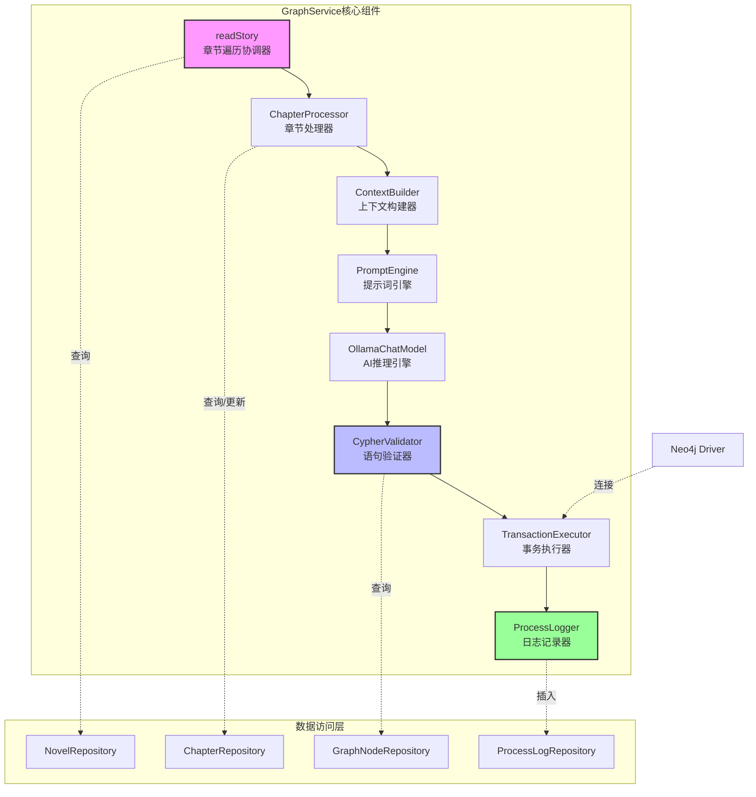

#### 7.4.2 核心业务组件设计

**组件1：NovelTaskManager（小说任务管理器）**

**职责：** 管理小说构建任务的生命周期

**依赖：** NovelRepository、ChapterRepository

**方法定义：**

| 方法签名 | 说明 | 输入 | 输出 |
|---------|------|------|------|
| createNovelTask(String filePath) | 创建新的小说构建任务 | EPUB文件路径 | NovelEntity |
| getPendingTasks() | 获取所有待处理任务 | 无 | List<NovelEntity> |
| updateTaskProgress(String novelId, int processedChapters) | 更新任务进度 | 小说ID、已处理章节数 | void |
| markTaskCompleted(String novelId) | 标记任务完成 | 小说ID | void |
| markTaskFailed(String novelId, String errorMsg) | 标记任务失败 | 小说ID、错误信息 | void |
| pauseTask(String novelId) | 暂停任务 | 小说ID | void |
| resumeTask(String novelId) | 恢复任务 | 小说ID | NovelEntity |

---

**组件2：ChapterProcessor（章节处理器）**

**职责：** 处理单个章节的所有段落，生成和执行Cypher

**依赖：** ChapterRepository、ProcessLogRepository、GraphNodeRepository

**方法定义：**

| 方法签名 | 说明 | 输入 | 输出 |
|---------|------|------|------|
| processChapter(ChapterEntity chapter) | 处理单个章节 | ChapterEntity | ProcessResult |
| processParagraph(ParagraphContext context) | 处理单个段落 | 段落上下文 | CypherResult |
| buildContext(ChapterEntity chapter, int index) | 构建三元组上下文 | 章节、段落索引 | ParagraphContext |
| executeWithRetry(String cypher, int maxRetries) | 带重试的Cypher执行 | Cypher、最大重试次数 | ExecutionResult |

**ParagraphContext数据结构：**

| 字段名 | 类型 | 说明 |
|-------|------|------|
| novelId | String | 小说ID |
| chapterIndex | Integer | 章节索引 |
| paragraphIndex | Integer | 段落索引 |
| lastContext | String | 前文（上一段） |
| indexText | String | 当前行（待分析） |
| nextContext | String | 后文（下一段） |
| baseTimestamp | String | 事件基准时间戳 |

---

**组件3：CypherValidator（Cypher验证器）**

**职责：** 验证AI生成的Cypher是否符合本体约束

**依赖：** GraphNodeRepository、common模块的常量类

**验证规则实现：**

| 验证规则 | 对应RULE | 检查逻辑 |
|---------|---------|----------|
| 节点属性完整性 | RULE-1 | 检查Event/Entity/State必需属性 |
| 关系类型合法性 | RULE-2 | 检查关系类型是否在枚举范围内 |
| 时间戳格式 | RULE-4 | 验证datetime()格式符合ISO 8601 |
| 状态转换原子性 | RULE-3.2 | 检查Transformation事件的11步操作 |
| Entity使用MERGE | RULE-6.1 | 检查Entity节点使用MERGE而非CREATE |
| Event/State使用CREATE | RULE-6.2 | 检查Event/State节点使用CREATE |

**方法定义：**

| 方法签名 | 说明 | 输入 | 输出 |
|---------|------|------|------|
| validate(String cypher) | 验证Cypher | Cypher语句 | ValidationResult |
| checkNodeProperties(String cypher) | 检查节点属性完整性 | Cypher语句 | List<String> errors |
| checkRelationTypes(String cypher) | 检查关系类型合法性 | Cypher语句 | List<String> errors |
| checkTimestampFormat(String cypher) | 检查时间戳格式 | Cypher语句 | List<String> errors |
| checkAtomicTransformation(String cypher) | 检查状态转换原子性 | Cypher语句 | List<String> errors |

---

**组件4：ProcessLogger（处理日志记录器）**

**职责：** 记录每个段落的处理结果到ProcessLogEntity

**依赖：** ProcessLogRepository

**方法定义：**

| 方法签名 | 说明 | 输入 | 输出 |
|---------|------|------|------|
| logSuccess(ParagraphContext ctx, String cypher, long time) | 记录成功处理 | 上下文、Cypher、耗时 | void |
| logValidationFailed(ParagraphContext ctx, ValidationResult result) | 记录验证失败 | 上下文、验证结果 | void |
| logExecutionFailed(ParagraphContext ctx, Exception ex) | 记录执行失败 | 上下文、异常 | void |
| logSkipped(ParagraphContext ctx, String reason) | 记录跳过 | 上下文、原因 | void |
| queryFailedLogs(String novelId) | 查询失败日志 | 小说ID | List<ProcessLogEntity> |

### 7.5 数据库索引策略

**MongoDB索引设计汇总：**

| 集合名 | 索引定义 | 索引类型 | 用途 |
|-------|---------|---------|------|
| novel_metadata | {novelName: 1} | 唯一索引 | 避免重复导入 |
| novel_metadata | {graphStatus: 1} | 普通索引 | 按状态查询任务 |
| chapter_content | {novelId: 1, chapterIndex: 1} | 复合唯一索引 | 查询特定章节 |
| process_log | {novelId: 1, chapterIndex: 1, paragraphIndex: 1} | 复合唯一索引 | 查询段落日志 |
| process_log | {processStatus: 1, timestamp: -1} | 复合索引 | 错误分析和统计 |
| graph_node_cache | {nodeType: 1, nodeName: 1} | 复合唯一索引 | 快速判断实体存在性 |
| graph_node_cache | {nodeUuid: 1} | 唯一索引 | UUID反查 |

**索引性能优化建议：**

1. **读写分离**：process_log为写密集表，考虑使用TTL索引定期清理旧日志
2. **分片策略**：如果单本小说超过10万段落，考虑按novelId分片
3. **缓存预热**：启动时加载graph_node_cache到内存缓存

### 7.6 数据一致性保证

**一致性策略：**

| 场景 | 策略 | 实现方式 |
|-----|------|----------|
| MongoDB与Neo4j一致性 | 最终一致性 | 通过ProcessLogEntity追溯，支持重新同步 |
| 缓存与Neo4j一致性 | 增量同步 | 定时任务同步lastUpdatedChapter变化的节点 |
| 任务状态一致性 | 事务保证 | 使用@Transactional注解确保状态更新原子性 |
| 断点续传一致性 | 幂等性保证 | ProcessLogEntity唯一索引防止重复处理 |

**错误恢复机制：**

1. **任务级恢复**：graphStatus=FAILED的任务，修复错误后可调用resumeTask()重新处理
2. **段落级恢复**：查询processStatus=VALIDATION_FAILED的段落，修复Prompt后重新处理
3. **缓存同步恢复**：定期全量同步Neo4j节点到GraphNodeEntity

### 7.7 实施指南（在现有项目基础上）

#### 7.7.1 步骤一：创建dbModel模块新增实体

**1. 创建neo4j包结构**

```
dbModel/src/main/java/com/shuanglin/dao/
└── neo4j/
    ├── novel/
    │   ├── NovelEntity.java
    │   ├── NovelRepository.java
    │   ├── ChapterEntity.java
    │   └── ChapterRepository.java
    ├── log/
    │   ├── ProcessLogEntity.java
    │   └── ProcessLogRepository.java
    └── cache/
        ├── GraphNodeEntity.java
        └── GraphNodeRepository.java
```

**2. NovelEntity实现示例（参考MessageStoreEntity）**

```java
package com.shuanglin.dao.neo4j.novel;

import com.shuanglin.enums.GraphStatus;  // 引用common模块的枚举
import lombok.AllArgsConstructor;
import lombok.Builder;
import lombok.Data;
import lombok.NoArgsConstructor;
import org.springframework.data.mongodb.core.index.Indexed;
import org.springframework.data.mongodb.core.mapping.Document;

import java.time.LocalDateTime;

@Document("kg_novel_metadata")  // MongoDB集合名
@Data
@Builder
@AllArgsConstructor
@NoArgsConstructor
public class NovelEntity {
    
    private String id;  // MongoDB自动生成的_id
    
    @Indexed(unique = true)
    private String novelName;  // 小说名称（唯一索引）
    
    private String author;
    
    private String filePath;  // EPUB文件路径
    
    private Integer totalChapters;
    
    @Builder.Default
    private Integer processedChapters = 0;
    
    @Indexed
    @Builder.Default
    private GraphStatus graphStatus = GraphStatus.PENDING;  // 使用枚举类型
    
    @Builder.Default
    private LocalDateTime createdAt = LocalDateTime.now();
    
    private LocalDateTime updatedAt;
    
    private Integer lastProcessedChapterIndex;
    
    private String errorMessage;
}
```

**3. NovelRepository实现示例（参考ArticlesEntityRepository）**

```java
package com.shuanglin.dao.neo4j.novel;

import com.shuanglin.enums.GraphStatus;
import org.springframework.data.mongodb.repository.MongoRepository;
import org.springframework.stereotype.Repository;

import java.util.List;
import java.util.Optional;

@Repository
public interface NovelRepository extends MongoRepository<NovelEntity, String> {
    
    // 查询特定状态的小说
    List<NovelEntity> findByGraphStatus(GraphStatus status);
    
    // 根据小说名称查询（避免重复导入）
    Optional<NovelEntity> findByNovelName(String novelName);
    
    // 查询处理中或失败的小说（用于重试）
    List<NovelEntity> findByGraphStatusIn(List<GraphStatus> statuses);
    
    // 统计特定状态的小说数量
    long countByGraphStatus(GraphStatus status);
}
```

#### 7.7.2 步骤二：创建rcommon模块新增枚举和工具类

**1. 创建枚举类（参考MessageType）**

```java
package com.shuanglin.enums;

import lombok.AllArgsConstructor;
import lombok.Getter;

@Getter
@AllArgsConstructor
public enum GraphStatus {
    /** 待处理 */
    PENDING("待处理"),
    /** 处理中 */
    PROCESSING("处理中"),
    /** 已暂停 */
    PAUSED("已暂停"),
    /** 已完成 */
    COMPLETED("已完成"),
    /** 失败 */
    FAILED("失败");
    
    private final String description;
}
```

**2. 创建常量类**

```java
package com.shuanglin.constants;

public class Neo4jConstants {
    
    // 节点标签
    public static final String NODE_LABEL_EVENT = "Event";
    public static final String NODE_LABEL_ENTITY = "Entity";
    public static final String NODE_LABEL_STATE = "State";
    
    // 关系类型
    public static final String REL_GENERATES = "GENERATES";
    public static final String REL_TRANSFORMS = "TRANSFORMS";
    public static final String REL_CURRENT_STATE = "CURRENT_STATE";
    public static final String REL_NEXT_STATE = "NEXT_STATE";
    
    private Neo4jConstants() {
        throw new IllegalStateException("Constant class");
    }
}
```

**3. 创建工具类**

```java
package com.shuanglin.utils;

import java.time.LocalDateTime;
import java.time.format.DateTimeFormatter;

public class TimeStampUtil {
    
    private static final String BASE_DATE = "2025-01-01";
    private static final DateTimeFormatter FORMATTER = 
        DateTimeFormatter.ofPattern("yyyy-MM-dd'T'HH:mm:ss");
    
    /**
     * 生成事件基准时间戳
     * 公式：baseDate + (chapterIndex * 1天) + (paragraphIndex * 1分钟)
     */
    public static String generateBaseTimestamp(int chapterIndex, int paragraphIndex) {
        LocalDateTime baseDateTime = LocalDateTime.parse(BASE_DATE + "T00:00:00", FORMATTER);
        LocalDateTime result = baseDateTime
            .plusDays(chapterIndex)
            .plusMinutes(paragraphIndex);
        return result.format(FORMATTER);
    }
    
    /**解析时间戳*/
    public static LocalDateTime parseTimestamp(String timestamp) {
        return LocalDateTime.parse(timestamp, FORMATTER);
    }
    
    /**从时间戳反推章节索引*/
    public static Integer getChapterFromTimestamp(String timestamp) {
        LocalDateTime baseDateTime = LocalDateTime.parse(BASE_DATE + "T00:00:00", FORMATTER);
        LocalDateTime target = parseTimestamp(timestamp);
        return (int) java.time.temporal.ChronoUnit.DAYS.between(baseDateTime, target);
    }
    
    private TimeStampUtil() {
        throw new IllegalStateException("Utility class");
    }
}
```

#### 7.7.3 步骤三：在ai模块中使用新增的Entity和Repository

**1. 在ai模块的pom.xml中确认依赖（已存在）**

```xml
<!-- ai/pom.xml 中已有的依赖 -->
<dependency>
    <groupId>com.shuanglin</groupId>
    <artifactId>dbModel</artifactId>
    <version>${shuanglin.version}</version>
</dependency>
<dependency>
    <groupId>com.shuanglin</groupId>
    <artifactId>common</artifactId>
    <version>${shuanglin.version}</version>
</dependency>
```

**2. 在GraphService中注入Repository**

```java
package com.shuanglin.bot.service;

import com.shuanglin.dao.neo4j.novel.NovelRepository;
import com.shuanglin.dao.neo4j.novel.ChapterRepository;
import com.shuanglin.dao.neo4j.log.ProcessLogRepository;
import com.shuanglin.dao.neo4j.cache.GraphNodeRepository;
import jakarta.annotation.Resource;
import org.springframework.stereotype.Service;

@Service
public class GraphService {
    
    // 注入新增的Repository
    @Resource
    private NovelRepository novelRepository;
    
    @Resource
    private ChapterRepository chapterRepository;
    
    @Resource
    private ProcessLogRepository processLogRepository;
    
    @Resource
    private GraphNodeRepository graphNodeRepository;
    
    // 现有的Neo4j Driver保持不变
    private static final String NEO4J_URI = "bolt://8.138.204.38:7687";
    // ...其他现有代码
}
```

**3. 创建业务组件（新增类）**

```java
package com.shuanglin.bot.service.graph;  // 新增包

import com.shuanglin.dao.neo4j.novel.NovelEntity;
import com.shuanglin.dao.neo4j.novel.NovelRepository;
import com.shuanglin.enums.GraphStatus;
import jakarta.annotation.Resource;
import org.springframework.stereotype.Component;

import java.util.List;

@Component
public class NovelTaskManager {
    
    @Resource
    private NovelRepository novelRepository;
    
    @Resource
    private ChapterRepository chapterRepository;
    
    /**
     * 创建新的小说构建任务
     */
    public NovelEntity createNovelTask(String filePath) {
        // 1. 解析EPUB文件
        List<FileReadUtil.ParseResult> parseResults = FileReadUtil.readEpubFile(new File(filePath));
        
        // 2. 创建NovelEntity
        NovelEntity novel = NovelEntity.builder()
            .novelName(extractNovelName(filePath))
            .filePath(filePath)
            .totalChapters(parseResults.size())
            .graphStatus(GraphStatus.PENDING)
            .build();
        
        // 3. 保存到MongoDB
        NovelEntity saved = novelRepository.save(novel);
        
        // 4. 批量创建ChapterEntity（可选）
        // ...
        
        return saved;
    }
    
    /**
     * 获取所有待处理任务
     */
    public List<NovelEntity> getPendingTasks() {
        return novelRepository.findByGraphStatus(GraphStatus.PENDING);
    }
    
    // 其他方法...
}
```

#### 7.7.4 步骤四：配置MongoDB索引

**在应用启动时自动创建索引（可选）**

```java
package com.shuanglin.bot.config.initializer;  // 参考MongoDBInitializer

import com.shuanglin.dao.neo4j.novel.NovelEntity;
import jakarta.annotation.PostConstruct;
import org.springframework.data.mongodb.core.MongoTemplate;
import org.springframework.data.mongodb.core.index.Index;
import org.springframework.stereotype.Component;

@Component
public class KnowledgeGraphMongoInitializer {
    
    @Resource
    private MongoTemplate mongoTemplate;
    
    @PostConstruct
    public void initIndexes() {
        // 为NovelEntity创建索引
        mongoTemplate.indexOps(NovelEntity.class)
            .ensureIndex(new Index().on("novelName", org.springframework.data.domain.Sort.Direction.ASC).unique());
        
        mongoTemplate.indexOps(NovelEntity.class)
            .ensureIndex(new Index().on("graphStatus", org.springframework.data.domain.Sort.Direction.ASC));
        
        // 其他索引...
    }
}
```

#### 7.7.5 步骤五：验证和测试

**创建单元测试**

```java
package com.shuanglin.bot.service.graph;

import com.shuanglin.dao.neo4j.novel.NovelEntity;
import com.shuanglin.dao.neo4j.novel.NovelRepository;
import com.shuanglin.enums.GraphStatus;
import org.junit.jupiter.api.Test;
import org.springframework.boot.test.context.SpringBootTest;
import jakarta.annotation.Resource;

import static org.junit.jupiter.api.Assertions.*;

@SpringBootTest
class NovelTaskManagerTest {
    
    @Resource
    private NovelRepository novelRepository;
    
    @Resource
    private NovelTaskManager novelTaskManager;
    
    @Test
    void testCreateNovelTask() {
        // 测试创建任务
        NovelEntity novel = novelTaskManager.createNovelTask("/path/to/novel.epub");
        assertNotNull(novel.getId());
        assertEquals(GraphStatus.PENDING, novel.getGraphStatus());
    }
    
    @Test
    void testGetPendingTasks() {
        // 测试查询待处理任务
        var tasks = novelTaskManager.getPendingTasks();
        assertNotNull(tasks);
    }
}
```

#### 7.7.6 注意事项

**1. MongoDB集合命名冲突预防**
- 所有知识图谱相关集合使用`kg_`前缀
- 与现有集合名（message_store、Articles_store等）分开

**2. 包结构统一**
- 所有Neo4j相关实体放在`com.shuanglin.dao.neo4j`包下
- 不修改现有的Articles、message、milvus等包

**3. 依赖关系**
- common模块：添加GraphStatus、ProcessStatus等枚举
- dbModel模块：添加neo4j包下的实体类和Repository
- ai模块：使用dbModel和common模块提供的功能

**4. 数据库配置**
- 确保application.yaml中已配置MongoDB连接
- 确保Neo4j Driver连接信息正确

**查询4：章节事件汇总**

**语义描述：**
获取指定章节内所有发生的事件，按时间排序

**Cypher模板：**

```
输入参数：
- chapterIndex: 章节索引

MATCH (e:Event)
WHERE e.chapterIndex = $chapterIndex
OPTIONAL MATCH (e)-[r:GENERATES|TRANSFORMS|TERMINATES|OBSERVES]->(entity:Entity)
RETURN e.timestamp AS 事件时间,
       type(r) AS 事件类型,
       e.description AS 事件描述,
       collect(entity.name) AS 涉及实体
ORDER BY e.timestamp ASC

返回示例：
| 事件时间 | 事件类型 | 事件描述 | 涉及实体 |
|---------|---------|---------|---------|
| 2025-01-05T00:01:00 | GENERATES | 云韵登场 | [云韵] |
| 2025-01-05T00:30:00 | TRANSFORMS | 萧炎突破至四段斗之气 | [萧炎] |
| 2025-01-05T12:15:00 | TRANSFORMS | 萧炎学会八极崩 | [萧炎, 八极崩] |
```

### 6.3 查询服务接口设计（未来扩展）

**服务接口表：**

| 接口名称 | HTTP方法 | 路径 | 请求参数 | 响应格式 |
|---------|---------|------|---------|---------|
| 获取角色状态历史 | GET | /api/graph/character/{name}/state | chapterIndex（可选） | JSON数组 |
| 获取技能习得路径 | GET | /api/graph/character/{name}/skills | 无 | JSON数组 |
| 追溯状态因果链 | GET | /api/graph/state/{uuid}/causality | 无 | JSON对象 |
| 获取章节事件汇总 | GET | /api/graph/chapter/{index}/events | 无 | JSON数组 |
| 查询角色关系演化 | GET | /api/graph/relationship | characterA, characterB | JSON数组 |

## 7. 性能优化与扩展性

### 7.1 Neo4j索引策略

**必需索引：**

| 节点类型 | 索引字段 | 索引类型 | 用途 |
|---------|---------|---------|------|
| Entity | name + entityType | 复合唯一索引 | 加速MERGE查询 |
| Entity | uuid | 唯一索引 | 主键查找 |
| Event | timestamp | B树索引 | 时间范围查询 |
| Event | chapterIndex | B树索引 | 章节事件查询 |
| State | valid_from_timestamp | B树索引 | 历史状态查询 |
| State | valid_to_timestamp | B树索引 | 当前状态筛选 |
| State | uuid | 唯一索引 | 主键查找 |

**索引创建语句（供参考）：**

```
创建Entity复合索引：
CREATE CONSTRAINT entity_name_type_unique 
FOR (e:Entity) 
REQUIRE (e.name, e.entityType) IS UNIQUE

创建Event时间索引：
CREATE INDEX event_timestamp_index
FOR (e:Event)
ON (e.timestamp)

创建Event章节索引：
CREATE INDEX event_chapter_index
FOR (e:Event)
ON (e.chapterIndex)

创建State时间索引：
CREATE INDEX state_valid_from_index
FOR (s:State)
ON (s.valid_from_timestamp)

CREATE INDEX state_valid_to_index
FOR (s:State)
ON (s.valid_to_timestamp)
```

### 7.2 批量执行优化

**优化策略：**

| 策略 | 实现方式 | 性能提升 |
|-----|---------|---------|
| 批量提交 | 累积10个段落的Cypher后一次性提交 | 减少网络往返，提升30% |
| 事务合并 | 使用Neo4j事务API包裹多条语句 | 减少事务开销，提升20% |
| 连接池复用 | 配置Driver连接池大小=10 | 避免频繁建连，提升15% |
| 异步执行 | 段落处理与Cypher执行异步解耦 | 提升吞吐量50% |

**批量执行示例逻辑：**

```
数据流：
1. 收集器缓冲区：最多缓存10个段落的Cypher
2. 当缓冲区满或章节结束时，触发批量提交
3. 使用Neo4j Transaction API包裹所有语句
4. 提交成功后清空缓冲区，失败则逐条重试

伪代码逻辑：
cypherBuffer = []
FOR EACH paragraph IN chapter:
    cypher = generateCypher(paragraph)
    IF cypher非空:
        cypherBuffer.add(cypher)
    
    IF cypherBuffer.size == 10 OR isLastParagraph:
        executeBatch(cypherBuffer)
        cypherBuffer.clear()
```

### 7.3 扩展性设计

**未来扩展方向：**

| 扩展点 | 描述 | 实现建议 |
|-------|------|---------|
| 多AI模型支持 | 支持切换不同LLM（GPT、Claude等） | 抽象ChatModel接口，配置化选择 |
| 人工校验流 | 在执行前人工审核Cypher | 引入审核队列，支持approve/reject操作 |
| 实时反馈 | 执行过程可视化进度 | WebSocket推送处理进度和错误信息 |
| 增量更新 | 支持追加新章节而不重新处理全书 | 记录已处理的最大chapterIndex，从下一章开始 |
| 多租户隔离 | 不同小说使用独立图空间 | 引入bookId标签，查询时过滤 |

## 8. 异常处理与监控

### 8.1 异常分类与处理

| 异常类型 | 触发条件 | 处理策略 | 恢复机制 |
|---------|---------|---------|---------|
| AI返回格式错误 | 返回内容包含非Cypher文本 | 记录原始输出，尝试正则清洗，失败则跳过 | 人工审核队列 |
| 本体约束违反 | 缺少必需属性或关系 | 记录违反详情，跳过执行 | 提示词优化反馈 |
| Neo4j连接超时 | 网络故障或服务不可用 | 重试3次（指数退避），失败后暂停处理 | 恢复后从检查点继续 |
| 时间戳冲突 | 后续事件时间早于前序事件 | 记录冲突详情，自动调整时间戳为前序+1秒 | 警告日志通知 |
| 内存溢出 | 超大章节导致上下文过长 | 截断上下文至最大token限制 | 分段处理 |

### 8.2 监控指标

| 指标类别 | 指标名称 | 单位 | 告警阈值 |
|---------|---------|------|---------|
| 处理性能 | 段落处理速度 | 段/秒 | < 0.5段/秒 |
| 处理性能 | 章节平均耗时 | 秒 | > 600秒 |
| 数据质量 | 空输出率 | % | > 50% |
| 数据质量 | 验证失败率 | % | > 10% |
| 系统健康 | Neo4j连接失败次数 | 次 | > 5次/小时 |
| 系统健康 | AI模型响应时间 | 毫秒 | > 5000ms |
| 本体一致性 | 孤儿State数量（无Entity关联） | 个 | > 10个 |
| 本体一致性 | 时间戳倒序事件数量 | 个 | > 0个 |

### 8.3 日志记录规范

**日志级别与内容：**

| 级别 | 场景 | 记录内容 |
|-----|------|---------|
| INFO | 正常处理 | 章节开始/结束、段落索引、生成的Cypher语句摘要 |
| WARN | 可恢复异常 | 验证失败、空输出、时间戳调整 |
| ERROR | 不可恢复异常 | AI返回格式错误、Cypher执行失败、原始文本和错误详情 |
| FATAL | 系统故障 | Neo4j连接失败、内存溢出、处理中断 |

**日志示例：**

```
INFO示例：
[2025-01-15 10:30:00] 开始处理章节：第5章 初入云岚宗（共120段落）
[2025-01-15 10:30:05] 段落5/120 - 生成Cypher：CREATE Event(萧炎突破) -> MERGE Entity(萧炎)
[2025-01-15 10:35:00] 章节处理完成：成功110段，跳过10段（空输出8个，验证失败2个）

WARN示例：
[2025-01-15 10:32:15] 段落35验证失败 - 缺少Event.timestamp属性
   源文本："萧炎走在路上"
   生成Cypher：CREATE (e:Event {uuid: randomUUID(), eventType: 'Observation'})

ERROR示例：
[2025-01-15 10:33:20] AI返回格式错误 - 包含解释文本
   源文本："萧炎突破至四段斗之气"
   AI返回："以下是生成的Cypher：\nCREATE (e:Event {...})"
   错误：应直接返回Cypher，不包含任何前缀
```

## 9. 配置管理设计

### 9.1 系统提示词配置化

**配置存储方式：**

| 配置项 | 存储位置 | 格式 | 动态加载 |
|-------|---------|------|----------|
| 系统提示词模板 | resources/prompt/graph-system-prompt.txt | 纯文本 | 支持 |
| 场景示例库 | resources/prompt/graph-examples.yaml | YAML | 支持 |
| 本体规范 | 直接引用kgKnowlage.md | Markdown | 只读 |
| 验证规则 | application.yaml | YAML | 启动加载 |

**配置项表：**

| 配置键 | 配置值类型 | 默认值 | 说明 |
|-------|-----------|--------|------|
| graph.prompt.template-path | String | classpath:prompt/graph-system-prompt.txt | 系统提示词文件路径 |
| graph.prompt.examples-path | String | classpath:prompt/graph-examples.yaml | 场景示例文件路径 |
| graph.ontology.spec-path | String | file:kgKnowlage.md | 本体规范文档路径 |
| graph.processing.batch-size | Integer | 10 | 批量提交段落数 |
| graph.processing.max-retries | Integer | 3 | Neo4j连接重试次数 |
| graph.validation.enabled | Boolean | true | 是否启用验证模块 |
| graph.validation.strict-mode | Boolean | false | 严格模式（验证失败时中断处理） |
| graph.timestamp.base-date | String | 2025-01-01 | 时间戳基准日期 |
| graph.timestamp.chapter-interval | String | P1D | 章节间隔（ISO 8601 Duration） |
| graph.timestamp.paragraph-interval | String | PT1M | 段落间隔（ISO 8601 Duration） |

### 9.2 Neo4j连接配置

**application.yaml配置示例：**

```yaml
spring:
  neo4j:
    uri: bolt://8.138.204.38:7687
    authentication:
      username: neo4j
      password: Sl123456
    pool:
      max-connection-pool-size: 10
      connection-acquisition-timeout: 30s
      max-connection-lifetime: 1h
      idle-time-before-connection-test: 10s

graph:
  prompt:
    template-path: classpath:prompt/graph-system-prompt.txt
    examples-path: classpath:prompt/graph-examples.yaml
  ontology:
    spec-path: file:d:/project/ai-studio/file/kgKnowlage.md
  processing:
    batch-size: 10
    max-retries: 3
    async-enabled: false
  validation:
    enabled: true
    strict-mode: false
  timestamp:
    base-date: "2025-01-01"
    chapter-interval: P1D
    paragraph-interval: PT1M
```

### 9.3 AI模型配置复用

**使用现有decomposeLanguageModel配置：**

```yaml
langchain4j:
  models:
    ollama:
      url: http://8.138.204.38:11434
      modelName: gemma3:12b
      temperature: 0.8
```

**配置说明：**
- `modelName: gemma3:12b`：使用Gemma 12B模型，平衡性能和准确性
- `temperature: 0.8`：适中的随机性，保证输出多样性同时维持一致性
- 复用现有Bean `decomposeLanguageModel`，无需额外配置

## 10. 实施路线图

### 10.1 增强阶段划分

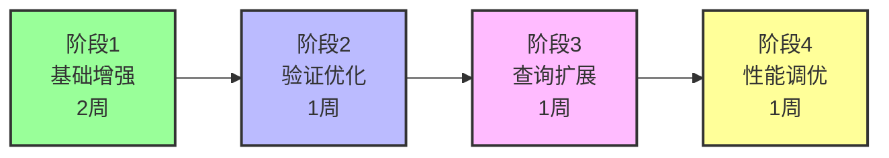

### 10.2 各阶段详细任务

**阶段1：基础增强（2周）**

| 任务 | 交付物 | 优先级 |
|-----|-------|--------|
| 设计并实现增强型系统提示词模板 | graph-system-prompt.txt | P0 |
| 实现PromptEngine组件（提示词动态组装） | PromptEngine.java | P0 |
| 实现ContextBuilder组件（上下文构建） | ContextBuilder.java | P0 |
| 实现时间戳生成策略 | TimestampGenerator.java | P0 |
| 重构GraphService.readStory方法 | GraphService.java（增强版） | P0 |
| 集成kgKnowlage.md本体规范到提示词 | 配置文件 | P1 |
| 编写单元测试 | 测试用例 | P1 |

**核心任务分解：**

1. **系统提示词模板设计**（3天）
   - 基于第4节提示词工程设计，编写完整模板
   - 包含角色定义、本体规范、场景约束、Few-shot示例
   - 支持变量注入（章节信息、上下文、时间戳）
   - 格式化为纯文本文件，放置于resources/prompt/目录

2. **PromptEngine实现**（2天）
   - 读取提示词模板文件
   - 实现变量替换逻辑（lastContext、indexText、nextContext等）
   - 支持动态注入本体规范片段
   - 提供缓存机制避免重复读取文件

3. **时间戳生成策略**（2天）
   - 实现基于章节索引和段落索引的时间计算
   - 配置化base-date、chapter-interval、paragraph-interval
   - 生成ISO 8601标准格式字符串
   - 验证时间单调递增

4. **GraphService重构**（3天）
   - 拆分readStory为多个子方法：processChapter、processParagraph
   - 引入PromptEngine替代硬编码提示词
   - 添加批量提交逻辑（每10个段落提交一次）
   - 完善异常处理和日志记录

**阶段2：验证优化（1周）**

| 任务 | 交付物 | 优先级 |
|-----|-------|--------|
| 实现CypherValidator组件 | CypherValidator.java | P0 |
| 实现本体约束检查规则 | ValidationRule接口及实现类 | P0 |
| 实现时间一致性检查 | TemporalConsistencyRule.java | P0 |
| 实现关系完整性检查 | RelationshipIntegrityRule.java | P1 |
| 集成验证模块到GraphService | GraphService.java（增强版） | P0 |
| 编写验证规则测试用例 | 测试用例 | P1 |

**阶段3：查询扩展（1周）**

| 任务 | 交付物 | 优先级 |
|-----|-------|--------|
| 设计GraphQueryService接口 | GraphQueryService.java | P1 |
| 实现角色状态历史查询 | queryCharacterStateAtChapter() | P1 |
| 实现技能习得路径查询 | querySkillLearningPath() | P1 |
| 实现因果链追溯查询 | queryStateCausality() | P2 |
| 实现章节事件汇总查询 | queryChapterEvents() | P2 |
| 提供REST API接口（可选） | GraphController.java | P3 |

**阶段4：性能调优（1周）**

| 任务 | 交付物 | 优先级 |
|-----|-------|--------|
| 创建Neo4j索引 | 索引创建脚本 | P0 |
| 实现批量执行优化 | BatchExecutor.java | P1 |
| 实现连接池配置优化 | application.yaml配置 | P1 |
| 实现异步处理（可选） | AsyncGraphService.java | P2 |
| 性能压测与调优 | 压测报告 | P1 |
| 编写部署文档 | 部署指南 | P1 |

### 10.3 测试策略

**单元测试覆盖：**

| 测试对象 | 测试场景 | 期望结果 |
|---------|---------|----------|
| PromptEngine | 变量替换正确性 | 所有占位符被正确替换 |
| TimestampGenerator | 时间戳生成逻辑 | 第5章第30段 → 2025-01-06T00:30:00 |
| CypherValidator | 本体约束验证 | 缺少timestamp属性时验证失败 |
| CypherValidator | 时间一致性检查 | 时间戳倒序时验证失败 |
| ContextBuilder | 上下文构建 | 正确提取前文、当前行、后文 |

**集成测试场景：**

| 测试场景 | 测试数据 | 验证点 |
|---------|---------|--------|
| 角色初次登场 | 包含角色首次出现的段落 | 生成Generation事件+Entity+初始State |
| 角色状态转换 | 包含境界突破的段落 | 生成Transformation事件+新State+NEXT_STATE关系 |
| 空段落处理 | 无实体信息的描述性段落 | AI返回空字符串，不执行Cypher |
| 完整章节处理 | 一个完整章节的文本 | 所有段落处理完成，无致命错误 |
| 验证失败场景 | 故意构造缺少属性的Cypher | 验证模块拦截，记录错误日志 |

**端到端测试：**

```
测试目标：处理完整小说的前3章

测试步骤：
1. 准备测试数据：前3章的EPUB文件
2. 执行GraphService.readStory()
3. 验证Neo4j数据库状态：
   - Event节点数 > 0
   - Entity节点数 > 0
   - State节点数 > 0
   - 所有State都有CURRENT_STATE或HAS_HISTORICAL_STATE关系
   - 所有Event都有有效的timestamp
   - 时间戳单调递增
4. 执行查询测试：
   - 查询主角在第2章末的状态
   - 查询第1章的所有事件
   - 追溯某个技能状态的因果链
5. 验证查询结果符合预期
```

## 11. 风险评估与应对

### 11.1 技术风险

| 风险项 | 风险等级 | 影响 | 应对措施 |
|-------|---------|------|----------|
| AI生成质量不稳定 | 高 | 生成的Cypher错误率高，需大量人工校验 | 1. 优化提示词工程<br/>2. 引入人工审核流<br/>3. 记录失败case反馈优化 |
| 本体约束过于严格 | 中 | 大量合理Cypher被拒绝 | 1. 分阶段放松约束<br/>2. 提供宽松模式选项<br/>3. 收集验证失败数据分析 |
| Neo4j性能瓶颈 | 中 | 大规模数据导入缓慢 | 1. 优化索引策略<br/>2. 使用批量导入API<br/>3. 考虑分片存储 |
| 时间戳冲突 | 低 | 同一时间点产生多个事件 | 1. 引入微秒级精度<br/>2. 自动调整冲突时间戳 |
| 状态链断裂 | 中 | 查询历史状态失败 | 1. 验证模块强制检查NEXT_STATE<br/>2. 定期运行完整性检查脚本 |

### 11.2 业务风险

| 风险项 | 风险等级 | 影响 | 应对措施 |
|-------|---------|------|----------|
| 小说文本歧义性 | 高 | AI无法准确抽取实体和关系 | 1. 人工标注关键章节作为训练数据<br/>2. 提供实体词典辅助识别<br/>3. 支持人工修正 |
| 知识图谱粒度不当 | 中 | 过细导致噪音，过粗损失信息 | 1. 配置化实体类型过滤<br/>2. 提供粒度调节参数<br/>3. 多版本对比测试 |
| 处理时间过长 | 中 | 超长小说（>1000章）处理耗时数天 | 1. 实现断点续传<br/>2. 支持并行处理多章节<br/>3. 提供进度展示 |

### 11.3 数据质量风险

| 风险项 | 检测方法 | 修复策略 |
|-------|---------|----------|
| 重复实体（同角色不同别名） | 查询name相似度高的Entity | 提供实体合并工具 |
| 孤儿State（无Entity关联） | 定期执行完整性检查查询 | 自动删除或关联到默认Entity |
| 时间戳倒序 | 验证模块强制检查 | 自动调整为前序+1秒 |
| 状态链循环 | 检测NEXT_STATE关系是否成环 | 断开循环边，记录告警 |

## 12. 附录

### 12.1 术语表

| 术语 | 英文 | 定义 |
|-----|------|------|
| 本体论 | Ontology | 对知识领域的概念、关系和约束的形式化规范 |
| 事件驱动 | Event-Driven | 状态变化由事件触发的建模方式 |
| 状态版本链 | State Version Chain | 实体历史状态按时间顺序连接形成的单向链表 |
| 因果链 | Causality Chain | 通过REQUIRES_STATE关系追溯的事件依赖路径 |
| 时间戳 | Timestamp | ISO 8601标准格式的时间标记（如2025-01-05T00:30:00） |
| Cypher | Cypher | Neo4j图数据库的查询语言 |
| Few-shot学习 | Few-shot Learning | 通过少量示例引导AI完成任务的技术 |
| 滑动窗口 | Sliding Window | 前文+当前行+后文的上下文构建方式 |

### 12.2 参考资源

| 资源类型 | 名称 | 路径/链接 |
|---------|------|----------|
| 本体规范文档 | kgKnowlage.md | d:/project/ai-studio/file/kgKnowlage.md |
| 现有实现 | GraphService.java | ai/src/main/java/com/shuanglin/bot/service/GraphService.java |
| 文件读取工具 | FileReadUtil.java | ai/src/main/java/com/shuanglin/bot/utils/FileReadUtil.java |
| AI模型配置 | ApiModelsConfiguration.java | ai/src/main/java/com/shuanglin/bot/langchain4j/config/ApiModelsConfiguration.java |
| Neo4j官方文档 | Cypher Manual | https://neo4j.com/docs/cypher-manual/current/ |
| Langchain4j文档 | Official Docs | https://docs.langchain4j.dev/ |

### 12.3 示例数据结构

**完整的Event-Entity-State示例（斗破苍穹场景）：**

```
情节：萧炎在第5章第30段突破至四段斗之气

涉及节点：
1. Event节点：
   uuid: "evt-001"
   timestamp: "2025-01-06T00:30:00"
   eventType: "Transformation"
   source: "第5章 初入云岚宗 - P30"
   confidence: 0.95
   description: "萧炎突破至四段斗之气"
   chapterIndex: 5
   paragraphIndex: 30

2. Entity节点（萧炎）：
   uuid: "entity-001"
   entityType: "Character"
   createdAt: "2025-01-02T00:01:00"
   name: "萧炎"
   firstMentionChapter: 1
   firstMentionSource: "第1章 落魄天才 - P1"

3. 旧State节点：
   uuid: "state-001"
   valid_from_timestamp: "2025-01-02T00:01:00"
   valid_to_timestamp: "2025-01-06T00:30:00"（被更新）
   stateType: "境界状态"
   stateValue: "三段斗之气"

4. 新State节点：
   uuid: "state-002"
   valid_from_timestamp: "2025-01-06T00:30:00"
   valid_to_timestamp: null
   stateType: "境界状态"
   stateValue: "四段斗之气"

涉及关系：
1. evt-001 -[:TRANSFORMS]-> entity-001
2. evt-001 -[:REQUIRES_STATE {required_condition: "stateValue=三段斗之气"}]-> state-001
3. evt-001 -[:CREATES_STATE {timestamp: "2025-01-06T00:30:00"}]-> state-002
4. state-001 -[:NEXT_STATE {transition_event_uuid: "evt-001"}]-> state-002
5. entity-001 -[:CURRENT_STATE]-> state-002（新建）
6. entity-001 -[:HAS_HISTORICAL_STATE]-> state-001（新建）
```

### 12.4 Neo4j数据库初始化脚本

**创建约束和索引：**

```
// 创建唯一性约束
CREATE CONSTRAINT entity_name_type_unique IF NOT EXISTS
FOR (e:Entity) REQUIRE (e.name, e.entityType) IS UNIQUE;

CREATE CONSTRAINT entity_uuid_unique IF NOT EXISTS
FOR (e:Entity) REQUIRE e.uuid IS UNIQUE;

CREATE CONSTRAINT event_uuid_unique IF NOT EXISTS
FOR (e:Event) REQUIRE e.uuid IS UNIQUE;

CREATE CONSTRAINT state_uuid_unique IF NOT EXISTS
FOR (s:State) REQUIRE s.uuid IS UNIQUE;

// 创建性能索引
CREATE INDEX event_timestamp_index IF NOT EXISTS
FOR (e:Event) ON (e.timestamp);

CREATE INDEX event_chapter_index IF NOT EXISTS
FOR (e:Event) ON (e.chapterIndex);

CREATE INDEX state_valid_from_index IF NOT EXISTS
FOR (s:State) ON (s.valid_from_timestamp);

CREATE INDEX state_valid_to_index IF NOT EXISTS
FOR (s:State) ON (s.valid_to_timestamp);

CREATE INDEX state_type_index IF NOT EXISTS
FOR (s:State) ON (s.stateType);
```

### 12.5 关键决策记录

| 决策点 | 选项 | 选择 | 理由 |
|-------|------|------|------|
| 时间戳生成策略 | 1. 实际时间<br/>2. 基于章节索引 | 基于章节索引 | 保证可重现性和可预测性，支持按章节查询 |
| Entity匹配策略 | 1. 全部CREATE<br/>2. 全部MERGE | MERGE（基于name+entityType） | 避免同名角色重复创建，但需注意别名问题 |
| 验证失败处理 | 1. 中断处理<br/>2. 跳过继续 | 跳过继续（默认），提供严格模式选项 | 提升容错性，允许部分失败不影响整体 |
| 批量提交大小 | 1. 每段提交<br/>2. 每10段提交<br/>3. 每章提交 | 每10段提交 | 平衡性能和容错粒度 |
| 提示词存储方式 | 1. 硬编码<br/>2. 配置文件 | 配置文件（resources/prompt/） | 便于迭代优化，无需重新编译 |
| AI模型选择 | 1. GPT-4<br/>2. Gemma 12B<br/>3. Qwen | Gemma 12B（复用现有） | 成本可控，性能足够，已有配置 |
