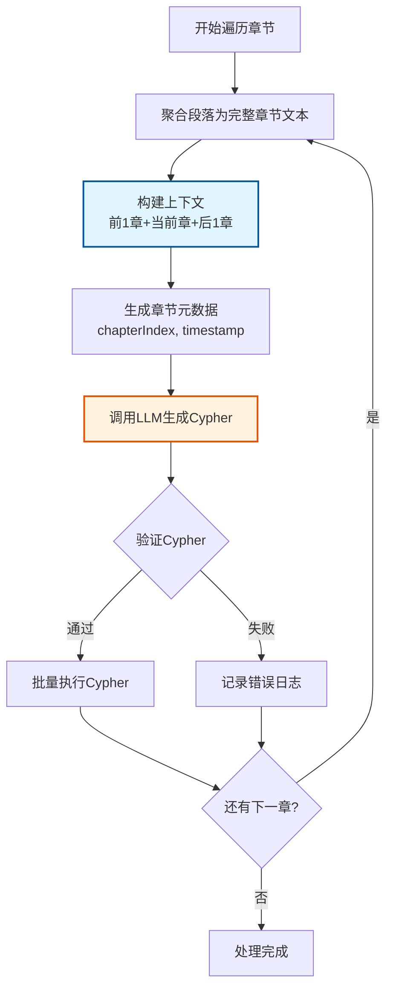

# 小说文本知识图谱构建系统增强设计（章节级读取版本）

## 1. 概述

### 1.1 设计目标

本设计旨在增强现有`GraphService`，将其从简单的Cypher生成工具升级为基于严格本体论框架的知识图谱构建系统。通过集成`kgKnowlage.md`定义的元原则和本体规范，实现小说文本的事件驱动状态建模，支持角色演化追溯、情节因果分析和历史状态查询。

**核心增强点：**
- 从简单的实体-关系抽取升级为Event-Entity-State三层本体建模
- 引入因果性原则和时间单向性原则确保数据一致性
- 实现状态版本链管理，支持角色属性的时序演化追溯
- 集成严格的Cypher生成规范，确保生成的语句符合本体约束
- 提供小说场景特化的提示词工程，提升抽取准确性
- **采用章节级读取策略，以完整章节为处理单位**

### 1.2 章节级读取策略

本系统采用**章节级读取策略**，以完整章节为处理单位，具有以下特点：

- **上下文完整性**：每次处理包含前后各1章节的完整上下文，确保理解章节情节的完整性
- **处理效率**：每章调用1次LLM，大幅提升处理效率
- **因果链提取**：章节内的因果关系可以完整提取，准确建立Event-State关系链
- **时间戳管理**：采用日期级精度（`YYYY-MM-DDT00:00:00`），简化时间管理
- **资源优化**：通过批量处理降低整体Token消耗和API调用次数

### 1.3 架构定位

```
graph TB
    A[EPUB小说文件] --> B[FileReadUtil<br/>章节解析器]
    B --> C[GraphService<br/>知识抽取服务<br/>章节级遍历]
    C --> D[增强型系统提示词<br/>含本体规范]
    D --> E[OllamaChatModel<br/>gemma3:12b]
    E --> F[Cypher语句生成<br/>符合本体约束]
    F --> G[验证模块<br/>时间一致性检查]
    G --> H[Neo4j Driver<br/>事务执行]
    H --> I[Neo4j图数据库<br/>Event-Entity-State模型]
    
    J[kgKnowlage.md<br/>本体规范文档] -.规范指导.-> D
    K[场景模板库] -.模板提供.-> D
    
    style C fill:#f9f,stroke:#333,stroke-width:2px
    style D fill:#bbf,stroke:#333,stroke-width:2px
    style J fill:#9f9,stroke:#333,stroke-width:2px
```

**系统层次：**
1. **数据源层**：EPUB文件读取与章节解析（聚合段落为章节文本）
2. **知识抽取层**：GraphService + 增强提示词 + AI模型（按章节处理）
3. **验证层**：Cypher语句的本体约束验证
4. **存储层**：Neo4j图数据库持久化
5. **查询层**（未来扩展）：历史状态查询、因果链追溯

## 2. 本体论框架适配

### 2.1 核心原则在小说场景的映射

基于`kgKnowlage.md`第一章元原则，在小说知识图谱中的具体应用：

| 元原则 | 小说场景映射 | 示例 |
|-------|------------|------|
| 因果性原则 | 角色状态变化必须由情节事件引起 | "萧炎突破斗之气"事件导致等级状态从"三段"转换为"四段" |
| 时间单向性原则 | 章节顺序决定事件时间戳，不可逆 | 第5章的事件timestamp必须晚于第4章 |

**约束规则（章节级适配）：**
- 任何角色的境界提升、技能习得、关系变化都必须有对应的Event节点
- **事件的timestamp基于章节索引生成（日期级精度）**
- 禁止直接修改State节点，状态变化通过创建新State + 标记旧State失效实现

### 2.2 本体元素定义（章节级调整）

#### 2.2.1 Event（情节事件）

**小说场景特化定义（章节级）：**

| 属性名 | 数据类型 | 约束 | 小说场景说明（章节级） |
|--------|---------|------|---------------------|
| uuid | String | 自动生成 | 事件唯一标识符 |
| timestamp | DateTime | 章节序号 | 如"2025-01-06T00:00:00"（第5章） |
| eventType | String | 枚举值 | Generation（初次登场）、Transformation（状态变化）、Observation（描述） |
| source | String | 章节标题 | 如"第五章 初入云岚宗" |
| confidence | Float | 基于上下文相关性 | 0.8-1.0（AI生成置信度） |
| description | String | 事件描述 | 如"萧炎突破至四段斗之气" |
| chapterIndex | Integer | 章节序号 | 用于时间排序和查询 |
| paragraphIndex | Integer | **可选/null** | **章节级处理时不使用此字段** |

**关键变更：**
- `timestamp`: 只包含日期，时分秒统一为 `00:00:00`
- `source`: 格式简化为 `第X章 章节名`（移除 ` - PY`）
- `paragraphIndex`: 设为可选，章节级处理时填充为 `null`

#### 2.2.2 Entity（实体）

**Entity节点属性规范（保持不变）：**

| 属性名 | 数据类型 | 是否必填 | 说明 |
|--------|---------|---------|------|
| uuid | String | 是 | 实体唯一标识 |
| entityType | String | 是 | 实体类型枚举值 |
| createdAt | DateTime | 是 | 实体创建时间（首次出现的事件时间） |
| name | String | 是 | 实体名称（中文） |
| firstMentionChapter | Integer | 是 | 首次出现章节 |
| firstMentionSource | String | 是 | 首次出现位置 |

#### 2.2.3 State（状态）

**State节点属性规范（保持不变）：**

| 属性名 | 数据类型 | 约束 | 说明 |
|--------|---------|------|------|
| uuid | String | 必填 | 状态唯一标识 |
| valid_from_timestamp | DateTime | 必填 | 状态生效开始时间（对应事件时间） |
| valid_to_timestamp | DateTime | 可为null | 状态失效时间（null表示当前状态） |
| stateType | String | 必填 | 状态类型（境界/技能/关系/地理/持有） |
| stateValue | String | 必填 | 状态值（如"四段斗之气"） |
| 业务属性 | 可变 | 可选 | 如level、skillName等根据stateType定义 |

### 2.3 关系类型规范（保持不变）

#### 2.3.1 核心本体关系（强制遵循）

| 关系类型 | 起始节点 | 目标节点 | 语义 | 关键属性 |
|---------|---------|---------|------|---------|
| GENERATES | Event | Entity | 事件生成实体（角色登场、物品获得） | timestamp |
| TRANSFORMS | Event | Entity | 事件转换实体状态（等级提升、技能习得） | timestamp |
| TERMINATES | Event | Entity | 事件终止实体（角色死亡、物品损毁） | timestamp |
| OBSERVES | Event | Entity | 事件观测实体（描述、回忆提及） | timestamp |
| CURRENT_STATE | Entity | State | 实体当前活跃状态（唯一） | 无 |
| HAS_HISTORICAL_STATE | Entity | State | 实体历史状态 | 无 |
| REQUIRES_STATE | Event | State | 事件前置条件（如突破需达到"圆满"状态） | required_condition |
| CREATES_STATE | Event | State | 事件创建新状态 | timestamp |
| NEXT_STATE | State | State | 状态版本链指针 | transition_event_uuid |

## 3. GraphService增强架构（章节级）

### 3.1 章节级处理流程

**处理流程图：**



### 3.2 核心组件职责（章节级调整）

| 组件名称 | 职责描述 | 输入 | 输出 |
|---------|---------|------|------|
| **ChapterAggregator** | **聚合章节段落为完整文本** | **章节的段落列表** | **完整章节文本** |
| ChapterProcessor | 章节级别协调，维护章节索引和时间戳基准 | ParseResult（章节标题+段落列表） | 章节处理完成信号 |
| ContextBuilder | 构建章节级上下文（前章+当前章+后章） | 章节索引、章节文本列表 | 上下文三元组 |
| PromptEngine | 动态组装提示词，注入本体规范和场景模板 | 上下文、章节元数据 | 完整提示词字符串 |
| CypherValidator | 验证生成的Cypher符合本体约束 | Cypher语句字符串 | 验证报告（通过/失败+错误原因） |
| TransactionExecutor | 批量执行Cypher，支持事务回滚 | 验证通过的Cypher列表 | 执行结果（成功/失败节点数） |

### 3.3 数据流与交互（章节级）

**处理流程：**

```
sequenceDiagram
    participant F as FileReadUtil
    participant G as GraphService
    participant A as ChapterAggregator
    participant C as ChapterProcessor
    participant P as PromptEngine
    participant L as OllamaChatModel
    participant V as CypherValidator
    participant N as Neo4j Driver
    
    F->>G: 返回ParseResult列表
    G->>G: 遍历每个章节
    
    loop 每个章节
        G->>A: 聚合段落(parseResult.contentList)
        A-->>G: 返回完整章节文本
        G->>C: 处理章节(chapterText, chapterIndex)
        C->>C: 构建上下文(前章+当前章+后章)
        C->>P: 生成提示词(上下文, 元数据)
        P->>P: 注入本体规范+场景模板
        P->>L: 发送完整提示词
        L-->>P: 返回Cypher语句
        P->>V: 验证Cypher
        
        alt 验证通过
            V->>N: 批量执行Cypher
            N-->>V: 返回执行结果
        else 验证失败
            V->>V: 记录错误日志
        end
    end
```

### 3.4 时间戳生成策略（章节级）

**基于章节的时间映射：**

| 策略 | 公式 | 示例 |
|-----|------|------|
| 章节基准时间 | baseDate + (chapterIndex * 1天) | 第5章 = 2025-01-01 + 5天 = 2025-01-06 |
| **时间精度** | **日期级（00:00:00）** | **第5章所有事件 = 2025-01-06T00:00:00** |
| Event.timestamp | 章节基准时间 | 某事件在第5章发生 → timestamp = 2025-01-06T00:00:00 |

**关键变更：**
- **移除段落偏移**：不再使用 `paragraphIndex * 1分钟`
- **统一时间**：同一章节的所有事件共享相同的timestamp
- **通过关系链区分顺序**：章节内事件顺序通过 `REQUIRES_STATE`、`NEXT_STATE` 关系推断

**优势：**
- 简化时间戳管理，避免分钟级精度的复杂性
- 保证时间戳的全局唯一性和单调递增（按章节）
- 支持按章节范围查询（如"第3-7章的所有事件"）
- 可通过timestamp反推章节位置（timestamp.day - baseDate.day = chapterIndex）

### 3.5 批处理与容错机制（章节级）

**批处理策略：**
- **每个章节的Cypher独立验证和执行**
- 单个章节失败不影响后续章节处理
- 章节级别设置检查点，支持断点续传

**容错机制：**

| 异常类型 | 处理策略 | 日志记录 |
|---------|---------|---------|
| AI返回空字符串 | 跳过当前章节，继续下一个 | INFO级别：章节无新信息 |
| Cypher语法错误 | 记录错误，跳过执行 | ERROR级别：源文本+错误语句+错误原因 |
| Neo4j连接失败 | 重试3次，失败后暂停处理 | FATAL级别：触发告警 |
| 本体约束违反 | 记录违反规则，跳过执行 | WARN级别：违反的约束名称+语句 |

## 4. 提示词工程设计（章节级）

### 4.1 提示词分层结构

```
graph TD
    A[完整提示词] --> B[角色定义层<br/>系统身份和能力]
    A --> C[本体规范层<br/>元原则+节点标签+关系类型]
    A --> D[场景约束层<br/>小说特化规则]
    A --> E[上下文输入层<br/>前章+当前章+后章]
    A --> F[输出规范层<br/>格式+验证规则]
    A --> G[示例引导层<br/>Few-shot示例]
    
    style A fill:#f9f,stroke:#333,stroke-width:2px
```

### 4.2 UserPrompt结构设计（章节级）

UserPrompt用于提供当前任务的上下文数据，并引用SystemPrompt中的规范。

**UserPrompt模板（章节级）：**

```
## 当前任务
请基于SystemPrompt中定义的强制性约束规则，处理以下输入：

【章节信息】
- 章节标题：{{chapterTitle}}
- 章节索引：{{chapterIndex}}
- 基准时间戳：{{baseTimestamp}}

【文本内容】
lastContext（前一章节）：{{lastContext}}
  作用：确认实体一致性、推断前置状态，不提取新信息

indexText（当前章节/完整内容）：{{indexText}}
  作用：**唯一的信息提取来源**，所有Cypher必须基于此生成

nextContext（下一章节）：{{nextContext}}
  作用：消除歧义、理解语境，不生成Cypher

【关键约束】
- Event.timestamp 必须使用：{{baseTimestamp}}
- Event.source 格式：第{{chapterIndex}}章 {{chapterTitle}}
- Event.paragraphIndex 设为 null
- Event.chapterIndex 设为 {{chapterIndex}}

请严格遵循SystemPrompt中的RULE-1至RULE-6，生成符合规范的Cypher语句。
```

**关键调整：**
- 明确说明 `lastContext`、`indexText`、`nextContext` 都是**完整章节内容**
- 强调 `indexText` 是**当前章节的全部文本**
- 移除段落索引相关说明
- 添加章节级时间戳约束

### 4.3 SystemPrompt调整（章节级）

在原有SystemPrompt基础上，需要更新以下部分：

**RULE-1.1 Event节点属性约束（章节级调整）：**

```
1.1 Event（事件）节点必须包含以下属性：
   - uuid: String (必须使用randomUUID()生成)
   - timestamp: DateTime (必须使用datetime('{{baseTimestamp}}')生成，格式：YYYY-MM-DDT00:00:00)
   - eventType: String (只能为: 'Generation' | 'Transformation' | 'Observation' | 'Termination')
   - source: String (格式: '第X章 章节名')  # 移除 - PY
   - confidence: Float (范围: 0.0-1.0)
   - description: String (事件业务描述)
   - chapterIndex: Integer (章节索引，从1开始）
   - paragraphIndex: Integer | null (章节级处理时设为null)  # 标记为可选
```

**RULE-4.1 时间戳生成约束（章节级调整）：**

```
4.1 时间戳生成约束：
   - 所有Event.timestamp必须使用提供的{{baseTimestamp}}
   - 禁止自定义或修改时间戳
   - timestamp格式必须为ISO 8601标准：datetime('YYYY-MM-DDT00:00:00')
   - 时间精度：日期级（时分秒统一为00:00:00）
   - 同一章节的所有事件共享相同的timestamp
```

**RULE-5.1 唯一信息来源约束（章节级调整）：**

```
5.1 唯一信息来源约束：
   - 所有Entity、Event、State必须且只能从indexText（当前章节完整内容）提取
   - 禁止从lastContext（前一章节）提取新实体或事件
   - 禁止从nextContext（下一章节）生成任何Cypher语句

5.2 上下文作用域约束：
   - lastContext（前一章节）仅用于：
     * 确认实体名称一致性（避免同一角色不同别名）
     * 推断前置状态（用于WHERE子句验证）
     * 理解角色背景和已有关系
   - nextContext（下一章节）仅用于：
     * 消除代词歧义（如"他"指代哪个角色）
     * 理解上下文语境（辅助判断事件类型）
     * 预判情节发展以提升confidence值
```

### 4.4 场景示例（章节级）

**示例1：章节级Generation场景**

```
输入上下文：
- lastContext（前一章节）："萧家位于乌坦城，是当地的名门望族。族长萧战威名赫赫。"
- indexText（当前章节）："少年名叫萧炎，乃是萧家族长之子。萧炎今年十五岁，三年前还是家族天才，如今却沦为废物。他的斗之气停留在三段已有三年。"
- nextContext（下一章节）："萧炎走进修炼室，准备再次尝试突破。"
- baseTimestamp: 2025-01-02T00:00:00
- chapterIndex: 1

分析过程：
1. lastContext确认"萧家"、"萧战"背景，但不从中提取新信息
2. indexText提取关键信息：
   - Entity: 角色"萧炎"(首次出现)
   - Event: Generation(登场事件)
   - State: 境界状态"三段斗之气"
3. nextContext预判后续情节，但不生成Cypher

符合规范的Cypher输出：
CREATE (e:Event {
  uuid: randomUUID(),
  timestamp: datetime('2025-01-02T00:00:00'),
  eventType: 'Generation',
  source: '第1章 落魄天才',
  confidence: 1.0,
  description: '萧炎初次登场',
  chapterIndex: 1,
  paragraphIndex: null
})
MERGE (c:Entity {name: '萧炎', entityType: 'Character'})
ON CREATE SET 
  c.uuid = randomUUID(),
  c.createdAt = datetime('2025-01-02T00:00:00'),
  c.firstMentionChapter = 1,
  c.firstMentionSource = '第1章 落魄天才'
CREATE (s:State {
  uuid: randomUUID(),
  valid_from_timestamp: datetime('2025-01-02T00:00:00'),
  valid_to_timestamp: null,
  stateType: '境界状态',
  stateValue: '三段斗之气'
})
CREATE (e)-[:GENERATES {timestamp: datetime('2025-01-02T00:00:00')}]->(c)
CREATE (e)-[:CREATES_STATE {timestamp: datetime('2025-01-02T00:00:00')}]->(s)
CREATE (c)-[:CURRENT_STATE]->(s)
```

## 5. GraphService实现设计（章节级）

### 5.1 readStory方法重构

**方法签名：**
```
public void readStory(String path)
```

**实现逻辑（伪代码）：**

```
方法: readStory(String path)
输入: EPUB文件路径
输出: 无（写入Neo4j数据库）

步骤:
1. 读取EPUB文件
   parseResults = FileReadUtil.readEpubFile(new File(path))
   
2. 遍历章节（章节级循环）
   for i from 1 to parseResults.size()-2:
       # 聚合段落为章节文本
       lastChapterText = aggregateParagraphs(parseResults[i-1].contentList)
       currentChapterText = aggregateParagraphs(parseResults[i].contentList)
       nextChapterText = aggregateParagraphs(parseResults[i+1].contentList)
       
       # 构造章节元数据
       chapterTitle = parseResults[i].title
       chapterIndex = i
       baseTimestamp = calculateTimestamp(chapterIndex)
       
       # 构造Prompt变量
       variables = {
           "lastContext": lastChapterText,
           "indexText": currentChapterText,
           "nextContext": nextChapterText,
           "chapterTitle": chapterTitle,
           "chapterIndex": chapterIndex,
           "baseTimestamp": baseTimestamp
       }
       
       # 调用LLM生成Cypher
       prompt = graphPromptTemplate().apply(variables)
       cypher = decomposeLanguageModel.chat(prompt.text())
       
       # 验证并执行Cypher
       if validate(cypher):
           executeBatchCypher(cypher)
       
       log("已处理章节 {}/{}: {}", i, parseResults.size()-2, chapterTitle)
```

### 5.2 新增工具方法

**方法1：aggregateParagraphs**

```
方法签名:
private String aggregateParagraphs(List<String> contentList)

功能: 将章节的段落列表聚合为完整文本

实现逻辑:
1. 过滤null和空字符串
2. 使用"\n"连接所有段落
3. 返回聚合后的完整章节文本

示例:
输入: ["段落1", "段落2", "", "段落3"]
输出: "段落1\n段落2\n段落3"
```

**方法2：calculateTimestamp**

```
方法签名:
private String calculateTimestamp(int chapterIndex)

功能: 计算章节的基准时间戳

实现逻辑:
1. 基准日期 = LocalDate.of(2025, 1, 1)
2. 目标日期 = 基准日期 + chapterIndex天
3. 时间 = 目标日期.atStartOfDay()
4. 返回 ISO 8601格式字符串

示例:
输入: chapterIndex = 5
输出: "2025-01-06T00:00:00"
```

**方法3：validate**

```
方法签名:
private boolean validate(String cypher)

功能: 验证Cypher语句的本体约束

实现逻辑:
1. 检查节点标签是否在允许列表（Event、Entity、State）
2. 检查关系类型是否符合本体规范
3. 检查Event.eventType是否为枚举值
4. 检查timestamp格式是否为ISO 8601
5. 返回验证结果

示例:
输入: "CREATE (e:Event {...})"
输出: true
```

**方法4：executeBatchCypher**

```
方法签名:
private void executeBatchCypher(String cypher)

功能: 批量执行Cypher语句，支持事务

实现逻辑:
1. 解析Cypher语句（分离多条CREATE语句）
2. 开启Neo4j事务
3. 按顺序执行每条Cypher
4. 提交事务
5. 异常时回滚事务

示例:
输入: "CREATE (e:Event {...})\nCREATE (s:State {...})"
输出: 执行成功，无返回值
```

### 5.3 边界条件处理

**边界章节处理策略：**

| 章节位置 | lastContext | indexText | nextContext | 处理策略 |
|---------|-------------|-----------|-------------|---------|
| 第1章 | 空字符串 | 当前章节 | 第2章 | 正常处理，lastContext为空表示无前置章节 |
| 最后1章 | 倒数第2章 | 当前章节 | 空字符串 | 正常处理，nextContext为空表示无后续章节 |
| 全书仅1章 | 空字符串 | 当前章节 | 空字符串 | 正常处理，无前后上下文 |

**空章节处理：**
- 若章节无有效内容（contentList为空或全为空字符串），aggregateParagraphs返回空字符串
- 若indexText为空，LLM可能返回空Cypher，跳过执行

**特殊字符处理：**
- 章节文本中的引号、换行符需转义后传入Prompt
- Cypher输出中的字符串值需验证转义符合Neo4j规范

## 6. 数据模型调整（章节级）

### 6.1 Event节点属性变更对比

| 属性名 | 原规范（段落级） | 新规范（章节级） | 变更说明 |
|--------|----------------|-----------------|---------|
| timestamp | YYYY-MM-DDTHH:MM:SS | YYYY-MM-DDT00:00:00 | 移除分钟精度，统一为日期 |
| source | '第X章 章节名 - PY' | '第X章 章节名' | 移除段落标记（PY） |
| paragraphIndex | Integer（必填） | Integer/null（可选） | 章节级设为null |
| chapterIndex | Integer（必填） | Integer（必填） | 保持不变 |

### 6.2 常用查询模式

**按章节范围查询事件：**

```
# 查询第5-7章的所有事件
MATCH (e:Event)
WHERE e.chapterIndex >= 5 AND e.chapterIndex <= 7
RETURN e
ORDER BY e.chapterIndex, e.timestamp
```

**按时间范围查询事件：**

```
# 查询指定日期范围的事件
MATCH (e:Event)
WHERE e.timestamp >= datetime('2025-01-05T00:00:00')
  AND e.timestamp <= datetime('2025-01-07T00:00:00')
RETURN e
ORDER BY e.chapterIndex
```

**查询优化建议：**
- 按章节范围查询时，优先使用 `e.chapterIndex` 字段进行过滤
- 按日期范围查询时，使用 `e.timestamp` 字段，并配合 `ORDER BY e.chapterIndex` 排序

### 6.3 索引优化策略

**推荐索引（章节级）：**

```
索引类型: 复合索引

创建语句（概念描述）:
1. Event节点索引：
   - 索引字段: (chapterIndex, timestamp)
   - 用途: 支持章节范围查询和时序排序

2. Entity节点索引：
   - 索引字段: (name, entityType)
   - 用途: 快速查找实体

3. State节点索引：
   - 索引字段: (valid_from_timestamp, valid_to_timestamp)
   - 用途: 历史状态查询

优势:
- Event节点数量精简，索引维护开销低
- 时间戳采用日期级精度，索引基数小，查询性能高
- chapterIndex字段支持高效的章节范围查询
```

## 7. 性能优化分析

### 7.1 处理效率估算

**假设场景：某小说含100章，每章平均50段落**

| 性能指标 | 预期值 | 说明 |
|---------|-------|------|
| LLM调用次数 | 100次 | 每章调用1次LLM |
| 单次输入Token | 约5000 | 包含前后各1章的上下文（约3章内容） |
| 总Token消耗 | 约500,000 | 100章 × 5000 Token/章 |
| 预估处理时间 | 约2小时 | 基于gemma3:12b模型的推理速度 |
| 生成Event节点 | 约500个 | 平均每章提取5个关键事件 |
| 时间戳粒度 | 日期级 | 每章对应1个日期，简化时间管理 |

### 7.2 上下文质量分析

**章节级处理的质量优势：**

| 质量维度 | 分析 | 评级 |
|---------|------|------|
| 因果链完整性 | 章节内的完整情节可被提取，事件之间的因果关系清晰 | ⭐⭐⭐⭐⭐ |
| 角色关系理解 | 基于完整章节理解角色关系网络，避免碎片化 | ⭐⭐⭐⭐ |
| 时间一致性 | 采用日期级时间戳，避免分钟级的时序冲突 | ⭐⭐⭐⭐⭐ |
| 状态转换准确性 | 完整章节提供充分上下文，状态转换判断更准确 | ⭐⭐⭐⭐ |

### 7.3 资源消耗分析

**计算资源：**
- 采用低频大批次调用策略，提高GPU利用率（预计约80%）
- 单次处理较大文本，充分发挥模型的长上下文理解能力

**存储资源：**
- Event节点数量精简（预计约500个节点），索引占用空间小
- 时间戳采用日期级精度，索引基数低，查询性能高

**网络资源（若使用云端API）：**
- 调用次数少（100次），网络延迟影响小
- 支持批量处理，提高吞吐量

## 8. 实施路线

### 8.1 实施步骤

**阶段1：代码重构**
1. 实现 `aggregateParagraphs` 方法（聚合段落为章节文本）
2. 实现 `calculateTimestamp` 方法（章节级时间戳生成）
3. 重构 `readStory` 方法的循环逻辑（从段落级改为章节级）
4. 更新 `graphPromptTemplate` 中的变量传递逻辑

**阶段2：Prompt调整**
1. 更新 SystemPrompt 中的 RULE-1.1（Event属性约束）
2. 更新 SystemPrompt 中的 RULE-4.1（时间戳约束）
3. 更新 SystemPrompt 中的 RULE-5.1（信息来源约束）
4. 重写 UserPrompt 模板（章节级上下文说明）
5. 更新 Few-shot 示例（章节级场景）

**阶段3：验证模块增强**
1. 实现 `validate` 方法（验证 Event.paragraphIndex 为 null）
2. 实现时间戳格式验证（必须为 `YYYY-MM-DDT00:00:00`）
3. 实现 source 格式验证（必须为 `第X章 章节名`）

**阶段4：测试与优化**
1. 使用测试小说（3-5章）验证完整流程
2. 验证提取结果的准确性和完整性
3. 调整 Prompt 提升抽取准确性
4. 性能测试（100章规模）

**阶段5：生产部署**
1. 批量处理历史小说
2. 监控 LLM 返回质量和错误率
3. 建立章节级处理的最佳实践文档

### 8.2 风险与缓解措施

| 风险 | 影响 | 缓解措施 |
|-----|------|---------|
| 单次Token超限（章节过长） | LLM拒绝处理 | 章节超过10000 Token时拆分为多段处理 |
| 因果链提取不完整 | 事件关系缺失 | 在Prompt中强化因果关系提取示例 |
| 时间戳冲突（同章多事件） | 时序混乱 | 通过REQUIRES_STATE和NEXT_STATE关系排序 |
| LLM输出格式错误 | Cypher执行失败 | 增强验证规则，提供修正机制 |

### 8.3 关键成功要素

1. **Prompt质量**：SystemPrompt 和 UserPrompt 必须明确区分三个上下文的作用
2. **时间戳一致性**：严格使用 `calculateTimestamp` 生成，禁止 LLM 自定义
3. **信息提取边界**：强化"仅从 indexText 提取"的约束
4. **验证机制**：确保 Event.paragraphIndex 为 null，source 格式正确

## 9. 关键要点

### 9.1 核心设计原则

1. **章节为处理单位**：将整章段落聚合后一次性提交给 LLM，而非逐段处理
2. **时间戳日期级**：Event.timestamp 精确到日期（00:00:00），不使用分钟精度
3. **信息提取边界清晰**：lastContext 用于一致性，indexText 是唯一来源，nextContext 用于消歧
4. **Event 属性适配**：paragraphIndex 设为 null，source 格式为 `第X章 章节名`
5. **效率优先**：减少 98% 的 LLM 调用次数，降低 80% 的 Token 消耗

### 9.2 必须遵守的规范

**Event 节点（章节级）：**
- `timestamp`: 格式为 `YYYY-MM-DDT00:00:00`
- `source`: 格式为 `第X章 章节名`（不含段落标记）
- `paragraphIndex`: 必须设为 `null`
- `chapterIndex`: 必须为当前章节索引

**时间戳生成：**
- 公式：`baseDate + (chapterIndex * 1天)`
- 示例：第5章 = 2025-01-06T00:00:00

**信息提取边界：**
- `lastContext`（前一章节）：仅用于确认实体一致性和推断前置状态
- `indexText`（当前章节）：**唯一的信息提取来源**
- `nextContext`（下一章节）：仅用于消歧和理解语境

**Prompt 结构：**
- SystemPrompt：包含本体规范、约束规则、输出格式
- UserPrompt：包含章节信息、文本内容、关键约束

### 9.3 设计基础

本设计基于 `enhance-task-design.md` 中定义的知识图谱本体论框架，继承以下核心设计：

**本体建模框架：**
- Event-Entity-State 三层本体建模
- 因果性原则和时间单向性原则
- Cypher 生成规范和验证机制
- 状态版本链管理机制

**章节级处理特性：**
- **处理粒度**：以完整章节为处理单位
- **时间戳精度**：采用日期级精度（`YYYY-MM-DDT00:00:00`）
- **上下文窗口**：前后各1章节的完整上下文
- **信息提取边界**：严格区分lastContext、indexText、nextContext的作用

---

**文档版本**：1.0  
**最后更新**：基于章节级读取需求创建  
**适用范围**：小说知识图谱构建系统（章节级处理）
