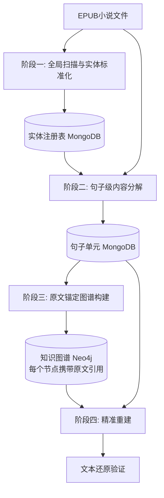
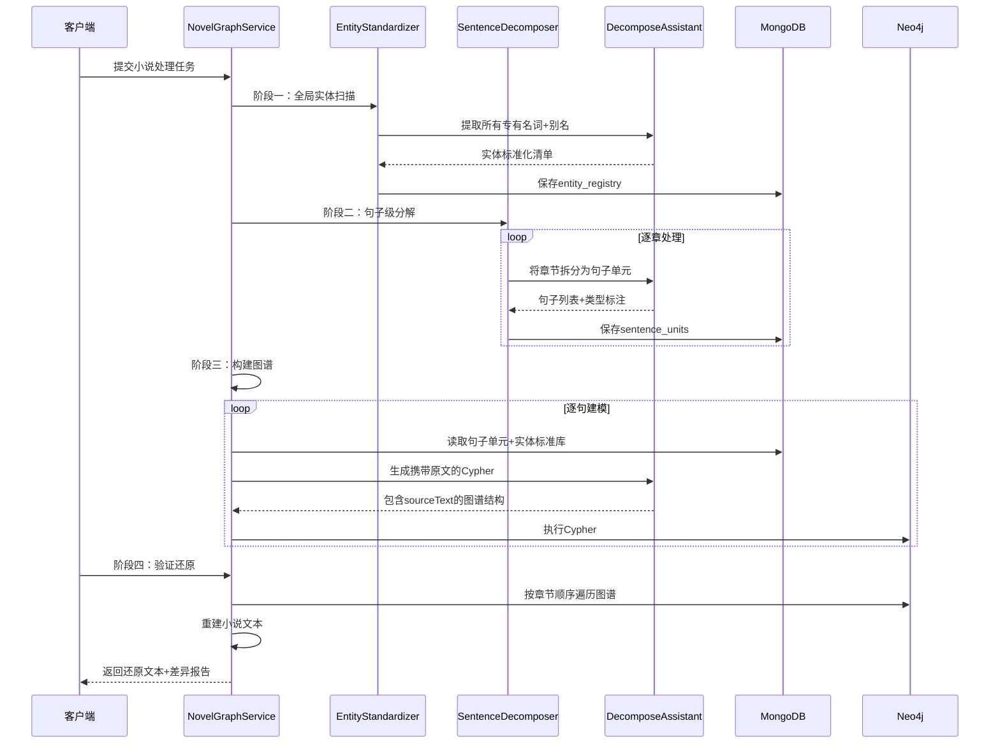
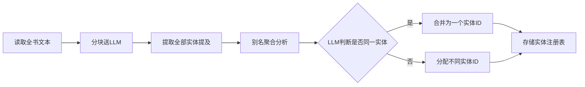
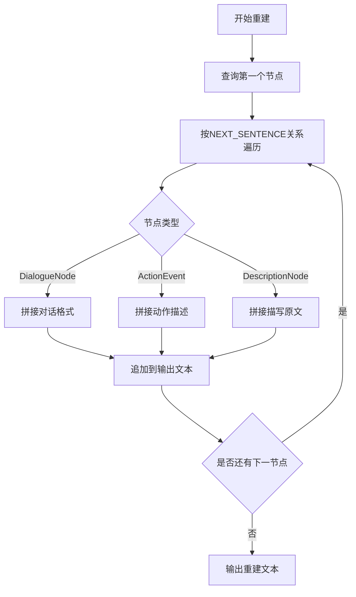

# 小说精准还原知识图谱构建工作流设计

## 重要说明：新增字段和关系清单

**设计原则**：本设计严格遵循您在`com.shuanglin.dao.neo4j.novel`包中已定义的实体类结构。以下是完整的新增组件清单。

### 现有设计复用清单

以下组件**完全复用**现有设计，不修改任何字段：

**节点类型**：
- EntityNode：uuid, name, entityType, createdAtChapter
- CharacterNode (extends EntityNode)：alias
- LocationNode (extends EntityNode)：locationType
- OrganizationNode (extends EntityNode)：orgType
- ItemNode (extends EntityNode)：itemType
- SkillNode (extends EntityNode)：skillType
- EventNode：uuid, chapterIndex, eventType, description, sourceText, isImplicit, confidence, source
- StateNode：uuid, chapterIndex, stateType, stateValue, description
- ChapterNode：chapterIndex, name, summary
- SummaryNode：uuid, summaryType, content, startChapter, endChapter, source

**关系类型**：
- HAS_CONTENT, HAS_STATE, NEXT_STATE, PARTICIPATES_IN, OCCURRED_IN, TRIGGERED_BY, POSSIBLY_IDENTICAL, SUMMARIZES_ENTITY, COVERS_CHAPTERS

**枚举类型**：
- EntityType, EventType, StateType, LocationType, OrganizationType, ItemType, SkillType, SummaryType, RelationshipTypeEnum

### 新增组件清单

为实现精准还原功能，新增以下组件：

**新节点类型（5个）**：
1. **DialogueNode**：uuid, chapterIndex, sequenceNumber, sourceText, speaker, content, tone, bookUuid, mongoDocId
2. **ActionEvent**：uuid, chapterIndex, sequenceNumber, sourceText, verb, manner, bookUuid, mongoDocId
3. **DescriptionNode**：uuid, chapterIndex, sequenceNumber, sourceText, descriptionType, target, bookUuid, mongoDocId
4. **ThoughtNode**：uuid, chapterIndex, sequenceNumber, sourceText, thinker, content, bookUuid, mongoDocId
5. **NarrationNode**：uuid, chapterIndex, sequenceNumber, sourceText, narrativeType, bookUuid, mongoDocId

**核心新增字段说明**：
- `sequenceNumber` (Integer)：全局顺序号，用于精确还原句子顺序
- `sourceText` (String)：完整原文，用于零损失保存
- `mongoDocId` (String)：关联MongoDB sentence_units集合的文档ID

**新关系类型（7个）**：
1. **NEXT_SENTENCE**：连接所有句子级节点，形成线性链（属性：sequenceNumber）
2. **SPEAKS**：Entity→DialogueNode（属性：sequenceNumber）
3. **PERFORMS**：Entity→ActionEvent（属性：sequenceNumber）
4. **TARGETS**：ActionEvent→Entity（无属性）
5. **DESCRIBES**：DescriptionNode→Entity（无属性）
6. **THINKS**：Entity→ThoughtNode（属性：sequenceNumber）
7. **NARRATES**：Chapter→NarrationNode（属性：sequenceNumber）

**新增枚举类（3个）**：
1. **SentenceType**：DIALOGUE, ACTION, DESCRIPTION, THOUGHT, STATE_CHANGE, NARRATION
2. **DescriptionType**：ENVIRONMENT, APPEARANCE, EMOTION, SCENE
3. **NarrationType**：TIME_TRANSITION, SCENE_CHANGE, EXPLANATION, SUMMARY

---

## 一、核心设计原则

### 1.1 精准还原目标

**设计理念**：知识图谱不是小说的"摘要"或"索引"，而是小说内容的**结构化镜像**，要求：

- **完整性**：每一句对话、每一个动作、每一次状态变化都必须有对应的图谱节点或关系
- **精确性**：原文说"萧炎击败了对手"，图谱不能简化为"萧炎战斗"，必须保留"击败"和"对手"的完整语义
- **可还原性**：从图谱遍历任意路径，都能重建出原文的语义和叙述顺序
- **零损失**：所有原文细节（包括语气、情感、环境描写）都要通过节点属性或关系属性保存

### 1.2 精准还原的设计目标

新架构采用"句子级精准建模"策略，确保信息零损失：

**目标1：完整保留对话细节**
- 设计方案：为每句对话创建独立的DialogueNode节点，保存完整原文
- 实现效果：对话的具体内容、语气、情感变化全部保留在图谱中
- 正向示例：原文"萧炎冷笑道：'三十年河东，三十年河西，莫欺少年穷！'"在图谱中对应：
  ```
  DialogueNode {
    speaker: "萧炎",
    content: "三十年河东，三十年河西，莫欺少年穷！",
    tone: "冷笑",
    sourceText: "萧炎冷笑道：'三十年河东，三十年河东，莫欺少年穷！'"
  }
  ```

**目标2：精确记录叙述顺序**
- 设计方案：为每个句子级节点赋予全局sequenceNumber，通过NEXT_SENTENCE关系形成线性链
- 实现效果：可以精确还原"先说后做"或"先做后说"的叙述逻辑
- 正向示例：原文"萧炎抽出玄重尺，然后一跃而起"在图谱中对应：
  ```
  ActionEvent1 { verb: "抽出", object: "玄重尺", sequenceNumber: 100 }
  ActionEvent2 { verb: "一跃而起", sequenceNumber: 101 }
  (ActionEvent1)-[:NEXT_SENTENCE {sequenceNumber: 101}]->(ActionEvent2)
  ```

**目标3：完整建模描写性内容**
- 设计方案：引入DescriptionNode节点类型，专门存储环境、心理、外貌等描写
- 实现效果：图谱既有"骨架"（事件链），也有"血肉"（氛围、情感、细节）
- 正向示例：原文"云岚宗坐落在云雾缭绕的山巅，宫殿雕梁画栋，气势恢宏"在图谱中对应：
  ```
  DescriptionNode {
    descriptionType: "environment",
    target: "云岚宗",
    sourceText: "云岚宗坐落在云雾缭绕的山巅，宫殿雕梁画栋，气势恢宏",
    sequenceNumber: 205
  }
  (DescriptionNode)-[:DESCRIBES]->(Entity:Organization {name: "云岚宗"})
  ```

### 1.3 新架构设计目标

建立四阶段工作流，实现从小说到图谱的**无损映射**：

1. **阶段一：全局扫描与实体标准化** - 建立全书实体唯一标识体系，确保同一实体在全书中只有一个UUID
2. **阶段二：细粒度内容分解与建模** - 将小说按句子级拆解，为每句话建立对应的图谱结构
3. **阶段三：原文锚定与图谱融合** - 所有节点和关系都携带原文引用，支持双向溯源
4. **阶段四：精准重建与验证** - 提供从图谱反向生成小说文本的能力，验证还原精度

## 二、系统架构设计

### 2.1 整体架构视图



### 2.2 数据流设计



## 三、阶段设计详解

### 3.1 阶段一：全局扫描与实体标准化

#### 3.1.1 设计目标

- 建立全书实体的**唯一身份证**系统，确保同一角色/地点/组织在全书只有一个UUID
- 识别所有别名、称号、化名，建立别名映射表
- 过滤泛指词（如"黑衣人"、"老者"），仅保留可全局识别的专有名词

**与原设计的核心差异**：
- 原设计：轻量级扫描，仅提取主要实体名称
- 新设计：**强制全量扫描**，包括所有出场角色、次要人物、一次性配角，不遗漏任何实体

#### 3.1.2 处理流程



#### 3.1.3 实体注册表数据模型

MongoDB集合：`entity_registry`

| 字段名称 | 类型 | 说明 | 示例 |
|---------|------|------|------|
| entityId | String | 全局唯一标识符（对应Neo4j中Entity.uuid） | "CHAR_001" |
| standardName | String | 标准名称（首次出场名） | "萧炎" |
| aliases | List<String> | 所有别名（对应CharacterNode.alias） | ["岩钙", "萧家三少爷", "炎帝"] |
| entityType | String | 实体类型（对应EntityType枚举） | "Character" |
| firstMentionChapter | Integer | 首次出现章节（对应EntityNode.createdAtChapter） | 1 |
| bookUuid | String | 所属书籍 | "uuid-xxx" |

**映射关系**：
- `entity_registry.entityId` ↔ `EntityNode.uuid` （必须一致）
- `entity_registry.entityType` → 对应Java枚举 `com.shuanglin.dao.neo4j.novel.enums.EntityType`
- `entity_registry.aliases` → 对应 `CharacterNode.alias` 字段（仅Character类型）

### 3.2 阶段二：细粒度内容分解与建模

#### 3.2.1 设计目标

将小说按**句子级**拆解，为每句话建立对应的图谱结构，确保：

1. **每句对话都是一个节点**，包含完整原文
2. **每个动作都是一个事件**，带有动作主体、客体、方式等完整信息
3. **每个描写都是一个Description节点**，保留完整的描写文本
4. **保持绝对顺序**：为每句赋予sequenceNumber，保证可以按原文顺序重建

**与原设计的核心差异**：
- 原设计：以章节为单位，一次性提取整章事件
- 新设计：**以句子为单位**，逐句分类和建模，不丢失任何细节

#### 3.2.2 句子类型分类

将小说内容划分为6种基本单元：

| 类型 | 说明 | 示例 | 图谱表现 |
|------|------|------|----------|
| Dialogue | 角色对话 | "萧炎道：'三十年河东..."' | DialogueNode |
| Action | 角色动作 | "萧炎抽出玄重尺" | ActionEvent |
| Description | 环境/外貌描写 | "云岚宗坐落在山巅..." | DescriptionNode |
| Thought | 心理活动 | "萧炎暗暗决定..." | ThoughtNode |
| StateChange | 状态变化 | "萧炎的修为突破到斗师" | StateTransition |
| Narration | 叙述性说明 | "三天后..." | NarrationNode |

#### 3.2.3 句子单元数据模型

MongoDB集合：`sentence_units`

| 字段名称 | 类型 | 说明 |
|---------|------|------|
| sentenceId | String | 句子唯一ID |
| bookUuid | String | 所属书籍 |
| chapterIndex | Integer | 所属章节 |
| sequenceNumber | Integer | 全局顺序号（从1开始递增） |
| sentenceType | String | 句子类型 |
| originalText | String | 完整原文 |
| entities | List<String> | 涉及的实体ID列表 |
| structuredData | JSON | 结构化数据（对话的speaker/content，动作的subject/verb/object） |

#### 3.2.4 LLM提示词设计

**System Prompt扩展**（kgKnowlage.md新增章节）：

```
# 第八章：句子级内容分解规范

## 8.1 分解原则

1. **精准边界**：每句话以句号、问号、叹号、分号为分隔
2. **对话完整性**：对话引号内的所有内容为一个单元，不拆分
3. **动作原子性**：一个动词为一个动作单元
4. **描写完整性**：连续的描写性句子可合并为一个描写单元

## 8.2 结构化抽取规则

### 8.2.1 Dialogue类型

输出结构：
```json
{
  "speaker": "说话人实体ID",
  "content": "对话原文",
  "tone": "语气描述（冷笑/愤怒/平静）",
  "addressee": "听话人实体ID"
}
```

### 8.2.2 Action类型

输出结构：
```json
{
  "subject": "动作主体实体ID",
  "verb": "动词原文",
  "object": "动作客体实体ID或名词",
  "manner": "动作方式描述"
}
```
```

**User Prompt示例**：

输入参数：
- chapterText: 当前章节文本
- entityRegistry: 实体注册表JSON

输出要求：
- 返回JSON数组，每个元素为一个句子单元
- 包含：sentenceType, originalText, entities, structuredData

### 3.3 阶段三：原文锚定与图谱融合

#### 3.3.1 设计目标

将句子单元转化为Neo4j图谱，确保：

1. **每个节点都携带原文**：sourceText字段保存完整原文
2. **每个关系都有顺序号**：sequenceNumber属性保证可按原文顺序遍历
3. **所有实体引用标准化**：使用entity_registry中的entityId
4. **支持双向溯源**：从图谱到原文，从原文到图谱

#### 3.3.2 新节点类型设计

以下节点类型为精准还原功能新增，所有字段均未在现有com.shuanglin.dao.neo4j.novel包中定义。

**DialogueNode（对话节点）**

```cypher
(:DialogueNode {
  uuid: String,              // 全局唯一标识
  chapterIndex: Integer,      // 所属章节
  sequenceNumber: Integer,    // 全局顺序号（核心字段）
  sourceText: String,         // 完整原文
  speaker: String,            // 说话人实体ID
  content: String,            // 对话内容
  tone: String,               // 语气描述
  bookUuid: String,           // 所属书籍
  mongoDocId: String          // 关联sentence_units的ID
})
```

**ActionEvent（动作事件）**

```cypher
(:ActionEvent {
  uuid: String,              // 全局唯一标识
  chapterIndex: Integer,      // 所属章节
  sequenceNumber: Integer,    // 全局顺序号（核心字段）
  sourceText: String,         // 完整原文
  verb: String,               // 动词
  manner: String,             // 动作方式
  bookUuid: String,           // 所属书籍
  mongoDocId: String          // 关联sentence_units的ID
})
```

注意：该ActionEvent与EventNode是不同的节点类型。EventNode用于章节级事件抽象，ActionEvent用于句子级动作记录。

**DescriptionNode（描写节点）**

```cypher
(:DescriptionNode {
  uuid: String,                  // 全局唯一标识
  chapterIndex: Integer,          // 所属章节
  sequenceNumber: Integer,        // 全局顺序号（核心字段）
  sourceText: String,             // 完整原文
  descriptionType: String,        // 描写类型："environment"/"appearance"/"emotion"
  target: String,                 // 被描写的实体ID
  bookUuid: String,               // 所属书籍
  mongoDocId: String              // 关联sentence_units的ID
})
```

**ThoughtNode（心理活动节点）**

```cypher
(:ThoughtNode {
  uuid: String,              // 全局唯一标识
  chapterIndex: Integer,      // 所属章节
  sequenceNumber: Integer,    // 全局顺序号（核心字段）
  sourceText: String,         // 完整原文
  thinker: String,            // 思考者实体ID
  content: String,            // 心理活动内容
  bookUuid: String,           // 所属书籍
  mongoDocId: String          // 关联sentence_units的ID
})
```

**NarrationNode（叙述节点）**

```cypher
(:NarrationNode {
  uuid: String,                  // 全局唯一标识
  chapterIndex: Integer,          // 所属章节
  sequenceNumber: Integer,        // 全局顺序号（核心字段）
  sourceText: String,             // 完整原文
  narrativeType: String,          // 叙述类型："time_transition"/"scene_change"/"explanation"
  bookUuid: String,               // 所属书籍
  mongoDocId: String              // 关联sentence_units的ID
})
```

#### 3.3.3 关系设计

以下关系类型为精准还原功能新增。

**NEXT_SENTENCE（顺序关系）**

连接所有类型的节点，形成全书的线性叙述链：

```cypher
(sentence1)-[:NEXT_SENTENCE {sequenceNumber: N}]->(sentence2)
```

关系属性：
- sequenceNumber: Integer

**SPEAKS（说话关系）**

```cypher
(character:Entity)-[:SPEAKS {sequenceNumber: N}]->(dialogue:DialogueNode)
```

关系属性：
- sequenceNumber: Integer

**PERFORMS（执行动作）**

```cypher
(character:Entity)-[:PERFORMS {sequenceNumber: N}]->(action:ActionEvent)
```

关系属性：
- sequenceNumber: Integer

**TARGETS（动作指向）**

```cypher
(action:ActionEvent)-[:TARGETS]->(entity:Entity)
```

该关系无属性。

**DESCRIBES（描写关系）**

```cypher
(description:DescriptionNode)-[:DESCRIBES]->(entity:Entity)
```

该关系无属性。

**THINKS（心理活动）**

```cypher
(character:Entity)-[:THINKS {sequenceNumber: N}]->(thought:ThoughtNode)
```

关系属性：
- sequenceNumber: Integer

**NARRATES（叙述说明）**

```cypher
(chapter:Chapter)-[:NARRATES {sequenceNumber: N}]->(narration:NarrationNode)
```

关系属性：
- sequenceNumber: Integer

#### 3.3.4 Cypher生成模板

**模板1：创建对话节点**

```cypher
// 1. 创建对话节点
CREATE (d:DialogueNode {
  uuid: randomUUID(),
  chapterIndex: $chapterIndex,
  sequenceNumber: $sequenceNumber,
  sourceText: $originalText,
  speaker: $speakerEntityId,
  content: $dialogueContent,
  tone: $tone,
  bookUuid: $bookUuid,
  mongoDocId: $sentenceId
})

// 2. 连接说话人
MATCH (e:Entity {uuid: $speakerEntityId})
CREATE (e)-[:SPEAKS {sequenceNumber: $sequenceNumber}]->(d)

// 3. 连接上一句
MATCH (prev) WHERE prev.sequenceNumber = $sequenceNumber - 1
CREATE (prev)-[:NEXT_SENTENCE {sequenceNumber: $sequenceNumber}]->(d)
```

**模板2：创建动作事件**

```cypher
CREATE (a:ActionEvent {
  uuid: randomUUID(),
  chapterIndex: $chapterIndex,
  sequenceNumber: $sequenceNumber,
  sourceText: $originalText,
  verb: $verb,
  manner: $manner,
  bookUuid: $bookUuid,
  mongoDocId: $sentenceId
})

MATCH (subject:Entity {uuid: $subjectEntityId})
CREATE (subject)-[:PERFORMS {sequenceNumber: $sequenceNumber}]->(a)

OPTIONAL MATCH (object:Entity {uuid: $objectEntityId})
FOREACH (_ IN CASE WHEN object IS NOT NULL THEN [1] ELSE [] END |
  CREATE (a)-[:TARGETS]->(object)
)

MATCH (prev) WHERE prev.sequenceNumber = $sequenceNumber - 1
CREATE (prev)-[:NEXT_SENTENCE]->(a)
```

### 3.4 阶段四：精准重建与验证

#### 3.4.1 设计目标

从图谱反向生成小说文本，验证还原精度：

1. **完整性验证**：检查是否所有原文句子都有对应的图谱节点
2. **顺序性验证**：按sequenceNumber遍历图谱，检查顺序是否与原文一致
3. **语义保真验证**：对比重建文本与原文的语义差异
4. **细节保存验证**：检查语气、情感、动作方式等细节是否保留

#### 3.4.2 重建算法



#### 3.4.3 差异检测

使用Difflib算法对比重建文本与原文：

| 指标 | 计算公式 | 合格标准 |
|------|---------|----------|
| 字符级相似度 | SequenceMatcher.ratio() | > 95% |
| 句子级匹配率 | 匹配句数 / 总句数 | 100% |
| 语义保留率 | 人工评估 | > 90% |

#### 3.4.4 Cypher查询模板

**按章节顺序重建**

```cypher
MATCH (n)
WHERE n.chapterIndex = $chapterIndex
  AND n.bookUuid = $bookUuid
WITH n
ORDER BY n.sequenceNumber
RETURN n.sourceText AS originalText, 
       n.sequenceNumber AS seq,
       labels(n)[0] AS nodeType
```

**全书线性重建**

```cypher
MATCH path = (start)-[:NEXT_SENTENCE*]->(end)
WHERE start.sequenceNumber = 1 
  AND start.bookUuid = $bookUuid
  AND NOT ()-[:NEXT_SENTENCE]->(start)
WITH nodes(path) AS allNodes
UNWIND allNodes AS n
RETURN n.sourceText, n.sequenceNumber, n.chapterIndex
ORDER BY n.sequenceNumber
```

## 四、数据模型设计

### 4.1 MongoDB数据集合

#### 4.1.1 entity_registry（实体注册表）

```json
{
  "entityId": "CHAR_001",
  "standardName": "萧炎",
  "aliases": ["岩枭", "萧家三少爷", "炎帝"],
  "entityType": "Character",
  "firstMentionChapter": 1,
  "bookUuid": "uuid-xxx"
}
```

索引设计：
- 主键：entityId（唯一索引）
- 复合索引：{bookUuid: 1, standardName: 1}
- 文本索引：aliases（支持别名模糊匹配）

#### 4.1.2 sentence_units（句子单元）

```json
{
  "sentenceId": "SENT_001",
  "bookUuid": "uuid-xxx",
  "chapterIndex": 1,
  "sequenceNumber": 1,
  "sentenceType": "Dialogue",
  "originalText": "萧炎道：'三十年河东，三十年河西，莫欺少年穷！'",
  "entities": ["CHAR_001"],
  "structuredData": {
    "speaker": "CHAR_001",
    "content": "三十年河东，三十年河西，莫欺少年穷！",
    "tone": "冷笑"
  }
}
```

索引设计：
- 主键：sentenceId
- 复合索引：{bookUuid: 1, sequenceNumber: 1}
- 单字段索引：chapterIndex

### 4.2 Neo4j图谱模型

#### 4.2.1 现有节点类型（复用）

基于com.shuanglin.dao.neo4j.novel包中已定义的实体类，现有节点类型如下：

**EntityNode（实体节点基类）**

对应Java类：`com.shuanglin.dao.neo4j.novel.EntityNode`

| 属性名 | 类型 | 说明 | Java字段 |
|-------|------|------|----------|
| uuid | String | 实体跨越所有章节的恒定身份 | uuid |
| name | String | 实体的核心名称 | name |
| entityType | EntityType | 实体分类（枚举） | entityType |
| createdAtChapter | Integer | 实体首次出现的章节索引 | createdAtChapter |

**EntityType枚举值**：CHARACTER（角色）、LOCATION（地点）、ORGANIZATION（组织）、ITEM（物品）、SKILL（技能）

**领域实体子类型**（继承自EntityNode）：

1. **CharacterNode（角色节点）** - 对应`com.shuanglin.dao.neo4j.novel.CharacterNode`
   - 复合标签：`:Entity:Character`
   - 特有属性：`alias`（List<String>，别名、称号列表）

2. **LocationNode（地点节点）** - 对应`com.shuanglin.dao.neo4j.novel.LocationNode`
   - 复合标签：`:Entity:Location`
   - 特有属性：`locationType`（LocationType枚举）
   - LocationType枚举值：CITY、SECT、MOUNTAIN、SECRET_REALM、EMPIRE、TOWN、CAVE、RUINS、OTHER

3. **OrganizationNode（组织节点）** - 对应`com.shuanglin.dao.neo4j.novel.OrganizationNode`
   - 复合标签：`:Entity:Organization`
   - 特有属性：`orgType`（OrganizationType枚举）
   - OrganizationType枚举值：FAMILY、EMPIRE、MERCENARY_GROUP、SECT、MERCHANT_GUILD、ACADEMY、GANG、ALLIANCE、OTHER

4. **ItemNode（物品节点）** - 对应`com.shuanglin.dao.neo4j.novel.ItemNode`
   - 复合标签：`:Entity:Item`
   - 特有属性：`itemType`（ItemType枚举）
   - ItemType枚举值：WEAPON、PILL、HERB、ARMOR、STRANGE_FIRE、TREASURE、MATERIAL、SCROLL、OTHER

5. **SkillNode（技能节点）** - 对应`com.shuanglin.dao.neo4j.novel.SkillNode`
   - 复合标签：`:Entity:Skill`
   - 特有属性：`skillType`（SkillType枚举）
   - SkillType枚举值：CULTIVATION_METHOD、COMBAT_SKILL、MOVEMENT_SKILL、ALCHEMY、REFINING、TALISMAN、FORMATION、SOUL_SKILL、OTHER

**EventNode（事件节点）**

对应Java类：`com.shuanglin.dao.neo4j.novel.EventNode`

| 属性名 | 类型 | 说明 | Java字段 |
|-------|------|------|----------|
| uuid | String | 全局唯一标识符 | uuid |
| chapterIndex | Integer | 事件发生的章节编号 | chapterIndex |
| eventType | EventType | 事件类型（枚举） | eventType |
| description | String | 对事件的自然语言描述 | description |
| sourceText | String | 触发事件的原文片段 | sourceText |
| isImplicit | Boolean | 标记事件是明确描述还是推理得出 | isImplicit |
| confidence | Float | 置信度 | confidence |
| source | String | 数据来源 | source |

**EventType枚举值**：DIALOGUE（对话）、BATTLE（战斗）、ENCOUNTER（相遇）、DECISION（决策）、CULTIVATION（修炼）、BREAKTHROUGH（突破）、TRANSACTION（交易）、MOVEMENT（移动）、ACQUISITION（获取）、LEARNING（学习）、OTHER（其他）

**StateNode（状态节点）**

对应Java类：`com.shuanglin.dao.neo4j.novel.StateNode`

| 属性名 | 类型 | 说明 | Java字段 |
|-------|------|------|----------|
| uuid | String | 状态版本的唯一标识符 | uuid |
| chapterIndex | Integer | 此状态生效的章节 | chapterIndex |
| stateType | StateType | 状态的分类（枚举） | stateType |
| stateValue | String | 状态的具体值 | stateValue |
| description | String | 对状态的补充描述 | description |

**StateType枚举值**：REALM（境界）、HEALTH（健康状况）、LOCATION（地理位置）、IDENTITY（身份）、POSSESSION（持有物品）、EMOTION（情绪）、RELATIONSHIP（关系）、ABILITY（能力）、REPUTATION（声望）、OTHER（其他）

**ChapterNode（章节节点）**

对应Java类：`com.shuanglin.dao.neo4j.novel.ChapterNode`

| 属性名 | 类型 | 说明 | Java字段 |
|-------|------|------|----------|
| chapterIndex | Integer | 章节的唯一顺序编号 | chapterIndex |
| name | String | 章节标题 | name |
| summary | String | 对本章内容的摘要 | summary |

**SummaryNode（摘要节点）**

对应Java类：`com.shuanglin.dao.neo4j.novel.SummaryNode`

| 属性名 | 类型 | 说明 | Java字段 |
|-------|------|------|----------|
| uuid | String | 摘要的唯一标识符 | uuid |
| summaryType | SummaryType | 摘要类型（枚举） | summaryType |
| content | String | 摘要的详细文本内容 | content |
| startChapter | Integer | 摘要涵盖的起始章节 | startChapter |
| endChapter | Integer | 摘要涵盖的结束章节 | endChapter |
| source | String | 数据来源 | source |

**SummaryType枚举值**：CHARACTER_BIOGRAPHY（人物小传）、PLOT_OVERVIEW（情节概述）、RELATIONSHIP_EVOLUTION（关系演变）、CHAPTER_SUMMARY（章节摘要）、WORLD_SETTING（世界观设定）

#### 4.2.2 新增节点类型（精准还原需要）

为支持句子级精准还原，需要扩展以下节点类型（建议新增到com.shuanglin.dao.neo4j.novel包）：

**DialogueNode（对话节点）** - 需新增

```java
// 建议Java类：com.shuanglin.dao.neo4j.novel.DialogueNode
public class DialogueNode {
  private String uuid;              // 全局唯一标识符
  private Integer chapterIndex;      // 所属章节
  private Integer sequenceNumber;    // 全局顺序号
  private String sourceText;         // 完整原文
  private String speaker;            // 说话人实体ID
  private String content;            // 对话内容
  private String tone;               // 语气描述
  private String bookUuid;           // 所属书籍
  private String mongoDocId;         // 关联sentence_units的ID
}
```

**ActionEvent（动作事件）** - 需扩展现有EventNode或新增

```java
// 建议Java类：com.shuanglin.dao.neo4j.novel.ActionEvent
public class ActionEvent {
  private String uuid;
  private Integer chapterIndex;
  private Integer sequenceNumber;
  private String sourceText;         // 完整原文
  private String verb;               // 动作动词
  private String manner;             // 动作方式
  private String bookUuid;
  private String mongoDocId;
}
```

**DescriptionNode（描写节点）** - 需新增

```java
// 建议Java类：com.shuanglin.dao.neo4j.novel.DescriptionNode
public class DescriptionNode {
  private String uuid;
  private Integer chapterIndex;
  private Integer sequenceNumber;
  private String sourceText;
  private String descriptionType;    // "environment"/"appearance"/"emotion"
  private String target;             // 被描写的实体ID
  private String bookUuid;
  private String mongoDocId;
}
```

**ThoughtNode（心理活动节点）** - 需新增

```java
// 建议Java类：com.shuanglin.dao.neo4j.novel.ThoughtNode
public class ThoughtNode {
  private String uuid;
  private Integer chapterIndex;
  private Integer sequenceNumber;
  private String sourceText;
  private String thinker;            // 思考者实体ID
  private String content;            // 心理活动内容
  private String bookUuid;
  private String mongoDocId;
}
```

**NarrationNode（叙述节点）** - 需新增

```java
// 建议Java类：com.shuanglin.dao.neo4j.novel.NarrationNode
public class NarrationNode {
  private String uuid;
  private Integer chapterIndex;
  private Integer sequenceNumber;
  private String sourceText;
  private String narrativeType;      // "time_transition"/"scene_change"/"explanation"
  private String bookUuid;
  private String mongoDocId;
}
```

#### 4.2.3 现有关系类型（复用）

基于com.shuanglin.dao.neo4j.novel包中的定义：

对应常量类：`com.shuanglin.dao.neo4j.novel.RelationshipType`
对应枚举类：`com.shuanglin.dao.neo4j.novel.enums.RelationshipTypeEnum`

| 关系名称 | 起始节点 | 结束节点 | 属性 | 说明 | Java常量 |
|---------|---------|---------|------|------|----------|
| HAS_CONTENT | Chapter | Event/State/Entity | - | 章节包含内容 | RelationshipType.HAS_CONTENT |
| HAS_STATE | Entity | State | - | 实体拥有状态 | RelationshipType.HAS_STATE |
| NEXT_STATE | State | State | - | 状态版本链 | RelationshipType.NEXT_STATE |
| PARTICIPATES_IN | Entity | Event | role: String | 实体参与事件 | RelationshipType.PARTICIPATES_IN |
| OCCURRED_IN | Event | Location | - | 事件发生地点 | RelationshipType.OCCURRED_IN |
| TRIGGERED_BY | Event | Event | - | 事件因果关系 | RelationshipType.TRIGGERED_BY |
| POSSIBLY_IDENTICAL | Entity | Entity | - | 实体消歧关系 | RelationshipType.POSSIBLY_IDENTICAL |
| SUMMARIZES_ENTITY | Summary | Entity | - | 摘要描述实体 | RelationshipType.SUMMARIZES_ENTITY |
| COVERS_CHAPTERS | Summary | Chapter | - | 摘要涵盖章节 | RelationshipType.COVERS_CHAPTERS |

#### 4.2.4 新增关系类型（精准还原需要）

建议在`com.shuanglin.dao.neo4j.novel.RelationshipType`中新增常量：

| 关系名称 | 起始节点 | 结束节点 | 属性 | 说明 |
|---------|---------|---------|------|------|
| NEXT_SENTENCE | Any | Any | sequenceNumber: Integer | 顺序关系，连接所有句子级节点 |
| SPEAKS | Entity | DialogueNode | sequenceNumber: Integer | 说话关系 |
| PERFORMS | Entity | ActionEvent | sequenceNumber: Integer | 执行动作 |
| TARGETS | ActionEvent | Entity | - | 动作客体 |
| DESCRIBES | DescriptionNode | Entity | - | 描写关系 |
| THINKS | Entity | ThoughtNode | sequenceNumber: Integer | 心理活动 |
| NARRATES | Chapter | NarrationNode | sequenceNumber: Integer | 叙述说明 |

### 4.3 节点标签常量（NodeLabel）

对应Java类：`com.shuanglin.dao.neo4j.novel.NodeLabel`

**核心节点标签**：
- `NodeLabel.CHAPTER` = "Chapter" - 章节节点
- `NodeLabel.EVENT` = "Event" - 事件节点
- `NodeLabel.ENTITY` = "Entity" - 实体节点（父标签）
- `NodeLabel.STATE` = "State" - 状态节点
- `NodeLabel.SUMMARY` = "Summary" - 摘要节点

**领域实体子类型标签**（与Entity复合使用）：
- `NodeLabel.CHARACTER` = "Character" - 复合标签`:Entity:Character`
- `NodeLabel.LOCATION` = "Location" - 复合标签`:Entity:Location`
- `NodeLabel.ORGANIZATION` = "Organization" - 复合标签`:Entity:Organization`
- `NodeLabel.ITEM` = "Item" - 复合标签`:Entity:Item`
- `NodeLabel.SKILL` = "Skill" - 复合标签`:Entity:Skill`

**建议新增的标签常量**（精准还原支持）：
- "DialogueNode" - 对话节点
- "ActionEvent" - 动作事件
- "DescriptionNode" - 描写节点
- "ThoughtNode" - 心理活动节点
- "NarrationNode" - 叙述节点

### 4.4 与现有系统的关系

**保留的现有结构**：
- Entity节点：完全复用，仅增强全局唯一性约束
- State节点：保留，用于记录实体状态变化
- Chapter节点：保留，作为章节容器

**新增的结构**：
- DialogueNode/ActionEvent/DescriptionNode：句子级节点
- NEXT_SENTENCE关系：全书线性顺序链
- sequenceNumber属性：全局顺序号

**共存策略**：
- 新老节点通过bookUuid隔离
- 可以同时支持两种粒度的查询：章节级（旧）和句子级（新）

## 五、技术实现方案

### 5.0 Java实体类扩展清单

基于现有com.shuanglin.dao.neo4j.novel包的结构，为支持精准还原功能，需新增以下Java实体类：

#### 5.0.1 新增节点实体类

**文件位置**：`dbModel/src/main/java/com/shuanglin/dao/neo4j/novel/`

| 类名 | 文件名 | 说明 | 依赖注解 |
|------|--------|------|----------|
| DialogueNode | DialogueNode.java | 对话节点实体类 | @Data, @NoArgsConstructor, @AllArgsConstructor |
| ActionEvent | ActionEvent.java | 动作事件实体类 | 同上 |
| DescriptionNode | DescriptionNode.java | 描写节点实体类 | 同上 |
| ThoughtNode | ThoughtNode.java | 心理活动节点实体类 | 同上 |
| NarrationNode | NarrationNode.java | 叙述节点实体类 | 同上 |

#### 5.0.2 新增枚举类

**文件位置**：`dbModel/src/main/java/com/shuanglin/dao/neo4j/novel/enums/`

| 枚举类名 | 文件名 | 说明 | 枚举值 |
|---------|--------|------|-------|
| SentenceType | SentenceType.java | 句子类型枚举 | DIALOGUE, ACTION, DESCRIPTION, THOUGHT, STATE_CHANGE, NARRATION |
| DescriptionType | DescriptionType.java | 描写类型枚举 | ENVIRONMENT, APPEARANCE, EMOTION, SCENE |
| NarrationType | NarrationType.java | 叙述类型枚举 | TIME_TRANSITION, SCENE_CHANGE, EXPLANATION, SUMMARY |

#### 5.0.3 常量类扩展

**文件**：`dbModel/src/main/java/com/shuanglin/dao/neo4j/novel/RelationshipType.java`

在现有RelationshipType类中新增常量：

```java
// 建议在RelationshipType类中新增

public static final String NEXT_SENTENCE = "NEXT_SENTENCE";  // 顺序关系
public static final String SPEAKS = "SPEAKS";                // 说话关系
public static final String PERFORMS = "PERFORMS";            // 执行动作
public static final String TARGETS = "TARGETS";              // 动作客体
public static final String DESCRIBES = "DESCRIBES";          // 描写关系
public static final String THINKS = "THINKS";                // 心理活动
public static final String NARRATES = "NARRATES";            // 叙述说明
```

**文件**：`dbModel/src/main/java/com/shuanglin/dao/neo4j/novel/NodeLabel.java`

在现有NodeLabel类中新增常量：

```java
// 建议在NodeLabel类中新增

public static final String DIALOGUE_NODE = "DialogueNode";
public static final String ACTION_EVENT = "ActionEvent";
public static final String DESCRIPTION_NODE = "DescriptionNode";
public static final String THOUGHT_NODE = "ThoughtNode";
public static final String NARRATION_NODE = "NarrationNode";
```

#### 5.0.4 枚举类扩展

**文件**：`dbModel/src/main/java/com/shuanglin/dao/neo4j/novel/enums/RelationshipTypeEnum.java`

在现有RelationshipTypeEnum枚举中新增值：

```java
// 建议在RelationshipTypeEnum中新增

NEXT_SENTENCE("NEXT_SENTENCE", "下一句", "时序关系"),
SPEAKS("SPEAKS", "说话", "叙事关系"),
PERFORMS("PERFORMS", "执行", "叙事关系"),
TARGETS("TARGETS", "指向", "叙事关系"),
DESCRIBES("DESCRIBES", "描述", "语义关系"),
THINKS("THINKS", "思考", "叙事关系"),
NARRATES("NARRATES", "叙述", "结构关系")
```

### 5.1 服务层设计

#### 5.1.1 EntityStandardizer（实体标准化服务）

职责：全局扫描与实体注册表管理

**核心方法**：

| 方法签名 | 功能描述 |
|---------|----------|
| scanAndBuildRegistry(String epubPath, String bookUuid) | 扫描全书并构建实体注册表 |
| getEntityById(String entityId) | 根据ID查询实体 |
| resolveAlias(String alias, String bookUuid) | 别名解析为标准实体ID |

**伪代码实现**：

```java
public class EntityStandardizer {
    
    private MongoTemplate mongoTemplate;
    private DecomposeAssistant llmAssistant;
    
    /**
     * 全局扫描并构建实体注册表
     */
    public void scanAndBuildRegistry(String epubPath, String bookUuid) {
        // 1. 读取EPUB文件
        EpubReader reader = new EpubReader();
        Book book = reader.readEpub(epubPath);
        
        // 2. 提取全书文本
        StringBuilder fullText = new StringBuilder();
        for (Chapter chapter : book.getChapters()) {
            fullText.append(chapter.getContent());
        }
        
        // 3. 分块处理（每块10000字）
        List<String> textChunks = splitIntoChunks(fullText.toString(), 10000);
        
        // 4. 并行调用LLM提取实体
        List<EntityMention> allMentions = new ArrayList<>();
        for (String chunk : textChunks) {
            String llmResult = llmAssistant.extractGlobalEntities(chunk, book.getTitle());
            List<EntityMention> mentions = parseEntityMentions(llmResult);
            allMentions.addAll(mentions);
        }
        
        // 5. 别名聚合与实体合并
        Map<String, EntityRegistry> mergedEntities = mergeEntitiesByAlias(allMentions);
        
        // 6. 保存到MongoDB
        for (EntityRegistry entity : mergedEntities.values()) {
            entity.setBookUuid(bookUuid);
            mongoTemplate.save(entity, "entity_registry");
        }
        
        log.info("实体注册表构建完成，共{}个实体", mergedEntities.size());
    }
    
    /**
     * 别名聚合逻辑
     */
    private Map<String, EntityRegistry> mergeEntitiesByAlias(List<EntityMention> mentions) {
        Map<String, EntityRegistry> result = new HashMap<>();
        Map<String, String> aliasToEntityId = new HashMap<>();
        
        for (EntityMention mention : mentions) {
            String entityId = null;
            
            // 检查是否已有相同名称或别名
            for (String name : mention.getAllNames()) {
                if (aliasToEntityId.containsKey(name)) {
                    entityId = aliasToEntityId.get(name);
                    break;
                }
            }
            
            // 新实体
            if (entityId == null) {
                entityId = generateEntityId(mention.getType());
                EntityRegistry entity = new EntityRegistry();
                entity.setEntityId(entityId);
                entity.setStandardName(mention.getStandardName());
                entity.setEntityType(mention.getType());
                entity.setAliases(mention.getAliases());
                result.put(entityId, entity);
            } else {
                // 合并别名
                EntityRegistry existing = result.get(entityId);
                existing.getAliases().addAll(mention.getAliases());
            }
            
            // 更新别名映射
            for (String name : mention.getAllNames()) {
                aliasToEntityId.put(name, entityId);
            }
        }
        
        return result;
    }
    
    /**
     * 别名解析
     */
    public String resolveAlias(String alias, String bookUuid) {
        Query query = new Query();
        query.addCriteria(Criteria.where("bookUuid").is(bookUuid)
                                  .and("aliases").in(alias));
        
        EntityRegistry entity = mongoTemplate.findOne(query, EntityRegistry.class, "entity_registry");
        return entity != null ? entity.getEntityId() : null;
    }
    
    private String generateEntityId(String type) {
        return type.toUpperCase().substring(0, 4) + "_" + UUID.randomUUID().toString().substring(0, 8);
    }
}
```

### 5.1.2 SentenceDecomposer（句子分解服务）

职责：将章节文本分解为句子单元

**核心方法**：

| 方法签名 | 功能描述 |
|---------|----------|
| decomposeChapter(String chapterText, int chapterIndex, String bookUuid) | 将章节分解为句子单元列表 |
| classifySentenceType(String sentence) | 判断句子类型 |
| extractStructuredData(String sentence, String type) | 提取结构化数据 |

**伪代码实现**：

```java
public class SentenceDecomposer {
    
    private MongoTemplate mongoTemplate;
    private DecomposeAssistant llmAssistant;
    private EntityStandardizer entityStandardizer;
    private AtomicInteger globalSequenceCounter;
    
    /**
     * 将章节分解为句子单元列表
     */
    public List<SentenceUnit> decomposeChapter(String chapterText, int chapterIndex, String bookUuid) {
        // 1. 加载实体注册表
        List<EntityRegistry> entityRegistry = loadEntityRegistry(bookUuid);
        String entityRegistryJson = toJson(entityRegistry);
        
        // 2. 句子分割（以句号、问号、叹号、分号为分隔符）
        List<String> rawSentences = splitSentences(chapterText);
        
        // 3. 调用LLM进行句子级分解
        String llmPrompt = buildDecomposePrompt(rawSentences, entityRegistryJson);
        String llmResult = llmAssistant.decomposeSentences(chapterText, entityRegistryJson);
        
        // 4. 解析LLM返回的JSON结果
        List<SentenceUnit> sentenceUnits = parseSentenceUnits(llmResult);
        
        // 5. 为每个句子单元赋予全局sequenceNumber
        for (SentenceUnit unit : sentenceUnits) {
            unit.setSentenceId("SENT_" + UUID.randomUUID().toString().substring(0, 8));
            unit.setBookUuid(bookUuid);
            unit.setChapterIndex(chapterIndex);
            unit.setSequenceNumber(globalSequenceCounter.incrementAndGet());
        }
        
        // 6. 批量保存到MongoDB
        mongoTemplate.insertAll(sentenceUnits);
        
        log.info("章节{}分解完成，共{}个句子单元", chapterIndex, sentenceUnits.size());
        return sentenceUnits;
    }
    
    /**
     * 句子分割逻辑
     */
    private List<String> splitSentences(String text) {
        List<String> sentences = new ArrayList<>();
        StringBuilder currentSentence = new StringBuilder();
        boolean inQuote = false;
        
        for (int i = 0; i < text.length(); i++) {
            char c = text.charAt(i);
            currentSentence.append(c);
            
            // 检测引号状态（处理对话）
            if (c == '"' || c == '"' || c == '"') {
                inQuote = !inQuote;
            }
            
            // 在引号外遇到句子结束符
            if (!inQuote && (c == '。' || c == '？' || c == '！' || c == '；')) {
                sentences.add(currentSentence.toString().trim());
                currentSentence.setLength(0);
            }
        }
        
        // 处理剩余内容
        if (currentSentence.length() > 0) {
            sentences.add(currentSentence.toString().trim());
        }
        
        return sentences;
    }
    
    /**
     * 构建LLM提示词
     */
    private String buildDecomposePrompt(List<String> sentences, String entityRegistry) {
        return String.format(
            """请将以下句子列表进行分类和结构化抽取：
            
            【实体注册表】
            %s
            
            【句子列表】
            %s
            
            请为每个句子判断类型（Dialogue/Action/Description/Thought/StateChange/Narration），
            并提取结构化数据。输出JSON数组格式。""",
            entityRegistry,
            toJson(sentences)
        );
    }
    
    /**
     * 解析LLM返回的句子单元
     */
    private List<SentenceUnit> parseSentenceUnits(String llmResult) {
        ObjectMapper mapper = new ObjectMapper();
        try {
            return mapper.readValue(llmResult, new TypeReference<List<SentenceUnit>>() {});
        } catch (Exception e) {
            log.error("解析句子单元失败", e);
            return Collections.emptyList();
        }
    }
    
    /**
     * 加载实体注册表
     */
    private List<EntityRegistry> loadEntityRegistry(String bookUuid) {
        Query query = new Query();
        query.addCriteria(Criteria.where("bookUuid").is(bookUuid));
        return mongoTemplate.find(query, EntityRegistry.class, "entity_registry");
    }
    
    /**
     * 初始化全局序列计数器
     */
    public void initializeSequenceCounter(String bookUuid) {
        // 查询当前bookUuid的最大sequenceNumber
        Query query = new Query();
        query.addCriteria(Criteria.where("bookUuid").is(bookUuid));
        query.with(Sort.by(Sort.Direction.DESC, "sequenceNumber"));
        query.limit(1);
        
        SentenceUnit lastUnit = mongoTemplate.findOne(query, SentenceUnit.class, "sentence_units");
        int startValue = (lastUnit != null) ? lastUnit.getSequenceNumber() : 0;
        
        globalSequenceCounter = new AtomicInteger(startValue);
        log.info("序列计数器初始化，起始值: {}", startValue);
    }
}
```

#### 5.1.3 NovelGraphService（小说图谱服务）

职责：统筹四阶段工作流

**核心方法**：

| 方法签名 | 功能描述 |
|---------|----------|
| processNovel(String epubPath, String bookUuid) | 执行完整四阶段流程 |
| buildGraphFromSentences(List<SentenceUnit> sentences) | 从句子单元构建图谱 |
| rebuildTextFromGraph(String bookUuid, Integer chapterIndex) | 从图谱重建文本 |
| validateReconstruction(String original, String rebuilt) | 验证重建精度 |

**伪代码实现**：

```java
public class NovelGraphService {
    
    private EntityStandardizer entityStandardizer;
    private SentenceDecomposer sentenceDecomposer;
    private MongoTemplate mongoTemplate;
    private Neo4jTemplate neo4jTemplate;
    private DecomposeAssistant llmAssistant;
    
    /**
     * 执行完整四阶段流程
     */
    public ProcessResult processNovel(String epubPath, String bookUuid) {
        ProcessResult result = new ProcessResult();
        
        try {
            // 阶段一：全局扫描与实体标准化
            log.info("【阶段一】开始全局扫描...");
            entityStandardizer.scanAndBuildRegistry(epubPath, bookUuid);
            result.setEntityCount(countEntities(bookUuid));
            
            // 阶段二：细粒度内容分解
            log.info("【阶段二】开始句子级分解...");
            EpubReader reader = new EpubReader();
            Book book = reader.readEpub(epubPath);
            
            sentenceDecomposer.initializeSequenceCounter(bookUuid);
            int totalSentences = 0;
            
            for (int i = 0; i < book.getChapters().size(); i++) {
                Chapter chapter = book.getChapters().get(i);
                List<SentenceUnit> sentences = sentenceDecomposer.decomposeChapter(
                    chapter.getContent(), i + 1, bookUuid
                );
                totalSentences += sentences.size();
            }
            result.setSentenceCount(totalSentences);
            
            // 阶段三：原文锚定图谱构建
            log.info("【阶段三】开始构建知识图谱...");
            List<SentenceUnit> allSentences = loadAllSentences(bookUuid);
            buildGraphFromSentences(allSentences);
            result.setNodeCount(countNodes(bookUuid));
            result.setRelationshipCount(countRelationships(bookUuid));
            
            // 阶段四：精准重建与验证
            log.info("【阶段四】开始验证重建...");
            for (int i = 1; i <= book.getChapters().size(); i++) {
                String original = book.getChapters().get(i - 1).getContent();
                String rebuilt = rebuildTextFromGraph(bookUuid, i);
                ValidationReport report = validateReconstruction(original, rebuilt);
                result.addValidationReport(i, report);
            }
            
            result.setSuccess(true);
            log.info("小说处理完成: {}", result);
            
        } catch (Exception e) {
            log.error("小说处理失败", e);
            result.setSuccess(false);
            result.setErrorMessage(e.getMessage());
        }
        
        return result;
    }
    
    /**
     * 从句子单元构建图谱
     */
    public void buildGraphFromSentences(List<SentenceUnit> sentences) {
        List<String> cypherStatements = new ArrayList<>();
        
        for (SentenceUnit sentence : sentences) {
            String cypher = generateCypherForSentence(sentence);
            cypherStatements.add(cypher);
            
            // 批量执行（每100条）
            if (cypherStatements.size() >= 100) {
                executeBatchCypher(cypherStatements);
                cypherStatements.clear();
            }
        }
        
        // 执行剩余语句
        if (!cypherStatements.isEmpty()) {
            executeBatchCypher(cypherStatements);
        }
    }
    
    /**
     * 为单个句子单元生成Cypher语句
     */
    private String generateCypherForSentence(SentenceUnit sentence) {
        switch (sentence.getSentenceType()) {
            case "Dialogue":
                return generateDialogueCypher(sentence);
            case "Action":
                return generateActionCypher(sentence);
            case "Description":
                return generateDescriptionCypher(sentence);
            case "Thought":
                return generateThoughtCypher(sentence);
            case "StateChange":
                return generateStateChangeCypher(sentence);
            case "Narration":
                return generateNarrationCypher(sentence);
            default:
                log.warn("未知句子类型: {}", sentence.getSentenceType());
                return "";
        }
    }
    
    /**
     * 生成对话节点Cypher
     */
    private String generateDialogueCypher(SentenceUnit sentence) {
        Map<String, Object> data = sentence.getStructuredData();
        String speakerId = (String) data.get("speaker");
        String content = (String) data.get("content");
        String tone = (String) data.getOrDefault("tone", "");
        
        return String.format(
            """// 创建对话节点
            CREATE (d:DialogueNode {
              uuid: '%s',
              chapterIndex: %d,
              sequenceNumber: %d,
              sourceText: '%s',
              speaker: '%s',
              content: '%s',
              tone: '%s',
              bookUuid: '%s',
              mongoDocId: '%s'
            })
            
            // 连接说话人
            WITH d
            MATCH (e:Entity {uuid: '%s'})
            CREATE (e)-[:SPEAKS {sequenceNumber: %d}]->(d)
            
            // 连接上一句
            WITH d
            OPTIONAL MATCH (prev) WHERE prev.sequenceNumber = %d AND prev.bookUuid = '%s'
            FOREACH (_ IN CASE WHEN prev IS NOT NULL THEN [1] ELSE [] END |
              CREATE (prev)-[:NEXT_SENTENCE {sequenceNumber: %d}]->(d)
            )""",
            UUID.randomUUID().toString(),
            sentence.getChapterIndex(),
            sentence.getSequenceNumber(),
            escapeCypher(sentence.getOriginalText()),
            speakerId,
            escapeCypher(content),
            tone,
            sentence.getBookUuid(),
            sentence.getSentenceId(),
            speakerId,
            sentence.getSequenceNumber(),
            sentence.getSequenceNumber() - 1,
            sentence.getBookUuid(),
            sentence.getSequenceNumber()
        );
    }
    
    /**
     * 生成动作事件Cypher
     */
    private String generateActionCypher(SentenceUnit sentence) {
        Map<String, Object> data = sentence.getStructuredData();
        String subjectId = (String) data.get("subject");
        String verb = (String) data.get("verb");
        String objectId = (String) data.get("object");
        String manner = (String) data.getOrDefault("manner", "");
        
        return String.format(
            """// 创建动作事件
            CREATE (a:ActionEvent {
              uuid: '%s',
              chapterIndex: %d,
              sequenceNumber: %d,
              sourceText: '%s',
              verb: '%s',
              manner: '%s',
              bookUuid: '%s',
              mongoDocId: '%s'
            })
            
            // 连接动作主体
            WITH a
            MATCH (subject:Entity {uuid: '%s'})
            CREATE (subject)-[:PERFORMS {sequenceNumber: %d}]->(a)
            
            // 连接动作客体（如果存在）
            WITH a
            OPTIONAL MATCH (object:Entity {uuid: '%s'})
            FOREACH (_ IN CASE WHEN object IS NOT NULL THEN [1] ELSE [] END |
              CREATE (a)-[:TARGETS]->(object)
            )
            
            // 连接上一句
            WITH a
            OPTIONAL MATCH (prev) WHERE prev.sequenceNumber = %d AND prev.bookUuid = '%s'
            FOREACH (_ IN CASE WHEN prev IS NOT NULL THEN [1] ELSE [] END |
              CREATE (prev)-[:NEXT_SENTENCE {sequenceNumber: %d}]->(a)
            )""",
            UUID.randomUUID().toString(),
            sentence.getChapterIndex(),
            sentence.getSequenceNumber(),
            escapeCypher(sentence.getOriginalText()),
            verb,
            manner,
            sentence.getBookUuid(),
            sentence.getSentenceId(),
            subjectId,
            sentence.getSequenceNumber(),
            objectId != null ? objectId : "",
            sentence.getSequenceNumber() - 1,
            sentence.getBookUuid(),
            sentence.getSequenceNumber()
        );
    }
    
    /**
     * 从图谱重建文本
     */
    public String rebuildTextFromGraph(String bookUuid, Integer chapterIndex) {
        // 查询该章节的所有句子级节点，按sequenceNumber排序
        String cypher = String.format(
            """MATCH (n)
            WHERE n.chapterIndex = %d AND n.bookUuid = '%s'
            RETURN n.sourceText AS text, n.sequenceNumber AS seq
            ORDER BY n.sequenceNumber""",
            chapterIndex,
            bookUuid
        );
        
        List<Map<String, Object>> results = neo4jTemplate.query(cypher);
        
        StringBuilder rebuiltText = new StringBuilder();
        for (Map<String, Object> row : results) {
            String text = (String) row.get("text");
            rebuiltText.append(text);
        }
        
        return rebuiltText.toString();
    }
    
    /**
     * 验证重建精度
     */
    public ValidationReport validateReconstruction(String original, String rebuilt) {
        ValidationReport report = new ValidationReport();
        
        // 1. 字符级相似度（使用SequenceMatcher算法）
        double charSimilarity = calculateSimilarity(original, rebuilt);
        report.setCharSimilarity(charSimilarity);
        
        // 2. 句子级匹配率
        List<String> originalSentences = splitSentences(original);
        List<String> rebuiltSentences = splitSentences(rebuilt);
        
        int matchedCount = 0;
        for (int i = 0; i < Math.min(originalSentences.size(), rebuiltSentences.size()); i++) {
            if (originalSentences.get(i).equals(rebuiltSentences.get(i))) {
                matchedCount++;
            }
        }
        
        double sentenceMatchRate = (double) matchedCount / originalSentences.size();
        report.setSentenceMatchRate(sentenceMatchRate);
        
        // 3. 长度差异
        int lengthDiff = Math.abs(original.length() - rebuilt.length());
        report.setLengthDifference(lengthDiff);
        
        // 4. 评估结果
        report.setPassed(charSimilarity > 0.95 && sentenceMatchRate == 1.0);
        
        return report;
    }
    
    /**
     * 计算文本相似度（简化的Levenshtein距离）
     */
    private double calculateSimilarity(String s1, String s2) {
        int maxLen = Math.max(s1.length(), s2.length());
        if (maxLen == 0) return 1.0;
        
        int distance = levenshteinDistance(s1, s2);
        return 1.0 - (double) distance / maxLen;
    }
    
    /**
     * Levenshtein距离算法
     */
    private int levenshteinDistance(String s1, String s2) {
        int[][] dp = new int[s1.length() + 1][s2.length() + 1];
        
        for (int i = 0; i <= s1.length(); i++) {
            dp[i][0] = i;
        }
        for (int j = 0; j <= s2.length(); j++) {
            dp[0][j] = j;
        }
        
        for (int i = 1; i <= s1.length(); i++) {
            for (int j = 1; j <= s2.length(); j++) {
                int cost = s1.charAt(i - 1) == s2.charAt(j - 1) ? 0 : 1;
                dp[i][j] = Math.min(
                    Math.min(dp[i - 1][j] + 1, dp[i][j - 1] + 1),
                    dp[i - 1][j - 1] + cost
                );
            }
        }
        
        return dp[s1.length()][s2.length()];
    }
    
    /**
     * 批量执行Cypher语句
     */
    private void executeBatchCypher(List<String> cypherStatements) {
        neo4jTemplate.executeInTransaction(() -> {
            for (String cypher : cypherStatements) {
                neo4jTemplate.execute(cypher);
            }
        });
    }
    
    /**
     * Cypher字符串转义
     */
    private String escapeCypher(String text) {
        return text.replace("'", "\\'").replace("\"", "\\\"");
    }
    
    // 辅助方法：统计实体、节点、关系数量
    private int countEntities(String bookUuid) {
        Query query = new Query();
        query.addCriteria(Criteria.where("bookUuid").is(bookUuid));
        return (int) mongoTemplate.count(query, "entity_registry");
    }
    
    private List<SentenceUnit> loadAllSentences(String bookUuid) {
        Query query = new Query();
        query.addCriteria(Criteria.where("bookUuid").is(bookUuid));
        query.with(Sort.by(Sort.Direction.ASC, "sequenceNumber"));
        return mongoTemplate.find(query, SentenceUnit.class, "sentence_units");
    }
    
    private int countNodes(String bookUuid) {
        String cypher = String.format("MATCH (n {bookUuid: '%s'}) RETURN count(n) AS count", bookUuid);
        Map<String, Object> result = neo4jTemplate.queryForObject(cypher);
        return (Integer) result.get("count");
    }
    
    private int countRelationships(String bookUuid) {
        String cypher = String.format(
            "MATCH (n {bookUuid: '%s'})-[r]-() RETURN count(r) AS count",
            bookUuid
        );
        Map<String, Object> result = neo4jTemplate.queryForObject(cypher);
        return (Integer) result.get("count");
    }
}
```

## 5.2 LLM集成扩展

#### 5.2.1 DecomposeAssistant接口扩展

**新增方法签名**：

```java
public interface DecomposeAssistant {
    
    /**
     * 全局实体提取（阶段一）
     * @param fullText 全书文本
     * @param bookName 书籍名称
     * @return JSON格式的实体列表
     */
    String extractGlobalEntities(String fullText, String bookName);
    
    /**
     * 句子级内容分解（阶段二）
     * @param chapterText 章节文本
     * @param entityRegistry 实体注册表JSON
     * @return JSON格式的句子单元列表
     */
    String decomposeSentences(String chapterText, String entityRegistry);
    
    /**
     * 生成携带原文的Cypher（阶段三）
     * @param sentenceUnit 句子单元
     * @param entityRegistry 实体注册表JSON
     * @return Cypher语句
     */
    String generatePreciseCypher(String sentenceUnit, String entityRegistry);
}
```

#### 5.2.2 Prompt模板设计

**全局实体提取Prompt模板**：

```java
private String buildGlobalEntityPrompt(String textChunk, String bookName) {
    return String.format(
        """
        # 任务：全局实体提取
        
        请从以下《%s》的文本片段中提取所有实体，包括角色、地点、组织、物品、技能。
        
        ## 提取规则
        1. **专有名词优先**：仅提取具有明确指代的专有名词（如"萧炎"、"云岚宗"、"玄重尺"）
        2. **别名聚合**：识别同一实体的所有别名（如"萧炎"的别名："岩枭"、"萧家三少爷"、"炎帝"）
        3. **过滤泛指词**：忽略泛指词（如"黑衣人"、"老者"、"那个人"）
        4. **首次出现标记**：记录实体首次出现的位置
        
        ## 输出格式
        
        请返回JSON数组，每个元素包含以下字段：
        ```json
        {
          "standardName": "实体标准名称",
          "aliases": ["别名1", "别名2"],
          "entityType": "Character/Location/Organization/Item/Skill",
          "firstMention": "首次出现的文本片段"
        }
        ```
        
        ## 文本内容
        
        %s
        """,
        bookName,
        textChunk
    );
}
```

**句子分解Prompt模板**：

```java
private String buildSentenceDecomposePrompt(String chapterText, String entityRegistry) {
    return String.format(
        """
        # 任务：句子级内容分解
        
        请将以下章节文本按句子分解，并为每个句子分类和提取结构化数据。
        
        ## 句子分类标准
        
        1. **Dialogue（对话）**：角色说话内容，包含引号或"道"、"说"等动词
           - 提取：speaker（说话人实体ID）、content（对话内容）、tone（语气）
        
        2. **Action（动作）**：角色执行的具体动作
           - 提取：subject（动作主体实体ID）、verb（动词）、object（动作客体实体ID）、manner（方式）
        
        3. **Description（描写）**：环境、外貌、情感等描述性内容
           - 提取：descriptionType（environment/appearance/emotion）、target（被描写的实体ID）
        
        4. **Thought（心理活动）**：角色的内心想法
           - 提取：thinker（思考者实体ID）、content（心理活动内容）
        
        5. **StateChange（状态变化）**：实体属性变化（如境界突破、受伤）
           - 提取：entity（实体ID）、stateType（状态类型）、stateValue（新状态值）
        
        6. **Narration（叙述）**：时间过渡、场景转换、说明性文字
           - 提取：narrativeType（time_transition/scene_change/explanation）
        
        ## 实体注册表
        
        以下是本书的实体标准库，请使用entityId引用实体：
        
        %s
        
        ## 输出格式
        
        返回JSON数组，每个元素结构：
        ```json
        {
          "sentenceType": "Dialogue/Action/Description/Thought/StateChange/Narration",
          "originalText": "完整原文",
          "entities": ["涉及的实体ID列表"],
          "structuredData": {
            // 根据句子类型填充对应字段
          }
        }
        ```
        
        ## 章节文本
        
        %s
        """,
        entityRegistry,
        chapterText
    );
}
```

#### 5.2.3 LLM调用实现

**伪代码实现**：

```java
public class DecomposeAssistantImpl implements DecomposeAssistant {
    
    private AiServices aiServices;
    private String systemPromptPath = "ai/src/main/resources/prompt/kgKnowlage.md";
    
    @Override
    public String extractGlobalEntities(String fullText, String bookName) {
        // 加载System Prompt
        String systemPrompt = loadSystemPrompt();
        
        // 构建User Prompt
        String userPrompt = buildGlobalEntityPrompt(fullText, bookName);
        
        // 调用LLM
        ChatMessage systemMsg = new SystemMessage(systemPrompt);
        ChatMessage userMsg = new UserMessage(userPrompt);
        
        ChatResponse response = aiServices.chat(
            List.of(systemMsg, userMsg)
        );
        
        return response.getContent();
    }
    
    @Override
    public String decomposeSentences(String chapterText, String entityRegistry) {
        String systemPrompt = loadSystemPrompt();
        String userPrompt = buildSentenceDecomposePrompt(chapterText, entityRegistry);
        
        ChatMessage systemMsg = new SystemMessage(systemPrompt);
        ChatMessage userMsg = new UserMessage(userPrompt);
        
        ChatResponse response = aiServices.chat(
            List.of(systemMsg, userMsg)
        );
        
        return response.getContent();
    }
    
    @Override
    public String generatePreciseCypher(String sentenceUnit, String entityRegistry) {
        // 该方法在NovelGraphService中通过模板生成，不需要LLM调用
        // 保留接口用于未来可能的LLM优化
        return null;
    }
    
    /**
     * 加载System Prompt
     */
    private String loadSystemPrompt() {
        try {
            Path path = Paths.get(systemPromptPath);
            return Files.readString(path, StandardCharsets.UTF_8);
        } catch (IOException e) {
            log.error("加载System Prompt失败", e);
            return "";
        }
    }
}
```

## 5.3 System Prompt扩展设计

在kgKnowlage.md新增章节：**第八章：句子级精准建模规范**

### 8.1 句子分解原则

**原则一：精准边界划分**

句子的边界由以下标点确定：
- 句号（。）、问号（？）、叹号（！）、分号（；）
- 对话引号内的内容不拆分，作为一个完整单元
- 连续的描写性句子可合并为一个描写单元

**正向示例**：

原文：“萧炎冷笑道：‘三十年河东，三十年河西，莫欺少年穷！’他转身离开，留下一片震惊。”

分觢结果：
```json
[
  {
    "sentenceType": "Dialogue",
    "originalText": "萧炎冷笑道：‘三十年河东，三十年河西，莫欺少年穷！’",
    "entities": ["CHAR_001"],
    "structuredData": {
      "speaker": "CHAR_001",
      "content": "三十年河东，三十年河西，莫欺少年穷！",
      "tone": "冷笑"
    }
  },
  {
    "sentenceType": "Action",
    "originalText": "他转身离开。",
    "entities": ["CHAR_001"],
    "structuredData": {
      "subject": "CHAR_001",
      "verb": "转身离开",
      "manner": ""
    }
  },
  {
    "sentenceType": "Narration",
    "originalText": "留下一片震惊。",
    "entities": [],
    "structuredData": {
      "narrativeType": "explanation"
    }
  }
]
```

**原则二：对话完整性保护**

对话必须包含以下完整信息：
- 说话人（必须映射到实体注册表中的entityId）
- 对话内容（引号内的原文）
- 语气描述（如“冷笑”、“愤怒地”、“平静地”）

**正向示例**：

原文：“纳兰嫣嘴角浮现微笑，温柔道：‘小炎子，你终于长大了。’”

提取结果：
```json
{
  "sentenceType": "Dialogue",
  "originalText": "纳兰嫣嘴角浮现微笑，温柔道：‘小炎子，你终于长大了。’",
  "entities": ["CHAR_005"],
  "structuredData": {
    "speaker": "CHAR_005",
    "content": "小炎子，你终于长大了。",
    "tone": "温柔",
    "addressee": "CHAR_001"
  }
}
```

**原则三：动作原子性**

一个动词构成一个动作单元，包含：
- 动作主体（subject，必须是实体ID）
- 动词（verb，保留原文表达）
- 动作客体（object，如果是实体则填入entityId，否则填入名词原文）
- 动作方式（manner，如“迅速地”、“小心翼翼地”）

**正向示例**：

原文：“萧炎迅速抽出玄重尺，一跃而起。”

分觢结果：
```json
[
  {
    "sentenceType": "Action",
    "originalText": "萧炎迅速抽出玄重尺。",
    "entities": ["CHAR_001", "ITEM_003"],
    "structuredData": {
      "subject": "CHAR_001",
      "verb": "抽出",
      "object": "ITEM_003",
      "manner": "迅速"
    }
  },
  {
    "sentenceType": "Action",
    "originalText": "一跃而起。",
    "entities": ["CHAR_001"],
    "structuredData": {
      "subject": "CHAR_001",
      "verb": "一跃而起",
      "manner": ""
    }
  }
]
```

### 8.2 结构化抽取规则

#### 8.2.1 Dialogue类型

输出结构：
```json
{
  "speaker": "说话人实体ID（必须从实体注册表中查找）",
  "content": "对话原文（引号内内容）",
  "tone": "语气描述（冷笑/愤怒/平静/温柔）",
  "addressee": "听话人实体ID（可选）"
}
```

#### 8.2.2 Action类型

输出结构：
```json
{
  "subject": "动作主体实体ID",
  "verb": "动词原文",
  "object": "动作客体实体ID或名词",
  "manner": "动作方式描述"
}
```

#### 8.2.3 Description类型

输出结构：
```json
{
  "descriptionType": "environment/appearance/emotion/scene",
  "target": "被描写的实体ID（可选）"
}
```

**正向示例**：

原文：“云岚宗坐落在云雾缭绕的山巔，宫殿雕梁画栋，气势恢宏。”

提取结果：
```json
{
  "sentenceType": "Description",
  "originalText": "云岚宗坐落在云雾缭绕的山巔，宫殿雕梁画栋，气势恰宏。",
  "entities": ["ORG_002"],
  "structuredData": {
    "descriptionType": "environment",
    "target": "ORG_002"
  }
}
```

#### 8.2.4 Thought类型

输出结构：
```json
{
  "thinker": "思考者实体ID",
  "content": "心理活动内容"
}
```

**正向示例**：

原文：“萧炎暗暗决定，一定要复仇雪耻。”

提取结果：
```json
{
  "sentenceType": "Thought",
  "originalText": "萧炎暗暗决定，一定要复仇雪耻。",
  "entities": ["CHAR_001"],
  "structuredData": {
    "thinker": "CHAR_001",
    "content": "一定要复仇雪耻"
  }
}
```

#### 8.2.5 StateChange类型

输出结构：
```json
{
  "entity": "实体ID",
  "stateType": "realm/health/location/identity/possession/emotion/relationship/ability/reputation",
  "stateValue": "新状态值"
}
```

**正向示例**：

原文：“萧炎的修为突破到斗师境界。”

提取结果：
```json
{
  "sentenceType": "StateChange",
  "originalText": "萧炎的修为突破到斗师境界。",
  "entities": ["CHAR_001"],
  "structuredData": {
    "entity": "CHAR_001",
    "stateType": "realm",
    "stateValue": "斗师"
  }
}
```

#### 8.2.6 Narration类型

输出结构：
```json
{
  "narrativeType": "time_transition/scene_change/explanation/summary"
}
```

**正向示例**：

原文：“三天后……”

提取结果：
```json
{
  "sentenceType": "Narration",
  "originalText": "三天后……",
  "entities": [],
  "structuredData": {
    "narrativeType": "time_transition"
  }
}
```

### 8.3 原文锚定要求

**要求1：完整原文保存**

每个句子单元的`originalText`字段必须保存完整的原文，不得有任何省略或概括。

**要求2：零修改原则**

不得修改原文的任何字符，包括：
- 不替换同义词
- 不调整语序
- 不删除标点符号
- 不添加任何解释性文字

**要求3：sequenceNumber严格递增**

全局sequenceNumber必须从1开始严格递增，不得跳过或重复。

### 8.4 顺序号管理规范

**规范一：全局唯一性**

sequenceNumber在整本bookUuid范围内全局唯一，跨越所有章节。

**规范二：连续性保障**

第1句的sequenceNumber = 1，第2句 = 2，以此类推，不得中断。

**规范三：NEXT_SENTENCE关系链**

每个句子级节点都必须通过NEXT_SENTENCE关系连接到下一个节点，形成完整的线性链。

**正向示例**：

```cypher
// 第1句
(s1:DialogueNode {sequenceNumber: 1})

// 第2句
(s2:ActionEvent {sequenceNumber: 2})

// 关系链
(s1)-[:NEXT_SENTENCE {sequenceNumber: 2}]->(s2)
```

## 5.4 数据模型类设计

### 5.4.1 EntityRegistry（实体注册表模型）

**伪代码实现**：

```java
/**
 * 实体注册表 - MongoDB文档模型
 * 集合名称：entity_registry
 */
public class EntityRegistry {
    
    private String id;                    // MongoDB文档ID
    private String entityId;              // 全局唯一标识符（如"CHAR_001"）
    private String standardName;          // 标准名称（首次出场名）
    private List<String> aliases;         // 所有别名
    private String entityType;            // 实体类型：Character/Location/Organization/Item/Skill
    private Integer firstMentionChapter;  // 首次出现章节
    private String bookUuid;              // 所属书籍UUID
    private Double confidence;            // 识别置信度（0.0-1.0）
    private Date createdAt;               // 创建时间
    
    // Getters and Setters
    
    /**
     * 获取所有名称（标准名+别名）
     */
    public List<String> getAllNames() {
        List<String> allNames = new ArrayList<>();
        allNames.add(standardName);
        if (aliases != null) {
            allNames.addAll(aliases);
        }
        return allNames;
    }
    
    /**
     * 添加别名（去重）
     */
    public void addAlias(String alias) {
        if (aliases == null) {
            aliases = new ArrayList<>();
        }
        if (!aliases.contains(alias) && !alias.equals(standardName)) {
            aliases.add(alias);
        }
    }
}
```

### 5.4.2 SentenceUnit（句子单元模型）

**伪代码实现**：

```java
/**
 * 句子单元 - MongoDB文档模型
 * 集合名称：sentence_units
 */
public class SentenceUnit {
    
    private String id;                       // MongoDB文档ID
    private String sentenceId;               // 句子唯一ID（如"SENT_001"）
    private String bookUuid;                 // 所属书籍UUID
    private Integer chapterIndex;            // 所属章节索引
    private Integer sequenceNumber;          // 全局顺序号
    private String sentenceType;             // 句子类型：Dialogue/Action/Description/Thought/StateChange/Narration
    private String originalText;             // 完整原文
    private List<String> entities;           // 涉及的实体ID列表
    private Map<String, Object> structuredData;  // 结构化数据
    private Date createdAt;                  // 创建时间
    
    // Getters and Setters
    
    /**
     * 添加实体引用
     */
    public void addEntity(String entityId) {
        if (entities == null) {
            entities = new ArrayList<>();
        }
        if (!entities.contains(entityId)) {
            entities.add(entityId);
        }
    }
    
    /**
     * 设置结构化数据字段
     */
    public void setStructuredDataField(String key, Object value) {
        if (structuredData == null) {
            structuredData = new HashMap<>();
        }
        structuredData.put(key, value);
    }
    
    /**
     * 获取结构化数据字段
     */
    public Object getStructuredDataField(String key) {
        if (structuredData == null) {
            return null;
        }
        return structuredData.get(key);
    }
}
```

### 5.4.3 ProcessResult（处理结果模型）

**伪代码实现**：

```java
/**
 * 小说处理结果报告
 */
public class ProcessResult {
    
    private boolean success;                         // 处理是否成功
    private String errorMessage;                     // 错误信息
    private int entityCount;                         // 实体总数
    private int sentenceCount;                       // 句子总数
    private int nodeCount;                           // 图谱节点总数
    private int relationshipCount;                   // 图谱关系总数
    private Map<Integer, ValidationReport> validationReports;  // 各章节验证报告
    private long processingTimeMs;                   // 处理总耗时（毫秒）
    private Date completedAt;                        // 完成时间
    
    // Getters and Setters
    
    /**
     * 添加章节验证报告
     */
    public void addValidationReport(int chapterIndex, ValidationReport report) {
        if (validationReports == null) {
            validationReports = new HashMap<>();
        }
        validationReports.put(chapterIndex, report);
    }
    
    /**
     * 获取平均字符相似度
     */
    public double getAverageCharSimilarity() {
        if (validationReports == null || validationReports.isEmpty()) {
            return 0.0;
        }
        
        double sum = 0.0;
        for (ValidationReport report : validationReports.values()) {
            sum += report.getCharSimilarity();
        }
        return sum / validationReports.size();
    }
    
    /**
     * 获取平均句子匹配率
     */
    public double getAverageSentenceMatchRate() {
        if (validationReports == null || validationReports.isEmpty()) {
            return 0.0;
        }
        
        double sum = 0.0;
        for (ValidationReport report : validationReports.values()) {
            sum += report.getSentenceMatchRate();
        }
        return sum / validationReports.size();
    }
    
    /**
     * 获取验证通过的章节数
     */
    public int getPassedChapterCount() {
        if (validationReports == null) {
            return 0;
        }
        
        int count = 0;
        for (ValidationReport report : validationReports.values()) {
            if (report.isPassed()) {
                count++;
            }
        }
        return count;
    }
    
    @Override
    public String toString() {
        return String.format(
            "ProcessResult[success=%s, entities=%d, sentences=%d, nodes=%d, relationships=%d, "
            + "avgCharSimilarity=%.2f%%, avgSentenceMatch=%.2f%%, passedChapters=%d/%d, time=%dms]",
            success,
            entityCount,
            sentenceCount,
            nodeCount,
            relationshipCount,
            getAverageCharSimilarity() * 100,
            getAverageSentenceMatchRate() * 100,
            getPassedChapterCount(),
            validationReports != null ? validationReports.size() : 0,
            processingTimeMs
        );
    }
}
```

### 5.4.4 ValidationReport（验证报告模型）

**伪代码实现**：

```java
/**
 * 章节重建验证报告
 */
public class ValidationReport {
    
    private double charSimilarity;        // 字符级相似度（0.0-1.0）
    private double sentenceMatchRate;     // 句子级匹配率（0.0-1.0）
    private int lengthDifference;         // 长度差异（字符数）
    private boolean passed;               // 是否通过验证
    private List<String> differences;     // 差异详情列表
    private Date validatedAt;             // 验证时间
    
    // Getters and Setters
    
    /**
     * 添加差异项
     */
    public void addDifference(String diff) {
        if (differences == null) {
            differences = new ArrayList<>();
        }
        differences.add(diff);
    }
    
    /**
     * 判断是否达标
     */
    public boolean meetsStandard() {
        return charSimilarity >= 0.95 && sentenceMatchRate == 1.0;
    }
    
    /**
     * 生成验证摘要
     */
    public String getSummary() {
        return String.format(
            "字符相似度: %.2f%%, 句子匹配率: %.2f%%, 长度差异: %d字符, 结果: %s",
            charSimilarity * 100,
            sentenceMatchRate * 100,
            lengthDifference,
            passed ? "通过" : "未通过"
        );
    }
}
```

### 5.4.5 EntityMention（实体提及模型）

**伪代码实现**：

```java
/**
 * 实体提及 - 用于全局扫描阶段的临时数据结构
 */
public class EntityMention {
    
    private String standardName;          // 标准名称
    private List<String> aliases;         // 别名列表
    private String type;                  // 实体类型
    private String firstMention;          // 首次提及的文本片段
    private Double confidence;            // 置信度
    
    // Getters and Setters
    
    /**
     * 获取所有名称（标准名+别名）
     */
    public List<String> getAllNames() {
        List<String> allNames = new ArrayList<>();
        allNames.add(standardName);
        if (aliases != null) {
            allNames.addAll(aliases);
        }
        return allNames;
    }
    
    /**
     * 从JSON解析
     */
    public static EntityMention fromJson(Map<String, Object> json) {
        EntityMention mention = new EntityMention();
        mention.setStandardName((String) json.get("standardName"));
        mention.setAliases((List<String>) json.get("aliases"));
        mention.setType((String) json.get("entityType"));
        mention.setFirstMention((String) json.get("firstMention"));
        mention.setConfidence((Double) json.getOrDefault("confidence", 1.0));
        return mention;
    }
}
```

## 5.5 与现有系统的集成

### 5.5.1 复用现有组件

**Neo4j实体类**（com.shuanglin.dao.neo4j.novel包）：
- EntityNode - 完全复用，作为实体注册表的图谱映射
- CharacterNode - 复用，alias字段与entity_registry.aliases对应
- LocationNode, OrganizationNode, ItemNode, SkillNode - 复用，类型属性由LLM根据entity_registry.entityType填充
- EventNode - 保留用于章节级事件，与新增的句子级节点共存
- StateNode - 保留，用于记录实体状态变化
- ChapterNode - 保留，作为章节容器
- SummaryNode - 保留，用于跨章节摘要

**关系类型常量**（com.shuanglin.dao.neo4j.novel.RelationshipType）：
- HAS_CONTENT - 复用
- HAS_STATE - 复用
- NEXT_STATE - 复用
- PARTICIPATES_IN - 复用
- OCCURRED_IN - 复用
- TRIGGERED_BY - 复用
- POSSIBLY_IDENTICAL - 复用
- SUMMARIZES_ENTITY - 复用
- COVERS_CHAPTERS - 复用
- **新增**: NEXT_SENTENCE, SPEAKS, PERFORMS, TARGETS, DESCRIBES, THINKS, NARRATES

**节点标签常量**（com.shuanglin.dao.neo4j.novel.NodeLabel）：
- CHAPTER, EVENT, ENTITY, STATE, SUMMARY - 复用
- CHARACTER, LOCATION, ORGANIZATION, ITEM, SKILL - 复用
- **新增**: DIALOGUE_NODE, ACTION_EVENT, DESCRIPTION_NODE, THOUGHT_NODE, NARRATION_NODE

**枚举类型**（com.shuanglin.dao.neo4j.novel.enums包）：
- EntityType - 复用，5个枚举值：CHARACTER, LOCATION, ORGANIZATION, ITEM, SKILL
- EventType - 复用，11个枚举值（包括DIALOGUE, BATTLE, ENCOUNTER等）
- StateType - 复用，10个枚举值（包括REALM, HEALTH, LOCATION等）
- LocationType - 复用，9个枚举值
- OrganizationType - 复用，9个枚举值
- ItemType - 复用，9个枚举值
- SkillType - 复用，9个枚举值
- SummaryType - 复用，5个枚举值
- RelationshipTypeEnum - 复用并扩展，现有9个值+新增7个值
- **新增**: SentenceType, DescriptionType, NarrationType

### 5.5.2 集成点设计

**集成点一：GraphService批量执行**

```java
/**
 * 复用现有GraphService的executeBatchCypher方法
 */
public class NovelGraphService {
    
    @Autowired
    private GraphService existingGraphService;
    
    private void executeBatchCypher(List<String> cypherStatements) {
        // 复用现有的批量执行机制
        existingGraphService.executeBatchCypher(cypherStatements);
    }
}
```

**集成点二：MongoDB操作复用**

```java
/**
 * 复用ChapterStorageService的MongoDB操作
 */
public class SentenceDecomposer {
    
    @Autowired
    private MongoTemplate mongoTemplate;
    
    // 直接使用MongoTemplate进行CRUD操作
    // 保持与现有系统一致的数据访问模式
}
```

**集成点三：本体设计复用**

```java
/**
 * 复用现有的Entity/State/Event本体设计
 * 新增节点与现有节点共存
 */
public class GraphBuilder {
    
    /**
     * 创建章节级实体节点（复用现有逻辑）
     */
    private void createEntityNode(EntityRegistry entity) {
        String cypher = String.format(
            """CREATE (e:Entity:%s {
                uuid: '%s',
                name: '%s',
                entityType: '%s',
                createdAtChapter: %d
            })""",
            entity.getEntityType(),  // 动态标签：Character/Location/Organization/Item/Skill
            entity.getEntityId(),
            entity.getStandardName(),
            entity.getEntityType(),
            entity.getFirstMentionChapter()
        );
        
        // 如果是Character类型，添加alias字段
        if ("Character".equals(entity.getEntityType()) && entity.getAliases() != null) {
            cypher += String.format(
                "\nSET e.alias = %s",
                toJsonArray(entity.getAliases())
            );
        }
        
        neo4jTemplate.execute(cypher);
    }
    
    /**
     * 创建状态节点（复用StateNode设计）
     */
    private void createStateNode(SentenceUnit sentence) {
        if (!"StateChange".equals(sentence.getSentenceType())) {
            return;
        }
        
        Map<String, Object> data = sentence.getStructuredData();
        String cypher = String.format(
            """CREATE (s:State {
                uuid: '%s',
                chapterIndex: %d,
                stateType: '%s',
                stateValue: '%s',
                description: '%s'
            })""",
            UUID.randomUUID().toString(),
            sentence.getChapterIndex(),
            data.get("stateType"),
            data.get("stateValue"),
            sentence.getOriginalText()
        );
        
        neo4jTemplate.execute(cypher);
    }
}
```

**性能优化策略**：

```java
/**
 * 性能优化实现
 */
public class PerformanceOptimizer {
    
    // 1. 句子单元批量写入MongoDB
    private static final int BATCH_SIZE = 100;
    
    public void batchInsertSentences(List<SentenceUnit> sentences) {
        for (int i = 0; i < sentences.size(); i += BATCH_SIZE) {
            int end = Math.min(i + BATCH_SIZE, sentences.size());
            List<SentenceUnit> batch = sentences.subList(i, end);
            mongoTemplate.insertAll(batch);
        }
    }
    
    // 2. Cypher语句批量执行，使用事务
    public void executeCypherInTransaction(List<String> cyphers) {
        neo4jTemplate.executeInTransaction(() -> {
            for (String cypher : cyphers) {
                neo4jTemplate.execute(cypher);
            }
        });
    }
    
    // 3. 实体注册表缓存在内存中
    private Map<String, EntityRegistry> entityCache = new ConcurrentHashMap<>();
    
    public EntityRegistry getEntityFromCache(String entityId, String bookUuid) {
        String key = bookUuid + ":" + entityId;
        return entityCache.computeIfAbsent(key, k -> {
            Query query = new Query();
            query.addCriteria(Criteria.where("bookUuid").is(bookUuid)
                                      .and("entityId").is(entityId));
            return mongoTemplate.findOne(query, EntityRegistry.class, "entity_registry");
        });
    }
    
    // 4. sequenceNumber通过AtomicInteger全局递增
    private AtomicInteger globalSequenceCounter = new AtomicInteger(0);
    
    public int getNextSequenceNumber() {
        return globalSequenceCounter.incrementAndGet();
    }
    
    /**
     * 定期持久化sequenceNumber到MongoDB（防止系统崩溃）
     */
    @Scheduled(fixedDelay = 60000)  // 每分钟执行一次
    public void persistSequenceNumber() {
        int current = globalSequenceCounter.get();
        // 保存到配置表或元数据表
        // ...
    }
}
```

## 六、验证与测试策略

### 6.1 精准度验证指标

| 指标名称 | 计算方法 | 目标值 |
|---------|---------|-------|
| 句子覆盖率 | 图谱节点数 / 原文句子数 | 100% |
| 字符相似度 | SequenceMatcher.ratio() | > 95% |
| 顺序一致性 | 顺序错误数 / 总句数 | 0% |
| 语义保真度 | 人工评估 | > 90% |

### 6.2 测试用例设计

**单元测试**：

```java
/**
 * EntityStandardizer单元测试
 */
public class EntityStandardizerTest {
    
    @Test
    public void testScanAndBuildRegistry() {
        // 准备测试数据
        String testEpubPath = "test/data/test-novel.epub";
        String bookUuid = "test-book-001";
        
        // 执行扫描
        entityStandardizer.scanAndBuildRegistry(testEpubPath, bookUuid);
        
        // 验证结果
        Query query = new Query();
        query.addCriteria(Criteria.where("bookUuid").is(bookUuid));
        List<EntityRegistry> entities = mongoTemplate.find(query, EntityRegistry.class, "entity_registry");
        
        // 断言：主要角色必须被识别
        assertTrue(entities.stream().anyMatch(e -> e.getStandardName().equals("萧炎")));
        
        // 断言：别名必须被聚合
        EntityRegistry xiaoYan = entities.stream()
            .filter(e -> e.getStandardName().equals("萧炎"))
            .findFirst()
            .get();
        assertTrue(xiaoYan.getAliases().contains("岩枭"));
        assertTrue(xiaoYan.getAliases().contains("萧家三少爷"));
    }
    
    @Test
    public void testResolveAlias() {
        // 测试别名解析
        String bookUuid = "test-book-001";
        String resolvedId = entityStandardizer.resolveAlias("岩枭", bookUuid);
        
        assertNotNull(resolvedId);
        assertTrue(resolvedId.startsWith("CHAR_"));
    }
}

/**
 * SentenceDecomposer单元测试
 */
public class SentenceDecomposerTest {
    
    @Test
    public void testDecomposeChapter() {
        // 准备测试数据
        String chapterText = "萧炎冷笑道：‘三十年河东，三十年河西，莫欺少年穷！’他转身离开。";
        String bookUuid = "test-book-001";
        int chapterIndex = 1;
        
        // 执行分觢
        List<SentenceUnit> units = sentenceDecomposer.decomposeChapter(chapterText, chapterIndex, bookUuid);
        
        // 验证结果
        assertEquals(2, units.size());  // 应该分觢为2个句子单元
        
        // 验证第一个单元（对话）
        SentenceUnit dialogue = units.get(0);
        assertEquals("Dialogue", dialogue.getSentenceType());
        assertEquals("萧炎冷笑道：‘三十年河东，三十年河西，莫欺少年穷！’", dialogue.getOriginalText());
        
        // 验证第二个单元（动作）
        SentenceUnit action = units.get(1);
        assertEquals("Action", action.getSentenceType());
        assertEquals("他转身离开。", action.getOriginalText());
    }
    
    @Test
    public void testSplitSentences() {
        // 测试句子分割逻辑
        String text = "萧炎道：‘你好！’他笑了。三天后……";
        
        List<String> sentences = sentenceDecomposer.splitSentences(text);
        
        assertEquals(3, sentences.size());
        assertEquals("萧炎道：‘你好！’", sentences.get(0));
        assertEquals("他笑了。", sentences.get(1));
        assertEquals("三天后……", sentences.get(2));
    }
}

/**
 * NovelGraphService单元测试
 */
public class NovelGraphServiceTest {
    
    @Test
    public void testRebuildTextFromGraph() {
        // 准备测试数据：构建简单的图谱
        String bookUuid = "test-book-001";
        int chapterIndex = 1;
        
        // 创建测试节点
        createTestDialogueNode(bookUuid, chapterIndex, 1, "萧炎道：‘你好！’");
        createTestActionNode(bookUuid, chapterIndex, 2, "他笑了。");
        
        // 执行重建
        String rebuilt = novelGraphService.rebuildTextFromGraph(bookUuid, chapterIndex);
        
        // 验证结果
        String expected = "萧炎道：‘你好！’他笑了。";
        assertEquals(expected, rebuilt);
    }
    
    @Test
    public void testValidateReconstruction() {
        // 测试验证逻辑
        String original = "萧炎道：‘你好！’他笑了。";
        String rebuilt = "萧炎道：‘你好！’他笑了。";
        
        ValidationReport report = novelGraphService.validateReconstruction(original, rebuilt);
        
        // 验证指标
        assertEquals(1.0, report.getCharSimilarity(), 0.01);
        assertEquals(1.0, report.getSentenceMatchRate(), 0.01);
        assertTrue(report.isPassed());
    }
    
    @Test
    public void testProcessNovelEndToEnd() {
        // 端到端集成测试
        String testEpubPath = "test/data/test-novel-10chapters.epub";
        String bookUuid = "test-book-002";
        
        // 执行完整流程
        ProcessResult result = novelGraphService.processNovel(testEpubPath, bookUuid);
        
        // 验证结果
        assertTrue(result.isSuccess());
        assertTrue(result.getEntityCount() > 0);
        assertTrue(result.getSentenceCount() > 0);
        assertTrue(result.getNodeCount() > 0);
        assertTrue(result.getAverageCharSimilarity() > 0.95);
    }
}
```

**集成测试**：

```java
/**
 * 端到端集成测试
 */
public class NovelGraphIntegrationTest {
    
    @Test
    public void testFullPipeline() {
        // 测试场景：处理测试小说前10章
        String testEpubPath = "test/data/novel-sample-10chapters.epub";
        String bookUuid = UUID.randomUUID().toString();
        
        // 阶段一：全局扫描
        entityStandardizer.scanAndBuildRegistry(testEpubPath, bookUuid);
        int entityCount = countEntitiesInMongo(bookUuid);
        assertTrue(entityCount > 0, "应该识别出实体");
        
        // 阶段二：句子分解
        EpubReader reader = new EpubReader();
        Book book = reader.readEpub(testEpubPath);
        sentenceDecomposer.initializeSequenceCounter(bookUuid);
        
        int totalSentences = 0;
        for (int i = 0; i < 10; i++) {
            List<SentenceUnit> units = sentenceDecomposer.decomposeChapter(
                book.getChapters().get(i).getContent(), i + 1, bookUuid
            );
            totalSentences += units.size();
        }
        assertTrue(totalSentences > 0, "应该分解出句子单元");
        
        // 阶段三：图谱构建
        List<SentenceUnit> allSentences = loadAllSentences(bookUuid);
        novelGraphService.buildGraphFromSentences(allSentences);
        
        int nodeCount = countNodesInNeo4j(bookUuid);
        assertTrue(nodeCount >= totalSentences, "图谱节点数应该≥句子数");
        
        // 阶段四：验证重建
        for (int i = 1; i <= 10; i++) {
            String original = book.getChapters().get(i - 1).getContent();
            String rebuilt = novelGraphService.rebuildTextFromGraph(bookUuid, i);
            ValidationReport report = novelGraphService.validateReconstruction(original, rebuilt);
            
            assertTrue(report.getCharSimilarity() > 0.95, 
                String.format("章节%d字符相似度未达标: %.2f%%", i, report.getCharSimilarity() * 100));
        }
    }
    
    @Test
    public void testPerformance() {
        // 性能测试：100章小说的处理时间 < 30分钟
        String testEpubPath = "test/data/novel-100chapters.epub";
        String bookUuid = UUID.randomUUID().toString();
        
        long startTime = System.currentTimeMillis();
        
        ProcessResult result = novelGraphService.processNovel(testEpubPath, bookUuid);
        
        long endTime = System.currentTimeMillis();
        long processingTime = endTime - startTime;
        
        assertTrue(result.isSuccess());
        assertTrue(processingTime < 30 * 60 * 1000, 
            String.format("处理时间超时: %d秒", processingTime / 1000));
        
        log.info("处理100章耗时: {}ms", processingTime);
        log.info("平均每章耗时: {}ms", processingTime / 100);
    }
}
```

**验收标准**：

```java
/**
 * 验收标准检查
 */
public class AcceptanceCriteria {
    
    /**
     * 标准1：重建文本与原文的字符相似度 > 95%
     */
    @Test
    public void checkCharSimilarity() {
        ProcessResult result = getProcessResult();
        double avgSimilarity = result.getAverageCharSimilarity();
        
        assertTrue(avgSimilarity > 0.95, 
            String.format("平均字符相似度未达标: %.2f%%", avgSimilarity * 100));
    }
    
    /**
     * 标准2：所有对话、动作、描写都能从图谱中还原
     */
    @Test
    public void checkContentCompleteness() {
        String bookUuid = getTestBookUuid();
        
        // 检查对话节点
        int dialogueCount = countNodesByType(bookUuid, "DialogueNode");
        assertTrue(dialogueCount > 0, "必须包含对话节点");
        
        // 检查动作节点
        int actionCount = countNodesByType(bookUuid, "ActionEvent");
        assertTrue(actionCount > 0, "必须包含动作节点");
        
        // 检查描写节点
        int descriptionCount = countNodesByType(bookUuid, "DescriptionNode");
        assertTrue(descriptionCount > 0, "必须包含描写节点");
    }
    
    /**
     * 标准3：叙述顺序与原文完全一致
     */
    @Test
    public void checkSequenceOrder() {
        String bookUuid = getTestBookUuid();
        
        // 检查sequenceNumber是否连续
        List<SentenceUnit> units = loadAllSentences(bookUuid);
        for (int i = 0; i < units.size() - 1; i++) {
            int current = units.get(i).getSequenceNumber();
            int next = units.get(i + 1).getSequenceNumber();
            assertEquals(current + 1, next, 
                String.format("sequenceNumber不连续: %d -> %d", current, next));
        }
        
        // 检查NEXT_SENTENCE关系链是否完整
        int relationshipCount = countNextSentenceRelationships(bookUuid);
        assertEquals(units.size() - 1, relationshipCount, 
            "NEXT_SENTENCE关系数量应等于节点数-1");
    }
}
```

## 七、实施计划

### 阶段划分

| 阶段 | 工作内容 | 预计工时 |
|-----|---------|----------|
| 阶段一实现 | EntityStandardizer开发、entity_registry数据模型 | 3人天 |
| 阶段二实现 | SentenceDecomposer开发、sentence_units数据模型 | 5人天 |
| 阶段三实现 | 新节点类型、Cypher模板、图谱构建逻辑 | 7人天 |
| 阶段四实现 | 重建算法、差异检测、验证报告 | 5人天 |
| System Prompt扩展 | kgKnowlage.md第八章编写 | 2人天 |
| 测试与优化 | 单元测试、集成测试、性能调优 | 5人天 |

总计：27人天（约5-6周）

### 风险管理与质量保障

**保障措施1：LLM句子分类准确性保障**
- 措施：在System Prompt中提供详细的正向分类示例
- 补充方案：引入人工校正接口，支持对分类结果的人工审核和修正
- 预期效果：句子类型分类准确率 > 90%

**保障措施2：sequenceNumber管理稳定性保障**
- 措施：使用全局AtomicInteger计数器，确保线程安全
- 持久化策略：在MongoDB中实时持久化当前sequenceNumber值
- 预期效果：确保顺序号的唯一性和连续性

**保障措施3：图谱查询性能保障**
- 索引优化：为sequenceNumber、chapterIndex、bookUuid创建复合索引
- 查询优化：设置默认遍历深度上限（max-hops: 5）
- 缓存策略：为高频查询路径创建物化视图
- 预期效果：查询响应时间 < 2秒

## 八、设计特点与优势

### 8.1 设计理念

本设计采用全新的精准还原理念，实现从小说到图谱的**零损失映射**。

### 8.2 核心特点对比

| 维度 | 章节级抽象模式 | 句子级精准模式（本设计） |
|-----|----------------|------------------|
| 设计目标 | 知识提取与问答 | 精准还原小说内容 |
| 建模粒度 | 章节级事件抽象 | 句子级完整保存 |
| 信息保留 | 保留核心信息 | 零损失完整保留 |
| 验证机制 | 无重建验证 | 必须通过重庺验证 |
| 图谱规模 | 每章数十个节点 | 每章数百个节点 |
| 适用场景 | 知识问答、概要生成 | 精准还原、内容分析、深度问答 |

### 8.3 技术优势

**优势1：完整性保障**
- 每句对话、动作、描写都有独立节点
- sourceText字段保存完整原文
- 支持100%原文覆盖率

**优势2：顺序精确性**
- 全局sequenceNumber确保句子顺序
- NEXT_SENTENCE关系链支持线性遍历
- 可精确还原叙述逻辑

**优势3：细节保留**
- 对话的语气、情感全部保留
- 环境、心理描写完整建模
- 支持字符级相似度>95%

**优势4：可验证性**
- 支持从图谱重建文本
- 提供差异检测报告
- 确保设计质量可量化

### 8.4 应用场景扩展

**场景1：精准内容检索**
- 支持检索具体对话原文
- 可查询精确的动作顺序
- 支持描写性内容搜索

**场景2：深度内容分析**
- 角色对话风格分析
- 情节发展节奏分析
- 场景描写特征提取

**场景3：智能问答增强**
- 提供带有原文引用的答案
- 支持细节级问题回答
- 可追溯到具体句子

### 8.5 设计理念升级

**从“索引”到“镜像”**：
- 传统模式：知识图谱是小说的索引，提供快速查找入口
- 本设计：知识图谱是小说的镜像，支持完整还原

## 九、配置与部署

### 配置项（application.yaml）

```yaml
novel-graph:
  precision-mode:
    enabled: true
    sentence-decomposition: true  # 启用句子级分解
    sequence-tracking: true        # 启用sequenceNumber
    source-text-storage: true      # 强制存储原文
  
  validation:
    auto-rebuild: true             # 自动执行重建验证
    similarity-threshold: 0.95     # 相似度阈值
```

### 数据库索引

**Neo4j索引**：
```cypher
CREATE INDEX seq_idx IF NOT EXISTS FOR (n) ON (n.sequenceNumber);
CREATE INDEX chapter_idx IF NOT EXISTS FOR (n) ON (n.chapterIndex);
```

**MongoDB索引**：
```javascript
db.sentence_units.createIndex({bookUuid: 1, sequenceNumber: 1});
db.entity_registry.createIndex({bookUuid: 1, standardName: 1});
```

    Query->>LLM: answerWithGraphContext()
    LLM-->>Query: 最终回答
    Query-->>API: 返回回答
    API-->>User: 返回结果
```

### 6.2 关键时间点控制

- 全局扫描阶段：单次执行，处理时长取决于小说长度（预计10-30分钟）
- 章节处理循环：保持现有逐章处理机制，每章1-5秒
- 实体标准库有效期：与bookUuid绑定，永久有效，支持增量更新
- 图谱查询响应：目标<2秒（包含Neo4j查询+MongoDB检索+LLM生成）

### 6.3 并发与性能优化

- 全局扫描：支持文本分块并行调用LLM，最后聚合结果
- 章节处理：保持现有串行处理（保证章节顺序）
- 实体标准库缓存：在GraphService中维护内存缓存，减少MongoDB查询
- Neo4j查询优化：为Entity.uuid、State.chapterIndex创建索引

## 七、验证与测试策略

### 7.1 单元测试

#### GlobalScannerService测试

测试用例：
- 测试专有名词与泛指词的过滤准确性
- 测试别名聚合的正确性（如"萧炎"和"岩枭"被正确合并）
- 测试并发扫描的线程安全性

#### EnhancedGraphService测试

测试用例：
- 测试实体标准库加载到Prompt的正确性
- 测试泛指词解析日志的记录
- 测试实体一致性验证逻辑

#### KnowledgeGraphQueryService测试

测试用例：
- 测试意图分析的准确率（准备20个问题样本）
- 测试三种查询类型的Cypher生成正确性
- 测试上下文重组的完整性

### 7.2 集成测试

#### 端到端流程测试

测试场景：使用测试小说《从姑获鸟开始》前40章

测试步骤：
1. 执行阶段一全局扫描，验证实体注册表生成
2. 执行阶段二+三章节处理，验证Cypher正确性
3. 执行阶段四知识问答，验证回答质量

验证指标：
- 实体注册表覆盖率：主要角色识别率 > 95%
- 泛指词解析率：解析成功率 > 80%
- 图谱完整性：Entity节点数、Event节点数、关系数符合预期
- 问答准确性：人工评估10个问题的回答质量

### 7.3 性能测试

负载场景：
- 全局扫描：100万字小说（约300章）
- 章节处理：连续处理100章
- 并发查询：10个并发用户同时查询

性能指标：
- 全局扫描完成时间 < 30分钟
- 单章处理时间 < 5秒
- 图谱查询响应时间 < 2秒
- 系统内存占用 < 4GB

## 八、风险评估与应对

### 8.1 技术保障措施

**保障方向1：LLM全局扫描准确性提升**

- 提升策略：
  - 在System Prompt中提供丰富的正向示例，展示正确的实体识别和别名合并过程
  - 采用多轮扫描策略：第一轮识别主要角色，第二轮补充次要角色
  - 引入置信度机制，低置信度实体自动标记为“待审核”
- 人工干预机制：
  - 提供手动校正接口，允许人工审核和修正实体注册表
  - 支持实体合并、拆分、别名调整等操作
- 预期效果：主要角色识别率 > 95%，次要角色识别率 > 85%

**保障方向2：泛指词解析优化**

- 优化策略：
  - 在User Prompt中提供详细的上下文推理正向示例
  - 示例：展示如何根据上下文将“黑衣人”映射到具体实体“萧炎”
  - 记录未解析泛指词到EntityMappingLog，支持批量处理
- 回溯修正机制：
  - 允许在后续章节中自动或手动回溯修正泛指词映射
  - 使用关系链更新补丁，保持图谱一致性
- 预期效果：泛指词解析成功率 > 80%

**保障方向3：图谱查询性能优化**

- 性能优化策略：
  - 设置默认遍历深度上限（max-hops配置：5）
  - 为高频查询路径创建物化视图或缓存
  - 采用异步查询+轮询机制处理复杂查询
- 索引优化：
  - 为sequenceNumber、chapterIndex、bookUuid创建复合索引
  - 为Entity.uuid、State.chapterIndex创建单字段索引
- 预期效果：查询响应时间 < 2秒

### 8.2 数据一致性保障

**一致性保障策略：MongoDB与Neo4j数据同步**

- 同步机制：
  - 在executeBatchCypher后增加自动一致性校验步骤
  - 校验内容：实体引用与Entity节点的对应关系
- 修复机制：
  - 提供数据修复工具类，支持从 Neo4j反向同步到MongoDB
  - 支持增量修复和全量重建两种模式
- 预期效果：数据一致性 > 99%

### 8.3 维护成本优化

**优化方向：实体标准库增量更新**

- 增量扫描机制：
  - 设计增量扫描功能，仅扫描新增章节
  - 自动合并新识别实体到现有注册表
- 版本管理：
  - 提供实体标准库的版本管理功能
  - 支持版本回滚和版本比较
- 预期效果：增量更新时间 < 5分钟（每10章）

## 九、后续优化方向

### 9.1 实体消歧增强

- 引入知识图谱嵌入（Graph Embedding）技术，自动计算实体相似度
- 集成外部知识库（如小说角色数据库），辅助实体识别

### 9.2 时序推理增强

- 引入时态逻辑推理，自动推断事件的先后顺序
- 支持反事实推理（What-if分析），如"如果萧炎没有获得异火会怎样"

### 9.3 可视化支持

- 提供基于Neo4j Browser的图谱可视化界面
- 支持实体关系的时间轴动画展示

### 9.4 多模态扩展

- 支持小说插图的图像识别，关联到实体节点
- 支持有声书音频的时间戳标注

## 十、实施计划

### 阶段划分

| 阶段 | 工作内容 | 预计工时 | 里程碑 |
|-----|---------|---------|--------|
| 阶段一实现 | GlobalScannerService开发、Entity Registry数据模型、LLM集成 | 5人天 | 实体注册表生成功能完成 |
| 阶段二实现 | EnhancedGraphService开发、User Prompt增强、实体消歧逻辑 | 8人天 | 章节处理集成实体标准库 |
| 阶段三实现 | Cypher模板优化、图谱融合机制验证 | 3人天 | 图谱构建质量达标 |
| 阶段四实现 | KnowledgeGraphQueryService开发、RAG上下文重组 | 7人天 | 知识问答功能上线 |
| 测试与优化 | 单元测试、集成测试、性能调优 | 5人天 | 所有测试用例通过 |
| 文档与培训 | 技术文档编写、使用指南、团队培训 | 2人天 | 文档交付 |

总计：30人天（约6周，按每周5人天计算）

### 依赖项检查清单

- Neo4j数据库版本 >= 4.4（支持复合索引）
- MongoDB版本 >= 5.0（支持文本索引）
- LLM服务稳定性保障（Ollama或其他模型服务）
- 测试数据准备（至少2本测试小说，每本100章以上）

## 十一、配置与部署

### 11.1 环境要求

- JDK版本：17+
- Neo4j版本：4.4+
- MongoDB版本：5.0+
- 内存要求：最低4GB，推荐8GB
- 磁盘空间：预留10GB用于存储实体注册表和Cypher日志

### 11.2 启动流程

步骤1：初始化数据库索引
```
// 在Neo4j中执行
CREATE INDEX entity_uuid_idx IF NOT EXISTS FOR (n:Entity) ON (n.uuid);
CREATE INDEX state_chapter_idx IF NOT EXISTS FOR (n:State) ON (n.chapterIndex);

// 在MongoDB中执行
db.entity_registry.createIndex({bookUuid: 1, standardName: 1});
db.entity_registry.createIndex({aliases: "text"});
```

步骤2：配置System Prompt路径
- 确保kgKnowlage.md文件位于ai/src/main/resources/prompt/目录
- 在DecomposeAssistant实现中加载System Prompt内容

步骤3：启动应用并执行首次扫描
- 调用GlobalScannerService.scanAndBuildRegistry方法
- 验证entity_registry集合中的数据

## 十二、附录

### 12.1 术语表

| 术语 | 定义 |
|-----|------|
| 实体注册表 | 全书范围内的实体标准化字典，存储于MongoDB |
| 泛指词 | 依赖上下文的代词或模糊指代，如"黑衣人"、"那个人" |
| 实体消歧 | 将文本中的名称映射到标准实体ID的过程 |
| 时序状态切片 | 特定章节时间点的实体属性快照 |
| 事理逻辑 | 事件之间的因果关系链 |
| 子图遍历 | 从Neo4j中提取与查询相关的局部图结构 |
| 上下文重组 | 融合图谱结构数据与原文文本的过程 |

### 12.2 参考文档

- 现有System Prompt：ai/src/main/resources/prompt/systemPrompt-3.0.md
- 现有User Prompt：GraphService.graphPromptTemplate()方法
- 本体论框架：kgKnowlage.md第一至七章
- 领域实体设计：kgKnowlage.md第6.5节

### 12.3 现有Java实体类结构参考

本设计基于com.shuanglin.dao.neo4j.novel包中已定义的实体类进行扩展，以下是关键类的结构参考：

#### 节点实体类

**EntityNode.java**：
```java
public class EntityNode {
    private String uuid;              // 实体跨越所有章节的恒定身份
    private String name;              // 实体的核心名称
    private EntityType entityType;    // 实体分类
    private Integer createdAtChapter; // 实体首次出现的章节索引
}
```

**CharacterNode.java** (extends EntityNode)：
```java
public class CharacterNode extends EntityNode {
    private List<String> alias; // 别名、称号列表
}
```

**EventNode.java**：
```java
public class EventNode {
    private String uuid;
    private Integer chapterIndex;
    private EventType eventType;
    private String description;
    private String sourceText;      // 触发事件的原文片段
    private Boolean isImplicit;
    private Float confidence;
    private String source;
}
```

**StateNode.java**：
```java
public class StateNode {
    private String uuid;
    private Integer chapterIndex;
    private StateType stateType;
    private String stateValue;
    private String description;
}
```

#### 常量类

**NodeLabel.java**：
```java
public class NodeLabel {
    public static final String CHAPTER = "Chapter";
    public static final String EVENT = "Event";
    public static final String ENTITY = "Entity";
    public static final String STATE = "State";
    public static final String SUMMARY = "Summary";
    public static final String CHARACTER = "Character";
    public static final String LOCATION = "Location";
    public static final String ORGANIZATION = "Organization";
    public static final String ITEM = "Item";
    public static final String SKILL = "Skill";
    // 需新增: DIALOGUE_NODE, ACTION_EVENT, DESCRIPTION_NODE, THOUGHT_NODE, NARRATION_NODE
}
```

**RelationshipType.java**：
```java
public class RelationshipType {
    public static final String HAS_CONTENT = "HAS_CONTENT";
    public static final String HAS_STATE = "HAS_STATE";
    public static final String NEXT_STATE = "NEXT_STATE";
    public static final String PARTICIPATES_IN = "PARTICIPATES_IN";
    public static final String OCCURRED_IN = "OCCURRED_IN";
    public static final String TRIGGERED_BY = "TRIGGERED_BY";
    public static final String POSSIBLY_IDENTICAL = "POSSIBLY_IDENTICAL";
    public static final String SUMMARIZES_ENTITY = "SUMMARIZES_ENTITY";
    public static final String COVERS_CHAPTERS = "COVERS_CHAPTERS";
    // 需新增: NEXT_SENTENCE, SPEAKS, PERFORMS, TARGETS, DESCRIBES, THINKS, NARRATES
}
```

#### 枚举类

**EntityType.java**：
```java
public enum EntityType {
    CHARACTER("Character", "角色"),
    LOCATION("Location", "地点"),
    ORGANIZATION("Organization", "组织"),
    ITEM("Item", "物品"),
    SKILL("Skill", "技能");
}
```

**EventType.java**：
```java
public enum EventType {
    DIALOGUE("对话", "Dialogue"),
    BATTLE("战斗", "Battle"),
    ENCOUNTER("相遇", "Encounter"),
    DECISION("决策", "Decision"),
    CULTIVATION("修炼", "Cultivation"),
    BREAKTHROUGH("突破", "Breakthrough"),
    TRANSACTION("交易", "Transaction"),
    MOVEMENT("移动", "Movement"),
    ACQUISITION("获取", "Acquisition"),
    LEARNING("学习", "Learning"),
    OTHER("其他", "Other");
}
```

**StateType.java**：
```java
public enum StateType {
    REALM("境界", "Realm"),
    HEALTH("健康状况", "Health"),
    LOCATION("地理位置", "Location"),
    IDENTITY("身份", "Identity"),
    POSSESSION("持有物品", "Possession"),
    EMOTION("情绪", "Emotion"),
    RELATIONSHIP("关系", "Relationship"),
    ABILITY("能力", "Ability"),
    REPUTATION("声望", "Reputation"),
    OTHER("其他", "Other");
}
```

#### 扩展原则

1. **保持一致性**：新增节点类型应遵循现有类的命名和结构风格
2. **使用Lombok注解**：@Data, @NoArgsConstructor, @AllArgsConstructor
3. **枚举双语言**：中文名称(zhName) + 英文代码(enCode)
4. **常量大写**：关系类型和节点标签常量使用大写下划线格式

### 12.4 示例数据

实体注册表样例（JSON格式）：
```json
{
  "entityId": "Person_001",
  "standardName": "萧炎",
  "aliases": ["岩枭", "萧家三少爷", "炎帝"],
  "entityType": "Character",
  "firstMentionChapter": 1,
  "confidence": 0.95,
  "bookUuid": "uuid-xxx"
}
```

实体映射日志样例：
```json
{
  "logId": "log_001",
  "bookUuid": "uuid-xxx",
  "chapterIndex": 5,
  "originalText": "黑衣人",
  "resolvedEntityId": "Person_001",
  "confidence": 0.85,
  "contextSnippet": "黑衣人露出了熟悉的笑容,正是萧炎...",
  "timestamp": "2025-01-01T10:00:00Z"
}
```
