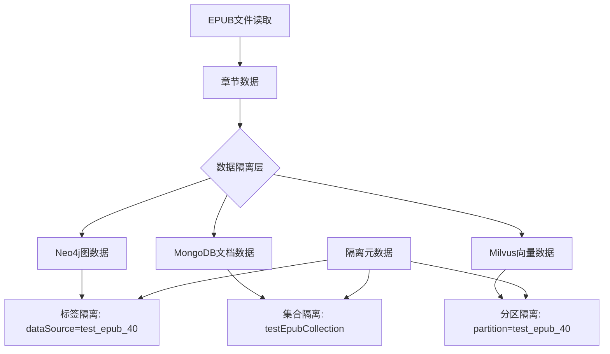
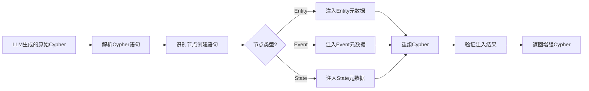
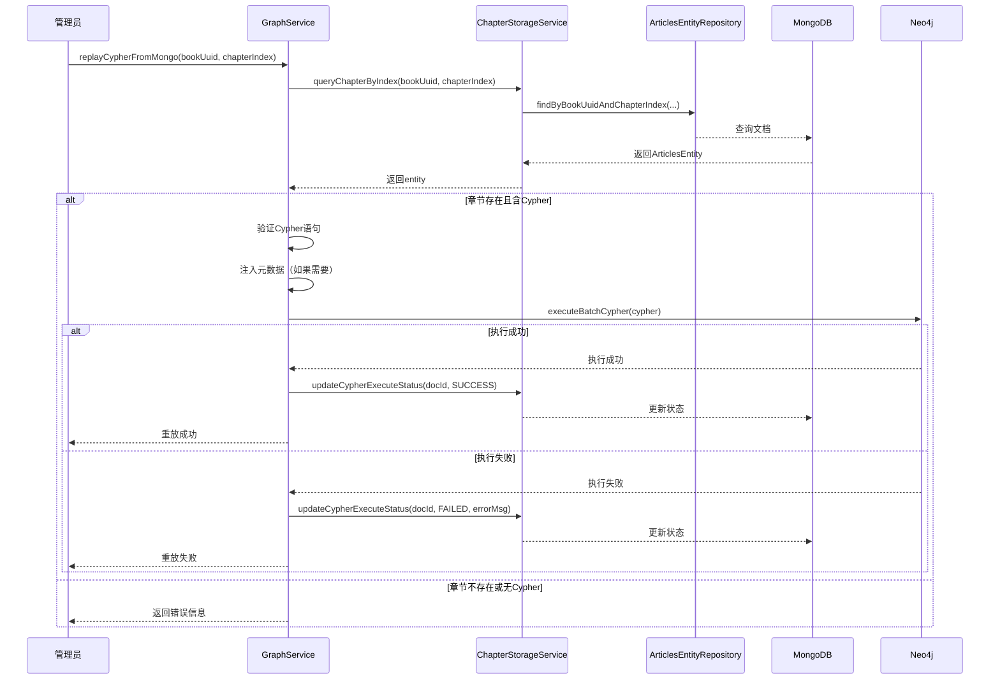

# 读取EPUB前40章节并构建知识图谱功能设计

## 概述

基于现有的章节级小说知识图谱构建系统（GraphService），实现读取指定EPUB文件（斗破苍穹）前40章节的功能。核心目标是将小说内容转换为Neo4j知识图谱，同时在MongoDB中持久化存储章节原始内容和LLM生成的Cypher语句，以支持数据追溯、审计和后续优化。本设计基于已有的 ArticlesEntity 进行扩展，增加知识图谱构建所需的元数据字段。

## 技术栈

| 技术组件 | 用途 | 说明 |
|---------|------|------|
| Spring Boot | 后端框架 | Java应用基础框架 |
| Neo4j | 图数据库 | 存储知识图谱（Entity、Event、State节点及关系） |
| MongoDB | 文档数据库 | 存储原始章节内容和元数据 |
| Milvus | 向量数据库 | 存储文本向量（用于RAG检索） |
| EpubLib | EPUB解析库 | 解析EPUB文件格式 |
| Langchain4j | AI框架 | LLM集成和Prompt管理 |

## 核心需求

### 功能需求

1. **章节限制读取**：读取指定EPUB文件的前40章内容
2. **数据隔离**：测试数据与生产数据严格隔离
3. **知识图谱构建**：基于章节级处理流程构建图谱
4. **可追溯性**：支持通过标识查询和管理测试数据

### 非功能需求

1. **数据安全**：测试数据不影响现有数据
2. **可清理性**：支持快速删除测试数据
3. **可追溯性**：测试数据可独立查询统计

## 架构设计

### 数据隔离策略

采用**多租户数据隔离模式**，通过以下维度实现隔离：



### 隔离维度定义

| 存储系统 | 隔离策略 | 实现方式 | 示例 |
|---------|---------|---------|------|
| **Neo4j** | 节点属性标签 | 所有节点添加 `dataSource` 属性 | `{dataSource: 'test_epub_40', bookName: '斗破苍穹'}` |
| **MongoDB** | 独立集合 | 使用专用集合存储测试数据 | `testEpubChapterCollection` |
| **Milvus** | 分区隔离 | 使用分区键区分数据源 | `partition_key: 'test_epub_40'` |

## 数据模型设计

### ArticlesEntity扩展设计

**设计理念**：在现有ArticlesEntity基础上增加字段，而非创建新实体类，保持代码简洁性和复用性。

**字段扩展策略**

| 原有字段 | 用途映射 | 说明 |
|---------|---------|------|
| id | 文档唯一标识 | 保持不变，使用UUID生成 |
| title | 章节标题 | 存储"第X章 章节名" |
| content | 章节完整内容 | 存储聚合后的段落文本 |
| tags | 分类标签 | 存储JSON字符串，包含bookName、dataSource等 |
| createTime | 创建时间 | 章节首次入库时间 |

| 新增字段 | 类型 | 用途 | 约束 |
|---------|------|------|------|
| bookUuid | String | 书籍唯一标识 | 必填，用于关联同一本书的所有章节 |
| chapterIndex | Integer | 章节序号 | 必填，1-40范围，用于排序和查询 |
| cypherStatements | String | LLM生成的Cypher | 必填，存储原始Cypher语句 |
| cypherExecuteStatus | String | Cypher执行状态 | 必填，枚举值：SUCCESS/FAILED/PENDING |
| cypherExecuteTime | String | Cypher执行时间 | 可选，ISO时间字符串 |
| cypherErrorMessage | String | 执行错误信息 | 可选，失败时记录详细错误 |
| processStatus | String | 章节处理状态 | 必填，枚举值：PENDING/PROCESSING/COMPLETED/FAILED |
| paragraphCount | Integer | 段落总数 | 可选，用于统计分析 |
| dataSource | String | 数据源标识 | 必填，用于数据隔离 |
| metadata | String | 扩展元数据 | 可选，JSON字符串存储其他信息 |

### Neo4j图谱节点扩展

在现有节点基础上，增加隔离属性（通过Cypher注入实现）：

**Entity节点扩展**
| 属性名 | 类型 | 必填 | 说明 | 示例 |
|--------|------|------|------|------|
| dataSource | String | 是 | 数据源标识 | `test_epub_40` |
| bookName | String | 是 | 书籍名称 | `斗破苍穹` |
| bookUuid | String | 是 | 书籍唯一标识 | `uuid-doupo-123` |
| mongoDocId | String | 否 | 对应的MongoDB文档ID | `uuid-generated-id` |

**Event节点扩展**
| 属性名 | 类型 | 必填 | 说明 | 示例 |
|--------|------|------|------|------|
| dataSource | String | 是 | 数据源标识 | `test_epub_40` |
| bookName | String | 是 | 书籍名称 | `斗破苍穹` |
| bookUuid | String | 是 | 书籍唯一标识 | `uuid-doupo-123` |
| mongoDocId | String | 否 | 对应的MongoDB文档ID | `uuid-generated-id` |

**State节点扩展**
| 属性名 | 类型 | 必填 | 说明 | 示例 |
|--------|------|------|------|------|
| dataSource | String | 是 | 数据源标识 | `test_epub_40` |
| bookName | String | 是 | 书籍名称 | `斗破苍穹` |
| bookUuid | String | 是 | 书籍唯一标识 | `uuid-doupo-123` |

### MongoDB文档结构（基于ArticlesEntity扩展）

**存储集合**：`Articles_store`（复用现有集合）

#### ArticlesEntity扩展字段定义

| 字段名 | 类型 | 必填 | 说明 | 示例值 |
|--------|------|------|------|--------|
| id | String | 是 | MongoDB文档ID | `"uuid-generated-id"` |
| title | String | 是 | 章节标题 | `"第一章 落魄天才"` |
| content | String | 是 | 章节完整文本内容（段落聚合） | `"段落1\n段落2\n..."` |
| tags | String | 是 | 标签（JSON字符串） | `"{\"bookName\":\"斗破苍穹\",\"dataSource\":\"test_epub_40\"}"` |
| createTime | String | 是 | 创建时间（ISO格式字符串） | `"2025-01-15T10:30:00Z"` |
| **bookUuid** | String | 是 | 书籍唯一标识（新增） | `"uuid-doupo-123"` |
| **chapterIndex** | Integer | 是 | 章节索引（1-40）（新增） | `1` |
| **cypherStatements** | String | 是 | LLM生成的Cypher语句（新增） | `"CREATE (e:Event:StoryEvent {...})..."` |
| **cypherExecuteStatus** | String | 是 | Cypher执行状态（新增） | `"SUCCESS/FAILED/PENDING"` |
| **cypherExecuteTime** | String | 否 | Cypher执行时间（新增） | `"2025-01-15T10:31:00Z"` |
| **cypherErrorMessage** | String | 否 | Cypher执行错误信息（新增） | `"Neo4j语法错误: ..."` |
| **processStatus** | String | 是 | 章节处理状态（新增） | `"PENDING/PROCESSING/COMPLETED/FAILED"` |
| **paragraphCount** | Integer | 否 | 段落总数（新增） | `85` |
| **dataSource** | String | 是 | 数据源标识（新增） | `"test_epub_40"` |
| **metadata** | String | 否 | 其他元数据（JSON字符串）（新增） | `"{\"author\":\"天蚕土豆\",\"version\":\"v1.0\"}"` |

### Milvus向量数据扩展

**扩展字段**
| 字段名 | 类型 | 必填 | 说明 | 示例 |
|--------|------|------|------|------|
| partitionKey | String | 是 | 分区标识 | `test_epub_40` |
| bookUuid | String | 是 | 书籍唯一标识 | `uuid-doupo-123` |
| chapterIndex | Integer | 是 | 章节索引 | `1` |
| dataSource | String | 是 | 数据源标识 | `test_epub_40` |

## 核心处理流程设计

### 处理步骤详解

基于 GraphService.readStory() 方法的成熟实现，处理流程如下：

**步骤1：读取EPUB文件**
- 调用 FileReadUtil.readEpubFile(file)
- 返回 List<ParseResult>，每个元素包含：
  - title：章节标题（如 "第一章 落魄天才"）
  - contentList：段落列表 List<String>

**步骤2：遍历章节（限制40章）**

循环逻辑（伪代码）：
```
for (int chapterIdx = 0; chapterIdx < min(parseResults.size(), 40); chapterIdx++) {
    // 处理当前章节
}
```

**步骤3：为每个章节准备上下文**

构建三个文本上下文：

| 上下文变量 | 获取方式 | 作用 | 规范依据 |
|-----------|---------|------|----------|
| lastContext | aggregateParagraphs(前一章.contentList) | 确认实体一致性、推断前置状态 | 不提取新信息 |
| indexText | aggregateParagraphs(当前章.contentList) | **唯一的信息提取来源** | 所有Cypher基于此生成 |
| nextContext | aggregateParagraphs(下一章.contentList) | 消除歧义、理解语境 | 不生成Cypher |

边界情况：
- 第1章：lastContext = "" (空字符串)
- 最后一章：nextContext = "" (空字符串)

**步骤4：聚合段落为完整文本**

aggreggateParagraphs 逻辑：
- 过滤 null 和空字符串段落
- 使用换行符 "\n" 连接所有段落
- 返回完整章节文本

**步骤5：构造章节元数据**

| 元数据字段 | 计算方式 | 示例 |
|-----------|---------|------|
| chapterTitle | currentChapter.getTitle() | "第一章 落魄天才" |
| chapterIndex | chapterIdx + 1 (从1开始) | 1 |
| baseTimestamp | calculateTimestamp(chapterIndex) | "2025-01-01T00:00:00" |

时间戳生成策略（遵循规范）：
- 基准日期：2025-01-01
- 公式：baseDate + (chapterIndex × 1天)
- 格式：YYYY-MM-DDT00:00:00
- 示例：第5章 → 2025-01-05T00:00:00

**步骤6：构造Prompt变量**

```java
Map<String, Object> variables = new HashMap<>();
variables.put("lastContext", lastChapterText);
variables.put("indexText", currentChapterText);
variables.put("nextContext", nextChapterText);
variables.put("chapterTitle", chapterTitle);
variables.put("chapterIndex", chapterIndex);
variables.put("baseTimestamp", baseTimestamp);
```

**步骤7：调用LLM生成Cypher**

Prompt构建：
- **System Prompt**：kgKnowlage.md 全文（定义本体论框架、规则、领域实体设计）
- **User Prompt**：graphPromptTemplate().apply(variables)
  - 包含当前任务说明
  - 注入章节信息、文本内容、关键约束
  - 强调输出规范

LLM调用：
```java
Prompt prompt = graphPromptTemplate().apply(variables);
String cypher = decomposeLanguageModel.chat(prompt.text());
```

**步骤8：验证Cypher语句**

validate() 验证规则：

| 验证项 | 规则 | 处理方式 |
|--------|------|----------|
| 空语句 | 不能为 null 或空字符串 | 跳过执行 |
| paragraphIndex | 不应包含此属性 | 验证失败，跳过 |
| timestamp格式 | 必须为 datetime('YYYY-MM-DDT00:00:00') | 警告但不阻断 |
| source格式 | 不应包含段落标记 " - P" | 验证失败，跳过 |

**步骤9：执行Cypher到Neo4j**

executeBatchCypher() 执行逻辑：
- 分离多条语句（按 ";" 分隔）
- 开启事务 (writeTransaction)
- 逐条执行语句
- 任何失败触发回滚
- 记录成功/失败日志

**步骤10：保存章节数据到MongoDB**

构建 ArticlesEntity：
```java
ArticlesEntity entity = ArticlesEntity.builder()
    .id(UUID.randomUUID().toString())
    .title(chapterTitle)
    .content(currentChapterText)
    .bookUuid(bookUuid)
    .chapterIndex(chapterIndex)
    .cypherStatements(cypher)
    .cypherExecuteStatus(executeSuccess ? "SUCCESS" : "FAILED")
    .cypherExecuteTime(Instant.now().toString())
    .cypherErrorMessage(errorMsg)
    .processStatus("COMPLETED")
    .paragraphCount(currentChapter.getContentList().size())
    .dataSource(metadata.getDataSource())
    .createTime(Instant.now().toString())
    .tags(buildTags(metadata))
    .build();
```

保存操作：
```java
chapterStorageService.saveChapterWithCypher(entity);
```

**步骤11：更新执行状态**

根据Neo4j执行结果更新MongoDB：
```java
if (neo4jSuccess) {
    updateCypherExecuteStatus(docId, "SUCCESS", null, executeTime);
} else {
    updateCypherExecuteStatus(docId, "FAILED", errorMessage, executeTime);
}
```

### 主流程：读取前40章并构建图谱（基于readStory实现）

```mermaid
sequenceDiagram
    participant Caller as 调用者
    participant Service as GraphService
    participant FileUtil as FileReadUtil
    participant Storage as ChapterStorageService
    participant Repo as ArticlesEntityRepository
    participant Neo4j as Neo4j数据库
    participant Mongo as MongoDB
    participant LLM as LLM服务(Ollama)
    
    Caller->>Service: readStoryWithLimit(path, 40, metadata)
    Service->>FileUtil: readEpubFile(file)
    FileUtil-->>Service: List<ParseResult> (所有章节)
    
    Service->>Service: 生成 bookUuid
    Service->>Service: 设置 chapterLimit = 40
    
    loop 每个章节 (chapterIdx: 0 to 39)
        Service->>Service: 获取 currentChapter = parseResults.get(chapterIdx)
        
        Note over Service: 步骤A: 准备上下文
        Service->>Service: lastContext = aggregateParagraphs(前一章)
        Service->>Service: indexText = aggregateParagraphs(当前章)
        Service->>Service: nextContext = aggregateParagraphs(下一章)
        
        Note over Service: 步骤B: 构造元数据
        Service->>Service: chapterTitle = currentChapter.getTitle()
        Service->>Service: chapterIndex = chapterIdx + 1
        Service->>Service: baseTimestamp = calculateTimestamp(chapterIndex)
        
        Note over Service: 步骤C: 构建 ArticlesEntity （初始状态）
        Service->>Service: entity = buildArticlesEntity(...)
        Service->>Service: entity.processStatus = "PENDING"
        Service->>Service: entity.cypherStatements = null
        
        Note over Service: 步骤D: 先保存章节内容到MongoDB
        Service->>Storage: saveChapterWithCypher(entity)
        Storage->>Repo: save(entity)
        Repo->>Mongo: insert document
        Mongo-->>Repo: 返回 docId
        Repo-->>Storage: entity (with docId)
        Storage-->>Service: savedEntity
        
        Note over Service: 步骤E: 构造 Prompt 变量
        Service->>Service: variables.put("lastContext", lastContext)
        Service->>Service: variables.put("indexText", indexText)
        Service->>Service: variables.put("nextContext", nextContext)
        Service->>Service: variables.put("chapterTitle", chapterTitle)
        Service->>Service: variables.put("chapterIndex", chapterIndex)
        Service->>Service: variables.put("baseTimestamp", baseTimestamp)
        
        Note over Service: 步骤F: 调用 LLM 生成 Cypher
        Service->>Service: prompt = graphPromptTemplate().apply(variables)
        Service->>LLM: chat(prompt.text())
        Note over LLM: System Prompt: kgKnowlage.md<br/>User Prompt: 章节上下文+约束
        LLM-->>Service: cypher (原始 Cypher 语句)
        
        Note over Service: 步骤G: 更新 MongoDB 的 cypherStatements
        Service->>Service: entity.setCypherStatements(cypher)
        Service->>Service: entity.setProcessStatus("PROCESSING")
        Service->>Storage: updateCypherContent(entity)
        Storage->>Repo: save(entity)
        Repo->>Mongo: update cypherStatements field
        
        Note over Service: 步骤H: 验证 Cypher
        Service->>Service: isValid = validate(cypher)
        
        alt Cypher 验证通过
            Note over Service: 步骤I: 注入元数据
            Service->>Service: enhancedCypher = injectMetadata(cypher, metadata, docId)
            
            Note over Service: 步骤J: 执行 Cypher 到 Neo4j
            Service->>Neo4j: executeBatchCypher(enhancedCypher)
            
            alt Neo4j 执行成功
                Neo4j-->>Service: 执行成功
                Service->>Service: log("✅ 已处理章节 X: {title}")
                
                Note over Service: 步骤K: 更新成功状态
                Service->>Storage: updateCypherExecuteStatus(docId, "SUCCESS", null, now)
                Storage->>Repo: save(entity)
                Repo->>Mongo: update cypherExecuteStatus = SUCCESS
                Repo->>Mongo: update processStatus = COMPLETED
                
            else Neo4j 执行失败
                Neo4j-->>Service: 执行失败 + errorMsg
                Service->>Service: log("❌ 章节 X Cypher执行失败")
                
                Service->>Storage: updateCypherExecuteStatus(docId, "FAILED", errorMsg, now)
                Storage->>Repo: save(entity)
                Repo->>Mongo: update cypherExecuteStatus = FAILED
                Repo->>Mongo: update cypherErrorMessage
                Repo->>Mongo: update processStatus = FAILED
            end
            
        else Cypher 验证失败
            Service->>Service: log("⚠️  章节 X 验证失败，跳过执行")
            Service->>Storage: updateCypherExecuteStatus(docId, "FAILED", "验证失败", now)
            Storage->>Repo: save(entity)
            Repo->>Mongo: update status
        end
    end
    
    Service->>Service: log("📊 知识图谱构建完成！共处理 40 个章节")
    Service-->>Caller: 返回 ProcessReport
```


```

### 元数据注入流程



## 核心服务设计

### GraphService扩展

**新增方法**

| 方法名 | 参数 | 返回值 | 说明 |
|--------|------|--------|------|
| readStoryWithLimit | path: String<br/>chapterLimit: Integer<br/>metadata: IsolationMetadata | ProcessReport | 限制章节数读取并构建图谱（含MongoDB持久化） |
| buildArticlesEntity | chapterData: ChapterData<br/>metadata: IsolationMetadata | ArticlesEntity | 构造ArticlesEntity对象 |
| injectMetadata | cypher: String<br/>metadata: IsolationMetadata<br/>mongoDocId: String | String | 向Cypher注入隔离元数据和文档ID |
| updateChapterWithCypher | entity: ArticlesEntity<br/>cypher: String | ArticlesEntity | 更新章节的Cypher语句 |
| executeAndPersistCypher | entity: ArticlesEntity<br/>cypher: String<br/>metadata: IsolationMetadata | Boolean | 执行Cypher并更新状态到MongoDB |
| cleanupTestData | dataSource: String | CleanupReport | 清理指定数据源的测试数据（Neo4j+MongoDB） |
| queryTestDataStats | dataSource: String | DataStats | 查询测试数据统计信息 |
| replayCypherFromMongo | bookUuid: String<br/>chapterIndex: Integer | Boolean | 从MongoDB重放Cypher到Neo4j |

**隔离元数据对象**

| 字段名 | 类型 | 必填 | 说明 |
|--------|------|------|------|
| dataSource | String | 是 | 数据源标识（如：`test_epub_40`） |
| bookName | String | 是 | 书籍名称 |
| bookUuid | String | 是 | 书籍唯一标识（UUID生成） |
| chapterLimit | Integer | 否 | 章节数量限制 |
| createdBy | String | 否 | 创建者标识 |
| createdAt | DateTime | 是 | 创建时间 |
| tags | Map<String, String> | 否 | 自定义标签 |

### Cypher元数据注入策略

**注入规则**

| 节点类型 | 注入属性 | 示例 |
|---------|---------|------|
| Entity | dataSource, bookName, bookUuid | `CREATE (e:Entity:Character {name: '萧炎', dataSource: 'test_epub_40', bookName: '斗破苍穹', bookUuid: 'uuid-123'})` |
| Event | dataSource, bookName, bookUuid | `CREATE (ev:Event:StoryEvent {timestamp: datetime('...'), dataSource: 'test_epub_40', bookName: '斗破苍穹', bookUuid: 'uuid-123'})` |
| State | dataSource, bookName, bookUuid | `CREATE (s:State {stateType: '境界状态', dataSource: 'test_epub_40', bookName: '斗破苍穹', bookUuid: 'uuid-123'})` |

**注入实现方式**

通过正则表达式识别和替换节点创建语句中的属性部分：

识别模式（示例）：
- `CREATE (variable:Label {existingProps})`
- `MERGE (variable:Label {existingProps})`

替换策略：
- 在 `{existingProps}` 后追加隔离属性
- 确保属性格式正确（逗号分隔、属性值正确转义）

### ArticlesEntityRepository扩展

**新增查询方法**

| 方法名 | 参数 | 返回值 | 说明 |
|--------|------|--------|------|
| findByBookUuid | bookUuid: String | List<ArticlesEntity> | 查询指定书籍的所有章节 |
| findByBookUuidAndChapterIndex | bookUuid: String<br/>chapterIndex: Integer | Optional<ArticlesEntity> | 查询指定章节 |
| findByDataSource | dataSource: String | List<ArticlesEntity> | 查询指定数据源的所有章节 |
| findByBookUuidOrderByChapterIndexAsc | bookUuid: String | List<ArticlesEntity> | 查询书籍章节并按索引排序 |
| findByCypherExecuteStatus | status: String | List<ArticlesEntity> | 查询指定执行状态的章节 |
| deleteByBookUuid | bookUuid: String | Integer | 删除指定书籍的所有章节 |
| deleteByDataSource | dataSource: String | Integer | 删除指定数据源的所有章节 |
| countByBookUuidAndCypherExecuteStatus | bookUuid: String<br/>status: String | Long | 统计指定状态的章节数 |

### ChapterStorageService服务设计

**服务职责**：封装ArticlesEntity的MongoDB操作，提供业务级别的章节存储管理

| 方法名 | 参数 | 返回值 | 说明 |
|--------|------|--------|------|
| saveChapterWithCypher | entity: ArticlesEntity | ArticlesEntity | 保存章节内容和Cypher语句 |
| updateCypherContent | entity: ArticlesEntity | ArticlesEntity | 更新章节的Cypher语句内容 |
| updateCypherExecuteStatus | docId: String<br/>status: String<br/>errorMsg: String<br/>executeTime: String | Boolean | 更新Cypher执行状态 |
| batchSaveChapters | entities: List<ArticlesEntity> | List<ArticlesEntity> | 批量保存章节数据 |
| queryChaptersByBook | bookUuid: String | List<ArticlesEntity> | 查询书籍所有章节（按索引排序） |
| queryChapterByIndex | bookUuid: String<br/>chapterIndex: Integer | ArticlesEntity | 获取指定章节 |
| queryCypherByChapter | bookUuid: String<br/>chapterIndex: Integer | String | 获取指定章节的Cypher语句 |
| queryFailedChapters | bookUuid: String | List<ArticlesEntity> | 查询处理失败的章节 |
| deleteBookData | bookUuid: String | DeleteResult | 删除书籍所有数据 |
| getBookStatistics | bookUuid: String | BookStats | 获取书籍处理统计信息 |

**BookStats对象结构**

| 字段名 | 类型 | 说明 |
|--------|------|------|
| bookUuid | String | 书籍标识 |
| totalChapters | Integer | 总章节数 |
| completedChapters | Integer | 已完成章节数 |
| failedChapters | Integer | 失败章节数 |
| pendingChapters | Integer | 待处理章节数 |
| successCypherCount | Integer | Cypher成功执行数 |
| failedCypherCount | Integer | Cypher失败执行数 |

## 核心特性设计

### MongoDB与Neo4j数据关联

**关联策略**

1. **双向引用**
   - MongoDB中存储bookUuid、chapterIndex、dataSource
   - Neo4j节点中注入mongoDocId属性，指向MongoDB文档ID

2. **关联优势**
   - **数据源头查询**：从MongoDB获取原始章节内容和原始Cypher
   - **图谱源头分析**：从Neo4j分析知识图谱，通过mongoDocId回溯数据来源
   - **Cypher审计**：查看生成某个节点的原始Cypher语句
   - **错误排查**：对比MongoDB中的Cypher与Neo4j中的实际节点

3. **查询示例**（概念描述）

| 查询场景 | 实现方式 |
|---------|----------|
| 从MongoDB查询章节，获取Cypher | 根据bookUuid和chapterIndex查询ArticlesEntity |
| 从Neo4j节点回溯源文档 | 通过节点的mongoDocId属性查询MongoDB |
| 查找所有失败的章节 | MongoDB中查询cypherExecuteStatus=FAILED的文档 |
| 统计某书的图谱节点数 | Neo4j中按bookUuid过滤，统计节点数 |

### Cypher语句重放功能

**功能目的**
- 支持从MongoDB中重新执行已保存的Cypher语句到Neo4j
- 用于错误修复、数据迁移、版本升级场景

**重放类型**

| 重放类型 | 适用场景 | 实现方式 |
|---------|---------|----------|
| 单章节重放 | 某一章节Cypher执行失败，需要重试 | replayCypherFromMongo(bookUuid, chapterIndex) |
| 多章节批量重放 | 修复Cypher注入逻辑后，重新执行所有章节 | batchReplayCypher(bookUuid, chapterIndexList) |
| 失败章节重放 | 仅重放执行状态为FAILED的章节 | replayFailedChapters(bookUuid) |
| 全书重建 | 清空Neo4j数据后全量重建图谱 | rebuildBookGraph(bookUuid) |

**重放流程**



### Cypher语句版本管理

**版本化需求**
- LLM生成的Cypher可能需要多次迭代优化
- 需要保留历史Cypher版本供对比和回滚

**设计方案**（可选）

在ArticlesEntity中增加版本历史字段：

| 字段名 | 类型 | 说明 |
|--------|------|------|
| cypherVersion | Integer | 当前Cypher版本号 |
| cypherHistory | String | 历史Cypher（JSON数组字符串） |

**cypherHistory结构示例**（JSON）

```
[
  {
    "version": 1,
    "cypher": "CREATE (e:Event:StoryEvent {...})",
    "createdAt": "2025-01-15T10:30:00Z",
    "executeStatus": "SUCCESS"
  },
  {
    "version": 2,
    "cypher": "CREATE (e:Event:StoryEvent {..., 优化后})",
    "createdAt": "2025-01-15T11:00:00Z",
    "executeStatus": "SUCCESS"
  }
]
```

### 数据一致性保障

**一致性原则**

1. **MongoDB为数据源头**
   - 所有章节内容和Cypher必须先存入MongoDB
   - Neo4j为MongoDB数据的图形化表达

2. **写入顺序**
   - 步骤1：保存章节内容到MongoDB（processStatus=PENDING）
   - 步骤2：LLM生成Cypher
   - 步骤3：更新MongoDB中cypherStatements字段
   - 步骤4：执行Cypher到Neo4j
   - 步骤5：更新MongoDB中cypherExecuteStatus和processStatus

3. **失败回滚**
   - 如果Neo4j执行失败，MongoDB记录FAILED状态
   - 不删除MongoDB数据，保留供后续重试
   - Neo4j事务回滚，不留下中间状态

4. **数据同步检查**
   - 定期执行一致性检查任务
   - 对比MongoDB中的SUCCESS记录与Neo4j中的实际节点
   - 发现不一致时报警或自动修复

**清理策略**

| 数据源 | 清理方式 | Cypher/查询示例 |
|--------|---------|----------------|
| Neo4j | 按dataSource删除节点和关系 | `MATCH (n {dataSource: 'test_epub_40'}) DETACH DELETE n` |
| MongoDB | 按bookUuid删除文档 | `db.testEpubChapterCollection.deleteMany({bookUuid: 'uuid-123'})` |
| Milvus | 按partitionKey删除向量 | `delete expr='partitionKey == "test_epub_40"'` |

**清理报告结构**

| 字段名 | 类型 | 说明 |
|--------|------|------|
| dataSource | String | 被清理的数据源 |
| neo4jNodesDeleted | Integer | Neo4j删除节点数 |
| neo4jRelationsDeleted | Integer | Neo4j删除关系数 |
| mongoDocsDeleted | Integer | MongoDB删除文档数 |
| milvusVectorsDeleted | Integer | Milvus删除向量数 |
| cleanupDuration | Long | 清理耗时（毫秒） |
| cleanupTime | DateTime | 清理时间 |

## 验证与约束

### 隔离元数据验证规则

| 验证项 | 规则 | 错误消息 |
|--------|------|---------|
| dataSource格式 | 必须为字母、数字、下划线组合 | "dataSource格式不合法" |
| bookName非空 | 不能为null或空字符串 | "bookName不能为空" |
| bookUuid格式 | 必须符合UUID格式 | "bookUuid格式不合法" |
| chapterLimit范围 | 1-1000之间 | "chapterLimit超出允许范围" |

### Cypher注入验证

**注入前验证**
- 确保原始Cypher语法正确
- 确保不包含已存在的dataSource等隔离属性

**注入后验证**
- 验证所有CREATE/MERGE节点语句都包含隔离属性
- 验证属性值正确转义
- 验证Cypher语法仍然正确

## 查询与统计设计

### 测试数据统计查询

**Neo4j统计查询**

| 统计项 | Cypher查询示例（概念） |
|--------|----------------------|
| 实体总数 | 匹配所有Entity节点，按dataSource过滤，返回计数 |
| 事件总数 | 匹配所有Event节点，按dataSource过滤，返回计数 |
| 状态总数 | 匹配所有State节点，按dataSource过滤，返回计数 |
| 按章节统计 | 匹配所有节点，按chapterIndex分组统计 |

**MongoDB统计查询**

| 统计项 | 查询说明 |
|--------|---------|
| 章节总数 | 统计集合中指定bookUuid的文档数 |
| 处理状态分布 | 按processStatus字段分组统计 |
| 平均处理时长 | 计算所有completed状态章节的处理时间均值 |

### 数据统计报告结构

| 字段名 | 类型 | 说明 |
|--------|------|------|
| dataSource | String | 数据源标识 |
| bookName | String | 书籍名称 |
| totalChapters | Integer | 总章节数 |
| processedChapters | Integer | 已处理章节数 |
| entityCount | Integer | 实体节点总数 |
| eventCount | Integer | 事件节点总数 |
| stateCount | Integer | 状态节点总数 |
| relationCount | Integer | 关系总数 |
| avgProcessTime | Long | 平均处理时长（毫秒） |
| firstChapterIndex | Integer | 起始章节索引 |
| lastChapterIndex | Integer | 结束章节索引 |
| queryTime | DateTime | 查询时间 |

## 错误处理与容错

### 异常场景处理

| 异常场景 | 处理策略 |
|---------|---------|
| EPUB文件不存在 | 抛出FileNotFoundException，返回错误信息 |
| EPUB格式损坏 | 记录错误日志，返回解析失败报告 |
| 章节数少于40 | 处理所有可用章节，警告实际处理数量 |
| LLM调用失败 | 重试3次，失败则跳过该章节，记录失败原因 |
| Neo4j连接失败 | 暂停处理，等待连接恢复或终止任务 |
| MongoDB写入失败 | 记录失败章节，继续处理下一章节 |
| Cypher注入失败 | 记录原始Cypher和注入失败原因，跳过该章节 |

### 断点续传设计

**进度跟踪表结构**（MongoDB集合：`processProgressCollection`）

| 字段名 | 类型 | 说明 |
|--------|------|------|
| taskId | String | 任务唯一标识 |
| bookUuid | String | 书籍标识 |
| dataSource | String | 数据源标识 |
| totalChapters | Integer | 总章节数 |
| processedChapters | List<Integer> | 已处理章节索引列表 |
| failedChapters | List<Integer> | 处理失败章节索引列表 |
| currentChapterIndex | Integer | 当前处理章节索引 |
| taskStatus | String | 任务状态（running/paused/completed/failed） |
| lastUpdateTime | DateTime | 最后更新时间 |

**续传逻辑**
- 启动任务时，检查是否存在未完成任务
- 若存在，加载进度并跳过已处理章节
- 继续处理未完成章节

## 性能优化考虑

### 批量处理优化

| 优化项 | 策略 | 预期效果 |
|--------|------|---------|
| MongoDB批量写入 | 每10个章节批量提交一次 | 减少网络IO，提升40%写入性能 |
| Neo4j事务批处理 | 单个章节的所有Cypher在一个事务内执行 | 保证数据一致性，减少连接开销 |
| 并发处理 | 多章节并行处理（未来优化） | 预期提升3-5倍处理速度 |

### 内存管理

| 考虑点 | 策略 |
|--------|------|
| 章节内容缓存 | 仅保留当前章节+前后各1章的内容，及时释放 |
| LLM响应缓存 | 使用LRU缓存机制，最多缓存100个响应 |
| 向量数据 | 分批加载和处理，避免一次性加载所有向量 |

## 测试策略

### 单元测试覆盖

| 测试类 | 测试方法 | 覆盖场景 |
|--------|---------|---------|
| IsolationMetadataTest | testValidation | 验证元数据验证规则 |
| CypherInjectorTest | testEntityInjection | 验证Entity节点元数据注入 |
| CypherInjectorTest | testEventInjection | 验证Event节点元数据注入 |
| CypherInjectorTest | testStateInjection | 验证State节点元数据注入 |
| ChapterLimiterTest | testLimitChapters | 验证章节限制逻辑 |
| DataCleanupTest | testNeo4jCleanup | 验证Neo4j数据清理 |
| DataCleanupTest | testMongoCleanup | 验证MongoDB数据清理 |

### 集成测试场景

| 测试场景 | 验证点 |
|---------|--------|
| 读取前40章节 | 验证实际处理章节数为40 |
| 数据隔离验证 | 查询Neo4j确认所有节点包含dataSource属性 |
| 清理测试数据 | 清理后查询确认数据已完全删除 |
| 断点续传 | 中断任务后重启，验证从中断处继续 |
| 并发安全性 | 同时处理多个不同书籍，验证数据不混淆 |

## 使用示例

### 场曯1：读取前40章并构建图谱（自然语言描述）

**操作流程**：

1. **准备元数据**
   - 创建 IsolationMetadata 对象
   - 设置 dataSource = "test_epub_40"
   - 设置 bookName = "斗破苍穹"
   - 系统自动生成 bookUuid

2. **调用服务方法**
   - 调用 GraphService.readStoryWithLimit()
   - 传入参数：
     - path: "C:\\Users\\Shuan\\Downloads\\斗破苍穹-天蚕土豆.epub"
     - chapterLimit: 40
     - metadata: IsolationMetadata对象

3. **系统处理过程**
   - 读取EPUB文件，解析所有章节
   - 截取前40章
   - 对每个章节：
     a. 聚合段落为完整文本
     b. 构建 ArticlesEntity 对象并保存到 MongoDB
     c. 调用 LLM 生成 Cypher 语句
     d. 更新 MongoDB 中的 cypherStatements 字段
     e. 验证并注入元数据到 Cypher
     f. 执行 Cypher 到 Neo4j
     g. 更新 MongoDB 中的执行状态

4. **获取结果**
   - 返回 ProcessReport 对象，包含：
     - 处理章节总数
     - 成功章节数
     - 失败章节数
     - 生成的节点数（Entity, Event, State）
     - 处理总耗时

### 场曯2：查询章节的Cypher语句

**操作流程**：

1. 调用 ChapterStorageService.queryCypherByChapter()
2. 传入 bookUuid 和 chapterIndex
3. 系统从 MongoDB 查询 ArticlesEntity
4. 返回 cypherStatements 字段内容
5. 可用于：
   - 审计LLM生成质量
   - 调试Cypher语句
   - 对比不同版本的Cypher

### 场曯3：重放失败章节的Cypher

**操作流程**：

1. 查询失败章节
   - 调用 ChapterStorageService.queryFailedChapters(bookUuid)
   - 获取所有 cypherExecuteStatus = "FAILED" 的章节

2. 对每个失败章节
   - 调用 GraphService.replayCypherFromMongo(bookUuid, chapterIndex)
   - 系统从 MongoDB 读取已保存的 Cypher
   - 重新执行到 Neo4j
   - 更新执行状态

3. 查看重放结果
   - 成功：cypherExecuteStatus 更新为 "SUCCESS"
   - 失败：查看 cypherErrorMessage 分析原因

### 场曯4：清理测试数据

**操作流程**：

1. 调用 GraphService.cleanupTestData(dataSource)
2. 传入 dataSource = "test_epub_40"
3. 系统执行：
   - Neo4j：删除所有 dataSource = "test_epub_40" 的节点和关系
   - MongoDB：删除所有 dataSource = "test_epub_40" 的文档
   - Milvus：删除对应分区的向量数据
4. 返回 CleanupReport，包含删除的数据量统计

### 场曯5：查询数据统计

**操作流程**：

1. 调用 ChapterStorageService.getBookStatistics(bookUuid)
2. 系统执行：
   - MongoDB 统计：
     - 总章节数
     - 各状态章节数（COMPLETED, FAILED, PENDING）
     - Cypher执行成功/失败数
   - Neo4j 统计：
     - Entity 节点数
     - Event 节点数
     - State 节点数
     - 关系总数
3. 返回 DataStats 对象，用于：
   - 监控处理进度
   - 评估图谱质量
   - 分析处理效率

## 配置管理

### 隔离配置参数

| 配置项 | 类型 | 默认值 | 说明 |
|--------|------|--------|------|
| isolation.enabled | Boolean | true | 是否启用数据隔离 |
| isolation.default.dataSource | String | default | 默认数据源标识 |
| isolation.mongodb.collection | String | testEpubChapterCollection | MongoDB测试数据集合名 |
| isolation.milvus.partition.enabled | Boolean | true | 是否启用Milvus分区隔离 |
| processing.chapter.limit.max | Integer | 1000 | 允许的最大章节限制 |
| processing.batch.size | Integer | 10 | 批量处理大小 |
| processing.retry.times | Integer | 3 | LLM调用失败重试次数 |

### 环境配置

| 环境 | dataSource前缀 | 说明 |
|------|---------------|------|
| 开发环境 | dev_ | 用于开发测试 |
| 测试环境 | test_ | 用于集成测试 |
| 生产环境 | prod_ | 生产数据（严格隔离） |

## 监控与日志

### 关键日志点

| 日志级别 | 触发场景 | 日志内容示例 |
|---------|---------|-------------|
| INFO | 开始处理章节 | "开始处理章节 {chapterIndex}/{totalChapters}: {chapterTitle}" |
| INFO | 章节处理成功 | "✅ 已处理章节 {chapterIndex}: {chapterTitle}, 耗时: {duration}ms" |
| WARN | 章节数不足 | "⚠️  EPUB文件仅包含 {actualCount} 章节，少于请求的 {requestedLimit} 章节" |
| ERROR | LLM调用失败 | "❌ 章节 {chapterIndex} LLM调用失败，重试 {retryCount}/{maxRetry}" |
| ERROR | Cypher执行失败 | "❌ 章节 {chapterIndex} Cypher执行失败: {errorMessage}" |
| INFO | 任务完成 | "📊 知识图谱构建完成！共处理 {processedCount} 个章节，成功 {successCount}，失败 {failedCount}" |

### 性能监控指标

| 指标名称 | 说明 | 监控方式 |
|---------|------|---------|
| chapter_process_time | 单章节处理耗时 | 记录每章处理开始和结束时间 |
| llm_call_time | LLM调用耗时 | 记录LLM请求响应时间 |
| neo4j_write_time | Neo4j写入耗时 | 记录事务提交时间 |
| mongodb_write_time | MongoDB写入耗时 | 记录文档保存时间 |
| total_task_time | 总任务耗时 | 记录任务开始和结束时间 |
| success_rate | 处理成功率 | 成功章节数 / 总章节数 |

## 数据安全与访问控制

### 隔离边界保护

| 保护措施 | 说明 |
|---------|------|
| 查询强制过滤 | 所有查询必须带dataSource过滤条件 |
| 写入强制注入 | 所有写入操作强制注入隔离属性 |
| 跨源操作禁止 | 禁止在单个事务中操作多个dataSource |

### 数据可见性规则

| 访问场景 | 可见性规则 |
|---------|-----------|
| 默认查询 | 仅返回dataSource匹配的数据 |
| 管理员查询 | 可指定dataSource或查询全部 |
| 跨源关联查询 | 需显式声明多个dataSource |

## 扩展性设计

### 支持多书籍测试

通过修改隔离元数据，可支持同时测试多本小说：

| dataSource | bookName | bookUuid |
|------------|----------|----------|
| test_epub_doupo_40 | 斗破苍穹 | uuid-doupo-123 |
| test_epub_zhutian_30 | 诛仙 | uuid-zhutian-456 |
| test_epub_xingchen_50 | 星辰变 | uuid-xingchen-789 |

### 支持自定义章节范围

未来可扩展支持指定章节范围（如：第10-50章）：

**扩展参数**
| 参数名 | 类型 | 说明 |
|--------|------|------|
| startChapterIndex | Integer | 起始章节索引 |
| endChapterIndex | Integer | 结束章节索引 |

## 关键决策与权衡

| 决策点 | 选择方案 | 权衡原因 |
|--------|---------|----------|
| 实体类选择 | 扩展ArticlesEntity而非新建 | 复用现有代码，减少系统复杂度，保持一致性 |
| MongoDB集合策略 | 复用Articles_store集合 | 避免创建过多集合，通过dataSource字段隔离 |
| Cypher存储方式 | 存储为字符串在MongoDB | 便于查看、审计、重放，支持全文搜索 |
| 元数据注入时机 | Cypher生成后注入 | 不修改LLM Prompt，保持生成逻辑简洁 |
| 数据源头定义 | MongoDB为源头，Neo4j为表达 | 保证数据完整性和可追溯性 |
| 写入顺序 | 先MongoDB后Neo4j | MongoDB快，先保存确保数据不丢失 |
| Neo4j元数据 | mongoDocId属性 | 支持从图谱节点回溯MongoDB文档 |
| Cypher重放机制 | 支持从MongoDB重放 | 支持错误修复、数据迁移场景 |
| 版本管理 | 首期不实现，预留扩展点 | 避免过度设计，根据实际需求再补充 |
| 并发处理 | 暂不支持，顺序处理 | 先保证功能正确性，后续优化性能 |
| 数据隔离粒度 | 属性级隔离 | 避免创建多个数据库，降低运维复杂度 |
| 章节限制实现 | 读取所有章节后截取 | 保持EPUB解析逻辑不变，限制逻辑解耦 |

## 风险与缓解

| 风险 | 缓解措施 |
|------|----------|
| MongoDB与Neo4j数据不一致 | 实现一致性检查任务，定期校验+报警 |
| Cypher注入失败 | 验证机制+详细日志+支持重试 |
| LLM生成Cypher质量低 | 存储原始语句+支持人工审计+版本迭代 |
| MongoDB存储大量文本 | 建立索引+定期归档历史数据 |
| Neo4j执行失败无法回滚 | 事务支持+MongoDB保留原始Cypher+重放机制 |
| 数据隔离失效 | 强制验证+查询强制过滤+写入强制注入 |
| 清理误删生产数据 | 清理前二次确认+仅删除匹配dataSource的数据 |
| 处理过程中断 | 断点续传机制+进度跟踪表 |
| 性能瓶颈 | 批量处理+异步执行+进度监控 |
| 章节限制失效 | 单元测试覆盖+代码Review |
