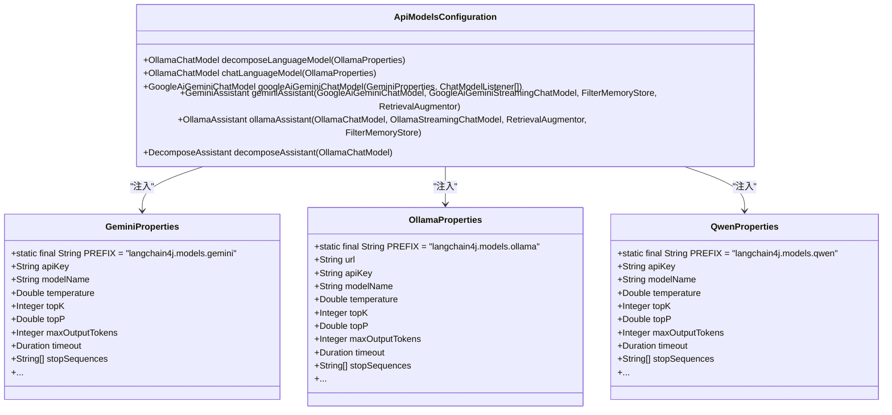
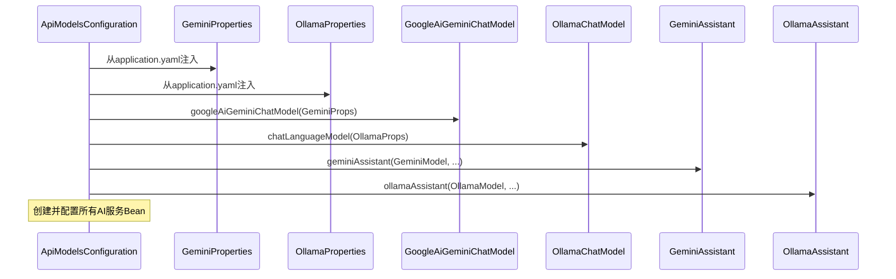

# AI模型集成

<cite>
**Referenced Files in This Document**   
- [ApiModelsConfiguration.java](file://ai/src/main/java/com/shuanglin/bot/langchain4j/config/ApiModelsConfiguration.java)
- [GeminiAssistant.java](file://ai/src/main/java/com/shuanglin/bot/langchain4j/assistant/GeminiAssistant.java)
- [OllamaAssistant.java](file://ai/src/main/java/com/shuanglin/bot/langchain4j/assistant/OllamaAssistant.java)
- [DecomposeAssistant.java](file://ai/src/main/java/com/shuanglin/bot/langchain4j/assistant/DecomposeAssistant.java)
- [GeminiProperties.java](file://ai/src/main/java/com/shuanglin/bot/langchain4j/config/vo/GeminiProperties.java)
- [OllamaProperties.java](file://ai/src/main/java/com/shuanglin/bot/langchain4j/config/vo/OllamaProperties.java)
- [QwenProperties.java](file://ai/src/main/java/com/shuanglin/bot/langchain4j/config/vo/QwenProperties.java)
- [ChatController.java](file://ai/src/main/java/com/shuanglin/bot/langchain4j/controller/ChatController.java)
- [application.yaml](file://ai/src/main/resources/application.yaml)
</cite>

## 目录
1. [简介](#简介)
2. [核心组件](#核心组件)
3. [模型配置与属性注入](#模型配置与属性注入)
4. [AI助手的创建与集成](#ai助手的创建与集成)
5. [多模型支持与切换](#多模型支持与切换)
6. [添加新AI模型的指南](#添加新ai模型的指南)
7. [结论](#结论)

## 简介
本文档旨在详细说明项目中AI模型的集成机制。它将阐述如何利用LangChain4j框架为Gemini和Ollama等不同AI模型创建专用的AI助手（如`GeminiAssistant`）。文档将深入解析`ApiModelsConfiguration`类如何通过Spring框架的`@Value`和`@ConfigurationProperties`注解来注入API密钥及模型参数。同时，将解释关键模型配置属性（如`temperature`、`maxTokens`）的来源、作用及其对模型行为的影响。此外，文档还将描述系统如何支持多种AI模型并存，并为开发者提供一份清晰的步骤指南，以添加新的AI模型（例如Qwen）。

## 核心组件

本节分析实现AI模型集成的核心组件。

**Section sources**
- [ApiModelsConfiguration.java](file://ai/src/main/java/com/shuanglin/bot/langchain4j/config/ApiModelsConfiguration.java)
- [GeminiAssistant.java](file://ai/src/main/java/com/shuanglin/bot/langchain4j/assistant/GeminiAssistant.java)
- [OllamaAssistant.java](file://ai/src/main/java/com/shuanglin/bot/langchain4j/assistant/OllamaAssistant.java)
- [DecomposeAssistant.java](file://ai/src/main/java/com/shuanglin/bot/langchain4j/assistant/DecomposeAssistant.java)

## 模型配置与属性注入

系统通过Spring Boot的配置属性机制来管理所有AI模型的参数。每个支持的模型（Gemini、Ollama、Qwen）都有一个对应的配置属性类，这些类位于`com.shuanglin.bot.langchain4j.config.vo`包下。

这些属性类（`GeminiProperties`、`OllamaProperties`、`QwenProperties`）使用`@ConfigurationProperties`注解，并通过`PREFIX`常量指定了在`application.yaml`文件中的配置前缀（分别为`langchain4j.models.gemini`、`langchain4j.models.ollama`和`langchain4j.models.qwen`）。Spring Boot会自动将配置文件中对应前缀下的属性值绑定到这些类的字段上。

例如，`GeminiProperties`类中的`apiKey`、`modelName`和`temperature`字段会分别映射`application.yaml`中`langchain4j.models.gemini.apiKey`、`langchain4j.models.gemini.modelName`和`langchain4j.models.gemini.temperature`的值。

**Diagram sources**
- [GeminiProperties.java](file://ai/src/main/java/com/shuanglin/bot/langchain4j/config/vo/GeminiProperties.java)
- [OllamaProperties.java](file://ai/src/main/java/com/shuanglin/bot/langchain4j/config/vo/OllamaProperties.java)
- [QwenProperties.java](file://ai/src/main/java/com/shuanglin/bot/langchain4j/config/vo/QwenProperties.java)
- [ApiModelsConfiguration.java](file://ai/src/main/java/com/shuanglin/bot/langchain4j/config/ApiModelsConfiguration.java)

### 模型配置属性详解

以下表格总结了核心模型配置属性的来源和作用：

| 属性名 | 来源 (YAML路径) | 作用 |
| :--- | :--- | :--- |
| `temperature` | `langchain4j.models.[model].temperature` | 控制模型生成的随机性。值在0-1之间，值越大，输出越多样化和不可预测；值越小，输出越确定和保守。 |
| `maxOutputTokens` | `langchain4j.models.[model].maxOutputTokens` | 限制模型单次响应生成的最大token数量。 |
| `topP` | `langchain4j.models.[model].topP` | 核采样（Nucleus Sampling）参数。模型从累积概率超过topP的最小token集合中进行采样，用于控制输出的多样性。 |
| `topK` | `langchain4j.models.[model].topK` | 限制模型在生成下一个token时只考虑概率最高的K个候选token。 |
| `apiKey` | `langchain4j.models.[model].apiKey` | 访问特定AI模型提供商（如Google AI for Gemini）的API密钥。 |
| `url` | `langchain4j.models.ollama.url` | Ollama服务的HTTP基础URL。 |
| `modelName` | `langchain4j.models.[model].modelName` | 指定要使用的具体模型名称（例如，`gemini-2.0-flash` 或 `gemma3:12b`）。 |

**Section sources**
- [GeminiProperties.java](file://ai/src/main/java/com/shuanglin/bot/langchain4j/config/vo/GeminiProperties.java)
- [OllamaProperties.java](file://ai/src/main/java/com/shuanglin/bot/langchain4j/config/vo/OllamaProperties.java)
- [QwenProperties.java](file://ai/src/main/java/com/shuanglin/bot/langchain4j/config/vo/QwenProperties.java)
- [application.yaml](file://ai/src/main/resources/application.yaml)

## AI助手的创建与集成

AI助手的创建是通过`ApiModelsConfiguration`类中的Spring `@Bean`方法完成的。该类使用`@EnableConfigurationProperties`注解启用了`GeminiProperties`、`OllamaProperties`和`QwenProperties`的配置。

1.  **模型实例化**：首先，配置类会根据`OllamaProperties`和`GeminiProperties`中的配置，创建具体的模型实例（如`OllamaChatModel`和`GoogleAiGeminiChatModel`）。
2.  **助手构建**：然后，使用LangChain4j的`AiServices`构建器，将这些模型实例、内存存储（`FilterMemoryStore`）和检索增强组件（`RetrievalAugmentor`）注入到对应的AI助手接口实现中。

例如，`geminiAssistant` Bean的创建过程如下：
- 通过`googleAiGeminiChatModel()`方法创建一个配置好的`GoogleAiGeminiChatModel`实例。
- 将此实例以及其他依赖项（流式模型、内存存储、检索增强器）传递给`geminiAssistant()`方法。
- 在`geminiAssistant()`方法中，`AiServices.builder(GeminiAssistant.class)`会动态生成一个实现了`GeminiAssistant`接口的代理类，该代理类使用传入的模型进行实际的AI调用。

`GeminiAssistant`和`OllamaAssistant`接口定义了具体的AI功能，如聊天、流式聊天和特定任务（如知识图谱实体提取）。这些接口通过`@UserMessage`等LangChain4j注解来定义提示词模板。

**Diagram sources**
- [ApiModelsConfiguration.java](file://ai/src/main/java/com/shuanglin/bot/langchain4j/config/ApiModelsConfiguration.java)

**Section sources**
- [ApiModelsConfiguration.java](file://ai/src/main/java/com/shuanglin/bot/langchain4j/config/ApiModelsConfiguration.java)
- [GeminiAssistant.java](file://ai/src/main/java/com/shuanglin/bot/langchain4j/assistant/GeminiAssistant.java)
- [OllamaAssistant.java](file://ai/src/main/java/com/shuanglin/bot/langchain4j/assistant/OllamaAssistant.java)

## 多模型支持与切换

系统通过Spring的依赖注入机制天然支持多模型并存。`ApiModelsConfiguration`类同时定义了`GeminiAssistant`和`OllamaAssistant`等多个助手的Bean。

模型的“切换”并非在运行时动态改变同一个接口的后端实现，而是通过在不同的业务逻辑中注入和使用不同的助手Bean来实现的。例如：

- `ChatController`类同时注入了`geminiAssistant`和`ollamaAssistant`两个字段。
- 其`ask()`方法目前调用的是`ollamaAssistant.chat()`，这意味着该端点使用Ollama模型。
- 如果需要使用Gemini模型，可以创建一个新的控制器方法，调用`geminiAssistant.chat()`。

此外，系统还定义了一个专门用于知识图谱构建的`DecomposeAssistant`，它使用了另一个Ollama模型实例（`decomposeLanguageModel`），并加载了特定的系统提示词（`kgKnowlage.md`），这体现了为不同任务定制化模型配置的能力。

**Section sources**
- [ApiModelsConfiguration.java](file://ai/src/main/java/com/shuanglin/bot/langchain4j/config/ApiModelsConfiguration.java)
- [ChatController.java](file://ai/src/main/java/com/shuanglin/bot/langchain4j/controller/ChatController.java)

## 添加新AI模型的指南

为系统添加一个新的AI模型（例如Qwen）需要以下步骤：

1.  **创建配置属性类**：
    *   在`com.shuanglin.bot.langchain4j.config.vo`包下创建一个新的Java类，例如`QwenProperties.java`。
    *   使用`@Data`和`@ConfigurationProperties(prefix = "langchain4j.models.qwen")`注解。
    *   定义与Qwen模型相关的字段，如`apiKey`、`modelName`、`temperature`等。

2.  **在主配置中启用**：
    *   打开`ApiModelsConfiguration.java`。
    *   在`@EnableConfigurationProperties`注解的列表中，添加新创建的`QwenProperties.class`。

3.  **创建AI助手接口**：
    *   在`com.shuanglin.bot.langchain4j.assistant`包下创建一个新的接口，例如`QwenAssistant.java`。
    *   使用`@UserMessage`等LangChain4j注解定义该助手提供的功能和提示词。

4.  **在主配置中注册Bean**：
    *   在`ApiModelsConfiguration.java`中，添加一个新的`@Bean`方法来创建Qwen的模型实例（如`QwenChatModel`）。
    *   再添加一个`@Bean`方法，使用`AiServices.builder(QwenAssistant.class)`并注入上一步创建的模型实例，来创建`QwenAssistant`的Bean。

5.  **配置YAML文件**：
    *   在`application.yaml`文件的`langchain4j.models`下，添加`qwen:`配置块，并设置`apiKey`、`modelName`等具体值。

完成以上步骤后，新的Qwen模型即可通过Spring注入在任何需要的地方使用。

**Section sources**
- [QwenProperties.java](file://ai/src/main/java/com/shuanglin/bot/langchain4j/config/vo/QwenProperties.java)
- [ApiModelsConfiguration.java](file://ai/src/main/java/com/shuanglin/bot/langchain4j/config/ApiModelsConfiguration.java)

## 结论

本项目通过Spring Boot的`@ConfigurationProperties`和LangChain4j的`AiServices`，构建了一个灵活且可扩展的AI模型集成架构。配置属性类将`application.yaml`中的参数安全地注入到系统中，而`ApiModelsConfiguration`则作为中心枢纽，负责实例化模型并创建功能化的AI助手。这种设计使得系统能够轻松地支持多个AI模型，并为未来集成更多模型（如Qwen）提供了清晰的路径。开发者只需遵循定义配置、创建接口和注册Bean的模式，即可快速扩展系统的AI能力。