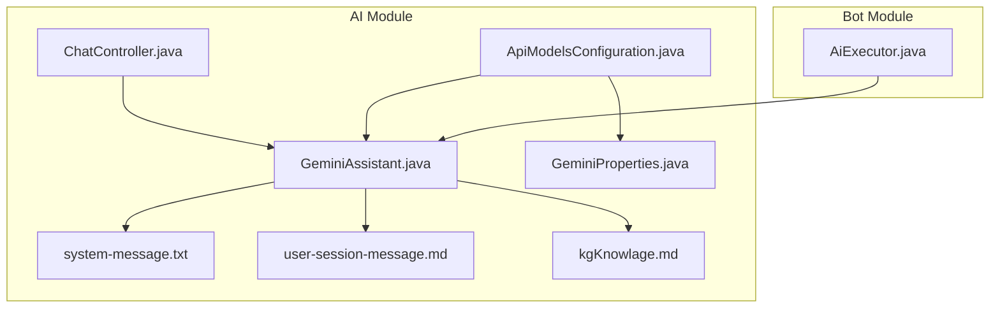
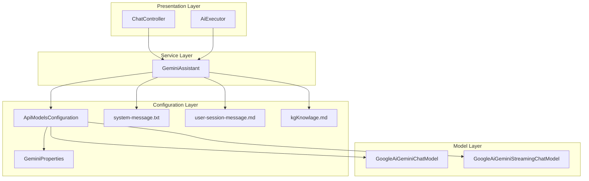
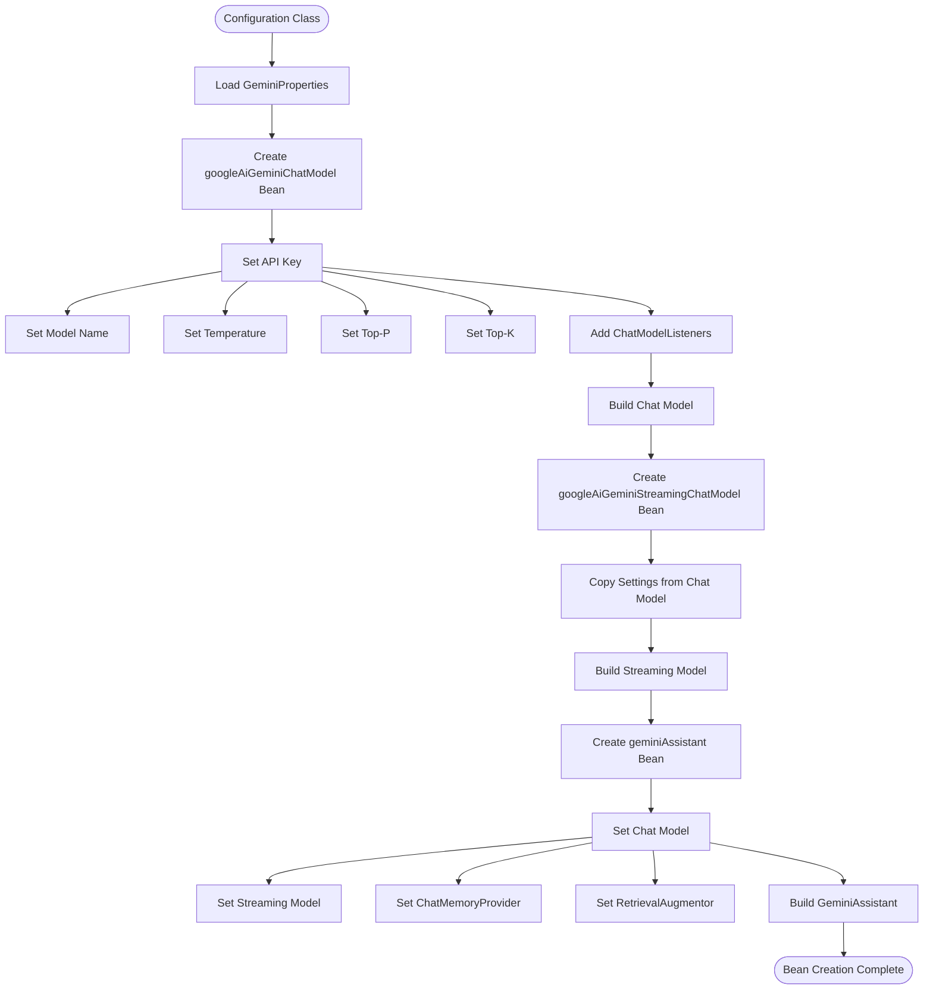
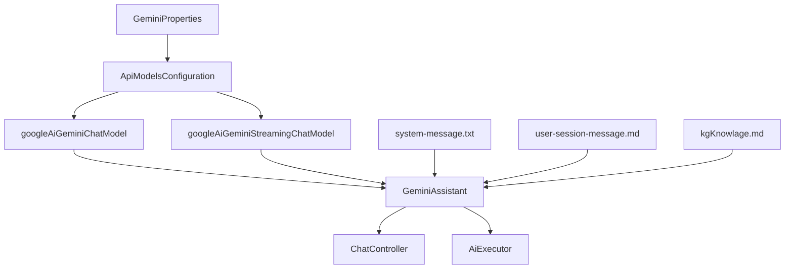

# Gemini模型集成

<cite>
**Referenced Files in This Document**   
- [GeminiAssistant.java](file://ai/src/main/java/com/shuanglin/bot/langchain4j/assistant/GeminiAssistant.java)
- [ApiModelsConfiguration.java](file://ai/src/main/java/com/shuanglin/bot/langchain4j/config/ApiModelsConfiguration.java)
- [GeminiProperties.java](file://ai/src/main/java/com/shuanglin/bot/langchain4j/config/vo/GeminiProperties.java)
- [system-message.txt](file://ai/src/main/resources/prompt/system-message.txt)
- [user-session-message.md](file://ai/src/main/resources/prompt/user-session-message.md)
- [kgKnowlage.md](file://ai/src/main/resources/prompt/kgKnowlage.md)
- [ChatController.java](file://ai/src/main/java/com/shuanglin/bot/langchain4j/controller/ChatController.java)
- [AiExecutor.java](file://bot/src/main/java/com/shuanglin/executor/AiExecutor.java)
</cite>

## Table of Contents
1. [Introduction](#introduction)
2. [Project Structure](#project-structure)
3. [Core Components](#core-components)
4. [Architecture Overview](#architecture-overview)
5. [Detailed Component Analysis](#detailed-component-analysis)
6. [Dependency Analysis](#dependency-analysis)
7. [Performance Considerations](#performance-considerations)
8. [Troubleshooting Guide](#troubleshooting-guide)
9. [Conclusion](#conclusion)
10. [Appendices](#appendices) (if necessary)

## Introduction
本文档详细说明了Gemini模型在项目中的集成实现。系统通过LangChain4j框架的AiServices创建AI服务实例，支持普通聊天、群聊和流式输出三种模式。GeminiAssistant接口通过@MemoryId和@V注解与system-message.txt和user-session-message.md提示词模板关联，实现动态角色设定和变量替换。系统通过ApiModelsConfiguration配置类构建googleAiGeminiChatModel和googleAiGeminiStreamingChatModel两个Bean，其apiKey、modelName、temperature等参数从GeminiProperties配置类注入。知识图谱构建等系统提示词在enhancedEntityExtraction方法中通过kgKnowlage.md模板应用。文档还提供了Gemini API密钥配置、请求参数调优和常见错误（如配额超限）的解决方案。

## Project Structure
项目结构中，Gemini模型相关的核心代码位于`ai/src/main/java/com/shuanglin/bot/langchain4j`包下。主要包含assistant包中的GeminiAssistant接口定义，config包中的ApiModelsConfiguration配置类和GeminiProperties配置属性类。提示词模板文件位于`ai/src/main/resources/prompt`目录下，包括system-message.txt、user-session-message.md和kgKnowlage.md。控制器层的ChatController负责处理HTTP请求，而bot模块中的AiExecutor则处理群组消息。



**Diagram sources**
- [GeminiAssistant.java](file://ai/src/main/java/com/shuanglin/bot/langchain4j/assistant/GeminiAssistant.java)
- [ApiModelsConfiguration.java](file://ai/src/main/java/com/shuanglin/bot/langchain4j/config/ApiModelsConfiguration.java)
- [GeminiProperties.java](file://ai/src/main/java/com/shuanglin/bot/langchain4j/config/vo/GeminiProperties.java)
- [system-message.txt](file://ai/src/main/resources/prompt/system-message.txt)
- [user-session-message.md](file://ai/src/main/resources/prompt/user-session-message.md)
- [kgKnowlage.md](file://ai/src/main/resources/prompt/kgKnowlage.md)
- [ChatController.java](file://ai/src/main/java/com/shuanglin/bot/langchain4j/controller/ChatController.java)
- [AiExecutor.java](file://bot/src/main/java/com/shuanglin/executor/AiExecutor.java)

**Section sources**
- [GeminiAssistant.java](file://ai/src/main/java/com/shuanglin/bot/langchain4j/assistant/GeminiAssistant.java)
- [ApiModelsConfiguration.java](file://ai/src/main/java/com/shuanglin/bot/langchain4j/config/ApiModelsConfiguration.java)

## Core Components
核心组件包括GeminiAssistant接口、ApiModelsConfiguration配置类和GeminiProperties配置属性类。GeminiAssistant接口定义了三种主要方法：普通聊天(chat)、群聊(groupChat)和流式输出(chatStreamTokenStream)。ApiModelsConfiguration负责创建Gemini模型的Bean实例，而GeminiProperties则封装了模型的所有配置参数。

**Section sources**
- [GeminiAssistant.java](file://ai/src/main/java/com/shuanglin/bot/langchain4j/assistant/GeminiAssistant.java)
- [ApiModelsConfiguration.java](file://ai/src/main/java/com/shuanglin/bot/langchain4j/config/ApiModelsConfiguration.java)
- [GeminiProperties.java](file://ai/src/main/java/com/shuanglin/bot/langchain4j/config/vo/GeminiProperties.java)

## Architecture Overview
系统架构采用分层设计，上层为控制器和执行器，中层为AI服务接口，底层为模型配置和提示词模板。LangChain4j的AiServices作为核心框架，将GeminiAssistant接口与具体的Google AI模型实现连接。配置参数通过Spring的依赖注入机制从GeminiProperties传递到模型Bean中。提示词模板通过@UserMessage注解与接口方法关联，实现动态内容生成。



**Diagram sources**
- [GeminiAssistant.java](file://ai/src/main/java/com/shuanglin/bot/langchain4j/assistant/GeminiAssistant.java)
- [ApiModelsConfiguration.java](file://ai/src/main/java/com/shuanglin/bot/langchain4j/config/ApiModelsConfiguration.java)
- [GeminiProperties.java](file://ai/src/main/java/com/shuanglin/bot/langchain4j/config/vo/GeminiProperties.java)
- [system-message.txt](file://ai/src/main/resources/prompt/system-message.txt)
- [user-session-message.md](file://ai/src/main/resources/prompt/user-session-message.md)
- [kgKnowlage.md](file://ai/src/main/resources/prompt/kgKnowlage.md)

## Detailed Component Analysis
### GeminiAssistant接口分析
GeminiAssistant接口是系统与Gemini模型交互的核心。它通过LangChain4j的AiServices创建代理实例，将接口方法调用转换为对AI模型的请求。

#### 接口方法与模式
```mermaid
classDiagram
class GeminiAssistant {
+String enhancedEntityExtraction(String indexText, String lastContext, String nextContext)
+String chat(JsonObject memoryId, String question)
+String groupChat(JsonObject memoryId, String question)
+TokenStream chatStreamTokenStream(String role, String question, String extraInfo)
}
note right of GeminiAssistant : : enhancedEntityExtraction
用于知识图谱构建
从kgKnowlage.md加载系统提示词
end note
note right of GeminiAssistant : : chat
普通聊天模式
使用@MemoryId管理对话记忆
end note
note right of GeminiAssistant : : groupChat
群聊模式
使用@MemoryId管理群组对话记忆
end note
note right of GeminiAssistant : : chatStreamTokenStream
流式输出模式
返回TokenStream实现逐字输出
end note
```

**Diagram sources**
- [GeminiAssistant.java](file://ai/src/main/java/com/shuanglin/bot/langchain4j/assistant/GeminiAssistant.java)

**Section sources**
- [GeminiAssistant.java](file://ai/src/main/java/com/shuanglin/bot/langchain4j/assistant/GeminiAssistant.java)

### ApiModelsConfiguration分析
ApiModelsConfiguration类负责配置和创建Gemini模型的Bean实例，是连接配置属性和实际模型的桥梁。

#### Bean创建流程


**Diagram sources**
- [ApiModelsConfiguration.java](file://ai/src/main/java/com/shuanglin/bot/langchain4j/config/ApiModelsConfiguration.java)

**Section sources**
- [ApiModelsConfiguration.java](file://ai/src/main/java/com/shuanglin/bot/langchain4j/config/ApiModelsConfiguration.java)

## Dependency Analysis
系统组件间存在明确的依赖关系。GeminiAssistant接口依赖于ApiModelsConfiguration创建的模型Bean，而ApiModelsConfiguration又依赖于GeminiProperties提供的配置参数。提示词模板文件通过@UserMessage注解被GeminiAssistant方法引用。控制器和执行器组件则依赖于GeminiAssistant接口进行AI调用。



**Diagram sources**
- [GeminiProperties.java](file://ai/src/main/java/com/shuanglin/bot/langchain4j/config/vo/GeminiProperties.java)
- [ApiModelsConfiguration.java](file://ai/src/main/java/com/shuanglin/bot/langchain4j/config/ApiModelsConfiguration.java)
- [GeminiAssistant.java](file://ai/src/main/java/com/shuanglin/bot/langchain4j/assistant/GeminiAssistant.java)
- [system-message.txt](file://ai/src/main/resources/prompt/system-message.txt)
- [user-session-message.md](file://ai/src/main/resources/prompt/user-session-message.md)
- [kgKnowlage.md](file://ai/src/main/resources/prompt/kgKnowlage.md)
- [ChatController.java](file://ai/src/main/java/com/shuanglin/bot/langchain4j/controller/ChatController.java)
- [AiExecutor.java](file://bot/src/main/java/com/shuanglin/executor/AiExecutor.java)

## Performance Considerations
在性能方面，系统通过多种方式优化AI调用。流式输出模式(chatStreamTokenStream)可以减少用户等待时间，提供更好的交互体验。配置中的temperature、topP、topK等参数可以调节模型的创造性和确定性，平衡响应质量和生成速度。内存管理通过MessageWindowChatMemory实现，限制对话历史长度以控制内存使用。对于知识图谱构建等复杂任务，系统通过专门的enhancedEntityExtraction方法和kgKnowlage.md模板优化提示词，提高任务执行效率。

## Troubleshooting Guide
### 常见问题与解决方案
1. **API密钥配置错误**
   - 确保在application.yaml中正确配置langchain4j.models.gemini.apiKey
   - 检查API密钥是否有效且未过期
   - 验证API密钥是否有足够的权限访问Gemini API

2. **配额超限**
   - 检查Google Cloud项目的配额使用情况
   - 申请提高API配额限制
   - 实现请求限流和重试机制

3. **模型参数调优**
   - temperature: 控制输出随机性，0.0为确定性输出，1.0为高度随机
   - topP: 核采样参数，控制生成词汇的多样性
   - topK: 限制模型考虑的最高概率词汇数量

4. **提示词模板问题**
   - 确保system-message.txt和user-session-message.md文件存在且可读
   - 验证@V注解中的变量名与模板中的占位符匹配
   - 检查kgKnowlage.md文件是否包含完整知识图谱构建规范

**Section sources**
- [GeminiProperties.java](file://ai/src/main/java/com/shuanglin/bot/langchain4j/config/vo/GeminiProperties.java)
- [system-message.txt](file://ai/src/main/resources/prompt/system-message.txt)
- [user-session-message.md](file://ai/src/main/resources/prompt/user-session-message.md)
- [kgKnowlage.md](file://ai/src/main/resources/prompt/kgKnowlage.md)

## Conclusion
本文档详细阐述了Gemini模型在项目中的集成实现。通过LangChain4j的AiServices框架，系统成功创建了支持普通聊天、群聊和流式输出的AI服务实例。GeminiAssistant接口通过@MemoryId和@V注解与提示词模板灵活关联，实现了动态角色设定和变量替换。ApiModelsConfiguration配置类有效地管理了googleAiGeminiChatModel和googleAiGeminiStreamingChatModel两个Bean的创建过程，所有参数均从GeminiProperties配置类注入，保证了配置的集中管理和灵活性。知识图谱构建等复杂任务通过专门的enhancedEntityExtraction方法和kgKnowlage.md系统提示词模板实现，确保了任务执行的准确性和一致性。整体集成方案设计合理，扩展性强，为系统的AI能力提供了坚实的基础。