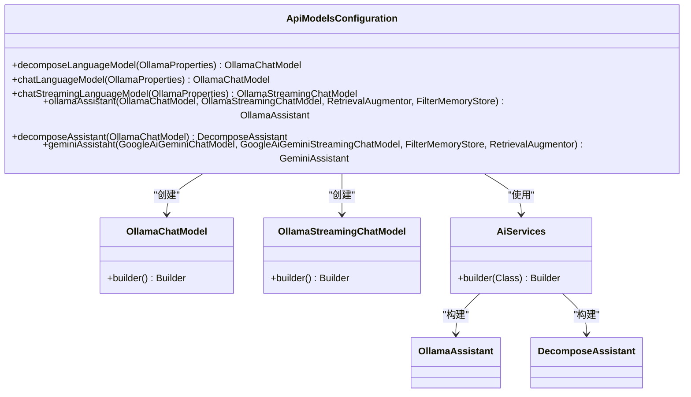
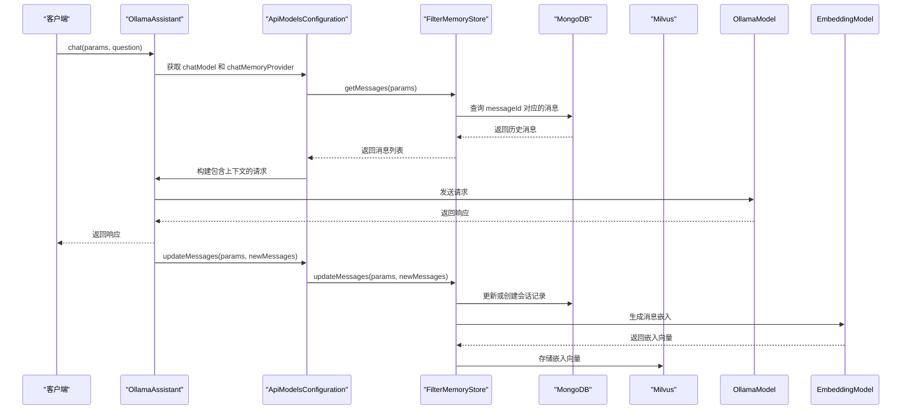

# Ollama模型集成

<cite>
**Referenced Files in This Document**   
- [OllamaAssistant.java](file://ai/src/main/java/com/shuanglin/bot/langchain4j/assistant/OllamaAssistant.java)
- [ApiModelsConfiguration.java](file://ai/src/main/java/com/shuanglin/bot/langchain4j/config/ApiModelsConfiguration.java)
- [FilterMemoryStore.java](file://ai/src/main/java/com/shuanglin/bot/langchain4j/store/FilterMemoryStore.java)
- [application.yaml](file://ai/src/main/resources/application.yaml)
- [system-message.txt](file://ai/src/main/resources/prompt/system-message.txt)
- [user-session-message.md](file://ai/src/main/resources/prompt/user-session-message.md)
- [kgKnowlage.md](file://ai/src/main/resources/prompt/kgKnowlage.md)
- [OllamaTest.java](file://ai/src/test/java/OllamaTest.java)
</cite>

## 目录
1. [OllamaAssistant接口设计](#ollamaassistant接口设计)
2. [模型配置与实例化](#模型配置与实例化)
3. [会话状态管理](#会话状态管理)
4. [流式响应机制](#流式响应机制)
5. [本地部署与性能调优](#本地部署与性能调优)

## OllamaAssistant接口设计

OllamaAssistant接口定义了与Ollama模型交互的核心方法，通过LangChain4j的注解机制实现了灵活的参数注入和会话管理。

**chat方法**是基础的同步聊天接口，接收一个包含会话标识和角色设定的`JsonObject`参数和用户问题。`@MemoryId`注解用于指定会话的唯一标识，确保对话上下文的连续性。`@UserMessage`注解则将用户输入的问题直接作为模型的用户消息。该方法通过`system-message.txt`和`user-session-message.md`中的模板，利用`@V`注解动态替换`role`和`question`变量，构建完整的提示词。

**groupChat方法**专为群组消息设计，同样使用`@MemoryId`来维护群组会话状态。它通过`@UserMessage`注解定义了一个简洁的模板，仅包含`{{question}}`占位符，确保群聊消息能被准确传递。

**chatStreamTokenStream方法**提供了流式响应功能，返回一个`TokenStream`对象。该方法接收`role`、`question`和`extraInfo`三个参数，均通过`@V`注解注入到提示词模板中。流式输出允许客户端在模型生成响应的同时逐步接收和显示内容，极大地提升了用户体验。

**Section sources**
- [OllamaAssistant.java](file://ai/src/main/java/com/shuanglin/bot/langchain4j/assistant/OllamaAssistant.java#L26-L42)

## 模型配置与实例化

系统通过`ApiModelsConfiguration`类中的Spring Bean配置，实现了对Ollama模型的精细化管理。

**decomposeLanguageModel Bean**专门用于任务分解场景，其核心特点是固定使用`gemma3:12b`大模型。该模型通过`OllamaChatModel.builder()`进行配置，其`baseUrl`和`temperature`等参数从`OllamaProperties`中读取。`gemma3:12b`模型因其强大的多步推理能力，被选为处理复杂任务分解的首选，能够有效解析和拆解用户提出的综合性问题。

**chatLanguageModel Bean**则用于常规的对话交互，其`modelName`同样从`OllamaProperties`中获取，支持灵活切换不同的模型。该Bean配置了详细的日志记录（`logRequests`和`logResponses`），便于调试和监控。

**decomposeAssistant Bean**的创建过程体现了高级的系统集成。它不仅注入了`decomposeLanguageModel`，还通过`loadKgKnowlagePrompt()`方法加载了`kgKnowlage.md`文件中的知识图谱系统提示词。这个提示词包含了元原则、本体论框架和Cypher生成规范等核心知识，使得`decomposeAssistant`在进行任务分解时，能够遵循严格的因果性和时间单向性原则，生成符合知识图谱规范的子任务。

**Diagram sources**
- [ApiModelsConfiguration.java](file://ai/src/main/java/com/shuanglin/bot/langchain4j/config/ApiModelsConfiguration.java#L41-L75)

**Section sources**
- [ApiModelsConfiguration.java](file://ai/src/main/java/com/shuanglin/bot/langchain4j/config/ApiModelsConfiguration.java#L41-L145)
- [kgKnowlage.md](file://ai/src/main/resources/prompt/kgKnowlage.md)

## 会话状态管理

系统通过`FilterMemoryStore`类实现了基于Redis和MongoDB的会话记忆存储，该类实现了`ChatMemoryStore`接口。

`FilterMemoryStore`的构造函数通过`@RequiredArgsConstructor`注解注入了`Gson`、`MongoTemplate`、`MilvusClientV2`和`EmbeddingModel`等关键依赖。`getMessages`方法根据传入的JSON参数（包含`messageId`）从MongoDB中查询历史消息，确保了会话上下文的恢复。`updateMessages`方法则负责更新会话状态，其逻辑分为两种场景：当`memoryId`存在时，将新消息追加到已有的会话记录中；当`memoryId`不存在时，则创建一条新的会话记录。此外，该方法还会将用户消息的嵌入向量（embedding）存储到Milvus向量数据库中，为后续的检索增强生成（RAG）提供支持。

在`ApiModelsConfiguration`中，`ollamaAssistant` Bean通过`AiServices.builder`配置了`chatMemoryProvider`，该提供者使用`MessageWindowChatMemory`并指定`maxMessages`为10，同时将`FilterMemoryStore`作为底层存储。这确保了每个会话的最近10条消息被持久化，从而实现了基于Redis的会话记忆。

**Diagram sources**
- [FilterMemoryStore.java](file://ai/src/main/java/com/shuanglin/bot/langchain4j/store/FilterMemoryStore.java#L23-L116)
- [ApiModelsConfiguration.java](file://ai/src/main/java/com/shuanglin/bot/langchain4j/config/ApiModelsConfiguration.java#L89-L105)

**Section sources**
- [FilterMemoryStore.java](file://ai/src/main/java/com/shuanglin/bot/langchain4j/store/FilterMemoryStore.java#L23-L116)
- [ApiModelsConfiguration.java](file://ai/src/main/java/com/shuanglin/bot/langchain4j/config/ApiModelsConfiguration.java#L89-L105)

## 流式响应机制

`OllamaStreamingChatModel`是实现流式响应的关键组件。与同步的`OllamaChatModel`不同，`OllamaStreamingChatModel`在配置上与`chatLanguageModel`保持一致，但其调用方式允许逐个接收生成的token。

`chatStreamTokenStream`方法返回一个`TokenStream`对象，客户端可以通过订阅该流来实时接收模型的输出。这种方式避免了用户在等待模型生成完整响应时的长时间空白，特别适用于生成长篇内容或需要即时反馈的交互场景。流式响应的配置在`ApiModelsConfiguration`中通过`chatStreamingLanguageModel` Bean完成，并在构建`OllamaAssistant`时被注入。

**Section sources**
- [OllamaAssistant.java](file://ai/src/main/java/com/shuanglin/bot/langchain4j/assistant/OllamaAssistant.java#L39-L42)
- [ApiModelsConfiguration.java](file://ai/src/main/java/com/shuanglin/bot/langchain4j/config/ApiModelsConfiguration.java#L77-L86)

## 本地部署与性能调优

### 本地部署与模型拉取
Ollama服务的本地部署可通过官方提供的命令行工具完成。首先，需要在目标机器上安装Ollama，然后通过`ollama serve`命令启动服务。模型的拉取和管理通过`ollama`命令行工具实现，例如，拉取`gemma3:12b`模型的命令为`ollama pull gemma3:12b`。在`application.yaml`配置文件中，`langchain4j.models.ollama.url`被设置为`http://8.138.204.38:11434`，指向了远程Ollama服务器的地址。

### 性能调优实践
1.  **模型选择**: 对于需要复杂推理的任务，应优先使用`gemma3:12b`等大模型；对于简单问答，可选用更轻量的模型以提高响应速度。
2.  **温度参数**: `temperature`参数（在`application.yaml`中配置为0.8）控制生成的随机性。降低温度值（如0.3-0.5）可使输出更确定和集中，提高温度值（如0.7-1.0）可增加输出的多样性和创造性。
3.  **上下文窗口**: `MessageWindowChatMemory`的`maxMessages`设置为10，这平衡了上下文信息的丰富度和内存消耗。可根据实际需求调整此值。
4.  **日志与监控**: 启用`logRequests`和`logResponses`有助于调试和分析模型行为，但在生产环境中应谨慎使用以避免性能开销。
5.  **向量数据库**: 利用Milvus存储消息嵌入，可以实现高效的语义搜索，为RAG提供强大的支持，从而提升回答的准确性和相关性。

**Section sources**
- [application.yaml](file://ai/src/main/resources/application.yaml)
- [OllamaTest.java](file://ai/src/test/java/OllamaTest.java)
- [ApiModelsConfiguration.java](file://ai/src/main/java/com/shuanglin/bot/langchain4j/config/ApiModelsConfiguration.java#L66-L86)
- [OllamaAssistant.java](file://ai/src/main/java/com/shuanglin/bot/langchain4j/assistant/OllamaAssistant.java)