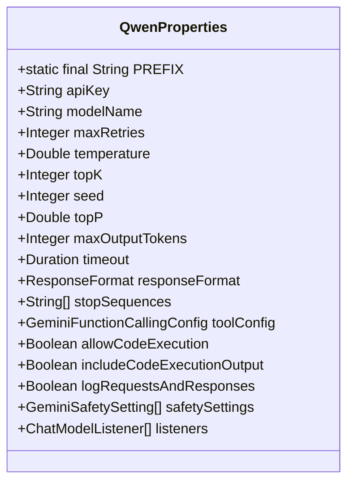
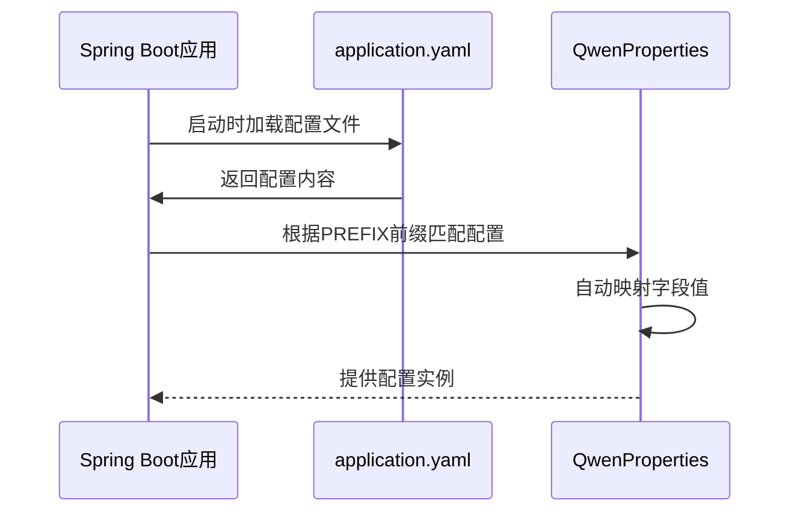
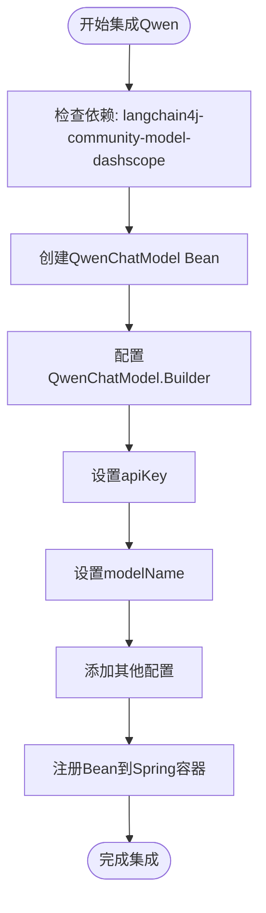

# 通义千问(Qwen)模型集成

<cite>
**Referenced Files in This Document**   
- [QwenProperties.java](file://ai/src/main/java/com/shuanglin/bot/langchain4j/config/vo/QwenProperties.java)
- [application.yaml](file://ai/src/main/resources/application.yaml)
- [EmbeddingConfig.java](file://ai/src/main/java/com/shuanglin/bot/langchain4j/rag/embedding/model/EmbeddingConfig.java)
- [ApiModelsConfiguration.java](file://ai/src/main/java/com/shuanglin/bot/langchain4j/config/ApiModelsConfiguration.java)
- [GeminiProperties.java](file://ai/src/main/java/com/shuanglin/bot/langchain4j/config/vo/GeminiProperties.java)
- [OllamaProperties.java](file://ai/src/main/java/com/shuanglin/bot/langchain4j/config/vo/OllamaProperties.java)
</cite>

## 目录
1. [简介](#简介)
2. [核心配置类分析](#核心配置类分析)
3. [配置参数详解](#配置参数详解)
4. [配置绑定机制](#配置绑定机制)
5. [模型集成扩展方案](#模型集成扩展方案)
6. [高级功能配置](#高级功能配置)
7. [API密钥获取与集成步骤](#api密钥获取与集成步骤)

## 简介
本文档详细说明了在项目中集成通义千问（Qwen）大语言模型的完整方案。基于`QwenProperties`配置类，系统阐述了`langchain4j.models.qwen`前缀下的各项参数配置方法和业务含义。文档解释了`QwenProperties`通过`@ConfigurationProperties`注解自动绑定`application.yaml`中配置项的机制，并指导开发者如何参照Gemini或Ollama的模式，利用DashScope API扩展Qwen支持。同时，文档描述了`responseFormat`、`toolConfig`、`safetySettings`等高级配置项在函数调用和内容安全过滤中的潜在应用。

## 核心配置类分析
`QwenProperties`是通义千问模型的核心配置类，负责定义所有与Qwen模型交互相关的配置参数。该类位于`com.shuanglin.bot.langchain4j.config.vo`包中，通过`@ConfigurationProperties`注解与`application.yaml`文件中的配置进行绑定。



**Diagram sources**
- [QwenProperties.java](file://ai/src/main/java/com/shuanglin/bot/langchain4j/config/vo/QwenProperties.java#L12-L33)

**Section sources**
- [QwenProperties.java](file://ai/src/main/java/com/shuanglin/bot/langchain4j/config/vo/QwenProperties.java#L12-L33)

## 配置参数详解
`QwenProperties`类定义了丰富的配置参数，用于精细化控制通义千问模型的行为。以下是主要配置项的详细说明：

### 基础连接参数
- **apiKey**: 通义千问API的密钥，用于身份验证和访问控制。
- **modelName**: 指定要使用的Qwen模型名称，如`text-embedding-v2`。
- **timeout**: 请求超时时间，类型为`Duration`，用于控制API调用的等待时间。

### 模型生成控制参数
- **temperature**: 控制模型输出的随机性，值在0.0到1.0之间。值越高，输出越随机和创造性；值越低，输出越确定和保守。
- **topP**: 核采样参数，控制生成文本的多样性。值越高，考虑的词汇范围越广。
- **topK**: 限制模型在生成每个token时考虑的最高概率的K个token。
- **maxOutputTokens**: 限制模型生成的最大token数量，防止过长的响应。

### 高级功能参数
- **responseFormat**: 指定模型响应的格式，可用于要求模型以特定结构（如JSON）返回数据。
- **toolConfig**: 配置函数调用功能，允许模型调用预定义的工具或函数。
- **safetySettings**: 安全设置列表，用于过滤不当或有害内容。
- **stopSequences**: 定义停止序列，当模型生成这些序列时，会停止生成。

### 执行与日志参数
- **allowCodeExecution**: 是否允许模型执行代码片段。
- **includeCodeExecutionOutput**: 是否将代码执行结果包含在最终响应中。
- **logRequestsAndResponses**: 是否记录请求和响应，用于调试和监控。

**Section sources**
- [QwenProperties.java](file://ai/src/main/java/com/shuanglin/bot/langchain4j/config/vo/QwenProperties.java#L16-L32)

## 配置绑定机制
`QwenProperties`类通过Spring Boot的`@ConfigurationProperties`注解实现了与`application.yaml`文件的自动绑定。该机制的核心是`PREFIX`常量，其值为`langchain4j.models.qwen`，指定了配置项在YAML文件中的前缀路径。



**Diagram sources**
- [QwenProperties.java](file://ai/src/main/java/com/shuanglin/bot/langchain4j/config/vo/QwenProperties.java#L15)
- [application.yaml](file://ai/src/main/resources/application.yaml#L38-L43)

**Section sources**
- [QwenProperties.java](file://ai/src/main/java/com/shuanglin/bot/langchain4j/config/vo/QwenProperties.java#L12-L15)
- [application.yaml](file://ai/src/main/resources/application.yaml#L38-L43)

## 模型集成扩展方案
虽然当前代码中未直接创建Qwen的ChatModel Bean，但可以通过参照Gemini或Ollama的模式来扩展Qwen支持。项目中已通过`EmbeddingConfig`类展示了如何使用`QwenEmbeddingModel`。



开发者可以参考`ApiModelsConfiguration`类中`googleAiGeminiChatModel`的实现方式，创建一个类似的`qwenChatModel`方法。关键在于使用`dev.langchain4j.community.model.dashscope`包中的`QwenChatModel`构建器，并注入`QwenProperties`配置。

**Diagram sources**
- [EmbeddingConfig.java](file://ai/src/main/java/com/shuanglin/bot/langchain4j/rag/embedding/model/EmbeddingConfig.java#L11-L18)
- [ApiModelsConfiguration.java](file://ai/src/main/java/com/shuanglin/bot/langchain4j/config/ApiModelsConfiguration.java#L100-L115)

**Section sources**
- [EmbeddingConfig.java](file://ai/src/main/java/com/shuanglin/bot/langchain4j/rag/embedding/model/EmbeddingConfig.java#L11-L18)
- [ApiModelsConfiguration.java](file://ai/src/main/java/com/shuanglin/bot/langchain4j/config/ApiModelsConfiguration.java#L100-L115)

## 高级功能配置
`QwenProperties`类继承了Gemini模型的高级配置结构，为未来功能扩展提供了基础。

### 函数调用配置
`toolConfig`字段使用`GeminiFunctionCallingConfig`类型，可用于配置模型的函数调用能力。通过定义工具和函数，可以让Qwen模型在对话中调用外部API或执行特定任务。

### 内容安全过滤
`safetySettings`字段允许配置内容安全策略，通过`GeminiSafetySetting`列表定义不同类别的内容过滤规则，确保模型输出符合安全标准。

### 监听器机制
`listeners`字段支持添加`ChatModelListener`，可以监听模型的请求和响应事件，用于日志记录、性能监控或自定义处理。

**Section sources**
- [QwenProperties.java](file://ai/src/main/java/com/shuanglin/bot/langchain4j/config/vo/QwenProperties.java#L27-L32)

## API密钥获取与集成步骤
以下是将通义千问API密钥集成到项目的完整步骤：

1. **获取API密钥**:
   - 访问阿里云官网并登录账户
   - 进入通义千问（Qwen）产品页面
   - 创建API密钥并复制密钥字符串

2. **配置项目**:
   - 在`application.yaml`文件中找到`langchain4j.models.qwen`部分
   - 将获取的API密钥填入`apiKey`字段
   - 根据需要配置`modelName`和其他参数

3. **验证集成**:
   - 启动应用并检查日志
   - 确认没有认证错误
   - 测试模型调用功能

```yaml
langchain4j:
  models:
    qwen:
      apiKey: sk-ef837a5f684c4ed087802c948857df5f
      modelName: text-embedding-v2
      temperature: 0.7
```

**Section sources**
- [application.yaml](file://ai/src/main/resources/application.yaml#L38-L43)
- [QwenProperties.java](file://ai/src/main/java/com/shuanglin/bot/langchain4j/config/vo/QwenProperties.java#L16)