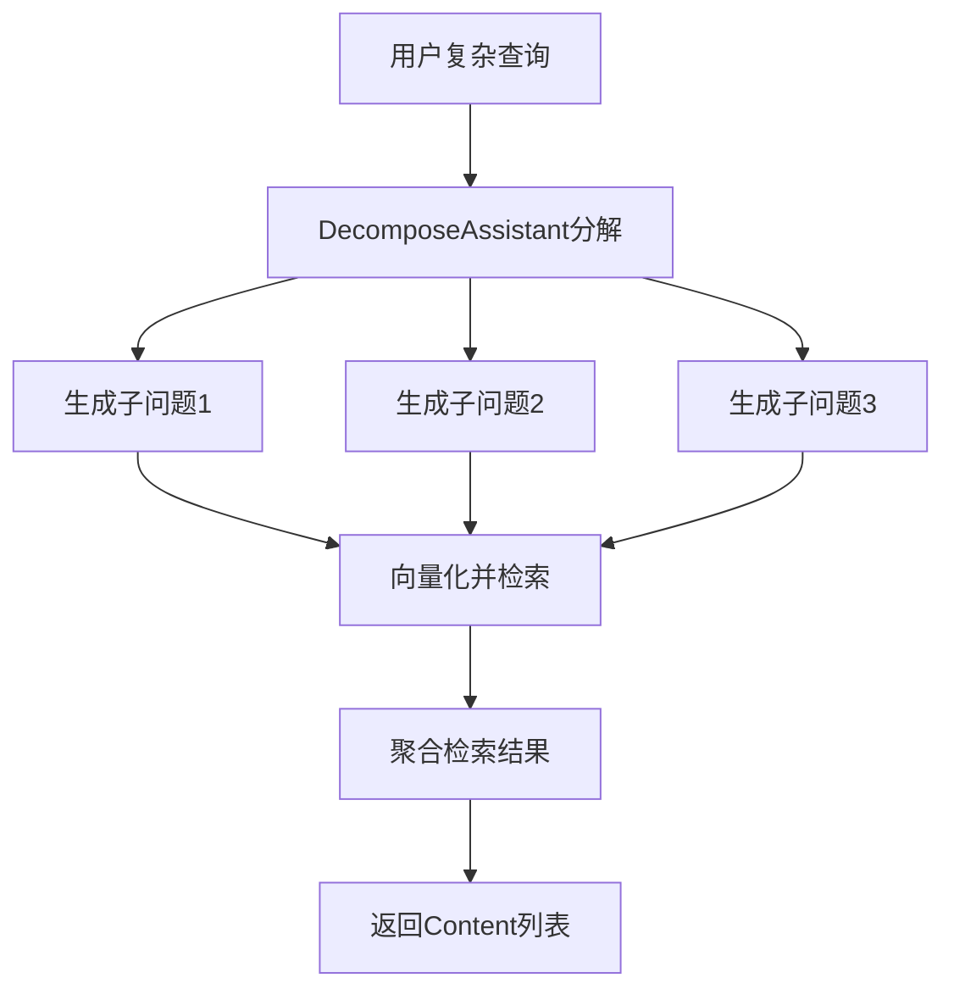
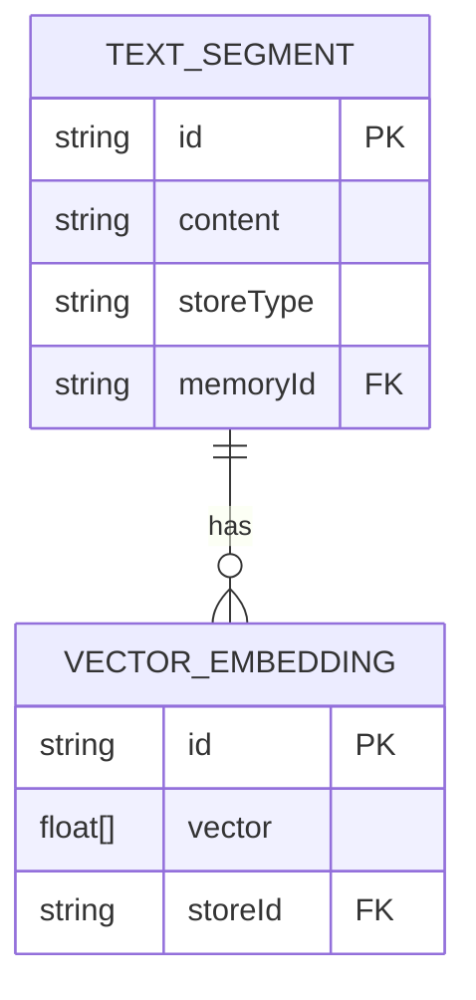
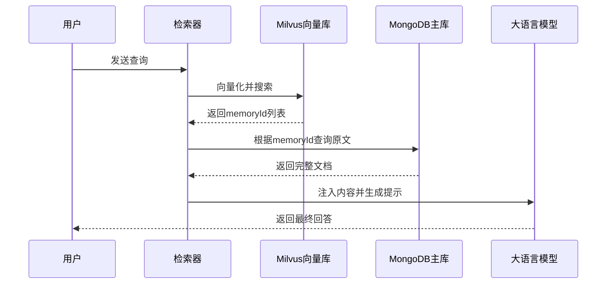

# RAG系统设计

<cite>
**本文档中引用的文件**  
- [MultiStepQueryRetriever.java](file://ai/src/main/java/com/shuanglin/bot/langchain4j/rag/retriever/MultiStepQueryRetriever.java)
- [DecomposeAssistant.java](file://ai/src/main/java/com/shuanglin/bot/langchain4j/assistant/DecomposeAssistant.java)
- [ChatContentInjector.java](file://ai/src/main/java/com/shuanglin/bot/langchain4j/rag/contentInjector/ChatContentInjector.java)
- [multiStepContentInjector.java](file://ai/src/main/java/com/shuanglin/bot/langchain4j/rag/contentInjector/multiStepContentInjector.java)
- [RagConfiguration.java](file://ai/src/main/java/com/shuanglin/bot/langchain4j/rag/RagConfiguration.java)
- [FilterQueryRetriever.java](file://ai/src/main/java/com/shuanglin/bot/langchain4j/rag/retriever/FilterQueryRetriever.java)
- [DBContentRetriever.java](file://ai/src/main/java/com/shuanglin/bot/langchain4j/rag/retriever/DBContentRetriever.java)
- [EmbeddingConfig.java](file://ai/src/main/java/com/shuanglin/bot/langchain4j/rag/embedding/model/EmbeddingConfig.java)
- [MilvusProperties.java](file://ai/src/main/java/com/shuanglin/bot/langchain4j/config/vo/MilvusProperties.java)
- [application.yaml](file://ai/src/main/resources/application.yaml)
</cite>

## 目录
1. [简介](#简介)
2. [RAG完整流程](#rag完整流程)
3. [多步查询与子问题分解](#多步查询与子问题分解)
4. [内容注入器](#内容注入器)
5. [检索器类型与职责](#检索器类型与职责)
6. [RAG配置机制](#rag配置机制)
7. [向量化与存储流程](#向量化与存储流程)
8. [RAG工作流图示](#rag工作流图示)
9. [性能优化策略](#性能优化策略)

## 简介
检索增强生成（Retrieval-Augmented Generation, RAG）系统通过结合外部知识库与大语言模型（LLM），提升回答的准确性与上下文相关性。本系统基于LangChain4j框架构建，支持复杂查询的分解、多源检索与结果增强。核心流程包括：用户查询接收、内容注入、检索执行、结果增强与最终回答生成。系统利用Milvus作为向量数据库，MongoDB作为主数据存储，并通过Spring Boot实现模块化配置。

## RAG完整流程
RAG系统的工作流程遵循严格的顺序，确保从用户输入到最终输出的每一步都经过精确处理。

1. **用户查询**：系统接收用户的自然语言问题。
2. **内容注入（ContentInjector）**：将检索到的相关内容与原始查询结合，构建成适合LLM理解的提示（Prompt）。
3. **检索（Retriever）**：根据查询内容，从向量数据库中检索最相关的文本片段。
4. **结果增强**：对检索结果进行聚合、排序与元数据补充，提升信息质量。
5. **生成回答**：将增强后的内容注入LLM，生成最终的回答。

该流程确保了系统既能利用实时知识库，又能发挥LLM的强大生成能力。

**Section sources**
- [ChatContentInjector.java](file://ai/src/main/java/com/shuanglin/bot/langchain4j/rag/contentInjector/ChatContentInjector.java#L17-L39)
- [multiStepContentInjector.java](file://ai/src/main/java/com/shuanglin/bot/langchain4j/rag/contentInjector/multiStepContentInjector.java#L15-L40)

## 多步查询与子问题分解
对于复杂的用户查询，系统采用`MultiStepQueryRetriever`结合`DecomposeAssistant`实现多步检索。

### 工作机制
1. **原始查询接收**：系统接收用户输入的复杂问题。
2. **子问题分解**：调用`DecomposeAssistant.decompose()`方法，利用LLM将原始问题分解为多个简单子问题。该方法要求返回以分号分隔的子问题列表。
3. **并行检索**：对每个子问题进行向量化，并在Milvus中并行执行相似度搜索。
4. **结果聚合**：将各子问题的检索结果合并，形成最终的内容列表。

此机制显著提升了对复合问题的处理能力，避免单一查询遗漏关键信息。

**Diagram sources**
- [MultiStepQueryRetriever.java](file://ai/src/main/java/com/shuanglin/bot/langchain4j/rag/retriever/MultiStepQueryRetriever.java#L36-L114)
- [DecomposeAssistant.java](file://ai/src/main/java/com/shuanglin/bot/langchain4j/assistant/DecomposeAssistant.java#L6-L48)

**Section sources**
- [MultiStepQueryRetriever.java](file://ai/src/main/java/com/shuanglin/bot/langchain4j/rag/retriever/MultiStepQueryRetriever.java#L36-L114)
- [DecomposeAssistant.java](file://ai/src/main/java/com/shuanglin/bot/langchain4j/assistant/DecomposeAssistant.java#L6-L48)

## 内容注入器
内容注入器负责将检索到的内容与用户查询整合，生成LLM可理解的输入提示。

### ChatContentInjector
- **功能**：将检索内容作为系统消息注入，适用于通用知识检索。
- **实现**：使用`storePromptTemplate`模板，将内容与用户消息拼接。
- **输出类型**：转换为`SystemMessage`。

### multiStepContentInjector
- **功能**：专为多步查询设计，注入前提剧情概要。
- **实现**：使用自定义模板，包含`content`和`userMessage`字段。
- **输出类型**：转换为`UserMessage`。

两种注入器通过Spring的`@Component`注解注册，可根据场景灵活切换。

**Section sources**
- [ChatContentInjector.java](file://ai/src/main/java/com/shuanglin/bot/langchain4j/rag/contentInjector/ChatContentInjector.java#L17-L39)
- [multiStepContentInjector.java](file://ai/src/main/java/com/shuanglin/bot/langchain4j/rag/contentInjector/multiStepContentInjector.java#L15-L40)

## 检索器类型与职责
系统实现了多种检索器，以适应不同场景的需求。

### MultiStepQueryRetriever
- **职责**：处理复杂查询，通过分解子问题提升检索覆盖率。
- **流程**：查询分解 → 向量化 → Milvus搜索 → MongoDB获取原文 → 返回Content。

### FilterQueryRetriever
- **职责**：支持基于元数据过滤的检索，如按模型名称筛选。
- **流程**：提取查询元数据 → 向量化 → 带过滤条件的Milvus搜索 → MongoDB查询 → 返回带元数据的Content。

### DBContentRetriever
- **职责**：直接从主数据库（MongoDB）检索结构化数据。
- **流程**：向量化查询 → Milvus搜索获取memoryId → MongoDB查询DBMessageDTO → 聚合内容返回。

各类检索器均实现`ContentRetriever`接口，确保API一致性。

**Section sources**
- [FilterQueryRetriever.java](file://ai/src/main/java/com/shuanglin/bot/langchain4j/rag/retriever/FilterQueryRetriever.java#L1-L152)
- [DBContentRetriever.java](file://ai/src/main/java/com/shuanglin/bot/langchain4j/rag/retriever/DBContentRetriever.java#L1-L138)

## RAG配置机制
`RagConfiguration`类通过Spring的`@Configuration`注解实现系统行为的集中配置。

### 配置内容
- **检索器配置**：可定义默认的`ContentRetriever`，支持自定义embeddingStore与embeddingModel。
- **增强器配置**：配置`RetrievalAugmentor`，包含查询转换、路由、聚合与注入器。
- **注解说明**：`@Bean`注解用于注册Spring Bean，`@Primary`指定默认实现。

尽管当前配置类中相关Bean被注释，但其结构清晰展示了RAG组件的组装方式。

**Section sources**
- [RagConfiguration.java](file://ai/src/main/java/com/shuanglin/bot/langchain4j/rag/RagConfiguration.java#L4-L51)

## 向量化与存储流程
文本向量化是RAG系统的核心预处理步骤，确保语义信息可被高效检索。

### 向量化实现
- **模型配置**：`EmbeddingConfig`类中定义了`qwenEmbeddingModel`，使用通义千问的嵌入模型。
- **向量生成**：通过`embeddingModel.embed()`或`embedAll()`方法将文本转换为向量。
- **维度设置**：由模型决定，如Qwen模型通常生成768或1024维向量。

### 存储架构
- **向量存储**：Milvus负责存储向量及其索引，支持高效相似度搜索。
- **主数据存储**：MongoDB存储原始文本与元数据，通过`memoryId`与向量关联。
- **初始化**：`MilvusInitializer`确保数据库与集合在应用启动时存在。

### 配置参数
- **MilvusProperties**：定义了`uri`、`topK`、`defaultCollectionName`等关键参数。
- **application.yaml**：外部化配置，便于环境间迁移。

**Diagram sources**
- [EmbeddingConfig.java](file://ai/src/main/java/com/shuanglin/bot/langchain4j/rag/embedding/model/EmbeddingConfig.java#L1-L72)
- [MilvusProperties.java](file://ai/src/main/java/com/shuanglin/bot/langchain4j/config/vo/MilvusProperties.java#L7-L31)
- [application.yaml](file://ai/src/main/resources/application.yaml#L1-L57)

**Section sources**
- [EmbeddingConfig.java](file://ai/src/main/java/com/shuanglin/bot/langchain4j/rag/embedding/model/EmbeddingConfig.java#L1-L72)
- [MilvusProperties.java](file://ai/src/main/java/com/shuanglin/bot/langchain4j/config/vo/MilvusProperties.java#L7-L31)

## RAG工作流图示
以下流程图概括了RAG系统的整体工作流。

**Diagram sources**
- [MultiStepQueryRetriever.java](file://ai/src/main/java/com/shuanglin/bot/langchain4j/rag/retriever/MultiStepQueryRetriever.java#L36-L114)
- [DBContentRetriever.java](file://ai/src/main/java/com/shuanglin/bot/langchain4j/rag/retriever/DBContentRetriever.java#L1-L138)

## 性能优化策略
为提升系统响应速度与资源利用率，可采用以下优化策略：

### 检索结果缓存
- **实现方式**：使用Redis作为缓存层，存储高频查询的检索结果。
- **缓存键**：以查询文本的哈希值作为键。
- **过期策略**：设置合理的TTL，平衡数据新鲜度与缓存命中率。

### 并行处理
- **子问题并行检索**：`MultiStepQueryRetriever`对分解后的子问题并行执行向量搜索，显著缩短响应时间。

### 索引优化
- **Milvus索引**：为`userId`、`groupId`等字段创建索引，加速过滤查询。
- **向量索引**：使用合适的索引类型（如IVF_FLAT）提升搜索效率。

### 批量操作
- **批量向量化**：对多个子问题使用`embedAll()`进行批量向量化，减少模型调用开销。

这些策略共同保障了系统在高并发场景下的稳定与高效。

**Section sources**
- [MultiStepQueryRetriever.java](file://ai/src/main/java/com/shuanglin/bot/langchain4j/rag/retriever/MultiStepQueryRetriever.java#L36-L114)
- [FilterQueryRetriever.java](file://ai/src/main/java/com/shuanglin/bot/langchain4j/rag/retriever/FilterQueryRetriever.java#L1-L152)