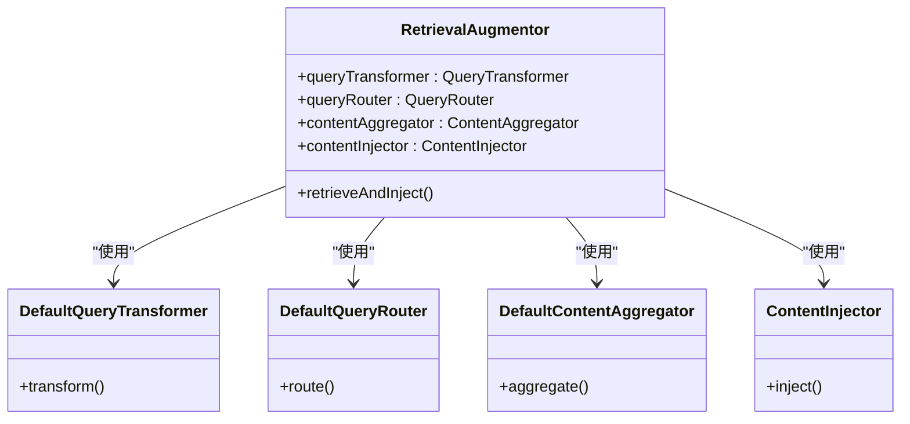
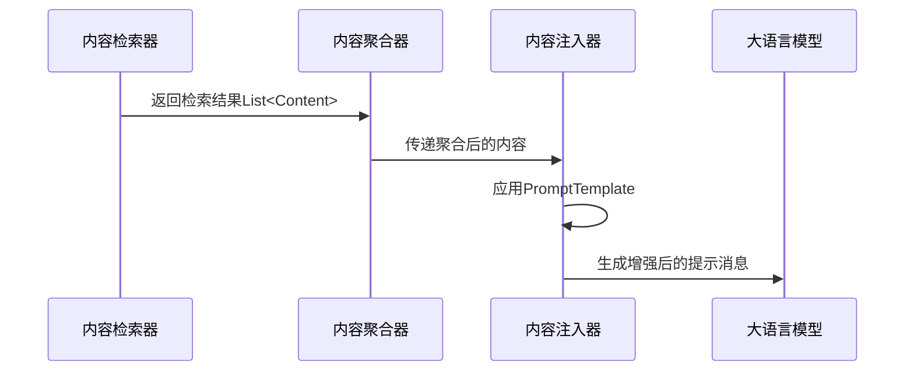

# RAG系统配置

<cite>
**本文档中引用的文件**  
- [RagConfiguration.java](file://ai/src/main/java/com/shuanglin/bot/langchain4j/rag/RagConfiguration.java)
- [AugmentConfig.java](file://ai/src/main/java/com/shuanglin/bot/langchain4j/rag/AugmentConfig.java)
- [MilvusEmbeddingStoreConfig.java](file://ai/src/main/java/com/shuanglin/bot/langchain4j/rag/MilvusEmbeddingStoreConfig.java)
- [ChatContentInjector.java](file://ai/src/main/java/com/shuanglin/bot/langchain4j/rag/contentInjector/ChatContentInjector.java)
- [multiStepContentInjector.java](file://ai/src/main/java/com/shuanglin/bot/langchain4j/rag/contentInjector/multiStepContentInjector.java)
- [MultiStepQueryRetriever.java](file://ai/src/main/java/com/shuanglin/bot/langchain4j/rag/retriever/MultiStepQueryRetriever.java)
- [FilterQueryRetriever.java](file://ai/src/main/java/com/shuanglin/bot/langchain4j/rag/retriever/FilterQueryRetriever.java)
- [ContentQueryRetriever.java](file://ai/src/main/java/com/shuanglin/bot/langchain4j/rag/retriever/ContentQueryRetriever.java)
- [DBContentRetriever.java](file://ai/src/main/java/com/shuanglin/bot/langchain4j/rag/retriever/DBContentRetriever.java)
</cite>

## 目录
1. [简介](#简介)
2. [核心配置结构](#核心配置结构)
3. [向量存储检索器配置](#向量存储检索器配置)
4. [检索增强器组件分析](#检索增强器组件分析)
5. [内容注入器实现](#内容注入器实现)
6. [查询检索器实现](#查询检索器实现)
7. [系统行为中枢作用](#系统行为中枢作用)
8. [结论](#结论)

## 简介
本文档深入解析RAG（检索增强生成）系统的核心配置结构，重点分析`RagConfiguration`类的设计意图与潜在扩展点。尽管部分配置被注释，但其架构设计体现了对查询转换、路由、内容聚合与注入等关键环节的完整控制能力。该配置类作为RAG系统的行为中枢，协调多个组件共同完成增强生成流程。

## 核心配置结构

`RagConfiguration`类作为Spring配置类，定义了RAG系统的核心Bean组件。虽然`embeddingStoreContentRetriever` Bean被注释，但其设计意图清晰：通过注入嵌入模型和嵌入存储，构建一个可配置的向量检索器。该类还定义了`retrievalAugmentor` Bean，通过组合查询转换器、查询路由器、内容聚合器和内容注入器，形成完整的检索增强流程。

**本节来源**  
- [RagConfiguration.java](file://ai/src/main/java/com/shuanglin/bot/langchain4j/rag/RagConfiguration.java#L4-L51)

## 向量存储检索器配置

被注释的`embeddingStoreContentRetriever` Bean展示了向量存储检索器的典型配置方式。该检索器接收用户查询，使用嵌入模型将其向量化，并在向量数据库（如Milvus）中执行相似度搜索。通过`maxResults`和`minScore`参数，可精确控制检索结果的数量和质量。

- **maxResults**: 设置最大返回结果数量，相当于数据库查询中的`LIMIT`，防止返回过多内容影响性能。
- **minScore**: 设置最小匹配分数阈值，相当于`WHERE score >= value`，确保只返回相关性较高的结果。

这种设计允许系统在召回率和精确率之间进行权衡，是RAG系统中关键的检索控制机制。

**本节来源**  
- [RagConfiguration.java](file://ai/src/main/java/com/shuanglin/bot/langchain4j/rag/RagConfiguration.java#L15-L35)

## 检索增强器组件分析

`retrievalAugmentor` Bean由多个组件协同工作，构成RAG系统的处理流水线：

**图示来源**  
- [RagConfiguration.java](file://ai/src/main/java/com/shuanglin/bot/langchain4j/rag/RagConfiguration.java#L40-L51)

### DefaultRetrievalAugmentor工作机制

`DefaultRetrievalAugmentor`是检索增强的核心协调者，其工作流程如下：

1. **查询转换（Query Transformation）**: 使用`DefaultQueryTransformer`对原始查询进行预处理，可能包括标准化、扩展或重写。
2. **查询路由（Query Routing）**: 通过`DefaultQueryRouter`决定使用哪个`ContentRetriever`进行内容检索。当前配置中使用默认路由器，可扩展为根据查询类型选择不同检索器。
3. **内容聚合（Content Aggregation）**: 使用`DefaultContentAggregator`将来自不同来源的检索结果进行合并与去重，形成统一的内容集。
4. **内容注入（Content Injection）**: 最后由`ContentInjector`将聚合后的内容注入到LLM提示中，完成增强生成的准备。

**本节来源**  
- [RagConfiguration.java](file://ai/src/main/java/com/shuanglin/bot/langchain4j/rag/RagConfiguration.java#L40-L51)
- [AugmentConfig.java](file://ai/src/main/java/com/shuanglin/bot/langchain4j/rag/AugmentConfig.java#L50-L65)

## 内容注入器实现

内容注入器负责将检索到的内容整合到最终发送给大语言模型的提示中。系统实现了两种注入器：

- **ChatContentInjector**: 使用名为`storePromptTemplate`的提示模板，将检索内容、用户消息及角色信息（如模型名称、指令、描述）注入系统消息。
- **multiStepContentInjector**: 专为多步RAG设计，使用独立的提示模板，将前提剧情概要和用户提问组合成新的用户消息。

**图示来源**  
- [ChatContentInjector.java](file://ai/src/main/java/com/shuanglin/bot/langchain4j/rag/contentInjector/ChatContentInjector.java#L17-L39)
- [multiStepContentInjector.java](file://ai/src/main/java/com/shuanglin/bot/langchain4j/rag/contentInjector/multiStepContentInjector.java#L15-L40)

**本节来源**  
- [ChatContentInjector.java](file://ai/src/main/java/com/shuanglin/bot/langchain4j/rag/contentInjector/ChatContentInjector.java#L1-L40)
- [multiStepContentInjector.java](file://ai/src/main/java/com/shuanglin/bot/langchain4j/rag/contentInjector/multiStepContentInjector.java#L1-L41)

## 查询检索器实现

系统实现了多种内容检索器，以适应不同场景：

- **MultiStepQueryRetriever**: 多步查询检索器，使用`DecomposeAssistant`将复杂查询分解为多个子问题，并行检索后聚合结果。
- **FilterQueryRetriever**: 支持基于元数据过滤的检索器，可在向量搜索时应用条件过滤。
- **ContentQueryRetriever**: 基础内容查询检索器，直接进行向量相似度搜索。
- **DBContentRetriever**: 数据库内容检索器，从向量数据库获取ID后，再从主数据库（如MongoDB）获取完整内容。

这些检索器体现了系统对不同数据源和查询模式的支持能力。

**本节来源**  
- [MultiStepQueryRetriever.java](file://ai/src/main/java/com/shuanglin/bot/langchain4j/rag/retriever/MultiStepQueryRetriever.java#L1-L115)
- [FilterQueryRetriever.java](file://ai/src/main/java/com/shuanglin/bot/langchain4j/rag/retriever/FilterQueryRetriever.java#L1-L152)
- [ContentQueryRetriever.java](file://ai/src/main/java/com/shuanglin/bot/langchain4j/rag/retriever/ContentQueryRetriever.java#L1-L88)
- [DBContentRetriever.java](file://ai/src/main/java/com/shuanglin/bot/langchain4j/rag/retriever/DBContentRetriever.java#L1-L138)

## 系统行为中枢作用

`RagConfiguration`类作为RAG系统的行为中枢，通过Spring的依赖注入机制，将各个组件有机地组合在一起。它不仅定义了核心处理流程，还提供了清晰的扩展点：

- 可通过启用`embeddingStoreContentRetriever` Bean来配置向量存储检索。
- 可替换`QueryRouter`实现以支持更复杂的路由逻辑。
- 可注册多个`ContentInjector` Bean以适应不同场景。
- 可通过`AugmentConfig`类定义不同的增强配置。

这种模块化设计使得系统具有高度的灵活性和可维护性，能够适应不断变化的业务需求。

**本节来源**  
- [RagConfiguration.java](file://ai/src/main/java/com/shuanglin/bot/langchain4j/rag/RagConfiguration.java#L4-L51)
- [AugmentConfig.java](file://ai/src/main/java/com/shuanglin/bot/langchain4j/rag/AugmentConfig.java#L1-L116)

## 结论
`RagConfiguration`类虽然当前部分配置被注释，但其设计充分体现了RAG系统的核心架构思想。通过解耦查询处理、内容检索、聚合与注入等环节，系统实现了高度模块化和可扩展性。未来可通过启用注释的配置、扩展检索器类型或优化注入模板等方式，进一步提升系统的智能化水平和应用范围。