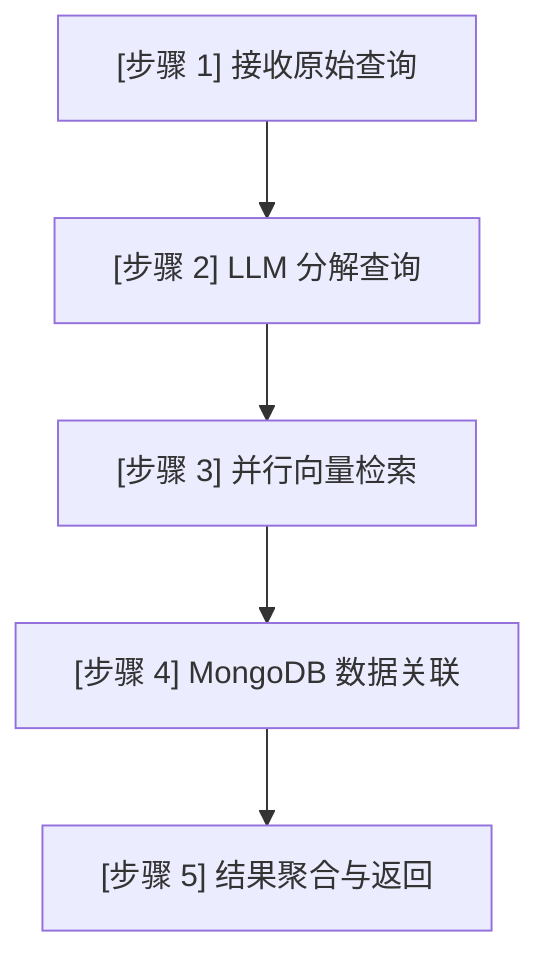
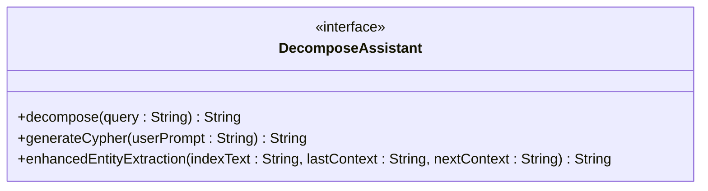

# 多步检索机制

<cite>
**Referenced Files in This Document**   
- [MultiStepQueryRetriever.java](file://ai/src/main/java/com/shuanglin/bot/langchain4j/rag/retriever/MultiStepQueryRetriever.java)
- [DecomposeAssistant.java](file://ai/src/main/java/com/shuanglin/bot/langchain4j/assistant/DecomposeAssistant.java)
- [MilvusProperties.java](file://ai/src/main/java/com/shuanglin/bot/langchain4j/config/vo/MilvusProperties.java)
- [MessageStoreEntity.java](file://dbModel/src/main/java/com/shuanglin/dao/message/MessageStoreEntity.java)
- [MessageEmbeddingMapper.java](file://dbModel/src/main/java/com/shuanglin/dao/milvus/MessageEmbeddingMapper.java)
- [MessageStoreEntityRepository.java](file://dbModel/src/main/java/com/shuanglin/dao/message/MessageStoreEntityRepository.java)
- [GeminiAssistant.java](file://ai/src/main/java/com/shuanglin/bot/langchain4j/assistant/GeminiAssistant.java)
</cite>

## 目录
1. [简介](#简介)
2. [核心组件分析](#核心组件分析)
3. [数据流与执行流程](#数据流与执行流程)
4. [依赖组件详解](#依赖组件详解)
5. [性能权衡分析](#性能权衡分析)
6. [日志记录与调试](#日志记录与调试)

## 简介
`MultiStepQueryRetriever` 是一个实现复杂查询处理的检索器，它遵循分解-检索-聚合的三步流程。该组件作为 `ContentRetriever` 接口的实现，专门用于处理需要多步推理的复杂自然语言查询。通过利用大语言模型（LLM）进行查询分解，并结合 Milvus 向量数据库执行相似度搜索，该检索器能够有效提升对复合问题的回答准确率。其设计核心在于将一个复杂的用户问题拆解为多个更简单的子问题，然后并行地从向量数据库中检索相关信息，最后将结果聚合返回。

## 核心组件分析

`MultiStepQueryRetriever` 类是本系统的核心，它实现了 `ContentRetriever` 接口，负责处理复杂的多步查询。其主要功能是接收一个原始查询，通过 `DecomposeAssistant` 将其分解为一系列子查询，然后利用嵌入模型和 Milvus 向量数据库进行检索，并最终从 MongoDB 中获取完整的文档内容。

该类的关键在于其 `retrieve` 方法，该方法定义了整个三步流程：首先接收原始查询，然后调用 LLM 进行分解，接着对所有子查询进行并行向量搜索，最后将检索到的 ID 用于从持久化存储中获取原始数据。

**Section sources**
- [MultiStepQueryRetriever.java](file://ai/src/main/java/com/shuanglin/bot/langchain4j/rag/retriever/MultiStepQueryRetriever.java#L36-L114)

## 数据流与执行流程

`MultiStepQueryRetriever` 的执行流程是一个清晰的五步过程，从接收到原始查询开始，到返回最终的 `Content` 列表结束。

**Diagram sources**
- [MultiStepQueryRetriever.java](file://ai/src/main/java/com/shuanglin/bot/langchain4j/rag/retriever/MultiStepQueryRetriever.java#L56-L113)

**Section sources**
- [MultiStepQueryRetriever.java](file://ai/src/main/java/com/shuanglin/bot/langchain4j/rag/retriever/MultiStepQueryRetriever.java#L56-L113)

### 步骤 1: 原始查询接收
流程始于 `retrieve` 方法接收一个 `Query` 对象。该对象的文本内容被提取并记录，标志着多步 RAG 流程的开始。日志会清晰地打印出原始查询内容。

### 步骤 2: 查询分解
这是多步检索的关键。`MultiStepQueryRetriever` 依赖注入的 `DecomposeAssistant` 组件，调用其 `decompose` 方法。该方法本质上是一个 LLM 调用，其提示词（prompt）被设计为将复杂问题分解为不超过三个的简单子问题。分解后的结果是一个以换行符分隔的字符串，随后被解析为 `TextSegment` 对象列表。

### 步骤 3: 并行检索
所有子查询被批量送入 `EmbeddingModel` 以生成对应的向量嵌入。这些向量被封装进 `SearchReq` 对象中，该对象的构建过程如下：
- **filterTemplateValues**: 设置过滤条件，确保只搜索 `storeType` 为 `document` 的数据。
- **data**: 包含所有子查询的向量列表。
- **topK**: 从 `MilvusProperties` 配置中获取，决定了每个子查询返回的最相似结果数量。

此 `SearchReq` 被发送到 `MessageEmbeddingMapper` 的客户端，执行一次向量搜索。Milvus 返回的结果包含多个匹配项，其中 `storeId` 字段被提取出来，形成一个 `messageIds` 列表。

### 步骤 4: 数据关联
`messageIds` 列表被用作 `MessageStoreEntityRepository` 的输入，通过 `findAllById` 方法从 MongoDB 中批量查询完整的文档实体。这一步实现了从向量数据库的“指针”到原始文本内容的映射。

### 步骤 5: 结果聚合
最后，从 MongoDB 获取的 `MessageStoreEntity` 列表被流式处理，每个实体的 `content` 字段被用来创建 `TextSegment`，并进一步包装成 `Content` 对象。这个 `Content` 列表即为最终的检索结果，返回给调用者。

## 依赖组件详解

`MultiStepQueryRetriever` 的功能实现依赖于多个关键组件，它们共同构成了完整的检索链。

### DecomposeAssistant 接口
`DecomposeAssistant` 是一个由 LangChain4j 的 `@UserMessage` 注解驱动的 AI 服务接口。其 `decompose` 方法的提示词明确要求 LLM 将输入问题分解为简单的子问题，并以分号分隔的列表形式返回，这确保了输出的可解析性。

**Diagram sources**
- [DecomposeAssistant.java](file://ai/src/main/java/com/shuanglin/bot/langchain4j/assistant/DecomposeAssistant.java#L6-L48)

**Section sources**
- [DecomposeAssistant.java](file://ai/src/main/java/com/shuanglin/bot/langchain4j/assistant/DecomposeAssistant.java#L6-L48)

### MilvusProperties 配置
`MilvusProperties` 是一个 Spring Boot 配置类，通过 `@ConfigurationProperties` 注解将 `application.yaml` 中 `milvus` 前缀下的配置项注入到应用中。其中 `topK` 参数是控制检索结果数量的关键，直接影响检索的召回率和性能。

**Section sources**
- [MilvusProperties.java](file://ai/src/main/java/com/shuanglin/bot/langchain4j/config/vo/MilvusProperties.java#L1-L32)

### 数据实体与存储
- **MessageStoreEntity**: 这是 MongoDB 中的文档实体，`memoryId` 和 `content` 字段是连接向量数据库和原始内容的关键。
- **MessageEmbeddingMapper**: 继承自 Milvus Plus 的 `MilvusMapper`，提供了与 Milvus 向量数据库交互的客户端。
- **MessageStoreEntityRepository**: Spring Data MongoDB 的 `MongoRepository`，用于执行对 `message_store` 集合的 CRUD 操作。

**Section sources**
- [MessageStoreEntity.java](file://dbModel/src/main/java/com/shuanglin/dao/message/MessageStoreEntity.java#L9-L27)
- [MessageEmbeddingMapper.java](file://dbModel/src/main/java/com/shuanglin/dao/milvus/MessageEmbeddingMapper.java#L1-L8)
- [MessageStoreEntityRepository.java](file://dbModel/src/main/java/com/shuanglin/dao/message/MessageStoreEntityRepository.java#L1-L10)

## 性能权衡分析

`MultiStepQueryRetriever` 的设计在性能和准确率之间做出了明确的权衡。

**优势（准确率提升）**:
- **查询分解**: 通过将复杂问题分解，系统可以更精确地定位到知识库中的相关片段，避免了单一查询可能带来的语义漂移。
- **并行检索**: 对所有子查询同时进行向量搜索，充分利用了向量数据库的高效性，理论上可以覆盖更广的知识面。

**劣势（延迟增加）**:
- **LLM 调用延迟**: 每次检索都必须先进行一次 LLM 调用以分解查询，这引入了显著的网络延迟和计算开销。
- **topK 参数影响**: `topK` 值越大，虽然可能提高召回率，但也会增加向量搜索的计算量和后续从 MongoDB 获取数据的 I/O 开销。

因此，该检索器适用于对回答质量要求极高、可以容忍一定延迟的场景，而不适用于需要极低延迟的简单问答。

## 日志记录与调试

`MultiStepQueryRetriever` 提供了详尽的日志记录，这对于调试和监控其执行流程至关重要。

日志严格按照执行顺序输出：
1.  **流程开始**: 以分隔线标记流程启动。
2.  **步骤 1**: 记录接收到的原始查询。
3.  **步骤 2**: 列出 LLM 分解出的每一个子问题。
4.  **步骤 3**: 记录从 Milvus 检索结果中提取出的 `memoryId` 列表。
5.  **步骤 4**: 报告从 MongoDB 查询到的文档数量。
6.  **步骤 5**: 显示最终返回的 `Content` 对象数量。
7.  **流程结束**: 以分隔线标记流程结束。

当 MongoDB 查询结果为空时，会发出警告，提示可能存在数据一致性问题。这些日志为开发者提供了清晰的执行视图，便于快速定位问题。

**Section sources**
- [MultiStepQueryRetriever.java](file://ai/src/main/java/com/shuanglin/bot/langchain4j/rag/retriever/MultiStepQueryRetriever.java#L56-L113)