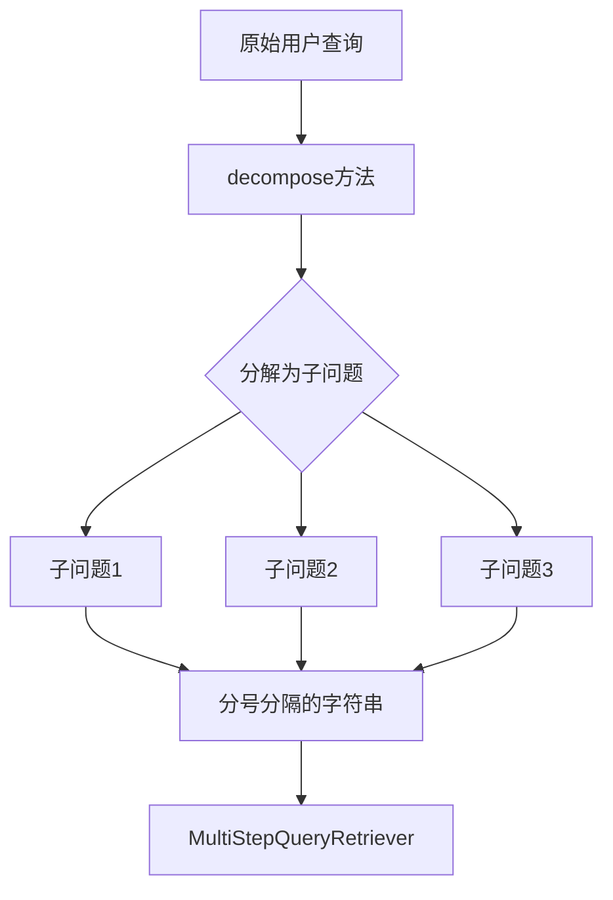
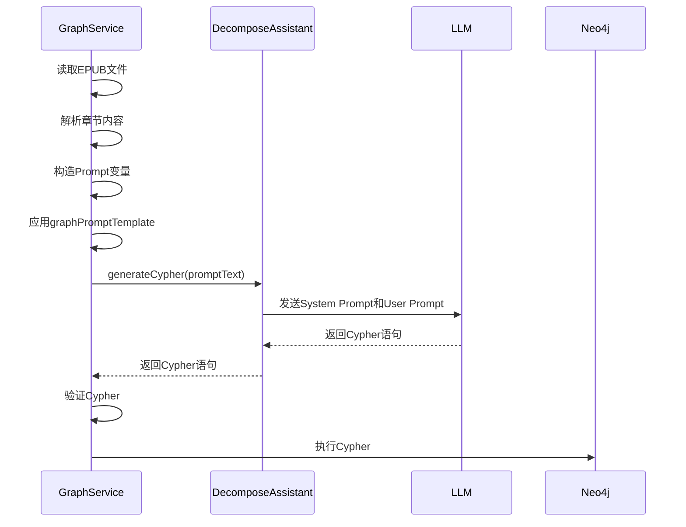

# 查询分解逻辑

<cite>
**Referenced Files in This Document**   
- [DecomposeAssistant.java](file://ai/src/main/java/com/shuanglin/bot/langchain4j/assistant/DecomposeAssistant.java)
- [kgKnowlage.md](file://file/kgKnowlage.md)
- [GraphService.java](file://ai/src/main/java/com/shuanglin/bot/service/GraphService.java)
- [system-message.txt](file://ai/src/main/resources/prompt/system-message.txt)
</cite>

## 目录
1. [引言](#引言)
2. [核心组件分析](#核心组件分析)
3. [查询分解方法详解](#查询分解方法详解)
4. [知识图谱构建方法分析](#知识图谱构建方法分析)
5. [系统提示词规范](#系统提示词规范)
6. [实际应用示例](#实际应用示例)
7. [组件影响分析](#组件影响分析)
8. [结论](#结论)

## 引言
`DecomposeAssistant`接口是RAG（检索增强生成）系统中的关键前置处理器，负责将复杂的用户查询分解为可操作的子问题，并将小说文本转换为知识图谱的Cypher语句。该组件通过三个核心方法——`decompose`、`generateCypher`和`enhancedEntityExtraction`——实现了查询的结构化处理和知识图谱的自动化构建。本文档将全面解析该接口的设计与功能，重点说明其在RAG系统中的关键作用。

## 核心组件分析

`DecomposeAssistant`接口定义了三个核心方法，分别用于查询分解和知识图谱构建。该接口通过依赖注入的方式被`GraphService`等服务类引用，作为知识图谱构建流程中的核心AI服务。

**Section sources**
- [DecomposeAssistant.java](file://ai/src/main/java/com/shuanglin/bot/langchain4j/assistant/DecomposeAssistant.java#L6-L48)
- [GraphService.java](file://ai/src/main/java/com/shuanglin/bot/service/GraphService.java#L37-L38)

## 查询分解方法详解

`decompose`方法是RAG系统查询预处理的核心，其主要功能是将复杂的用户查询分解为多个简单、可操作的子问题。该方法通过一个精心设计的用户提示词来指导大语言模型（LLM）完成分解任务。

### 方法设计与实现
`decompose`方法的提示词明确要求将问题分解为3个或更少的子问题，并以分号分隔的格式返回，且不添加任何其他文本。这种设计确保了输出的标准化和可解析性，为后续的多步检索（Multi-Step Retrieval）提供了结构化输入。



**Diagram sources**
- [DecomposeAssistant.java](file://ai/src/main/java/com/shuanglin/bot/langchain4j/assistant/DecomposeAssistant.java#L8-L9)

### 实际应用示例
假设用户查询为：“萧炎在斗气大陆的修炼历程中，经历了哪些重要的境界突破，这些突破与哪些关键事件和人物有关？”

`decompose`方法的输出可能为：
```
萧炎在斗气大陆的修炼历程中经历了哪些境界突破；萧炎的每次境界突破是由哪些关键事件引起的；萧炎的境界突破过程中与哪些重要人物有过交集
```

这种分解方式将一个复杂的、多维度的问题拆解为三个聚焦的子问题，每个子问题都可以被独立检索和回答，从而显著提高了RAG系统的准确率和召回率。

**Section sources**
- [DecomposeAssistant.java](file://ai/src/main/java/com/shuanglin/bot/langchain4j/assistant/DecomposeAssistant.java#L8-L9)

## 知识图谱构建方法分析

`DecomposeAssistant`接口提供了两个用于知识图谱构建的方法：`generateCypher`和`enhancedEntityExtraction`。这两个方法共同实现了从非结构化的小说文本到结构化的知识图谱的转换。

### generateCypher方法

`generateCypher`方法是通用的知识图谱生成入口，它接收一个用户提示词（userPrompt）作为输入，并返回符合规范的Neo4j Cypher语句。该方法不直接定义提示词，而是依赖于外部传入的完整提示词，这使得它具有高度的灵活性和可配置性。

#### 调用流程
该方法主要在`GraphService`的`readStory`和`readStoryWithLimit`方法中被调用。调用流程如下：
1.  `GraphService`读取EPUB文件并解析出章节内容。
2.  构造包含上下文信息（上一章、当前章、下一章）和元数据（章节标题、索引）的提示词变量。
3.  使用`graphPromptTemplate`应用这些变量，生成最终的用户提示词。
4.  将生成的提示词传递给`decomposeAssistant.generateCypher()`方法。
5.  接收并验证返回的Cypher语句，然后执行到Neo4j数据库。



**Diagram sources**
- [GraphService.java](file://ai/src/main/java/com/shuanglin/bot/service/GraphService.java#L124-L169)
- [GraphService.java](file://ai/src/main/java/com/shuanglin/bot/service/GraphService.java#L329-L463)

### enhancedEntityExtraction方法

`enhancedEntityExtraction`方法是一个专门用于小说文本处理的实体提取方法。它接收当前章节、上一章节和下一章节的完整文本作为输入，利用上下文信息进行更精准的实体、关系和属性提取。

#### 上下文感知机制
该方法的上下文感知机制体现在：
-   **上一章内容（lastContext）**：用于确认实体名称的一致性，推断实体的前置状态。例如，如果上一章提到主角“萧炎”是“斗之气三段”，那么在当前章中，可以推断这是他的初始状态。
-   **下一章内容（nextContext）**：用于消除代词歧义和理解语境。例如，当前章中提到“他”，通过查看下一章的内容，可以确定“他”指的是谁。

#### 信息提取边界约束
该方法严格遵守“信息提取边界约束”：
-   **唯一信息来源**：所有新的实体、事件和状态必须且只能从`indexText`（当前章）中提取。
-   **禁止从前文提取**：`lastContext`仅用于确认和推断，不能从中创建新的Cypher语句。
-   **禁止从后文生成**：`nextContext`仅用于消除歧义，不能基于它生成未来的事件。

**Section sources**
- [DecomposeAssistant.java](file://ai/src/main/java/com/shuanglin/bot/langchain4j/assistant/DecomposeAssistant.java#L18-L47)

## 系统提示词规范

知识图谱的构建质量高度依赖于系统提示词（System Prompt）的规范性。`kgKnowlage.md`文件定义了整个知识图谱的本体论框架、规则体系和技术规范，是生成Cypher语句的“权威来源”。

### 双Prompt协作架构
系统采用“双Prompt协作架构”：
-   **System Prompt (`kgKnowlage.md`)**：作为LLM的系统级约束，定义了本体论框架、通用规则、领域实体设计规范。它在整个会话期间保持不变，为所有任务提供统一的理论基础。
-   **User Prompt (`graphPromptTemplate`)**：作为任务级指令，提供具体的上下文、操作指南和示例。它引用System Prompt的规范，但不重复其内容。

这种架构确保了规范的单一数据源，避免了版本不一致的问题。

### 标签与关系类型规范
`kgKnowlage.md`对节点标签和关系类型有严格的定义：
-   **节点标签**：采用双标签继承机制，如`:Entity:Character`和`:Event:StoryEvent`。这既保证了领域特异性，又维护了本体论的统一性。
-   **关系类型**：使用英文大写，如`:GENERATES`、`:TRANSFORMS`、`:FAMILY_OF`。关系类型只能有一个名称，额外信息通过属性存储。

### 属性命名规范
所有属性键名和值（业务相关）必须使用中文，例如`name`、`描述`、`等级`、`拥有者`等。这保证了知识图谱的可读性和一致性。

**Section sources**
- [kgKnowlage.md](file://file/kgKnowlage.md#L0-L932)
- [GraphService.java](file://ai/src/main/java/com/shuanglin/bot/service/GraphService.java#L70-L122)

## 实际应用示例

以下是一个从自然语言到结构化查询的完整转换过程示例。

### 输入
**当前章内容 (indexText):**
“萧炎在药老的指导下，终于突破了斗之气三段的瓶颈，成功晋升为斗者。他激动地大喊：‘我终于不是废物了！’”

### 处理过程
1.  `GraphService`聚合当前章内容，并获取上一章和下一章的上下文。
2.  构造`graphPromptTemplate`的变量，包括`indexText`、`lastContext`、`chapterIndex`等。
3.  生成完整的用户提示词，并调用`decomposeAssistant.generateCypher()`。

### 输出 (Cypher语句)
```
MERGE (c:Entity:Character {name: "萧炎"})
MERGE (e:Event:StoryEvent {
  uuid: randomUUID(),
  timestamp: datetime('2025-01-05T00:00:00'),
  eventType: 'Transformation',
  source: '第5章 突破',
  confidence: 1.0,
  description: '境界突破',
  chapterIndex: 5,
  章节: '第5章'
})
MERGE (oldState:State {
  valid_from_timestamp: datetime('2025-01-04T00:00:00'),
  valid_to_timestamp: datetime('2025-01-05T00:00:00'),
  stateType: '境界状态',
  stateValue: '斗之气三段',
  境界: '斗之气三段',
  称号: '废物'
})
MERGE (newState:State {
  uuid: randomUUID(),
  valid_from_timestamp: datetime('2025-01-05T00:00:00'),
  valid_to_timestamp: null,
  stateType: '境界状态',
  stateValue: '斗者',
  境界: '斗者',
  称号: '天才'
})
MERGE (e)-[:TRANSFORMS]->(c)
MERGE (e)-[:REQUIRES_STATE {required_condition: '境界=斗之气三段'}]->(oldState)
MERGE (e)-[:CREATES_STATE]->(newState)
MERGE (c)-[:CURRENT_STATE]->(newState)
MERGE (c)-[:HAS_HISTORICAL_STATE]->(oldState)
```

此Cypher语句精确地捕捉了“萧炎”从“斗之气三段”到“斗者”的状态转换，创建了相应的事件、实体和状态节点，并建立了正确的关系。

**Section sources**
- [kgKnowlage.md](file://file/kgKnowlage.md#L0-L932)
- [GraphService.java](file://ai/src/main/java/com/shuanglin/bot/service/GraphService.java#L329-L463)

## 组件影响分析

`DecomposeAssistant`组件对整体RAG系统的准确率有着决定性的影响。

### 对检索准确率的提升
`decompose`方法通过将复杂查询分解为原子化的子问题，使得检索器可以针对每个子问题进行精确检索。这避免了在单一查询中因关键词过多而导致的语义漂移和噪声引入，显著提高了检索的准确率和相关性。

### 对知识图谱质量的保障
`generateCypher`和`enhancedEntityExtraction`方法通过严格的提示词工程和验证规则，确保了生成的知识图谱数据的高质量和一致性。`kgKnowlage.md`中定义的因果性原则和时间单向性原则，使得知识图谱不仅是一个信息库，更是一个能够进行因果推理的动态模型。

### 系统健壮性
该组件的设计体现了高度的防御性编程思想。例如，`GraphService`中的`validate`方法会对生成的Cypher进行格式和逻辑验证，`injectMetadata`方法会注入隔离元数据以防止数据污染。这些机制共同保障了整个系统的稳定性和可靠性。

**Section sources**
- [DecomposeAssistant.java](file://ai/src/main/java/com/shuanglin/bot/langchain4j/assistant/DecomposeAssistant.java#L6-L48)
- [GraphService.java](file://ai/src/main/java/com/shuanglin/bot/service/GraphService.java#L171-L327)

## 结论
`DecomposeAssistant`接口是整个RAG系统和知识图谱构建流程的智能核心。它通过`decompose`方法实现了查询的精准分解，为多步检索奠定了基础；通过`generateCypher`和`enhancedEntityExtraction`方法，结合`kgKnowlage.md`的严格规范，实现了从非结构化文本到高质量结构化知识图谱的自动化转换。该组件的设计充分体现了提示词工程、上下文感知和系统架构的精妙结合，是提升系统整体性能和准确率的关键所在。