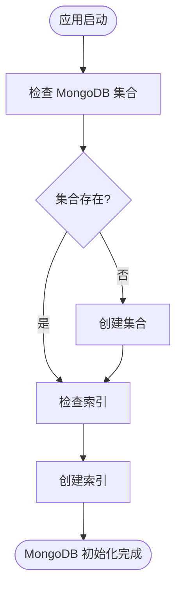
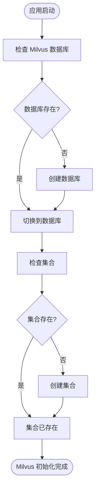
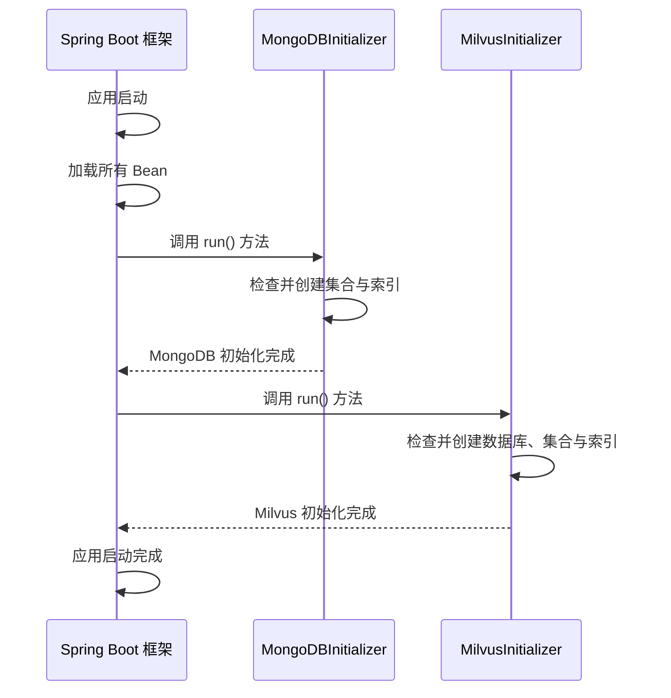

# 初始化流程

<cite>
**Referenced Files in This Document**   
- [MongoDBInitializer.java](file://ai/src/main/java/com/shuanglin/bot/config/initializer/MongoDBInitializer.java)
- [MilvusInitializer.java](file://ai/src/main/java/com/shuanglin/bot/config/initializer/MilvusInitializer.java)
- [application.yaml](file://ai/src/main/resources/application.yaml)
</cite>

## 目录
1. [引言](#引言)
2. [核心初始化器分析](#核心初始化器分析)
3. [MongoDB 初始化流程](#mongodb-初始化流程)
4. [Milvus 初始化流程](#milvus-初始化流程)
5. [初始化流程时序图](#初始化流程时序图)
6. [配置参数说明](#配置参数说明)

## 引言
在Spring Boot应用启动过程中，确保所有依赖的数据存储服务（如数据库、向量数据库）已正确配置并处于可用状态至关重要。本项目通过实现`ApplicationRunner`接口的两个核心初始化器——`MongoDBInitializer`和`MilvusInitializer`，在应用上下文完全加载后自动执行一系列检查和配置任务。这些任务包括创建必要的数据集合（Collections）和索引（Indexes），从而为应用的正常运行奠定了坚实的数据基础。

## 核心初始化器分析
`MongoDBInitializer`和`MilvusInitializer`是应用启动时执行关键数据层准备工作的两个核心组件。它们均被Spring框架的`@Component`注解标记，使其成为Spring IoC容器管理的Bean。通过实现`ApplicationRunner`接口，它们能够在应用启动的最后阶段、所有Bean初始化完成后，自动执行其`run`方法。

**Section sources**
- [MongoDBInitializer.java](file://ai/src/main/java/com/shuanglin/bot/config/initializer/MongoDBInitializer.java#L18-L22)
- [MilvusInitializer.java](file://ai/src/main/java/com/shuanglin/bot/config/initializer/MilvusInitializer.java#L20-L24)

## MongoDB 初始化流程
`MongoDBInitializer`负责与MongoDB数据库的交互，确保应用所需的所有集合及其索引都已正确创建。

### 集合与索引创建
该初始化器会检查并创建以下四个核心集合：
1.  **`model` 集合**：用于存储模型信息。为此集合的`modelName`字段创建了**唯一索引**，防止模型名称重复。
2.  **`groupModelPermissions` 集合**：用于存储群组模型权限。为此集合的`groupId`和`modelId`字段创建了**复合唯一索引**，确保一个群组对一个模型的权限记录是唯一的，并为`groupId`创建了普通索引以优化查询。
3.  **`userGroupModelSettings` 集合**：用于存储用户在群组中的模型设置。为此集合的`userId`和`groupId`字段创建了**复合唯一索引**，确保一个用户在一个群组中只能有一条设置记录。
4.  **`message_store` 集合**：用于存储消息知识。为此集合的`lastChatTime`字段创建了**倒序索引**，以便高效地按时间顺序检索最新的聊天记录。

此流程通过`MongoTemplate`与MongoDB进行通信，首先检查集合是否存在，若不存在则创建，然后确保所有必要的索引都已建立。

**Diagram sources**
- [MongoDBInitializer.java](file://ai/src/main/java/com/shuanglin/bot/config/initializer/MongoDBInitializer.java#L30-L144)

**Section sources**
- [MongoDBInitializer.java](file://ai/src/main/java/com/shuanglin/bot/config/initializer/MongoDBInitializer.java#L30-L144)

## Milvus 初始化流程
`MilvusInitializer`负责与Milvus向量数据库的交互，确保用于RAG（检索增强生成）功能的向量集合已准备就绪。

### 集合与Schema配置
该初始化器的执行流程如下：
1.  **数据库检查与创建**：尝试描述指定的数据库（`milvusDB`）。如果数据库不存在，则创建它。
2.  **切换数据库上下文**：将客户端操作上下文切换到目标数据库。
3.  **集合检查与创建**：尝试描述指定的集合（`novelCollection`）。如果集合不存在，则根据预定义的Schema创建它。
4.  **Schema定义**：新创建的集合包含以下字段：
    *   `id` (VarChar): 通用ID。
    *   `userId` (VarChar): 用户ID。
    *   `groupId` (VarChar): 群组ID。
    *   `embeddings` (FloatVector): 存储1536维的向量嵌入。
    *   `messageId` (VarChar): 消息ID，作为主键。
    *   `memoryId` (VarChar): 记忆ID。
5.  **索引创建**：为`userId`、`groupId`和`embeddings`字段创建索引。其中，向量字段`embeddings`使用`FLAT`索引和`L2`距离度量，以支持高效的向量相似性搜索。

此流程通过`MilvusClientV2`与Milvus服务器通信，确保向量数据库的结构符合应用预期。

**Diagram sources**
- [MilvusInitializer.java](file://ai/src/main/java/com/shuanglin/bot/config/initializer/MilvusInitializer.java#L36-L140)

**Section sources**
- [MilvusInitializer.java](file://ai/src/main/java/com/shuanglin/bot/config/initializer/MilvusInitializer.java#L36-L140)

## 初始化流程时序图
下图展示了应用启动时，两个初始化器如何被Spring框架调用的时序。

**Diagram sources**
- [MongoDBInitializer.java](file://ai/src/main/java/com/shuanglin/bot/config/initializer/MongoDBInitializer.java#L25-L27)
- [MilvusInitializer.java](file://ai/src/main/java/com/shuanglin/bot/config/initializer/MilvusInitializer.java#L27-L29)

## 配置参数说明
初始化器的行为由`application.yaml`文件中的配置项驱动，实现了环境的灵活性。

| 配置项 | 作用 | 示例值 |
| :--- | :--- | :--- |
| `spring.data.mongodb.database` | 指定MongoDB的数据库名称 | `storeDB` |
| `spring.data.milvus.defaultDatabaseName` | 指定Milvus的默认数据库名称 | `milvusDB` |
| `spring.data.milvus.defaultCollectionName` | 指定Milvus的默认集合名称 | `novelCollection` |
| `milvus.uri` | 指定Milvus服务器的连接地址 | `http://8.138.204.38:19530` |

**Section sources**
- [application.yaml](file://ai/src/main/resources/application.yaml#L10-L20)
- [application.yaml](file://ai/src/main/resources/application.yaml#L50-L57)