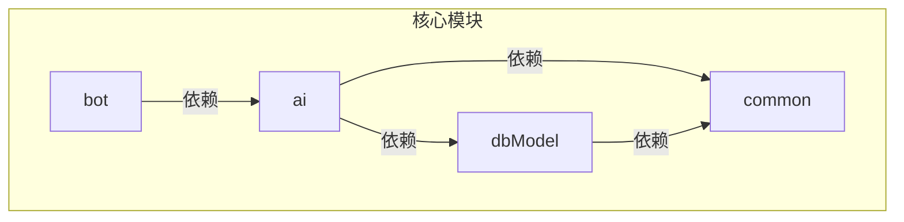

# 技术栈与依赖

<cite>
**本文档中引用的文件**  
- [ai/pom.xml](file://ai/pom.xml)
- [bot/pom.xml](file://bot/pom.xml)
- [common/pom.xml](file://common/pom.xml)
- [dbModel/pom.xml](file://dbModel/pom.xml)
- [ai/src/main/resources/application.yaml](file://ai/src/main/resources/application.yaml)
- [bot/src/main/resources/application.yaml](file://bot/src/main/resources/application.yaml)
- [ai/src/main/java/com/shuanglin/bot/langchain4j/config/vo/GeminiProperties.java](file://ai/src/main/java/com/shuanglin/bot/langchain4j/config/vo/GeminiProperties.java)
- [ai/src/main/java/com/shuanglin/bot/langchain4j/config/vo/OllamaProperties.java](file://ai/src/main/java/com/shuanglin/bot/langchain4j/config/vo/OllamaProperties.java)
- [ai/src/main/java/com/shuanglin/bot/langchain4j/config/vo/MilvusProperties.java](file://ai/src/main/java/com/shuanglin/bot/langchain4j/config/vo/MilvusProperties.java)
- [ai/src/main/java/com/shuanglin/bot/langchain4j/assistant/GeminiAssistant.java](file://ai/src/main/java/com/shuanglin/bot/langchain4j/assistant/GeminiAssistant.java)
- [ai/src/main/java/com/shuanglin/bot/langchain4j/assistant/OllamaAssistant.java](file://ai/src/main/java/com/shuanglin/bot/langchain4j/assistant/OllamaAssistant.java)
- [ai/src/main/java/com/shuanglin/bot/langchain4j/rag/retriever/DBContentRetriever.java](file://ai/src/main/java/com/shuanglin/bot/langchain4j/rag/retriever/DBContentRetriever.java)
- [ai/src/main/java/com/shuanglin/bot/langchain4j/store/RedisMemoryStore.java](file://ai/src/main/java/com/shuanglin/bot/langchain4j/store/RedisMemoryStore.java)
- [ai/src/main/java/com/shuanglin/bot/langchain4j/config/DocumentInitializer.java](file://ai/src/main/java/com/shuanglin/bot/langchain4j/config/DocumentInitializer.java)
- [ai/src/main/java/com/shuanglin/bot/config/initializer/MongoDBInitializer.java](file://ai/src/main/java/com/shuanglin/bot/config/initializer/MongoDBInitializer.java)
- [dbModel/src/main/java/com/shuanglin/dao/milvus/MessageEmbeddingEntity.java](file://dbModel/src/main/java/com/shuanglin/dao/milvus/MessageEmbeddingEntity.java)
- [dbModel/src/main/java/com/shuanglin/dao/message/MessageStoreEntityRepository.java](file://dbModel/src/main/java/com/shuanglin/dao/message/MessageStoreEntityRepository.java)
- [bot/src/main/java/com/shuanglin/config/RedisConfig.java](file://bot/src/main/java/com/shuanglin/config/RedisConfig.java)
- [common/src/main/java/com/shuanglin/utils/JsonUtils.java](file://common/src/main/java/com/shuanglin/utils/JsonUtils.java)
</cite>

## 目录
1. [简介](#简介)
2. [核心技术栈](#核心技术栈)
3. [Maven多模块结构](#maven多模块结构)
4. [模块依赖关系图](#模块依赖关系图)
5. [外部服务集成](#外部服务集成)
6. [版本兼容性与升级指导](#版本兼容性与升级指导)

## 简介
本项目是一个基于Java的AI驱动聊天机器人系统，采用Spring Boot框架构建，通过LangChain4j实现AI服务的抽象化与RAG（检索增强生成）功能。系统集成了多种AI模型（Gemini、Ollama）、向量数据库（Milvus）和图数据库（Neo4j），并利用MongoDB和Redis进行数据与会话状态管理。项目采用Maven多模块结构，实现了关注点分离，便于维护和扩展。

## 核心技术栈

### Java 与 Spring Boot
项目基于 **Java 17** 开发，使用 **Spring Boot** 作为核心框架，利用其自动配置、起步依赖和嵌入式服务器等特性，快速构建了稳定、可部署的微服务应用。Spring Boot的`spring-boot-starter-data`系列模块被用于集成MongoDB、Redis等数据存储。

**Section sources**
- [ai/pom.xml](file://ai/pom.xml#L10-L13)
- [bot/pom.xml](file://bot/pom.xml#L10-L13)

### LangChain4j
**LangChain4j** 是项目中AI能力的核心抽象层。它提供了一套统一的API，用于与不同的大语言模型（LLM）进行交互，极大地简化了AI服务的集成和管理。

- **AI服务抽象**：通过定义`GeminiAssistant`和`OllamaAssistant`等接口，项目将与不同AI模型的通信细节封装起来。开发者只需调用这些接口的方法，即可实现聊天、流式输出等功能，而无需关心底层HTTP请求和模型特定的协议。
- **RAG实现**：LangChain4j是实现检索增强生成（RAG）的基础。项目利用其`EmbeddingModel`接口生成文本向量，并通过自定义的`ContentRetriever`（如`DBContentRetriever`）从向量数据库中检索相关信息，最终将检索到的上下文注入到AI模型的提示词中，从而生成更准确、更相关的回答。

**Section sources**
- [ai/src/main/java/com/shuanglin/bot/langchain4j/assistant/GeminiAssistant.java](file://ai/src/main/java/com/shuanglin/bot/langchain4j/assistant/GeminiAssistant.java)
- [ai/src/main/java/com/shuanglin/bot/langchain4j/assistant/OllamaAssistant.java](file://ai/src/main/java/com/shuanglin/bot/langchain4j/assistant/OllamaAssistant.java)
- [ai/src/main/java/com/shuanglin/bot/langchain4j/rag/retriever/DBContentRetriever.java](file://ai/src/main/java/com/shuanglin/bot/langchain4j/rag/retriever/DBContentRetriever.java)

### Milvus Java SDK
**Milvus** 是一个高性能的向量数据库，用于存储和检索文本的向量表示。项目使用 **Milvus Java SDK** (`milvus-sdk-java`) 来实现向量相似性搜索。

- **向量相似性搜索**：当用户提出问题时，系统首先使用嵌入模型（如Gemini）将问题转换为向量，然后在Milvus中搜索与该向量最相似的向量。这些相似的向量对应着之前存储的、与问题相关的知识片段。
- **初始化与管理**：虽然`MilvusInitializer`类被注释，但项目通过`DocumentInitializer`等服务类直接使用`MilvusClientV2`与Milvus进行交互，执行向量的插入、更新和搜索操作。

**Section sources**
- [dbModel/pom.xml](file://dbModel/pom.xml#L25-L28)
- [ai/src/main/java/com/shuanglin/bot/langchain4j/config/DocumentInitializer.java](file://ai/src/main/java/com/shuanglin/bot/langchain4j/config/DocumentInitializer.java#L27-L30)
- [dbModel/src/main/java/com/shuanglin/dao/milvus/MessageEmbeddingEntity.java](file://dbModel/src/main/java/com/shuanglin/dao/milvus/MessageEmbeddingEntity.java)

### Neo4j Driver
**Neo4j** 是一个图数据库，用于存储和查询实体之间的复杂关系。项目通过 **Neo4j Java Driver** 与Neo4j进行交互。

- **知识图谱构建**：`GeminiAssistant`接口中的`enhancedEntityExtraction`方法专门用于将小说文本转换为Neo4j的Cypher插入语句。这使得系统能够从非结构化文本中提取人物、地点、物品等实体及其关系，构建出一个结构化的知识图谱，为后续的复杂查询和推理提供支持。

**Section sources**
- [ai/pom.xml](file://ai/pom.xml#L105-L108)
- [ai/src/main/java/com/shuanglin/bot/langchain4j/assistant/GeminiAssistant.java](file://ai/src/main/java/com/shuanglin/bot/langchain4j/assistant/GeminiAssistant.java#L15-L55)

## Maven多模块结构
项目采用Maven多模块结构，将不同的功能和职责分离到独立的子模块中，提高了代码的可维护性、可测试性和可重用性。

- **`ai` 模块**：核心AI逻辑模块。包含所有与LangChain4j集成、RAG实现、向量处理、与Gemini/Ollama API交互的代码。它依赖于`dbModel`和`common`模块。
- **`bot` 模块**：机器人框架与入口模块。负责处理外部消息（如群聊消息）、定义消息处理的AOP切面和事件总线。它依赖于`ai`模块，以便调用AI服务。
- **`common` 模块**：公共工具与常量模块。包含项目中通用的工具类（如`JsonUtils`）和枚举类。它被`ai`和`dbModel`等模块所依赖。
- **`dbModel` 模块**：数据模型模块。定义了与MongoDB和Milvus交互的实体类（Entity）和仓库接口（Repository）。它被`ai`模块所依赖，以进行数据持久化。

这种结构的优势在于：
1.  **解耦**：各模块职责清晰，修改一个模块的内部实现不会轻易影响到其他模块。
2.  **复用**：`common`和`dbModel`模块可以被多个上层模块复用。
3.  **独立构建**：可以根据需要单独构建和测试某个模块。

**Section sources**
- [pom.xml](file://pom.xml)
- [ai/pom.xml](file://ai/pom.xml)
- [bot/pom.xml](file://bot/pom.xml)
- [common/pom.xml](file://common/pom.xml)
- [dbModel/pom.xml](file://dbModel/pom.xml)

## 模块依赖关系图
以下Mermaid图展示了`ai`、`bot`、`common`、`dbModel`四个核心模块之间的依赖关系。

**Diagram sources**
- [ai/pom.xml](file://ai/pom.xml#L29-L36)
- [bot/pom.xml](file://bot/pom.xml#L25-L28)
- [dbModel/pom.xml](file://dbModel/pom.xml#L20-L23)

## 外部服务集成

### Gemini API 集成
**Gemini** 由Google提供，是项目中的主要AI模型之一。集成方式如下：
1.  **配置**：在`application.yaml`中配置`langchain4j.models.gemini.apiKey`和`modelName`。
2.  **属性绑定**：`GeminiProperties`类使用`@ConfigurationProperties`注解，将配置文件中的属性自动绑定到Java对象中。
3.  **客户端创建**：LangChain4j根据这些配置自动创建`GeminiChatModel`实例。
4.  **服务调用**：通过`GeminiAssistant`接口，利用LangChain4j的`@UserMessage`等注解，以声明式的方式调用Gemini API。

**Section sources**
- [ai/src/main/resources/application.yaml](file://ai/src/main/resources/application.yaml#L30-L34)
- [ai/src/main/java/com/shuanglin/bot/langchain4j/config/vo/GeminiProperties.java](file://ai/src/main/java/com/shuanglin/bot/langchain4j/config/vo/GeminiProperties.java)

### Ollama API 集成
**Ollama** 是一个本地运行大语言模型的开源框架。项目集成了Ollama以支持本地模型（如gemma3）。
1.  **配置**：在`application.yaml`中配置`langchain4j.models.ollama.url`（指向Ollama服务地址）和`modelName`。
2.  **属性绑定**：`OllamaProperties`类负责绑定Ollama相关的配置。
3.  **服务调用**：通过`OllamaAssistant`接口，项目可以调用运行在本地或远程服务器上的Ollama模型，实现与Gemini类似的聊天功能。

**Section sources**
- [ai/src/main/resources/application.yaml](file://ai/src/main/resources/application.yaml#L45-L48)
- [ai/src/main/java/com/shuanglin/bot/langchain4j/config/vo/OllamaProperties.java](file://ai/src/main/java/com/shuanglin/bot/langchain4j/config/vo/OllamaProperties.java)

## 版本兼容性与升级指导

### 当前版本信息
- **LangChain4j**: `1.3.0`
- **Milvus SDK**: `2.6.0`
- **Spring Boot**: `3.4.5` (在`bot`模块中)
- **Neo4j Driver**: `5.22.0`

### 依赖升级指导原则
1.  **统一版本管理**：在父POM或`ai`模块的`<properties>`中定义关键依赖的版本（如`langchain4j.version`），确保整个项目使用一致的版本，避免冲突。
2.  **逐步升级**：对于核心依赖（如LangChain4j、Spring Boot），应先在非生产环境进行升级测试。检查API变更日志，确认现有代码的兼容性。
3.  **关注兼容性**：升级Spring Boot时，需同时检查其依赖的Spring Data、Spring Security等组件的版本兼容性。例如，Spring Boot 3.x要求Java 17+。
4.  **测试驱动**：在升级任何依赖后，必须运行完整的单元测试和集成测试，特别是涉及AI调用、向量搜索和数据库操作的测试用例。
5.  **外部服务兼容性**：升级LangChain4j时，需确认新版本是否支持当前使用的Gemini和Ollama API。如果API有变更，可能需要调整`GeminiAssistant`和`OllamaAssistant`接口的实现。