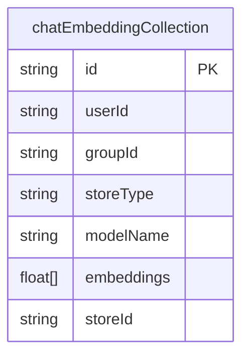
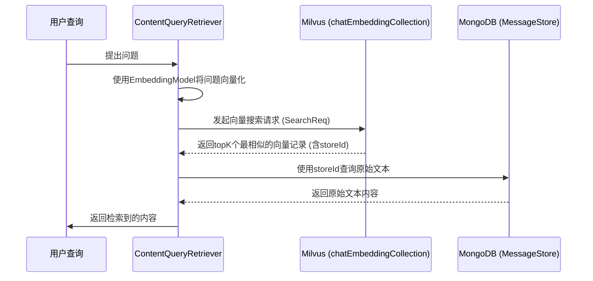

# Milvus 向量数据库设计

<cite>
**Referenced Files in This Document**   
- [MessageEmbeddingEntity.java](file://dbModel/src/main/java/com/shuanglin/dao/milvus/MessageEmbeddingEntity.java)
- [MilvusInitializer.java](file://ai/src/main/java/com/shuanglin/bot/config/initializer/MilvusInitializer.java)
- [ContentQueryRetriever.java](file://ai/src/main/java/com/shuanglin/bot/langchain4j/rag/retriever/ContentQueryRetriever.java)
- [MilvusProperties.java](file://ai/src/main/java/com/shuanglin/bot/langchain4j/config/vo/MilvusProperties.java)
- [LikeService.java](file://ai/src/main/java/com/shuanglin/bot/service/LikeService.java)
</cite>

## Table of Contents
1. [引言](#引言)
2. [集合结构设计](#集合结构设计)
3. [向量化设计](#向量化设计)
4. [索引策略](#索引策略)
5. [初始化流程](#初始化流程)
6. [查询集成](#查询集成)
7. [核心作用](#核心作用)

## 引言
本文档旨在深入解析基于Milvus向量数据库的`chatEmbeddingCollection`集合的设计与实现。该集合是系统中检索增强生成（RAG）功能的核心数据存储，通过将文本内容转换为高维向量并建立高效索引，实现了语义级别的相似性搜索。文档将从实体定义、向量存储、索引配置、初始化过程和查询集成五个方面进行详细阐述。

## 集合结构设计
`chatEmbeddingCollection`集合的结构由`MessageEmbeddingEntity`实体类定义，该类通过Milvus Plus框架的注解映射到数据库中的集合。

**Diagram sources**
- [MessageEmbeddingEntity.java](file://dbModel/src/main/java/com/shuanglin/dao/milvus/MessageEmbeddingEntity.java#L14-L78)

**Section sources**
- [MessageEmbeddingEntity.java](file://dbModel/src/main/java/com/shuanglin/dao/milvus/MessageEmbeddingEntity.java#L14-L78)

### 标量字段设计
集合中的标量字段用于存储与向量相关的元数据，支持基于属性的过滤查询。

- **id**: `@MilvusField(name = "id", dataType = DataType.VarChar, isPrimaryKey = true, autoID = true)` 定义了该字段为集合的主键，数据类型为可变字符串（VarChar），并由系统自动生成ID。
- **userId**: `@MilvusField(name = "userId", dataType = DataType.VarChar, nullable = true)` 用于关联用户，标识向量所属的用户ID，支持空值。
- **groupId**: `@MilvusField(name = "groupId", dataType = DataType.VarChar, nullable = true)` 用于关联群组，标识向量所属的群组ID，支持空值。
- **storeType**: `@MilvusField(name = "storeType", dataType = DataType.VarChar)` 标识存储内容的类型，例如`document`或`memory`，是进行数据过滤的关键字段。
- **modelName**: `@MilvusField(name = "modelName", dataType = DataType.VarChar, nullable = true)` 记录生成该向量所使用的嵌入模型名称。
- **storeId**: `@MilvusField(name = "storeId", dataType = DataType.VarChar)` 作为外部数据库（如MongoDB）中原始内容记录的ID，是连接向量数据与原始文本的桥梁。

## 向量化设计
向量化设计是该集合的核心，负责将非结构化的文本信息转换为计算机可计算的数学向量。

- **embeddings**: `@MilvusField(name = "embeddings", dataType = DataType.FloatVector, dimension = 1536)` 字段是集合的关键，其数据类型为`FloatVector`，表示一个浮点型向量数组。`dimension = 1536`指定了向量的维度为1536维。这意味着系统中的嵌入模型（Embedding Model）会将每一段文本（如文档片段或用户消息）编码成一个包含1536个浮点数的向量。这个高维向量在数学空间中代表了原文本的语义特征，语义上相似的文本其向量在空间中的距离也会更近。

**Section sources**
- [MessageEmbeddingEntity.java](file://dbModel/src/main/java/com/shuanglin/dao/milvus/MessageEmbeddingEntity.java#L57-L70)

## 索引策略
为了在海量向量数据中实现毫秒级的相似性搜索，必须建立高效的索引。`chatEmbeddingCollection`集合采用了IVF_FLAT索引。

- **索引类型**: `@MilvusIndex(indexType = IndexParam.IndexType.IVF_FLAT, ...)` 指定了使用IVF_FLAT（倒排文件-平面）索引。IVF是一种聚类索引，它首先将所有向量聚类成`nlist`个簇（Cluster），在搜索时，查询向量会先找到与之最接近的若干个簇，然后只在这些簇内进行精确的暴力搜索（FLAT），从而极大地减少了需要计算距离的向量数量，显著提升了查询速度。
- **距离度量**: `metricType = IndexParam.MetricType.L2` 指定了使用L2距离（欧几里得距离）作为相似性度量标准。L2距离越小，表示两个向量在空间中的位置越接近，语义也越相似。
- **nlist参数**: `@ExtraParam(key = "nlist", value = "100")` 设置了`nlist`的值为100。这意味着在索引构建时，系统会将所有的向量划分为100个簇。`nlist`的值是性能的关键参数：值越大，聚类越精细，搜索精度可能更高，但索引构建时间更长，且搜索时需要检查的簇更多；值越小，则索引构建快，搜索时检查的簇少，但可能导致精度下降。`nlist=100`是一个在精度和性能之间取得平衡的常用配置。

**Section sources**
- [MessageEmbeddingEntity.java](file://dbModel/src/main/java/com/shuanglin/dao/milvus/MessageEmbeddingEntity.java#L57-L70)

## 初始化流程
集合的创建和索引的构建是在应用启动时自动完成的，由`MilvusInitializer`类负责。

- **启动检查**: `MilvusInitializer`实现了`ApplicationRunner`接口，确保在Spring Boot应用启动后立即执行。
- **数据库与集合检查**: 初始化流程首先检查名为`defaultDatabaseName`的数据库是否存在，如果不存在则创建。然后，它会检查`chatEmbeddingCollection`集合是否存在。
- **集合创建**: 如果集合不存在，`MilvusInitializer`会根据预定义的`CollectionSchema`来创建集合。该Schema定义了所有字段（如`id`, `userId`, `embeddings`等）及其数据类型和属性。
- **索引构建**: 在集合创建后，初始化流程会为`embeddings`字段创建索引。虽然在`MessageEmbeddingEntity`中通过注解声明了索引，但实际的索引构建操作（`createIndex`）通常在集合有足够数据后进行，或在`MilvusInitializer`中显式调用。此过程将根据IVF_FLAT算法和L2距离度量，对集合中已有的或后续插入的向量数据进行聚类和索引化，为后续的高效查询做好准备。

**Section sources**
- [MilvusInitializer.java](file://ai/src/main/java/com/shuanglin/bot/config/initializer/MilvusInitializer.java#L1-L140)

## 查询集成
`ContentQueryRetriever`是RAG系统中负责从`chatEmbeddingCollection`集合检索相关内容的核心组件。

- **检索流程**:
    1.  **向量化查询**: 当用户提出一个问题时，`ContentQueryRetriever`首先使用`EmbeddingModel`将问题文本转换为一个1536维的查询向量。
    2.  **向量相似性搜索**: 通过`milvusClientV2`客户端，向`chatEmbeddingCollection`集合发起一个`SearchReq`请求。该请求包含查询向量、`topK`（返回最相似的K个结果）以及一个过滤条件（例如`storeType = "document"`）。
    3.  **获取原始内容**: Milvus返回最相似的`K`个向量记录，其中包含了`storeId`。`ContentQueryRetriever`使用这些`storeId`作为ID，从MongoDB中查询出对应的原始文本内容。
    4.  **结果返回**: 最终，检索器将这些原始文本内容包装成`Content`对象列表返回给RAG系统，用于后续的提示词工程和答案生成。

**Diagram sources**
- [ContentQueryRetriever.java](file://ai/src/main/java/com/shuanglin/bot/langchain4j/rag/retriever/ContentQueryRetriever.java#L44-L86)
- [MessageEmbeddingEntity.java](file://dbModel/src/main/java/com/shuanglin/dao/milvus/MessageEmbeddingEntity.java#L71-L75)

**Section sources**
- [ContentQueryRetriever.java](file://ai/src/main/java/com/shuanglin/bot/langchain4j/rag/retriever/ContentQueryRetriever.java#L44-L86)

## 核心作用
`chatEmbeddingCollection`集合在RAG系统中扮演着“外部记忆库”的核心角色。它通过将知识库文档、用户对话历史等文本内容向量化并建立索引，使得AI模型能够突破其训练数据的限制，动态地从海量外部信息中检索出与当前问题最相关的上下文。这种机制极大地增强了AI回答的准确性、相关性和信息丰富度，是实现智能问答、个性化推荐等高级AI功能的关键基础设施。