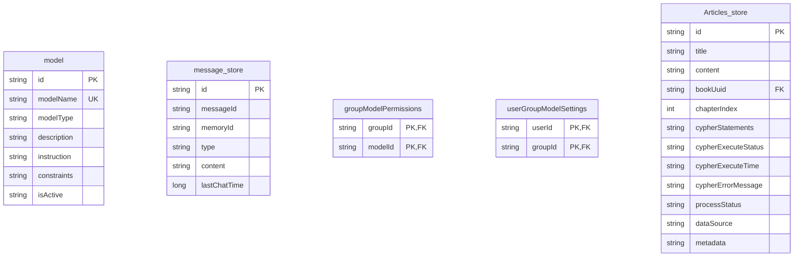

# MongoDB 数据模型设计

<cite>
**Referenced Files in This Document**   
- [Model.java](file://dbModel/src/main/java/com/shuanglin/dao/model/Model.java)
- [MessageStoreEntity.java](file://dbModel/src/main/java/com/shuanglin/dao/message/MessageStoreEntity.java)
- [ArticlesEntity.java](file://dbModel/src/main/java/com/shuanglin/dao/Articles/ArticlesEntity.java)
- [MongoDBInitializer.java](file://ai/src/main/java/com/shuanglin/bot/config/initializer/MongoDBInitializer.java)
</cite>

## 目录
1. [引言](#引言)
2. [核心集合设计](#核心集合设计)
3. [实体-文档映射关系](#实体-文档映射关系)
4. [索引策略与业务规则](#索引策略与业务规则)
5. [结论](#结论)

## 引言
本文档旨在全面阐述AI Studio项目中MongoDB数据库的数据模型设计。通过分析`Model`、`MessageStoreEntity`、`ArticlesEntity`等核心实体类及其对应的数据库集合，结合`MongoDBInitializer`中的初始化逻辑，详细说明各集合的字段设计、索引策略及其在业务场景中的应用。本文档为开发者理解数据结构、优化查询性能以及进行系统维护提供权威参考。

## 核心集合设计

### model 集合
`model`集合用于存储AI模型的元数据信息，是模型管理功能的核心。该集合基于`Model`实体类，其文档结构包含`id`、`modelName`、`modelType`、`description`、`instruction`、`constraints`和`isActive`等字段，完整描述了一个AI模型的配置与状态。

**Section sources**
- [Model.java](file://dbModel/src/main/java/com/shuanglin/dao/model/Model.java#L1-L34)

### message_store 集合
`message_store`集合负责持久化聊天会话中的消息记录，对应`MessageStoreEntity`实体类。其核心字段包括：
- `id`: 消息的唯一标识符。
- `messageId`: 外部系统消息ID。
- `memoryId`: 会话记忆ID，用于关联同一会话的多条消息。
- `type`: 消息类型（如用户输入、AI回复）。
- `content`: 消息的实际内容。
- `lastChatTime`: 消息的最后交互时间戳（毫秒），是优化会话查询性能的关键字段。

**Section sources**
- [MessageStoreEntity.java](file://dbModel/src/main/java/com/shuanglin/dao/message/MessageStoreEntity.java#L1-L29)

### groupModelPermissions 集合
`groupModelPermissions`集合用于实现群组级别的模型权限控制。通过`groupId`和`modelId`两个字段，建立群组与AI模型之间的授权关系，确保只有被授权的群组才能使用特定的AI模型。

### userGroupModelSettings 集合
`userGroupModelSettings`集合用于存储用户的个性化设置。通过`userId`和`groupId`两个字段，为每个用户在每个群组中的行为（如默认使用的AI模型）提供独立的配置空间。

### Articles_store 集合
`Articles_store`集合专门用于处理EPUB电子书的章节内容，并支持知识图谱的构建。除了基本的`title`、`content`和`createTime`字段外，还包含一系列扩展字段：
- `bookUuid`: 书籍的全局唯一标识，用于关联同一本书的所有章节。
- `chapterIndex`: 章节序号，用于章节的排序和定位。
- `cypherStatements`: 存储LLM生成的用于构建知识图谱的Cypher语句。
- `cypherExecuteStatus`: 记录Cypher语句的执行状态。
- `processStatus`: 跟踪章节的处理流程状态。
- `dataSource`: 数据源标识，用于多租户或数据隔离场景。

**Section sources**
- [ArticlesEntity.java](file://dbModel/src/main/java/com/shuanglin/dao/Articles/ArticlesEntity.java#L1-L57)

## 实体-文档映射关系

**Diagram sources**
- [Model.java](file://dbModel/src/main/java/com/shuanglin/dao/model/Model.java#L1-L34)
- [MessageStoreEntity.java](file://dbModel/src/main/java/com/shuanglin/dao/message/MessageStoreEntity.java#L1-L29)
- [ArticlesEntity.java](file://dbModel/src/main/java/com/shuanglin/dao/Articles/ArticlesEntity.java#L1-L57)

## 索引策略与业务规则

### 索引创建逻辑
所有集合及其索引均在应用启动时由`MongoDBInitializer`类自动创建和验证。该类实现了`ApplicationRunner`接口，确保在Spring容器初始化完成后执行数据库初始化逻辑，保证了应用运行时数据结构的完整性。

**Section sources**
- [MongoDBInitializer.java](file://ai/src/main/java/com/shuanglin/bot/config/initializer/MongoDBInitializer.java#L18-L144)

### model 集合索引
`model`集合在`modelName`字段上创建了唯一索引（Unique Index）。此设计确保了模型名称的全局唯一性，防止了同名模型的重复创建，是实现模型管理功能的基础业务规则。

### message_store 集合索引
`message_store`集合在`lastChatTime`字段上创建了倒序索引（Descending Index）。这一优化策略极大地提升了按时间顺序查询最新消息的性能。例如，当需要获取某个会话的最近N条消息时，数据库可以高效地利用该索引进行快速扫描，避免了全表扫描的开销。

### groupModelPermissions 集合索引
`groupModelPermissions`集合在`(groupId, modelId)`上创建了复合唯一索引（Compound Unique Index）。此索引同时实现了两个业务规则：
1.  **唯一性约束**：确保一个群组对一个AI模型的权限记录是唯一的，防止重复授权。
2.  **查询优化**：支持通过`groupId`快速查询该群组拥有的所有模型权限。

### userGroupModelSettings 集合索引
`userGroupModelSettings`集合在`(userId, groupId)`上创建了复合唯一索引。此设计保证了“一个用户在一个群组中只能有一条个性化设置记录”的业务规则，避免了配置冲突。

### Articles_store 集合索引
虽然`ArticlesEntity`的代码中未直接体现，但根据其字段设计，可以推断出以下潜在的索引策略：
- 在`bookUuid`和`chapterIndex`上创建复合索引，以支持按书籍和章节序号进行高效查询。
- 在`processStatus`上创建索引，以便快速筛选出待处理或处理失败的章节。

## 结论
本项目中的MongoDB数据模型设计清晰、合理，通过精心设计的集合和索引，有效支撑了AI模型管理、会话持久化、权限控制、个性化设置以及EPUB章节处理等核心功能。`MongoDBInitializer`的自动化初始化机制确保了数据结构的稳定性和可维护性。整体设计体现了高内聚、低耦合的原则，为系统的可扩展性和高性能奠定了坚实的基础。