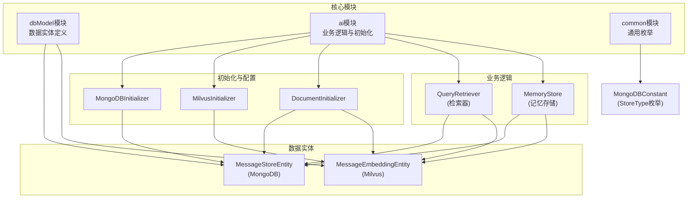
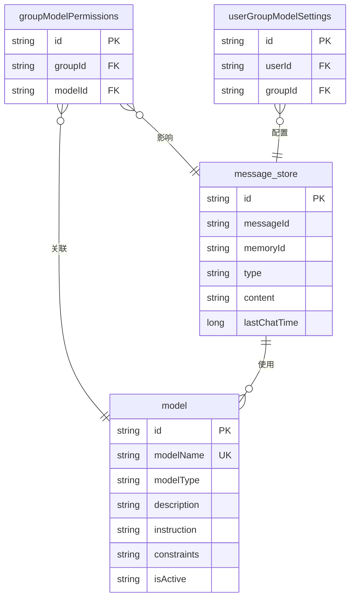
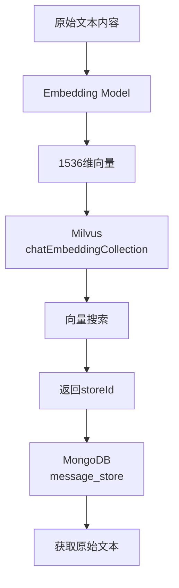

# 数据模型与数据库设计

<cite>
**本文档引用的文件**
- [MongoDBInitializer.java](file://ai/src/main/java/com/shuanglin/bot/config/initializer/MongoDBInitializer.java)
- [MilvusInitializer.java](file://ai/src/main/java/com/shuanglin/bot/config/initializer/MilvusInitializer.java)
- [MessageStoreEntity.java](file://dbModel/src/main/java/com/shuanglin/dao/message/MessageStoreEntity.java)
- [MessageEmbeddingEntity.java](file://dbModel/src/main/java/com/shuanglin/dao/milvus/MessageEmbeddingEntity.java)
- [application.yaml](file://ai/src/main/resources/application.yaml)
- [DocumentInitializer.java](file://ai/src/main/java/com/shuanglin/bot/langchain4j/config/DocumentInitializer.java)
- [MultiStepQueryRetriever.java](file://ai/src/main/java/com/shuanglin/bot/langchain4j/rag/retriever/MultiStepQueryRetriever.java)
- [FilterQueryRetriever.java](file://ai/src/main/java/com/shuanglin/bot/langchain4j/rag/retriever/FilterQueryRetriever.java)
- [MultiStepMemoryStore.java](file://ai/src/main/java/com/shuanglin/bot/langchain4j/store/MultiStepMemoryStore.java)
- [FilterMemoryStore.java](file://ai/src/main/java/com/shuanglin/bot/langchain4j/store/FilterMemoryStore.java)
- [MongoDBConstant.java](file://common/src/main/java/com/shuanglin/enums/MongoDBConstant.java)
</cite>

## 目录
1. [引言](#引言)
2. [项目结构](#项目结构)
3. [核心数据模型](#核心数据模型)
4. [MongoDB 数据库设计](#mongodb-数据库设计)
5. [Milvus 向量数据库设计](#milvus-向量数据库设计)
6. [Neo4j 知识图谱设计](#neo4j-知识图谱设计)
7. [数据实体映射关系](#数据实体映射关系)
8. [数据生命周期与存储策略](#数据生命周期与存储策略)
9. [结论](#结论)

## 引言
本文档旨在全面阐述AI Studio项目中使用的三个核心数据库的设计与实现：MongoDB、Milvus和Neo4j。文档详细描述了各数据库的集合/表结构、字段定义、索引策略、业务规则以及数据实体类与数据库的映射关系。同时，本文档还解释了数据的生命周期管理，特别是会话消息的存储与过期策略。

## 项目结构
本项目采用模块化设计，核心数据模型相关的代码主要分布在`dbModel`模块中，而数据库的初始化逻辑和业务逻辑则分散在`ai`模块的相应包内。`common`模块定义了通用的枚举和工具类。

**图来源**
- [MessageStoreEntity.java](file://dbModel/src/main/java/com/shuanglin/dao/message/MessageStoreEntity.java)
- [MessageEmbeddingEntity.java](file://dbModel/src/main/java/com/shuanglin/dao/milvus/MessageEmbeddingEntity.java)
- [MongoDBInitializer.java](file://ai/src/main/java/com/shuanglin/bot/config/initializer/MongoDBInitializer.java)
- [MilvusInitializer.java](file://ai/src/main/java/com/shuanglin/bot/config/initializer/MilvusInitializer.java)
- [DocumentInitializer.java](file://ai/src/main/java/com/shuanglin/bot/langchain4j/config/DocumentInitializer.java)
- [MultiStepQueryRetriever.java](file://ai/src/main/java/com/shuanglin/bot/langchain4j/rag/retriever/MultiStepQueryRetriever.java)
- [MultiStepMemoryStore.java](file://ai/src/main/java/com/shuanglin/bot/langchain4j/store/MultiStepMemoryStore.java)
- [MongoDBConstant.java](file://common/src/main/java/com/shuanglin/enums/MongoDBConstant.java)

## 核心数据模型
系统的核心数据围绕用户会话、知识库文档和向量嵌入展开。`MessageStoreEntity`是连接MongoDB和Milvus的关键实体，它在MongoDB中存储原始文本内容，在Milvus中存储对应的向量表示。`MessageEmbeddingEntity`则专门用于在Milvus中管理向量数据及其元数据。

**核心数据模型来源**
- [MessageStoreEntity.java](file://dbModel/src/main/java/com/shuanglin/dao/message/MessageStoreEntity.java)
- [MessageEmbeddingEntity.java](file://dbModel/src/main/java/com/shuanglin/dao/milvus/MessageEmbeddingEntity.java)

## MongoDB 数据库设计
MongoDB作为主文档数据库，用于持久化存储原始的文本内容和元数据。其设计遵循高可用性和快速查询的原则。

### 集合结构与业务规则
根据`MongoDBInitializer.java`的初始化逻辑，系统创建了多个核心集合：

1.  **`message_store` 集合**:
    *   **用途**: 存储所有类型的消息记录，包括用户会话历史和知识库文档。
    *   **业务规则**: 通过`type`字段区分不同类型的存储（如`memory`, `document`）。
    *   **索引**:
        *   `lastChatTime` (倒序): 用于按时间顺序快速检索最新的会话记录。

2.  **`model` 集合**:
    *   **用途**: 存储可用的AI模型信息。
    *   **业务规则**: 每个`modelName`必须唯一。
    *   **索引**:
        *   `modelName` (唯一索引): 确保模型名称的唯一性。

3.  **`groupModelPermissions` 集合**:
    *   **用途**: 管理群组对AI模型的访问权限。
    *   **业务规则**: 一个群组(`groupId`)对一个模型(`modelId`)的权限记录是唯一的。
    *   **索引**:
        *   `(groupId, modelId)` (复合唯一索引): 确保权限记录的唯一性。
        *   `groupId` (普通索引): 用于快速查询一个群组拥有的所有模型权限。

4.  **`userGroupModelSettings` 集合**:
    *   **用途**: 存储用户在特定群组中的模型设置。
    *   **业务规则**: 一个用户(`userId`)在一个群组(`groupId`)中只能有一条设置记录。
    *   **索引**:
        *   `(userId, groupId)` (复合唯一索引): 保证设置记录的唯一性。

### ER图

**图来源**
- [MongoDBInitializer.java](file://ai/src/main/java/com/shuanglin/bot/config/initializer/MongoDBInitializer.java)
- [MessageStoreEntity.java](file://dbModel/src/main/java/com/shuanglin/dao/message/MessageStoreEntity.java)
- [Model.java](file://dbModel/src/main/java/com/shuanglin/dao/model/Model.java)

## Milvus 向量数据库设计
Milvus用于存储和检索文本内容的向量表示，是实现RAG（检索增强生成）功能的核心。

### 向量集合结构
`MessageEmbeddingEntity`类定义了Milvus中`chatEmbeddingCollection`集合的结构。

*   **`id`**: 主键，由系统自动生成。
*   **`userId` / `groupId`**: 用户和群组ID，用于数据隔离和过滤。
*   **`storeType`**: 存储类型，与MongoDB中的`type`字段对应，用于区分会话(`memory`)和知识库文档(`document`)。
*   **`modelName`**: 模型名称，标识生成该向量所使用的嵌入模型。
*   **`embeddings`**: 核心向量字段。
    *   **向量维度**: 1536维。
    *   **距离度量类型**: `L2` (欧几里得距离)。
*   **`storeId`**: 关联ID，指向MongoDB中`MessageStoreEntity`的`id`，实现向量与原文的关联。

### 索引参数
*   **索引类型**: `IVF_FLAT`。这是一种基于聚类的索引，先将向量聚类，再在聚类内进行精确搜索，适合对召回率要求极高的场景。
*   **索引参数**: `nlist=100`，表示聚类的数量。
*   **索引名称**: `face_index`。

### 数据流图

**图来源**
- [MessageEmbeddingEntity.java](file://dbModel/src/main/java/com/shuanglin/dao/milvus/MessageEmbeddingEntity.java)
- [MilvusInitializer.java](file://ai/src/main/java/com/shuanglin/bot/config/initializer/MilvusInitializer.java)
- [MessageStoreEntity.java](file://dbModel/src/main/java/com/shuanglin/dao/message/MessageStoreEntity.java)

## Neo4j 知识图谱设计
尽管代码中未直接体现Neo4j的节点和关系模型，但`ArticlesEntity.java`中的扩展字段（如`cypherStatements`, `bookUuid`, `chapterIndex`）强烈暗示了知识图谱的构建意图。

### 节点与关系模型
*   **节点 (Nodes)**:
    *   `Book`: 代表一本书，属性包括`bookUuid`。
    *   `Chapter`: 代表一个章节，属性包括`chapterIndex`。
    *   `Article`: 代表一篇文档或文章，属性包括`title`, `tags`。
*   **关系 (Relationships)**:
    *   `(Book)-[:HAS_CHAPTER]->(Chapter)`: 一本书包含多个章节。
    *   `(Chapter)-[:CONTAINS]->(Article)`: 一个章节包含多篇文章。
    *   `(Article)-[:HAS_TAG]->(Tag)`: 一篇文章拥有多个标签。

该模型旨在将非结构化的文本内容（如EPUB书籍）转化为结构化的知识网络，支持更复杂的语义查询。

**图来源**
- [ArticlesEntity.java](file://dbModel/src/main/java/com/shuanglin/dao/Articles/ArticlesEntity.java)

## 数据实体映射关系
数据实体类与数据库集合的映射是系统数据持久化的基础。

*   **`MessageStoreEntity` 映射 `message_store` 集合**:
    *   Java字段与MongoDB文档字段一一对应。
    *   `@Document("message_store")`注解明确指定了集合名称。
    *   该实体是RAG系统中“召回”阶段获取原始内容的最终来源。

*   **`MessageEmbeddingEntity` 映射 `chatEmbeddingCollection` 集合**:
    *   使用`@MilvusCollection`和`@MilvusField`等注解进行映射。
    *   `embeddings`字段存储向量，`storeId`字段作为与`MessageStoreEntity`的关联键。
    *   该实体是向量搜索的直接操作对象。

这种设计实现了“向量索引”与“原文存储”的分离，兼顾了检索效率和数据完整性。

**映射关系来源**
- [MessageStoreEntity.java](file://dbModel/src/main/java/com/shuanglin/dao/message/MessageStoreEntity.java)
- [MessageEmbeddingEntity.java](file://dbModel/src/main/java/com/shuanglin/dao/milvus/MessageEmbeddingEntity.java)

## 数据生命周期与存储策略
系统的数据生命周期管理主要体现在会话消息和知识库文档的处理上。

### 会话消息存储
1.  **创建**: 当用户发起对话时，`MultiStepMemoryStore`或`FilterMemoryStore`被调用。
2.  **向量化**: 用户消息被`EmbeddingModel`转换为向量。
3.  **持久化**:
    *   向量部分通过`MessageEmbeddingEntity`存入Milvus。
    *   原始消息内容（可能经过序列化）通过`MessageStoreEntity`存入MongoDB，`type`字段为`memory`。
4.  **检索**: 当需要历史上下文时，系统先在Milvus中搜索相关向量，获取`storeId`，再用`storeId`从MongoDB中取出原始消息并反序列化。

### 知识库文档存储
1.  **创建**: 通过`DocumentInitializer`类处理文件（如TXT、ZIP）。
2.  **向量化**: 文件内容被作为整体或分段处理，生成向量。
3.  **持久化**:
    *   向量部分存入Milvus，`storeType`为`document`。
    *   原始内容存入MongoDB的`message_store`集合，`type`字段为`document`。
4.  **检索**: 在RAG流程中，用户查询被向量化，在Milvus中搜索，返回`storeId`，最终从MongoDB获取原文作为上下文。

目前的代码中未发现明确的过期（TTL）策略，数据的清理可能依赖于手动操作或上层业务逻辑。

**生命周期来源**
- [DocumentInitializer.java](file://ai/src/main/java/com/shuanglin/bot/langchain4j/config/DocumentInitializer.java)
- [MultiStepMemoryStore.java](file://ai/src/main/java/com/shuanglin/bot/langchain4j/store/MultiStepMemoryStore.java)
- [FilterMemoryStore.java](file://ai/src/main/java/com/shuanglin/bot/langchain4j/store/FilterMemoryStore.java)
- [MultiStepQueryRetriever.java](file://ai/src/main/java/com/shuanglin/bot/langchain4j/rag/retriever/MultiStepQueryRetriever.java)
- [FilterQueryRetriever.java](file://ai/src/main/java/com/shuanglin/bot/langchain4j/rag/retriever/FilterQueryRetriever.java)

## 结论
AI Studio项目构建了一个由MongoDB、Milvus和Neo4j组成的混合数据库架构。MongoDB作为可靠的文档存储，Milvus提供高效的向量检索能力，而Neo4j则为未来的知识图谱应用奠定了基础。通过`MessageStoreEntity`和`MessageEmbeddingEntity`的巧妙设计，系统实现了RAG功能，能够有效地结合外部知识回答用户问题。整体设计清晰，职责分离明确，为系统的可扩展性和高性能提供了保障。