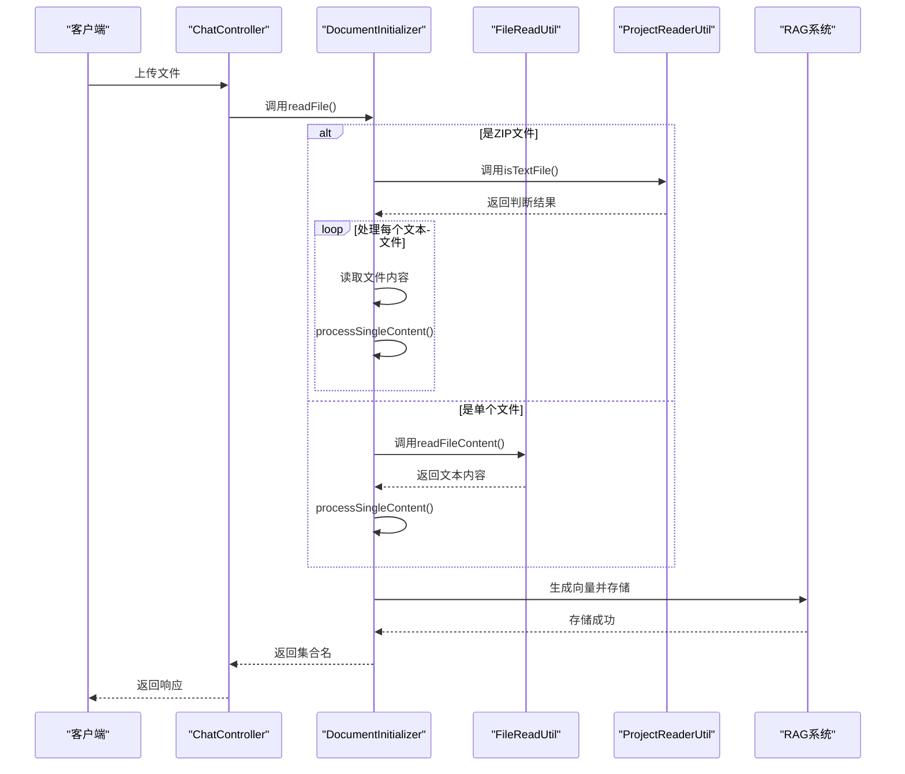
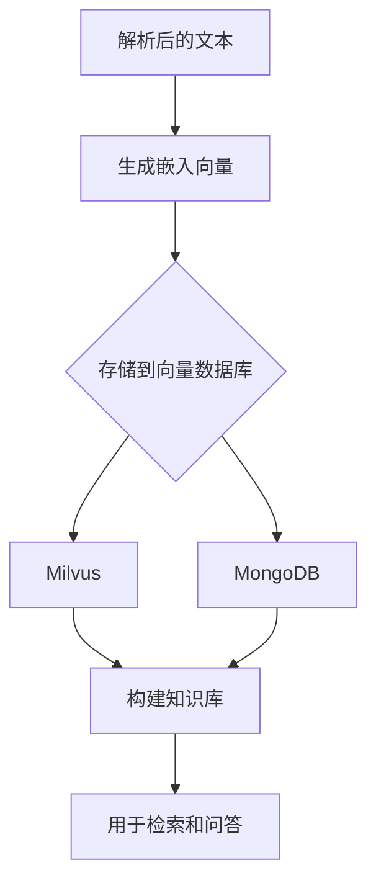

# 文档处理系统

<cite>
**本文档引用的文件**  
- [DocumentInitializer.java](file://ai/src/main/java/com/shuanglin/bot/langchain4j/config/DocumentInitializer.java)
- [FileReadUtil.java](file://ai/src/main/java/com/shuanglin/bot/utils/FileReadUtil.java)
- [ProjectReaderUtil.java](file://ai/src/main/java/com/shuanglin/bot/utils/ProjectReaderUtil.java)
- [EPUB_CHAPTER_LIMIT_USAGE.md](file://ai/EPUB_CHAPTER_LIMIT_USAGE.md)
- [ChatController.java](file://ai/src/main/java/com/shuanglin/bot/langchain4j/controller/ChatController.java)
- [GraphService.java](file://ai/src/main/java/com/shuanglin/bot/service/GraphService.java)
- [ChapterStorageService.java](file://ai/src/main/java/com/shuanglin/bot/service/ChapterStorageService.java)
</cite>

## 目录
1. [简介](#简介)
2. [支持的文件格式](#支持的文件格式)
3. [DocumentInitializer 协调解析流程](#documentinitializer-协调解析流程)
4. [工具类作用](#工具类作用)
5. [RAG 系统集成](#rag-系统集成)
6. [EPUB 章节限制](#epub-章节限制)
7. [最佳实践与已知限制](#最佳实践与已知限制)

## 简介
本文档旨在详细描述文档处理系统的架构与功能。系统能够解析多种格式的文档，协调解析流程，并将内容送入RAG系统进行向量化存储，从而构建知识库。文档重点说明了核心组件如DocumentInitializer、FileReadUtil和ProjectReaderUtil的作用，并提供了用户上传文件的最佳实践。

## 支持的文件格式
系统支持以下文件格式的解析：
- **文本文件**：`.txt`
- **Office 文档**：`.xls`, `.xlsx`, `.docx`
- **电子书**：`.epub`
- **压缩包**：`.zip`（内部包含上述文本文件）

此外，通过`ProjectReaderUtil`，系统还能识别和处理多种编程语言和配置文件，包括但不限于`.java`, `.py`, `.js`, `.html`, `.xml`, `.json`, `.md`等。

## DocumentInitializer 协调解析流程
`DocumentInitializer`是文档解析流程的核心协调者，负责接收文件并启动整个处理链。

**流程说明**：
1. `ChatController`接收到文件上传请求后，调用`DocumentInitializer.readFile()`方法。
2. `DocumentInitializer`首先检查文件是否为ZIP格式。
3. 如果是ZIP文件，则使用`ProjectReaderUtil.isTextFile()`方法遍历并筛选出内部的文本文件，然后对每个文件调用`processSingleContent()`。
4. 如果是单个文件（如`.txt`, `.epub`等），则直接调用`FileReadUtil.readFileContent()`读取内容，再调用`processSingleContent()`。
5. `processSingleContent()`方法负责生成嵌入向量，并将数据批量插入到Milvus向量数据库和MongoDB文档数据库中。

**Diagram sources**
- [DocumentInitializer.java](file://ai/src/main/java/com/shuanglin/bot/langchain4j/config/DocumentInitializer.java#L36-L268)
- [ChatController.java](file://ai/src/main/java/com/shuanglin/bot/langchain4j/controller/ChatController.java#L48-L60)

**Section sources**
- [DocumentInitializer.java](file://ai/src/main/java/com/shuanglin/bot/langchain4j/config/DocumentInitializer.java#L36-L268)
- [ChatController.java](file://ai/src/main/java/com/shuanglin/bot/langchain4j/controller/ChatController.java#L48-L60)

## 工具类作用
### FileReadUtil
`FileReadUtil`是一个工具类，专门负责读取不同格式的文件内容并将其转换为统一的字符串格式。

| 方法 | 功能 | 支持的格式 |
|------|------|-----------|
| `readFileContent(String)` | 根据文件路径读取内容 | `.txt`, `.xls`, `.xlsx`, `.docx`, `.epub` |
| `readFileContent(File)` | 根据文件对象读取内容 | `.txt`, `.xls`, `.xlsx`, `.docx`, `.epub` |
| `readEpubFile(File)` | 读取EPUB文件，返回章节列表 | `.epub` |
| `parseHtml(String)` | 解析HTML字符串，提取标题和段落 | HTML内容 |

**处理逻辑**：
- **TXT**：使用`BufferedReader`逐行读取。
- **Excel**：使用Apache POI库读取`.xls`和`.xlsx`文件，将所有工作表的内容拼接成一个字符串。
- **DOCX**：使用Apache POI的`XWPFWordExtractor`提取Word文档的纯文本。
- **EPUB**：使用`epublib`库解析EPUB文件，通过`parseHtml`方法提取每个章节的HTML内容，转换为标题和段落列表。

**Section sources**
- [FileReadUtil.java](file://ai/src/main/java/com/shuanglin/bot/utils/FileReadUtil.java#L22-L255)

### ProjectReaderUtil
`ProjectReaderUtil`主要用于处理ZIP压缩包内的项目文件，特别是代码项目。

| 方法 | 功能 |
|------|------|
| `readAllProjectTextFiles(File)` | 读取ZIP文件内所有被识别为文本的文件内容，并组合成一个字符串 |
| `isTextFile(String, String)` | 判断一个文件是否是文本文件，基于其扩展名或文件名 |
| `readInputStreamAsText(InputStream, Charset)` | 从输入流读取内容并转换为指定编码的字符串 |

**文本文件识别规则**：
1. **扩展名匹配**：检查文件扩展名是否在预定义的`TEXT_EXTENSIONS`列表中。
2. **特殊文件名匹配**：检查文件名是否在`SPECIAL_TEXT_FILENAMES`列表中（如`Dockerfile`, `.gitignore`, `pom.xml`等）。

**Section sources**
- [ProjectReaderUtil.java](file://ai/src/main/java/com/shuanglin/bot/utils/ProjectReaderUtil.java#L16-L185)

## RAG 系统集成
解析后的文本内容最终会被送入RAG（检索增强生成）系统进行向量化和存储。

**具体流程**：
1. 在`DocumentInitializer.processSingleContent()`方法中，使用注入的`EmbeddingModel`对文本内容生成嵌入向量。
2. 将向量数据和元数据（如`sender`, `groupId`）封装成`MessageEmbeddingEntity`对象。
3. 使用`MilvusClientV2`将向量数据批量插入到Milvus集合中。
4. 同时，将原始文本内容和相关元数据封装成`MessageStoreEntity`对象，通过`MongoTemplate`批量upsert到MongoDB中。

通过这种方式，系统构建了一个包含原始文本和向量表示的双重知识库，为后续的语义检索和问答提供了基础。

**Diagram sources**
- [DocumentInitializer.java](file://ai/src/main/java/com/shuanglin/bot/langchain4j/config/DocumentInitializer.java#L200-L268)

**Section sources**
- [DocumentInitializer.java](file://ai/src/main/java/com/shuanglin/bot/langchain4j/config/DocumentInitializer.java#L200-L268)
- [MessageEmbeddingEntity.java](file://dbModel/src/main/java/com/shuanglin/dao/milvus/MessageEmbeddingEntity.java)
- [MessageStoreEntity.java](file://dbModel/src/main/java/com/shuanglin/dao/message/MessageStoreEntity.java)

## EPUB 章节限制
系统支持对EPUB文件的章节读取进行限制，例如只处理前40章。

**实现方式**：
1. 在`GraphService.readStoryWithLimit()`方法中，首先调用`FileReadUtil.readEpubFile()`读取所有章节。
2. 计算实际处理的章节数：`actualLimit = Math.min(parseResults.size(), chapterLimit)`。
3. 使用`for`循环遍历前`actualLimit`个章节，跳过后续章节。

**相关配置**：
- **EPUB文件路径**：在测试类中修改`epubPath`变量。
- **章节数量限制**：修改`chapterLimit`参数。
- **数据源标识**：通过`metadata.setDataSource()`设置，用于区分测试和生产数据。

**Section sources**
- [EPUB_CHAPTER_LIMIT_USAGE.md](file://ai/EPUB_CHAPTER_LIMIT_USAGE.md)
- [GraphService.java](file://ai/src/main/java/com/shuanglin/bot/service/GraphService.java#L337-L368)

## 最佳实践与已知限制
### 最佳实践
1. **测试前清理**：在进行新的测试前，使用`cleanupTestData()`清理旧的测试数据，避免数据污染。
2. **分阶段处理**：对于包含大量章节的EPUB文件，建议分批处理，以降低单次处理的内存和时间开销。
3. **定期统计**：在处理过程中定期调用`getBookStatistics()`检查处理进度和成功率。
4. **错误处理**：对于处理失败的章节，使用`replayCypherFromMongo()`进行重放，提高整体成功率。

### 已知限制
1. **EPUB解析**：`readEpubFile()`方法返回的是`List<ParseResult>`，而`DocumentInitializer`期望的是`String`。目前`DocumentInitializer`无法直接处理EPUB文件，需要`GraphService`等上层服务进行适配。
2. **Office文档**：仅支持`.docx`、`.xls`和`.xlsx`格式，不支持旧版`.doc`或`.ppt`等格式。
3. **大文件处理**：对于非常大的文件或ZIP包，可能会遇到内存溢出或超时问题，建议进行分块处理或优化。
4. **编码问题**：虽然主要使用UTF-8编码，但某些特殊编码的文件可能无法正确读取。

**Section sources**
- [EPUB_CHAPTER_LIMIT_USAGE.md](file://ai/EPUB_CHAPTER_LIMIT_USAGE.md)
- [GraphService.java](file://ai/src/main/java/com/shuanglin/bot/service/GraphService.java)
- [ChapterStorageService.java](file://ai/src/main/java/com/shuanglin/bot/service/ChapterStorageService.java)