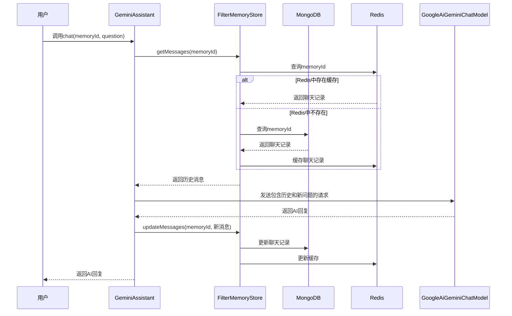
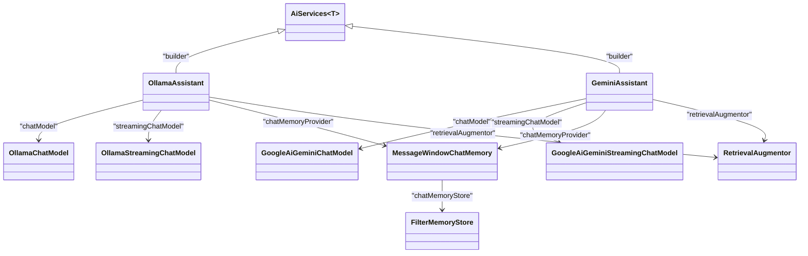
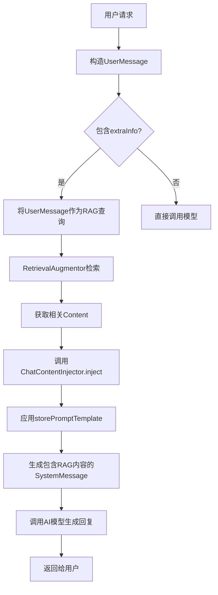

# AI服务集成

<cite>
**本文档引用文件**   
- [GeminiAssistant.java](file://ai/src/main/java/com/shuanglin/bot/langchain4j/assistant/GeminiAssistant.java)
- [OllamaAssistant.java](file://ai/src/main/java/com/shuanglin/bot/langchain4j/assistant/OllamaAssistant.java)
- [ApiModelsConfiguration.java](file://ai/src/main/java/com/shuanglin/bot/langchain4j/config/ApiModelsConfiguration.java)
- [system-message.txt](file://ai/src/main/resources/prompt/system-message.txt)
- [user-session-message.md](file://ai/src/main/resources/prompt/user-session-message.md)
- [FilterMemoryStore.java](file://ai/src/main/java/com/shuanglin/bot/langchain4j/store/FilterMemoryStore.java)
- [ChatContentInjector.java](file://ai/src/main/java/com/shuanglin/bot/langchain4j/rag/contentInjector/ChatContentInjector.java)
</cite>

## 目录
1. [AI服务接口设计与实现](#ai服务接口设计与实现)
2. [动态提示词模板与会话状态管理](#动态提示词模板与会话状态管理)
3. [GeminiAssistant与OllamaAssistant对比分析](#geminiassistant与ollamaassistant对比分析)
4. [AiServices工厂与代理实例创建](#aiservices工厂与代理实例创建)
5. [提示模板变量替换机制](#提示模板变量替换机制)
6. [RAG内容增强与extraInfo参数](#rag内容增强与extrainfo参数)
7. [多模型切换与扩展支持](#多模型切换与扩展支持)

## AI服务接口设计与实现

本文档深入解析AI服务接口GeminiAssistant和OllamaAssistant的设计与实现。这两个接口均基于LangChain4j框架构建，通过定义Java接口方法并结合特定注解，实现了与AI模型的高效交互。接口设计遵循了声明式编程范式，开发者无需关注底层HTTP通信细节，只需定义方法签名和提示词模板，框架会自动处理请求构造、模型调用和响应解析。

GeminiAssistant和OllamaAssistant接口提供了聊天、流式输出、角色设定等核心功能。它们通过`@UserMessage`注解定义用户消息模板，通过`@MemoryId`注解管理会话状态，通过`@V`注解实现动态变量注入。这种设计模式极大地简化了AI服务的集成过程，使业务逻辑与AI能力解耦，提高了代码的可维护性和可测试性。

**Section sources**
- [GeminiAssistant.java](file://ai/src/main/java/com/shuanglin/bot/langchain4j/assistant/GeminiAssistant.java#L10-L77)
- [OllamaAssistant.java](file://ai/src/main/java/com/shuanglin/bot/langchain4j/assistant/OllamaAssistant.java#L5-L43)

## 动态提示词模板与会话状态管理

### 动态提示词模板注入

AI服务通过LangChain4j的`@UserMessage`和`@V`注解实现动态提示词模板注入。`@UserMessage`注解用于定义发送给AI模型的用户消息模板，模板中可以包含使用`{{variable}}`语法的占位符。`@V`注解则用于将方法参数的值注入到这些占位符中。

例如，在GeminiAssistant接口中，`chat`方法使用`@UserMessage("{{question}}")`定义了一个简单的模板，其中`{{question}}`占位符会被`@V("question")`注解标记的`question`参数的实际值所替换。这种方式允许在不修改代码的情况下，通过改变方法参数来动态调整发送给AI模型的提示词内容。

### 会话状态管理

会话状态管理通过`@MemoryId`注解实现。该注解将一个方法参数（通常是一个包含会话标识信息的对象）标记为会话ID。LangChain4j框架利用这个ID来关联和管理特定用户的聊天历史。

在GeminiAssistant的`chat`方法中，`@MemoryId JsonObject memoryId`参数被用作会话ID。框架会使用`FilterMemoryStore`作为`ChatMemoryStore`的实现，根据`memoryId`从MongoDB和Redis中加载历史聊天记录，并在会话结束后将新的消息更新回存储。这种机制确保了AI模型能够基于完整的对话上下文生成连贯的回复，实现了多轮对话的能力。

**Diagram sources**
- [GeminiAssistant.java](file://ai/src/main/java/com/shuanglin/bot/langchain4j/assistant/GeminiAssistant.java#L50-L60)
- [FilterMemoryStore.java](file://ai/src/main/java/com/shuanglin/bot/langchain4j/store/FilterMemoryStore.java#L0-L116)

**Section sources**
- [GeminiAssistant.java](file://ai/src/main/java/com/shuanglin/bot/langchain4j/assistant/GeminiAssistant.java#L50-L60)
- [FilterMemoryStore.java](file://ai/src/main/java/com/shuanglin/bot/langchain4j/store/FilterMemoryStore.java#L0-L116)

## GeminiAssistant与OllamaAssistant对比分析

### 功能对比

| 功能 | GeminiAssistant | OllamaAssistant |
| :--- | :--- | :--- |
| **聊天** | `chat(@MemoryId, @V("question"))` | `chat(@MemoryId, @UserMessage)` |
| **群聊** | `groupChat(@MemoryId, @V("question"))` | `groupChat(@MemoryId, @V("question"))` |
| **流式输出** | `chatStreamTokenStream(@V, @V, @V)` | `chatStreamTokenStream(@V, @V, @V)` |
| **特殊功能** | `enhancedEntityExtraction(...)` (知识图谱构建) | `v4Chat(@MemoryId, @UserMessage)` |

### 异同分析

**相同点**:
1.  **核心功能一致**: 两个接口都提供了`chat`、`groupChat`和`chatStreamTokenStream`方法，支持基本的聊天、群聊和流式输出功能。
2.  **注解使用方式相同**: 都使用`@V`注解进行变量注入，使用`@MemoryId`注解管理会话状态。
3.  **流式输出参数一致**: `chatStreamTokenStream`方法的参数定义完全相同，都接受`role`、`question`和`extraInfo`三个参数。
4.  **RAG集成**: 两者都集成了检索增强生成（RAG）功能，`UserMessage`中的内容会被用作RAG查询条件。

**不同点**:
1.  **用户消息注解的使用**: OllamaAssistant的`chat`方法直接在`@UserMessage`注解中使用方法参数`question`，而GeminiAssistant则使用`@V("question")`将参数值注入到模板`{{question}}`中。这表明OllamaAssistant的`chat`方法更直接，而GeminiAssistant的`chat`方法更灵活，可以与其他模板结合使用。
2.  **特殊功能**: GeminiAssistant包含一个独特的`enhancedEntityExtraction`方法，其`@UserMessage`模板非常复杂，专门用于将小说文本转换为Neo4j Cypher语句，这体现了其在知识图谱构建领域的特定用途。OllamaAssistant则有一个`v4Chat`方法，其参数模式与`chat`方法不同。
3.  **会话管理配置**: 在`ApiModelsConfiguration`中，GeminiAssistant配置的`MessageWindowChatMemory`的`maxMessages`为1，而OllamaAssistant为10。这表明GeminiAssistant的设计更依赖于外部存储（如`FilterMemoryStore`）来管理完整的历史记录，而OllamaAssistant则在内存中保留了更多的最近消息。

**Section sources**
- [GeminiAssistant.java](file://ai/src/main/java/com/shuanglin/bot/langchain4j/assistant/GeminiAssistant.java#L10-L77)
- [OllamaAssistant.java](file://ai/src/main/java/com/shuanglin/bot/langchain4j/assistant/OllamaAssistant.java#L5-L43)

## AiServices工厂与代理实例创建

AiServices工厂是LangChain4j框架的核心组件，负责根据接口定义自动创建代理实例。在`ApiModelsConfiguration`类中，通过`AiServices.builder()`方法为GeminiAssistant和OllamaAssistant创建了Spring Bean。

工厂的创建过程如下：
1.  **指定接口类型**: `AiServices.builder(OllamaAssistant.class)`或`AiServices.builder(GeminiAssistant.class)`。
2.  **注入模型实例**: 通过`.chatModel()`和`.streamingChatModel()`方法注入同步和流式聊天模型实例（如`OllamaChatModel`或`GoogleAiGeminiChatModel`）。
3.  **配置会话管理**: 通过`.chatMemoryProvider()`方法提供一个函数，该函数根据`memoryId`创建`MessageWindowChatMemory`实例，并指定`ChatMemoryStore`（如`FilterMemoryStore`）来持久化聊天记录。
4.  **集成RAG**: 通过`.retrievalAugmentor()`方法注入`RetrievalAugmentor`实例，以启用检索增强功能。
5.  **构建代理**: 调用`.build()`方法，框架会利用Java动态代理技术，生成一个实现了指定接口的代理对象。当调用该代理对象的方法时，它会根据方法上的注解自动解析提示词模板、注入变量、管理会话，并最终调用底层的AI模型。

这种工厂模式实现了高度的解耦，使得AI服务的配置和创建过程集中化、模块化，便于管理和扩展。

**Diagram sources**
- [ApiModelsConfiguration.java](file://ai/src/main/java/com/shuanglin/bot/langchain4j/config/ApiModelsConfiguration.java#L100-L169)

**Section sources**
- [ApiModelsConfiguration.java](file://ai/src/main/java/com/shuanglin/bot/langchain4j/config/ApiModelsConfiguration.java#L100-L169)

## 提示模板变量替换机制

系统通过`system-message.txt`和`user-session-message.md`两个文件定义了核心的提示模板。这些模板中的变量替换机制是通过`@V`注解和`@MemoryId`注解协同工作实现的。

### system-message.txt
该文件定义了AI助手的角色和行为准则。其中的`{{role}}`变量是关键。当调用`chatStreamTokenStream`方法时，传入的`role`参数会通过`@V("role")`注解被提取，并替换`system-message.txt`模板中的`{{role}}`占位符。例如，如果`role`参数的值是“小说家”，那么AI模型收到的系统消息就会是“你是一个小说家”，从而指导其以小说家的身份进行回复。

### user-session-message.md
该文件定义了一个更复杂的会话模板，包含了`{{role}}`、`{{job_description}}`、`{{known_information}}`和`{{question}}`等多个变量。虽然`GeminiAssistant`和`OllamaAssistant`的`chat`方法没有直接使用这个模板，但`FilterMemoryStore`在加载历史消息时，可能会将之前存储的、基于此模板生成的消息作为上下文提供给AI模型。`{{job_description}}`和`{{known_information}}`等变量的值，可能来源于`extraInfo`参数或RAG检索到的内容。

**Section sources**
- [system-message.txt](file://ai/src/main/resources/prompt/system-message.txt#L0-L8)
- [user-session-message.md](file://ai/src/main/resources/prompt/user-session-message.md#L0-L13)
- [GeminiAssistant.java](file://ai/src/main/java/com/shuanglin/bot/langchain4j/assistant/GeminiAssistant.java#L65-L75)

## RAG内容增强与extraInfo参数

### extraInfo参数的作用

在`chatStreamTokenStream`方法中，`extraInfo`参数扮演着至关重要的角色，它是实现检索增强生成（RAG）内容增强的关键。`extraInfo`通常是一个包含额外上下文信息的字符串，例如用户画像、产品信息或从知识库中检索到的相关文档片段。

当`UserMessage`被构造时，`extraInfo`的值会通过`@V("extraInfo")`注解被注入到提示词中。更重要的是，这个包含`extraInfo`的完整用户消息会被用作RAG检索的查询条件。`RetrievalAugmentor`会分析这个查询，从向量数据库（如Milvus）中检索出最相关的知识片段。

### 内容注入流程

检索到的相关内容并不会直接发送给AI模型。系统使用了`ChatContentInjector`（如`chatContentInjector`）来决定如何将这些内容注入到最终的提示词中。

1.  **检索**: 基于包含`extraInfo`的`UserMessage`进行向量检索。
2.  **注入**: `ChatContentInjector`的`inject`方法被调用。它接收检索到的`Content`列表和原始的`ChatMessage`。
3.  **模板应用**: `ChatContentInjector`使用一个预定义的`PromptTemplate`（如`storePromptTemplate`），将检索到的内容（`content`）和原始用户消息（`userMessage`）以及其他元数据（可能来自`extraInfo`）作为参数，应用到一个更复杂的系统提示模板中。
4.  **生成最终消息**: 应用模板后生成一个新的`SystemMessage`，这个消息包含了原始问题、额外信息和检索到的知识，然后与会话历史一起发送给AI模型。

这种方式确保了AI模型在生成回复时，能够参考最相关、最准确的外部知识，从而显著提高回复的质量和准确性。

**Diagram sources**
- [GeminiAssistant.java](file://ai/src/main/java/com/shuanglin/bot/langchain4j/assistant/GeminiAssistant.java#L65-L75)
- [ChatContentInjector.java](file://ai/src/main/java/com/shuanglin/bot/langchain4j/rag/contentInjector/ChatContentInjector.java#L0-L40)

**Section sources**
- [GeminiAssistant.java](file://ai/src/main/java/com/shuanglin/bot/langchain4j/assistant/GeminiAssistant.java#L65-L75)
- [ChatContentInjector.java](file://ai/src/main/java/com/shuanglin/bot/langchain4j/rag/contentInjector/ChatContentInjector.java#L0-L40)

## 多模型切换与扩展支持

系统通过Spring Boot的配置属性和依赖注入机制，为多模型切换与扩展提供了良好的支持。

### 模型切换

模型的切换主要通过配置文件（如`application.yaml`）中的属性来实现。例如，`OllamaProperties`和`GeminiProperties`类使用`@ConfigurationProperties`注解，分别绑定以`langchain4j.models.ollama`和`langchain4j.models.gemini`为前缀的配置项。通过修改`modelName`、`url`、`apiKey`等配置，可以轻松地在不同的Ollama模型或Gemini模型之间切换，而无需更改Java代码。

### 扩展指南

为新增AI模型提供实现的指南如下：
1.  **创建配置属性类**: 创建一个新的VO类（如`NewModelProperties.java`），继承或模仿`OllamaProperties`，并使用`@ConfigurationProperties`注解绑定配置前缀。
2.  **定义AI服务接口**: 创建一个新的接口（如`NewModelAssistant.java`），定义所需的方法，并使用`@UserMessage`、`@MemoryId`、`@V`等注解。
3.  **配置模型Bean**: 在`ApiModelsConfiguration`类中，添加一个新的`@Bean`方法，使用新的配置属性来构建对应的`ChatModel`和`StreamingChatModel`实例。
4.  **配置AiServices Bean**: 在`ApiModelsConfiguration`类中，添加一个新的`@Bean`方法，使用`AiServices.builder(NewModelAssistant.class)`，并注入新创建的模型实例、`ChatMemoryStore`和`RetrievalAugmentor`。
5.  **集成RAG (可选)**: 如果需要RAG支持，可以复用现有的`FilterMemoryStore`或创建新的`ChatMemoryStore`实现，并确保`RetrievalAugmentor`已正确配置。

通过遵循这一模式，可以方便地将新的AI模型集成到现有系统中，实现服务的灵活扩展。

**Section sources**
- [ApiModelsConfiguration.java](file://ai/src/main/java/com/shuanglin/bot/langchain4j/config/ApiModelsConfiguration.java#L0-L169)
- [OllamaProperties.java](file://ai/src/main/java/com/shuanglin/bot/langchain4j/config/vo/OllamaProperties.java#L0-L34)
- [GeminiProperties.java](file://ai/src/main/java/com/shuanglin/bot/langchain4j/config/vo/GeminiProperties.java#L0-L35)