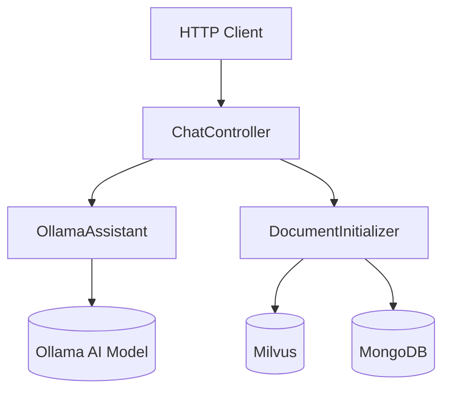
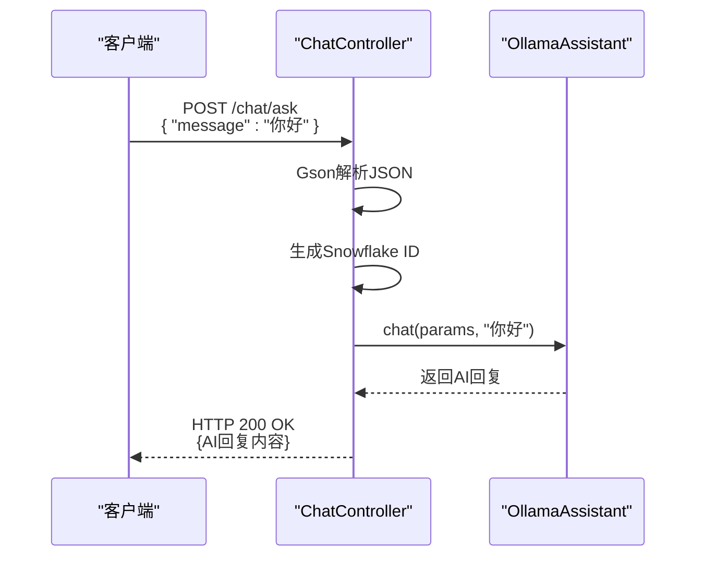

# API控制器

<cite>
**Referenced Files in This Document**   
- [ChatController.java](file://ai/src/main/java/com/shuanglin/bot/langchain4j/controller/ChatController.java)
- [OllamaAssistant.java](file://ai/src/main/java/com/shuanglin/bot/langchain4j/assistant/OllamaAssistant.java)
- [DocumentInitializer.java](file://ai/src/main/java/com/shuanglin/bot/langchain4j/config/DocumentInitializer.java)
- [application.yaml](file://ai/src/main/resources/application.yaml)
</cite>

## Table of Contents
1. [项目结构](#项目结构)
2. [核心组件](#核心组件)
3. [API端点设计与实现](#api端点设计与实现)
4. [依赖注入与配置](#依赖注入与配置)
5. [异常处理与日志记录](#异常处理与日志记录)
6. [API调用示例](#api调用示例)
7. [安全风险分析](#安全风险分析)

## 项目结构

项目采用典型的Spring Boot分层架构，`ChatController`位于`ai/src/main/java/com/shuanglin/bot/langchain4j/controller/`包下，是处理外部HTTP请求的核心入口。其依赖的`OllamaAssistant`和`DocumentInitializer`分别位于`assistant`和`config`包中，负责AI对话和知识库构建的核心逻辑。配置文件`application.yaml`位于`resources`目录，定义了应用的全局配置。

**Section sources**
- [ChatController.java](file://ai/src/main/java/com/shuanglin/bot/langchain4j/controller/ChatController.java)

## 核心组件

系统核心由`ChatController`、`OllamaAssistant`和`DocumentInitializer`三个组件构成。`ChatController`作为RESTful API的暴露层，接收并处理HTTP请求。`OllamaAssistant`是一个接口，定义了与Ollama AI模型进行对话的契约，`ChatController`通过依赖注入调用其实现来生成AI回复。`DocumentInitializer`则负责知识库的构建，它能处理上传的文件或字符串，将其内容向量化并存储到Milvus向量数据库和MongoDB中，为后续的检索增强生成（RAG）提供数据支持。



**Diagram sources**
- [ChatController.java](file://ai/src/main/java/com/shuanglin/bot/langchain4j/controller/ChatController.java)
- [OllamaAssistant.java](file://ai/src/main/java/com/shuanglin/bot/langchain4j/assistant/OllamaAssistant.java)
- [DocumentInitializer.java](file://ai/src/main/java/com/shuanglin/bot/langchain4j/config/DocumentInitializer.java)

**Section sources**
- [ChatController.java](file://ai/src/main/java/com/shuanglin/bot/langchain4j/controller/ChatController.java)
- [OllamaAssistant.java](file://ai/src/main/java/com/shuanglin/bot/langchain4j/assistant/OllamaAssistant.java)
- [DocumentInitializer.java](file://ai/src/main/java/com/shuanglin/bot/langchain4j/config/DocumentInitializer.java)

## API端点设计与实现

`ChatController`类通过`@RestController`和`@RequestMapping("/chat")`注解暴露了一个基础路径为`/chat`的API控制器。该控制器实现了三个关键的POST端点，分别用于AI对话、文件上传构建知识库和字符串内容处理。

### /ask 接口分析

`/ask`接口是与AI进行对话的主要入口。它通过`@PostMapping("/ask")`注解暴露，接收`application/json`类型的请求体。

**请求处理流程**:
1.  **接收JSON请求**: 方法参数`@RequestBody String message`接收原始的JSON字符串，而非直接映射到POJO，这提供了更大的灵活性。
2.  **Gson解析参数**: 使用注入的`Gson`实例将JSON字符串解析为`JsonObject`对象，允许动态访问请求中的任意字段。
3.  **生成MessageId**: 在调用AI之前，通过`IdUtil.getSnowflakeNextIdStr()`生成一个全局唯一的雪花算法ID，并将其作为`messageId`属性添加到`params`对象中，用于日志追踪和消息去重。
4.  **调用OllamaAssistant**: 将包含`messageId`的`params`对象和从JSON中提取的`message`字段（作为问题）传递给`ollamaAssistant.chat()`方法。
5.  **返回响应**: 直接将`OllamaAssistant`返回的字符串作为HTTP响应体。



**Diagram sources**
- [ChatController.java](file://ai/src/main/java/com/shuanglin/bot/langchain4j/controller/ChatController.java#L32-L39)
- [OllamaAssistant.java](file://ai/src/main/java/com/shuanglin/bot/langchain4j/assistant/OllamaAssistant.java#L29-L36)

**Section sources**
- [ChatController.java](file://ai/src/main/java/com/shuanglin/bot/langchain4j/controller/ChatController.java#L32-L39)

### /readFile 接口分析

`/readFile`接口用于处理文件上传，并将其内容作为知识库的一部分进行构建。

**文件处理流程**:
1.  **接收MultipartFile**: 方法通过`@RequestParam("file") MultipartFile multiFile`接收名为`file`的上传文件。
2.  **创建临时文件**: 获取文件名和后缀，使用`File.createTempFile()`在系统临时目录下创建一个临时文件。
3.  **文件传输**: 调用`multiFile.transferTo(file)`将上传的文件内容写入临时文件。
4.  **知识库构建**: 将一个空的`JsonObject`（作为参数占位符）和创建的`File`对象传递给`documentInitializer.readFile()`方法，启动知识库构建流程。

**Section sources**
- [ChatController.java](file://ai/src/main/java/com/shuanglin/bot/langchain4j/controller/ChatController.java#L41-L58)
- [DocumentInitializer.java](file://ai/src/main/java/com/shuanglin/bot/langchain4j/config/DocumentInitializer.java#L51-L78)

### /read 接口分析

`/read`接口设计用于直接处理字符串内容，将其作为知识库的一部分。

**参数构造方式**:
1.  **接收字符串**: 方法接收一个`@RequestBody String body`，即原始的请求体字符串。
2.  **硬编码参数**: 方法内部创建一个新的`JsonObject`，并硬编码添加了`userId`和`modelName`两个属性。这表明该接口可能用于特定的、预设的场景，缺乏灵活性。
3.  **触发知识库构建**: 将构造好的`params`对象和`body`字符串传递给`documentInitializer.read()`方法。

**Section sources**
- [ChatController.java](file://ai/src/main/java/com/shuanglin/bot/langchain4j/controller/ChatController.java#L60-L67)
- [DocumentInitializer.java](file://ai/src/main/java/com/shuanglin/bot/langchain4j/config/DocumentInitializer.java#L85-L91)

## 依赖注入与配置

`ChatController`通过Spring的依赖注入机制管理其协作对象。

### 依赖注入关系
- `@Autowired private OllamaAssistant ollamaAssistant;`: 自动注入`OllamaAssistant`接口的实现，用于AI对话。
- `@Autowired private GeminiAssistant geminiAssistant;`: 注入了另一个AI助手，虽然在当前控制器中未使用，但表明系统支持多模型。
- `@Resource private DocumentInitializer documentInitializer;`: 通过`@Resource`注解注入`DocumentInitializer`，用于知识库操作。
- `@Resource Gson gson;`: 注入`Gson`实例，用于JSON的序列化和反序列化。

### application.yaml 配置说明
`application.yaml`文件定义了应用的关键配置：
- **服务器端口**: `server.port: 8080`
- **数据库连接**: 配置了Redis、MongoDB和Milvus的连接信息，包括主机、端口、数据库名和认证凭据。
- **AI模型配置**: 在`langchain4j.models.ollama`下配置了Ollama服务的URL (`http://8.138.204.38:11434`) 和模型名称 (`gemma3:12b`)。
- **文件上传限制**: `spring.servlet.multipart.max-file-size: 20MB` 设置了单个文件上传的最大大小为20MB。

这些配置通过Spring Boot的自动配置机制，被`OllamaAssistant`、`DocumentInitializer`等组件所使用，实现了API路径映射和外部服务的连接。

**Section sources**
- [ChatController.java](file://ai/src/main/java/com/shuanglin/bot/langchain4j/controller/ChatController.java#L20-L30)
- [application.yaml](file://ai/src/main/resources/application.yaml)

## 异常处理与日志记录

### 异常处理机制
- **/readFile 接口**: 该接口的异常处理较为简单。整个文件处理逻辑被包裹在`try-catch`块中，捕获`IOException`。一旦发生异常，会立即`throw new RuntimeException(e)`，将异常包装后抛出。这意味着异常会由Spring的全局异常处理器（如`@ControllerAdvice`）捕获，并返回一个包含错误信息的500 Internal Server Error响应。
- **/ask 和 /read 接口**: 这两个接口没有显式的`try-catch`块。它们依赖于`OllamaAssistant`和`DocumentInitializer`内部的异常处理，或者将异常直接向上抛出，最终由全局异常处理器处理。

### 日志记录规范
日志记录主要在`DocumentInitializer`类中实现，遵循了清晰的规范：
- **日志级别**: 使用了`info`、`debug`、`warn`和`error`等多个级别。
- **信息内容**: `info`级别的日志用于记录关键的操作步骤，如“成功读取单个文件内容”、“开始向 Milvus 批量插入”。`error`级别的日志用于记录错误，并包含异常堆栈。
- **上下文信息**: 日志消息中使用了占位符`{}`来插入动态信息，如文件路径、集合名等，便于问题排查。

**Section sources**
- [ChatController.java](file://ai/src/main/java/com/shuanglin/bot/langchain4j/controller/ChatController.java#L41-L58)
- [DocumentInitializer.java](file://ai/src/main/java/com/shuanglin/bot/langchain4j/config/DocumentInitializer.java)

## API调用示例

以下是使用`curl`命令调用各API端点的示例。

### 调用 /ask 接口
```bash
curl -X POST http://localhost:8080/chat/ask \
  -H "Content-Type: application/json" \
  -d '{"message": "请介绍一下你自己"}'
```

### 调用 /readFile 接口
```bash
curl -X POST http://localhost:8080/chat/readFile \
  -F "file=@/path/to/your/document.txt"
```

### 调用 /read 接口
```bash
curl -X POST http://localhost:8080/chat/read \
  -H "Content-Type: text/plain" \
  -d "这是一段需要被学习的文本内容。"
```

**Section sources**
- [ChatController.java](file://ai/src/main/java/com/shuanglin/bot/langchain4j/controller/ChatController.java)

## 安全风险分析

当前API设计存在以下潜在安全风险：

1.  **文件上传类型检查缺失**: `/readFile`接口在接收文件后，没有对文件类型进行任何检查。攻击者可以上传恶意的`.exe`、`.sh`或`.jsp`等可执行文件，如果这些文件被放置在Web服务器的可访问目录下，可能导致远程代码执行（RCE）。
2.  **文件内容安全**: 系统会读取并处理上传文件的全部内容。如果文件包含恶意脚本或超大文件，可能导致拒绝服务（DoS）攻击或服务器资源耗尽。
3.  **硬编码凭证**: `application.yaml`中包含了数据库和AI服务的明文密码，如果配置文件被泄露，将导致严重的安全事件。
4.  **输入验证不足**: `/ask`和`/read`接口对JSON或字符串输入的验证不足，可能受到注入攻击或处理异常数据。

**Section sources**
- [ChatController.java](file://ai/src/main/java/com/shuanglin/bot/langchain4j/controller/ChatController.java)
- [application.yaml](file://ai/src/main/resources/application.yaml)