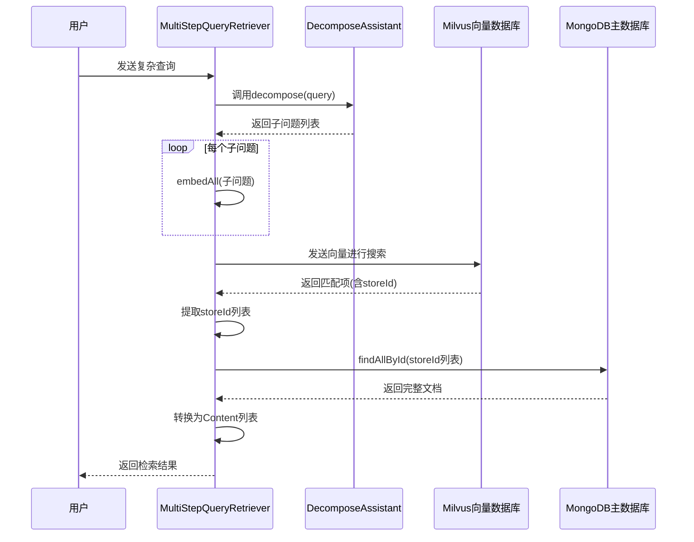
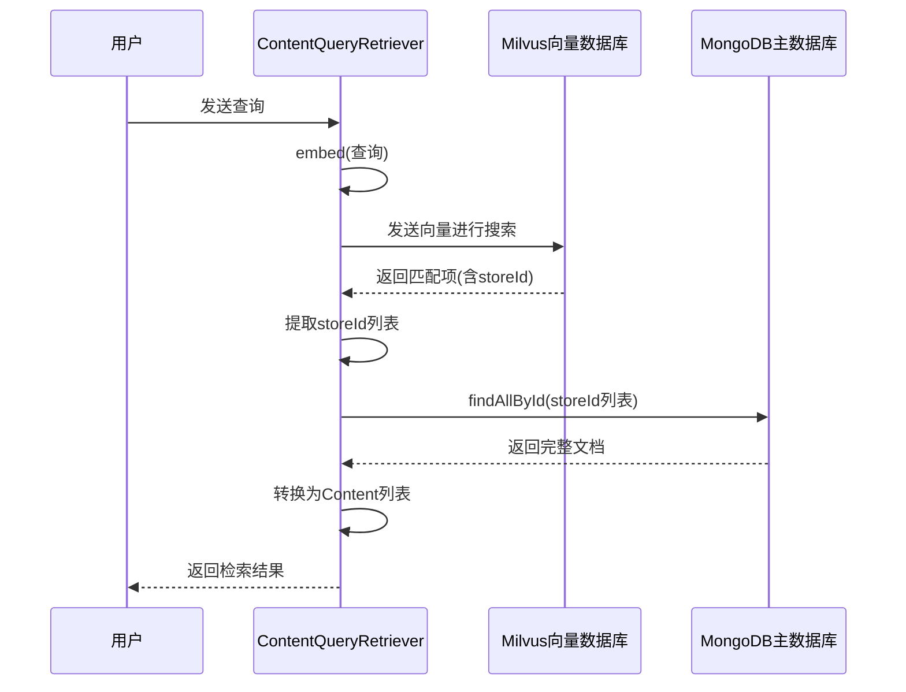
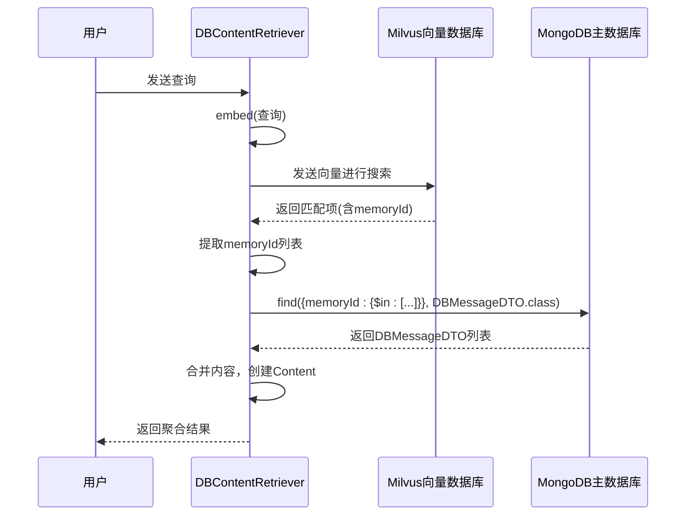
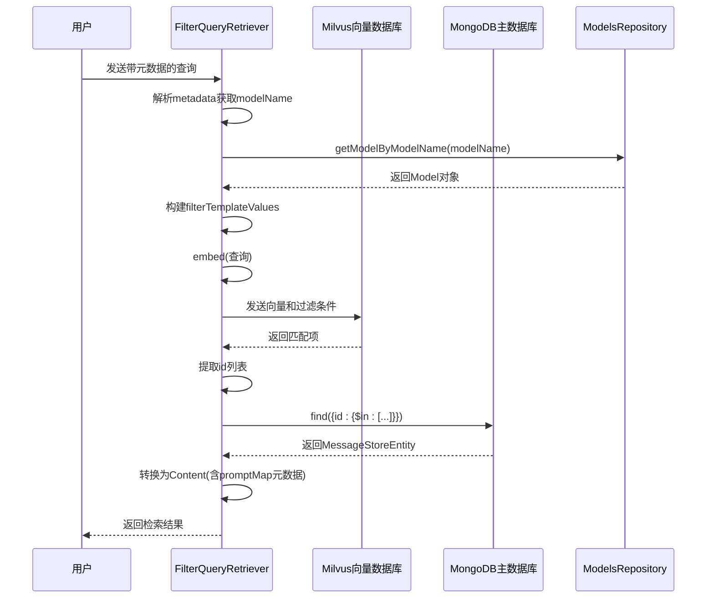

# RAG系统实现

<cite>
**Referenced Files in This Document**   
- [MultiStepQueryRetriever.java](file://ai/src/main/java/com/shuanglin/bot/langchain4j/rag/retriever/MultiStepQueryRetriever.java)
- [ContentQueryRetriever.java](file://ai/src/main/java/com/shuanglin/bot/langchain4j/rag/retriever/ContentQueryRetriever.java)
- [DBContentRetriever.java](file://ai/src/main/java/com/shuanglin/bot/langchain4j/rag/retriever/DBContentRetriever.java)
- [FilterQueryRetriever.java](file://ai/src/main/java/com/shuanglin/bot/langchain4j/rag/retriever/FilterQueryRetriever.java)
- [RagConfiguration.java](file://ai/src/main/java/com/shuanglin/bot/langchain4j/rag/RagConfiguration.java)
- [DecomposeAssistant.java](file://ai/src/main/java/com/shuanglin/bot/langchain4j/assistant/DecomposeAssistant.java)
- [MilvusProperties.java](file://ai/src/main/java/com/shuanglin/bot/langchain4j/config/vo/MilvusProperties.java)
- [MessageStoreEntity.java](file://dbModel/src/main/java/com/shuanglin/dao/message/MessageStoreEntity.java)
- [MessageEmbeddingMapper.java](file://dbModel/src/main/java/com/shuanglin/dao/milvus/MessageEmbeddingMapper.java)
- [MessageStoreEntityRepository.java](file://dbModel/src/main/java/com/shuanglin/dao/message/MessageStoreEntityRepository.java)
- [DBMessageDTO.java](file://ai/src/main/java/com/shuanglin/bot/config/DBMessageDTO.java)
- [application.yaml](file://ai/src/main/resources/application.yaml)
</cite>

## 目录
1. [引言](#引言)
2. [核心检索器实现](#核心检索器实现)
   1. [MultiStepQueryRetriever：多步查询检索器](#multistepqueryretriever多步查询检索器)
   2. [ContentQueryRetriever：单步向量检索器](#contentqueryretriever单步向量检索器)
   3. [DBContentRetriever：联合查询检索器](#dbcontentretriever联合查询检索器)
   4. [FilterQueryRetriever：过滤查询检索器](#filterqueryretriever过滤查询检索器)
3. [组件配置与注入](#组件配置与注入)
4. [数据流转与日志分析](#数据流转与日志分析)
5. [性能优化建议](#性能优化建议)

## 引言

本文档旨在全面解析本项目中检索增强生成（RAG）系统的架构与实现细节。系统通过多种检索器（Retriever）实现灵活的知识检索，核心包括处理复杂查询的`MultiStepQueryRetriever`、基础的`ContentQueryRetriever`、实现向量与主数据库联合查询的`DBContentRetriever`，以及支持动态过滤的`FilterQueryRetriever`。这些组件通过`RagConfiguration`进行统一配置，并利用`DecomposeAssistant`等AI助手实现高级功能。文档将深入分析各组件的工作流程、相互关系及数据流转过程。

## 核心检索器实现

### MultiStepQueryRetriever：多步查询检索器

`MultiStepQueryRetriever`是系统中最复杂的检索器，专为处理复杂、多层面的用户查询而设计。它通过多步推理流程，将一个复杂问题分解为多个简单子问题，并行检索后聚合结果。

**多步推理流程：**
1.  **接收原始查询**：接收用户输入的复杂文本查询。
2.  **查询分解**：调用`DecomposeAssistant`的`decompose`方法，利用大语言模型（LLM）将原始查询分解为多个独立的子问题。例如，一个关于“小说中主角的成长历程和最终结局”的查询，可能被分解为“主角是谁？”、“主角经历了哪些关键事件？”和“故事的结局是什么？”三个子问题。
3.  **子问题向量化**：使用`EmbeddingModel`对所有子问题进行批量向量化，生成对应的向量表示。
4.  **并行向量检索**：将所有子问题的向量一次性发送至Milvus向量数据库，执行一次`search`操作。通过`filterTemplateValues`设置过滤条件（如`storeType=document`），确保检索范围正确。检索结果返回的是包含元数据的匹配项。
5.  **提取storeId**：从Milvus返回的搜索结果中，解析出每个匹配项的`storeId`字段。此字段是连接向量数据库与主数据库的关键ID。
6.  **主数据库查询**：使用上一步获取的`storeId`列表，调用`MessageStoreEntityRepository`的`findAllById`方法，从MongoDB中批量查询完整的文档内容。
7.  **结果聚合**：将从MongoDB获取的`MessageStoreEntity`对象转换为LangChain4j框架所需的`Content`对象列表，返回给上层调用者。

该流程通过日志清晰地展现，从`[Multi-Step RAG 开始]`到`[Multi-Step RAG 结束]`，记录了每一步的执行情况和关键数据。

**Diagram sources**
- [MultiStepQueryRetriever.java](file://ai/src/main/java/com/shuanglin/bot/langchain4j/rag/retriever/MultiStepQueryRetriever.java#L36-L114)
- [DecomposeAssistant.java](file://ai/src/main/java/com/shuanglin/bot/langchain4j/assistant/DecomposeAssistant.java#L6-L10)

**Section sources**
- [MultiStepQueryRetriever.java](file://ai/src/main/java/com/shuanglin/bot/langchain4j/rag/retriever/MultiStepQueryRetriever.java#L36-L114)

### ContentQueryRetriever：单步向量检索器

`ContentQueryRetriever`实现了最基础的RAG流程，即单步向量检索。它适用于查询意图明确、无需分解的场景。

**单步向量检索流程：**
1.  **查询向量化**：直接使用`EmbeddingModel`将用户查询文本转换为单个查询向量。
2.  **向量数据库检索**：将查询向量发送至Milvus，执行相似度搜索。其检索逻辑与`MultiStepQueryRetriever`的第4步类似，同样使用`filterTemplateValues`进行过滤。
3.  **提取storeId**：从Milvus的搜索结果中提取`storeId`。
4.  **主数据库查询**：使用`storeId`列表，通过`MessageStoreEntityRepository`从MongoDB中获取完整内容。
5.  **结果返回**：将内容转换为`Content`对象并返回。

与`MultiStepQueryRetriever`相比，`ContentQueryRetriever`省略了查询分解的步骤，流程更为直接。其日志输出也使用了相同的标记`[Multi-Step RAG 开始]`，这可能是日志模板复用所致。

**Diagram sources**
- [ContentQueryRetriever.java](file://ai/src/main/java/com/shuanglin/bot/langchain4j/rag/retriever/ContentQueryRetriever.java#L31-L87)

**Section sources**
- [ContentQueryRetriever.java](file://ai/src/main/java/com/shuanglin/bot/langchain4j/rag/retriever/ContentQueryRetriever.java#L31-L87)

### DBContentRetriever：联合查询检索器

`DBContentRetriever`实现了向量数据库与主数据库的联合查询机制。其核心在于利用向量搜索的结果作为主数据库查询的条件，从而获取更丰富、更准确的上下文。

**联合查询机制：**
1.  **向量化与搜索**：首先将查询文本向量化，并在Milvus中进行搜索。
2.  **提取memoryId**：与前两者不同，`DBContentRetriever`从搜索结果中提取的是`memoryId`字段。这表明其设计可能更侧重于会话或记忆相关的数据检索。
3.  **主数据库条件查询**：使用提取出的`memoryId`列表，构建MongoDB查询条件`Criteria.where("memoryId").in(memoryIds)`，从`DBMessageDTO`集合中查询完整的消息记录。
4.  **内容聚合**：将查询到的所有`DBMessageDTO`对象的内容字段合并，并封装成一个`Content`对象返回，其元数据中包含`contentType=knowledge`。

此检索器展示了如何将向量搜索的“近似匹配”能力与主数据库的“精确查询”能力相结合，以满足特定的业务需求。

**Diagram sources**
- [DBContentRetriever.java](file://ai/src/main/java/com/shuanglin/bot/langchain4j/rag/retriever/DBContentRetriever.java#L24-L137)
- [DBMessageDTO.java](file://ai/src/main/java/com/shuanglin/bot/config/DBMessageDTO.java#L1-L15)

**Section sources**
- [DBContentRetriever.java](file://ai/src/main/java/com/shuanglin/bot/langchain4j/rag/retriever/DBContentRetriever.java#L24-L137)

### FilterQueryRetriever：过滤查询检索器

`FilterQueryRetriever`在特定场景下应用了动态过滤逻辑，能够根据查询的元数据（metadata）来定制检索条件。

**过滤逻辑：**
1.  **解析查询元数据**：从`Query`对象的`metadata`中解析出`chatMemoryId`，并进一步提取`modelName`等参数。
2.  **获取模型信息**：根据`modelName`，通过`ModelsRepository`从数据库中查询对应的`Model`对象，获取其提示词（prompt）等配置信息。
3.  **构建过滤条件**：将解析出的元数据（`queryParams`）作为`filterTemplateValues`，直接注入到Milvus的`SearchReq`中。这意味着向量搜索不仅基于向量相似度，还会应用这些动态的过滤规则。
4.  **标准检索流程**：后续流程与`ContentQueryRetriever`一致，即提取`id`、查询MongoDB、转换结果。

这种设计允许系统根据不同的模型或会话上下文，动态调整检索范围，实现更精细化的知识检索。

**Diagram sources**
- [FilterQueryRetriever.java](file://ai/src/main/java/com/shuanglin/bot/langchain4j/rag/retriever/FilterQueryRetriever.java#L34-L151)
- [ModelsRepository.java](file://dbModel/src/main/java/com/shuanglin/dao/model/ModelsRepository.java#L1-L10)

**Section sources**
- [FilterQueryRetriever.java](file://ai/src/main/java/com/shuanglin/bot/langchain4j/rag/retriever/FilterQueryRetriever.java#L34-L151)

## 组件配置与注入

`RagConfiguration`类是整个RAG系统的配置中心，负责定义和注入核心组件。尽管当前代码中相关`@Bean`定义被注释，但其注释清晰地阐述了系统的设计理念。

**配置与注入说明：**
- **ContentRetriever**：配置了`embeddingStoreContentRetriever` Bean，它将`EmbeddingModel`和`EmbeddingStore`（如Milvus）注入，形成一个标准的检索器。该检索器会自动处理查询向量化、向量搜索、结果过滤（通过`maxResults`和`minScore`）并返回`Content`列表。
- **RetrievalAugmentor**：配置了`retrievalAugmentor` Bean，它将`ContentRetriever`和`ContentInjector`等组件组合起来，形成一个完整的检索增强流程。它负责查询转换、内容聚合和最终内容注入到LLM提示词中。

虽然实际的检索器（如`MultiStepQueryRetriever`）是通过`@Component`注解直接声明的，但`RagConfiguration`的存在表明系统具备通过配置灵活组装不同组件的能力。

**Section sources**
- [RagConfiguration.java](file://ai/src/main/java/com/shuanglin/bot/langchain4j/rag/RagConfiguration.java#L4-L51)

## 数据流转与日志分析

各检索器的数据流转过程通过详细的日志输出得以清晰展现。以`MultiStepQueryRetriever`为例：
1.  **步骤1**：接收原始查询，日志记录`[步骤 1] 接收到原始复杂查询`。
2.  **步骤2**：LLM分解查询，日志逐条打印分解出的子问题。
3.  **步骤3**：执行向量检索，日志记录`[步骤 3] 正在对每个子问题进行并行检索...`，并最终输出提取的`storeId`列表。
4.  **步骤4**：执行MongoDB查询，日志记录查询结果数量，若为空则发出警告。
5.  **步骤5**：完成结果映射，日志记录返回的`Content`对象数量。

这种结构化的日志不仅便于调试，也为性能监控和问题排查提供了直接依据。所有流程均以`[START]`或`[Multi-Step RAG 开始]`开始，以`[END]`或`[Multi-Step RAG 结束]`结束，形成了清晰的执行边界。

**Section sources**
- [MultiStepQueryRetriever.java](file://ai/src/main/java/com/shuanglin/bot/langchain4j/rag/retriever/MultiStepQueryRetriever.java#L36-L114)
- [ContentQueryRetriever.java](file://ai/src/main/java/com/shuanglin/bot/langchain4j/rag/retriever/ContentQueryRetriever.java#L31-L87)
- [DBContentRetriever.java](file://ai/src/main/java/com/shuanglin/bot/langchain4j/rag/retriever/DBContentRetriever.java#L24-L137)

## 性能优化建议

基于现有架构，可提出以下性能优化建议：

1.  **批量处理**：`MultiStepQueryRetriever`已通过`embedAll`方法对子问题进行批量向量化，这是一个优秀的实践。应确保所有涉及向量计算的场景都采用批量处理，以减少与嵌入模型的交互次数。
2.  **缓存策略**：
    - **查询结果缓存**：对于高频、低变化的查询，可以将`Content`结果缓存到Redis中，设置合理的过期时间，避免重复的向量搜索和数据库查询。
    - **向量缓存**：可以缓存常见查询或子问题的向量表示，避免重复计算。
3.  **异步执行**：对于非关键路径的检索操作，可以考虑异步执行，提高系统响应速度。
4.  **索引优化**：确保MongoDB中用于检索的字段（如`id`, `memoryId`, `storeId`）已建立高效索引，以加速`findById`和`find`操作。
5.  **连接池与资源管理**：确保Milvus和MongoDB的客户端连接池配置合理，避免因连接创建和销毁带来的性能开销。

通过实施这些策略，可以显著提升RAG系统的整体性能和响应能力。