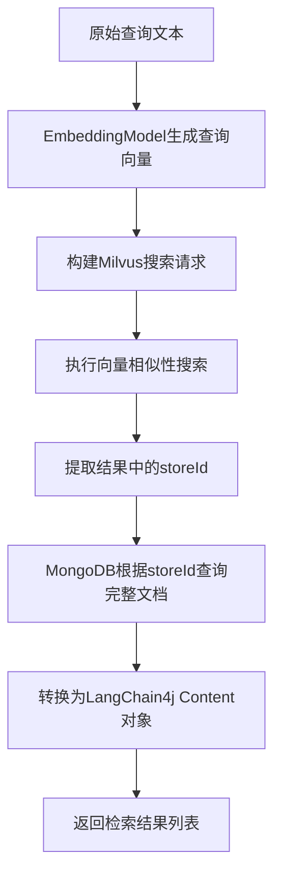
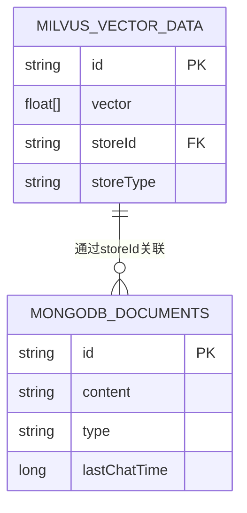

# 向量检索

<cite>
**本文档引用的文件**
- [ContentQueryRetriever.java](file://ai/src/main/java/com/shuanglin/bot/langchain4j/rag/retriever/ContentQueryRetriever.java)
- [MilvusProperties.java](file://ai/src/main/java/com/shuanglin/bot/langchain4j/config/vo/MilvusProperties.java)
- [MessageEmbeddingMapper.java](file://dbModel/src/main/java/com/shuanglin/dao/milvus/MessageEmbeddingMapper.java)
- [MessageStoreEntity.java](file://dbModel/src/main/java/com/shuanglin/dao/message/MessageStoreEntity.java)
- [MessageStoreEntityRepository.java](file://dbModel/src/main/java/com/shuanglin/dao/message/MessageStoreEntityRepository.java)
</cite>

## 目录
1. [简介](#简介)
2. [核心组件](#核心组件)
3. [单步向量检索流程详解](#单步向量检索流程详解)
4. [数据流与架构设计](#数据流与架构设计)
5. [与多步检索器的对比分析](#与多步检索器的对比分析)
6. [配置参数调优建议](#配置参数调优建议)
7. [结论](#结论)

## 简介
本文档全面介绍`ContentQueryRetriever`实现的单步向量检索机制。该检索器通过EmbeddingModel将用户查询文本转换为单一向量，在Milvus向量数据库中执行相似性搜索，并利用storeId作为桥梁从MongoDB获取完整文档内容。文档详细阐述其工作流程、关键组件交互、性能优势及配置优化策略。

## 核心组件

`ContentQueryRetriever`是实现单步向量检索的核心类，依赖多个关键组件协同工作：
- `EmbeddingModel`: 负责将原始查询文本编码为向量表示
- `MilvusClientV2`与`MessageEmbeddingMapper`: 提供与Milvus向量数据库的连接和操作接口
- `MessageStoreEntityRepository`: 用于从MongoDB中根据storeId检索完整文档
- `MilvusProperties`: 存储Milvus数据库的连接信息和topK等配置参数

**本节来源**
- [ContentQueryRetriever.java](file://ai/src/main/java/com/shuanglin/bot/langchain4j/rag/retriever/ContentQueryRetriever.java#L31-L87)
- [MilvusProperties.java](file://ai/src/main/java/com/shuanglin/bot/langchain4j/config/vo/MilvusProperties.java#L1-L32)

## 单步向量检索流程详解

### 检索流程步骤

1. **查询向量化**：使用注入的`EmbeddingModel`对输入查询文本进行嵌入处理，生成对应的向量表示。
2. **构建搜索请求**：创建`SearchReq`对象，设置过滤条件（storeType为document）、查询向量数据及topK值（从MilvusProperties获取）。
3. **执行向量搜索**：通过`messageEmbeddingMapper.getClient().search()`在Milvus中执行近似最近邻搜索。
4. **提取storeId**：从搜索结果中解析出匹配条目的storeId字段，这些ID将用于后续的文档检索。
5. **获取完整文档**：使用`messageStoreEntityRepository.findAllById()`方法，以storeId列表为参数，从MongoDB中批量获取完整的文档内容。
6. **结果转换**：将数据库实体转换为LangChain4j框架所需的`Content`对象列表，供后续的RAG流程使用。

**图示来源**
- [ContentQueryRetriever.java](file://ai/src/main/java/com/shuanglin/bot/langchain4j/rag/retriever/ContentQueryRetriever.java#L44-L86)

**本节来源**
- [ContentQueryRetriever.java](file://ai/src/main/java/com/shuanglin/bot/langchain4j/rag/retriever/ContentQueryRetriever.java#L44-L86)
- [MessageStoreEntityRepository.java](file://dbModel/src/main/java/com/shuanglin/dao/message/MessageStoreEntityRepository.java#L6-L9)

## 数据流与架构设计

系统采用分离式存储架构，向量数据与原始文档内容分别存储于Milvus和MongoDB中，通过storeId实现关联。

**图示来源**
- [MessageEmbeddingMapper.java](file://dbModel/src/main/java/com/shuanglin/dao/milvus/MessageEmbeddingMapper.java#L5-L7)
- [MessageStoreEntity.java](file://dbModel/src/main/java/com/shuanglin/dao/message/MessageStoreEntity.java#L9-L27)

**本节来源**
- [MessageStoreEntity.java](file://dbModel/src/main/java/com/shuanglin/dao/message/MessageStoreEntity.java#L9-L27)
- [MessageEmbeddingMapper.java](file://dbModel/src/main/java/com/shuanglin/dao/milvus/MessageEmbeddingMapper.java#L5-L7)

## 与多步检索器的对比分析

### 效率优势
对于简单查询，`ContentQueryRetriever`（单步）相比`MultiStepQueryRetriever`（多步）具有显著优势：
- **流程简洁**：仅需一次向量搜索和一次数据库查询，减少了处理步骤和延迟。
- **资源消耗低**：避免了查询分解、多轮检索和结果融合等复杂操作，降低了计算和内存开销。
- **响应速度快**：适用于对实时性要求高的场景，能快速返回结果。

### 局限性
在面对复杂语义或需要深度推理的查询时，单步检索器存在局限：
- **语义覆盖不足**：无法像多步检索器那样将复杂问题分解为多个子查询，可能导致相关文档召回不全。
- **缺乏上下文扩展**：不能利用LLM对原始查询进行重写或扩展，限制了在模糊查询下的检索能力。

**本节来源**
- [ContentQueryRetriever.java](file://ai/src/main/java/com/shuanglin/bot/langchain4j/rag/retriever/ContentQueryRetriever.java#L44-L86)
- [MilvusProperties.java](file://ai/src/main/java/com/shuanglin/bot/langchain4j/config/vo/MilvusProperties.java#L1-L32)

## 配置参数调优建议

为了平衡检索准确率与响应速度，建议对以下参数进行调优：

| 参数 | 建议值/策略 | 说明 |
|------|------------|------|
| `milvus.topK` | 3-10 | 过大的topK会增加MongoDB查询负担和网络传输开销，过小可能导致遗漏相关文档。应根据实际召回率测试确定最优值。 |
| 向量维度 | 与EmbeddingModel输出一致 | 必须确保Milvus集合的向量维度与所使用的`EmbeddingModel`生成的向量维度完全匹配，否则会导致搜索失败。 |
| 相似度度量 | 根据模型选择 | 若使用Cosine相似度的模型，则Milvus中应配置`metric_type="IP"`（内积）并确保向量已归一化；若使用欧氏距离，则配置`metric_type="L2"`。 |
| Milvus索引类型 | IVF_FLAT 或 HNSW | `IVF_FLAT`适合高召回率场景，`HNSW`适合低延迟场景。应根据数据规模和QPS要求选择。 |
| MongoDB索引 | 在`id`和`storeId`字段上创建索引 | 确保`MessageStoreEntityRepository.findAllById()`能高效执行，避免全表扫描。 |

**本节来源**
- [MilvusProperties.java](file://ai/src/main/java/com/shuanglin/bot/langchain4j/config/vo/MilvusProperties.java#L1-L32)
- [ContentQueryRetriever.java](file://ai/src/main/java/com/shuanglin/bot/langchain4j/rag/retriever/ContentQueryRetriever.java#L44-L86)

## 结论
`ContentQueryRetriever`实现了一种高效、直接的单步向量检索方案，特别适合处理语义明确的简单查询。它通过精简的流程和清晰的架构设计，实现了快速响应。然而，在处理复杂查询时，其能力有限，此时应考虑使用多步检索策略。通过合理配置Milvus和MongoDB的相关参数，可以在准确率和性能之间取得良好平衡。