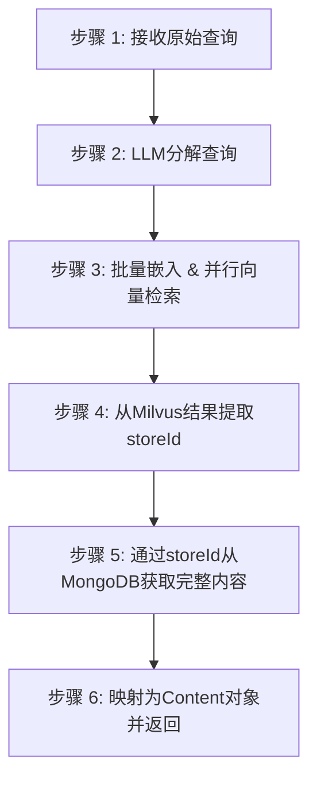

# 多步推理检索

<cite>
**Referenced Files in This Document**   
- [MultiStepQueryRetriever.java](file://ai\src\main\java\com\shuanglin\bot\langchain4j\rag\retriever\MultiStepQueryRetriever.java)
- [DecomposeAssistant.java](file://ai\src\main\java\com\shuanglin\bot\langchain4j\assistant\DecomposeAssistant.java)
- [MessageStoreEntityRepository.java](file://dbModel\src\main\java\com\shuanglin\dao\message\MessageStoreEntityRepository.java)
- [MessageStoreEntity.java](file://dbModel\src\main\java\com\shuanglin\dao\message\MessageStoreEntity.java)
- [MessageEmbeddingEntity.java](file://dbModel\src\main\java\com\shuanglin\dao\milvus\MessageEmbeddingEntity.java)
- [ApiModelsConfiguration.java](file://ai\src\main\java\com\shuanglin\bot\langchain4j\config\ApiModelsConfiguration.java)
- [DocumentInitializer.java](file://ai\src\main\java\com\shuanglin\bot\langchain4j\config\DocumentInitializer.java)
- [application.yaml](file://ai\src\main\resources\application.yaml)
- [kgKnowlage.md](file://ai\src\main\resources\prompt\kgKnowlage.md)
</cite>

## 目录
1. [简介](#简介)
2. [核心组件](#核心组件)
3. [多步推理检索流程](#多步推理检索流程)
4. [系统架构与数据流](#系统架构与数据流)
5. [性能优化与配置](#性能优化与配置)
6. [适用场景与权衡](#适用场景与权衡)

## 简介
本文档深入解析`MultiStepQueryRetriever`的多步推理检索机制。该机制专为处理复杂、多跳的用户查询而设计，通过将一个复杂问题分解为多个更简单的子问题，显著提升了在大型知识库中检索相关信息的准确性和召回率。文档详细阐述了从查询输入到最终结果生成的五个核心步骤，包括查询分解、向量检索、ID提取、主数据库查询和结果映射，并结合日志输出进行分析。同时，提供了性能优化建议，说明了该检索器在复杂问答场景中的优势与开销。

## 核心组件

`MultiStepQueryRetriever`的实现依赖于多个核心组件，它们协同工作以完成多步检索任务。

**Section sources**
- [MultiStepQueryRetriever.java](file://ai\src\main\java\com\shuanglin\bot\langchain4j\rag\retriever\MultiStepQueryRetriever.java#L36-L114)
- [DecomposeAssistant.java](file://ai\src\main\java\com\shuanglin\bot\langchain4j\assistant\DecomposeAssistant.java#L6-L48)
- [MessageStoreEntityRepository.java](file://dbModel\src\main\java\com\shuanglin\dao\message\MessageStoreEntityRepository.java#L6-L9)

### 多步查询检索器 (MultiStepQueryRetriever)
`MultiStepQueryRetriever`是整个流程的协调者，实现了`ContentRetriever`接口。它负责接收原始查询，调用`DecomposeAssistant`进行问题分解，利用`EmbeddingModel`对子问题进行批量向量化，通过`MilvusClientV2`执行并行向量检索，从检索结果中提取`storeId`，并最终通过`MessageStoreEntityRepository`从MongoDB中获取完整的原始内容。

### 查询分解助手 (DecomposeAssistant)
`DecomposeAssistant`是一个由LangChain4j `AiServices`创建的AI服务接口。它封装了一个专门用于问题分解的LLM模型（在`ApiModelsConfiguration`中配置为`gemma3:12b`）。其核心方法`decompose`接收一个复杂查询，并根据预设的提示词（Prompt）将其分解为3个或更少的简单子问题，返回一个以分号分隔的子问题列表。

### 消息存储实体仓库 (MessageStoreEntityRepository)
`MessageStoreEntityRepository`是一个Spring Data MongoDB的`MongoRepository`接口，用于操作存储在MongoDB中的原始消息内容。`MultiStepQueryRetriever`利用其`findAllById`方法，根据从Milvus检索到的`storeId`列表，批量查询并获取完整的`MessageStoreEntity`对象。

## 多步推理检索流程

`MultiStepQueryRetriever`的`retrieve`方法执行一个五步的检索流程，该流程在日志中被清晰地记录。



**Diagram sources**
- [MultiStepQueryRetriever.java](file://ai\src\main\java\com\shuanglin\bot\langchain4j\rag\retriever\MultiStepQueryRetriever.java#L36-L114)

**Section sources**
- [MultiStepQueryRetriever.java](file://ai\src\main\java\com\shuanglin\bot\langchain4j\rag\retriever\MultiStepQueryRetriever.java#L36-L114)

### 步骤 1: 接收原始查询
流程始于`retrieve`方法接收到一个`Query`对象。该方法首先记录日志，标记多步RAG流程的开始，并打印接收到的原始复杂查询。

### 步骤 2: LLM分解查询
这是多步推理的核心。检索器调用`decomposeAssistant.decompose(query.text())`方法，将原始查询文本发送给LLM。LLM根据其内部知识和预设的提示词（位于`kgKnowlage.md`），将复杂问题分解为一系列更简单、更具体的子问题。分解后的子问题以分号分隔的字符串形式返回，并被日志记录。

### 步骤 3: 批量嵌入与并行向量检索
为了提高效率，系统对所有子问题进行**批量嵌入**。`embeddingModel.embedAll(subQueries)`方法一次性接收所有子问题的`TextSegment`列表，并调用嵌入模型（如Ollama）生成对应的向量。这比逐个调用`embed`方法能显著减少API调用次数和延迟。
生成的向量被封装成`FloatVec`对象，并构建为`SearchReq`请求。该请求指定了检索的集合、过滤条件（`storeType`为`document`）、`topK`值（从`application.yaml`中读取，默认为5），然后通过`messageEmbeddingMapper.getClient().search(searchRequest)`发送到Milvus进行**并行向量检索**。Milvus会为每个子问题的向量独立执行相似性搜索。

### 步骤 4: 从Milvus结果提取storeId
Milvus返回的`SearchResp`对象包含了所有子问题的检索结果。`MultiStepQueryRetriever`通过`vecSearch.getSearchResults().stream()`遍历这些结果，使用`flatMap`将所有子问题的匹配项合并为一个流，然后通过`map(match -> match.getEntity().get("storeId").toString())`提取每个匹配项中的`storeId`字段。这个`storeId`是连接向量数据库和主数据库的关键ID。

### 步骤 5: 从MongoDB获取完整内容
使用上一步提取出的`messageIds`列表，`MultiStepQueryRetriever`调用`messageStoreEntityRepository.findAllById(messageIds)`。该方法向MongoDB发起一次批量查询，根据`storeId`（即`MessageStoreEntity`的`id`）获取所有对应的完整文档实体。这避免了为每个ID发起单独的数据库查询，极大地提升了效率。

### 步骤 6: 结果映射与返回
最后，系统将从MongoDB获取的`MessageStoreEntity`列表映射为LangChain4j框架所需的`Content`对象列表。每个`Content`对象的文本内容来自`MessageStoreEntity`的`content`字段。映射完成后，日志记录最终返回的`Content`对象数量，并标记多步RAG流程结束。

## 系统架构与数据流

该系统采用双数据库架构，分离了向量检索和主数据存储，实现了性能和功能的优化。

```mermaid
erDiagram
USER ||--o{ MultiStepQueryRetriever : "发起查询"
MultiStepQueryRetriever }|--o{ DecomposeAssistant : "调用LLM"
MultiStepQueryRetriever }|--o{ EmbeddingModel : "批量生成向量"
MultiStepQueryRetriever }|--o{ MilvusClientV2 : "执行向量检索"
MilvusClientV2 }o--|| MessageEmbeddingEntity : "存储向量"
MultiStepQueryRetriever }|--o{ MessageStoreEntityRepository : "查询完整内容"
MessageStoreEntityRepository }o--|| MessageStoreEntity : "存储原始内容"
class MessageEmbeddingEntity {
id: String (PK)
embeddings: float[] (向量)
storeId: String (外键)
storeType: String
}
class MessageStoreEntity {
id: String (PK)
content: String (原始文本)
lastChatTime: Long
}
```

**Diagram sources**
- [MessageEmbeddingEntity.java](file://dbModel\src\main\java\com\shuanglin\dao\milvus\MessageEmbeddingEntity.java#L14-L78)
- [MessageStoreEntity.java](file://dbModel\src\main\java\com\shuanglin\dao\message\MessageStoreEntity.java#L9-L27)
- [MultiStepQueryRetriever.java](file://ai\src\main\java\com\shuanglin\bot\langchain4j\rag\retriever\MultiStepQueryRetriever.java#L36-L114)

**Section sources**
- [MessageEmbeddingEntity.java](file://dbModel\src\main\java\com\shuanglin\dao\milvus\MessageEmbeddingEntity.java#L14-L78)
- [MessageStoreEntity.java](file://dbModel\src\main\java\com\shuanglin\dao\message\MessageStoreEntity.java#L9-L27)

### 数据模型
- **MessageEmbeddingEntity**: 存储在Milvus中，核心字段包括`embeddings`（1536维浮点向量）和`storeId`（指向MongoDB中实体的外键）。`storeId`字段是连接两个数据库的桥梁。
- **MessageStoreEntity**: 存储在MongoDB中，核心字段包括`id`（与`MessageEmbeddingEntity`的`storeId`对应）和`content`（完整的原始文本内容）。

### 数据流
1.  **写入流程**: 当新文档被添加时（通过`DocumentInitializer`），系统会为文档内容生成一个唯一的`segmentId`作为`storeId`。同时，生成其向量嵌入并存入Milvus的`MessageEmbeddingEntity`，并将原始文本内容存入MongoDB的`MessageStoreEntity`。两个实体通过`storeId`/`id`关联。
2.  **读取流程**: 如上文所述，检索时先在Milvus中通过向量相似性找到相关的`storeId`，再用这些ID去MongoDB中拉取完整的`content`。

## 性能优化与配置

### 合理设置topK参数
`topK`参数在`application.yaml`中全局配置（`milvus.top-k: 5`）。它决定了每个子问题在Milvus中返回的最相似结果的数量。一个较高的`topK`值可以增加召回率，但会增加后续从MongoDB查询的数据量和延迟。需要根据知识库大小和查询复杂度进行权衡。

### 批量操作减少开销
本系统在多个环节采用了批量操作以优化性能：
- **批量嵌入 (Batch Embedding)**: `embedAll`方法一次性处理所有子问题，减少了与嵌入模型服务器的网络往返次数。
- **批量向量检索 (Batch Vector Search)**: Milvus原生支持对多个查询向量进行并行检索。
- **批量主数据库查询 (Batch DB Query)**: 使用`findAllById`一次性获取所有`storeId`对应的完整文档，避免了N+1查询问题。

**Section sources**
- [application.yaml](file://ai\src\main\resources\application.yaml#L50-L57)
- [DocumentInitializer.java](file://ai\src\main\java\com\shuanglin\bot\langchain4j\config\DocumentInitializer.java#L36-L268)

## 适用场景与权衡

### 优势
`MultiStepQueryRetriever`特别适用于**复杂多跳问答**场景。例如，用户提问“萧炎在突破斗者时，他的父亲萧战在做什么，以及他持有的焚决有何变化？”。一个简单的向量检索可能无法捕捉到这个复杂问题的所有方面。而多步检索器可以将其分解为“萧炎突破斗者的时间”、“萧战在该时间点的状态”和“焚决在该时间点的状态”三个子问题，分别进行检索，从而更全面地找到相关信息。

### 开销
这种增强的检索能力伴随着显著的开销：
- **LLM调用延迟**: 每次检索都需要一次额外的LLM调用来进行问题分解。
- **计算资源**: 批量嵌入和并行检索需要更多的计算资源。
- **系统复杂性**: 双数据库架构增加了系统的部署和维护复杂性。

因此，`MultiStepQueryRetriever`应作为`NonMemoryRetriever`等简单检索器的补充，在处理简单查询时使用后者以保证低延迟，而在处理复杂查询时切换到多步检索器以保证高召回率。

**Section sources**
- [MultiStepQueryRetriever.java](file://ai\src\main\java\com\shuanglin\bot\langchain4j\rag\retriever\MultiStepQueryRetriever.java#L36-L114)
- [kgKnowlage.md](file://ai\src\main\resources\prompt\kgKnowlage.md#L0-L799)