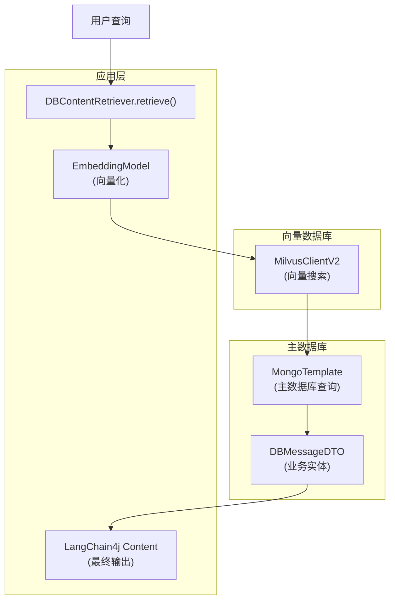

# 数据库联合检索

<cite>
**Referenced Files in This Document**   
- [DBContentRetriever.java](file://ai/src/main/java/com/shuanglin/bot/langchain4j/rag/retriever/DBContentRetriever.java)
- [FilterQueryRetriever.java](file://ai/src/main/java/com/shuanglin/bot/langchain4j/rag/retriever/FilterQueryRetriever.java)
- [DBMessageDTO.java](file://ai/src/main/java/com/shuanglin/bot/config/DBMessageDTO.java)
- [MessageStoreEntity.java](file://dbModel/src/main/java/com/shuanglin/dao/message/MessageStoreEntity.java)
- [MilvusProperties.java](file://ai/src/main/java/com/shuanglin/bot/langchain4j/config/vo/MilvusProperties.java)
- [application.yaml](file://ai/src/main/resources/application.yaml)
</cite>

## 目录
1. [引言](#引言)
2. [核心组件与数据流](#核心组件与数据流)
3. [DBContentRetriever 工作流程详解](#dbcontentretriever-工作流程详解)
4. [元数据传递与内容构建](#元数据传递与内容构建)
5. [与 FilterQueryRetriever 的对比分析](#与-filterqueryretriever-的对比分析)
6. [适用场景与性能考量](#适用场景与性能考量)
7. [调试与优化策略](#调试与优化策略)
8. [结论](#结论)

## 引言
本文档旨在系统阐述 `DBContentRetriever` 组件所实现的向量数据库（Milvus）与主数据库（MongoDB）联合检索机制。该机制通过结合向量搜索的语义理解能力与传统数据库的精确查询能力，为大语言模型（LLM）提供既相关又富含业务上下文的检索结果。文档将详细解析其工作流程、核心设计思想，并与功能相似的 `FilterQueryRetriever` 进行对比，最后提供实用的调试和优化建议。

## 核心组件与数据流
该联合检索系统由多个核心组件协同工作，形成清晰的数据流。

**Diagram sources**
- [DBContentRetriever.java](file://ai/src/main/java/com/shuanglin/bot/langchain4j/rag/retriever/DBContentRetriever.java#L24-L137)
- [DBMessageDTO.java](file://ai/src/main/java/com/shuanglin/bot/config/DBMessageDTO.java#L1-L15)

**Section sources**
- [DBContentRetriever.java](file://ai/src/main/java/com/shuanglin/bot/langchain4j/rag/retriever/DBContentRetriever.java#L24-L137)
- [DBMessageDTO.java](file://ai/src/main/java/com/shuanglin/bot/config/DBMessageDTO.java#L1-L15)
- [MessageStoreEntity.java](file://dbModel/src/main/java/com/shuanglin/dao/message/MessageStoreEntity.java#L1-L28)

## DBContentRetriever 工作流程详解
`DBContentRetriever` 的 `retrieve` 方法是整个联合检索过程的核心，其执行流程可分为五个关键步骤：

1.  **查询向量化**: 接收用户查询文本后，首先通过注入的 `EmbeddingModel`（如Gemini）将其转换为高维向量。
2.  **向量相似度搜索**: 使用生成的向量，在 Milvus 向量数据库中执行相似度搜索。搜索请求指定了目标数据库（`milvusDB`）和集合（`novelCollection`），并返回最相似的前 `topK`（默认5）个结果。
3.  **提取主键ID**: 从 Milvus 返回的搜索结果中，提取出匹配向量所对应的主键ID（即 `memoryId`）。这些ID是连接向量数据与主数据库记录的桥梁。
4.  **主数据库批量查询**: 利用上一步得到的 `memoryId` 列表，通过 `MongoTemplate` 构造一个 `in` 条件的查询，一次性从 MongoDB 的 `storeDB` 数据库中批量获取完整的业务实体对象（`DBMessageDTO`）。
5.  **结果整合与返回**: 将从 MongoDB 查询到的多个 `DBMessageDTO` 对象的内容（`content` 字段）拼接成一个长文本，并将其封装为 LangChain4j 的 `Content` 对象，最终返回给调用者。

**Section sources**
- [DBContentRetriever.java](file://ai/src/main/java/com/shuanglin/bot/langchain4j/rag/retriever/DBContentRetriever.java#L24-L137)

## 元数据传递与内容构建
在 `DBContentRetriever` 的实现中，元数据（Metadata）的传递主要体现在最终的 `Content` 对象构建阶段。虽然向量搜索结果中的元数据（如 `memoryId`）被用于主键提取，但最终返回给 LLM 的 `Content` 对象包含了一个固定的元数据映射，其键为 `"contentType"`，值为 `"knowledge"`。这为 LLM 提供了关于检索内容类型的上下文信息。

内容的构建方式是将所有匹配的 `DBMessageDTO` 的 `content` 字段通过换行符连接，形成一个单一的、信息丰富的文本片段。这种方式确保了 LLM 能够接收到一个连贯的、包含多个相关知识点的上下文，而非零散的片段。

**Section sources**
- [DBContentRetriever.java](file://ai/src/main/java/com/shuanglin/bot/langchain4j/rag/retriever/DBContentRetriever.java#L120-L125)
- [DBMessageDTO.java](file://ai/src/main/java/com/shuanglin/bot/config/DBMessageDTO.java#L1-L15)

## 与 FilterQueryRetriever 的对比分析
`DBContentRetriever` 和 `FilterQueryRetriever` 都实现了向量与主数据库的联合检索，但它们在过滤逻辑上存在显著差异。

`DBContentRetriever` 的过滤逻辑是**隐式的**，完全基于向量相似度。它不关心向量数据中存储的任何其他元数据，只依赖于向量本身的相似性来决定哪些 `memoryId` 应该被提取。其过滤发生在向量搜索阶段。

相比之下，`FilterQueryRetriever` 的过滤逻辑是**显式的**。它利用 `Query` 对象的元数据（`query.metadata()`）来构建一个过滤模板（`filterTemplateValues`），这个模板会作为搜索条件直接传递给 Milvus。这意味着，除了向量相似度，还可以根据 `modelName` 等业务属性进行精确过滤，从而实现更复杂的检索策略。

**Section sources**
- [DBContentRetriever.java](file://ai/src/main/java/com/shuanglin/bot/langchain4j/rag/retriever/DBContentRetriever.java#L24-L137)
- [FilterQueryRetriever.java](file://ai/src/main/java/com/shuanglin/bot/langchain4j/rag/retriever/FilterQueryRetriever.java#L24-L152)

## 适用场景与性能考量
`DBContentRetriever` 特别适用于需要**精确匹配语义**并**获取丰富业务上下文**的场景。例如，在知识库问答系统中，用户的模糊问题可以通过向量搜索找到最相关的知识片段ID，然后通过主数据库查询获取这些知识的完整、结构化的信息。

然而，这种两阶段查询（向量搜索 + 主数据库查询）也带来了性能上的考量。向量搜索的性能主要取决于 Milvus 的索引效率和 `topK` 的大小，而主数据库查询的性能则取决于 `memoryId` 列表的长度和 MongoDB 的查询效率。批量查询 `in` 操作是优化的关键，避免了对每个ID进行单独查询。

**Section sources**
- [DBContentRetriever.java](file://ai/src/main/java/com/shuanglin/bot/langchain4j/rag/retriever/DBContentRetriever.java#L24-L137)
- [application.yaml](file://ai/src/main/resources/application.yaml#L50-L57)

## 调试与优化策略
### 调试数据不一致问题
当向量搜索返回了 `memoryId`，但主数据库查询却找不到对应记录时，表明存在数据不一致。调试策略包括：
1.  **日志分析**: 检查 `DBContentRetriever` 的日志，确认从 Milvus 提取的 `memoryId` 列表和 MongoDB 查询的 `memoryId` 列表是否一致。
2.  **数据验证**: 手动在 Milvus 中查询 `memoryId` 对应的向量记录，并在 MongoDB 中查询该 `memoryId` 是否存在，以定位是向量数据未同步还是主数据已删除。

### 性能瓶颈优化方向
1.  **向量数据库优化**: 确保 Milvus 集合上建立了高效的索引（如 IVF_FLAT, HNSW），并根据数据量和查询延迟要求调整 `nlist` 和 `nprobe` 参数。
2.  **主数据库优化**: 在 MongoDB 的 `memoryId` 字段上创建索引，以加速 `in` 查询。
3.  **缓存机制**: 对于高频查询，可以考虑在 `DBContentRetriever` 外部引入缓存（如 Redis），缓存 `Query` 文本到 `Content` 列表的映射，避免重复的向量搜索和数据库查询。

**Section sources**
- [DBContentRetriever.java](file://ai/src/main/java/com/shuanglin/bot/langchain4j/rag/retriever/DBContentRetriever.java#L24-L137)
- [application.yaml](file://ai/src/main/resources/application.yaml#L50-L57)

## 结论
`DBContentRetriever` 实现了一种高效且实用的联合检索模式，通过解耦语义搜索与精确数据获取，充分发挥了向量数据库和传统数据库的各自优势。其设计简洁，流程清晰，能够为 LLM 提供高质量的上下文信息。理解其与 `FilterQueryRetriever` 在过滤逻辑上的异同，有助于根据具体业务需求选择合适的检索器。通过实施有效的调试和优化策略，可以确保该机制在生产环境中的稳定性和高性能。