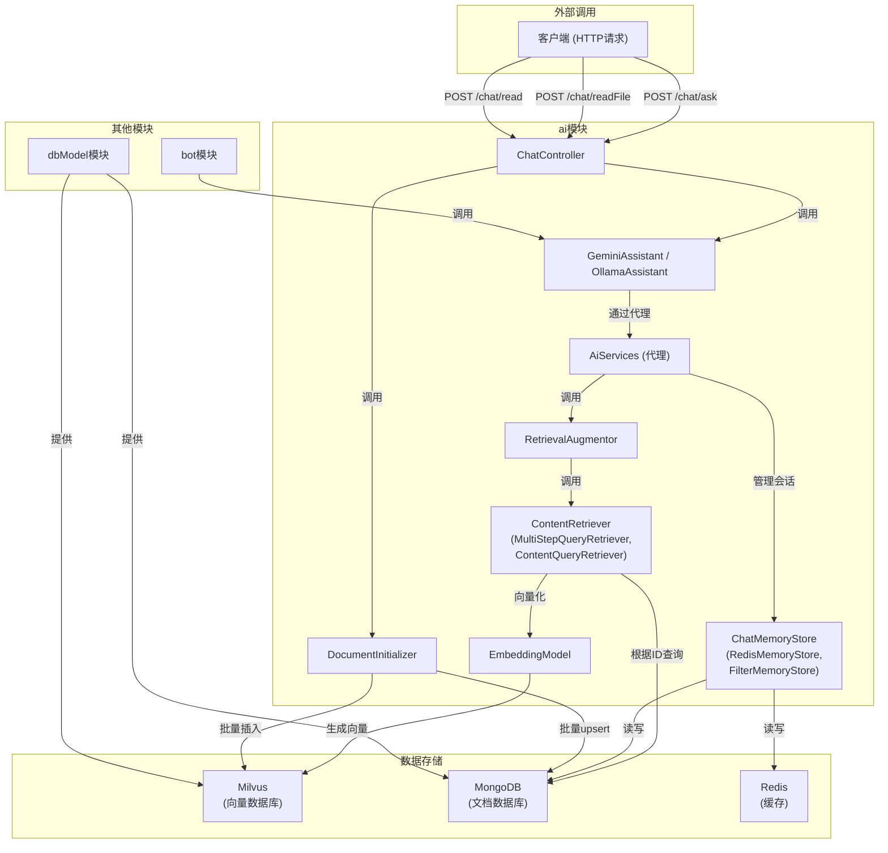

# ai模块详解

<cite>
**本文档引用的文件**
- [ChatController.java](file://ai/src/main/java/com/shuanglin/bot/langchain4j/controller/ChatController.java)
- [ApiModelsConfiguration.java](file://ai/src/main/java/com/shuanglin/bot/langchain4j/config/ApiModelsConfiguration.java)
- [MultiStepQueryRetriever.java](file://ai/src/main/java/com/shuanglin/bot/langchain4j/rag/retriever/MultiStepQueryRetriever.java)
- [ContentQueryRetriever.java](file://ai/src/main/java/com/shuanglin/bot/langchain4j/rag/retriever/ContentQueryRetriever.java)
- [DBContentRetriever.java](file://ai/src/main/java/com/shuanglin/bot/langchain4j/rag/retriever/DBContentRetriever.java)
- [RedisMemoryStore.java](file://ai/src/main/java/com/shuanglin/bot/langchain4j/store/RedisMemoryStore.java)
- [FilterMemoryStore.java](file://ai/src/main/java/com/shuanglin/bot/langchain4j/store/FilterMemoryStore.java)
- [MultiStepMemoryStore.java](file://ai/src/main/java/com/shuanglin/bot/langchain4j/store/MultiStepMemoryStore.java)
- [GeminiAssistant.java](file://ai/src/main/java/com/shuanglin/bot/langchain4j/assistant/GeminiAssistant.java)
- [OllamaAssistant.java](file://ai/src/main/java/com/shuanglin/bot/langchain4j/assistant/OllamaAssistant.java)
- [DocumentInitializer.java](file://ai/src/main/java/com/shuanglin/bot/langchain4j/config/DocumentInitializer.java)
- [DecomposeAssistant.java](file://ai/src/main/java/com/shuanglin/bot/langchain4j/assistant/DecomposeAssistant.java)
- [application.yaml](file://ai/src/main/resources/application.yaml)
</cite>

## 目录
1. [引言](#引言)
2. [LangChain4j框架集成与AiServices配置](#langchain4j框架集成与aiservices配置)
3. [RAG系统核心组件分析](#rag系统核心组件分析)
4. [会话管理策略与MemoryStore实现](#会话管理策略与memorystore实现)
5. [多模型AI服务接口实现](#多模型ai服务接口实现)
6. [API端点设计与实现](#api端点设计与实现)
7. [文档解析与知识库构建](#文档解析与知识库构建)
8. [组件交互与数据调用关系](#组件交互与数据调用关系)

## 引言
ai模块是整个系统的核心智能引擎，它基于LangChain4j框架构建，实现了检索增强生成（RAG）、多模型支持、复杂会话管理以及知识图谱构建等高级功能。该模块通过与bot、dbModel等模块的协同工作，为上层应用提供强大的AI能力。本文档将深入剖析其架构与实现细节。

## LangChain4j框架集成与AiServices配置

ai模块通过`ApiModelsConfiguration`类对LangChain4j框架进行集成和配置。该类使用Spring的`@Configuration`注解，定义了多个Bean，其中最关键的是通过`AiServices`工厂创建的AI服务代理。

`AiServices`是LangChain4j提供的一个核心工具，它能够根据接口定义，自动创建出一个实现了该接口的代理对象。这个代理对象封装了与大语言模型（LLM）交互的复杂性，开发者只需定义接口方法，即可像调用普通Java方法一样发起AI请求。

在`ApiModelsConfiguration`中，`ollamaAssistant`和`geminiAssistant`两个Bean的创建过程体现了这一机制。它们通过`AiServices.builder()`方法，指定了：
- **ChatModel**: 用于同步聊天的模型实例（如`OllamaChatModel`或`GoogleAiGeminiChatModel`）。
- **StreamingChatModel**: 用于流式响应的模型实例。
- **ChatMemoryProvider**: 用于管理会话历史的提供者，它指定了`MessageWindowChatMemory`作为内存管理器，并注入了自定义的`FilterMemoryStore`或`RedisMemoryStore`作为持久化存储。
- **RetrievalAugmentor**: 用于实现RAG功能的增强器，它会将用户的查询与从知识库中检索到的相关内容结合，再发送给LLM，从而生成更准确、信息更丰富的回答。

通过这种方式，`GeminiAssistant`和`OllamaAssistant`接口的实现被自动化，开发者可以专注于业务逻辑，而无需处理底层的HTTP请求、提示词工程和上下文管理。

**Section sources**
- [ApiModelsConfiguration.java](file://ai/src/main/java/com/shuanglin/bot/langchain4j/config/ApiModelsConfiguration.java#L89-L165)

## RAG系统核心组件分析

RAG（Retrieval-Augmented Generation）系统是ai模块的核心，它通过从外部知识库中检索相关信息来增强LLM的生成能力，解决了LLM知识固化和可能产生“幻觉”的问题。该系统由多个`ContentRetriever`实现类构成，每个类负责不同的检索策略。

### MultiStepQueryRetriever：多步分解检索机制

`MultiStepQueryRetriever`实现了复杂的多步查询分解检索。其核心思想是将一个复杂的、模糊的用户查询分解为多个更简单、更精确的子问题，然后对每个子问题进行独立检索，最后将结果聚合。

其`retrieve`方法的执行流程如下：
1.  **接收原始查询**：接收来自`RetrievalAugmentor`的原始查询文本。
2.  **查询分解**：调用`DecomposeAssistant`的`decompose`方法。`DecomposeAssistant`本身也是一个由`AiServices`创建的AI服务，它使用一个专门的LLM（在配置中指定为`gemma3:12b`）和一个系统提示词（`kgKnowlage.md`）来执行分解任务。该提示词要求LLM将问题分解为3个或更少的子问题，并以分号分隔。
3.  **向量化子查询**：使用`EmbeddingModel`（如Gemini的嵌入模型）将所有分解后的子查询转换为向量。
4.  **向量检索**：将这些向量发送到向量数据库Milvus进行搜索，获取与这些子查询最相关的向量记录。
5.  **获取原始内容**：从Milvus的搜索结果中提取出`storeId`（即`memoryId`），然后使用该ID在MongoDB中查询完整的原始文档内容。
6.  **返回结果**：将查询到的原始内容封装成`Content`对象列表，返回给RAG系统，用于增强后续的AI生成。

这种机制极大地提高了对复杂问题的检索准确率。

**Section sources**
- [MultiStepQueryRetriever.java](file://ai/src/main/java/com/shuanglin/bot/langchain4j/rag/retriever/MultiStepQueryRetriever.java#L36-L114)
- [DecomposeAssistant.java](file://ai/src/main/java/com/shuanglin/bot/langchain4j/assistant/DecomposeAssistant.java#L8-L9)

### ContentQueryRetriever：向量查询流程

`ContentQueryRetriever`是RAG系统中最基础的检索器，它执行标准的“查询-向量化-检索”流程。

其`retrieve`方法的执行流程如下：
1.  **向量化查询**：直接将用户的原始查询文本通过`embeddingModel`转换为一个向量。
2.  **向量检索**：使用这个向量在Milvus向量数据库中进行相似性搜索，找到最接近的`topK`个向量记录。
3.  **获取原始内容**：与`MultiStepQueryRetriever`类似，从Milvus的结果中提取`storeId`，并用它在MongoDB中查找完整的文档内容。
4.  **返回结果**：将内容封装并返回。

与多步检索器不同，`ContentQueryRetriever`不进行查询分解，适用于查询本身已经很明确的场景。

**Section sources**
- [ContentQueryRetriever.java](file://ai/src/main/java/com/shuanglin/bot/langchain4j/rag/retriever/ContentQueryRetriever.java#L31-L87)

### DBContentRetriever：数据库检索逻辑

`DBContentRetriever`是另一个基础检索器，它的逻辑与`ContentQueryRetriever`非常相似，但其配置和使用场景略有不同。它通过`@Value`注解从`application.yaml`配置文件中读取默认的数据库名和集合名，这使得其配置更加灵活。

其核心逻辑同样是将查询向量化后在Milvus中搜索，然后根据搜索结果中的`memoryId`去MongoDB中获取完整的`DBMessageDTO`对象。一个关键的区别在于，它将所有检索到的文档内容通过`StringJoiner`合并成一个单一的`Content`对象，而不是返回一个列表。这表明它可能被设计用于将多个相关片段合并成一个连贯的上下文。

**Section sources**
- [DBContentRetriever.java](file://ai/src/main/java/com/shuanglin/bot/langchain4j/rag/retriever/DBContentRetriever.java#L24-L137)

## 会话管理策略与MemoryStore实现

ai模块实现了多种会话管理策略，通过不同的`ChatMemoryStore`实现类来满足不同的业务需求。`ChatMemoryStore`是LangChain4j用于持久化会话历史的接口。

### RedisMemoryStore：基于Redis的缓存策略

`RedisMemoryStore`实现了基于Redis的缓存策略。其核心思想是利用Redis作为高速缓存，而MongoDB作为持久化存储。

-   **getMessages**：首先尝试从Redis中根据`memoryId`获取会话历史。如果Redis中不存在，则回退到MongoDB中查询，并将查询结果写回Redis，实现缓存穿透的处理。
-   **updateMessages**：当会话历史更新时，会同时更新MongoDB中的记录，并删除Redis中对应的缓存条目，确保下次读取时能从数据库获取最新数据，实现缓存失效。

这种策略平衡了读取性能和数据一致性。

**Section sources**
- [RedisMemoryStore.java](file://ai/src/main/java/com/shuanglin/bot/langchain4j/store/RedisMemoryStore.java#L26-L114)

### FilterMemoryStore：基于消息ID的过滤策略

`FilterMemoryStore`实现了一种基于消息ID的过滤策略。它不直接管理完整的会话历史，而是根据传入的JSON参数（如`messageId`）从MongoDB中筛选出特定的消息。

-   **getMessages**：它会解析传入的JSON参数，如果包含`messageId`，则直接在MongoDB中查询该ID对应的消息内容，并将其作为`UserMessage`返回。这表明它可能用于检索单条特定消息的上下文，而不是完整的会话。
-   **updateMessages**：它会检查参数中是否包含`memoryId`。如果存在，则将新消息追加到该`memoryId`对应的文档中；如果不存在，则创建一个以`messageId`为标识的新文档。这提供了一种灵活的会话创建和更新机制。

**Section sources**
- [FilterMemoryStore.java](file://ai/src/main/java/com/shuanglin/bot/langchain4j/store/FilterMemoryStore.java#L23-L116)

### MultiStepMemoryStore：多步RAG专用存储

`MultiStepMemoryStore`是专门为`MultiStepQueryRetriever`设计的存储。它的`getMessages`方法逻辑与`FilterMemoryStore`类似，但优先级不同：它优先检查`memoryId`，如果不存在再检查`messageId`。这与多步检索的流程相匹配。

**Section sources**
- [MultiStepMemoryStore.java](file://ai/src/main/java/com/shuanglin/bot/langchain4j/store/MultiStepMemoryStore.java#L37-L117)

### NonMemoryStore：非会话记录存储

`NonMemoryStore`是一个被注释掉的实现，其设计意图是“每一次都是模型知识”，即不存储会话历史，而是根据传入的参数（如`groupId`, `userId`, `modelId`）从知识库中动态查询相关内容作为上下文。这表明系统支持一种无状态的、基于知识库的问答模式。

## 多模型AI服务接口实现

ai模块通过`GeminiAssistant`和`OllamaAssistant`两个接口实现了对多模型的支持。

### GeminiAssistant
`GeminiAssistant`接口定义了与Google Gemini模型交互的方法。它利用LangChain4j的`@UserMessage`和`@V`注解来构建提示词（Prompt）。
-   `chat`方法使用`@V("question")`将传入的`question`参数注入到`user-session-message.md`模板中。
-   `enhancedEntityExtraction`方法则使用一个复杂的系统提示词，专门用于将小说文本转换为Neo4j的Cypher插入语句，体现了其在知识图谱构建方面的专用能力。

**Section sources**
- [GeminiAssistant.java](file://ai/src/main/java/com/shuanglin/bot/langchain4j/assistant/GeminiAssistant.java#L10-L77)

### OllamaAssistant
`OllamaAssistant`接口定义了与Ollama本地模型交互的方法。其设计与`GeminiAssistant`类似，也使用`@UserMessage`和`@V`注解来构建提示词。`v4Chat`和`chat`方法都接收一个包含会话参数的`JsonObject`和一个`question`，通过`@MemoryId`注解将`memoryId`传递给`ChatMemoryProvider`，从而实现会话管理。

**Section sources**
- [OllamaAssistant.java](file://ai/src/main/java/com/shuanglin/bot/langchain4j/assistant/OllamaAssistant.java#L5-L43)

## API端点设计与实现

`ChatController`类暴露了供外部调用的API端点，是ai模块与外部系统交互的入口。

### /chat/ask 端点
该端点处理用户的聊天请求。它接收一个包含`message`和`userId`等信息的JSON字符串，通过`gson`解析后，调用`ollamaAssistant.chat()`方法进行处理。在调用前，它会为消息生成一个唯一的`messageId`，用于日志追踪和会话管理。

**Section sources**
- [ChatController.java](file://ai/src/main/java/com/shuanglin/bot/langchain4j/controller/ChatController.java#L32-L39)

### /chat/readFile 端点
该端点用于上传并解析文件。它接收一个`MultipartFile`，将其保存为临时文件，然后调用`documentInitializer.readFile()`方法。这表明文件解析和知识库构建是通过一个独立的服务完成的。

**Section sources**
- [ChatController.java](file://ai/src/main/java/com/shuanglin/bot/langchain4j/controller/ChatController.java#L41-L58)

### /chat/read 端点
该端点用于直接读取一段文本内容。它创建一个包含`userId`和`modelName`的`JsonObject`参数，然后调用`documentInitializer.read()`方法，将文本内容添加到知识库中。

**Section sources**
- [ChatController.java](file://ai/src/main/java/com/shuanglin/bot/langchain4j/controller/ChatController.java#L60-L67)

## 文档解析与知识库构建

`DocumentInitializer`类负责文档的解析和知识库的构建，是RAG系统数据来源的核心。

### 文档解析流程
`readFile`方法是入口。它首先检查文件是否为ZIP格式，如果是，则调用`processZipFile`方法处理压缩包内的所有文本文件；否则，将其视为单个文件处理。
-   **单文件处理**：使用`FileReadUtil`读取文件内容，然后调用`processSingleContent`方法。
-   **ZIP文件处理**：遍历ZIP包内的所有条目，使用`ProjectReaderUtil.isTextFile()`判断是否为文本文件，然后读取其内容，并为每个文件单独调用`processSingleContent`。

### 知识库构建过程
`processSingleContent`方法是知识库构建的核心。
1.  **生成唯一ID**：为每一份内容（无论是整个文件还是单个文本段落）生成一个唯一的`segmentId`。
2.  **向量化**：使用`embeddingModel`将文本内容转换为向量。
3.  **准备数据**：将向量、`segmentId`和其他元数据（如`storeType`）封装成`MessageEmbeddingEntity`对象，用于存入Milvus向量数据库；同时将原始文本内容和`segmentId`封装成`MessageStoreEntity`对象，用于存入MongoDB。
4.  **批量存储**：在`processZipFile`方法中，会将所有文件的待存储数据先收集到列表中，最后进行批量插入（`milvusClientV2.insert`）和批量更新（`mongoTemplate.upsert`），以提高效率。

**Section sources**
- [DocumentInitializer.java](file://ai/src/main/java/com/shuanglin/bot/langchain4j/config/DocumentInitializer.java#L36-L268)

## 组件交互与数据调用关系

**Diagram sources**
- [ChatController.java](file://ai/src/main/java/com/shuanglin/bot/langchain4j/controller/ChatController.java)
- [ApiModelsConfiguration.java](file://ai/src/main/java/com/shuanglin/bot/langchain4j/config/ApiModelsConfiguration.java)
- [MultiStepQueryRetriever.java](file://ai/src/main/java/com/shuanglin/bot/langchain4j/rag/retriever/MultiStepQueryRetriever.java)
- [RedisMemoryStore.java](file://ai/src/main/java/com/shuanglin/bot/langchain4j/store/RedisMemoryStore.java)
- [DocumentInitializer.java](file://ai/src/main/java/com/shuanglin/bot/langchain4j/config/DocumentInitializer.java)
- [dbModel模块](file://dbModel/src/main/java/com/shuanglin/dao)

**Section sources**
- [ChatController.java](file://ai/src/main/java/com/shuanglin/bot/langchain4j/controller/ChatController.java)
- [ApiModelsConfiguration.java](file://ai/src/main/java/com/shuanglin/bot/langchain4j/config/ApiModelsConfiguration.java)
- [MultiStepQueryRetriever.java](file://ai/src/main/java/com/shuanglin/bot/langchain4j/rag/retriever/MultiStepQueryRetriever.java)
- [RedisMemoryStore.java](file://ai/src/main/java/com/shuanglin/bot/langchain4j/store/RedisMemoryStore.java)
- [DocumentInitializer.java](file://ai/src/main/java/com/shuanglin/bot/langchain4j/config/DocumentInitializer.java)
- [dbModel模块](file://dbModel/src/main/java/com/shuanglin/dao)