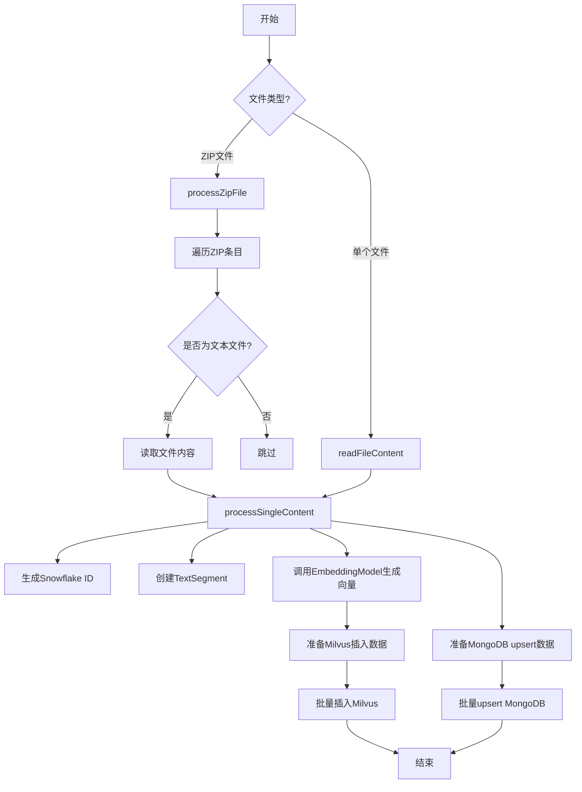
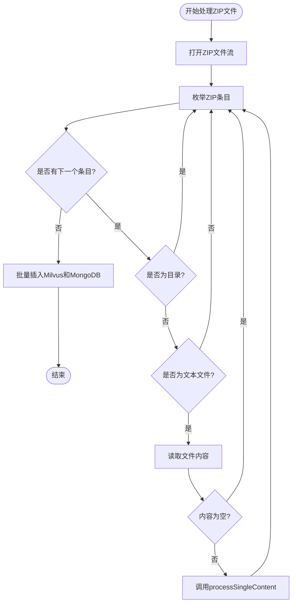
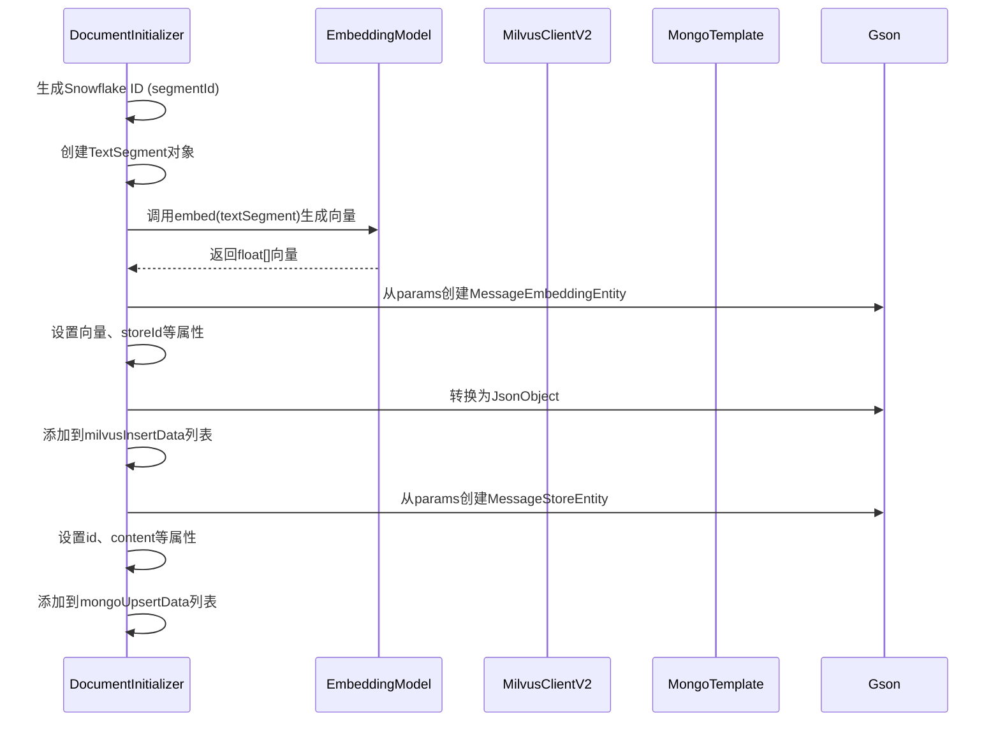
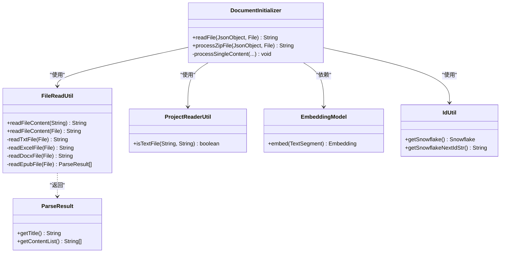

# 文档处理系统

<cite>
**本文档中引用的文件**  
- [DocumentInitializer.java](file://ai/src/main/java/com/shuanglin/bot/langchain4j/config/DocumentInitializer.java)
- [FileReadUtil.java](file://ai/src/main/java/com/shuanglin/bot/utils/FileReadUtil.java)
- [ProjectReaderUtil.java](file://ai/src/main/java/com/shuanglin/bot/utils/ProjectReaderUtil.java)
- [GeminiEmbedding.java](file://ai/src/main/java/com/shuanglin/bot/langchain4j/rag/embedding/model/GeminiEmbedding.java)
- [MilvusClusterCenterFinder.java](file://ai/src/main/java/com/shuanglin/bot/langchain4j/rag/util/MilvusClusterCenterFinder.java)
</cite>

## 目录
1. [简介](#简介)
2. [核心组件分析](#核心组件分析)
3. [文档处理流程架构](#文档处理流程架构)
4. [详细组件分析](#详细组件分析)
5. [依赖关系分析](#依赖关系分析)
6. [性能考量与优化建议](#性能考量与优化建议)
7. [结论](#结论)

## 简介
本文档深入解析了文档处理流程的设计与实现，重点阐述了`DocumentInitializer`类如何协调文件读取、内容解析、向量化及数据存储的全过程。系统支持处理单个文本或Office文档，以及包含多个文本文件的ZIP压缩包。通过调用`FileReadUtil`工具类读取多种格式文件内容，利用`EmbeddingModel`生成语义向量，并将向量数据与原始文本分别存储于Milvus和MongoDB中。整个流程通过Snowflake算法生成全局唯一ID保证数据一致性，同时揭示了当前实现对大文件处理的潜在内存风险，并提出了分块处理的优化方向。

## 核心组件分析

`DocumentInitializer`是文档处理流程的核心协调者，负责启动和管理从文件读取到数据持久化的整个生命周期。它通过`readFile`方法作为入口，判断文件类型并分发处理逻辑：对于普通文件，直接读取内容；对于ZIP文件，则调用`processZipFile`方法进行批量处理。核心的`processSingleContent`方法负责为每个文档单元生成唯一ID、调用嵌入模型生成向量，并准备在Milvus和MongoDB中的批量插入数据。`FileReadUtil`则作为底层文件读取工具，支持.txt、.xls、.xlsx、.docx和.epub等多种格式，确保了系统对异构文档的兼容性。

**文档来源**
- [DocumentInitializer.java](file://ai/src/main/java/com/shuanglin/bot/langchain4j/config/DocumentInitializer.java#L36-L268)
- [FileReadUtil.java](file://ai/src/main/java/com/shuanglin/bot/utils/FileReadUtil.java#L0-L255)

## 文档处理流程架构

**图表来源**  
- [DocumentInitializer.java](file://ai/src/main/java/com/shuanglin/bot/langchain4j/config/DocumentInitializer.java#L36-L268)
- [FileReadUtil.java](file://ai/src/main/java/com/shuanglin/bot/utils/FileReadUtil.java#L0-L255)

## 详细组件分析

### DocumentInitializer 核心处理逻辑

`DocumentInitializer`的`readFile`方法是处理流程的起点。当传入一个文件时，它首先检查文件的有效性，然后根据文件扩展名判断是否为ZIP文件。如果是ZIP文件，则调用`processZipFile`方法进行处理；否则，使用`FileReadUtil.readFileContent`读取文件内容，并将整个文件内容作为一个独立单元调用`processSingleContent`进行处理。

#### ZIP文件批量处理流程

**图表来源**  
- [DocumentInitializer.java](file://ai/src/main/java/com/shuanglin/bot/langchain4j/config/DocumentInitializer.java#L107-L199)

#### 单文档处理核心方法

**图表来源**  
- [DocumentInitializer.java](file://ai/src/main/java/com/shuanglin/bot/langchain4j/config/DocumentInitializer.java#L244-L268)

### 文件读取与格式支持

`FileReadUtil`类提供了统一的文件读取接口，能够根据文件扩展名自动选择相应的解析器。它支持多种格式，包括纯文本(.txt)、Excel(.xls, .xlsx)、Word(.docx)和电子书(.epub)。对于非文本文件，系统会抛出`UnsupportedOperationException`。`ProjectReaderUtil.isTextFile`方法则用于在处理ZIP文件时筛选出文本类型的条目，它通过检查文件扩展名和特殊文件名（如.gitignore）来判断。

**文档来源**
- [FileReadUtil.java](file://ai/src/main/java/com/shuanglin/bot/utils/FileReadUtil.java#L0-L255)
- [ProjectReaderUtil.java](file://ai/src/main/java/com/shuanglin/bot/utils/ProjectReaderUtil.java#L111-L144)

### 向量生成与数据存储

系统采用`EmbeddingModel`（如GeminiEmbedding）将文本内容转换为高维向量。`processSingleContent`方法将读取的文本内容包装成`TextSegment`对象，并调用注入的`embeddingModel`的`embed`方法生成向量。生成的向量被封装在`MessageEmbeddingEntity`中，准备插入向量数据库Milvus；同时，原始文本内容被封装在`MessageStoreEntity`中，准备存储到文档数据库MongoDB。这种分离存储策略实现了向量检索与原文获取的解耦，提高了系统的灵活性和可维护性。

**文档来源**
- [DocumentInitializer.java](file://ai/src/main/java/com/shuanglin/bot/langchain4j/config/DocumentInitializer.java#L244-L268)
- [GeminiEmbedding.java](file://ai/src/main/java/com/shuanglin/bot/langchain4j/rag/embedding/model/GeminiEmbedding.java#L0-L3)

## 依赖关系分析

**图表来源**  
- [DocumentInitializer.java](file://ai/src/main/java/com/shuanglin/bot/langchain4j/config/DocumentInitializer.java#L36-L268)
- [FileReadUtil.java](file://ai/src/main/java/com/shuanglin/bot/utils/FileReadUtil.java#L0-L255)

## 性能考量与优化建议

当前实现存在一个显著的性能风险：在处理大文件或包含大文件的ZIP包时，会将整个文件内容一次性读入内存。例如，在`processZipFile`方法中，`entryInputStream.readAllBytes()`会将整个ZIP条目加载到内存中，这可能导致`OutOfMemoryError`。此外，`FileReadUtil`在读取Excel和Word文件时也采用了一次性加载的策略。

**优化方向**：
1.  **分块处理（Chunking）**：引入文档分块机制，将大文件分割成固定大小的文本块（chunks），然后对每个块分别生成向量。这不仅能解决内存问题，还能提高检索的粒度和准确性。
2.  **流式处理**：对于文本文件，可以采用逐行读取的方式，避免一次性加载。
3.  **异步处理**：将耗时的文件读取和向量生成操作放入异步任务中，避免阻塞主线程。
4.  **内存监控**：增加对JVM内存使用情况的监控，在内存不足时触发告警或降级策略。

**文档来源**
- [DocumentInitializer.java](file://ai/src/main/java/com/shuanglin/bot/langchain4j/config/DocumentInitializer.java#L148)
- [FileReadUtil.java](file://ai/src/main/java/com/shuanglin/bot/utils/FileReadUtil.java#L138)

## 结论
本文档详细解析了文档处理系统的设计与实现。`DocumentInitializer`作为核心组件，通过协调`FileReadUtil`、`EmbeddingModel`等服务，实现了从文件读取到向量存储的完整流程。系统通过Snowflake算法保证了ID的全局唯一性，并采用向量与原文分离的存储策略。尽管当前实现功能完整，但对大文件的处理存在内存风险。未来应重点引入分块处理机制，以提升系统的健壮性和可扩展性，更好地适应大规模文档处理的需求。