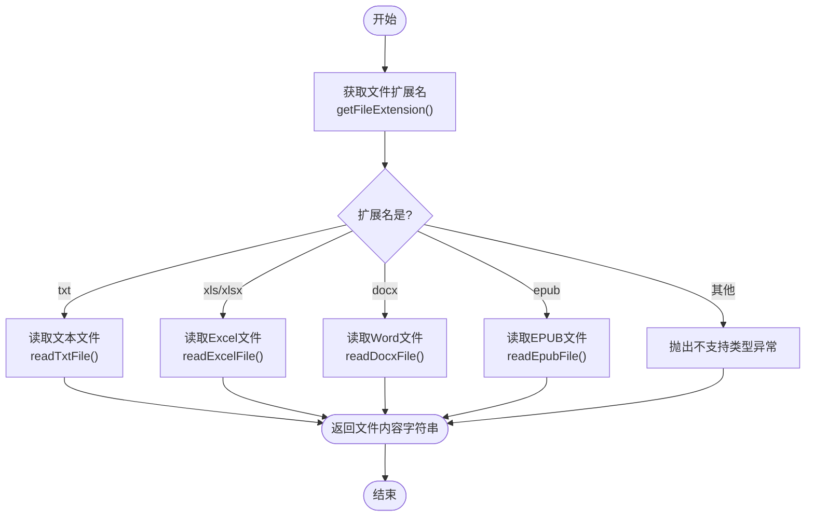
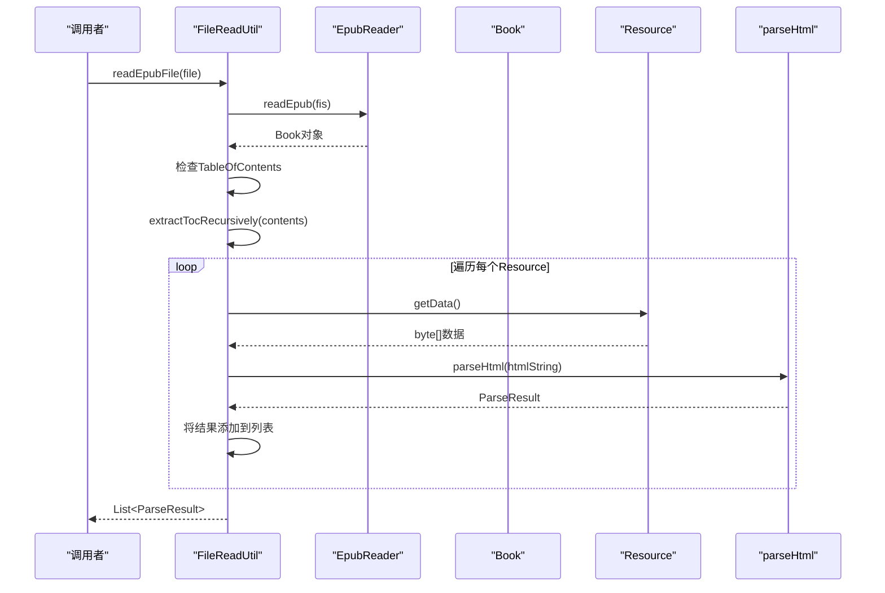
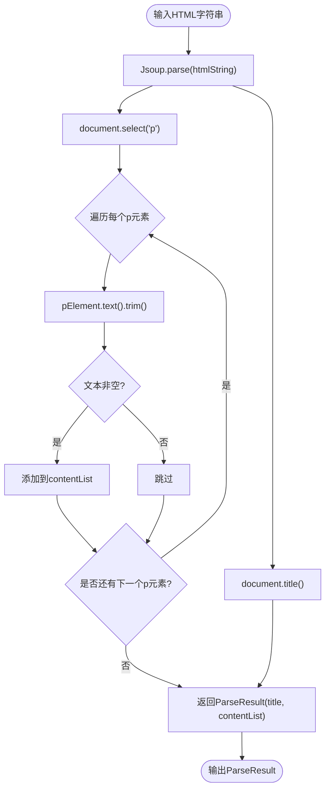

# 文档解析流程

<cite>
**Referenced Files in This Document**   
- [FileReadUtil.java](file://ai/src/main/java/com/shuanglin/bot/utils/FileReadUtil.java)
- [ProjectReaderUtil.java](file://ai/src/main/java/com/shuanglin/bot/utils/ProjectReaderUtil.java)
- [DocumentInitializer.java](file://ai/src/main/java/com/shuanglin/bot/langchain4j/config/DocumentInitializer.java)
- [GraphService.java](file://ai/src/main/java/com/shuanglin/bot/service/GraphService.java)
</cite>

## 目录
1. [核心组件](#核心组件)
2. [文件读取分发机制](#文件读取分发机制)
3. [EPUB文件解析流程](#epub文件解析流程)
4. [文本文件类型判断](#文本文件类型判断)
5. [HTML内容提取与处理](#html内容提取与处理)
6. [当前局限性与优化建议](#当前局限性与优化建议)

## 核心组件

本系统的核心文档解析功能主要由`FileReadUtil`和`ProjectReaderUtil`两个工具类实现。`FileReadUtil`负责处理单个文件的读取，支持多种格式，包括纯文本、Office文档和EPUB电子书。`ProjectReaderUtil`则专注于处理ZIP压缩包内的项目文件，能够识别并提取其中的文本文件内容。这两个工具类被`DocumentInitializer`等上层服务调用，用于知识库的初始化和数据处理。

**Section sources**
- [FileReadUtil.java](file://ai/src/main/java/com/shuanglin/bot/utils/FileReadUtil.java#L1-L255)
- [ProjectReaderUtil.java](file://ai/src/main/java/com/shuanglin/bot/utils/ProjectReaderUtil.java#L1-L185)

## 文件读取分发机制

`FileReadUtil`类通过`readFileContent`方法实现了基于文件扩展名的逻辑分发。该方法首先获取文件的扩展名，然后使用`switch`语句根据扩展名调用相应的私有读取方法。

**Diagram sources**
- [FileReadUtil.java](file://ai/src/main/java/com/shuanglin/bot/utils/FileReadUtil.java#L52-L74)

**Section sources**
- [FileReadUtil.java](file://ai/src/main/java/com/shuanglin/bot/utils/FileReadUtil.java#L34-L41)
- [FileReadUtil.java](file://ai/src/main/java/com/shuanglin/bot/utils/FileReadUtil.java#L52-L74)

## EPUB文件解析流程

`readEpubFile`方法是解析EPUB文件的核心。它利用`epublib`库将EPUB文件加载为一个`Book`对象。该方法首先检查书籍是否有目录（TOC），然后通过调用`extractTocRecursively`方法来遍历书籍的所有内容资源（`Resource`）。

**Diagram sources**
- [FileReadUtil.java](file://ai/src/main/java/com/shuanglin/bot/utils/FileReadUtil.java#L170-L182)
- [FileReadUtil.java](file://ai/src/main/java/com/shuanglin/bot/utils/FileReadUtil.java#L187-L194)

**Section sources**
- [FileReadUtil.java](file://ai/src/main/java/com/shuanglin/bot/utils/FileReadUtil.java#L170-L182)
- [FileReadUtil.java](file://ai/src/main/java/com/shuanglin/bot/utils/FileReadUtil.java#L187-L194)

## 文本文件类型判断

`ProjectReaderUtil`类中的`isTextFile`方法负责判断一个文件是否为文本文件。该方法采用双重判断策略：首先检查文件名是否匹配`SPECIAL_TEXT_FILENAMES`数组中的特殊文件名（如`.gitignore`, `Dockerfile`等），然后检查文件扩展名是否在`TEXT_EXTENSIONS`数组中定义的常见文本文件扩展名列表内。这种设计确保了对无扩展名或点开头的配置文件以及各种编程语言和标记语言文件的准确识别。

**Section sources**
- [ProjectReaderUtil.java](file://ai/src/main/java/com/shuanglin/bot/utils/ProjectReaderUtil.java#L116-L139)

## HTML内容提取与处理

`parseHtml`方法使用`Jsoup`库来解析HTML内容。其处理逻辑是：首先将HTML字符串解析成一个`Document`对象，然后提取文档的`title`。接着，通过`document.select("p")`选择器获取所有`
`标签的元素，并遍历这些元素，提取其纯文本内容（`pElement.text()`），去除首尾空白后，将非空的文本行添加到结果列表中。最终，该方法返回一个包含标题和段落内容列表的`ParseResult`对象。

**Diagram sources**
- [FileReadUtil.java](file://ai/src/main/java/com/shuanglin/bot/utils/FileReadUtil.java#L207-L232)

**Section sources**
- [FileReadUtil.java](file://ai/src/main/java/com/shuanglin/bot/utils/FileReadUtil.java#L207-L232)

## 当前局限性与优化建议

当前的EPUB解析流程存在一定的局限性。`parseHtml`方法仅提取`
`标签内的文本，这导致了对复杂样式内容（如`
`、``、`<h1>`-`<h6>`标题、列表`<ul>`/`<ol>`等）的提取能力不足。此外，该方法没有进行任何HTML清洗，可能会保留一些无用的空白或特殊字符。

**优化建议**：
1.  **增强HTML清洗能力**：引入更强大的HTML清洗库（如`jsoup`的`Whitelist`或`nekohtml`），在提取文本前移除脚本、样式表和无用的标签。
2.  **扩展内容选择器**：修改`parseHtml`方法，使其能够选择并处理更多类型的HTML元素。例如，可以将选择器从`"p"`扩展为`"p, h1, h2, h3, h4, h5, h6, li"`，以捕获标题和列表项。
3.  **结构化内容提取**：改进`ParseResult`类，使其不仅能存储纯文本，还能保留一定的结构信息，例如将标题和段落分开存储，以便后续处理。

**Section sources**
- [FileReadUtil.java](file://ai/src/main/java/com/shuanglin/bot/utils/FileReadUtil.java#L207-L232)
- [FileReadUtil.java](file://ai/src/main/java/com/shuanglin/bot/utils/FileReadUtil.java#L235-L255)