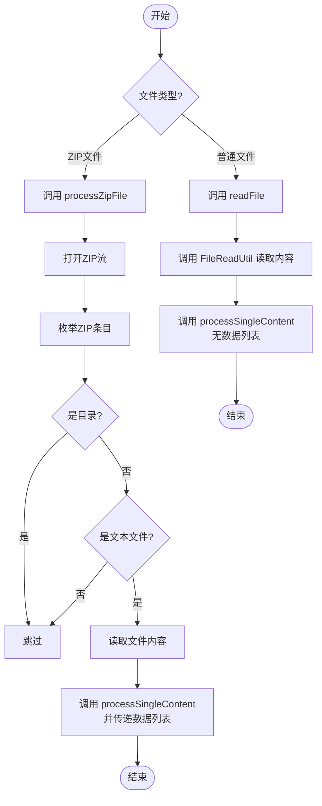
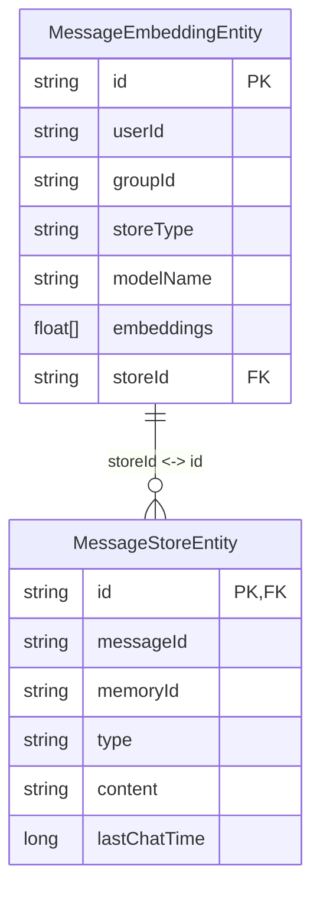

# 知识库构建机制

<cite>
**Referenced Files in This Document**   
- [DocumentInitializer.java](file://ai/src/main/java/com/shuanglin/bot/langchain4j/config/DocumentInitializer.java)
- [MessageEmbeddingEntity.java](file://dbModel/src/main/java/com/shuanglin/dao/milvus/MessageEmbeddingEntity.java)
- [MessageStoreEntity.java](file://dbModel/src/main/java/com/shuanglin/dao/message/MessageStoreEntity.java)
- [FileReadUtil.java](file://ai/src/main/java/com/shuanglin/bot/utils/FileReadUtil.java)
- [ProjectReaderUtil.java](file://ai/src/main/java/com/shuanglin/bot/utils/ProjectReaderUtil.java)
- [MilvusProperties.java](file://ai/src/main/java/com/shuanglin/bot/langchain4j/config/vo/MilvusProperties.java)
- [MongoDBConstant.java](file://common/src/main/java/com/shuanglin/enums/MongoDBConstant.java)
</cite>

## Table of Contents
1. [核心处理流程](#核心处理流程)
2. [唯一ID生成与向量创建](#唯一id生成与向量创建)
3. [数据分离存储策略](#数据分离存储策略)
4. [批量处理与性能优化](#批量处理与性能优化)
5. [序列化与持久化机制](#序列化与持久化机制)
6. [风险分析与优化建议](#风险分析与优化建议)

## 核心处理流程

知识库构建的核心流程由 `DocumentInitializer` 类驱动，通过 `readFile` 和 `processZipFile` 方法协调，实现对单个文件和压缩包内文件的统一处理。该流程首先判断文件类型，对ZIP文件进行解压遍历，对普通文本文件直接读取内容，最终将所有有效文本内容交由 `processSingleContent` 方法进行标准化处理。

**Diagram sources**
- [DocumentInitializer.java](file://ai/src/main/java/com/shuanglin/bot/langchain4j/config/DocumentInitializer.java#L62-L84)
- [DocumentInitializer.java](file://ai/src/main/java/com/shuanglin/bot/langchain4j/config/DocumentInitializer.java#L104-L181)
- [FileReadUtil.java](file://ai/src/main/java/com/shuanglin/bot/utils/FileReadUtil.java#L25-L255)

**Section sources**
- [DocumentInitializer.java](file://ai/src/main/java/com/shuanglin/bot/langchain4j/config/DocumentInitializer.java#L62-L267)

## 唯一ID生成与向量创建

`processSingleContent` 方法是知识库构建的原子操作单元。对于每一份待处理的文本内容，该方法首先利用 `IdUtil.getSnowflake().nextIdStr()` 生成一个全局唯一的 `segmentId`，作为该文档在系统中的唯一标识。随后，文本内容被封装为 `TextSegment` 对象，并通过依赖注入的 `EmbeddingModel` 服务调用 `embed` 方法，生成对应的高维浮点数向量（`float[]`）。此向量是文档语义信息的数学表示，用于后续的相似性检索。

**Section sources**
- [DocumentInitializer.java](file://ai/src/main/java/com/shuanglin/bot/langchain4j/config/DocumentInitializer.java#L237-L267)

## 数据分离存储策略

系统采用分离存储策略，将向量数据与原始文本分别存入最适合的数据库，以优化查询性能和数据完整性。

### 向量数据存储 (Milvus)
向量数据及其元信息被封装为 `MessageEmbeddingEntity` 对象。该实体通过 `@MilvusCollection` 和 `@MilvusField` 注解定义了其在Milvus向量数据库中的集合（collection）和字段结构。其中，`embeddings` 字段是维度为1536的浮点型向量，`storeId` 字段存储了与之关联的 `segmentId`，`storeType` 字段被设置为 `document` 以标识数据来源。处理后的实体通过 `gson.toJsonTree` 转换为 `JsonObject`，并添加到 `milvusInsertData` 列表中，等待批量插入。

### 原始文本存储 (MongoDB)
原始文本内容及其完整上下文被封装为 `MessageStoreEntity` 对象。该实体通过 `@Document("message_store")` 注解映射到MongoDB的 `message_store` 集合。`id` 字段被设置为生成的 `segmentId`，`content` 字段存储完整的文本内容。该实体被添加到 `mongoUpsertData` 列表中，为后续的upsert操作做准备。

**Diagram sources**
- [MessageEmbeddingEntity.java](file://dbModel/src/main/java/com/shuanglin/dao/milvus/MessageEmbeddingEntity.java#L1-L80)
- [MessageStoreEntity.java](file://dbModel/src/main/java/com/shuanglin/dao/message/MessageStoreEntity.java#L1-L29)
- [DocumentInitializer.java](file://ai/src/main/java/com/shuanglin/bot/langchain4j/config/DocumentInitializer.java#L237-L267)

## 批量处理与性能优化

`readFile` 和 `processZipFile` 方法在协调批量插入操作上采用了不同的策略，以提升性能。

- **`readFile` 方法**：当处理单个文件时，`processSingleContent` 的重载版本会创建新的 `milvusInsertData` 和 `mongoUpsertData` 列表。处理完成后，如果列表非空，则立即执行批量插入（Milvus）或upsert（MongoDB）操作。这是一种“即时批量”策略。
- **`processZipFile` 方法**：当处理ZIP文件时，主方法会预先创建 `milvusInsertData` 和 `mongoUpsertData` 列表，并将其作为参数传递给 `processSingleContent`。在遍历完ZIP内所有文本文件后，主方法再对这两个累积了所有文件数据的列表执行一次批量操作。这是一种“累积后批量”策略，显著减少了数据库的连接和操作次数，是性能优化的关键。

**Section sources**
- [DocumentInitializer.java](file://ai/src/main/java/com/shuanglin/bot/langchain4j/config/DocumentInitializer.java#L62-L84)
- [DocumentInitializer.java](file://ai/src/main/java/com/shuanglin/bot/langchain4j/config/DocumentInitializer.java#L104-L181)

## 序列化与持久化机制

系统在数据持久化过程中，结合使用了 `Gson` 序列化库和 `Spring Data MongoDB` 的 `upsert` 机制。

- **Gson序列化**：`Gson` 实例通过Spring的 `@Resource` 注解注入。在准备Milvus数据时，`MessageEmbeddingEntity` 对象被 `gson.fromJson` 从 `params` 初始化，并在最后通过 `gson.toJsonTree` 转换为符合Milvus API要求的 `JsonObject` 格式。
- **Spring Data MongoDB Upsert**：对于MongoDB的存储，系统并未直接调用 `save` 方法，而是构建了 `Query` 和 `Update` 对象。`Query` 定义了匹配条件（`id` 相等），`Update` 定义了要设置的字段值。`mongoTemplate.upsert(query, update, MessageStoreEntity.class)` 方法会查找匹配的文档，如果存在则更新，如果不存在则创建新文档，实现了原子性的upsert操作。

**Section sources**
- [DocumentInitializer.java](file://ai/src/main/java/com/shuanglin/bot/langchain4j/config/DocumentInitializer.java#L49-L50)
- [DocumentInitializer.java](file://ai/src/main/java/com/shuanglin/bot/langchain4j/config/DocumentInitializer.java#L46-L47)
- [DocumentInitializer.java](file://ai/src/main/java/com/shuanglin/bot/langchain4j/config/DocumentInitializer.java#L237-L267)

## 风险分析与优化建议

当前实现存在潜在的内存溢出（OOM）风险，尤其是在处理包含大量或超大文件的ZIP包时。因为 `processZipFile` 方法会将所有文件的向量和文本数据累积在内存中的列表（`milvusInsertData`, `mongoUpsertData`）里，直到整个ZIP处理完毕才进行批量操作。当数据量超过JVM堆内存时，将导致程序崩溃。

### 优化方案：流式处理与分块提交
为解决此风险，建议引入流式处理与分块提交机制：
1.  **引入计数器**：在 `processZipFile` 方法中，为两个数据列表引入计数器。
2.  **设定提交阈值**：定义一个合理的批量大小阈值（例如100条）。
3.  **分块提交**：每当任一列表的数据量达到阈值时，立即执行一次批量插入/更新操作，并清空该列表。
4.  **处理尾部数据**：在ZIP遍历结束后，检查列表中是否仍有未提交的数据，并执行最后一次批量操作。

此优化能将内存占用从“O(总数据量)”降低到“O(单批次数据量)”，有效防止内存溢出，同时保持了较高的处理效率。

**Section sources**
- [DocumentInitializer.java](file://ai/src/main/java/com/shuanglin/bot/langchain4j/config/DocumentInitializer.java#L104-L181)