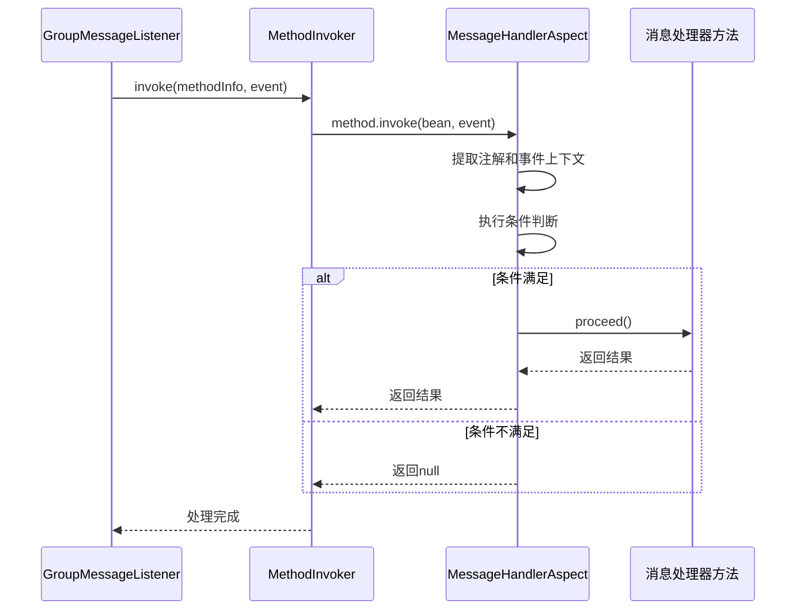
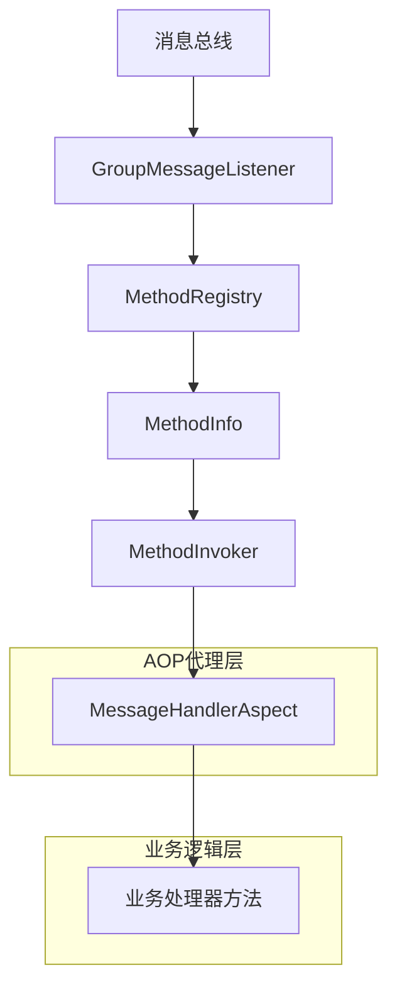
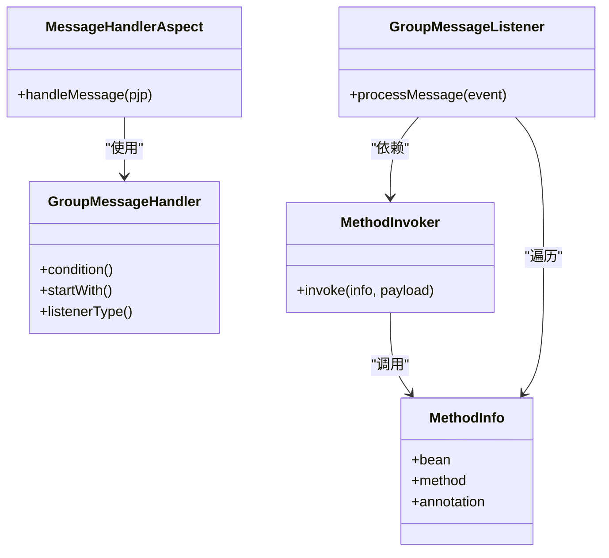

# AOP切面机制

<cite>
**Referenced Files in This Document**   
- [MessageHandlerAspect.java](file://bot/src/main/java/com/shuanglin/framework/aop/MessageHandlerAspect.java)
- [GroupMessageHandler.java](file://bot/src/main/java/com/shuanglin/framework/annotation/GroupMessageHandler.java)
- [MethodInvoker.java](file://bot/src/main/java/com/shuanglin/framework/registry/MethodInvoker.java)
- [MethodRegistry.java](file://bot/src/main/java/com/shuanglin/framework/registry/MethodRegistry.java)
- [GroupMessageListener.java](file://bot/src/main/java/com/shuanglin/framework/listener/GroupMessageListener.java)
- [GroupMessageEvent.java](file://bot/src/main/java/com/shuanglin/framework/bus/event/GroupMessageEvent.java)
- [MethodInfo.java](file://bot/src/main/java/com/shuanglin/framework/registry/MethodInfo.java)
</cite>

## 目录
1. [引言](#引言)
2. [核心组件分析](#核心组件分析)
3. [AOP切面执行流程](#aop切面执行流程)
4. [调用链路与代理协同](#调用链路与代理协同)
5. [横切关注点分离](#横切关注点分离)
6. [扩展能力分析](#扩展能力分析)
7. [结论](#结论)

## 引言
本文档深入剖析了基于Spring AOP实现的消息处理横切逻辑。通过分析`MessageHandlerAspect`切面，详细阐述了如何利用AOP技术拦截消息处理方法，实现日志记录、条件判断与流程控制等通用功能。该设计将核心业务逻辑与横切关注点有效分离，提升了代码的可维护性与可扩展性。

## 核心组件分析

### MessageHandlerAspect切面
`MessageHandlerAspect`是实现横切逻辑的核心切面，它利用`@Around`注解定义了环绕通知，专门用于拦截所有被`@GroupMessageHandler`注解标记的方法。

**Section sources**
- [MessageHandlerAspect.java](file://bot/src/main/java/com/shuanglin/framework/aop/MessageHandlerAspect.java#L17-L47)

### GroupMessageHandler注解
`@GroupMessageHandler`是一个自定义注解，用于标记处理群组消息的业务方法。它包含`condition`、`startWith`和`listenerType`三个属性，分别用于定义执行条件、命令前缀和监听器行为。

**Section sources**
- [GroupMessageHandler.java](file://bot/src/main/java/com/shuanglin/framework/annotation/GroupMessageHandler.java#L13-L31)

### MethodInvoker调用器
`MethodInvoker`是负责实际调用处理器方法的组件。它通过Java反射机制，调用`MethodInfo`中存储的`method`和`bean`，从而触发目标方法的执行，并确保AOP切面能够被正确拦截。

**Section sources**
- [MethodInvoker.java](file://bot/src/main/java/com/shuanglin/framework/registry/MethodInvoker.java#L5-L19)

## AOP切面执行流程

**Diagram sources**
- [MessageHandlerAspect.java](file://bot/src/main/java/com/shuanglin/framework/aop/MessageHandlerAspect.java#L27-L46)
- [MethodInvoker.java](file://bot/src/main/java/com/shuanglin/framework/registry/MethodInvoker.java#L9-L18)
- [GroupMessageListener.java](file://bot/src/main/java/com/shuanglin/framework/listener/GroupMessageListener.java#L40-L45)

### @Around注解与拦截机制
`@Around`注解是AOP中最强大的通知类型，它允许在目标方法执行前后插入自定义逻辑。`MessageHandlerAspect`通过`@Around("@annotation(com.shuanglin.framework.annotation.GroupMessageHandler)")`定义了一个切点，该切点会匹配所有带有`@GroupMessageHandler`注解的方法。当这些方法被调用时，控制权会首先转移到`handleMessage`方法。

### ProceedingJoinPoint与执行链
`ProceedingJoinPoint`是环绕通知的核心参数，它代表了被拦截的连接点。`proceed()`方法是执行链的关键，调用它意味着继续执行目标方法。在`MessageHandlerAspect`中，只有当消息满足`startWith`命令前缀时，`proceed()`才会被调用，否则直接返回`null`，从而阻止了业务方法的执行。

### 事件上下文提取与统一处理
切面在执行时，会从`ProceedingJoinPoint`中提取方法签名、注解实例和方法参数。通过`pjp.getArgs()[0]`获取到`GroupMessageEvent`事件对象，并利用注解中的`startWith`值来解析和修改消息内容，实现了对消息上下文的统一预处理。

**Section sources**
- [MessageHandlerAspect.java](file://bot/src/main/java/com/shuanglin/framework/aop/MessageHandlerAspect.java#L30-L38)

## 调用链路与代理协同

**Diagram sources**
- [GroupMessageListener.java](file://bot/src/main/java/com/shuanglin/framework/listener/GroupMessageListener.java#L35-L48)
- [MethodRegistry.java](file://bot/src/main/java/com/shuanglin/framework/registry/MethodRegistry.java#L36-L56)
- [MethodInvoker.java](file://bot/src/main/java/com/shuanglin/framework/registry/MethodInvoker.java#L9-L18)

### 实际调用链路
消息处理的完整调用链路始于`GroupMessageListener`。该监听器订阅消息总线，当收到群组消息时，会调用`processMessage`方法。此方法会遍历`MethodRegistry`中注册的所有`MethodInfo`，并使用`MethodInvoker`来调用每个处理器。

### AOP代理与MethodInvoker的协同
`MethodInvoker`通过`info.method().invoke(info.bean(), payload)`进行反射调用。这里的`info.bean()`是Spring容器管理的Bean实例，它实际上是一个由Spring AOP创建的代理对象。当`invoke`方法被调用时，控制权会首先交给代理对象，然后由代理对象触发`MessageHandlerAspect`的环绕通知，完成横切逻辑后，再将控制权交给真正的业务方法。

**Section sources**
- [GroupMessageListener.java](file://bot/src/main/java/com/shuanglin/framework/listener/GroupMessageListener.java#L43-L45)
- [MethodInvoker.java](file://bot/src/main/java/com/shuanglin/framework/registry/MethodInvoker.java#L9-L18)

## 横切关注点分离

**Diagram sources**
- [MessageHandlerAspect.java](file://bot/src/main/java/com/shuanglin/framework/aop/MessageHandlerAspect.java#L17-L47)
- [MethodInfo.java](file://bot/src/main/java/com/shuanglin/framework/registry/MethodInfo.java#L6-L14)
- [MethodInvoker.java](file://bot/src/main/java/com/shuanglin/framework/registry/MethodInvoker.java#L5-L19)
- [GroupMessageListener.java](file://bot/src/main/java/com/shuanglin/framework/listener/GroupMessageListener.java#L22-L24)

该设计的核心优势在于将横切关注点（如条件判断、日志记录、消息预处理）与核心业务逻辑（如`AiExecutor`中的`chat`、`publishModel`等方法）完全分离。业务开发者只需关注`@GroupMessageHandler`注解的使用和业务方法的实现，而无需关心消息的路由、过滤和预处理等通用逻辑。这极大地提升了代码的可读性和可维护性。

**Section sources**
- [AiExecutor.java](file://bot/src/main/java/com/shuanglin/executor/AiExecutor.java#L36-L56)
- [PigGroupMessageExecutor.java](file://bot/src/main/java/com/shuanglin/executor/PigGroupMessageExecutor.java#L29-L45)

## 扩展能力分析
当前的`MessageHandlerAspect`设计具有良好的扩展性。通过向`GroupMessageHandler`注解添加新的属性，可以在切面中实现更复杂的横切逻辑。例如，可以轻松扩展以支持：
- **事务管理**：添加`@Transactional`注解或在切面中集成事务管理器，为特定的消息处理器方法提供声明式事务。
- **安全控制**：在`condition`表达式中加入权限校验逻辑，或在切面中调用权限服务，实现基于角色或权限的访问控制。
- **性能监控**：在`proceed()`调用前后添加时间戳，计算方法执行耗时，并将性能数据上报到监控系统。

## 结论
`MessageHandlerAspect`切面通过Spring AOP技术，成功地将消息处理的横切逻辑从业务代码中剥离。它利用`@Around`通知、`ProceedingJoinPoint`和自定义注解，实现了对消息处理器的统一拦截、条件判断和流程控制。`MethodInvoker`与AOP代理的协同工作，确保了切面逻辑的正确执行。这种设计模式不仅简化了业务开发，还为未来的功能扩展（如事务、安全、监控）提供了坚实的基础，是构建可维护、可扩展消息处理系统的关键。