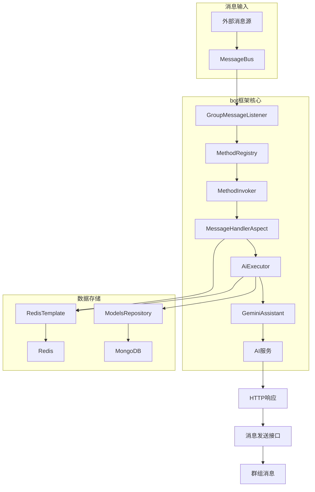
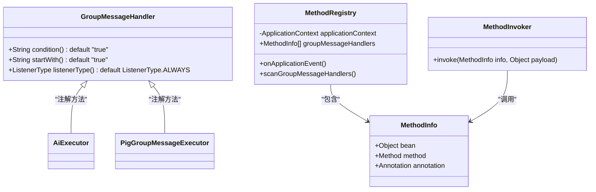
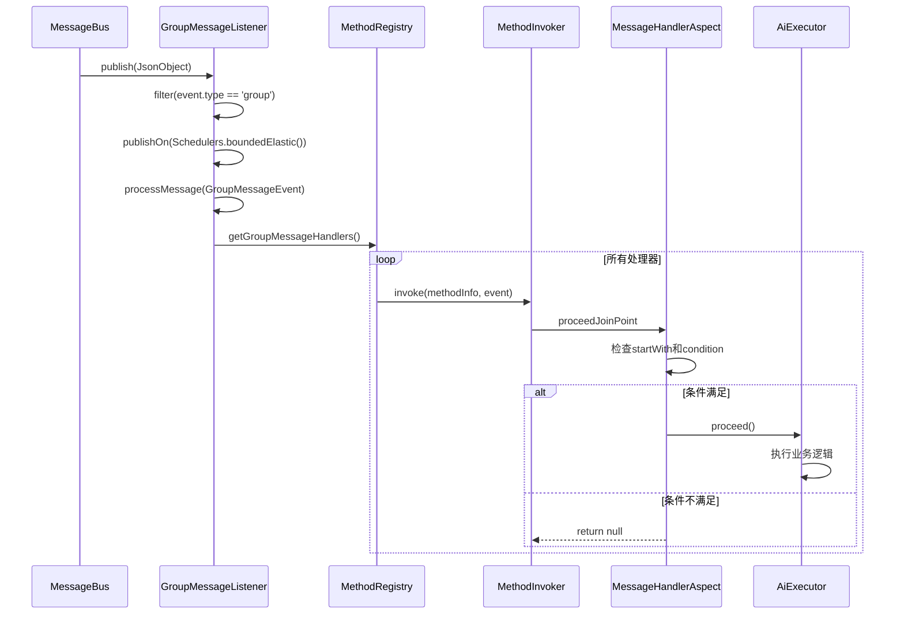
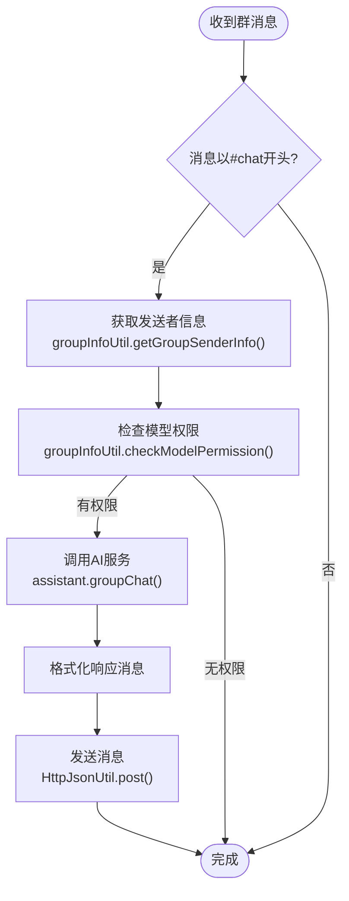
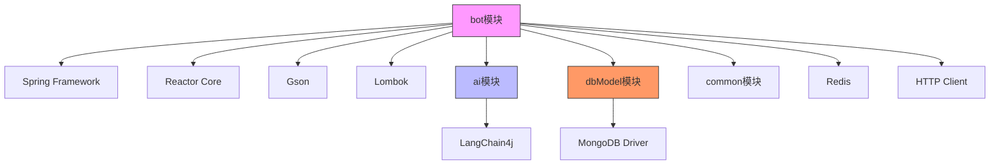

# bot模块详解

<cite>
**本文档引用文件**  
- [GroupMessageHandler.java](file://bot/src/main/java/com/shuanglin/framework/annotation/GroupMessageHandler.java)
- [MessageBus.java](file://bot/src/main/java/com/shuanglin/framework/bus/MessageBus.java)
- [GroupMessageListener.java](file://bot/src/main/java/com/shuanglin/framework/listener/GroupMessageListener.java)
- [MethodRegistry.java](file://bot/src/main/java/com/shuanglin/framework/registry/MethodRegistry.java)
- [MessageHandlerAspect.java](file://bot/src/main/java/com/shuanglin/framework/aop/MessageHandlerAspect.java)
- [AiExecutor.java](file://bot/src/main/java/com/shuanglin/executor/AiExecutor.java)
- [PigGroupMessageExecutor.java](file://bot/src/main/java/com/shuanglin/executor/PigGroupMessageExecutor.java)
- [GroupInfoUtil.java](file://bot/src/main/java/com/shuanglin/utils/GroupInfoUtil.java)
- [GeminiAssistant.java](file://ai/src/main/java/com/shuanglin/bot/langchain4j/assistant/GeminiAssistant.java)
- [ModelsRepository.java](file://dbModel/src/main/java/com/shuanglin/dao/model/ModelsRepository.java)
- [GroupMessageEvent.java](file://bot/src/main/java/com/shuanglin/framework/bus/event/GroupMessageEvent.java)
- [MethodInfo.java](file://bot/src/main/java/com/shuanglin/framework/registry/MethodInfo.java)
- [MethodInvoker.java](file://bot/src/main/java/com/shuanglin/framework/registry/MethodInvoker.java)
</cite>

## 目录
1. [引言](#引言)
2. [核心组件](#核心组件)
3. [架构概览](#架构概览)
4. [详细组件分析](#详细组件分析)
5. [依赖分析](#依赖分析)
6. [性能考量](#性能考量)
7. [故障排除指南](#故障排除指南)
8. [结论](#结论)

## 引言
本项目中的bot模块实现了基于事件驱动的消息处理框架，通过注解驱动的方式实现了灵活的命令注册与执行机制。该框架结合了Spring AOP、响应式编程（Reactor）和事件总线模式，构建了一个高内聚、低耦合的消息处理系统。系统支持通过`@GroupMessageHandler`注解定义群组消息处理器，并通过AOP切面实现消息预处理与条件判断。消息通过`MessageBus`进行发布与订阅，由`GroupMessageListener`监听并触发相应处理器。整个流程集成了AI问答功能，实现了从消息接收到AI响应的完整闭环。

## 核心组件
bot模块的核心组件包括基于`@GroupMessageHandler`注解的命令注册机制、`MessageBus`事件总线、`GroupMessageListener`监听器、`MethodRegistry`方法注册器、`MessageHandlerAspect`切面处理器以及`AiExecutor`AI执行器。这些组件协同工作，实现了消息的接收、过滤、预处理、路由和响应。系统通过反射机制动态注册处理器方法，并利用AOP实现拦截逻辑，确保只有满足条件的消息才会被处理。AI执行器则负责调用外部AI服务进行智能问答，并将结果通过HTTP接口发送回群组。

**组件来源**
- [GroupMessageHandler.java](file://bot/src/main/java/com/shuanglin/framework/annotation/GroupMessageHandler.java#L13-L31)
- [MessageBus.java](file://bot/src/main/java/com/shuanglin/framework/bus/MessageBus.java#L12-L36)
- [GroupMessageListener.java](file://bot/src/main/java/com/shuanglin/framework/listener/GroupMessageListener.java#L13-L49)
- [MethodRegistry.java](file://bot/src/main/java/com/shuanglin/framework/registry/MethodRegistry.java#L17-L57)
- [MessageHandlerAspect.java](file://bot/src/main/java/com/shuanglin/framework/aop/MessageHandlerAspect.java#L17-L47)
- [AiExecutor.java](file://bot/src/main/java/com/shuanglin/executor/AiExecutor.java#L23-L94)

## 架构概览
bot模块采用事件驱动架构，通过`MessageBus`作为消息中枢，实现消息的发布与订阅。`GroupMessageListener`订阅总线上的群组消息，经过过滤和异步处理后，触发所有注册的处理器方法。处理器方法通过`@GroupMessageHandler`注解声明，由`MethodRegistry`在应用启动时扫描并注册。`MessageHandlerAspect`切面拦截这些方法的调用，实现消息的预处理和条件判断。最终，`AiExecutor`等执行器调用AI服务生成响应，并通过HTTP接口发送消息。

**图示来源**
- [MessageBus.java](file://bot/src/main/java/com/shuanglin/framework/bus/MessageBus.java#L12-L36)
- [GroupMessageListener.java](file://bot/src/main/java/com/shuanglin/framework/listener/GroupMessageListener.java#L13-L49)
- [MethodRegistry.java](file://bot/src/main/java/com/shuanglin/framework/registry/MethodRegistry.java#L17-L57)
- [MessageHandlerAspect.java](file://bot/src/main/java/com/shuanglin/framework/aop/MessageHandlerAspect.java#L17-L47)
- [AiExecutor.java](file://bot/src/main/java/com/shuanglin/executor/AiExecutor.java#L23-L94)
- [ModelsRepository.java](file://dbModel/src/main/java/com/shuanglin/dao/model/ModelsRepository.java#L7-L15)
- [GroupInfoUtil.java](file://bot/src/main/java/com/shuanglin/utils/GroupInfoUtil.java#L20-L115)

## 详细组件分析

### 命令注册与处理机制
系统通过`@GroupMessageHandler`注解实现命令处理器的声明式注册。该注解包含`startWith`属性用于匹配消息前缀，`condition`属性用于SpEL表达式条件判断。`MethodRegistry`在Spring容器初始化完成后扫描所有带有`@Component`注解的Bean，查找其中被`@GroupMessageHandler`注解的方法，并将其元数据封装为`MethodInfo`对象存储在列表中。当消息到达时，`GroupMessageListener`通过`MethodInvoker`调用这些注册的方法，触发AOP切面的拦截逻辑。

**图示来源**
- [GroupMessageHandler.java](file://bot/src/main/java/com/shuanglin/framework/annotation/GroupMessageHandler.java#L13-L31)
- [MethodInfo.java](file://bot/src/main/java/com/shuanglin/framework/registry/MethodInfo.java#L6-L14)
- [MethodRegistry.java](file://bot/src/main/java/com/shuanglin/framework/registry/MethodRegistry.java#L17-L57)
- [MethodInvoker.java](file://bot/src/main/java/com/shuanglin/framework/registry/MethodInvoker.java#L5-L19)

### 消息事件处理流程
消息处理流程始于`MessageBus`，它使用Reactor Sinks作为响应式流的源，允许多个订阅者接收消息。`GroupMessageListener`在`@PostConstruct`方法中订阅总线，通过`filter`操作符筛选出群组消息类型，并使用`publishOn(Schedulers.boundedElastic())`在独立线程池中异步处理，避免阻塞主线程。接收到`GroupMessageEvent`后，`processMessage`方法遍历所有注册的处理器，通过`MethodInvoker`触发调用。`MessageHandlerAspect`切面拦截这些调用，根据`startWith`前缀和`condition`表达式决定是否继续执行，并对消息内容进行预处理。

**图示来源**
- [MessageBus.java](file://bot/src/main/java/com/shuanglin/framework/bus/MessageBus.java#L12-L36)
- [GroupMessageListener.java](file://bot/src/main/java/com/shuanglin/framework/listener/GroupMessageListener.java#L13-L49)
- [MethodRegistry.java](file://bot/src/main/java/com/shuanglin/framework/registry/MethodRegistry.java#L17-L57)
- [MethodInvoker.java](file://bot/src/main/java/com/shuanglin/framework/registry/MethodInvoker.java#L5-L19)
- [MessageHandlerAspect.java](file://bot/src/main/java/com/shuanglin/framework/aop/MessageHandlerAspect.java#L17-L47)
- [AiExecutor.java](file://bot/src/main/java/com/shuanglin/executor/AiExecutor.java#L23-L94)

### AI问答集成实现
`AiExecutor`类实现了与AI模块的集成，包含多个被`@GroupMessageHandler`注解的方法，如`chat`、`publishModel`和`switchModel`。`chat`方法处理以`#chat`开头的消息，首先通过`GroupInfoUtil`获取发送者信息和模型权限，然后调用`GeminiAssistant`的`groupChat`方法生成AI响应。`GroupInfoUtil`使用RedisTemplate缓存群组和发送者信息，并通过`ModelsRepository`与MongoDB交互，管理模型的增删改查。AI响应生成后，通过`HttpJsonUtil`发送HTTP POST请求到指定接口，将消息发送回群组。

**图示来源**
- [AiExecutor.java](file://bot/src/main/java/com/shuanglin/executor/AiExecutor.java#L23-L94)
- [GroupInfoUtil.java](file://bot/src/main/java/com/shuanglin/utils/GroupInfoUtil.java#L20-L115)
- [GeminiAssistant.java](file://ai/src/main/java/com/shuanglin/bot/langchain4j/assistant/GeminiAssistant.java#L10-L77)
- [ModelsRepository.java](file://dbModel/src/main/java/com/shuanglin/dao/model/ModelsRepository.java#L7-L15)

## 依赖分析
bot模块依赖于多个外部组件和内部模块。核心依赖包括Spring Framework（用于IoC、AOP和事件驱动）、Reactor（用于响应式编程）、Gson（用于JSON序列化）和Lombok（用于代码简化）。内部依赖方面，bot模块依赖于`ai`模块的`GeminiAssistant`接口进行AI问答，依赖于`dbModel`模块的`ModelsRepository`进行模型数据持久化。同时，通过`common`模块共享枚举和工具类。Redis和MongoDB作为外部数据存储，分别用于缓存运行时状态和持久化模型配置。

**图示来源**
- [AiExecutor.java](file://bot/src/main/java/com/shuanglin/executor/AiExecutor.java#L23-L94)
- [GroupInfoUtil.java](file://bot/src/main/java/com/shuanglin/utils/GroupInfoUtil.java#L20-L115)
- [ModelsRepository.java](file://dbModel/src/main/java/com/shuanglin/dao/model/ModelsRepository.java#L7-L15)
- [pom.xml](file://bot/pom.xml#L1-L10)

## 性能考量
系统在设计时充分考虑了性能因素。`MessageBus`使用Reactor Sinks的`multicast().onBackpressureBuffer()`策略，有效处理背压问题，避免消息丢失。`GroupMessageListener`通过`publishOn(Schedulers.boundedElastic())`将消息处理转移到独立的弹性线程池，防止阻塞事件总线，确保高并发下的响应性。`GroupInfoUtil`使用Redis缓存群组和用户信息，大幅减少对MongoDB的频繁访问，提高数据读取效率。AI调用虽为同步阻塞操作，但由于被隔离在独立线程中，不会影响消息接收的主线程。整体架构通过异步化和缓存机制，在保证功能完整性的同时，实现了良好的性能表现。

## 故障排除指南
常见问题包括消息无法触发、AI响应延迟和权限验证失败。消息无法触发时，应检查`@GroupMessageHandler`注解的`startWith`值是否与消息前缀匹配，确认`MethodRegistry`是否成功扫描到处理器方法。AI响应延迟可能源于外部AI服务性能或网络问题，可通过日志中的`assistant.groupChat()`调用时间进行诊断。权限验证失败通常与`GroupInfoUtil`中的Redis缓存状态有关，可尝试清除`group_sender_staff_`和`group_info_staff_`前缀的缓存键。此外，应监控`MessageBus`的错误流，确保没有未处理的异常导致监听器中断。

**组件来源**
- [MessageHandlerAspect.java](file://bot/src/main/java/com/shuanglin/framework/aop/MessageHandlerAspect.java#L17-L47)
- [GroupInfoUtil.java](file://bot/src/main/java/com/shuanglin/utils/GroupInfoUtil.java#L20-L115)
- [GroupMessageListener.java](file://bot/src/main/java/com/shuanglin/framework/listener/GroupMessageListener.java#L13-L49)

## 结论
bot模块通过精心设计的事件驱动架构，实现了灵活、可扩展的消息处理框架。基于注解的命令注册机制简化了开发流程，AOP切面提供了强大的拦截和预处理能力，事件总线模式确保了组件间的松耦合。与AI模块的深度集成，使得系统能够提供智能化的群组交互服务。通过合理的异步处理和缓存策略，系统在高并发场景下仍能保持稳定性能。整体设计体现了现代Java应用开发的最佳实践，具有良好的可维护性和可扩展性。