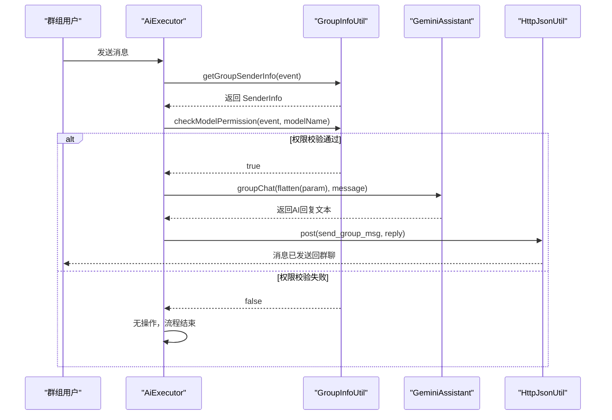

# 执行器逻辑

<cite>
**本文档引用的文件**
- [AiExecutor.java](file://bot/src/main/java/com/shuanglin/executor/AiExecutor.java)
- [GroupInfoUtil.java](file://bot/src/main/java/com/shuanglin/utils/GroupInfoUtil.java)
- [GeminiAssistant.java](file://ai/src/main/java/com/shuanglin/bot/langchain4j/assistant/GeminiAssistant.java)
- [JsonUtils.java](file://common/src/main/java/com/shuanglin/utils/JsonUtils.java)
- [ModelsRepository.java](file://dbModel/src/main/java/com/shuanglin/dao/model/ModelsRepository.java)
- [application.yaml](file://bot/src/main/resources/application.yaml)
</cite>

## 目录
1. [简介](#简介)
2. [核心功能分析](#核心功能分析)
3. [chat() 方法执行流程](#chat-方法执行流程)
4. [publishModel() 模型发布机制](#publishmodel-模型发布机制)
5. [switchModel() 模型切换逻辑](#switchmodel-模型切换逻辑)
6. [配置驱动的命令前缀设计](#配置驱动的命令前缀设计)
7. [群组消息处理时序图](#群组消息处理时序图)
8. [安全与可靠性设计](#安全与可靠性设计)
9. [结论](#结论)

## 简介
本文档深入解析 `AiExecutor` 类中基于 `@GroupMessageHandler` 注解实现的三大核心功能：群聊响应（#chat）、模型发布（#发布模型）和模型切换（#选择模型）。结合代码实现与配置文件，详细阐述其工作原理、数据流及关键设计决策。

## 核心功能分析

`AiExecutor` 是群组消息处理的核心执行器，通过 `@GroupMessageHandler` 注解识别并路由不同前缀的指令。该类实现了三个主要功能：

- **#chat**：触发群聊AI响应流程，包含权限校验、AI调用与结果回传。
- **#发布模型**：允许管理员发布新的AI模型定义，持久化至MongoDB数据库。
- **#选择模型**：支持用户在群组内切换当前使用的AI模型。

这些功能共同构成了一个可扩展、可配置的AI模型管理与交互系统。

**Section sources**
- [AiExecutor.java](file://bot/src/main/java/com/shuanglin/executor/AiExecutor.java#L1-L95)

## chat() 方法执行流程

`chat()` 方法处理以 `#chat` 开头的群组消息，其执行流程如下：

1. **获取发送者信息**：通过 `GroupInfoUtil.getGroupSenderInfo()` 获取当前消息发送者的上下文信息，包括其当前选中的模型。
2. **权限校验**：调用 `groupInfoUtil.checkModelPermission()` 检查当前群组是否启用了该用户所选模型。若未启用，则直接返回，不进行后续处理。
3. **AI响应生成**：
   - 使用 `JsonUtils.flatten()` 将包含发送者信息和消息事件的 `ChatParam` 对象转换为扁平化的JSON结构。
   - 调用 `GeminiAssistant.groupChat()` 方法，传入扁平化后的上下文和原始消息文本，获取AI生成的回复。
4. **结果回传**：
   - 将AI回复封装为包含文本消息的JSON结构。
   - 通过 `HttpJsonUtil.post()` 向本地HTTP服务（`http://127.0.0.1:3000/send_group_msg`）发送POST请求，将回复内容推送回群聊。

此流程确保了只有在权限允许的情况下才会触发AI响应，并通过HTTP回调机制实现消息的闭环。

**Section sources**
- [AiExecutor.java](file://bot/src/main/java/com/shuanglin/executor/AiExecutor.java#L25-L45)
- [GroupInfoUtil.java](file://bot/src/main/java/com/shuanglin/utils/GroupInfoUtil.java#L50-L70)
- [JsonUtils.java](file://common/src/main/java/com/shuanglin/utils/JsonUtils.java#L10-L50)
- [GeminiAssistant.java](file://ai/src/main/java/com/shuanglin/bot/langchain4j/assistant/GeminiAssistant.java#L40-L50)

## publishModel() 模型发布机制

`publishModel()` 方法处理 `#发布模型` 指令，其核心逻辑包括：

1. **参数解析**：将消息内容按空格分割，提取模型名称、约束条件和指令。
2. **模型构建**：创建 `Model` 实体对象，并填充从消息中解析出的参数。
3. **默认约束设置**：方法内部硬编码了一套默认的模型约束规则，包括遵守中国法律法规、使用中文回复、扮演角色等。
4. **持久化存储**：调用 `GroupInfoUtil.publishModel()` 将新模型保存至MongoDB数据库。该方法会先检查同名模型是否已存在，若存在则不进行保存。
5. **缓存清理**：模型发布成功后，清除相关的Redis缓存（`senderInfoRedisTemplate` 和 `groupInfoRedisTemplate`），确保后续请求能加载最新的模型列表。

该机制实现了模型的动态注册，新发布的模型会自动对所有群组可见（前提是群组管理员启用）。

**Section sources**
- [AiExecutor.java](file://bot/src/main/java/com/shuanglin/executor/AiExecutor.java#L47-L65)
- [GroupInfoUtil.java](file://bot/src/main/java/com/shuanglin/utils/GroupInfoUtil.java#L10-L25)
- [ModelsRepository.java](file://dbModel/src/main/java/com/shuanglin/dao/model/ModelsRepository.java#L1-L15)

## switchModel() 模型切换逻辑

`switchModel()` 方法处理 `#选择模型` 指令，允许用户切换当前使用的AI模型：

1. **参数解析**：从消息中提取目标模型名称。
2. **获取用户信息**：通过 `getGroupSenderInfo()` 获取当前用户的 `SenderInfo` 对象。
3. **模型验证与切换**：
   - 调用 `modelsRepository.getModelByModelName()` 查询目标模型是否存在。
   - 若存在，则更新 `SenderInfo` 中的 `ModelInfo`，将其 `modelName` 设置为新模型名称。
   - 将更新后的 `SenderInfo` 重新存入Redis缓存。
4. **缓存更新**：操作完成后，更新Redis中存储的用户信息映射，确保后续消息使用新模型。

此功能实现了用户级别的模型偏好设置，增强了交互的灵活性。

**Section sources**
- [AiExecutor.java](file://bot/src/main/java/com/shuanglin/executor/AiExecutor.java#L67-L78)
- [GroupInfoUtil.java](file://bot/src/main/java/com/shuanglin/utils/GroupInfoUtil.java#L27-L48)

## 配置驱动的命令前缀设计

`@GroupMessageHandler` 注解的 `startWith` 属性支持配置化的命令前缀。虽然在当前代码中前缀是硬编码的（如 `"#chat"`），但结合 `application.yaml` 文件中的配置，整个系统具备良好的可配置性基础。

例如，`application.yaml` 中定义了Redis、MongoDB的连接信息以及Gemini等AI模型的API密钥。这种将配置与代码分离的设计，使得系统在不同环境（开发、测试、生产）间的迁移和部署变得简单。未来可通过引入配置中心，将命令前缀也外部化，实现无需重启服务即可修改指令。

**Section sources**
- [AiExecutor.java](file://bot/src/main/java/com/shuanglin/executor/AiExecutor.java#L23-L24)
- [application.yaml](file://bot/src/main/resources/application.yaml#L1-L54)

## 群组消息处理时序图

**Diagram sources**
- [AiExecutor.java](file://bot/src/main/java/com/shuanglin/executor/AiExecutor.java#L25-L45)
- [GroupInfoUtil.java](file://bot/src/main/java/com/shuanglin/utils/GroupInfoUtil.java#L50-L70)

## 安全与可靠性设计

系统在设计上考虑了多个关键的安全与可靠性方面：

- **权限控制**：通过 `checkModelPermission()` 实现了群组级别的模型访问控制，防止未授权的模型被调用。
- **指令注入防护**：虽然当前参数解析较为简单（仅按空格分割），但核心逻辑位于服务端，且AI模型本身有内置的约束（如必须遵守中国法律），形成了一定的防护层。
- **HTTP回调可靠性**：使用 `HttpJsonUtil` 发送回复，该工具类应具备重试、超时等机制以保证消息可靠送达。目标地址 `127.0.0.1:3000` 表明服务部署在同一主机，网络可靠性较高。
- **数据持久化与缓存**：模型数据存储在MongoDB中，保证了数据的持久性。同时使用Redis缓存频繁访问的用户和群组信息，提升了系统性能。发布新模型时主动清理缓存，保证了数据一致性。
- **依赖管理**：通过Spring的依赖注入（`@RequiredArgsConstructor`）管理 `GeminiAssistant`、`ModelsRepository` 等组件，降低了耦合度。

**Section sources**
- [AiExecutor.java](file://bot/src/main/java/com/shuanglin/executor/AiExecutor.java#L30-L32)
- [GroupInfoUtil.java](file://bot/src/main/java/com/shuanglin/utils/GroupInfoUtil.java#L50-L70)
- [application.yaml](file://bot/src/main/resources/application.yaml#L10-L30)

## 结论

`AiExecutor` 类通过简洁而有效的设计，实现了基于注解的群组消息处理。其三大核心功能——聊天、发布模型和切换模型——构成了一个完整的AI模型交互与管理系统。系统结合了内存缓存（Redis）、持久化存储（MongoDB）和外部AI服务（Gemini），并通过HTTP回调完成消息闭环。整体架构清晰，具备良好的可维护性和扩展性，为构建复杂的群聊机器人应用提供了坚实的基础。