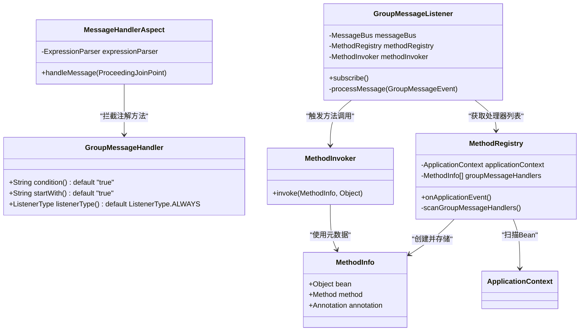
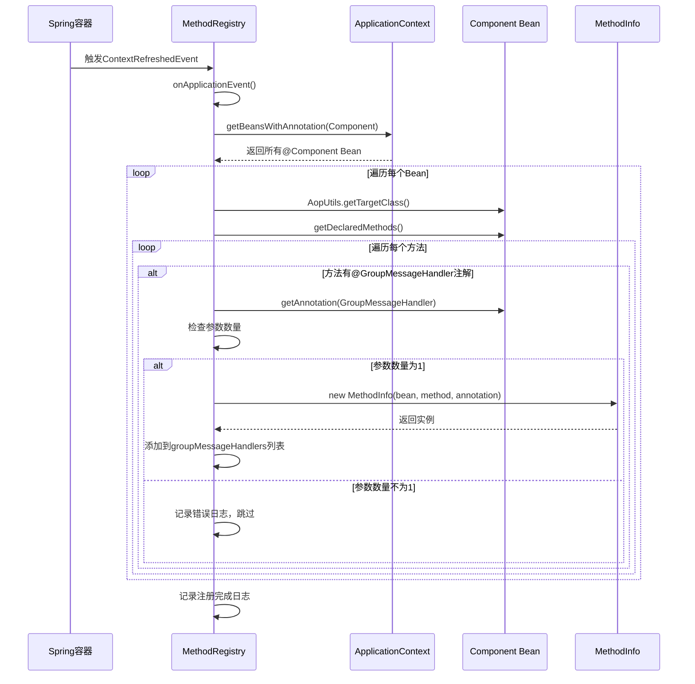
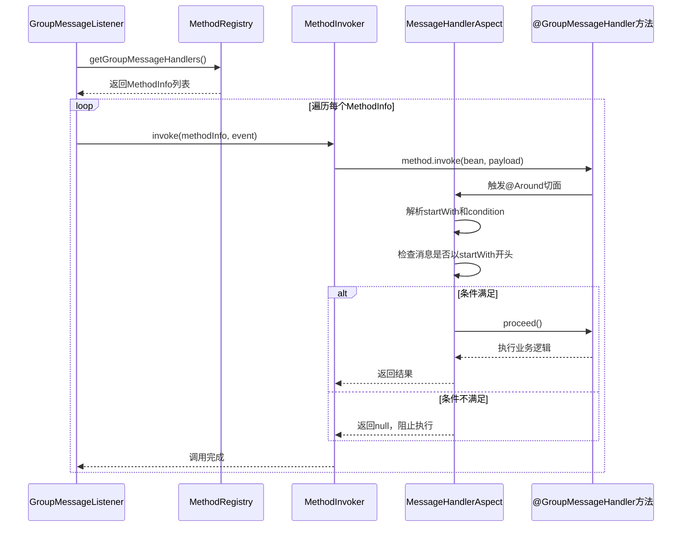

# 注解处理器机制

<cite>
**Referenced Files in This Document**   
- [GroupMessageHandler.java](file://bot/src/main/java/com/shuanglin/framework/annotation/GroupMessageHandler.java)
- [MethodRegistry.java](file://bot/src/main/java/com/shuanglin/framework/registry/MethodRegistry.java)
- [MethodInfo.java](file://bot/src/main/java/com/shuanglin/framework/registry/MethodInfo.java)
- [GroupMessageListener.java](file://bot/src/main/java/com/shuanglin/framework/listener/GroupMessageListener.java)
- [MessageHandlerAspect.java](file://bot/src/main/java/com/shuanglin/framework/aop/MessageHandlerAspect.java)
- [MethodInvoker.java](file://bot/src/main/java/com/shuanglin/framework/registry/MethodInvoker.java)
</cite>

## 目录
1. [简介](#简介)
2. [核心组件](#核心组件)
3. [注册机制流程](#注册机制流程)
4. [方法调用与AOP拦截](#方法调用与aop拦截)
5. [命令匹配与参数处理](#命令匹配与参数处理)
6. [错误处理与健壮性](#错误处理与健壮性)
7. [设计优势分析](#设计优势分析)

## 简介
本文档全面解析基于`@GroupMessageHandler`注解驱动的命令处理器注册与执行机制。该机制利用Spring框架的特性，实现了一种声明式、低侵入性的消息路由系统。通过`MethodRegistry`在应用启动时扫描并注册处理器，结合AOP切面进行运行时拦截与条件判断，最终由`GroupMessageListener`统一触发，形成了一套完整的消息处理闭环。

## 核心组件

该机制由多个核心组件协同工作，各司其职。

**Diagram sources**
- [GroupMessageHandler.java](file://bot/src/main/java/com/shuanglin/framework/annotation/GroupMessageHandler.java#L13-L31)
- [MethodRegistry.java](file://bot/src/main/java/com/shuanglin/framework/registry/MethodRegistry.java#L17-L57)
- [MethodInfo.java](file://bot/src/main/java/com/shuanglin/framework/registry/MethodInfo.java#L6-L14)
- [MethodInvoker.java](file://bot/src/main/java/com/shuanglin/framework/registry/MethodInvoker.java#L5-L19)
- [MessageHandlerAspect.java](file://bot/src/main/java/com/shuanglin/framework/aop/MessageHandlerAspect.java#L17-L47)
- [GroupMessageListener.java](file://bot/src/main/java/com/shuanglin/framework/listener/GroupMessageListener.java#L13-L49)

**Section sources**
- [GroupMessageHandler.java](file://bot/src/main/java/com/shuanglin/framework/annotation/GroupMessageHandler.java)
- [MethodRegistry.java](file://bot/src/main/java/com/shuanglin/framework/registry/MethodRegistry.java)
- [MethodInfo.java](file://bot/src/main/java/com/shuanglin/framework/registry/MethodInfo.java)
- [MethodInvoker.java](file://bot/src/main/java/com/shuanglin/framework/registry/MethodInvoker.java)
- [MessageHandlerAspect.java](file://bot/src/main/java/com/shuanglin/framework/aop/MessageHandlerAspect.java)
- [GroupMessageListener.java](file://bot/src/main/java/com/shuanglin/framework/listener/GroupMessageListener.java)

## 注册机制流程

`MethodRegistry`是整个注册机制的核心，它负责在应用启动时发现并注册所有可用的处理器。

**Diagram sources**
- [MethodRegistry.java](file://bot/src/main/java/com/shuanglin/framework/registry/MethodRegistry.java#L28-L56)

**Section sources**
- [MethodRegistry.java](file://bot/src/main/java/com/shuanglin/framework/registry/MethodRegistry.java#L28-L56)

### 应用上下文事件监听
`MethodRegistry`通过`@EventListener(ContextRefreshedEvent.class)`注解，在Spring容器刷新完成事件发生时被触发。此时，所有`@Component`等注解的Bean都已完成初始化，确保了扫描的完整性。

### 组件扫描与代理处理
`MethodRegistry`首先通过`ApplicationContext`的`getBeansWithAnnotation(Component.class)`方法获取所有被`@Component`注解的Bean实例。由于Spring可能为这些Bean创建了代理（如CGLIB代理），直接检查Bean的`getClass()`会得到代理类，而无法发现原始类中定义的`@GroupMessageHandler`注解。因此，必须使用`AopUtils.getTargetClass(bean)`来获取被代理的原始目标类，从而正确地扫描其所有声明方法。

### 方法遍历与注解检查
对于每个目标类，`MethodRegistry`遍历其所有声明方法（`getDeclaredMethods()`），检查是否存在`@GroupMessageHandler`注解。一旦发现，便获取该注解的实例，用于后续的元数据封装。

## 方法调用与AOP拦截

注册完成后，处理器的调用由`GroupMessageListener`和`MessageHandlerAspect`共同完成。

**Diagram sources**
- [GroupMessageListener.java](file://bot/src/main/java/com/shuanglin/framework/listener/GroupMessageListener.java#L40-L47)
- [MethodInvoker.java](file://bot/src/main/java/com/shuanglin/framework/registry/MethodInvoker.java#L9-L19)
- [MessageHandlerAspect.java](file://bot/src/main/java/com/shuanglin/framework/aop/MessageHandlerAspect.java#L27-L46)

**Section sources**
- [GroupMessageListener.java](file://bot/src/main/java/com/shuanglin/framework/listener/GroupMessageListener.java#L40-L47)
- [MethodInvoker.java](file://bot/src/main/java/com/shuanglin/framework/registry/MethodInvoker.java#L9-L19)
- [MessageHandlerAspect.java](file://bot/src/main/java/com/shuanglin/framework/aop/MessageHandlerAspect.java#L27-L46)

### 事件监听与分发
`GroupMessageListener`在`@PostConstruct`方法中订阅`MessageBus`，过滤出群组消息。当收到消息时，它会遍历`MethodRegistry`中注册的所有`groupMessageHandlers`，并使用`MethodInvoker`逐一调用。

### MethodInvoker的作用
`MethodInvoker`是一个简单的服务类，其`invoke`方法通过Java反射（`Method.invoke()`）来执行`MethodInfo`中封装的方法。这一步是触发AOP切面的关键，因为直接调用反射方法会经过Spring的代理拦截链。

### AOP切面拦截
`MessageHandlerAspect`定义了一个`@Around`切面，其切点为`@annotation(com.shuanglin.framework.annotation.GroupMessageHandler)`。当`MethodInvoker`通过反射调用一个被`@GroupMessageHandler`注解的方法时，该切面会被激活。切面负责解析注解的`startWith`和`condition`属性，并根据消息内容决定是否允许方法继续执行（`proceed()`）。

## 命令匹配与参数处理

`@GroupMessageHandler`注解通过`startWith`属性实现简单的命令匹配。

### startWith属性匹配
`startWith`属性定义了触发处理器的命令前缀。例如，在`AiExecutor`类中，`chat`方法的`startWith = "#chat"`，意味着当用户发送的消息以`#chat`开头时，该处理器才会被考虑。`MessageHandlerAspect`在拦截时，会检查`group.getRawMessage()`是否以`annotation.startWith()`的值开头，以此作为执行条件之一。

### 方法参数校验
为了保证处理器方法的统一性，`MethodRegistry`在注册时强制执行了参数校验规则。它检查被注解方法的参数数量（`method.getParameterCount()`），必须且仅能有一个参数。这个参数通常被设计为`GroupMessageEvent`类型，用于接收消息的完整负载（payload）。如果方法参数不满足此条件，`MethodRegistry`会在日志中记录错误信息并跳过该方法的注册，防止运行时出现不可预知的错误。

## 错误处理与健壮性

该机制在多个层面实现了错误处理，以保证系统的健壮性。

**Section sources**
- [MethodRegistry.java](file://bot/src/main/java/com/shuanglin/framework/registry/MethodRegistry.java#L48-L50)
- [MethodInvoker.java](file://bot/src/main/java/com/shuanglin/framework/registry/MethodInvoker.java#L13-L18)

### 注册时的错误处理
在`scanGroupMessageHandlers`方法中，如果发现处理器方法的参数数量不为1，系统会通过`log.error()`记录一条错误日志，并`continue`跳过该方法，不会将其注册到处理器列表中。这确保了只有符合规范的方法才能被调用。

### 运行时的错误处理
在`MethodInvoker`的`invoke`方法中，整个反射调用过程被包裹在`try-catch`块中。如果在执行处理器方法时抛出任何异常（`Exception e`），系统会捕获该异常，并通过`log.error()`记录详细的错误信息，包括方法名和异常堆栈。这保证了即使某个处理器出现严重错误，也不会导致整个消息监听线程崩溃，其他处理器仍能正常工作。

## 设计优势分析

该注解驱动的处理器注册机制体现了优秀的软件设计原则。

**Section sources**
- [GroupMessageHandler.java](file://bot/src/main/java/com/shuanglin/framework/annotation/GroupMessageHandler.java)
- [MethodRegistry.java](file://bot/src/main/java/com/shuanglin/framework/registry/MethodRegistry.java)
- [MessageHandlerAspect.java](file://bot/src/main/java/com/shuanglin/framework/aop/MessageHandlerAspect.java)

### 声明式编程
开发者只需在方法上添加`@GroupMessageHandler`注解并配置`startWith`等属性，即可将其注册为消息处理器，无需手动编写注册代码或修改核心监听逻辑。这极大地简化了开发流程，符合“约定优于配置”的理念。

### 低侵入性
该机制通过AOP和事件监听实现，核心业务逻辑（处理器方法）完全不知道框架的存在。业务代码只依赖于一个简单的注解，与框架的耦合度极低，易于测试和维护。

### 可扩展性
该设计模式易于扩展。例如，可以轻松地添加`@PrivateMessageHandler`、`@SystemMessageHandler`等新的注解和对应的切面，以支持不同类型的消息处理，而无需修改现有的`GroupMessageListener`或`MethodRegistry`的核心逻辑。