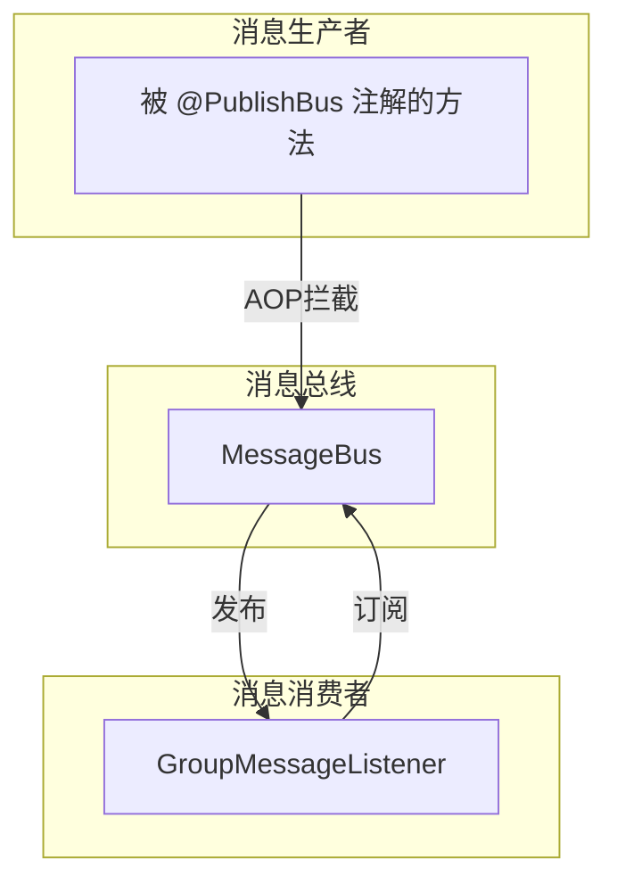
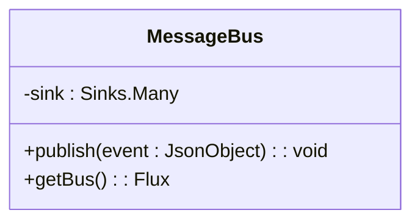
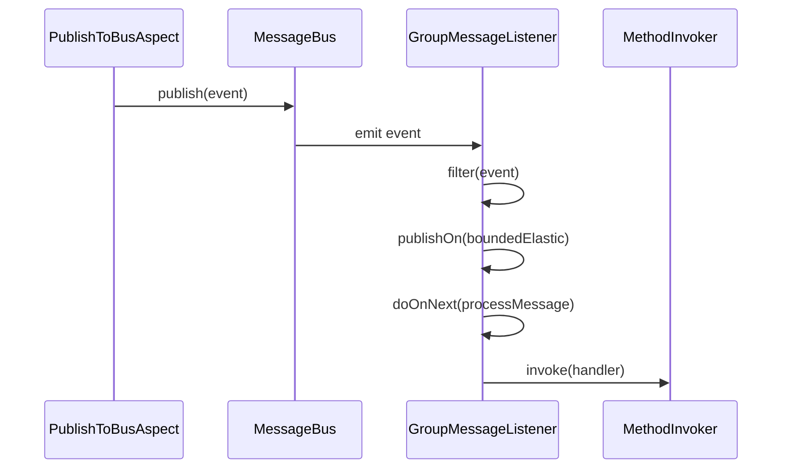
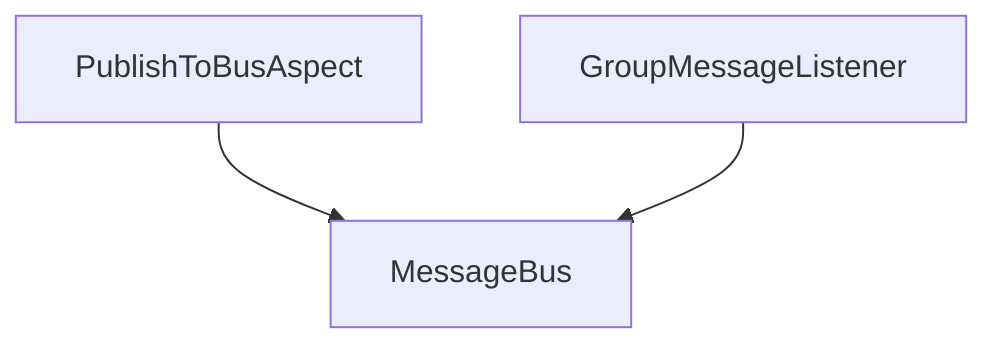

# 消息事件总线

<cite>
**Referenced Files in This Document**   
- [MessageBus.java](file://bot/src/main/java/com/shuanglin/framework/bus/MessageBus.java)
- [GroupMessageListener.java](file://bot/src/main/java/com/shuanglin/framework/listener/GroupMessageListener.java)
- [PublishToBusAspect.java](file://bot/src/main/java/com/shuanglin/framework/aop/PublishToBusAspect.java)
</cite>

## 目录
1. [引言](#引言)
2. [核心组件](#核心组件)
3. [架构概览](#架构概览)
4. [详细组件分析](#详细组件分析)
5. [依赖分析](#依赖分析)
6. [性能考量](#性能考量)
7. [故障排除指南](#故障排除指南)
8. [结论](#结论)

## 引言
本文档深入解析了基于Reactor Sinks实现的响应式消息总线（MessageBus）的设计与实现。该总线作为系统内各组件间通信的核心枢纽，通过发布/订阅模式实现了消息生产者与消费者的完全解耦。文档将详细阐述其核心机制，包括消息发布、订阅过滤、异步处理以及在高并发场景下的性能优势。

## 核心组件
本系统的核心组件包括`MessageBus`、`GroupMessageListener`和`PublishToBusAspect`。`MessageBus`是消息总线的中心，负责消息的发布与广播。`GroupMessageListener`是消息的订阅者，负责接收并处理特定类型的消息。`PublishToBusAspect`是一个切面，它通过AOP技术自动将特定方法的返回值发布到消息总线，从而简化了消息发布逻辑。

**Section sources**
- [MessageBus.java](file://bot/src/main/java/com/shuanglin/framework/bus/MessageBus.java#L12-L36)
- [GroupMessageListener.java](file://bot/src/main/java/com/shuanglin/framework/listener/GroupMessageListener.java#L13-L49)
- [PublishToBusAspect.java](file://bot/src/main/java/com/shuanglin/framework/aop/PublishToBusAspect.java#L16-L46)

## 架构概览
系统采用响应式编程模型，以`MessageBus`为核心构建了一个事件驱动的架构。消息生产者（如被`@PublishBus`注解的方法）通过AOP切面将消息发布到总线。消息消费者（如`GroupMessageListener`）则订阅总线流，通过过滤和异步处理来响应消息。

**Diagram sources**
- [MessageBus.java](file://bot/src/main/java/com/shuanglin/framework/bus/MessageBus.java#L12-L36)
- [PublishToBusAspect.java](file://bot/src/main/java/com/shuanglin/framework/aop/PublishToBusAspect.java#L16-L46)
- [GroupMessageListener.java](file://bot/src/main/java/com/shuanglin/framework/listener/GroupMessageListener.java#L13-L49)

## 详细组件分析

### MessageBus 分析
`MessageBus`类是整个消息系统的基石，它利用Reactor Sinks实现了高效的响应式消息传递。

#### 消息发布与订阅机制
`MessageBus`的核心是一个`Sinks.Many<JsonObject>`类型的`sink`。该`sink`通过`Sinks.many().multicast().onBackpressureBuffer()`创建，支持多播和背压缓冲。
- **发布机制**：`publish(JsonObject event)`方法通过调用`sink.tryEmitNext(event)`将消息推送到流中。`tryEmitNext`是非阻塞的，它会尝试立即发布消息，如果发布失败（例如，没有订阅者），它会优雅地处理失败，而不会抛出异常。
- **订阅机制**：`getBus()`方法返回`sink.asFlux()`，这是一个`Flux<JsonObject>`流。订阅者可以获取此流并应用各种Reactor操作符（如`filter`、`map`、`publishOn`）来构建自己的处理逻辑。

**Diagram sources**
- [MessageBus.java](file://bot/src/main/java/com/shuanglin/framework/bus/MessageBus.java#L12-L36)

#### 背压缓冲策略
`Sinks.many().multicast().onBackpressureBuffer()`是`MessageBus`的关键设计。它创建了一个多播的、支持背压的缓冲区。
- **多播 (multicast)**：允许多个`Flux`订阅者同时监听同一个`sink`，所有订阅者都能收到相同的消息。
- **背压缓冲 (onBackpressureBuffer)**：当消息发布速度超过某个订阅者的消费速度时，该订阅者会向`sink`发出背压信号。`onBackpressureBuffer`策略会将来不及处理的消息暂时存储在内存缓冲区中，防止消息丢失。这在高并发场景下至关重要，它能平滑处理突发流量，避免系统因瞬时压力过大而崩溃。其性能优势在于，它允许生产者以最大速度生产，而消费者可以按照自己的节奏消费，系统整体吞吐量更高。

**Section sources**
- [MessageBus.java](file://bot/src/main/java/com/shuanglin/framework/bus/MessageBus.java#L17-L17)

### GroupMessageListener 分析
`GroupMessageListener`是`MessageBus`的一个典型订阅者，它展示了如何利用响应式流进行消息过滤和异步处理。

#### 消息过滤与异步处理
`GroupMessageListener`在`@PostConstruct`注解的方法`subscribe()`中开始订阅。
- **类型过滤**：通过`.filter(event -> ...)`操作符，它只接收`post_type`为`message`且`message_type`为`group`的消息。这实现了基于消息内容的精确过滤，确保监听器只处理其关心的事件。
- **异步处理**：通过`.publishOn(Schedulers.boundedElastic())`操作符，消息的处理被调度到一个独立的、有界弹性的线程池中。这实现了线程隔离，避免了长时间运行的消息处理逻辑阻塞`MessageBus`的主线程，保证了总线的高效和响应性。

**Diagram sources**
- [PublishToBusAspect.java](file://bot/src/main/java/com/shuanglin/framework/aop/PublishToBusAspect.java#L38-L44)
- [MessageBus.java](file://bot/src/main/java/com/shuanglin/framework/bus/MessageBus.java#L24-L26)
- [GroupMessageListener.java](file://bot/src/main/java/com/shuanglin/framework/listener/GroupMessageListener.java#L23-L39)
- [GroupMessageListener.java](file://bot/src/main/java/com/shuanglin/framework/listener/GroupMessageListener.java#L41-L48)

**Section sources**
- [GroupMessageListener.java](file://bot/src/main/java/com/shuanglin/framework/listener/GroupMessageListener.java#L23-L39)

## 依赖分析
`MessageBus`是系统的核心，被多个组件所依赖。`PublishToBusAspect`和`GroupMessageListener`都通过依赖注入（`@Autowired`或`@RequiredArgsConstructor`）持有`MessageBus`的实例，从而能够发布和订阅消息。

**Diagram sources**
- [PublishToBusAspect.java](file://bot/src/main/java/com/shuanglin/framework/aop/PublishToBusAspect.java#L22-L22)
- [GroupMessageListener.java](file://bot/src/main/java/com/shuanglin/framework/listener/GroupMessageListener.java#L18-L18)

**Section sources**
- [PublishToBusAspect.java](file://bot/src/main/java/com/shuanglin/framework/aop/PublishToBusAspect.java#L16-L46)
- [GroupMessageListener.java](file://bot/src/main/java/com/shuanglin/framework/listener/GroupMessageListener.java#L13-L49)

## 性能考量
`MessageBus`的设计在性能方面表现出色：
- **非阻塞发布**：`tryEmitNext`确保了消息发布是轻量级和非阻塞的，生产者不会被慢速消费者拖慢。
- **背压管理**：`onBackpressureBuffer`策略有效处理了生产者与消费者之间的速度差异，防止了`OutOfMemoryError`，并在高负载下提供了稳定的性能。
- **线程隔离**：`publishOn`操作符确保了消息处理的异步性，保护了总线的响应能力。

## 故障排除指南
- **消息未被处理**：检查`GroupMessageListener`的`filter`条件是否正确匹配了消息的`post_type`和`message_type`。
- **AOP未生效**：确保被`@PublishBus`注解的方法所在的类是Spring管理的Bean（例如，使用`@Component`注解）。
- **错误日志**：`GroupMessageListener`和`PublishToBusAspect`都包含了错误日志记录，检查日志可以帮助定位序列化错误或处理异常。

**Section sources**
- [GroupMessageListener.java](file://bot/src/main/java/com/shuanglin/framework/listener/GroupMessageListener.java#L37-L39)
- [PublishToBusAspect.java](file://bot/src/main/java/com/shuanglin/framework/aop/PublishToBusAspect.java#L40-L44)

## 结论
`MessageBus`通过巧妙地结合Reactor Sinks和响应式编程范式，成功构建了一个高效、解耦、可扩展的消息通信系统。其基于`Sinks.many().multicast().onBackpressureBuffer()`的背压缓冲策略，以及`GroupMessageListener`中`filter`和`publishOn`的组合使用，共同确保了系统在高并发场景下的稳定性和高性能。这种设计模式为构建复杂的事件驱动应用提供了优秀的实践范例。