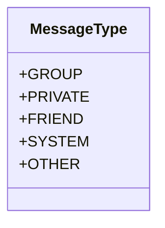
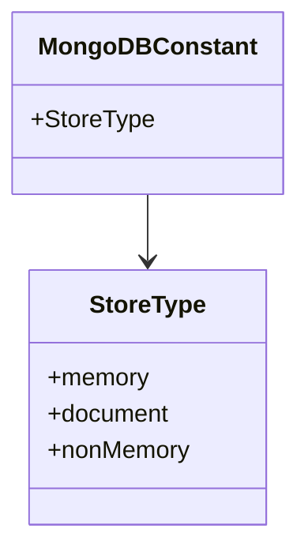
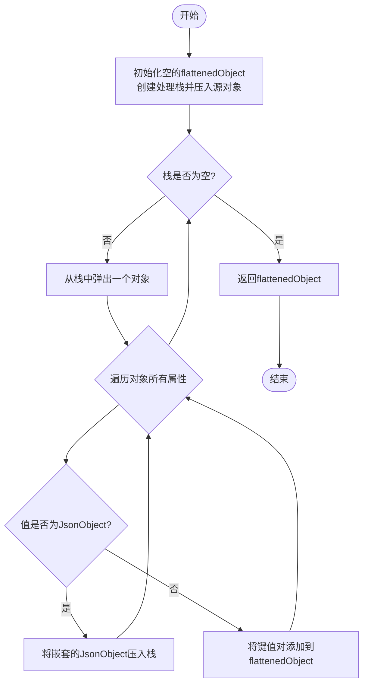

# common模块详解

<cite>
**Referenced Files in This Document**   
- [MessageType.java](file://common/src/main/java/com/shuanglin/enums/MessageType.java)
- [MongoDBConstant.java](file://common/src/main/java/com/shuanglin/enums/MongoDBConstant.java)
- [JsonUtils.java](file://common/src/main/java/com/shuanglin/utils/JsonUtils.java)
- [FilterMemoryStore.java](file://ai/src/main/java/com/shuanglin/bot/langchain4j/store/FilterMemoryStore.java)
- [MultiStepMemoryStore.java](file://ai/src/main/java/com/shuanglin/bot/langchain4j/store/MultiStepMemoryStore.java)
- [AiExecutor.java](file://bot/src/main/java/com/shuanglin/executor/AiExecutor.java)
</cite>

## 目录
1. [引言](#引言)
2. [MessageType枚举](#messagetype枚举)
3. [MongoDBConstant常量类](#mongodbconstant常量类)
4. [JsonUtils工具类](#jsonutils工具类)
5. [跨模块复用分析](#跨模块复用分析)
6. [使用示例](#使用示例)
7. [总结](#总结)

## 引言
`common`模块是项目中的核心公共组件库，为`ai`、`bot`、`dbModel`等多个模块提供统一的基础工具与常量定义。该模块的设计旨在提升代码的一致性、可维护性与复用性。本文档将详细解析`common`模块中提供的三个核心组件：`MessageType`枚举、`MongoDBConstant`常量类和`JsonUtils`工具类，阐述它们的设计目的、实现方式以及在项目中的实际应用。

## MessageType枚举

`MessageType`枚举位于`common`模块中，用于统一标识系统中不同类型的消息，确保在整个项目中对消息类型的定义和处理保持一致。

该枚举定义了五种消息类型：
- `GROUP`：群组消息
- `PRIVATE`：私聊消息
- `FRIEND`：好友相关消息（如好友请求、通知）
- `SYSTEM`：系统消息（如系统通知、广播）
- `OTHER`：其他未知或不匹配的类型

通过将消息类型抽象为一个公共枚举，避免了在`ai`、`bot`等不同模块中重复定义字符串常量，从而减少了因拼写错误或定义不一致导致的潜在Bug。例如，在`bot`模块中，虽然存在一个同名的`MessageType`类，但其内部定义的是`MessageTypeEnum`和`SubMessageTypeEnum`，这表明`common`模块的`MessageType`已被确立为项目级的标准。



**Diagram sources**
- [MessageType.java](file://common/src/main/java/com/shuanglin/enums/MessageType.java#L5-L18)

**Section sources**
- [MessageType.java](file://common/src/main/java/com/shuanglin/enums/MessageType.java#L1-L20)

## MongoDBConstant常量类

`MongoDBConstant`是一个包含内部枚举的常量类，主要用于定义与MongoDB数据存储相关的固定值，特别是`StoreType`枚举。

`StoreType`枚举定义了三种存储类型：
- `memory`：内存存储
- `document`：文档存储
- `nonMemory`：非内存存储

该常量类的作用是为数据库操作提供统一的、类型安全的标识符。通过使用枚举而非字符串字面量，可以有效防止硬编码错误，并在编译时提供类型检查。例如，在`ai`模块的`MultiStepMemoryStore`类中，代码通过`MongoDBConstant.StoreType.memory.name()`来获取`"memory"`字符串，这保证了所有模块在引用此常量时都使用完全相同的值。



**Diagram sources**
- [MongoDBConstant.java](file://common/src/main/java/com/shuanglin/enums/MongoDBConstant.java#L4-L9)

**Section sources**
- [MongoDBConstant.java](file://common/src/main/java/com/shuanglin/enums/MongoDBConstant.java#L1-L10)
- [MultiStepMemoryStore.java](file://ai/src/main/java/com/shuanglin/bot/langchain4j/store/MultiStepMemoryStore.java#L79-L111)

## JsonUtils工具类

`JsonUtils`工具类提供了JSON数据处理的核心功能，目前主要实现了`flatten`方法，用于将嵌套的JSON对象扁平化。

`flatten`方法的核心逻辑是使用栈（`Stack`）数据结构来遍历一个`JsonObject`的所有层级。它会将所有非`JsonObject`类型的“叶子节点”属性（如字符串、数字、数组等）提取出来，并直接添加到一个新的`JsonObject`中，从而生成一个没有嵌套层级的扁平化对象。这种方法在处理复杂、不确定层级的JSON数据时非常有用，可以简化后续的数据访问和处理逻辑。

该工具类依赖于Google的Gson库进行JSON操作，并通过静态方法提供无状态的工具函数，易于在任何需要的地方调用。



**Diagram sources**
- [JsonUtils.java](file://common/src/main/java/com/shuanglin/utils/JsonUtils.java#L8-L52)

**Section sources**
- [JsonUtils.java](file://common/src/main/java/com/shuanglin/utils/JsonUtils.java#L1-L53)

## 跨模块复用分析

`common`模块的设计充分体现了高内聚、低耦合的原则，其提供的组件被`ai`和`bot`等多个模块广泛复用。

- **`MessageType`的复用**：作为消息类型的统一标准，`MessageType`被`ai`和`bot`模块共同依赖。这确保了当一个模块生成消息时，另一个模块能够准确地识别和处理该消息类型，实现了模块间的无缝通信。
- **`MongoDBConstant`的复用**：`ai`模块中的`MultiStepMemoryStore`类直接引用了`MongoDBConstant.StoreType`，这表明数据库存储逻辑的常量定义已从具体实现中剥离，形成了一个共享的知识库。
- **`JsonUtils`的复用**：`JsonUtils.flatten`方法被`ai`模块中的`FilterMemoryStore`和`MultiStepMemoryStore`等数据存储类频繁调用。这些类在将复杂的Java对象（如`ChatParam`）存入数据库前，会先将其转换为JSON并进行扁平化处理，以便于后续的查询和分析。

这种跨模块的复用极大地提升了代码的可维护性。当需要修改或扩展某个功能时（例如，为`MessageType`添加新的消息类型），只需在`common`模块中进行一次修改，所有依赖它的模块都会自动获得更新，避免了在多处进行重复修改的繁琐和风险。

**Section sources**
- [FilterMemoryStore.java](file://ai/src/main/java/com/shuanglin/bot/langchain4j/store/FilterMemoryStore.java#L31-L101)
- [MultiStepMemoryStore.java](file://ai/src/main/java/com/shuanglin/bot/langchain4j/store/MultiStepMemoryStore.java#L57-L111)
- [AiExecutor.java](file://bot/src/main/java/com/shuanglin/executor/AiExecutor.java#L36-L56)

## 使用示例

以下是在实际业务中调用`common`模块组件的典型示例：

1.  **使用`MessageType`**：在处理一个来自`bot`模块的事件时，可以使用`common`模块的`MessageType`进行类型判断。
    ```java
    // 伪代码示例
    if (event.getType() == MessageType.GROUP) {
        // 处理群组消息
    } else if (event.getType() == MessageType.PRIVATE) {
        // 处理私聊消息
    }
    ```

2.  **使用`MongoDBConstant`**：在向数据库插入数据时，指定存储类型。
    ```java
    // 伪代码示例
    String storeType = MongoDBConstant.StoreType.memory.name();
    database.insert(record, storeType);
    ```

3.  **使用`JsonUtils`**：在将一个包含多层嵌套的对象序列化并存入数据库前，先进行扁平化。
    ```java
    // 伪代码示例
    ChatParam param = new ChatParam(...);
    JsonObject jsonTree = gson.toJsonTree(param).getAsJsonObject();
    JsonObject flatJson = JsonUtils.flatten(jsonTree);
    // 将 flatJson 存入数据库
    ```

**Section sources**
- [MessageType.java](file://common/src/main/java/com/shuanglin/enums/MessageType.java#L5-L18)
- [MongoDBConstant.java](file://common/src/main/java/com/shuanglin/enums/MongoDBConstant.java#L5-L8)
- [JsonUtils.java](file://common/src/main/java/com/shuanglin/utils/JsonUtils.java#L16-L51)

## 总结
`common`模块通过提供`MessageType`、`MongoDBConstant`和`JsonUtils`这三个核心组件，成功地为整个项目构建了一个坚实、统一的基础。它不仅消除了代码重复，更重要的是通过标准化的定义和工具，增强了各模块之间的协同工作能力，显著提升了代码的可读性、一致性和可维护性。这种将公共逻辑和常量集中管理的设计模式，是构建大型、可扩展系统的关键实践。