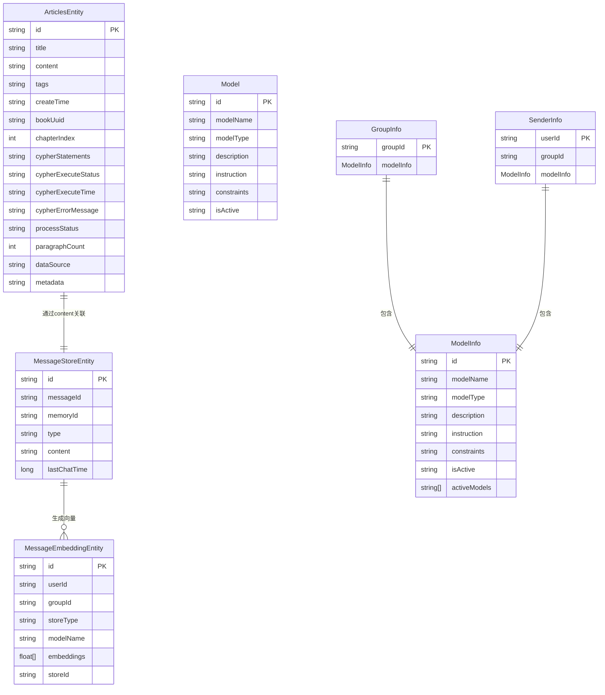

# dbModel模块详解

<cite>
**Referenced Files in This Document**   
- [ArticlesEntity.java](file://dbModel/src/main/java/com/shuanglin/dao/Articles/ArticlesEntity.java)
- [ArticlesEntityRepository.java](file://dbModel/src/main/java/com/shuanglin/dao/Articles/ArticlesEntityRepository.java)
- [MessageStoreEntity.java](file://dbModel/src/main/java/com/shuanglin/dao/message/MessageStoreEntity.java)
- [MessageStoreEntityRepository.java](file://dbModel/src/main/java/com/shuanglin/dao/message/MessageStoreEntityRepository.java)
- [MessageEmbeddingEntity.java](file://dbModel/src/main/java/com/shuanglin/dao/milvus/MessageEmbeddingEntity.java)
- [MessageEmbeddingMapper.java](file://dbModel/src/main/java/com/shuanglin/dao/milvus/MessageEmbeddingMapper.java)
- [Model.java](file://dbModel/src/main/java/com/shuanglin/dao/model/Model.java)
- [ModelInfo.java](file://dbModel/src/main/java/com/shuanglin/dao/model/ModelInfo.java)
- [ModelsRepository.java](file://dbModel/src/main/java/com/shuanglin/dao/model/ModelsRepository.java)
- [GroupInfo.java](file://dbModel/src/main/java/com/shuanglin/dao/GroupInfo.java)
- [SenderInfo.java](file://dbModel/src/main/java/com/shuanglin/dao/SenderInfo.java)
</cite>

## 目录
1. [引言](#引言)
2. [核心实体类设计](#核心实体类设计)
3. [数据访问层（Repository）设计](#数据访问层repository设计)
4. [向量数据映射机制](#向量数据映射机制)
5. [模型元数据管理](#模型元数据管理)
6. [实体关系与数据模型](#实体关系与数据模型)
7. [总结](#总结)

## 引言
dbModel模块是整个系统的核心数据访问层，负责定义和管理所有持久化数据模型。该模块通过Spring Data MongoDB和Milvus集成，为ai和bot模块提供稳定、高效的数据持久化支持。本文档将系统性地阐述该模块的设计，包括核心实体类、数据访问接口、向量映射机制以及模型元数据管理方式。

## 核心实体类设计

### ArticlesEntity（文章内容）
`ArticlesEntity`类用于存储书籍章节内容，是知识图谱构建的核心数据载体。其字段设计不仅包含基础内容信息，还扩展了用于知识图谱处理的元数据。

**字段定义与业务含义：**
- `id`: 文档在MongoDB中的唯一标识。
- `title`: 章节标题。
- `content`: 章节正文内容。
- `tags`: 内容标签，用于分类和检索。
- `createTime`: 内容创建时间。
- `bookUuid`: 书籍唯一标识，用于关联同一本书的所有章节。
- `chapterIndex`: 章节序号，用于排序和查询。
- `cypherStatements`: LLM生成的原始Cypher语句，用于知识图谱构建。
- `cypherExecuteStatus`: Cypher执行状态（SUCCESS/FAILED/PENDING）。
- `cypherExecuteTime`: Cypher执行时间。
- `cypherErrorMessage`: Cypher执行错误信息。
- `processStatus`: 章节处理状态（PENDING/PROCESSING/COMPLETED/FAILED）。
- `paragraphCount`: 段落总数。
- `dataSource`: 数据源标识，用于数据隔离。
- `metadata`: 扩展元数据（JSON字符串）。

**Section sources**
- [ArticlesEntity.java](file://dbModel/src/main/java/com/shuanglin/dao/Articles/ArticlesEntity.java#L8-L55)

### MessageStoreEntity（对话记录）
`MessageStoreEntity`类用于存储用户与AI的对话记录，是对话记忆功能的基础。

**字段定义与业务含义：**
- `id`: 文档在MongoDB中的唯一标识。
- `messageId`: 消息ID。
- `memoryId`: 记忆ID，用于关联上下文。
- `type`: 消息类型。
- `content`: 消息内容。
- `lastChatTime`: 最后聊天时间戳。

**Section sources**
- [MessageStoreEntity.java](file://dbModel/src/main/java/com/shuanglin/dao/message/MessageStoreEntity.java#L9-L27)

### MessageEmbeddingEntity（向量数据）
`MessageEmbeddingEntity`类用于在Milvus向量数据库中存储消息的向量表示，支持高效的语义搜索。

**字段定义与业务含义：**
- `id`: 向量记录的主键，由Milvus自动生成。
- `userId`: 用户ID，用于用户级数据隔离。
- `groupId`: 群组ID，用于群组级数据隔离。
- `storeType`: 存储类型标识。
- `modelName`: 使用的模型名称。
- `embeddings`: 消息内容的向量表示，维度为1536。
- `storeId`: 存储ID，用于关联原始消息。

**向量索引配置：**
使用`@MilvusIndex`注解配置了IVF_FLAT索引和L2距离度量，`nlist`参数设置为100，以平衡查询速度和精度。

**Section sources**
- [MessageEmbeddingEntity.java](file://dbModel/src/main/java/com/shuanglin/dao/milvus/MessageEmbeddingEntity.java#L14-L78)

### GroupInfo（群组信息）
`GroupInfo`类采用单例模式，用于维护群组级别的配置信息，特别是模型使用权限。

**字段定义与业务含义：**
- `groupId`: 群组ID。
- `modelInfo`: 群组关联的模型信息，包含当前激活的模型列表。

该类通过双重检查锁（Double-Checked Locking）实现线程安全的单例模式，确保在高并发环境下正确初始化。

**Section sources**
- [GroupInfo.java](file://dbModel/src/main/java/com/shuanglin/dao/GroupInfo.java#L9-L37)

### SenderInfo（发送者信息）
`SenderInfo`类同样采用单例模式，用于维护发送者（用户）的个性化信息。

**字段定义与业务含义：**
- `userId`: 用户ID。
- `groupId`: 所属群组ID。
- `modelInfo`: 用户关联的模型信息。

与`GroupInfo`类似，它也实现了线程安全的单例模式，为用户提供个性化的模型配置。

**Section sources**
- [SenderInfo.java](file://dbModel/src/main/java/com/shuanglin/dao/SenderInfo.java#L16-L49)

## 数据访问层（Repository）设计

### ArticlesEntityRepository
`ArticlesEntityRepository`接口扩展了`MongoRepository`，提供了丰富的查询方法，支持复杂的业务场景。

**核心查询方法：**
- `findByBookUuid`: 根据书籍UUID查询所有章节。
- `findByBookUuidAndChapterIndex`: 查询指定书籍的特定章节。
- `findByDataSource`: 根据数据源查询所有章节。
- `findByBookUuidOrderByChapterIndexAsc`: 查询书籍章节并按索引升序排序。
- `findByCypherExecuteStatus`: 查询指定Cypher执行状态的章节。
- `deleteByBookUuid`: 删除指定书籍的所有章节。
- `countByBookUuidAndCypherExecuteStatus`: 统计指定书籍中处于特定执行状态的章节数量。

这些方法通过Spring Data MongoDB的方法名解析机制自动生成实现，无需编写具体SQL或查询语句。

**Section sources**
- [ArticlesEntityRepository.java](file://dbModel/src/main/java/com/shuanglin/dao/Articles/ArticlesEntityRepository.java#L9-L77)

### MessageStoreEntityRepository
`MessageStoreEntityRepository`是一个基础的MongoDB仓库接口，目前未定义额外的查询方法，主要依赖`MongoRepository`提供的通用CRUD操作。

**Section sources**
- [MessageStoreEntityRepository.java](file://dbModel/src/main/java/com/shuanglin/dao/message/MessageStoreEntityRepository.java#L6-L9)

### ModelsRepository
`ModelsRepository`接口用于管理模型元数据。

**核心查询方法：**
- `getModelsByIsActive`: 根据激活状态查询模型列表。
- `getModelByModelName`: 根据模型名称查询单个模型。

**Section sources**
- [ModelsRepository.java](file://dbModel/src/main/java/com/shuanglin/dao/model/ModelsRepository.java#L7-L15)

## 向量数据映射机制

### MessageEmbeddingMapper
`MessageEmbeddingMapper`是Milvus的数据映射器，继承自`MilvusMapper<MessageEmbeddingEntity>`。

**机制说明：**
- 该类作为Spring组件（`@Component`）被管理。
- 它负责将`MessageEmbeddingEntity`对象与Milvus数据库中的集合`chatEmbeddingCollection`进行映射。
- 通过继承`MilvusMapper`，它获得了对Milvus集合进行CRUD操作的能力，如插入、查询、删除向量记录。
- 实际的向量操作由底层的Milvus客户端库完成，`MessageEmbeddingMapper`提供了面向对象的Java接口。

**Section sources**
- [MessageEmbeddingMapper.java](file://dbModel/src/main/java/com/shuanglin/dao/milvus/MessageEmbeddingMapper.java#L5-L7)

## 模型元数据管理

### Model与ModelInfo
系统通过`Model`和`ModelInfo`两个类来管理模型元数据。

**Model类：**
- 定义了模型的基本属性：
  - `modelName`: 模型名称。
  - `modelType`: 模型类型。
  - `description`: 模型描述。
  - `instruction`: 任务指令。
  - `constraints`: 限制与要求。
  - `isActive`: 激活状态。

**ModelInfo类：**
- 继承自`Model`类，扩展了`activeModels`字段。
- `activeModels`: 字符串列表，存储当前激活的模型名称。
- 通过继承和`@SuperBuilder`等Lombok注解，实现了代码复用和便捷的构建模式。

**管理方式：**
- `ModelsRepository`提供数据访问接口。
- `GroupInfo`和`SenderInfo`单例类在内存中持有`ModelInfo`实例，作为运行时配置。
- 当需要更新模型配置时，先通过`ModelsRepository`持久化数据，再刷新内存中的单例对象。

**Section sources**
- [Model.java](file://dbModel/src/main/java/com/shuanglin/dao/model/Model.java#L7-L33)
- [ModelInfo.java](file://dbModel/src/main/java/com/shuanglin/dao/model/ModelInfo.java#L7-L17)

## 实体关系与数据模型

**Diagram sources**
- [ArticlesEntity.java](file://dbModel/src/main/java/com/shuanglin/dao/Articles/ArticlesEntity.java)
- [MessageStoreEntity.java](file://dbModel/src/main/java/com/shuanglin/dao/message/MessageStoreEntity.java)
- [MessageEmbeddingEntity.java](file://dbModel/src/main/java/com/shuanglin/dao/milvus/MessageEmbeddingEntity.java)
- [Model.java](file://dbModel/src/main/java/com/shuanglin/dao/model/Model.java)
- [ModelInfo.java](file://dbModel/src/main/java/com/shuanglin/dao/model/ModelInfo.java)
- [GroupInfo.java](file://dbModel/src/main/java/com/shuanglin/dao/GroupInfo.java)
- [SenderInfo.java](file://dbModel/src/main/java/com/shuanglin/dao/SenderInfo.java)

### 数据模型如何支撑ai和bot模块
- **ai模块**：通过`ArticlesEntityRepository`读取书籍章节，利用`ArticlesEntity`中的`cypherStatements`字段驱动知识图谱构建。`MessageEmbeddingMapper`和`MessageStoreEntityRepository`为RAG（检索增强生成）提供向量和原始文本数据。
- **bot模块**：`GroupInfo`和`SenderInfo`单例为机器人提供实时的模型配置和权限信息。`ModelsRepository`用于加载和管理可用的AI模型。对话记录通过`MessageStoreEntity`持久化，其向量通过`MessageEmbeddingEntity`存储于Milvus，支持上下文感知的智能回复。

## 总结
dbModel模块通过清晰的分层设计，有效地管理了系统的核心数据。它利用MongoDB存储结构化和半结构化数据，利用Milvus处理高维向量数据，并通过Repository模式提供了简洁的数据访问接口。单例模式的`GroupInfo`和`SenderInfo`类为系统提供了高效的运行时配置管理。整体设计为ai和bot模块的复杂功能提供了坚实、灵活的数据基础。