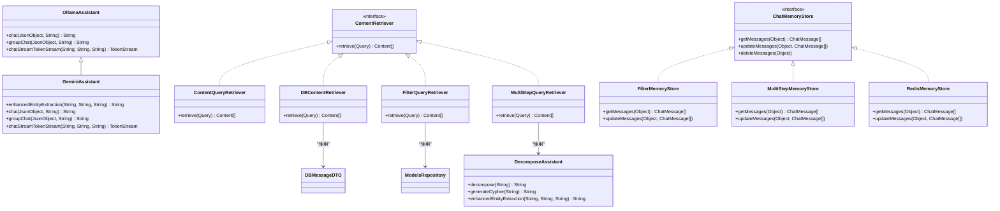
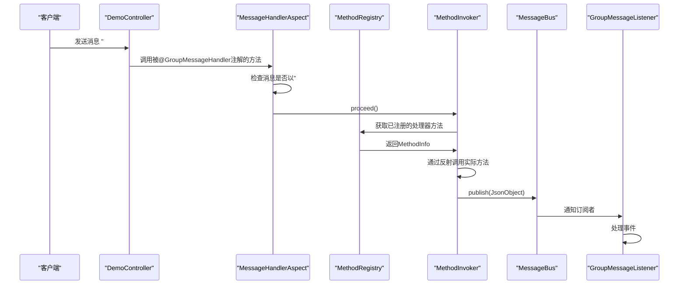
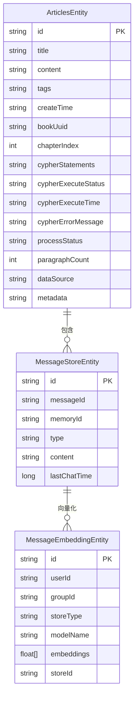

# 模块架构详解

<cite>
**本文档引用的文件**
- [ChatController.java](file://ai/src/main/java/com/shuanglin/bot/langchain4j/controller/ChatController.java)
- [OllamaAssistant.java](file://ai/src/main/java/com/shuanglin/bot/langchain4j/assistant/OllamaAssistant.java)
- [GeminiAssistant.java](file://ai/src/main/java/com/shuanglin/bot/langchain4j/assistant/GeminiAssistant.java)
- [DecomposeAssistant.java](file://ai/src/main/java/com/shuanglin/bot/langchain4j/assistant/DecomposeAssistant.java)
- [ContentQueryRetriever.java](file://ai/src/main/java/com/shuanglin/bot/langchain4j/rag/retriever/ContentQueryRetriever.java)
- [DBContentRetriever.java](file://ai/src/main/java/com/shuanglin/bot/langchain4j/rag/retriever/DBContentRetriever.java)
- [FilterQueryRetriever.java](file://ai/src/main/java/com/shuanglin/bot/langchain4j/rag/retriever/FilterQueryRetriever.java)
- [MultiStepQueryRetriever.java](file://ai/src/main/java/com/shuanglin/bot/langchain4j/rag/retriever/MultiStepQueryRetriever.java)
- [DocumentInitializer.java](file://ai/src/main/java/com/shuanglin/bot/langchain4j/config/DocumentInitializer.java)
- [FilterMemoryStore.java](file://ai/src/main/java/com/shuanglin/bot/langchain4j/store/FilterMemoryStore.java)
- [MultiStepMemoryStore.java](file://ai/src/main/java/com/shuanglin/bot/langchain4j/store/MultiStepMemoryStore.java)
- [RedisMemoryStore.java](file://ai/src/main/java/com/shuanglin/bot/langchain4j/store/RedisMemoryStore.java)
- [GroupMessageHandler.java](file://bot/src/main/java/com/shuanglin/framework/annotation/GroupMessageHandler.java)
- [MessageHandlerAspect.java](file://bot/src/main/java/com/shuanglin/framework/aop/MessageHandlerAspect.java)
- [PublishToBusAspect.java](file://bot/src/main/java/com/shuanglin/framework/aop/PublishToBusAspect.java)
- [MessageBus.java](file://bot/src/main/java/com/shuanglin/framework/bus/MessageBus.java)
- [MethodRegistry.java](file://bot/src/main/java/com/shuanglin/framework/registry/MethodRegistry.java)
- [MethodInfo.java](file://bot/src/main/java/com/shuanglin/framework/registry/MethodInfo.java)
- [MethodInvoker.java](file://bot/src/main/java/com/shuanglin/framework/registry/MethodInvoker.java)
- [ArticlesEntity.java](file://dbModel/src/main/java/com/shuanglin/dao/Articles/ArticlesEntity.java)
- [MessageStoreEntity.java](file://dbModel/src/main/java/com/shuanglin/dao/message/MessageStoreEntity.java)
- [MessageEmbeddingEntity.java](file://dbModel/src/main/java/com/shuanglin/dao/milvus/MessageEmbeddingEntity.java)
- [ArticlesEntityRepository.java](file://dbModel/src/main/java/com/shuanglin/dao/Articles/ArticlesEntityRepository.java)
- [MessageStoreEntityRepository.java](file://dbModel/src/main/java/com/shuanglin/dao/message/MessageStoreEntityRepository.java)
- [ModelsRepository.java](file://dbModel/src/main/java/com/shuanglin/dao/model/ModelsRepository.java)
- [JsonUtils.java](file://common/src/main/java/com/shuanglin/utils/JsonUtils.java)
- [MessageType.java](file://common/src/main/java/com/shuanglin/enums/MessageType.java)
- [MongoDBConstant.java](file://common/src/main/java/com/shuanglin/enums/MongoDBConstant.java)
</cite>

## 目录
1. [ai模块](#ai模块)
2. [bot模块](#bot模块)
3. [dbModel模块](#dbmodel模块)
4. [common模块](#common模块)

## ai模块

本模块是系统的核心AI处理单元，基于LangChain4j框架构建，实现了RAG（检索增强生成）系统，并通过`ChatController`提供RESTful API接口。

### LangChain4j集成与RAG组件

系统通过定义多个`Assistant`接口与LangChain4j集成，这些接口使用注解来定义与大语言模型（LLM）的交互方式。`OllamaAssistant`和`GeminiAssistant`接口定义了聊天、流式输出等核心功能，而`DecomposeAssistant`接口则专门用于将复杂问题分解为更简单的子问题。

RAG系统由`Retriever`（检索器）、`Store`（存储）和`Assistant`（助手）三部分组成。`Retriever`负责从向量数据库（Milvus）和文档数据库（MongoDB）中检索相关信息。系统实现了多种检索器：
- `ContentQueryRetriever`：基础检索器，直接进行向量搜索。
- `DBContentRetriever`：从Milvus获取ID后，从MongoDB获取完整文档内容。
- `FilterQueryRetriever`：支持基于元数据的过滤检索。
- `MultiStepQueryRetriever`：利用`DecomposeAssistant`将复杂问题分解为多个子问题，然后并行检索，最后聚合结果。

**图示来源**
- [OllamaAssistant.java](file://ai/src/main/java/com/shuanglin/bot/langchain4j/assistant/OllamaAssistant.java)
- [GeminiAssistant.java](file://ai/src/main/java/com/shuanglin/bot/langchain4j/assistant/GeminiAssistant.java)
- [DecomposeAssistant.java](file://ai/src/main/java/com/shuanglin/bot/langchain4j/assistant/DecomposeAssistant.java)
- [ContentQueryRetriever.java](file://ai/src/main/java/com/shuanglin/bot/langchain4j/rag/retriever/ContentQueryRetriever.java)
- [DBContentRetriever.java](file://ai/src/main/java/com/shuanglin/bot/langchain4j/rag/retriever/DBContentRetriever.java)
- [FilterQueryRetriever.java](file://ai/src/main/java/com/shuanglin/bot/langchain4j/rag/retriever/FilterQueryRetriever.java)
- [MultiStepQueryRetriever.java](file://ai/src/main/java/com/shuanglin/bot/langchain4j/rag/retriever/MultiStepQueryRetriever.java)
- [FilterMemoryStore.java](file://ai/src/main/java/com/shuanglin/bot/langchain4j/store/FilterMemoryStore.java)
- [MultiStepMemoryStore.java](file://ai/src/main/java/com/shuanglin/bot/langchain4j/store/MultiStepMemoryStore.java)
- [RedisMemoryStore.java](file://ai/src/main/java/com/shuanglin/bot/langchain4j/store/RedisMemoryStore.java)

### ChatController API设计

`ChatController`是AI功能的对外API入口，提供了三个核心端点：
- `POST /chat/ask`：接收用户消息，通过`OllamaAssistant`进行聊天，并返回回答。
- `POST /chat/readFile`：接收上传的文件，调用`DocumentInitializer`读取文件内容并进行向量化存储。
- `POST /chat/read`：接收字符串内容，同样调用`DocumentInitializer`进行处理。

该控制器通过`@Autowired`和`@Resource`注解注入了所需的`Assistant`和`DocumentInitializer`服务，实现了与底层AI逻辑的解耦。

**本节来源**
- [ChatController.java](file://ai/src/main/java/com/shuanglin/bot/langchain4j/controller/ChatController.java)
- [DocumentInitializer.java](file://ai/src/main/java/com/shuanglin/bot/langchain4j/config/DocumentInitializer.java)

## bot模块

本模块构建了一个基于事件驱动和AOP切面的消息处理框架，用于处理来自群组的消息。

### 基于注解和AOP的消息处理框架

框架的核心是`@GroupMessageHandler`注解，开发者只需在方法上添加此注解，并指定`startWith`等属性，即可将一个普通方法注册为消息处理器。`MessageHandlerAspect`切面类会拦截所有带有该注解的方法，根据`startWith`前缀判断是否执行，并处理消息内容。

`PublishToBusAspect`切面则负责将方法的返回值发布到`MessageBus`事件总线上，实现了消息的发布/订阅模式。

**图示来源**
- [GroupMessageHandler.java](file://bot/src/main/java/com/shuanglin/framework/annotation/GroupMessageHandler.java)
- [MessageHandlerAspect.java](file://bot/src/main/java/com/shuanglin/framework/aop/MessageHandlerAspect.java)
- [PublishToBusAspect.java](file://bot/src/main/java/com/shuanglin/framework/aop/PublishToBusAspect.java)

### MessageBus事件总线与MethodRegistry内部机制

`MessageBus`使用Reactor Sinks作为响应式流的源，提供`publish()`方法来发布消息，并提供`getBus()`方法供订阅者获取消息流。这使得消息的发布和订阅完全解耦。

`MethodRegistry`在Spring容器启动完成后，通过`@EventListener(ContextRefreshedEvent.class)`监听事件，扫描所有带有`@Component`注解的Bean，查找其中被`@GroupMessageHandler`注解的方法，并使用`MethodInfo`记录这些方法的元数据（Bean实例、方法对象、注解实例）。`MethodInvoker`则负责在运行时通过反射安全地调用这些注册的方法。

**本节来源**
- [MessageBus.java](file://bot/src/main/java/com/shuanglin/framework/bus/MessageBus.java)
- [MethodRegistry.java](file://bot/src/main/java/com/shuanglin/framework/registry/MethodRegistry.java)
- [MethodInfo.java](file://bot/src/main/java/com/shuanglin/framework/registry/MethodInfo.java)
- [MethodInvoker.java](file://bot/src/main/java/com/shuanglin/framework/registry/MethodInvoker.java)

## dbModel模块

本模块定义了与数据库交互的实体类和仓库接口，使用Spring Data MongoDB和Milvus SDK。

### MongoDB和Milvus实体类设计

- `ArticlesEntity`：存储文章/章节内容，包含标题、内容、标签等基本字段，以及用于知识图谱构建的扩展字段（如`cypherStatements`, `processStatus`）。
- `MessageStoreEntity`：存储聊天消息，包含`messageId`, `memoryId`, `content`等字段，用于会话记忆。
- `MessageEmbeddingEntity`：映射到Milvus向量数据库的实体，包含`embeddings`（向量字段）、`storeId`（关联到`MessageStoreEntity`的ID）以及`userId`, `groupId`等元数据字段，其上的`@MilvusField`和`@MilvusIndex`注解定义了Milvus中的字段和索引。

**图示来源**
- [ArticlesEntity.java](file://dbModel/src/main/java/com/shuanglin/dao/Articles/ArticlesEntity.java)
- [MessageStoreEntity.java](file://dbModel/src/main/java/com/shuanglin/dao/message/MessageStoreEntity.java)
- [MessageEmbeddingEntity.java](file://dbModel/src/main/java/com/shuanglin/dao/milvus/MessageEmbeddingEntity.java)

### Repositories使用模式

- `ArticlesEntityRepository`：继承`MongoRepository`，除了默认的CRUD方法外，还定义了多个自定义查询方法，如`findByBookUuidAndChapterIndex`用于查询特定书籍的特定章节，`findByCypherExecuteStatus`用于查询特定执行状态的章节。
- `MessageStoreEntityRepository`：仅继承`MongoRepository`的默认方法，用于基本的增删改查。
- `ModelsRepository`：用于管理模型信息，提供`getModelByModelName`等查询方法。

这些仓库接口由Spring Data自动实现，开发者无需编写SQL或MongoDB查询语句。

**本节来源**
- [ArticlesEntityRepository.java](file://dbModel/src/main/java/com/shuanglin/dao/Articles/ArticlesEntityRepository.java)
- [MessageStoreEntityRepository.java](file://dbModel/src/main/java/com/shuanglin/dao/message/MessageStoreEntityRepository.java)
- [ModelsRepository.java](file://dbModel/src/main/java/com/shuanglin/dao/model/ModelsRepository.java)

## common模块

本模块提供了项目中通用的工具类和枚举，供其他模块复用。

### 公共工具类和枚举用途

- `JsonUtils`：提供`flatten`方法，用于将嵌套的JSON对象扁平化，方便后续处理。该方法使用栈结构遍历JSON对象，提取所有非对象类型的“叶子节点”键值对。
- `MessageType`：定义了消息类型枚举，包括`GROUP`（群组消息）、`PRIVATE`（私聊消息）等，用于统一消息类型的标识。
- `MongoDBConstant`：定义了`StoreType`枚举，包括`memory`, `document`, `nonMemory`，用于区分不同类型的存储，在`MessageEmbeddingEntity`的`storeType`字段中使用。

**本节来源**
- [JsonUtils.java](file://common/src/main/java/com/shuanglin/utils/JsonUtils.java)
- [MessageType.java](file://common/src/main/java/com/shuanglin/enums/MessageType.java)
- [MongoDBConstant.java](file://common/src/main/java/com/shuanglin/enums/MongoDBConstant.java)