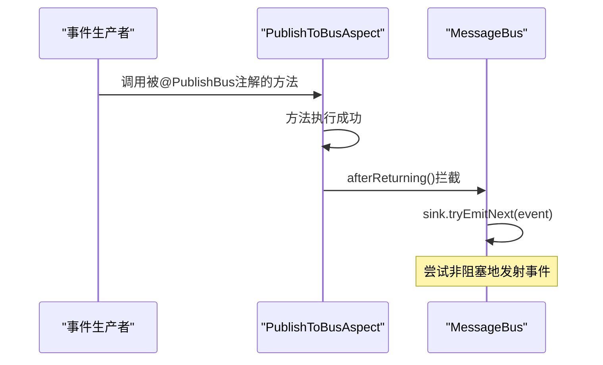
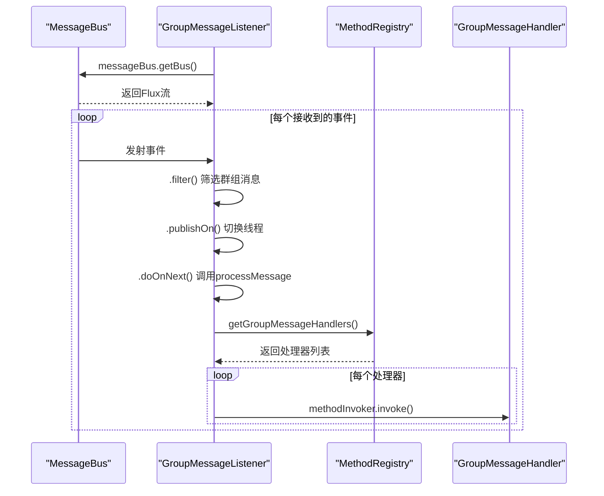
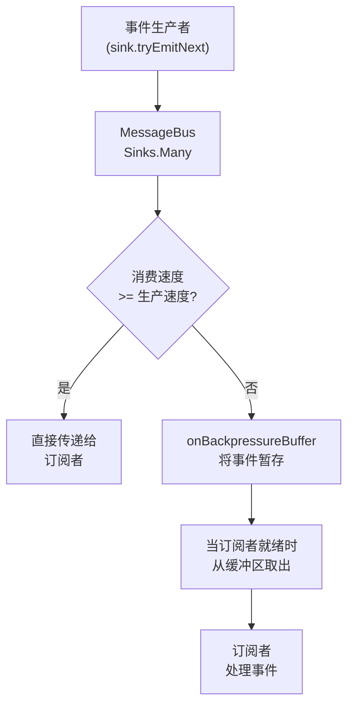
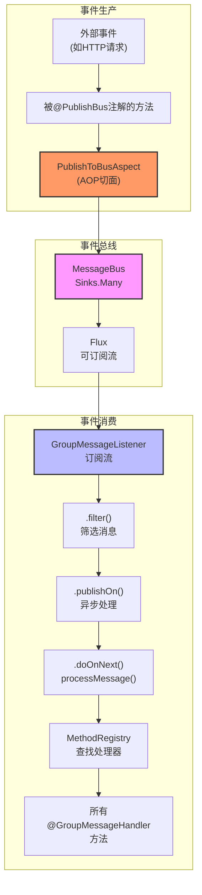

# 事件总线机制

<cite>
**Referenced Files in This Document**   
- [MessageBus.java](file://bot/src/main/java/com/shuanglin/framework/bus/MessageBus.java)
- [GroupMessageListener.java](file://bot/src/main/java/com/shuanglin/framework/listener/GroupMessageListener.java)
- [PublishToBusAspect.java](file://bot/src/main/java/com/shuanglin/framework/aop/PublishToBusAspect.java)
</cite>

## 目录
1. [引言](#引言)
2. [核心组件分析](#核心组件分析)
3. [事件发布机制](#事件发布机制)
4. [事件订阅与处理流程](#事件订阅与处理流程)
5. [响应式流与背压机制](#响应式流与背压机制)
6. [系统架构与交互](#系统架构与交互)
7. [设计优势与系统价值](#设计优势与系统价值)
8. [结论](#结论)

## 引言
本文档旨在深入解析基于Reactor Sinks实现的响应式事件总线（MessageBus）机制。该机制是系统实现异步解耦、高效消息分发的核心组件。通过分析`MessageBus`、`GroupMessageListener`等关键类，本文将详细阐述事件的发布、订阅、过滤与处理全过程，以及背压缓冲等保障系统稳定性的设计。

## 核心组件分析

本节分析事件总线架构中的核心组件及其职责。

### MessageBus 组件
`MessageBus`是整个系统消息通信的中枢，作为单例全局存在，负责所有消息的接收与广播。它利用Reactor框架的Sinks组件，构建了一个高性能、响应式的事件发布-订阅通道。

**Section sources**
- [MessageBus.java](file://bot/src/main/java/com/shuanglin/framework/bus/MessageBus.java#L12-L36)

### GroupMessageListener 组件
`GroupMessageListener`是事件总线的主要订阅者之一，专门负责处理群组消息。它在Spring容器完成依赖注入后，通过`@PostConstruct`注解触发的`subscribe()`方法，主动向`MessageBus`发起订阅，建立消息接收通道。

**Section sources**
- [GroupMessageListener.java](file://bot/src/main/java/com/shuanglin/framework/listener/GroupMessageListener.java#L13-L49)

### PublishToBusAspect 组件
`PublishToBusAspect`是一个切面（Aspect），它通过AOP技术，将带有`@PublishBus`注解的方法的返回值自动发布到`MessageBus`上。这极大地简化了事件发布者的代码，实现了发布逻辑与业务逻辑的解耦。

**Section sources**
- [PublishToBusAspect.java](file://bot/src/main/java/com/shuanglin/framework/aop/PublishToBusAspect.java#L1-L46)

## 事件发布机制

事件发布是消息总线的第一步，由生产者将消息推送到总线。

### 发布原理
事件发布的核心在于`MessageBus`类中的`publish()`方法。该方法接收一个`JsonObject`类型的事件对象，并调用其内部的`sink`对象的`tryEmitNext()`方法。

`tryEmitNext()`是Reactor Sinks提供的一个非阻塞方法。它会尝试将事件作为下一个元素发射到流中。如果此时有订阅者且缓冲区未满，事件将被立即传递；如果缓冲区已满或没有订阅者，`tryEmitNext()`会立即返回一个失败状态（如`FAIL_OVERFLOW`），而不会阻塞调用线程，从而保证了发布者的响应性。

**Diagram sources**
- [MessageBus.java](file://bot/src/main/java/com/shuanglin/framework/bus/MessageBus.java#L24-L26)
- [PublishToBusAspect.java](file://bot/src/main/java/com/shuanglin/framework/aop/PublishToBusAspect.java#L35-L45)

**Section sources**
- [MessageBus.java](file://bot/src/main/java/com/shuanglin/framework/bus/MessageBus.java#L24-L26)

## 事件订阅与处理流程

事件订阅是消息总线的第二步，由消费者从总线接收并处理消息。

### 订阅与处理流程
`GroupMessageListener`的`subscribe()`方法是订阅流程的起点。该方法通过调用`messageBus.getBus()`获取到一个`Flux<JsonObject>`流，然后对该流进行一系列操作：

1.  **过滤（Filter）**: 使用`.filter()`操作符，根据`post_type`和`message_type`字段筛选出类型为“群组消息”的事件。
2.  **异步化（PublishOn）**: 使用`.publishOn(Schedulers.boundedElastic())`将后续的消息处理操作调度到一个独立的、有界弹性的线程池中执行。这确保了消息处理的耗时操作不会阻塞事件总线本身，保障了总线的高吞吐量。
3.  **处理（DoOnNext）**: 使用`.doOnNext()`操作符，在每次接收到一个符合条件的事件时，执行`processMessage()`方法。该方法将`JsonObject`反序列化为`GroupMessageEvent`对象，并通过`MethodRegistry`和`MethodInvoker`调用所有注册的`@GroupMessageHandler`方法。

**Diagram sources**
- [GroupMessageListener.java](file://bot/src/main/java/com/shuanglin/framework/listener/GroupMessageListener.java#L23-L39)
- [GroupMessageListener.java](file://bot/src/main/java/com/shuanglin/framework/listener/GroupMessageListener.java#L41-L48)

**Section sources**
- [GroupMessageListener.java](file://bot/src/main/java/com/shuanglin/framework/listener/GroupMessageListener.java#L23-L39)

## 响应式流与背压机制

响应式流（Reactive Streams）和背压（Backpressure）是保障系统稳定性的关键技术。

### 响应式流
`MessageBus`通过`getBus()`方法返回一个`Flux<JsonObject>`对象。`Flux`是Reactor框架中的一个核心概念，代表一个可以发射0到N个元素的异步数据流。订阅者（如`GroupMessageListener`）通过`subscribe()`方法订阅这个流，从而建立起“发布-订阅”关系。这种模式实现了生产者与消费者之间的完全解耦。

### 背压缓冲机制
在`MessageBus`的`sink`字段定义中，`Sinks.many().multicast().onBackpressureBuffer()`是关键。

*   **`Sinks.many()`**: 创建一个可以向多个订阅者广播的Sinks。
*   **`multicast()`**: 明确指定为多播模式，允许多个订阅者同时接收消息。
*   **`onBackpressureBuffer()`**: 这是背压策略。当消息的生产速度超过消费速度时，该策略会将多余的消息暂时存储在一个无限大小的缓冲区中。这防止了快速的生产者压垮慢速的消费者，避免了`OutOfMemoryError`。虽然缓冲区理论上无限，但在实际应用中，需要监控系统内存，必要时可配置有界缓冲区。

**Diagram sources**
- [MessageBus.java](file://bot/src/main/java/com/shuanglin/framework/bus/MessageBus.java#L17-L17)

**Section sources**
- [MessageBus.java](file://bot/src/main/java/com/shuanglin/framework/bus/MessageBus.java#L17-L17)

## 系统架构与交互

本节通过一个综合图景，展示各核心组件如何协同工作。

**Diagram sources**
- [MessageBus.java](file://bot/src/main/java/com/shuanglin/framework/bus/MessageBus.java#L12-L36)
- [GroupMessageListener.java](file://bot/src/main/java/com/shuanglin/framework/listener/GroupMessageListener.java#L13-L49)
- [PublishToBusAspect.java](file://bot/src/main/java/com/shuanglin/framework/aop/PublishToBusAspect.java#L1-L46)

## 设计优势与系统价值

该事件总线设计带来了显著的优势：

*   **异步解耦**: 生产者无需知道消费者的任何信息，只需将事件发布到总线。消费者也无需知道生产者，只需订阅自己关心的事件。这极大地降低了模块间的耦合度。
*   **高效分发**: 基于Reactor的响应式流，能够以极高的吞吐量处理大量并发事件。
*   **可扩展性**: 可以轻松地添加新的生产者（通过`@PublishBus`）和消费者（通过`@GroupMessageHandler`），而无需修改现有代码。
*   **响应能力**: 非阻塞的发布和异步处理确保了系统的高响应性，即使在高负载下也能保持稳定。
*   **稳定性**: 背压缓冲机制有效应对了生产消费速度不匹配的问题，防止了系统崩溃。

## 结论

基于Reactor Sinks实现的`MessageBus`是一个高效、稳定、可扩展的响应式事件总线。它通过`sink.tryEmitNext()`实现非阻塞事件发布，通过`sink.asFlux()`提供可订阅的消息流，并结合`onBackpressureBuffer`机制保障系统稳定性。`GroupMessageListener`等组件通过订阅该流，实现了对特定事件的异步、解耦处理。这一设计是构建高性能、高可用性系统的基石。