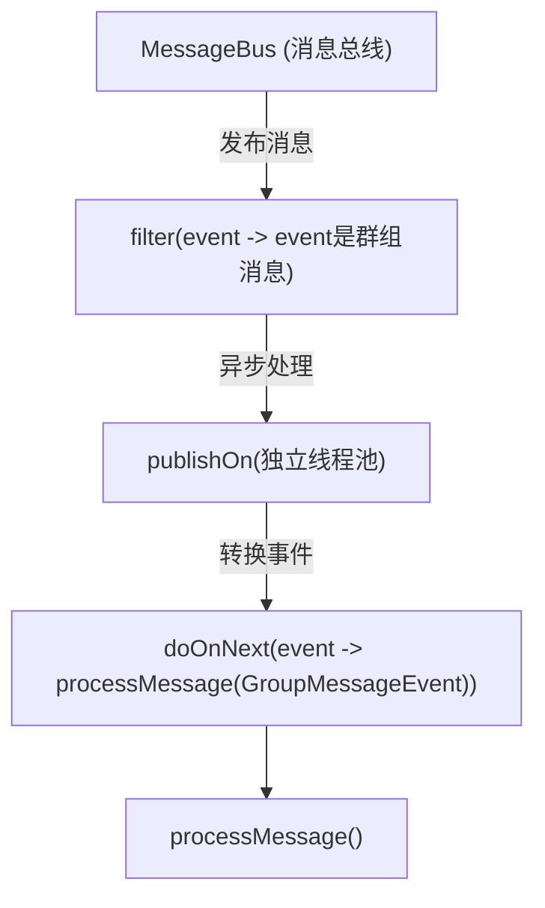
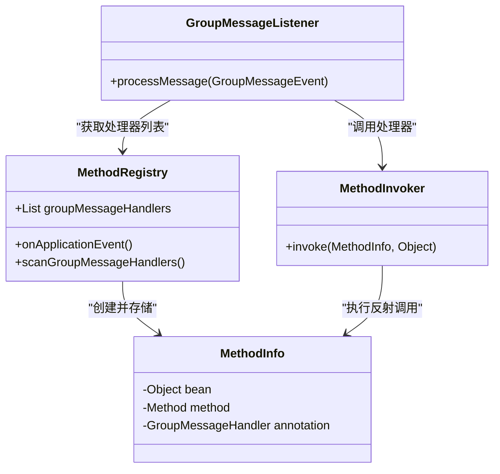
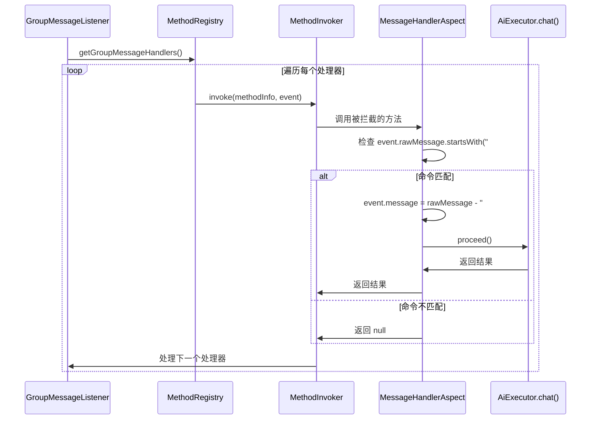
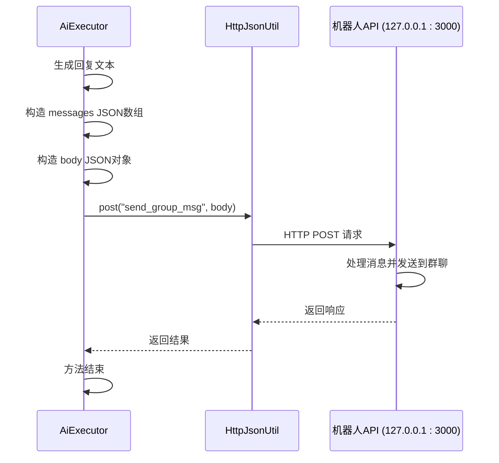

# 命令解析与执行逻辑

<cite>
**Referenced Files in This Document**   
- [GroupMessageListener.java](file://bot/src/main/java/com/shuanglin/framework/listener/GroupMessageListener.java)
- [MethodRegistry.java](file://bot/src/main/java/com/shuanglin/framework/registry/MethodRegistry.java)
- [MessageBus.java](file://bot/src/main/java/com/shuanglin/framework/bus/MessageBus.java)
- [AiExecutor.java](file://bot/src/main/java/com/shuanglin/executor/AiExecutor.java)
- [GroupMessageHandler.java](file://bot/src/main/java/com/shuanglin/framework/annotation/GroupMessageHandler.java)
- [MessageHandlerAspect.java](file://bot/src/main/java/com/shuanglin/framework/aop/MessageHandlerAspect.java)
- [GroupInfoUtil.java](file://bot/src/main/java/com/shuanglin/utils/GroupInfoUtil.java)
- [GeminiAssistant.java](file://ai/src/main/java/com/shuanglin/bot/langchain4j/assistant/GeminiAssistant.java)
- [ApiModelsConfiguration.java](file://ai/src/main/java/com/shuanglin/bot/langchain4j/config/ApiModelsConfiguration.java)
- [ChatParam.java](file://bot/src/main/java/com/shuanglin/executor/vo/ChatParam.java)
</cite>

## Table of Contents
1. [消息订阅与过滤](#消息订阅与过滤)
2. [处理器注册与调用](#处理器注册与调用)
3. [命令解析与AOP拦截](#命令解析与aop拦截)
4. [业务处理与AI调用](#业务处理与ai调用)
5. [响应返回链路](#响应返回链路)

## 消息订阅与过滤

`GroupMessageListener` 是处理群组消息的核心监听器，它通过 `MessageBus` 实现了响应式的消息订阅与过滤机制。

该监听器在Spring容器完成依赖注入后，通过 `@PostConstruct` 注解触发 `subscribe()` 方法。此方法从 `MessageBus` 获取一个 `Flux<JsonObject>` 流，这是整个消息处理管道的起点。

消息流首先通过 `filter` 操作符进行筛选，只保留 `post_type` 为 `message` 且 `message_type` 为 `group` 的消息，确保监听器仅处理群组消息。随后，`publishOn(Schedulers.boundedElastic())` 操作符将后续处理任务调度到一个独立的、有界弹性的线程池中执行，有效避免了阻塞主消息总线，保证了系统的响应性。

当筛选后的消息到达时，`doOnNext` 操作符会触发 `processMessage()` 方法，并将原始的 `JsonObject` 转换为强类型的 `GroupMessageEvent` 对象进行处理。



**Diagram sources**
- [GroupMessageListener.java](file://bot/src/main/java/com/shuanglin/framework/listener/GroupMessageListener.java#L23-L39)
- [MessageBus.java](file://bot/src/main/java/com/shuanglin/framework/bus/MessageBus.java#L30-L36)

**Section sources**
- [GroupMessageListener.java](file://bot/src/main/java/com/shuanglin/framework/listener/GroupMessageListener.java#L13-L49)

## 处理器注册与调用

`MethodRegistry` 负责在应用启动时扫描并注册所有可用的消息处理器。其核心机制是监听 `ContextRefreshedEvent` 事件，该事件在Spring容器完成所有Bean的初始化后触发。

`scanGroupMessageHandlers()` 方法会遍历所有被 `@Component` 注解标记的Bean。对于每个Bean，它会获取其原始类（通过 `AopUtils.getTargetClass()` 处理代理类），并检查其声明的方法。如果发现某个方法被 `@GroupMessageHandler` 注解标记，则会创建一个 `MethodInfo` 对象，其中包含了该方法所属的Bean实例、`Method` 反射对象以及注解实例，并将其添加到 `groupMessageHandlers` 列表中。

当 `GroupMessageListener` 的 `processMessage()` 方法被调用时，它会遍历 `MethodRegistry` 中注册的所有 `groupMessageHandlers`。对于每一个处理器，它并不直接调用，而是通过 `MethodInvoker` 组件的 `invoke()` 方法进行调用。这种间接调用方式至关重要，因为它确保了Spring AOP切面（如 `MessageHandlerAspect`）能够被正确地触发。



**Diagram sources**
- [MethodRegistry.java](file://bot/src/main/java/com/shuanglin/framework/registry/MethodRegistry.java#L17-L57)
- [GroupMessageListener.java](file://bot/src/main/java/com/shuanglin/framework/listener/GroupMessageListener.java#L41-L48)

**Section sources**
- [MethodRegistry.java](file://bot/src/main/java/com/shuanglin/framework/registry/MethodRegistry.java#L17-L57)

## 命令解析与AOP拦截

`@GroupMessageHandler` 注解是定义命令处理器的关键。它包含 `startWith` 属性，用于指定命令的前缀。例如，`@GroupMessageHandler(startWith = "#chat")` 表示该处理器只响应以 `#chat` 开头的消息。

`MessageHandlerAspect` 是一个AOP切面，它使用 `@Around` 注解来拦截所有被 `@GroupMessageHandler` 标记的方法。当一个处理器方法被调用时，切面会首先执行。

切面的 `handleMessage()` 方法会从注解中获取 `startWith` 定义的命令前缀，并检查 `GroupMessageEvent` 的原始消息 (`rawMessage`) 是否以此前缀开头。如果匹配，则 `proceed` 标志为 `true`，允许方法继续执行；否则，方法调用被阻止。

此外，切面还会对消息内容进行预处理：它将命令前缀从原始消息中移除，并将剩余部分作为实际的参数 (`params`) 设置回 `GroupMessageEvent` 的 `message` 字段。这使得处理器方法可以直接访问用户输入的参数，而无需再进行字符串分割。



**Diagram sources**
- [GroupMessageHandler.java](file://bot/src/main/java/com/shuanglin/framework/annotation/GroupMessageHandler.java#L1-L31)
- [MessageHandlerAspect.java](file://bot/src/main/java/com/shuanglin/framework/aop/MessageHandlerAspect.java#L17-L47)

**Section sources**
- [MessageHandlerAspect.java](file://bot/src/main/java/com/shuanglin/framework/aop/MessageHandlerAspect.java#L17-L47)

## 业务处理与AI调用

以 `AiExecutor` 类中的 `chat()` 方法为例，详细说明业务处理流程。

1.  **用户信息获取**: 方法首先调用 `GroupInfoUtil.getGroupSenderInfo()`，该工具类根据群组ID和用户ID从Redis缓存中查询或创建用户的 `SenderInfo` 对象，其中包含了用户当前选择的AI模型等信息。
2.  **权限校验**: 接着，调用 `GroupInfoUtil.checkModelPermission()` 检查当前群组是否启用了该用户所选的模型。如果未启用，则直接返回，不进行后续处理。
3.  **AI请求构造与调用**: 通过 `JsonUtils.flatten()` 和 `Gson` 将 `ChatParam` 对象（包含 `SenderInfo` 和 `GroupMessageEvent`）转换为一个扁平化的 `JsonObject`，作为 `memoryId` 传递给 `GeminiAssistant`。同时，将预处理后的用户消息作为 `question` 参数。`GeminiAssistant` 是一个由 `langchain4j` 库生成的AI服务接口，其 `groupChat()` 方法会向Gemini模型发起请求。
4.  **AI模型配置**: `GeminiAssistant` 的Bean由 `ApiModelsConfiguration` 类中的 `geminiAssistant()` 方法创建。该配置指定了使用的 `GoogleAiGeminiChatModel`、流式模型、聊天记忆提供者（使用 `FilterMemoryStore` 存储上下文）以及检索增强组件。

```mermaid
flowchart TD
Start([chat() 方法入口]) --> GetInfo["获取用户信息<br/>getGroupSenderInfo()"]
GetInfo --> CheckPerm["校验模型权限<br/>checkModelPermission()"]
CheckPerm --> |权限通过| BuildParam["构造AI请求参数<br/>JsonUtils.flatten()"]
CheckPerm --> |权限不足| Return["直接返回"]
BuildParam --> CallAI["调用AI助手<br/>assistant.groupChat()"]
CallAI --> |配置| Config["ApiModelsConfiguration<br/>geminiAssistant()"]
Config --> |使用| Model["GoogleAiGeminiChatModel"]
Config --> |使用| Memory["FilterMemoryStore"]
Return --> End([方法退出])
CallAI --> End
```

**Diagram sources**
- [AiExecutor.java](file://bot/src/main/java/com/shuanglin/executor/AiExecutor.java#L36-L56)
- [GroupInfoUtil.java](file://bot/src/main/java/com/shuanglin/utils/GroupInfoUtil.java#L77-L100)
- [ApiModelsConfiguration.java](file://ai/src/main/java/com/shuanglin/bot/langchain4j/config/ApiModelsConfiguration.java#L147-L165)

**Section sources**
- [AiExecutor.java](file://bot/src/main/java/com/shuanglin/executor/AiExecutor.java#L23-L94)
- [GroupInfoUtil.java](file://bot/src/main/java/com/shuanglin/utils/GroupInfoUtil.java#L20-L115)

## 响应返回链路

AI模型生成回复后，`chat()` 方法会将结果通过HTTP接口发送回群聊。

1.  **构建响应消息**: 方法将AI生成的回复文本 (`answer`) 封装成一个符合消息协议的 `JsonObject` 结构。这包括创建一个包含文本内容的 `data` 对象，以及一个包含消息类型和数据的 `messages` 数组。
2.  **构建请求体**: 将 `messages` 数组和目标群组ID (`group_id`) 组合成最终的HTTP请求体 (`body`)。
3.  **发送HTTP请求**: 使用 `HttpJsonUtil.post()` 工具类，向本地运行的 `http://127.0.0.1:3000/send_group_msg` 接口发起POST请求，将构建好的消息体发送出去。该接口通常由一个机器人框架（如go-cqhttp）提供，负责将消息实际发送到对应的群聊中。



**Diagram sources**
- [AiExecutor.java](file://bot/src/main/java/com/shuanglin/executor/AiExecutor.java#L36-L56)

**Section sources**
- [AiExecutor.java](file://bot/src/main/java/com/shuanglin/executor/AiExecutor.java#L23-L94)