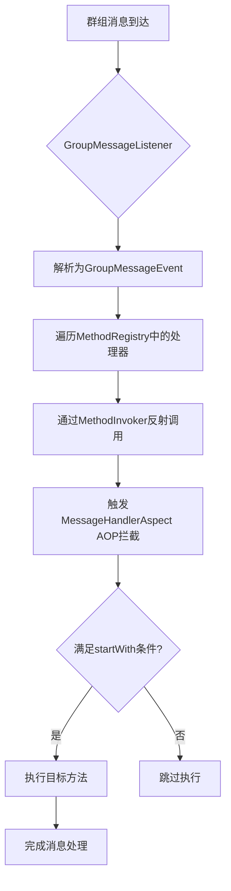
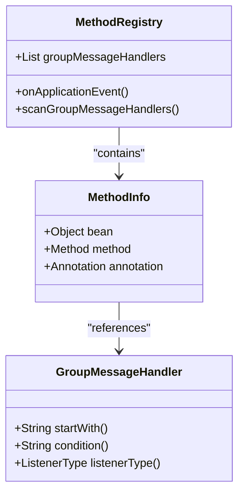
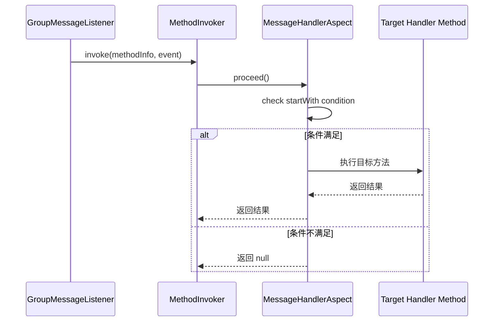

# 框架可扩展性设计

<cite>
**本文档引用的文件**  
- [GroupMessageHandler.java](file://bot/src/main/java/com/shuanglin/framework/annotation/GroupMessageHandler.java)
- [MethodRegistry.java](file://bot/src/main/java/com/shuanglin/framework/registry/MethodRegistry.java)
- [MessageHandlerAspect.java](file://bot/src/main/java/com/shuanglin/framework/aop/MessageHandlerAspect.java)
- [AiExecutor.java](file://bot/src/main/java/com/shuanglin/executor/AiExecutor.java)
- [PigGroupMessageExecutor.java](file://bot/src/main/java/com/shuanglin/executor/PigGroupMessageExecutor.java)
- [GroupMessageListener.java](file://bot/src/main/java/com/shuanglin/framework/listener/GroupMessageListener.java)
- [MethodInfo.java](file://bot/src/main/java/com/shuanglin/framework/registry/MethodInfo.java)
- [MethodInvoker.java](file://bot/src/main/java/com/shuanglin/framework/registry/MethodInvoker.java)
</cite>

## 目录
1. [引言](#引言)
2. [核心机制概述](#核心机制概述)
3. [注解驱动的消息处理](#注解驱动的消息处理)
4. [自动注册机制](#自动注册机制)
5. [AOP拦截与条件执行](#aop拦截与条件执行)
6. [消息分发与调用流程](#消息分发与调用流程)
7. [可扩展性分析](#可扩展性分析)
8. [未来功能扩展示例](#未来功能扩展示例)
9. [架构优势总结](#架构优势总结)

## 引言
该消息处理框架通过注解驱动和反射机制实现了高度可扩展性。开发者无需修改核心代码，即可通过在任意`@Component`类中添加`@GroupMessageHandler`注解方法来响应不同的群聊指令（如`#发布模型`、`#选择模型`）。本文件详细说明该设计如何通过自动扫描、AOP拦截和反射调用实现即插即用的模块化架构。

## 核心机制概述
框架通过`@GroupMessageHandler`注解标记消息处理器方法，并利用Spring的`ApplicationContext`在容器初始化完成后自动扫描所有组件类中的注解方法。这些方法被注册到`MethodRegistry`中，由`GroupMessageListener`监听消息总线并触发调用。整个过程无需手动配置，体现了松耦合与高内聚的设计原则。



**Diagram sources**  
- [GroupMessageListener.java](file://bot/src/main/java/com/shuanglin/framework/listener/GroupMessageListener.java#L30-L45)
- [MethodRegistry.java](file://bot/src/main/java/com/shuanglin/framework/registry/MethodRegistry.java#L24-L56)
- [MessageHandlerAspect.java](file://bot/src/main/java/com/shuanglin/framework/aop/MessageHandlerAspect.java#L27-L46)

## 注解驱动的消息处理
`@GroupMessageHandler`是一个运行时注解，用于标识处理群组消息的方法。其核心属性包括：
- `startWith`: 定义消息前缀，用于快速匹配指令（如`#发布模型`）
- `condition`: 支持SpEL表达式进行动态条件判断
- `listenerType`: 定义监听器行为模式

开发者只需在任意Spring管理的Bean中定义方法并添加该注解，即可将其注册为消息处理器。

**Section sources**  
- [GroupMessageHandler.java](file://bot/src/main/java/com/shuanglin/framework/annotation/GroupMessageHandler.java#L13-L31)

## 自动注册机制
`MethodRegistry`在Spring容器刷新完成时（`ContextRefreshedEvent`）自动扫描所有带有`@Component`注解的Bean，查找其中被`@GroupMessageHandler`标注的方法，并将其元数据封装为`MethodInfo`对象存入`groupMessageHandlers`列表。

此过程完全自动化，消除了手动注册的繁琐，实现了“即插即用”的扩展能力。



**Diagram sources**  
- [MethodRegistry.java](file://bot/src/main/java/com/shuanglin/framework/registry/MethodRegistry.java#L22-L56)
- [MethodInfo.java](file://bot/src/main/java/com/shuanglin/framework/registry/MethodInfo.java#L6-L14)

**Section sources**  
- [MethodRegistry.java](file://bot/src/main/java/com/shuanglin/framework/registry/MethodRegistry.java#L22-L56)

## AOP拦截与条件执行
`MessageHandlerAspect`使用AOP环绕通知拦截所有`@GroupMessageHandler`注解的方法调用。在方法执行前，检查消息内容是否以`startWith`指定的字符串开头，并根据结果决定是否继续执行。

这种设计将通用的条件判断逻辑集中于切面中，避免了在每个处理器方法中重复编写相似代码，提升了代码复用性和可维护性。



**Diagram sources**  
- [MessageHandlerAspect.java](file://bot/src/main/java/com/shuanglin/framework/aop/MessageHandlerAspect.java#L27-L46)
- [MethodInvoker.java](file://bot/src/main/java/com/shuanglin/framework/registry/MethodInvoker.java#L5-L19)

**Section sources**  
- [MessageHandlerAspect.java](file://bot/src/main/java/com/shuanglin/framework/aop/MessageHandlerAspect.java#L27-L46)

## 消息分发与调用流程
当群组消息到达时，`GroupMessageListener`从消息总线接收事件，将其反序列化为`GroupMessageEvent`对象，并遍历`MethodRegistry`中注册的所有处理器。每个处理器通过`MethodInvoker`进行反射调用，触发AOP拦截逻辑，最终执行匹配的业务方法。

该流程解耦了消息监听与业务处理，使得新增功能无需改动监听器代码。

**Section sources**  
- [GroupMessageListener.java](file://bot/src/main/java/com/shuanglin/framework/listener/GroupMessageListener.java#L30-L45)

## 可扩展性分析
当前已有多个执行器类展示了该框架的可扩展性：
- `AiExecutor`: 处理`#chat`、`#发布模型`、`#选择模型`等AI相关指令
- `PigGroupMessageExecutor`: 响应“渚”前缀的消息，发送随机图片

任何新功能模块（如投票、提醒、文件分享）均可通过创建新的`@Component`类并添加`@GroupMessageHandler`方法实现，无需修改核心框架代码。

```mermaid
flowchart LR
A[AiExecutor] --> |@GroupMessageHandler("#发布模型")| B[发布模型功能]
C[PigGroupMessageExecutor] --> |@GroupMessageHandler("渚")| D[发送小猪图片]
E[NewExecutor] --> |@GroupMessageHandler("#投票")| F[发起投票]
G[NewExecutor] --> |@GroupMessageHandler("#提醒")| H[设置提醒]
```

**Diagram sources**  
- [AiExecutor.java](file://bot/src/main/java/com/shuanglin/executor/AiExecutor.java#L36-L92)
- [PigGroupMessageExecutor.java](file://bot/src/main/java/com/shuanglin/executor/PigGroupMessageExecutor.java#L29-L45)

**Section sources**  
- [AiExecutor.java](file://bot/src/main/java/com/shuanglin/executor/AiExecutor.java#L36-L92)
- [PigGroupMessageExecutor.java](file://bot/src/main/java/com/shuanglin/executor/PigGroupMessageExecutor.java#L29-L45)

## 未来功能扩展示例
假设需要新增“投票”功能，开发者仅需编写如下代码：

```java
@Component
public class VoteExecutor {
    @GroupMessageHandler(startWith = "#投票")
    public void createVote(GroupMessageEvent event) {
        // 解析投票选项并创建投票
    }
}
```

该类在应用启动时会被自动扫描并注册，无需任何额外配置，充分体现了开闭原则（对扩展开放，对修改关闭）。

## 架构优势总结
该设计通过注解+反射+AOP的组合，实现了以下优势：
- **高可扩展性**：新增功能只需添加新类和方法
- **低耦合性**：核心框架与业务逻辑完全分离
- **易维护性**：通用逻辑集中在切面中统一处理
- **即插即用**：自动注册机制消除手动配置
- **灵活性强**：支持SpEL表达式进行动态条件判断

整体架构符合松耦合、高内聚的设计理念，为系统的长期演进提供了坚实基础。