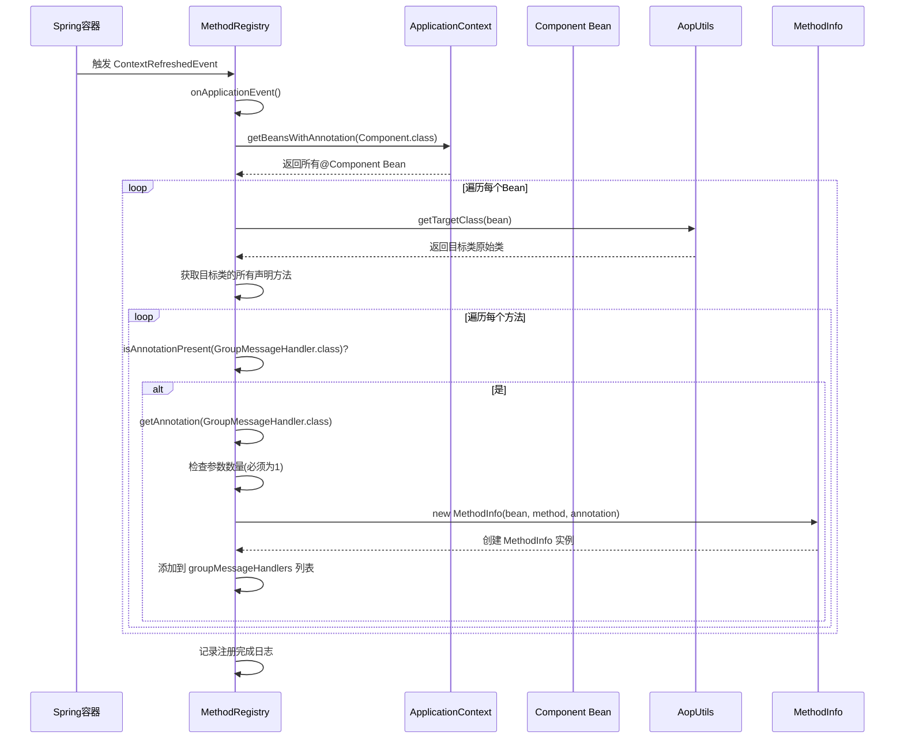
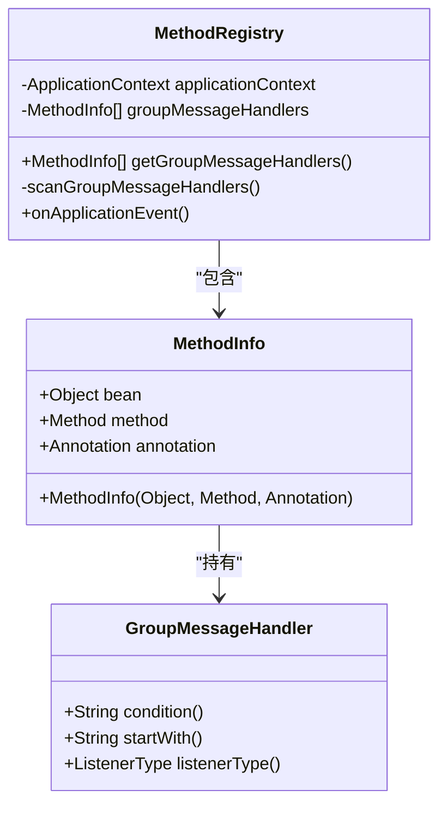
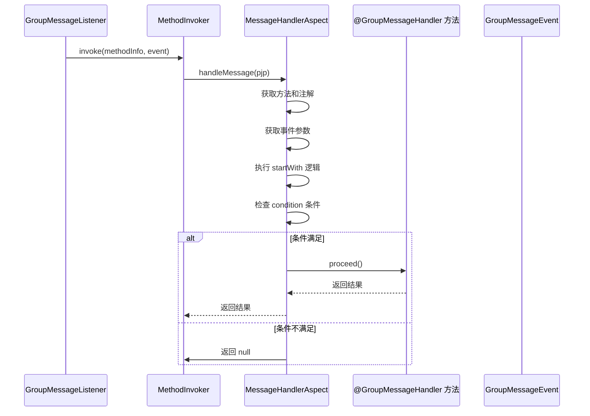
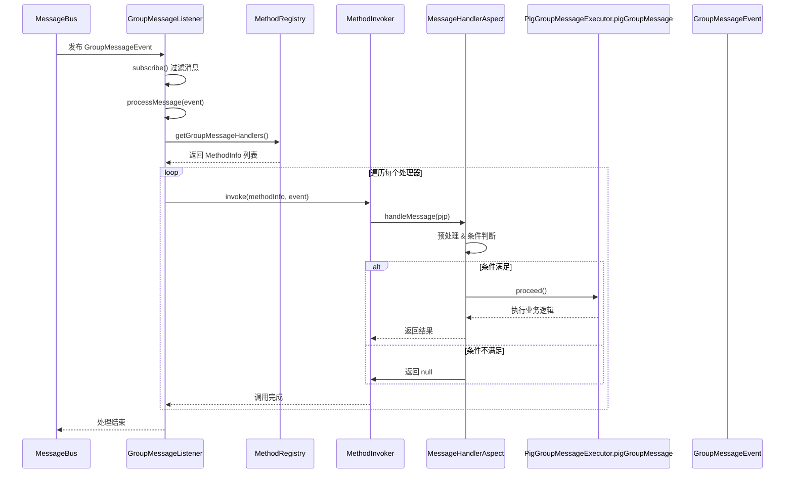

# 注解处理与方法注册

<cite>
**Referenced Files in This Document**   
- [MethodRegistry.java](file://bot/src/main/java/com/shuanglin/framework/registry/MethodRegistry.java)
- [MessageHandlerAspect.java](file://bot/src/main/java/com/shuanglin/framework/aop/MessageHandlerAspect.java)
- [GroupMessageHandler.java](file://bot/src/main/java/com/shuanglin/framework/annotation/GroupMessageHandler.java)
- [MethodInfo.java](file://bot/src/main/java/com/shuanglin/framework/registry/MethodInfo.java)
- [GroupMessageListener.java](file://bot/src/main/java/com/shuanglin/framework/listener/GroupMessageListener.java)
- [PigGroupMessageExecutor.java](file://bot/src/main/java/com/shuanglin/executor/PigGroupMessageExecutor.java)
- [AiExecutor.java](file://bot/src/main/java/com/shuanglin/executor/AiExecutor.java)
</cite>

## 目录
1. [引言](#引言)
2. [核心组件](#核心组件)
3. [方法注册流程](#方法注册流程)
4. [处理器元信息管理](#处理器元信息管理)
5. [切面拦截与执行流程](#切面拦截与执行流程)
6. [完整调用序列图](#完整调用序列图)
7. [结论](#结论)

## 引言
本文档深入分析了基于Spring框架的机器人系统中，`MethodRegistry`组件如何在容器启动完成后，通过事件监听机制自动扫描并注册消息处理器。重点阐述了`@GroupMessageHandler`注解驱动的处理器发现、元数据封装、以及AOP切面拦截的完整执行流程。该机制实现了处理器的声明式注册与条件化执行，为系统的可扩展性和灵活性提供了基础。

## 核心组件
系统围绕注解处理与方法调用构建了多个核心组件，各司其职，协同工作。

**Section sources**
- [MethodRegistry.java](file://bot/src/main/java/com/shuanglin/framework/registry/MethodRegistry.java)
- [MessageHandlerAspect.java](file://bot/src/main/java/com/shuanglin/framework/aop/MessageHandlerAspect.java)
- [GroupMessageHandler.java](file://bot/src/main/java/com/shuanglin/framework/annotation/GroupMessageHandler.java)

## 方法注册流程

`MethodRegistry`是整个处理器注册机制的核心。它利用Spring的事件驱动模型，在容器完成刷新后自动触发扫描。

**Diagram sources**
- [MethodRegistry.java](file://bot/src/main/java/com/shuanglin/framework/registry/MethodRegistry.java#L17-L57)

**Section sources**
- [MethodRegistry.java](file://bot/src/main/java/com/shuanglin/framework/registry/MethodRegistry.java#L17-L57)

### 事件监听与扫描触发
`MethodRegistry`通过`@EventListener(ContextRefreshedEvent.class)`注解，监听Spring容器的`ContextRefreshedEvent`事件。该事件在所有Bean都已初始化并配置完成后触发，确保了此时可以安全地获取和检查所有`@Component` Bean。

### 代理对象与真实类解析
由于Spring AOP的存在，许多Bean实际上是代理对象。直接在代理类上反射无法找到原始的`@GroupMessageHandler`注解方法。`MethodRegistry`通过`AopUtils.getTargetClass(bean)`方法，成功获取到被代理的原始目标类，从而能够正确地遍历其所有声明方法。

### 注解方法发现
对于每个目标类，`MethodRegistry`遍历其所有声明方法（`getDeclaredMethods()`），检查方法上是否直接存在`@GroupMessageHandler`注解（`isAnnotationPresent()`）。一旦发现，便进行后续处理。

## 处理器元信息管理

为了在运行时高效地调用处理器，系统将处理器的元数据封装在`MethodInfo`对象中，并由`MethodRegistry`统一管理。

**Diagram sources**
- [MethodInfo.java](file://bot/src/main/java/com/shuanglin/framework/registry/MethodInfo.java#L6-L14)
- [MethodRegistry.java](file://bot/src/main/java/com/shuanglin/framework/registry/MethodRegistry.java#L17-L57)

**Section sources**
- [MethodInfo.java](file://bot/src/main/java/com/shuanglin/framework/registry/MethodInfo.java#L6-L14)
- [MethodRegistry.java](file://bot/src/main/java/com/shuanglin/framework/registry/MethodRegistry.java#L17-L57)

### MethodInfo对象构建
当发现一个带有`@GroupMessageHandler`注解的方法时，`MethodRegistry`会创建一个`MethodInfo`记录（record）。该记录是一个不可变的数据载体，封装了三个关键信息：
- **目标Bean (`bean`)**: 该方法所属的Spring Bean实例，用于后续的反射调用。
- **Method反射对象 (`method`)**: `java.lang.reflect.Method`对象，代表了该处理器方法本身，是执行反射调用的入口。
- **注解实例 (`annotation`)**: `@GroupMessageHandler`注解的实例，包含了`condition`、`startWith`和`listenerType`等配置信息。

### groupMessageHandlers列表
`MethodRegistry`内部维护一个`List<MethodInfo>`类型的`groupMessageHandlers`列表。所有成功注册的处理器元信息都会被添加到此列表中。该列表是公开的（通过`@Getter`），允许其他组件（如`GroupMessageListener`）在消息到达时遍历并获取所有可用的处理器。

## 切面拦截与执行流程

`MessageHandlerAspect`是一个AOP切面，它负责在处理器方法实际执行前进行拦截，根据注解配置进行条件判断和预处理。

**Diagram sources**
- [MessageHandlerAspect.java](file://bot/src/main/java/com/shuanglin/framework/aop/MessageHandlerAspect.java#L17-L47)
- [GroupMessageListener.java](file://bot/src/main/java/com/shuanglin/framework/listener/GroupMessageListener.java#L13-L49)

**Section sources**
- [MessageHandlerAspect.java](file://bot/src/main/java/com/shuanglin/framework/aop/MessageHandlerAspect.java#L17-L47)
- [GroupMessageListener.java](file://bot/src/main/java/com/shuanglin/framework/listener/GroupMessageListener.java#L13-L49)

### 切点定义
`MessageHandlerAspect`通过`@Around("@annotation(com.shuanglin.framework.annotation.GroupMessageHandler)")`定义了一个环绕通知（Around Advice），该通知会拦截所有被`@GroupMessageHandler`注解标记的方法调用。

### 拦截逻辑
当一个处理器方法被调用时，控制权首先转移到`MessageHandlerAspect`的`handleMessage`方法。该方法接收一个`ProceedingJoinPoint`（pjp），它封装了被拦截方法的上下文。
1.  **获取上下文**: 从`pjp`中获取`MethodSignature`和`Method`对象，并提取`@GroupMessageHandler`注解。
2.  **参数处理**: 从`pjp.getArgs()`中获取方法参数，即`GroupMessageEvent`。根据注解的`startWith`属性，对消息内容进行预处理（如去除命令前缀）。
3.  **条件判断**: 结合`startWith`的结果和`condition`属性（SpEL表达式，当前代码中未实际解析），决定是否允许方法继续执行。
4.  **执行决策**: 如果所有条件都满足（`proceed`为`true`），则调用`pjp.proceed()`放行，执行目标处理器方法；否则，返回`null`，阻止方法执行。

## 完整调用序列图

以下序列图展示了从消息到达至处理器执行的完整流程。

**Diagram sources**
- [GroupMessageListener.java](file://bot/src/main/java/com/shuanglin/framework/listener/GroupMessageListener.java#L13-L49)
- [MethodRegistry.java](file://bot/src/main/java/com/shuanglin/framework/registry/MethodRegistry.java#L17-L57)
- [MessageHandlerAspect.java](file://bot/src/main/java/com/shuanglin/framework/aop/MessageHandlerAspect.java#L17-L47)
- [PigGroupMessageExecutor.java](file://bot/src/main/java/com/shuanglin/executor/PigGroupMessageExecutor.java#L19-L38)

## 结论
该系统通过`MethodRegistry`的事件监听和反射扫描，实现了`@GroupMessageHandler`注解处理器的自动发现与注册。`MethodInfo`对象有效地封装了处理器的元数据，而`MessageHandlerAspect`切面则提供了强大的拦截能力，支持命令前缀匹配和条件化执行。`GroupMessageListener`作为消息的最终消费者，协调`MethodRegistry`和`MethodInvoker`，触发所有匹配的处理器。这一设计模式清晰地分离了关注点，使得添加新的消息处理器变得极为简单，只需在`@Component` Bean中添加一个带`@GroupMessageHandler`注解的方法即可，极大地提升了系统的可维护性和扩展性。