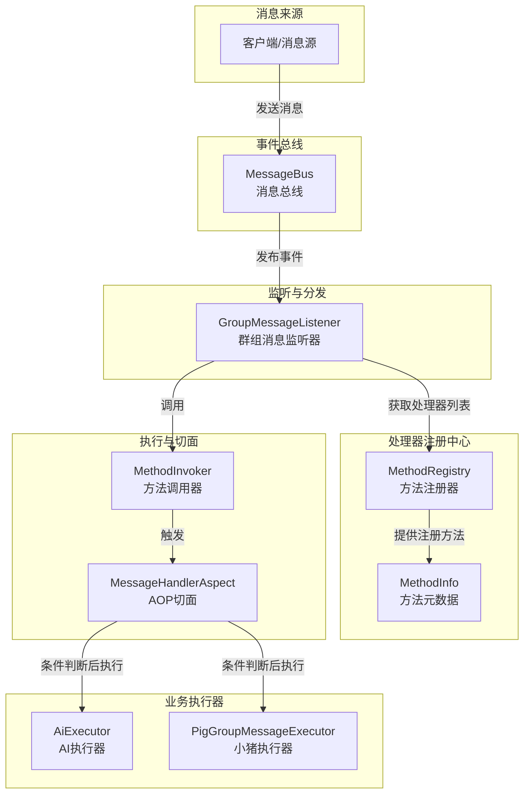
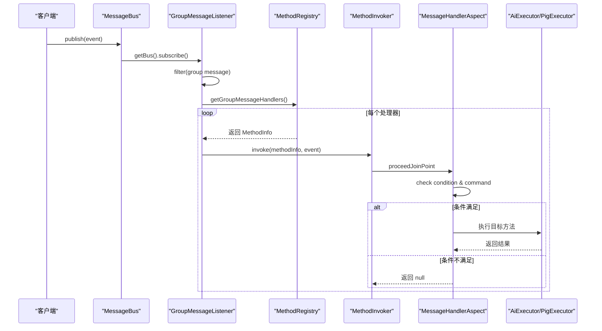
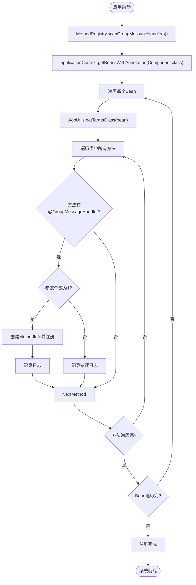

# 消息处理框架

<cite>
**本文档中引用的文件**  
- [MessageBus.java](file://bot/src/main/java/com/shuanglin/framework/bus/MessageBus.java)
- [GroupMessageEvent.java](file://bot/src/main/java/com/shuanglin/framework/bus/event/GroupMessageEvent.java)
- [GroupMessageHandler.java](file://bot/src/main/java/com/shuanglin/framework/annotation/GroupMessageHandler.java)
- [MessageHandlerAspect.java](file://bot/src/main/java/com/shuanglin/framework/aop/MessageHandlerAspect.java)
- [MethodRegistry.java](file://bot/src/main/java/com/shuanglin/framework/registry/MethodRegistry.java)
- [MethodInvoker.java](file://bot/src/main/java/com/shuanglin/framework/registry/MethodInvoker.java)
- [GroupMessageListener.java](file://bot/src/main/java/com/shuanglin/framework/listener/GroupMessageListener.java)
- [AiExecutor.java](file://bot/src/main/java/com/shuanglin/executor/AiExecutor.java)
- [PigGroupMessageExecutor.java](file://bot/src/main/java/com/shuanglin/executor/PigGroupMessageExecutor.java)
- [BotStart.java](file://bot/src/main/java/com/shuanglin/BotStart.java)
</cite>

## 目录
1. [简介](#简介)
2. [核心架构概览](#核心架构概览)
3. [事件驱动机制](#事件驱动机制)
4. [处理器注册与扫描](#处理器注册与扫描)
5. [消息路由与切面处理](#消息路由与切面处理)
6. [命令解析与执行](#命令解析与执行)
7. [可扩展性分析](#可扩展性分析)
8. [总结](#总结)

## 简介
本框架旨在为机器人系统提供一个灵活、可扩展的消息处理机制。通过事件驱动架构，系统能够高效地接收、过滤和分发群组消息，并基于注解自动路由到相应的业务执行器。该设计支持动态添加消息处理器，便于功能扩展。

## 核心架构概览

**图示来源**  
- [MessageBus.java](file://bot/src/main/java/com/shuanglin/framework/bus/MessageBus.java)
- [GroupMessageListener.java](file://bot/src/main/java/com/shuanglin/framework/listener/GroupMessageListener.java)
- [MethodRegistry.java](file://bot/src/main/java/com/shuanglin/framework/registry/MethodRegistry.java)
- [MessageHandlerAspect.java](file://bot/src/main/java/com/shuanglin/framework/aop/MessageHandlerAspect.java)
- [AiExecutor.java](file://bot/src/main/java/com/shuanglin/executor/AiExecutor.java)
- [PigGroupMessageExecutor.java](file://bot/src/main/java/com/shuanglin/executor/PigGroupMessageExecutor.java)

## 事件驱动机制

系统采用响应式编程模型，通过 `MessageBus` 实现全局消息广播。所有消息以 `JsonObject` 形式在总线上流动，使用 Reactor 的 `Sinks.Many` 提供背压支持的多播能力。

`GroupMessageListener` 订阅总线流，过滤出类型为 `message` 且子类型为 `group` 的事件，将其反序列化为 `GroupMessageEvent` 对象并进行后续处理。

**图示来源**  
- [MessageBus.java](file://bot/src/main/java/com/shuanglin/framework/bus/MessageBus.java#L12-L36)
- [GroupMessageListener.java](file://bot/src/main/java/com/shuanglin/framework/listener/GroupMessageListener.java#L20-L49)
- [MessageHandlerAspect.java](file://bot/src/main/java/com/shuanglin/framework/aop/MessageHandlerAspect.java#L17-L47)

## 处理器注册与扫描

`MethodRegistry` 在 Spring 容器刷新完成后（`ContextRefreshedEvent`）自动扫描所有带有 `@Component` 注解的 Bean，查找其中被 `@GroupMessageHandler` 注解标记的方法。

对于每个符合条件的方法，框架会创建一个 `MethodInfo` 记录对象，包含目标 Bean 实例、方法引用及注解实例，并将其加入 `groupMessageHandlers` 列表中，供后续调用使用。

**图示来源**  
- [MethodRegistry.java](file://bot/src/main/java/com/shuanglin/framework/registry/MethodRegistry.java#L17-L57)
- [MethodInfo.java](file://bot/src/main/java/com/shuanglin/framework/registry/MethodInfo.java)

## 消息路由与切面处理

`MessageHandlerAspect` 是一个 AOP 切面，通过 `@Around` 注解拦截所有 `@GroupMessageHandler` 标记的方法调用。它在方法执行前进行条件判断和命令匹配：

1. 获取注解中的 `startWith` 值作为命令前缀
2. 检查消息原始内容是否以此前缀开头
3. 若匹配，则从原始消息中去除命令部分，更新 `GroupMessageEvent` 的 `message` 字段
4. 根据 `condition` SpEL 表达式进一步判断是否执行
5. 条件满足则放行，否则阻止方法执行

此机制实现了基于注解的声明式消息路由，无需硬编码 if-else 分支。

**本节来源**  
- [MessageHandlerAspect.java](file://bot/src/main/java/com/shuanglin/framework/aop/MessageHandlerAspect.java#L17-L47)
- [GroupMessageHandler.java](file://bot/src/main/java/com/shuanglin/framework/annotation/GroupMessageHandler.java#L13-L31)

## 命令解析与执行

当用户发送如 `#chat 你好` 或 `渚` 这类消息时，系统按以下流程处理：

1. 消息经由外部服务（如 OneBot）推送至 `MessageBus`
2. `GroupMessageListener` 接收并反序列化为 `GroupMessageEvent`
3. 遍历所有注册的处理器方法
4. `MethodInvoker` 触发方法调用，进入 `MessageHandlerAspect`
5. 切面根据 `startWith` 属性判断命令匹配：
   - `AiExecutor.chat` 方法监听 `#chat` 开头的消息
   - `PigGroupMessageExecutor.pigGroupMessage` 方法监听 `渚` 开头的消息
6. 匹配成功后，执行器提取参数并调用相应业务逻辑（如调用 AI 模型或发送图片）

例如，`#chat 你好` 被解析为命令 `#chat`，参数为 `你好`，交由 `AiExecutor.chat()` 处理；而 `渚` 则触发随机发送小猪图片的功能。

**本节来源**  
- [AiExecutor.java](file://bot/src/main/java/com/shuanglin/executor/AiExecutor.java#L25-L95)
- [PigGroupMessageExecutor.java](file://bot/src/main/java/com/shuanglin/executor/PigGroupMessageExecutor.java#L21-L116)
- [MessageHandlerAspect.java](file://bot/src/main/java/com/shuanglin/framework/aop/MessageHandlerAspect.java#L17-L47)

## 可扩展性分析

该框架具有良好的可扩展性，新增消息处理器极为简便：

1. 创建新的执行器类并用 `@Component` 注册为 Spring Bean
2. 定义处理方法，添加 `@GroupMessageHandler` 注解并指定 `startWith` 命令
3. 方法参数必须为 `GroupMessageEvent` 类型
4. 启动时 `MethodRegistry` 自动扫描并注册

例如，可轻松添加 `#help`、`#image` 等新指令，无需修改任何核心代码，符合开闭原则。未来还可扩展更多事件类型（如私聊、通知等），通过定义新的注解和监听器实现。

**本节来源**  
- [AiExecutor.java](file://bot/src/main/java/com/shuanglin/executor/AiExecutor.java)
- [PigGroupMessageExecutor.java](file://bot/src/main/java/com/shuanglin/executor/PigGroupMessageExecutor.java)
- [MethodRegistry.java](file://bot/src/main/java/com/shuanglin/framework/registry/MethodRegistry.java)

## 总结

本消息处理框架基于事件驱动与 AOP 技术，实现了高内聚、低耦合的设计。通过 `MessageBus` 统一消息流，`MethodRegistry` 自动注册处理器，`MessageHandlerAspect` 实现智能路由，使得业务逻辑清晰分离。开发者只需关注具体功能实现，框架自动完成消息分发与执行，极大提升了开发效率与系统可维护性。