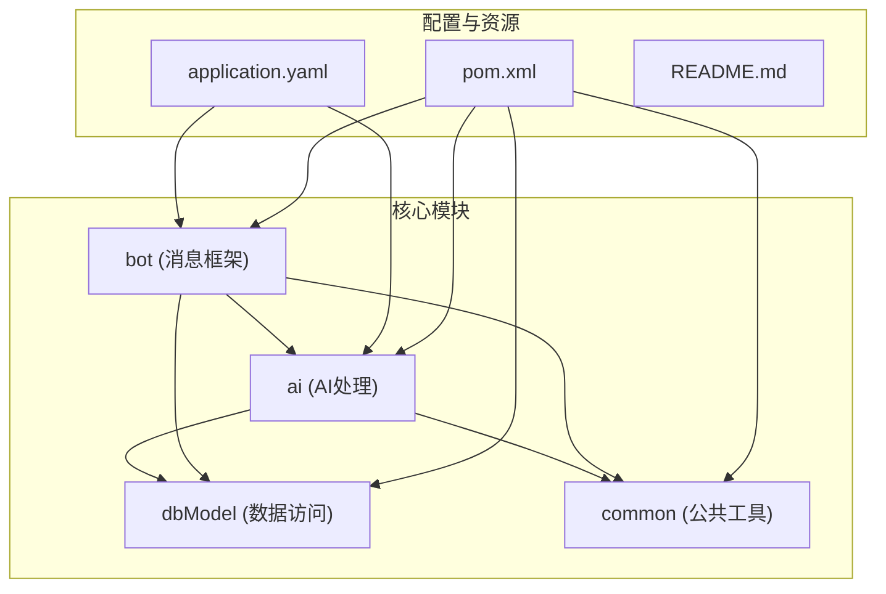
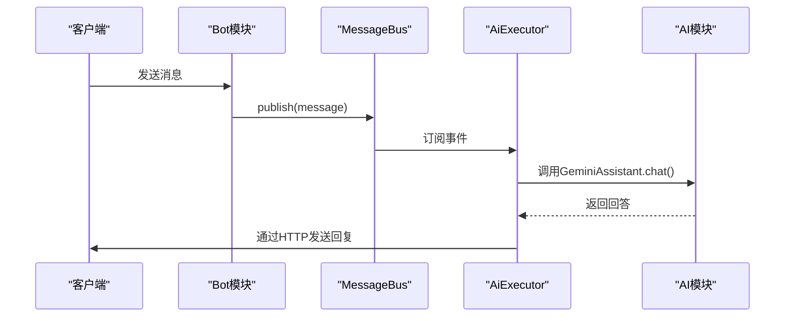
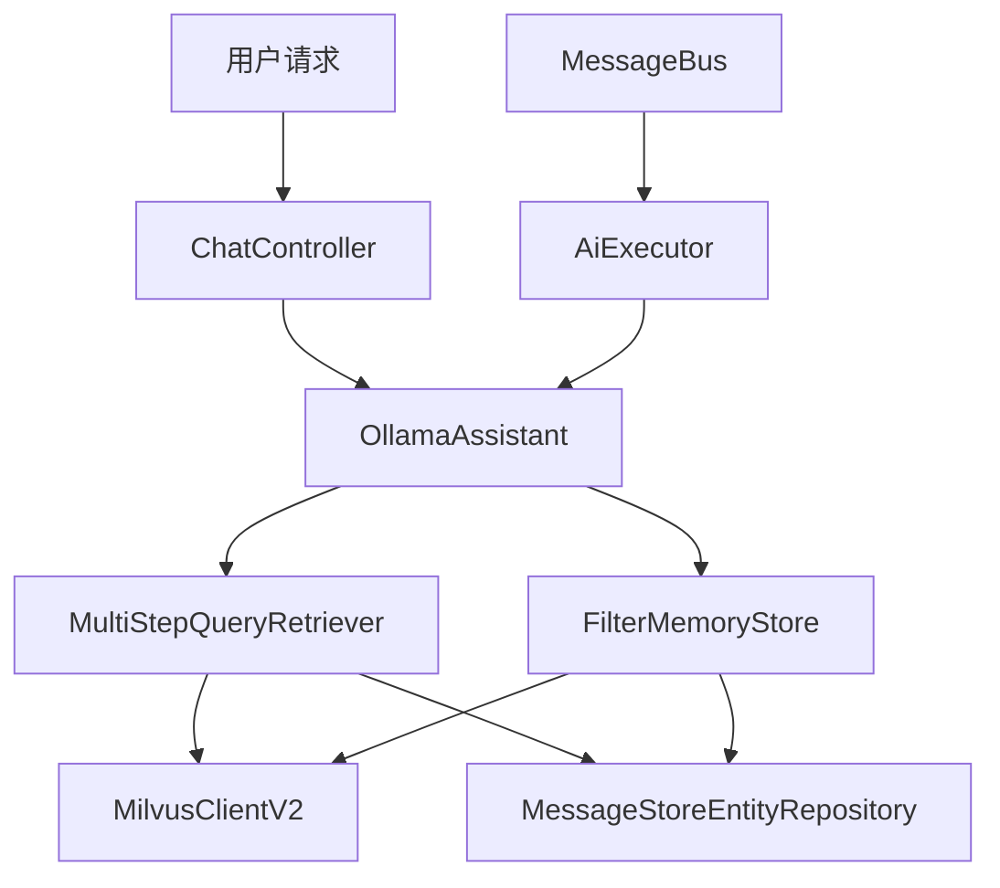

# 项目概述

<cite>
**本文档引用的文件**  
- [README.md](file://README.md)
- [ChatController.java](file://ai/src/main/java/com/shuanglin/bot/langchain4j/controller/ChatController.java)
- [ApiModelsConfiguration.java](file://ai/src/main/java/com/shuanglin/bot/langchain4j/config/ApiModelsConfiguration.java)
- [application.yaml](file://ai/src/main/resources/application.yaml)
- [MessageBus.java](file://bot/src/main/java/com/shuanglin/framework/bus/MessageBus.java)
- [MultiStepQueryRetriever.java](file://ai/src/main/java/com/shuanglin/bot/langchain4j/rag/retriever/MultiStepQueryRetriever.java)
- [FilterMemoryStore.java](file://ai/src/main/java/com/shuanglin/bot/langchain4j/store/FilterMemoryStore.java)
- [AiExecutor.java](file://bot/src/main/java/com/shuanglin/executor/AiExecutor.java)
- [BotStart.java](file://bot/src/main/java/com/shuanglin/BotStart.java)
- [Model.java](file://dbModel/src/main/java/com/shuanglin/dao/model/Model.java)
- [pom.xml](file://ai/pom.xml)
- [pom.xml](file://bot/pom.xml)
</cite>

## 目录
1. [简介](#简介)
2. [项目结构](#项目结构)
3. [核心组件](#核心组件)
4. [系统架构](#系统架构)
5. [技术愿景与设计决策](#技术愿景与设计决策)
6. [启动流程](#启动流程)
7. [结论](#结论)

## 简介

ai-studio 是一个基于 Spring Boot 构建的后端 AI 对话与检索增强生成（RAG）系统，旨在提供一个可扩展的智能聊天机器人平台。该项目支持多模型推理、多步 RAG 查询和知识库构建，适用于复杂语义理解与上下文增强的对话场景。系统通过模块化设计分离关注点，包含 AI 处理、消息事件驱动、数据访问和公共工具等核心模块。其技术演进经历了从基于会话的简单交互到无会话依赖的多步推理 RAG 的迭代过程，逐步提升系统的智能化水平和知识检索能力。

## 项目结构

ai-studio 项目采用多模块 Maven 架构，主要由 `ai`、`bot`、`dbModel` 和 `common` 四个核心模块组成，辅以配置文件和文档资源。

**图示来源**  
- [ai/pom.xml](file://ai/pom.xml)
- [bot/pom.xml](file://bot/pom.xml)
- [dbModel/pom.xml](file://dbModel/pom.xml)

**本节来源**  
- [ai/pom.xml](file://ai/pom.xml)
- [bot/pom.xml](file://bot/pom.xml)

## 核心组件

### ai 模块：LangChain4j 集成与 RAG 系统

`ai` 模块是系统的核心，负责 AI 模型集成、对话管理与检索增强生成。它通过 LangChain4j 框架封装了 Gemini、Ollama 等多种 AI 模型，并实现了多步推理 RAG 系统。

该模块通过 `ApiModelsConfiguration` 配置类定义了多个 AI 助手（`GeminiAssistant`、`OllamaAssistant`、`DecomposeAssistant`），并利用 `AiServices` 构建器模式创建代理服务。其中，`DecomposeAssistant` 专门用于将复杂查询分解为多个子问题，是实现多步 RAG 的关键。RAG 系统的核心是 `MultiStepQueryRetriever`，它首先调用 `DecomposeAssistant` 分解用户查询，然后对每个子问题进行向量检索，最终聚合结果以增强最终回答的准确性。

**本节来源**  
- [ApiModelsConfiguration.java](file://ai/src/main/java/com/shuanglin/bot/langchain4j/config/ApiModelsConfiguration.java)
- [MultiStepQueryRetriever.java](file://ai/src/main/java/com/shuanglin/bot/langchain4j/rag/retriever/MultiStepQueryRetriever.java)

### bot 模块：事件驱动的消息处理框架

`bot` 模块构建了一个基于 Spring Boot 和 Reactor 的事件驱动消息处理框架。其核心是 `MessageBus`，一个使用 `Sinks.Many<JsonObject>` 实现的全局消息总线，负责接收和广播所有消息事件。

消息处理通过注解驱动，`@GroupMessageHandler` 标记的方法会被 `MessageHandlerAspect` AOP 切面自动注册为事件监听器。当 `AiExecutor` 中的方法（如 `#chat`）被触发时，系统会调用 AI 助手生成回复，并通过 HTTP 请求将消息发送回客户端。这种设计实现了消息接收、处理和响应的完全解耦。

**图示来源**  
- [MessageBus.java](file://bot/src/main/java/com/shuanglin/framework/bus/MessageBus.java)
- [AiExecutor.java](file://bot/src/main/java/com/shuanglin/executor/AiExecutor.java)

**本节来源**  
- [MessageBus.java](file://bot/src/main/java/com/shuanglin/framework/bus/MessageBus.java)
- [AiExecutor.java](file://bot/src/main/java/com/shuanglin/executor/AiExecutor.java)

### dbModel 模块：数据访问层

`dbModel` 模块定义了系统与数据存储的接口，包括 MongoDB 和 Milvus 向量数据库。它使用 Spring Data MongoDB 和 Milvus Plus 提供了实体类（如 `MessageStoreEntity`、`Model`）和对应的 Repository 接口。

`Model` 实体用于存储和管理不同 AI 模型的元数据，如名称、描述、指令和约束。向量数据通过 `MessageEmbeddingEntity` 和 `MessageEmbeddingMapper` 存储在 Milvus 中，支持高效的相似性搜索。`FilterMemoryStore` 组件结合了 MongoDB 和 Milvus，实现了对话记忆的持久化和基于内容的检索。

**本节来源**  
- [Model.java](file://dbModel/src/main/java/com/shuanglin/dao/model/Model.java)
- [MessageEmbeddingMapper.java](file://dbModel/src/main/java/com/shuanglin/dao/milvus/MessageEmbeddingMapper.java)
- [FilterMemoryStore.java](file://ai/src/main/java/com/shuanglin/bot/langchain4j/store/FilterMemoryStore.java)

### common 模块：公共工具类

`common` 模块提供了跨模块使用的公共工具和常量，如 `JsonUtils` 用于 JSON 处理，`MongoDBConstant` 定义了数据库常量。这些工具类确保了代码的一致性和可维护性。

**本节来源**  
- [JsonUtils.java](file://common/src/main/java/com/shuanglin/utils/JsonUtils.java)

## 系统架构

系统采用典型的 Controller-Service-Repository 分层架构，并融合了事件总线机制。

**图示来源**  
- [ChatController.java](file://ai/src/main/java/com/shuanglin/bot/langchain4j/controller/ChatController.java)
- [MultiStepQueryRetriever.java](file://ai/src/main/java/com/shuanglin/bot/langchain4j/rag/retriever/MultiStepQueryRetriever.java)
- [FilterMemoryStore.java](file://ai/src/main/java/com/shuanglin/bot/langchain4j/store/FilterMemoryStore.java)

**本节来源**  
- [ChatController.java](file://ai/src/main/java/com/shuanglin/bot/langchain4j/controller/ChatController.java)
- [MultiStepQueryRetriever.java](file://ai/src/main/java/com/shuanglin/bot/langchain4j/rag/retriever/MultiStepQueryRetriever.java)

## 技术愿景与设计决策

### 技术愿景

ai-studio 的技术愿景是打造一个**可扩展的智能聊天机器人平台**。它不仅支持与单一 AI 模型的简单对话，更致力于通过多模型支持、多步推理和知识库构建，实现深度、准确和上下文相关的智能交互。平台允许用户发布和切换不同的 AI 模型，每个模型都有其独特的角色设定和行为约束，从而满足多样化的应用场景。

### 关键设计决策

1.  **选择 LangChain4j 作为 AI 框架**：LangChain4j 提供了简洁的 Java API 和强大的功能，如 `AiServices` 代理模式、RAG 模块和多种模型支持。这极大地简化了与不同 AI 模型（如 Gemini、Ollama）的集成，并为实现复杂的 RAG 流程提供了坚实的基础。

2.  **选择 Milvus 作为向量数据库**：Milvus 是一个专为海量向量相似性搜索设计的高性能数据库。在 ai-studio 中，它用于存储文本片段的嵌入向量，使得系统能够快速从庞大的知识库中检索出与用户查询最相关的内容，这是实现高效 RAG 的关键。

3.  **采用事件总线（Event Bus）机制**：通过 `MessageBus`，系统实现了松耦合的组件通信。消息的生产者（如消息接收器）无需知道具体的消费者（如 `AiExecutor`），这提高了系统的灵活性和可扩展性，便于未来添加新的消息处理器。

**本节来源**  
- [ApiModelsConfiguration.java](file://ai/src/main/java/com/shuanglin/bot/langchain4j/config/ApiModelsConfiguration.java)
- [MultiStepQueryRetriever.java](file://ai/src/main/java/com/shuanglin/bot/langchain4j/rag/retriever/MultiStepQueryRetriever.java)
- [MessageBus.java](file://bot/src/main/java/com/shuanglin/framework/bus/MessageBus.java)

## 启动流程

项目的启动流程如下：
1.  启动 `BotStart.java` 或 `StartBot.java` 主类。
2.  Spring Boot 容器初始化，加载 `application.yaml` 中的配置。
3.  依赖注入 `ApiModelsConfiguration` 中定义的 AI 模型 Bean。
4.  初始化 `MessageBus` 和事件监听器。
5.  系统启动完成，监听端口 8080，等待接收消息事件。

**本节来源**  
- [BotStart.java](file://bot/src/main/java/com/shuanglin/BotStart.java)
- [application.yaml](file://ai/src/main/resources/application.yaml)

## 结论

ai-studio 项目成功构建了一个功能丰富、架构清晰的后端 AI 对话系统。通过模块化设计和先进的技术选型，它实现了从简单聊天到复杂知识检索的跨越。其核心的多步 RAG 系统和事件驱动框架为未来的功能扩展和性能优化奠定了坚实的基础。本概述为开发者提供了系统的高层次视图，后续文档将深入探讨各模块的详细实现和最佳实践。